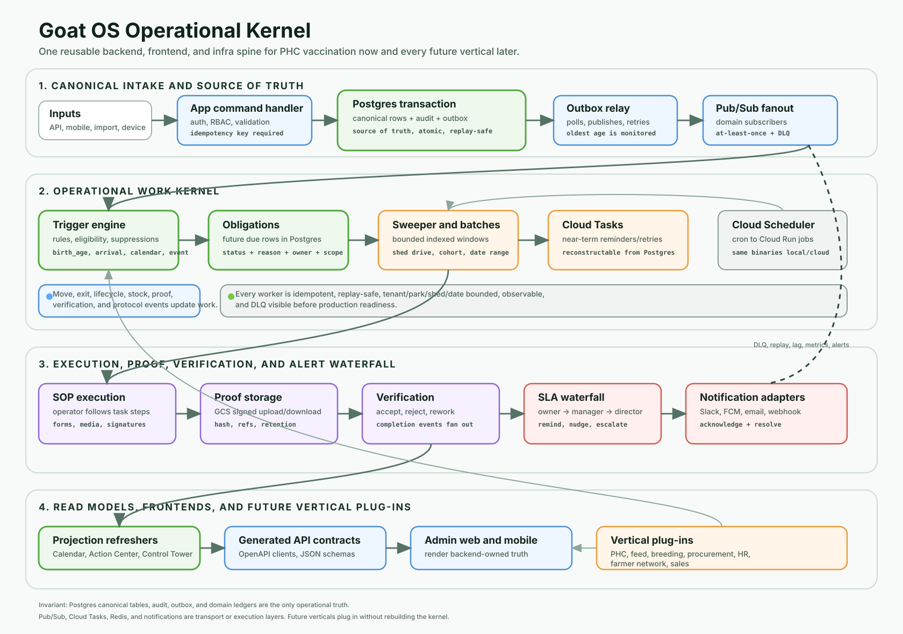

# Goat OS Operational Kernel System Design

Status: authoritative architecture addendum.

Date: 2026-06-27

This document turns the operational kernel golden rule into the concrete system
design used by Preventive Care (PC) vaccination and every future Goat OS vertical. The goal is a
single reusable kernel, not separate workflow engines hidden inside separate
screens.



## Current Release Target: 5k-to-50k Deployment Envelope

The authoritative scale and worker topology for the first operational-kernel
release is the accepted ADR
[`docs/decisions/operational-kernel-5k-50k-scale-envelope.md`](../../docs/decisions/operational-kernel-5k-50k-scale-envelope.md).
Read it before treating any scale claim in this document as a present-day
deployment requirement.

For the current release the kernel runs as one consolidated worker process next
to the API and Postgres, not as a fleet of independently scheduled jobs:

```text
Goat OS API
    -> canonical Postgres transaction + audit + outbox

One kernel worker process
    -> continuous domain-event consumer
    -> one-minute fast-delivery cadence (drain outbox, dispatch notifications)
    -> fifteen-minute operational cadence (sweep obligations, batches/SOP,
       inventory, reminders/escalations, SOP fanout retry)
    -> hourly obligation-generation cadence
    -> daily housekeeping cadence

Postgres
    -> canonical business tables
    -> durable obligation/SOP/proof/notification state
    -> keyset-paginated list reads + indexed summary aggregates for Calendar,
       process integrity, and vaccination screens (no projection tables)
```

At this envelope (approximately 5,000 animals today, up to 50,000 within the
year) API screens read canonical tables through bounded, indexed SQL. The
operational-kernel projection tables and the 17-job scheduled fleet described
later in this document are **not** the current runtime. That larger
split-worker, heavy-projection, one-million-animal topology is future scale-out
work, kept recoverable through the `kernel-split-workers-v1` Git tag and the ADR
inventory, and reintroduced one measured hotspot at a time — never restored
wholesale.

The kernel contract, guardrail engine, SOLID boundaries, DLQ/replay rules, SLA
waterfall, and vertical plug-in requirements below remain in force at this
envelope. What narrows is only the deployment, orchestration, and derived
read-model shape.

## Purpose

The kernel exists so Goat OS can answer the same leadership and operator
questions for every process:

```text
What was supposed to happen?
Which rule created the work?
Who owns it?
What is due now, late, blocked, waiting for proof, waiting for verification, or complete?
What evidence proves the answer?
What reminder, escalation, acknowledgement, or resolution happened when the SLA was missed?
```

For Preventive Care (PC) vaccination, this is the CEO-facing promise:

```text
Config -> Due List -> Shed Drive -> SOP Execution -> Proof -> Verification -> Completion -> Alerts
```

For later domains, only the vocabulary changes. Feed, breeding, procurement,
health follow-up, HR/people, farmer network, sales, and finance must plug into
the same kernel shape.

## Kernel Contract

Every operational slice uses this path:

```text
business event
  -> canonical transaction
  -> audit + outbox
  -> event fanout + DLQ/replay
  -> trigger/rule evaluation
  -> obligation/work/batch
  -> sweeper/scheduler/Cloud Tasks
  -> SOP execution
  -> proof
  -> verification/rework/completion
  -> notification/escalation waterfall
  -> acknowledgement/resolution
  -> read models and generated APIs
  -> frontend/mobile render backend-owned truth
```

The kernel is a product contract, not just backend plumbing. A vertical cannot
claim "alerts", "missed work", "shift handling", "exit handling", or "SLA
escalation" unless the runtime path is implemented, wired, observable, and
covered by tests.

## Generic Guardrail Engine

Guardrails are kernel decision points before or during critical state
transitions. They are feature agnostic. The core engine must not know special
case words such as "quarantine", "birth", "feed", or "sale". It knows the
shape of a critical action:

- action type
- subject references such as goat, batch, shed, load, person, stock item, task,
  or booking
- requested transition
- requested classification and evidence-derived authoritative classification,
  where the pack needs to separate process state from names/tags/free text
- tenant, park, shed, cohort, date, and owner scope
- actor, authority, source, and idempotency key
- linked evidence
- policy pack and policy version
- decision, disabled reason, approval plan, obligation plan, proof policy,
  escalation plan, audit, outbox, and projections

Generic evaluation flow:

```text
command
  -> canonical action request
  -> policy-pack selection
  -> scoped evidence fetch
  -> evidence-derived classification and conflict check
  -> deterministic guardrail evaluation
  -> decision: allow | block | require_approval | require_exception | defer |
               create_process_exception
  -> transaction writes request + evaluation + audit + outbox
  -> approvals / obligations / proof / notifications / projections
```

Lower-level mutation primitives are execution adapters, not guardrail bypasses.
A critical state transition may call them only after the guardrail decision is
allowed or after an approved exception path explicitly records why it is safe.

The guardrail engine follows SOLID principles:

| Principle | Goat OS rule |
| --- | --- |
| Single Responsibility | The engine orchestrates evaluation and writes decisions. Policy packs own domain rules. Evidence adapters fetch facts. Approval, proof, obligation, notification, and projection components stay separate. |
| Open/Closed | New critical features are added by registering new policy packs and adapters, not by editing a growing `if action == ...` block in the kernel. |
| Liskov Substitution | Every policy pack obeys the same contract. A movement pack, health pack, feed pack, or sale pack can be evaluated, replayed, versioned, disabled, and audited through the same engine. |
| Interface Segregation | Policy packs depend on small ports such as `EvidenceReader`, `PolicyEvaluator`, `ApprovalPlanner`, `ObligationPlanner`, `ProofPlanner`, `EscalationPlanner`, and `ProjectionWriter`, instead of one oversized service. |
| Dependency Inversion | Domain rules depend on interfaces and versioned configuration. Slack, FCM, GCS, Pub/Sub, BigQuery, Redis, and vendor SDKs are replaceable adapters at the edge. |

A policy pack must declare:

- owned action types and transitions
- subject types and evidence required to evaluate them
- legacy capability parity floor, known legacy gaps to close, and import/replay
  mapping when replacing an existing Slack/Sheets/App Script workflow
- classification authority rules: what evidence decides the final action
  classification, and how conflicts with user-entered classification are handled
- primitive exposure plan: how lower-level mutation primitives are blocked,
  wrapped, or restricted until the policy pack owns each critical transition
- allowed reasons, blocks, warnings, exception paths, and disabled reasons
- approval/authority policy
- proof and verification policy
- obligation/task generation policy
- SLA/reminder/escalation policy
- read-model/projection requirements
- idempotency, replay, and migration behavior
- test fixtures for allow, block, approval, exception, replay, and scale cases

Examples of policy packs include movement/shifting, quarantine/ICU, death,
health diagnosis/treatment/close, birth/abortion, procurement/arrival, feed
direction/bridge ration, sale/allocation, stock issue/return, and workforce
attendance/backfill. The point is not to build one engine per feature. The point
is to build one guardrail engine and plug domain packs into it.

## Backend Architecture

Goat OS stays a Go modular monolith with strict module boundaries. The kernel
is shared application/platform code. Feature modules contribute adapters and
domain rules.

| Layer | Responsibility | Design rule |
| --- | --- | --- |
| API/command boundary | Accept operator/admin/mobile/import/device/scheduled commands. | Validate auth, RBAC, tenant scope, payload, idempotency, and bounded request size before mutating state. |
| Canonical transaction | Write source-of-truth rows. | Canonical rows, audit/domain history, idempotency, and outbox are committed atomically where possible. |
| Event spine | Move durable outbox events to subscribers. | Relay to Pub/Sub/local event bus, retry safely, expose oldest unsent age, and keep failed delivery visible through DLQ/error state. |
| Trigger engine | Convert facts/rules into expected work. | Deterministic, replay-safe rule evaluation with explicit suppression/defer reasons. |
| Obligation engine | Hold far-future and current due work. | Store due rows in Postgres, with scope, owner, status, reason, SLA, and idempotency key. |
| Batch/work engine | Create human work units. | Group by operational scope such as shed/cohort/date instead of creating one field task per goat when the work is a drive. |
| Time spine | Move due work forward. | In the current 5k-to-50k runtime this is the single kernel worker's operational/generation cadence classes (see the ADR); the independently scheduled Cloud Scheduler/Cloud Run Jobs fleet is future scale-out. Workers scan indexed windows; Cloud Tasks only handles near-term dispatch/retry. |
| SOP/proof engine | Capture evidence. | SOP policy, media refs, forms, signatures, hash, retention, and verifier requirements are declared by the vertical. |
| Verification engine | Decide completion. | Accept/reject/rework is durable, audited, idempotent, and emits completion events for downstream work such as boosters. |
| Notification engine | Deliver reminders and escalations. | Durable notification/escalation rows feed replaceable Slack, FCM, email, webhook, and future incident adapters. |
| Projection engine | Feed product lenses. | Calendar, Action Center, Protocol Adherence, Workflow, Control Tower, and analytics read backend-owned data, not local UI truth. At the 5k-to-50k envelope this is canonical indexed SQL with no projection tables (see the ADR); dedicated projection/read-model tables are a future scale-out addition, introduced per measured hot read path, not a present requirement. |

Domain/app packages depend on ports. They must not import Google SDKs, Slack
SDKs, FCM SDKs, Redis clients, or analytics vendors directly. Infrastructure
adapters implement ports at the edge.

## Frontend And Mobile Architecture

Admin web and mobile apps are renderers and command clients. They are not the
scheduler, queue, source of truth, rule engine, SLA timer, or escalation engine.

Frontend rules:

- Use generated OpenAPI clients and backend-owned schemas.
- Render backend-provided titles, filters, statuses, actions, permissions,
  disabled reasons, pagination, and detail blocks where contracts exist.
- Own only UI state such as selected row, drawer open state, filters, loading,
  local form draft, and retry affordances.
- Show all material states honestly: due today, overdue, missed, blocked,
  pending proof, pending verification, rejected, deferred, escalated,
  acknowledged, resolved, completed, unauthorized, failed, and empty.
- Any action such as assign, nudge, snooze, escalate, acknowledge, resolve,
  verify, reject, or rework calls a backend command or renders as disabled with
  a backend reason.
- No page hardcodes canonical workflow state that should come from the kernel.

This keeps future verticals plug-and-play: when a new module provides backend
contracts and projections, the UI can render it without inventing a second
workflow model.

## Infrastructure Architecture

Postgres is operational truth. Managed Google services provide transport,
execution, storage, and observability behind replaceable adapters.

| Need | Default implementation | Kernel rule |
| --- | --- | --- |
| Operational truth | Cloud SQL/Postgres | Canonical tables, audit, outbox, ledgers, and read models live here. |
| Event fanout | Pub/Sub | At-least-once delivery; every consumer is idempotent; DLQ/error visibility and guarded replay are mandatory. |
| Scheduled scans | Kernel-worker cadence classes today; Cloud Scheduler -> Cloud Run Jobs on future scale-out | Workers use bounded windows, cursors, leases/claims, and query-plan-checked indexes. At the 5k-to-50k envelope these run as cadence classes inside the single kernel worker (see the ADR); the independently scheduled job fleet is future scale-out, not the current runtime. |
| Near-term retry/reminder | Cloud Tasks | Used only for near-term execution; durable Postgres rows can rebuild lost tasks. |
| Media proof | GCS signed URLs | API stores metadata and never proxies video/photo bytes. |
| Notifications | Slack, FCM, email, webhook adapters | Vendors are replaceable; product state is in durable notification/escalation rows. |
| Observability | Cloud Logging, Monitoring, Trace, Error Reporting | Track API latency, DB pressure, outbox age, Pub/Sub lag, DLQ count, worker failures, notification failures, SLA lag. |
| Cache/leases | Redis/Memorystore when needed | Acceleration only; never canonical truth. |
| Analytics | governed projections/BI boundary | Heavy analytics never run on hot operational API paths. |

### Local GCP-kernel parity

`compose.local-kernel.yml` is the executable laptop counterpart of this table:

| Production boundary | Local behavior proof | Separate cloud proof still required |
| --- | --- | --- |
| Cloud SQL/Postgres | Postgres 16 container with the canonical migration binary | Cloud SQL IAM, HA, backups, pool sizing, scaled plans |
| Pub/Sub + DLQ | Official Pub/Sub emulator, bootstrapped topic/subscription/DLQ, production publisher/subscriber clients | IAM, regional behavior, quotas, backlog alerts |
| Cloud Run API/Jobs + Scheduler | Same built API and worker binaries; bounded local polling loops | Cloud Run identity, Scheduler invocation, autoscaling/timeouts |
| Cloud Tasks | Durable notification intents plus periodic real dispatcher; no fake Cloud Tasks API | Queue IAM/OIDC, throttling, retry and dispatch in staging |
| GCS signed proof media | Local filesystem adapter behind the proof-storage port | GCS signed URL, CORS, bucket IAM and retention in staging |
| Cloud Logging/Monitoring/Trace | Structured stdout logs | Managed log/metric/trace export and alerts |
| Memorystore | Not started by default | Add only when a measured cache/lease need exists |

The local smoke must prove a real domain effect after
`outbox -> Pub/Sub emulator -> domain-event-consumer`, not merely a publish log.
It also republishes the same event ID and proves the durable consumer skips the
duplicate without duplicating the obligation.

## Scale Model

The current release target is the 5k-to-50k envelope in the ADR
([`docs/decisions/operational-kernel-5k-50k-scale-envelope.md`](../../docs/decisions/operational-kernel-5k-50k-scale-envelope.md)),
served from canonical indexed SQL by one kernel worker. The scale rules below are
the design's forward-looking discipline for growth toward one million goat
operations and uneven farm load: they remain correctness guidance at every size,
but one-million-animal topology is future scale-out work, not a present release
requirement. The design assumes skew: one park or shed may be much hotter than
the average.

Scale rules:

- All hot reads and workers are scoped by tenant, park, shed, cohort, owner,
  status, date, or cursor. No API path scans the full herd.
- Guardrail evaluation uses scoped evidence by explicit subject identifiers and
  indexes. Cross-herd or cross-park risk signals must come from maintained
  projections, not synchronous full-herd scans.
- Critical batch actions run as bounded preflight/evaluation jobs with progress,
  partial failure state, and idempotent apply steps. A user action must never
  create unbounded per-goat work in one request path.
- Policy versions are immutable for replay. Re-evaluation records must explain
  whether the old policy or current policy was used.
- Use keyset pagination for large lists and stable sort keys for operational
  queues.
- High-volume event, audit, notification, history, media, and telemetry-like
  tables are partition-aware where needed.
- Workers use bounded batch sizes, leases or idempotent claims, cancellation,
  retry budgets, and dead-letter visibility.
- Rule generation uses deterministic idempotency keys, durable run rows, and
  upserts so retry/replay does not duplicate obligations or leave publish
  failures unrecoverable.
- Far-future due work stays in Postgres. Cloud Tasks is not a calendar database.
- Query-plan gates are required for widest allowed API list requests and worker
  scans.
- Load tests must include realistic skew, duplicate events, replay, DLQ poison
  messages, missing owners, blocked stock, slow verifiers, and stale projections.

## Vertical Plug-In Contract

Every future vertical must provide the following adapters/contracts before it
can claim to be on the kernel.

| Plug-in piece | What the vertical provides |
| --- | --- |
| Domain events | Typed event names and payload schemas for facts that start or change work. |
| Rule DSL | Source-backed configurable rules, approval flow, effective dates, versioning, and publish gates. |
| Eligibility | Deterministic inclusion/exclusion/defer logic with reasons. |
| Obligation strategy | Target entity, due calculation, owner chain, SLA policy, idempotency key, suppression key, and cancellation/re-scope behavior. |
| Batch strategy | How rows become field work: shed drive, cohort task, individual follow-up, load task, verifier queue, or exception. |
| SOP/proof policy | Required steps, form fields, media types, proof subject, storage, retention, verifier role, and rework rules. |
| Notification policy | Reminder schedule, nudge schedule, escalation waterfall, role chain, channels, acknowledgement, and resolution rules. |
| Read models | Calendar, Action Center, Protocol Adherence, Workflow, Control Tower, entity passport/detail, and analytics facts. |
| API contracts | Generated OpenAPI endpoints, stable pagination, disabled reasons, action contracts, and error envelopes. |
| Permissions | Tenant/park/shed/team/role scope and who can configure, execute, verify, escalate, acknowledge, resolve, or override. |
| Operations proof | Tests for idempotency, replay, DLQ, scheduler, Cloud Tasks, projections, notification failure, and scale gates. |

If a vertical marks any item `N/A`, the reason must be written in the PRD/TRD or
handoff. Agents must not invent fake proof, fake alerts, or frontend-only
workflow state to satisfy the checklist.

## Preventive Care (PC) Vaccination Reference Slice

Preventive Care (PC) is the vertical. Vaccination is the first reference module/slice for this
kernel.

| CEO statement | Runtime meaning |
| --- | --- |
| Config means approved vaccination rule. | Published protocol/vaccination rules are source-backed, versioned, and approved before work is generated. |
| Existing goats get due work. | Generation jobs evaluate current goat state against approved rules and write idempotent obligations. |
| New goats get checked automatically. | `goat.created` events must be emitted and delivered through the outbox relay/local event bus or Pub/Sub domain consumer into the obligation consumer; the automation depends on that delivery path running. |
| Shed-wise drive is created. | Sweepers group due obligations into operational batches such as shed drives. |
| Operator follows SOP and uploads proof. | SOP/proof policy drives task execution and durable media/proof references. |
| Verifier accepts or rejects. | Verification records decide completion or rework and emit completion events. |
| Booster is prepared after completion. | Booster/follow-up obligations are created from accepted completion events, not from unverified proof. |
| Missed vaccination is highlighted. | Due/overdue/missed/blocked/proof-pending/verification-pending states feed projections and command lenses. |
| Reminder and escalation happen. | Durable notification and escalation rows support role-based waterfall delivery, acknowledgement, and resolution. |
| Shift and exit are handled. | Goat location-change and exit events re-scope or cancel open work through the same event spine. Current Preventive Care (PC) shift handling covers open unbatched work and planned batched work by detaching/re-scoping with stock reconciliation markers; in-progress/completed drive migration remains an explicit exception/rework policy. |

The vaccination slice should remain the proving ground for future domains: when
an edge case is fixed for vaccination, the kernel contract should capture the
generic rule so feed, breeding, procurement, and HR do not rebuild it.

Exact Preventive Care (PC) vaccination runtime coverage is tracked in
`context/execution/vaccination-edge-case-code-coverage.md`; that ledger is the
place to keep implementation caveats separate from the generic kernel design.
The business closure backlog for the remaining CEO-message gaps is tracked in
`context/execution/vaccination-kernel-closure-business-backlog.md`.

## DLQ, Replay, And Failure Management

The event system is at-least-once. Duplicate delivery is expected.

Production-complete DLQ rules:

- Every domain consumer must be idempotent and safe to replay.
- Poison messages go to DLQ with event name, source, payload hash, error, first
  seen, last seen, attempts, tenant/scope when available, and trace identifiers.
- DLQ replay must be an explicit operator action or guarded repair job with
  idempotency, audit/history, and replay-safe repair rows.
- Alerts fire on DLQ count, outbox oldest-unsent age, Pub/Sub lag, worker error
  rate, and repeated notification delivery failure.
- A replayed event must not duplicate obligations, notifications,
  verification outcomes, or stock consumption.

Current Preventive Care (PC) / kernel status is tracked in
`context/execution/vaccination-edge-case-code-coverage.md`. That ledger should
distinguish the wired outbox DLQ/error/replay/discard UI from Pub/Sub DLQ import,
environment monitoring alerts, and vendor-specific incident sync when those are
still environment or integration work.

## SLA Waterfall

Escalation is not a log line. It is product state.

Each obligation or work item that has a deadline must know:

- owner role and owner user/team when available
- backup role or manager role
- higher-level escalation role such as Preventive Care (PC) Director when the slice declares it
- reminder timing
- missed-SLA timing
- channels to attempt
- acknowledgement policy
- resolution policy
- blocked/deferred/snoozed rules

Example:

```text
operator due soon
  -> reminder to owner
  -> missed SLA nudge to owner and manager
  -> escalation to manager/director
  -> acknowledgement records who accepted ownership
  -> resolution records the final action or approved exception
```

The Calendar, Action Center, Protocol Adherence, Workflow, and Control Tower
must be able to show this state without reading notification vendor logs.

## Non-Negotiables

- Postgres canonical tables, audit, outbox, and domain ledgers are operational
  truth.
- Pub/Sub, Cloud Tasks, Redis, Slack, FCM, email, and alert vendors are
  transports/adapters.
- No frontend or mobile app owns canonical due state, SLA state, escalation
  state, or verification state.
- No worker scans the whole herd or creates unbounded goroutines per goat.
- No module creates a private scheduler, private notification engine, private
  proof engine, or private task engine.
- No module creates a private critical-action guardrail engine. Critical
  movement, health, feed, birth, procurement, sale, death, and workforce actions
  plug into the shared guardrail engine through policy packs.
- AI can suggest, summarize, triage, and detect anomalies, but it cannot become
  source of truth or silently complete work.
- Any production-readiness claim must include code wiring, tests, migration/API
  contracts, observability, and a local/cloud execution path.

## Build And Review Gate

Before a vertical reaches E2E or production readiness, reviewers must check:

1. Canonical transaction writes source-of-truth rows, audit/history,
   idempotency, and outbox.
2. Event producers and consumers are both wired in real bootstrap/deployment
   paths.
3. Pub/Sub/local delivery, DLQ, replay, and duplicate-event tests exist.
4. Scheduler, sweeper, and Cloud Tasks paths are deployed or intentionally
   disabled with a written reason.
5. Obligations handle create, defer, block, re-scope, cancel, complete, reject,
   rework, and follow-up.
6. Notification waterfall handles reminder, missed, escalation,
   acknowledgement, resolution, and failed delivery.
7. Generated APIs expose statuses, actions, disabled reasons, pagination, and
   projection details.
8. Frontend/mobile surfaces use backend contracts and do not hardcode workflow
   truth.
9. Query plans and load tests prove scale for the largest intended tenant,
   park, shed, date, owner, and status slices.
10. Observability dashboards/alerts cover API, DB, outbox, Pub/Sub, DLQ,
    workers, Cloud Tasks, projections, media, and notifications.

This gate is the permanent standard for Goat OS kernel work.
