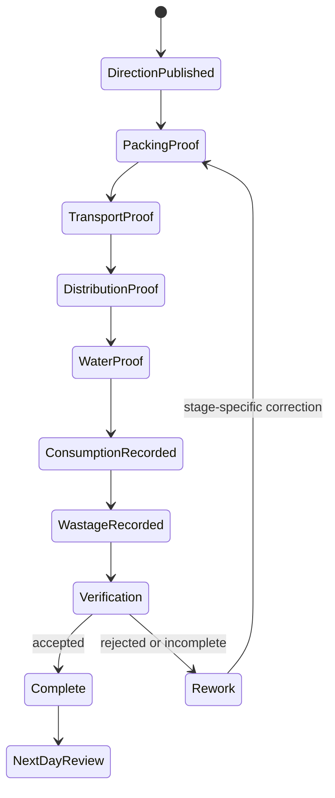

# Feed Direction Legacy System Reference

**Status:** Canonical, sanitized discovery reference
**Last cross-check:** 2026-07-20
**Purpose:** Preserve the useful operating knowledge from the legacy Sheets,
Apps Script, Slack, wiki, BigQuery, dashboard, and handbook surfaces so future
Feed Direction work starts here instead of repeating the same archaeology.

This document records what the legacy system does and why. It is not a target
architecture and it does not authorize copying legacy schedules, formulas,
processed flags, channels, or separate normal/experiment backends into GoatOS.

## 1. Safety and use rules

- The legacy Google Cloud project is `goatos-sheets`. It is migration evidence
  only and must remain read-only and untouched.
- Do not commit raw Sheet rows, Slack message links, media links, employee names,
  access tokens, webhooks, private form payloads, or personally identifying data.
- Stable access-controlled workbook and document links are listed so an
  authorized maintainer can re-check the evidence.
- A Sheet/App Script behavior is implementation evidence, not automatically a
  business rule. When timing or feed policy conflicts, the formal Feed source
  and an explicit Feed Director decision win.
- "Experiment" in this reference means the legacy workaround. In GoatOS it is an
  absolute per-shed daily quantity (kg per feed item) that is hand-entered rather
  than derived from head count, split across the day's sessions, optionally
  carrying a comparison label. It is not a second Feed product or backend.

## 2. The whole legacy story in plain language

Every night, the team works out how many animals are expected in each shed the
next day. The normal Feed workbook turns those counts and ration rules into a
list saying what each shed should receive in each feeding session. Apps Script
posts the list and asks workers in Slack for packing, transport, distribution,
water, consumption, and wastage evidence. Other Sheets store the replies and a
reviewer marks media correct or incorrect.

The normal workbook is weak at one important thing: giving different mixtures
to several sheds that share the same tag/category. The team therefore created a
second "Experiment Feed" workbook and duplicate Slack channels. In that
workbook, each exact shed can be given its own kg values. The Feed Director can
watch distribution and wastage, change tomorrow's mixture, and try another
permutation.

That duplicate experiment system exists because Sheets and Apps Script made
the normal model awkward. It is not a separate business process. GoatOS must
keep one Feed Direction process and let an approved assignment choose a
different composition for an exact shed, cohort, date, and session. Packing,
transport, distribution, water, consumption, wastage, proof, verification,
rework, inventory, audit, and next-day review all remain the same chain.

## 3. Evidence authority and confidence

| Priority | Evidence | What it controls | Confidence |
| --- | --- | --- | --- |
| 1 | `Feed, Shiftings and Count.docx` v1.1 | Counts/Shifting input, ration behavior, Feed Direction/Diff/bridge semantics, field-facing as-fed quantity, intended clocks | High |
| 2 | Live Sheets, live Slack, installed trigger inventory, exported Apps Script | What legacy production actually stores, prompts, schedules, retries, and fails to do | High for structure; actual trigger times are not policy |
| 3 | Feed counting/video flow, Feed Director handbook, director handbook, Goats and Parks, Sheds DB | Roles, operating intent, verification, stock and feed-safety context | Medium to high |
| 4 | Feed Transfer KT | Directional explanation, nutrition dimensions, feedback loop, examples needing owner approval | Low to medium because the transcript is auto-generated |
| 5 | Old `goatOS.docx` and dashboard/BQ models | Historical analytics and architecture clues | Low for target design |

When sources disagree, record both the intended business deadline and the
observed legacy trigger. Do not silently turn an Apps Script trigger into a
GoatOS SLA.

## 4. Stable source catalog

### 4.1 Live Google sources

| Source | Stable authorized link | Role |
| --- | --- | --- |
| Feed Directions Automation DB | [Open workbook](https://docs.google.com/spreadsheets/d/1RYY0YNLL0VMZ7Eob7AxwqjaVisX5abHY9U-vE5ky1Mw/edit) | Normal direction generation and execution evidence |
| Experiment Feed Directions Automation DB | [Open workbook](https://docs.google.com/spreadsheets/d/1Hs6PVH0U9nE52YBGxGVWNloiWgS7mZ45A5GpEvqHHUw/edit) | Exact-shed composition workaround and duplicate execution paths |
| Video Verification DB | [Open workbook](https://docs.google.com/spreadsheets/d/1qxruWQwfXGLBUBce179ah43IIt8zGWs3j8U8Q-tJ1pk/edit) | Packing, distribution, transport, and wastage verification evidence |
| Counting DB | [Open workbook](https://docs.google.com/spreadsheets/d/1vWtbgZI2Yz__noTocwPWzCtEDcS-UXW7mJ9ZqSQ5w_4/edit) | Finished-day count and tomorrow projection inputs |
| Sheds DB | [Open workbook](https://docs.google.com/spreadsheets/d/1Qo5k40CIkS4Lu0074DYSRsiFrmW8LAA8Oi0vMK0X1oI/edit) | Legacy shed/tag profile evidence |
| FeedDB | [Open workbook](https://docs.google.com/spreadsheets/d/1HXaHFTEquc0iVxfC_ZeEm9pB3kAxE58-0oiGtiQpSp8/edit) | Feed analytics/source mirror evidence |
| Feed Transfer KT | [Open document](https://docs.google.com/document/d/1IThxIWQ8QeTtjuCUrYvvFZgOAEHV5y9rVj0twg0Jjx4/edit) | Directional KT, not normative policy |
| Feed Supply Data Archive source mirror | [Open tab](https://docs.google.com/spreadsheets/d/1OEr8j_9fYYWmQm0VkP6UgZ1YBcWIs-Km08XGs44W6Hg/edit?gid=723978225#gid=723978225) | Confirmed source of the `feed_directions.feed_directions_unclean` external table; relationship to the current main workbook runtime remains a migration question |
| Legacy BigQuery project | [Open BigQuery](https://console.cloud.google.com/bigquery?project=goatos-sheets) | Read-only migration/analytics evidence |

### 4.2 Relevant wiki originals

All paths below are maintainer-local source evidence under
`/Users/ravi/mesha/wiki/`; GoatOS stores only sanitized findings.

- `Feed, Shiftings and Count.docx`
- `Feed-Counting-and-Video-Verification-Flow.docx`
- `Feed transfer KT – 2026_06_24 15_00 IST – Notes by Gemini.docx`
- `Feed Directions Automation DB.xlsx`
- `Experiment Feed Directions Automation DB.xlsx`
- `Counting DB recreated 2026-06-29/README.md` and its sanitized workbook/CSV
  reconstruction
- `Handbooks/Feed_Director.pdf`
- `Handbooks/Mesha-dept-directors.docx` and `.pdf`
- `Goats and Parks.docx` and the duplicate under `General/`
- `Sheds DB.xlsx` and the duplicate under `General/`
- `Goat OS DB.xlsx`
- `goatOS.docx`, retained only as old/incomplete architecture evidence

Converted wiki sources may be used for text search, but the original document
remains the citation target. The controlling sanitized GoatOS findings are:

- `context/source-findings/feed-direction-counting-db-reconstruction.md`
- `context/source-findings/feed-transfer-kt-2026-06-24.md`
- `context/source-findings/feed-direction-workbook-automation-findings.md`
- `context/source-findings/goats-and-parks-source-findings.md`
- `context/source-findings/sheds-db-source-findings.md`
- `docs/feed-direction/legacy-feed-direction-incident-investigation-2026-07-16.md`

### 4.3 Legacy code and operational notes

Read these from `/Users/ravi/mesha/slack-automation-scripts/`:

- `feed_automation.js`
- `experiment_sheds.js`
- `counting_db_automation.js`
- `video_verification_system.js`
- `unified_automation.js`, used only where the live feed path calls it
- `feed-automation-trigger-inventory.md`
- `feed-automation-defect-ledger.md`
- `feed-packing-directions-incident-and-resilience-proof.md`
- `feed-automation-e2e-runbook.md`
- `counting-db-slack-automation-handoff.md`

The legacy dashboard, `vgoats-dashboard`, procurement app, and website are
secondary consumers/context. They must not be modified for GoatOS rewiring;
use them only to recover field meaning, analytics dependencies, or operator UI
expectations.

## 5. Normal Feed Directions workbook

The live workbook is titled `Feed Directions Automation DB` and uses the
Asia/Calcutta time zone. Important tabs are summarized below.

| Tab | Legacy role | Important stored fields |
| --- | --- | --- |
| `Feed Direction` | Materialized direction rows and send-state flags | Date, farm, session, shed, shed tag, breed, age, count, up to five feed type/quantity pairs, packing processed, consumption processed, session total, transport processed |
| `Count-DB` | Feed-local copy of tomorrow's projected counts | Date, farm, shed, shed tag, breed, age, count, staff/count source |
| `CBE Validation`, `CPT Validation`, hidden copies, `Validation-BW`, `Feed-Energy-Protein` | Formula-driven nutrition, factor, alias, and validation staging | Breed/tag/category keys, energy/dry-matter/wastage/net-energy factors, thresholds and formula outputs |
| `CBE Supply Planning`, `CPT Supply Planning` | Per-feed staging before directions are written | Farm/feed quantities and planning calculations |
| `Template` | Farm session and feed-set configuration | Farm sections, sessions and allowed feed items |
| `Feed Packing Form` | Packing proof and reviewer state | Planned feed pairs, video, timestamps, message reference, status, actual feed quantities, media correctness, remarks |
| `Feed Consumption & Wastage` | Consumption, water, wastage, proof and reviewer state | Feed/submission date/time, farm, shed, session, consumed quantity, two consumption media, two water media, wastage quantity/media, assignee, total feed, correctness, remarks, legacy reviewer remark |
| `Feed Transport Form` | Transport proof | Date, farm, shed, time, video, message reference, submitting user |
| `Experiment Sheds` | List of sheds removed/diverted from the normal path | Farm, shed |
| `Feed Supply Data Archive` | Historical archive | Legacy feed supply outputs |
| `Team User ID` | Slack/user routing glue | Legacy identity mapping; never target RBAC |

The workbook's wide row shapes, hidden formula copies, processed flags, and
Slack links are evidence of intent. They are not tables to reproduce one-for-one
in Postgres.

## 6. Experiment Feed workbook

The live workbook is titled `Experiment Feed Directions Automation DB`.

| Tab | Legacy role | Important stored fields |
| --- | --- | --- |
| `Experiment Feed Config` | Absolute per-shed daily kg (hand-entered; count informational) | Farm, shed, count, category, Mesha Concentrate Goat kg, Mesha Concentrate Sheep kg, RGS Concentrate kg, Vijay Concentrate kg, Dry Masoor Bhusa kg |
| `Feed Direction` | Materialized experiment direction | Same 22-column shape as the normal direction tab |
| `Feed Packing Experiment Sheds` | Packing proof and verification | Date/time/farm/shed/session, up to five planned feed pairs, video, timestamps, message ref, actual quantities, correctness, remarks |
| `Feed Distribution Experiment Sheds` | Distribution/consumption and water proof | Date/time/farm/shed/session, message ref, consumption quantity, water session, correctness, remarks, direction total, difference |
| `Wastage Experiment Sheds` | Wastage proof and verification | Date/time/farm/shed/session, video, wastage quantity, correctness, remarks |
| `Template`, validation tabs, `Logs`, `Experiment Sheds` | Duplicate configuration, routing and debug support | Legacy-only support surfaces |

The decisive finding is structural: the config assigns kg to an exact shed.
Several same-category sheds can have different feed pairs. There is no required
hypothesis, control, treatment, metric, or statistical result. Therefore the
minimum GoatOS capability is native versioned per-shed/per-cohort composition,
not a mandatory experiment-management feature.

## 7. Video Verification workbook

The live `Video Verification DB` provides the strongest evidence for the
reviewer's required fields.

| Tab | Evidence retained | GoatOS meaning |
| --- | --- | --- |
| `Feed Packing` | Planned and actual feed quantities, media, correctness, remarks | Packing submission, item results, proof objects, verifier verdict |
| `Feed Distribution` | Consumed quantity, consumption/water media, wastage, total, difference, correctness, remarks | Distribution/consumption/water/wastage stage results and variance exception |
| `Feed Transportation` | Shed/time/video/user, correctness, remarks | Transport proof and verifier verdict |
| `Wastage Summary` | Consumed kg, wastage kg and percentage | Derived read model, not canonical input |
| hidden `FeedDB-Data`, `Automated Stock` | Feed/batch/stock analytics inputs | Inventory/event migration evidence only |

Legacy `Verified`/`Rejected`, correctness, actual quantities, and remarks must
become typed verification and rework state. A media link alone must never mean
the work is accepted.

## 8. Slack production inventory

### 8.1 Channels

| Workflow | CBE | CPT |
| --- | --- | --- |
| Normal feed monitoring/packing proof | `#cbe-feeding-monitoring-channel` (`C0A5WTZ8GBY`) | `#cpt-feeding-monitoring-channel` (`C0A6APUF62J`) |
| Normal distribution/consumption and water | `#cbe-feed-distribution-channel` (`C0AD56LEGGN`) | `#cpt-feed-distribution-channel` (`C0ACY2EKYUB`) |
| Normal transportation | `#cbe-feed-transportation` (`C0AF8D5KAJK`) | `#cpt-feed-transportation` (`C0AFTFR68NQ`) |
| Experiment packing | `#cbe-experiment-sheds-feed-packing` (`C0B8XD4CZC5`) | `#cpt-experiment-sheds-feed-packing` (`C0B92KR0L49`) |
| Experiment distribution and water | `#cbe-experiment-sheds-feed-distribution` (`C0B95736BB8`) | `#cpt-experiment-sheds-feed-distribution` (`C0B9575T0BG`) |
| Experiment wastage | `#cbe-experiment-sheds-feed-wastage` (`C0B8Z5LSWFQ`) | `#cpt-experiment-sheds-feed-wastage` (`C0B917P4EGJ`) |

`#feed-automation-e2e-test` (`C0BJ5AFJHPY`) is a non-production test artifact.
No separate normal-feed wastage channel was discoverable in the accessible
workspace; normal wastage appears in the combined consumption/wastage data path.

### 8.2 Parent-card context and prompt sequences

Slack attachment search exposes these parent fields with high confidence:
business date, farm, shed, tag/category where relevant, session, feed items, and
kg quantities. Exact visual layout is only medium-confidence because the read
connector does not render attachment bodies.

| Workflow | Exact observed sequence |
| --- | --- |
| Normal monitoring | Parent direction -> `Please upload video for Session 1` -> media -> Session 2 prompt -> media -> `All videos uploaded successfully for {shed}` |
| Experiment packing | Parent direction -> Session 1 video -> Session 2 video -> `All packing videos uploaded successfully for {shed}` |
| Normal distribution | Per-shed/session parent -> `Please upload consumption video for Session {n}` -> media -> `Please upload water distribution video for Session {n}` -> media -> completion |
| Experiment distribution | Per-shed/session parent -> `Please upload distribution video for Session {n}` -> media -> water distribution prompt -> media -> completion |
| Normal transportation | Parent -> `Please upload transport video` -> media; no visible bot completion acknowledgement |
| Experiment wastage | Parent -> `Please upload video for Wastage` -> media -> completion |

A dated farm Feed Directions PDF is also posted to the normal monitoring
channels. GoatOS may generate a human-readable summary, but the PDF must be a
projection of database truth rather than the operator's canonical task list.

### 8.3 Observed trigger times

These times were seen on two recent operating days. They describe the current
automation, not approved future deadlines.

| Approximate time IST | Observed action |
| --- | --- |
| 07:10 | Experiment wastage prompt |
| 07:17-07:18 | Experiment Session 1 distribution |
| 07:29-07:37 | Normal Session 1 distribution |
| 07:38-07:48 | Normal monitoring/packing jobs |
| 13:07-13:12 | Experiment Session 2 distribution |
| 13:09-13:16 | Normal Session 2 distribution |
| 14:20-14:24 | Experiment packing for tomorrow |
| 15:57-16:00 | Normal transport prompt |

Formal Feed sources describe different intended windows. GoatOS stores
effective-dated deadline policy and keeps legacy observed times only for shadow
parity and cutover planning.

### 8.4 Directly observed Slack defects

1. A prompt saying "video" accepts a JPEG photo and advances the workflow.
2. Multiple files can trigger duplicate next prompts and duplicate completion.
3. A thread can complete before later files arrive.
4. Some direction cards receive no prompt or explicit failed/pending state.
5. Transportation has no visible completion acknowledgement.
6. No production rejection, correction, re-upload, or reason-for-failure path
   was found.
7. File presence appears sufficient; no reviewer verdict is captured in Slack.
8. Slack membership does not prove the submitter owns the required role.
9. Quantities are attachment/Sheet data; no structured actual-quantity answer
   was observed in the thread.
10. Workflow identity depends on channel plus parent thread and is fragile under
    retries.
11. Normal and experiment wording and completion semantics are inconsistent.

These are acceptance tests for the mobile replacement, not merely historical
bugs.

## 9. Exact Apps Script and trigger inventory

This inventory captures code paths and installed-trigger evidence. It is a
migration checklist, not the proposed GoatOS service layout.

### 9.1 Normal Feed automation

| Concern | Important functions | Legacy behavior and risk |
| --- | --- | --- |
| Count bridge and Diff | `initialLoadFutureDBToCountDB`, `checkAndStoreDifferences`, `generateFeedDirectionFromDifferences` | Copies/compares tomorrow counts and generates change rows; append/update behavior can duplicate or leave stale work |
| Full direction | `generateFeedDirection`, `threeAMUpdate`, `twoPMUpdate` | Reads count/template/validation state and materializes direction rows; names/comments and installed clocks have drifted |
| Archive | `archiveFeedSupplyData` | Appends historical supply data without the replay guarantees required by GoatOS |
| Packing | `sendPackingFeedDirections` plus afternoon/change variants | Reads tomorrow, skips K0/K1, groups farm/shed/session, creates Slack parent/prompts and then sets `Packing Processed`; the tick means message creation, not accepted proof |
| Consumption/distribution | `sendMorningConsumptionMessages`, `sendAfternoonConsumptionMessages`, `getNonExperimentShedsForDate_` | Precreates a combined consumption/wastage row, sends feed then water prompts, and sets `Consumption Processed` when task/message is created |
| Transport | `sendTransportMessages` | Sends tomorrow's per-shed transport prompt and writes form data after upload; source checks only Feed 1-4 and can omit Feed 5 |
| Webhook | `doPost` | Routes `file_shared` by channel and stores `file_seen_{id}` before metadata lookup; a transient metadata failure can permanently suppress redelivery |
| Retry | `wrapWithRetry_` | Creates a roughly ten-minute one-shot retry and alerts after three throws; cannot catch Apps Script hard/internal timeout and may accumulate triggers |
| Cleanup | `cleanupOldThreads` | Deletes thread/list/file-dedupe properties and is unsafe near cutover, replay or unresolved delivery |

Packing compares expected and actual quantities with a legacy discrepancy
threshold greater than `0.1 kg`. The value is source evidence for an owner
decision, not a universal GoatOS constant.

Normal consumption has an important semantic defect: columns labeled as
consumption/water media may contain Slack prompt-message permalinks rather than
the uploaded file. Consumed quantity is often entered/reviewed later. GoatOS
must store notification references and proof objects in separate types.

Transport code has two additional parity traps: a source comment disagrees with
the actual processed column (`V`/index 22 versus an older `T` comment), and the
consolidated transport-shed rule/list needs an owner-approved live audit.

### 9.2 Experiment automation

| Concern | Important functions | Legacy behavior and risk |
| --- | --- | --- |
| Direction generation | `generateExperimentFeedDirection` | Reads exact farm/shed/count/feed kg, discovers concentrate/bhusa/baking-soda columns, requires count > 0, splits daily kg evenly across Template sessions, writes tag `Experiment` |
| Packing | `sendExperimentPackingMessages`, `writePackingRow_` | Precreates Session 1/2 form rows, sends the same two-video sequence, then ticks packing processed; row writer swallows errors so Slack/tick may exist without tracking row |
| Distribution | `sendMorningDistributionMessages`, `sendAfternoonDistributionMessages` | Sends Session 1/2 distribution then water prompts; manual quantity, correctness, remarks, total and difference remain in Sheet |
| Wastage | `sendMorningWastageMessages` | Reads yesterday's experiment sheds, sends one no-session wastage prompt; afternoon wastage path is commented out |
| Archive/export | `runDailyExperimentFeedUpdates`, `writeExperimentFeedDirectionToFeedDBDaily_`, `archiveExperimentFeedSupplyDataDaily_` | Copies results into FeedDB/archive surfaces with weak replay protection |

The generator aggregates by farm + shed and explicitly ignores the `Category`
column even though the Sheet stores it. This confirms the feature is a manual
exact-shed composition workaround, not a working cohort/hypothesis engine.

The distribution handler has a helper intended to write the first uploaded
video into the Sheet, but the live handler does not call it. File references may
survive only in Script Properties, while `Message Link`/media columns remain
ambiguous.

Manual helpers for send-today, delete-tomorrow Slack, cleanup and backfill exist.
They are operational recovery tools, some destructive, and must not become
casual GoatOS production endpoints.

### 9.3 Counting automation

Important functions:

- `updateProjectedDB`
- `updateFutureDBAtNightCheck`
- `generateNextDayCounts`
- `updateFutureDBWithChanges`
- `updateDBWithYesterdayCounts`
- `updateDBWithTodayCounts`
- `watchdogOvernightFunctions`

The code uses Counting DB, Report Responses, Goats DB and Sheds DB. The captured
installed schedule includes roughly 23:30 today's DB, 00:30 FutureDB check,
01:00 next-day counts, 14:00 changes and 04:30 watchdog. Comments/logs state
other times. Completion flags are date-scoped and retries are one-shot.

`clearAppliedEvents` destroys the idempotency ledger. Owner-bound duplicate
installed triggers may exist. Before any cutover, inventory the actual owners,
disable only the proved matching triggers, and preserve the event/replay
evidence. An incomplete `FutureDB` produces missing feed directions; duplicate
direction append doubles quantities.

### 9.4 Video verification, stock and rework automation

| Function | Legacy behavior |
| --- | --- |
| transport verification handlers | Default to Pending; verifier selects Verified/Rejected and adds remarks; rejection posts alert/list item |
| `checkFeedPackingQuantities` | Around 23:45, treats more than `0.1 kg` short or Rejected as failure, clears packing ticks/thread state and can cause resend races |
| `writeFeedDirectionToPacked` | Around 07:00, writes ticked directions into FeedDB rows called `Consumption`, with date-level duplicate check |
| `generateWastageSummary` | Around 23:00, aggregates date/farm/shed/session consumed, wasted and percentage |
| `updateAutomatedStock` | Around 23:30, updates legacy stock state |
| `checkStockAndAlert` | Around 23:45, uses seven-day usage/dedupe to alert |

Archive appends and reset/re-send behavior do not provide strong exactly-once
semantics. GoatOS represents rejection, rework, inventory and observation as
typed events and never deletes the original proof/thread state to retry.

### 9.5 Captured installed trigger snapshot

The 2026-07-19 snapshot showed:

- backfill-today work, with a partial UI error observed;
- packing changes around 06:30;
- morning consumption around 07:15;
- normal packing around 07:30;
- archive in a 09:00 window;
- Session 2 tick reset around 12:36 in one observation;
- afternoon consumption around 13:00;
- `twoPMUpdate` around 14:15;
- experiment packing installed around 14:15, contradicting comments/wiki that
  say 07:15;
- afternoon normal packing around 14:45;
- transport around 15:45-15:57;
- consumption-list cleanup around 04:55;
- form `On change` automation;
- eleven duplicate triggers disabled in the captured environment.

This snapshot is dated evidence. It is not timeless production truth or an
approved GoatOS schedule.

### 9.6 Packing incident and resilience lesson

One observed run scanned roughly 43,880 rows into 103 shed groups and hit an
internal maximum runtime after about 15 minutes 30 seconds near group 52. A
rerun then hit a six-minute limit. Later work succeeded largely because prior
ticks reduced the remaining set. The path performed about 207 full-sheet-
equivalent scans.

The mutation order is Slack parent -> Slack prompt -> Sheet tick. A platform
kill after Slack accepts the write but before the tick creates duplicates on
replay. PDFs are end-loaded in the same monolith. The retry wrapper cannot catch
the hard platform kill.

The hardened legacy sandbox proves only a bounded subset of normal packing and
distribution plus local experiment packing. It does not prove the whole
production feed process. Its durable-work ideas—stable business key, explicit
pending/sending/sent/marked/failed state, checkpoint, lock, bounded search,
continuation, reconciliation and manual replay—become kernel requirements, not
evidence that legacy is fully fixed.

## 10. Roles and responsibility evidence

| Role label used by GoatOS | Evidence-backed responsibility | Important boundary |
| --- | --- | --- |
| Feed Director | Publish written directions, own all feeding events, review daily wastage/root cause, keep DB/config current, supervise video verification, stock and reorders, approve next composition | Slack does not prove every approval; GoatOS must record explicit actor and reason |
| Feed packing operator | Prepare tomorrow's feed and capture packing evidence | Exact assigned workforce position comes from backend RBAC, not channel membership |
| Feed distribution operator | Serve the assigned shed/session and record distribution/consumption and water evidence | Feed and water steps may have different assignees |
| Feed transport operator | Move feed to the destination and capture transport proof | Must have a typed completion/rework state |
| Wastage/consumption operator | Record consumed and wasted quantity plus evidence | May be the distributor, but assignment remains per step |
| Video verifier | Review proof, record accepted/rejected and remarks, request rework and escalate | File presence is not verification |
| Supervisor/escalation owner | Resolve missing, late, shortfall, rejected, or unsafe work | Must be explicit in obligation policy |

Slack proves the actual uploader and time, but not formal role ownership. GoatOS
must preserve both the assigned actor/role and the actual submitter.

## 11. Reconstructed legacy operating state machines

### 11.1 Planning and direction

```mermaid
flowchart LR
    A["Finished-day count"] --> B["Tomorrow projection / FutureDB"]
    B --> C["Feed-local Count-DB copy"]
    C --> D["Rules, templates and validation formulas"]
    X["Exact-shed experiment config"] --> E["Separate experiment generator"]
    D --> F["Normal Feed Direction rows"]
    E --> G["Experiment Feed Direction rows"]
    F --> H["Slack cards, PDF and proof threads"]
    G --> H
    H --> I["Form tabs and verification workbook"]
    I --> J["Human reviews waste and adjusts tomorrow"]
    J --> D
    J --> X
```

The normal path filters to positive counts and historically excludes/diverts
some baby or experiment sheds. The experiment path uses its own count and kg
config. This split is precisely what GoatOS removes.

### 11.2 Execution stages

Legacy Slack does not implement this full state machine reliably. It often
advances on any file and stores reviewer state later in Sheets. GoatOS must make
the state explicit and transactional.

### 11.3 Late shifting bridge

The controlling Feed source keeps a high-priority post-cutoff addition as a
manual emergency bridge: add feed at the destination, record the reason and
video, and reconcile it. Legacy evidence describes a two-times bridge ration
but does not reliably enter it in the feed ledger. GoatOS needs an explicit
emergency adjustment event/task; it must not silently mutate the published
direction or invent a next-morning automatic Diff.

## 12. Why normal and experiment become one GoatOS path

| Legacy distinction | Actual difference | GoatOS decision |
| --- | --- | --- |
| Separate workbook | Exact-shed kg overrides are easier there | One published composition/version model with exact-shed/cohort assignment |
| Separate packing channels | Duplicate two-session proof prompts | One packing SOP definition and task state machine |
| Separate distribution channels | Mostly wording and bot namespace | One distribution/consumption + water SOP |
| Experiment wastage channels | Separate proof collection | One wastage stage available to any direction policy |
| "Experiment" label | Operational grouping | Optional comparison/cohort label; no mandatory scientific experiment object |

An approved experiment allocation authors an absolute per-shed daily quantity
(kg per feed item) for a specific shed on a target date. It overrides the
shared per-head ration default for that shed only; head count is informational
and is never multiplied in. Overlapping allocations for the same shed/date fail
closed. Every generated instruction records whether it came from the per-head
ration or an experiment absolute-kg allocation, with provenance, so the
next-day review can compare outcomes.

## 13. Legacy cloud and analytics surfaces

The legacy project is `goatos-sheets` under the Mesha/VGoats organization. It
is never a GoatOS deployment target.

Feed-related read-only evidence includes:

- `feedDB.feedDB_external_table` -> `feedDB.feedDB_clean`
- `feedDB.feedDirections_clean`
- `feedDB.feedDB_load_summary`
- `feedDB.feed_daily_spend`
- `feedDB.feed_daily_expense_feedwise`
- `feedDB.feed_breed_age_daily`
- `feedDB.last_7_days_feed_per_animal`
- `feedDB.last_7_days_feed_per_animal_shedwise`
- `ceo_dashboard.feed_daily_business`
- `feed_directions.experiment_sheds_config`, a nine-string-field external table
  mirroring exact-shed experiment config; it has no formal experiment id,
  hypothesis, control/treatment, approval, or version fields
- `feed_directions.experiment_sheds_template`, a materialized table with the
  same nine-field shape
- `feed_directions.feed_directions_unclean`, a Google Sheets external table over
  `Feed Supply Data Archive`; it carries date/farm/shed/tag/breed/age/count,
  several feed-gram columns, feed-type columns, total quantity and per-animal
  quantity as legacy string fields

Read-only cloud re-verification on 2026-07-20 confirmed:

- active account `ravi@mesha.sg`;
- organization `vgoats.com` (`563962826703`);
- project `goatos-sheets` has parent organization `563962826703`;
- datasets include both `feed_directions` and `feedDB`;
- `feed_directions.experiment_sheds_config` reads the live Experiment workbook
  range `Experiment Feed Config!A:I` and exposes
  `Farm`, `Shed`, `Count`, `Category`, four concentrate columns, and
  `Dry_Masoor_Bhusa`, all nullable strings;
- `feedDB.feedDirections_clean` is a date-partitioned typed table carrying
  farm/shed/tag/breed/age/count, feed grams, feed type, total feed and feed per
  animal;
- `feedDB.feedDB_clean` is a date-partitioned typed table carrying record type,
  feed, shed, session, purchased/input/consumed/wasted quantities, batch and
  cost fields;
- `feedDB.feedDB_external_table` reads the FeedDB `DB` tab and confirms that the
  external Sheet layer holds broad stock, payment, cost, shed/session and toxin
  fields as loosely typed source data.

The BQ models are reporting/migration evidence. Canonical GoatOS writes go to
Postgres. Analytics reads later receive governed CDC/domain-event data; mobile
and admin clients never query BigQuery directly.

## 14. Field-to-GoatOS meaning map

| Legacy field/surface | GoatOS meaning | Canonical owner |
| --- | --- | --- |
| Date/farm/shed/session | Business date and scoped task context | Direction run + obligation |
| Shed tag/category/breed/age/count | Pinned count/ration-context snapshot | Counts/Shifting input + generation snapshot |
| Feed 1..5 and expected kg | Ordered instruction items | Published composition + generated instruction items |
| Actual feed quantity | Typed SOP item answer | SOP submission item + feed completion |
| Packing/consumption/transport processed flags | Derived stage status | Obligation/stage state; never mutable send flags |
| Slack parent/thread/message | Legacy source reference only | Import evidence; no runtime identity |
| Video/photo link | Proof object metadata | GCS object + proof record |
| Media correctness | Verifier verdict | Proof verification event |
| Remarks/reviewer remark | Submission note or verdict reason | Typed submission/verification fields and audit |
| Direction total/difference | Derived planned-vs-actual variance | Read model + exception trigger |
| Wastage kg/% | Wastage result and derived metric | Consumption/wastage event + projection |
| Experiment config row | Absolute per-shed daily kg allocation (hand-entered; count informational) | Feed protocol/config publication |
| User/assignee | Assigned actor and actual submitter | Workforce/RBAC + audit actor |

## 15. Minimum parity floor for cutover

GoatOS cannot retire a legacy Feed path until it can prove all of the following:

- every eligible shed/session has one current direction or an explicit blocked
  reason;
- same-tag sheds may receive different approved compositions without a second
  system;
- packing, transport, distribution/consumption, water, and wastage tasks are
  assigned to the correct role and visible offline on Android;
- expected and actual feed quantities are typed, range-validated, and auditable;
- required proof kind and file count are enforced; a photo cannot satisfy a
  video-only step;
- repeated callbacks/submissions are idempotent and cannot replay transitions;
- completion requires all required steps and accepted proof;
- rejection produces reasoned rework, preserves the original, and escalates
  when overdue;
- GCS media upload, Postgres submission, audit, outbox, inventory, and domain
  transition converge after offline recovery;
- every composition change records version, approver, effective dates and
  reason, with the prior version replayable;
- late shifting/shortfall/emergency adjustment is explicit rather than hidden
  in a message or overwritten row;
- shadow comparison covers direction totals, eligible sheds, stage completion,
  missing/duplicate work, actual quantities and verification outcomes;
- Slack remains at most a NotificationGateway during overlap and Sheets/BQ are
  no longer required for runtime execution.

## 16. Known conflicts, gaps and confidence boundaries

- Formal source clocks, handbook windows, and observed Apps Script times differ.
  Treat deadlines as an owner-approved effective-dated policy decision.
- Slack proves uploader and prompt order, not formal workforce roles or director
  approval.
- Exact attachment formatting is medium-confidence because Slack search indexes
  the content but the connector does not render it.
- Normal-feed wastage had no separate discoverable channel; the combined Sheet
  path is authoritative evidence for the field set.
- KT numeric examples such as `80/20`, `400-500g`, `600g`, weight bands, and
  heuristic percentages are not published defaults.
- Old dashboard/BQ SQL may be stale and must not define new Postgres schema.
- The Feed Supply Data Archive source mirror is now confirmed as a BQ external
  source, but its ownership/freshness relationship to the current main Feed
  workbook still needs an explicit migration decision.

## 17. Future-agent read order

For future Feed Direction questions:

1. Read this reference for the complete legacy map and links.
2. Read `docs/feed-direction/PRD.md` and `docs/feed-direction/TRD.md` for the
   canonical product and technical model.
3. Read `docs/feed-direction/SOP-MOBILE-CUTOVER-PRD.md` and
   `docs/feed-direction/SOP-MOBILE-CUTOVER-TRD.md` for Slack-form replacement.
4. Open a raw wiki/Sheet/Slack/source file only when a named confidence gap,
   owner decision, cutover sample, or newly changed legacy behavior requires it.
5. Add any new sanitized evidence here with source date and confidence instead
   of creating another disconnected archaeology note.
