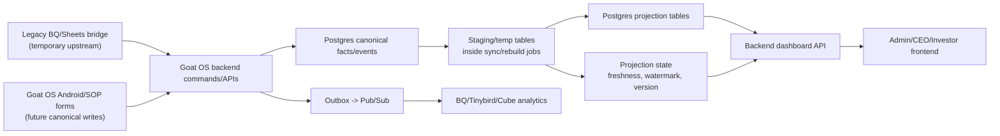

# High-Scale Dashboard Projection Architecture

Status: accepted global rule.

This decision applies to every Goat OS dashboard or report that slices large
operational data by month, date, breed, farm, shed, load, category, status,
gender, operator, source, or other business dimensions.

Examples include mortality, births, counts, feed, sales, procurement, health,
vaccination, fattening, shifting, MIS, promise risk, and future CEO/investor
charts.

## Product Requirements

Dashboards must feel as responsive at one million goats as they do during dev.
Users should be able to open a dashboard, switch tabs, change periods, and
compare categories without causing full-herd scans or expensive warehouse
queries on every page load.

Dashboard numbers must be:

- fast to read
- tenant-scoped
- freshness-visible
- auditable back to source facts
- rebuildable when source logic changes
- comparable to legacy dashboards during migration
- independent from temporary BQ/Sheets bridge details

Frontend screens may visually match legacy dashboards, but they must not inherit
legacy runtime data access. Legacy BQ/Sheets sources are temporary upstream
inputs only.

## Global Rule

Do not build large dashboard charts by calculating from raw facts on every
request.

For any feature with time/category/date/breed/farm/load/status charts, design
the feature as:

```text
canonical facts/events
  -> sync or projection worker
  -> Postgres projection tables
  -> backend API reads bounded projection rows
  -> frontend renders charts
```

Do not build:

```text
frontend request
  -> backend scans goats/events/source rows
  -> GROUP BY month/breed/farm/load on every page load
  -> frontend waits for live computation
```

Do not let frontend/mobile read BigQuery, Sheets, Firestore, GCS, or operational
databases directly.

## Relationship To Cube And Governed Metrics

Cube remains the semantic owner for governed KPI definitions. Operational
dashboards may still serve low-latency values from Postgres projection tables
when a KPI is declared dual-served.

Dual-served means:

```text
same metric definition
  -> operational Postgres projection for product dashboards
  -> Cube metric for governed analytics, AI, Metabase, and leadership answers
  -> automated parity gate on a fixed snapshot
```

The preferred implementation is for Cube to read the same projection tables or
the same canonical facts used by the projection worker. If Cube and a projection
worker both implement a formula, the feature is not complete until an automated
parity test proves they agree on a fixed snapshot.

Initial dual-served KPI registry:

| KPI | Operational serving home | Governed analytics home | Required gate |
| --- | --- | --- | --- |
| `active_goat` | identity/count projection tables | Cube | projection-vs-Cube parity on a fixed snapshot |
| `mortality_rate` | mortality projection tables | Cube | projection-vs-Cube parity on a fixed snapshot |

All other governed KPIs are single-home in Cube until a PRD/TRD explicitly
promotes them to dual-served and adds the same shared metric spec plus parity
gate.

## Technical Requirements

Every high-scale dashboard feature must define a PRD/TRD or equivalent design
section before implementation. That design must include:

- source facts/events and their grain
- target dashboard sections and metrics
- dimensions and allowed filters
- numerator/denominator definitions for rates
- freshness and source availability behavior
- legacy-to-canonical cutover, blend-mode, and cross-source dedup behavior when
  BQ/Sheets are temporary upstreams
- projection table shape
- rebuild strategy
- idempotency keys and content hashes
- review/conflict behavior
- API response contract
- screenshot or legacy parity plan when replacing an existing screen
- query-plan or index plan for hot reads/writes
- system diagram

## System Diagram



## Data Layers

### Canonical Facts And Events

Canonical facts/events are durable business truth. They are written through
backend commands with validation, idempotency, audit, and tenant scope.

Examples:

- goat identity events
- death events
- birth/kidding events
- abortion events
- sale events
- shifting events
- feed consumption events
- health/treatment events
- procurement/load facts
- SOP task completions

Facts should preserve source evidence and row hashes during migration. Once Goat
OS SOP/mobile writes are live, legacy BQ/Sheets should stop being the primary
write path.

### Projection Tables

Projection tables are dashboard-serving tables. They store chart-ready rows, not
raw source dumps.

Use module-owned projection tables by default, such as
`mortality_projection_rows`, `feed_projection_rows`, or
`birth_projection_rows`. Do not create a single global mega-table unless an ADR
justifies the hotspot, ownership, retention, and indexing tradeoffs.

Every module-owned projection table must implement this shared serving contract,
either as physical columns or as a stable view/API adapter that exposes the same
fields:

- tenant_id
- module or metric family, either as a column or table/view ownership
- period or time bucket
- section
- grain
- dimension key and label
- metric key
- numerator when relevant
- denominator when relevant
- numerator source composition and version when relevant
- denominator source composition and version when relevant
- metric value
- unit
- sort order
- projection version
- sync/rebuild run id
- source/evidence hash
- created_at / updated_at

Rates must store numerator and denominator, not only the final percentage. During
legacy-to-canonical cutover, rates must also store the source composition/version
of each side so mixed-source rates cannot appear as fresh canonical metrics.

Projection state should track:

- last successful sync/rebuild run
- source watermark
- projection version
- freshness status
- serving state
- source composition during cutover, when applicable
- row count
- conflict count
- unavailable sources
- rebuild_required
- last error

Dashboard API responses must expose projection freshness through the standard
response envelope, not as a one-off field per endpoint. The envelope must carry:

- as_of or last_success_at
- freshness_status: `green`, `yellow`, `red`, or `unknown`
- serving_state: `never_synced`, `fresh`, `stale`, `rebuilding`, `failed`, or
  `source_unavailable`
- stale/rebuild_required
- source_watermark when known
- unavailable_sources
- conflict_count
- projection_version

`freshness_status` is the shared traffic-light state and must stay compatible
with existing legacy-sync constraints. User-facing states such as `rebuilding`,
`failed`, or `source_unavailable` belong in `serving_state`, not in
`freshness_status`. During migration, APIs may also expose
`source_composition = legacy_only | canonical_only | blended`.

### Staging And Temp Tables

Sync/rebuild jobs may use staging or temp tables for bulk load, validation,
dedupe, and grouped computation.

Staging/temp tables are not dashboard-serving truth. The serving layer is the
committed projection table plus projection state.

### Redis And Caches

Redis is optional and never canonical.

Allowed uses:

- short-lived API response cache
- job progress display
- rate limiting
- lightweight locks when Postgres advisory locks are not enough

Redis must not be the only place where dashboard values, freshness, or audit
state exist.

## Rebuild Strategy

First implementation may perform a full projection rebuild when the source
volume is small, but the design must not depend on full-history rescans forever.

The schema and indexes must allow scoped rebuild by:

- tenant
- module
- period/time bucket
- source table or source type
- source row hash
- grain
- dimension
- sync/rebuild run

Large imports may rebuild grouped projections at run completion. Steady-state
SOP writes should update affected buckets incrementally or mark them stale for a
bounded worker to refresh.

## Query Rules

Dashboard API read paths must be bounded indexed reads over projection tables.

Acceptable:

```sql
SELECT dimension_label, metric_key, numerator, denominator, metric_value
FROM mortality_projection_rows
WHERE tenant_id = $1
  AND period = 'overall'
  AND section = 'breed'
ORDER BY sort_order, dimension_label
LIMIT 200
```

Not acceptable on page load:

```sql
SELECT breed, count(*)
FROM goat_events
WHERE tenant_id = $1
GROUP BY breed;
```

Raw fact scans are allowed inside controlled rebuild jobs, replay harnesses,
debug tools, and migration validation, not inside dashboard request handlers.

## Legacy Migration Rule

During migration, BQ/Sheets can feed Goat OS Postgres through backend sync jobs.
The frontend still reads Goat OS APIs only.

When both legacy and canonical sources can describe the same dashboard fact,
features must follow `docs/features/cutover-contract.md`. That contract owns the
shared rules for blend mode, canonical-vs-legacy precedence, cross-source dedup,
audited coverage completion, composite-metric source compatibility, shadow
parity, universal Locations alias resolution, and BQ/Sheets removal gates.

Legacy dashboard formulas must be pinned before porting a screen:

- metric definitions
- denominators
- category boundaries
- date buckets
- filters
- source tables
- null/unknown handling
- sorting

For an existing legacy screen, visual parity and numeric parity are separate:

- Visual parity compares layout, labels, tabs, chart type, colors, spacing, and
  responsive behavior.
- Numeric parity compares Goat OS API output against the same legacy source
  snapshot or equivalent SQL oracle.

Do not compare a current live legacy screen to an older local sync snapshot and
call number drift a UI bug.

Numeric parity must produce an artifact with value-by-value comparisons, not
only a pass/fail log line. For dual-served KPIs, parity must include both:

- legacy source snapshot vs Goat OS projection during migration
- Goat OS projection vs Cube once the Cube metric exists

## Mortality Example

Mortality death count is event-based and intentionally does not equal the
Counts page's current dead-passport count.

Examples:

- Mortality Total Deaths: all-time death/mortality events.
- Counts page dead: goats currently in a dead lifecycle state.

Do not compute mortality by counting `goats.lifecycle = 'dead'`.

Mortality projections should be based on death, abortion, birth/kidding, load,
farm, breed, and delivery facts. Goat identity linkage is useful evidence, but
an unmatched historical death event must not disappear from event-based
mortality totals merely because the exact passport could not be resolved.

## Acceptance Checklist

Before building a large dashboard feature, confirm:

- A PRD/TRD or design section exists.
- A system diagram exists.
- The metric grain and formulas are pinned.
- Frontend data path is Goat OS API only.
- Backend API reads projection rows only.
- Projection rows are tenant-scoped and indexed.
- Freshness/source availability is visible.
- Rebuild is idempotent and retry-safe.
- Review/conflict handling is defined.
- Legacy visual and numeric parity gates are defined where applicable.
- Cutover/blend-mode and cross-source dedup gates are defined where BQ/Sheets
  are temporary upstreams.
- Query-plan validation is added for hot paths that can touch large tables.
- One-million-goat scale is proven or credibly simulated for hot reads and any
  rebuild path that can touch goat/fact tables. A large dashboard is not
  production-complete if the proof still depends on request-time full-herd scans
  or unbounded aggregations.

If these are missing, stop and write the design before coding.
