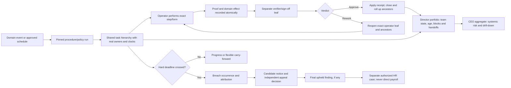
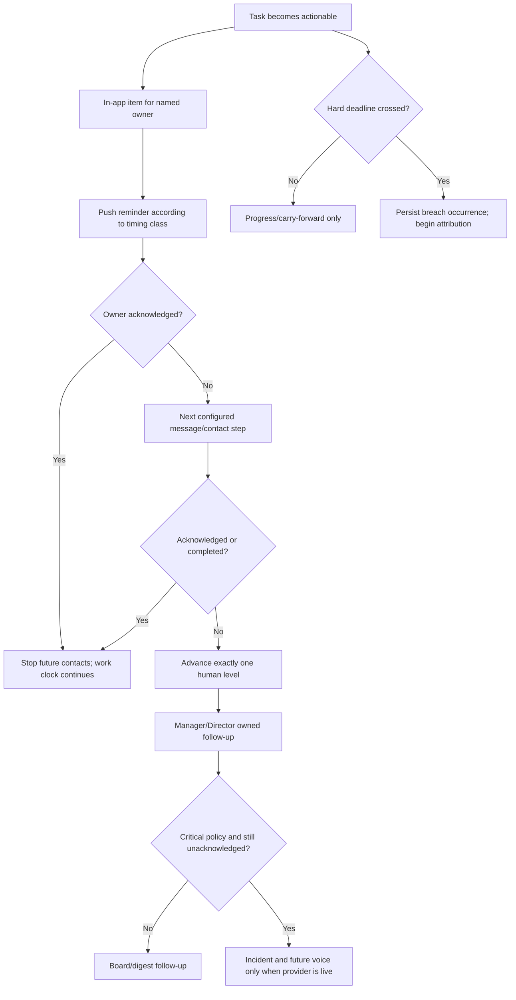
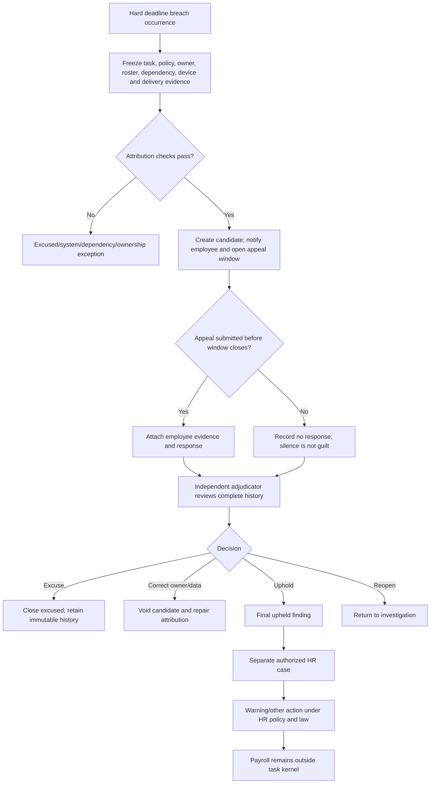

# Task Timing, Alerting, Violations, Appeals, and Role Views

Status: **ACCEPTED product and architecture policy**

Date: 2026-08-10

## Decision

Goat OS separates five facts that must never be collapsed into one status:

1. when work is planned or becomes available;
2. when the work is genuinely due;
3. whether a flexible carry-forward period is allowed;
4. whether a hard safety or operational deadline was breached; and
5. whether a named person is responsible after evidence, attribution, notice,
   appeal, and decision.

A late task is not automatically an employee violation. A notification failure,
owner-resolution failure, stock shortage, approved leave, replacement failure,
system outage, changed procedure, or blocked dependency is not silently charged
to the operator. Salary or payroll action is never calculated or applied by the
task kernel.

This decision governs the shared task kernel, every module adapter, Today/My
Tasks, Calendar, Action Center, manager/Director boards, CEO views, Verification,
notification/contact policy, analytics, and any future HR case integration.

## Plain-language rule

```text
Planned late
  = progress signal

Hard deadline crossed
  = breach occurrence

Breach + valid owner + fair opportunity + no accepted excuse
  = violation candidate

Candidate + notice + appeal window + independent adjudicator decision
  = final finding

Final upheld finding + separate authorized HR process
  = possible HR action
```

Only the last line may enter an HR decision surface. Goat OS must not turn a
task status, reminder, missed row, verifier delay, or alert-delivery result into
a payroll deduction.

## Canonical clock vocabulary

Every human task adapter must persist the fields that apply and explicitly mark
the others not applicable. Clients must not infer these values.

| Field | Meaning |
|---|---|
| `available_at` | Earliest time the person can start the work. It is not a deadline. |
| `planned_at` / `planned_business_date` | Intended schedule used for planning and progress. Crossing it may create carry-forward visibility, not a violation. |
| `window_start_at` | Start of the valid execution window. |
| `hard_deadline_at` | Ratified safety or operational deadline. Only this can create a breach occurrence. |
| `flexible_until` | End of an explicitly allowed carry-forward/grace band. It cannot extend a stricter clinical boundary. |
| `clinical_latest_safe_at` | Latest safe time derived from the pinned clinical rule for the exact subject. It takes precedence over a drive-level planning extension. |
| `contact_next_at` | Next acknowledgement/contact timer. This is independent from the work deadline. |
| `appeal_due_at` | Appeal deadline from the applicable HR policy. No default is invented by this ADR. |
| `business_timezone` | Persisted timezone; India business dates use `Asia/Kolkata`. |
| `clock_policy_version` | Immutable version of the rule that produced the clock. |

An action without a ratified `hard_deadline_at` cannot create a personal
violation. It may still be visible as old, delayed, blocked, or needing manager
follow-up.

## Timing classes

| Class | Meaning | Contact behavior | Violation eligibility |
|---|---|---|---|
| `critical_safety` | Immediate animal, disease, death-cluster, biosecurity, or comparable safety risk. | Named-person push/contact waterfall; voice is permitted only after a real provider and policy are activated. | Yes, after attribution and appeal. |
| `hard_operational` | A ratified operational window where late execution creates a real loss or control failure. | Owner reminders, then one human level at a time if unacknowledged. | Yes, after attribution and appeal. |
| `flexible_planned` | Planned work that may carry forward without harm. | In-app/push reminders and manager digest; no incident paging or voice for ordinary aging. | No merely for crossing the planned date or allowed extension. |
| `machine_only` | Scheduler/import/calculation work with no human assignee. | Platform monitoring and an owned operations exception on failure. | Never an employee violation. |
| `unratified` | Source proves work exists but does not prove a hard deadline, grace, owner, or after-hours rule. | Shadow/read-only progress until policy is resolved. | Never until ratified. |

## TTL and retention rules

There is no universal “violation TTL.” Each timer has one meaning:

- a task deadline/flexible band comes from its pinned operational or clinical
  clock policy;
- a contact run remains active only until acknowledgement, completion,
  cancellation, or the configured contact plan ends;
- a candidate appeal closes at `appeal_due_at` from the versioned tenant HR
  policy; when that policy is absent, the candidate cannot auto-finalize;
- breach, attribution, appeal, decision, correction, and HR-action evidence is
  immutable audit history and is retained under the ratified records policy;
  workers must never delete it merely because a timer elapsed; and
- a final finding does not silently expire or become a salary instruction. Any
  review/expiry/retention behavior belongs to the separate HR policy.

## Action and feature timing register

This register is the accepted policy boundary. “Current” describes the audited
source behavior; “target” states what the shared kernel may activate. A module
cannot invent a stricter clock in code or a client.

| Action family | Current source/runtime clock | Accepted target class and rule | Employee-violation rule |
|---|---|---|---|
| Vaccination drive | Current runtime sends D-7 and D-6..D0 reminders and has due-age escalation/missed behavior. | `flexible_planned`. The drive date is a planning target. D+1 and D+2 are an accepted carry-forward band. `flexible_until` must be capped by the earliest applicable animal-level `clinical_latest_safe_at`; a clinical boundary always wins. After the band, create an operational capacity/exception review, not an automatic personal violation. | No violation for a one- or two-day drive extension. A clinical safe-window breach may create a candidate only at exact animal/rule/owner grain after attribution. |
| Weighing campaign/bucket | Existing local work rows roll forward and record delayed state from the authored business date. | `flexible_planned`. D+1 and D+2 are normal carry-forward. Show age and progress, keep execution open, and create a manager capacity follow-up only when useful. There is no inferred weekly/monthly recurrence or medical deadline. | Never from the authored date, roll-forward, or ordinary aging alone. No incident/voice escalation for normal Weighing delay. |
| Birth: immediate colostrum | Source says first few hours and continued feeding through the first 48 hours; there is no accepted universal four-hour birth deadline. | Procedure step with a source-backed window. Exact hard limit remains unratified unless the published procedure supplies one. | Not eligible until a precise rule and owner are pinned. |
| Birth: standing check | Current hard-coded task is approximately birth +1 hour. | `hard_operational` only after the published Birth procedure pins the step, owner, grace, proof, and exception policy. | Candidate only for that step after attribution; never infer from the whole Birth workflow. |
| Birth: colostrum sessions | Current steps use 07:00, 11:00, 15:00, 18:30, and 22:00 slots for remaining birth-day sessions and the next day. | Per-session procedure leaves. The procedure must say which slots are hard, acceptable grace, and what rescue branch applies. | No violation from a missed aggregate workflow row; only from a ratified session rule. |
| Birth: ORS2 | Current code schedules ORS2 50 minutes after ORS1 completion. | Dependent procedure step whose clock begins from the actual ORS1 completion receipt. | Eligible only if the dependency receipt, owner, availability, and policy are valid. |
| Birth: tagging | Current task is day +2 at 07:00. | `hard_operational` only if the published procedure ratifies deadline/grace. | Not eligible from the current hard-coded template alone. |
| Death reporting and evidence | Current private workflow requires proof but has no complete named-owner deadline/contact policy. Source expects completion by the next day at worst. | Ordinary evidence completion is a next-day operational target. Disease suspicion, unexpected death cluster, or biosecurity risk is a separate `critical_safety` incident with immediate ownership and a leadership ceiling no later than four hours. | Routine next-day lateness requires attribution. The four-hour rule applies to critical disease/death/biosecurity escalation, not every Birth action and not every ordinary death-form step. |
| Health treatment sessions | Current generated sessions use 08:00, 13:00, and 17:00. Completion currently lacks full per-step owner/proof/sign-off/contact enforcement. | Each published procedure step states availability, deadline, proof, rescue/critical handoff, and verifier policy. Critical steps use `critical_safety`; ordinary steps remain `unratified` until authored. | No violation from the existing bulk session-complete shortcut. |
| Not Eating | Adult/kid protocols exist in committed Health source and can use the generic Health importer/runtime; deployed publication is not proven. | Part of the Health procedure family, not a second private workflow. It remains shadowed until the exact published version, per-step execution, owner, clock, proof, sign-off, and critical handoff are proven. | No current personal-violation authority. |
| Shifting: high priority | High-priority work is visible immediately. | Availability is immediate; the actual execution deadline must come from a pinned Shifting procedure/policy. | Immediate visibility alone is not a hard deadline. |
| Shifting: low priority | Before 13:30 it becomes visible next day; at/after 13:30 it becomes visible day +2. Current code explicitly treats this as visibility, not authority. | `flexible_planned` until a separate deadline is ratified. | No violation from visibility age alone. |
| Feed issue/amend/lock | Source clock: Day N 09:00 full direction for Day N+1; 13:30 shifting cutoff; 13:30-13:45 Diff; Day N 15:00 packed/diff-corrected stock staged for service. Current runtime instead freezes normal next-day work around 07:00, experiment/correction work around 14:00, and locks/raises Transport at 15:30; that implementation timing must be reconciled to the accepted versioned policy. | `machine_only` but time-bounded. Persist run/version/receipts/reconciliation and route a missed machine clock to a real platform/configuration owner. | Never an operator violation; a machine failure is not charged to field staff. |
| Feed packing | Source requires the combined packing/loading/transport chain to leave packed and corrected stock staged outside sheds by Day N 15:00 for Day N+1 service. Current completion/proof rows do not enforce that terminal clock or create a named owner at materialization. | `hard_operational`. Maintainer policy confirms Packing is on-time work. Generate it from immutable issued work and assign it early enough to meet the 15:00 chain terminal. The separate Packing leaf deadline/lead time must be effective-dated and versioned before activation; it cannot be inferred after the fact. No overnight carry-forward is allowed. Rework gets a recovery clock but cannot erase the original chain breach. | A personal candidate requires the exact ratified Packing leaf deadline plus owner, stock/config readiness, issued-sheet correctness, offline proof time, handoff receipt, and system/dependency attribution. The 15:00 chain breach alone does not guess which person caused it. |
| Feed transport/staging | Source requires the truck to have loaded and staged the packed/diff-corrected feed outside sheds by Day N 15:00. Current code creates the separate Transport task only at/after 15:30 and first submit claims an owner; it has no `due_at` or missed transition. That 15:30 behavior conflicts with the source deadline and is a defect, not an accepted extension. | `hard_operational`. Maintainer policy confirms Transport is on-time work. Create and assign it early enough to meet the 15:00 chain terminal. Persist a versioned route/loading lead-time and leaf deadline; route policy may be stricter. No ordinary lateness grace or overnight completion is allowed. | A personal candidate requires the ratified Transport leaf deadline, preassigned duty owner, ready-stock handoff, working route/vehicle/system, and exact load/departure/arrival/staging evidence. |
| Feed distribution and conditional water | Source serving slots default to Day N+1 09:00 and 15:00 with a 50/50 split. Current session configuration stores labels/split but not the complete due policy, and completion writes do not enforce current-time actionability. | `hard_operational` for physical distribution at each published serving slot. If a published session policy requires water, it must separately pin order, owner, clock/grace, and proof; a different water owner is allowed. Independent verification follows without changing physical service time. | A late-session candidate uses the ratified physical step clock and attribution. Water is attributable only under its pinned policy. Verifier delay is never charged to the distributor or water operator. |
| Milk preparation | Current daily workflow has hard-coded steps but no accepted hard deadline. | Published conditional procedure with real owner, per-step clocks, proof, and sign-off. | No current personal-violation authority. |
| Milk feeding | Current task availability is 08:00, 12:00, 16:00, and 21:00. | Each session needs an authored close/grace, refusal/clinical branch, owner, and sign-off. Availability is not the deadline. | No violation until that policy is ratified and attributed. |
| Count projection exception | Existing exceptions use immediate/2-hour/24-hour-style severity targets and may have no real owner. | Operational/data exception owned by a named resolver; do not equate projection mismatch with physical-count misconduct. | Only a separately governed resolver task could qualify; the mismatch itself cannot. |
| Verification/sign-off | Some categories declare 24-hour SLA metadata, but it is not uniformly enforced and queues are not yet shared owned tasks. | A separate verifier/sign-off sibling leaf with real owner, persisted deadline, contact policy, and producer-application receipt. Critical review may be hard; routine review policy is explicit per category. | Operator is never blamed for verifier delay. Verifier candidate requires exact ownership/availability and its own deadline. |
| Procurement/source/arrival/intake/holding | Current read models infer dates and often have no durable owner/clock. | Versioned procedure runs and durable shared tasks. Current inferred hints are not disciplinary clocks. | No current personal-violation authority. |

### Vaccination clinical cap

The drive and the animal obligation are different grains:

```text
drive planned date D
  -> accepted operational carry-forward through D+2
  -> but never beyond the earliest applicable animal clinical latest-safe time
```

If one animal reaches an earlier clinical boundary, the kernel separates that
animal into a clinical exception/priority action. It does not reclassify the
entire drive as an operator violation.

### Weighing carry-forward

Weighing may display `rolled forward`, days open, and current progress from D+1.
Those are planning analytics. Through D+2 they are explicitly normal. After D+2
the system may create a Director-owned capacity/unblock follow-up, but no
employee violation exists without a different, explicitly ratified rule.

## End-to-end operating flow



The Director and CEO branches are read/intervention lenses over the same graph;
they do not duplicate every operator task into the leader's personal queue.

## Role views

The same task graph supports different lenses. A Director or CEO does not need
to be assigned every operator task to see progress.

### Operator — My Tasks

```text
MY WORK
Due/available       Task                  State                 Next action
08:00               Feed K1              In progress           Upload proof
Today               Vaccination Drive    61 / 120 handled      Continue drive
Carried forward +1  Weighing G2P3        18 rows captured      Continue
--                  Appeal VC-104        Notice received       Add evidence
```

The operator sees their owned work, exact next step, clock type, evidence state,
contacts/acknowledgement, candidate notices, and appeals. A flexible task must
say `planned` or `carried forward`, not falsely say `violation`.

### Director — team board plus owned interventions

```text
TEAM OPERATIONS
Pending  21 | In progress 14 | Awaiting proof 3 | In review 7
Rework    2 | Blocked      4 | Carried forward 9 | Breached 1

FOLLOW-UPS I OWN
- Unblock Feed Packing: stock/config dependency
- Review appeal VC-104
- Assign replacement for Health 13:00 session
- Verification queue exceeded its ratified SLA
```

The Director can filter by park, module, procedure, owner, date, timing class,
state, proof, verification, dependency, breach, and appeal. The board shows what
others are doing like a Jira portfolio. Only intervention work appears in the
Director's own task list: approval, unblock, reassignment, an appeal decision
only when independently assigned and non-conflicted, sign-off, critical
escalation, or requested follow-up.

### CEO — exception portfolio, not 100 task cards

```text
CEO OPERATIONS
Critical now: 2       Hard breaches: 3       Unowned exceptions: 1
Flexible carry-forward: 27 (Vaccination 18, Weighing 9)
Verification aging: 6  Rework loops: 2        Open appeals: 4

Top systemic risks
1. Feed proof backlog across 3 parks
2. Vaccination capacity risk before 2 animal clinical boundaries
3. Director follow-up overdue in Health
```

The CEO sees tenant-level rollups, systemic clusters, critical risks, Director
accountability, and drill-down to the exact task/evidence/history. Routine
Vaccination or Weighing carry-forward stays aggregated unless a clinical or
systemic threshold is crossed.

### HR — final-case surface only

```text
HR CASES
Final upheld findings | Excused | Corrected attribution
Authorized HR actions | Reversed/corrected actions | Audit history
```

HR does not see raw task lateness as guilt. Only a final, appeal-complete finding
may enter this surface. Any warning, leave, attendance, or pay consequence is a
separate authorized HR action under the applicable employment policy and law.
The task kernel never edits payroll.

## Alert and acknowledgement model

### Current production truth

The existing runtime is not the target waterfall:

- Vaccination reminders are generated on the five-minute operational cadence
  and queue FCM requests for the D-7/D-6..D0 rhythm.
- Due-age escalation computes the highest crossed level from the source due
  time. It can jump directly to a later level rather than advance one level at a
  time after an acknowledgement wait.
- Current defaults are approximately L1 at due, L2 +4 hours, L3 +24 hours, and
  L4 +48 hours; the ordinary obligation missed sweep uses a +24-hour default.
- Acknowledging the current row does not reliably stop later levels.
- L1 is effectively local-stub/log-only, L2 is Slack, and L3/L4 use an incident
  webhook. Current escalation rows can carry role slugs instead of a resolved,
  on-duty named person.
- There is no production telephone/IVR, SMS, or WhatsApp gateway. Email, Slack,
  generic webhook, FCM, and incident gateway cases exist, but repository source
  cannot prove which external secrets/providers are live in a deployment.
- Feed currently sends proof-transition FCM notifications (pending, rework,
  approved/closed), including broad leadership/CEO fan-out on some transitions.
  It has no Feed deadline reminder, acknowledgement timer, missed transition,
  or escalation run, and verification can remain pending indefinitely. Target
  Feed contacts must use the named owner/verifier/Director waterfall and CEO
  aggregate/systemic-exception view instead of one push per proof transition.
- Vaccination currently sends a direct D0 20:30 FCM to the PC Director and CEO;
  this is compatibility behavior, not the target aggregate-only CEO policy.
- Weighing currently sends D+1 roll-forward and delayed pushes directly to the
  operator, Director, and CEO. That audience conflicts with the accepted D+1/D+2
  flexible band and must be shadowed, compared, and suppressed before shared
  contacts activate. Tests that currently require those direct audiences must be
  updated with the cutover.

Therefore current missed/escalation rows are operational evidence only. They
must not be treated as employee violations or salary inputs.

### Required target waterfall



Rules:

1. the work clock and contact clock are independent;
2. acknowledgement stops future contacts but does not change due/breach state;
3. completion/cancellation resolves the contact run;
4. a contact worker rechecks acknowledgement/resolution immediately before send;
5. delivery failure may jump exactly one human level only when the pinned policy
   allows it and records the reason;
6. flexible work uses reminders, board badges, and digest—not voice or incident
   paging for ordinary aging;
7. voice is allowed only for a ratified `critical_safety` policy after a real
   telephony provider, consent/regional policy, delivery receipt, retry, and
   operational proof exist;
8. one active run per task/breach and idempotent person/channel attempts prevent
   duplicate alert storms.

## Violation, appeal, and HR flow



### Mandatory attribution checks

Before a candidate is created, the system must prove and snapshot:

- exact task, procedure version, step, timing policy, deadline, and timezone;
- real owner during the actionable window, assignment history, and row version;
- on-shift status, approved leave, week-off, replacement/backup, and reassignment;
- whether the task became available with enough fair execution time;
- dependencies such as stock, issued work, prerequisite step, animal status,
  system/API/device outage, media upload, or verifier availability;
- acknowledgement/contact and delivery evidence;
- completion/proof timestamps, including offline capture and later sync;
- defer, cancel, correction, reopen, and policy-change history; and
- whether the alleged breach belongs to the operator, verifier, manager,
  configuration owner, platform, or no person.

An unresolved attribution check fails closed into an owned investigation task.
It does not default to the operator.

### Candidate and appeal rules

- A candidate has a stable case ID and immutable task/policy/evidence snapshot.
- The employee sees the exact rule, time, evidence, attributed owner, and reason.
- Appeal evidence is additive; original records are never deleted.
- The no-response path is explicit: after the pinned appeal window closes, the
  case still goes to independent adjudication. Silence is not automatic guilt,
  cannot auto-uphold the candidate, and cannot authorize an HR action.
- The appeal window and adjudicator decision SLA come from a versioned tenant HR
  policy. Until that policy is ratified, cases cannot auto-finalize.
- The versioned HR policy resolves an independent adjudicator. For an ordinary
  non-conflicted operator case this may be the relevant Director. If the alleged
  actor is a Director, the Director is conflicted/absent, or that Director's own
  dependency decision is under review, the case routes to the defined alternate
  or next-higher independent authority. No one may adjudicate their own case.
- Adjudicator outcomes are `upheld`, `excused`, `attribution_corrected`, or
  `reopened`; reason and evidence are mandatory.
- Corrections use void/supersession records, never destructive edits.
- No one may adjudicate their own alleged breach.
- Operator and verifier accountability are separate. One person's delay is not
  charged to the other.

### HR boundary

The shared kernel produces a final finding, not a salary instruction. A separate
HR workflow decides whether the finding has any consequence. That workflow owns
authorization, policy version, employee notice, legal review where required,
action type, effective date, reversal, and audit. Payroll integration, if ever
approved, consumes only an explicitly authorized HR action—not task or breach
tables—and must never be automatic.

## Analytics without punishment-by-dashboard

### Operator analytics

- assigned, started, submitted, verified, completed, and carried-forward counts;
- on-time rate by ratified hard clock, shown separately from flexible plan
  adherence;
- active workload/capacity, concurrent work, after-hours contacts, and blocked
  time;
- proof upload/sync failure, verification wait, rework count/reason, and first-
  pass acceptance;
- candidate, appeal, excused, corrected-attribution, and final-upheld counts as
  separate measures.

### Director analytics

- team WIP by state and age;
- workload distribution and over-capacity/under-coverage periods;
- dependency and configuration blocks;
- operator-to-verifier handoff time and verifier backlog;
- follow-up tasks accepted/resolved by the Director;
- flexible carry-forward versus true hard breach;
- appeal outcome and attribution-correction rate.

### CEO analytics

- critical incident and hard-breach trends by park/module/policy;
- flexible-plan carry-forward trends without treating them as violations;
- systemic dependency, staffing, proof, verification, and delivery failures;
- repeated rework loops and Director follow-up aging;
- upheld rate only after appeal, with excused/corrected outcomes alongside it;
- workload saturation and after-hours contact burden to detect overwork.

Unadjudicated candidates must not feed employee rankings, incentives, salary,
or disciplinary dashboards. Comparisons require sufficient sample size and the
same role, scope, timing class, opportunity, and procedure version.

## Required data model boundaries

The implementation may refine names but not these separations:

- `task_nodes` own shared coordination and link stable source/procedure/step;
- `task_clock_snapshots` pin planning, flexibility, hard deadline, clinical cap,
  timezone, and policy version;
- `escalation_runs`, `escalation_steps`, and `contact_attempts` own contact state;
- `breach_occurrences` record objective deadline crossings;
- `attribution_snapshots` record owner/roster/dependency/system evidence;
- `violation_cases` own candidate/final state;
- `violation_appeals` and `violation_decisions` preserve review history;
- `hr_actions` are a separate HR-owned boundary; and
- payroll has no foreign key or direct consumer from tasks, escalations,
  breaches, or candidates.

Flexible carry-forward may create task history and analytics but never a
`breach_occurrence`. A hard breach may create a `breach_occurrence` but cannot
create a final finding without attribution, notice, appeal policy, and decision.

## Activation and acceptance gates

No module may activate violations/appeals until all of the following pass on the
production path:

1. timing classification and clock-policy source are ratified;
2. owner and replacement resolution are real-person and on-duty aware;
3. source/procedure/task/step identities and history are stable;
4. flexible, clinical-cap, hard-deadline, defer, cancel, reopen, and correction
   behavior have real-PostgreSQL tests;
5. contact acknowledgement fences already-leased sends;
6. offline capture time and server receipt time cannot falsely attribute delay;
7. attribution reproductions cover leave, week-off, replacement, stock,
   dependency, system outage, device/no-route, and verifier delay;
8. candidate notice, appeal, decision, correction, and immutable audit pass
   authorization and tenant-scope tests;
9. Director/CEO/HR read models agree with the canonical facts at pagination and
   scale boundaries;
10. salary/payroll cannot be reached from a task, breach, or unfinalized case;
11. reconciliation reports missing/duplicate task, contact, breach, candidate,
    appeal, and decision rows with durable repair outcomes; and
12. legacy direct Vaccination, Weighing, Feed, and other module contacts are
    shadowed and then suppressed before shared contacts activate, with no-double-
    send and rollback proof; and
13. deployment and live-schema proof confirm the exact policy/version in use.

Until then, current missed/delayed/escalation data remains operational evidence,
not employee-discipline truth.

## Precedence and companion sources

This ADR supersedes any older text that:

- treats Vaccination drive D as a personal hard deadline without the accepted
  D+1/D+2 extension and clinical cap;
- treats ordinary Weighing carry-forward as a violation or paging condition;
- calls any raw `missed`, `overdue`, or escalation row a final violation;
- claims acknowledgement currently stops the production ladder;
- claims production telephone/SMS/WhatsApp delivery exists; or
- implies that Goat OS may deduct salary from task data.

Companion sources:

- `docs/decisions/operational-task-kernel-non-deviation.md`
- `docs/decisions/vaccination-notification-rules.md`
- `docs/features/weighing/PRD.md`
- `docs/features/weighing/TRD.md`
- `docs/features/critical-animal-action-guardrails.md`
- `context/architecture/operational-kernel.md`
- `context/execution/operational-task-kernel-remediation-plan.md`
- `context/execution/defect-prevention-execution-contract.md`

Changing a timing class, deadline, flexible band, critical channel, violation
rule, appeal authority, or HR boundary requires explicit maintainer authority
and same-change updates to the applicable module policy, procedure version,
tests, structural/stronger controls, analytics contracts, and this ADR.
