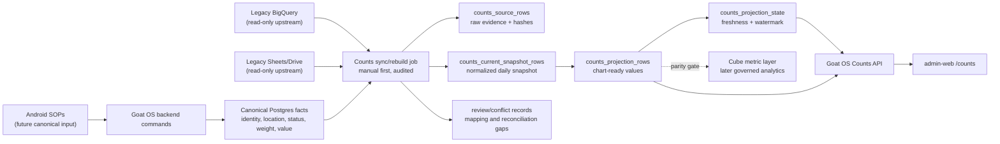

# Counts TRD

Status: draft for implementation review.

## Technical Summary

Counts is a high-scale dashboard feature. It must follow
`docs/decisions/high-scale-dashboard-projections.md` and the migration cutover
rules in `docs/features/cutover-contract.md`.

The frontend reads Goat OS APIs. The APIs read bounded Postgres projection rows.
Sync/rebuild workers may read legacy BQ/Sheets during migration and canonical
Goat OS facts after cutover. Request handlers must not scan raw goats, raw
source rows, or BigQuery to render charts.

V1 parity is built around a normalized daily snapshot:

```text
counts_source_rows
  raw BQ/Sheets source evidence and hashes

counts_current_snapshot_rows
  normalized current-state count/KPI rows by date and business dimensions

counts_projection_rows
  dashboard-serving chart and KPI rows

counts_projection_state
  freshness, watermark, conflict counts, unavailable sources, projection version
```

Existing `goat_identity_counters` remains useful for Goat OS identity cards and
future canonical rebuilds, but it does not by itself provide full legacy Counts
parity because the legacy page also needs daily snapshot detail, status x breed,
age/gender KPIs, weight, and value.

Counts also depends on the shared Locations feature:

- `docs/features/locations/PRD.md`
- `docs/features/locations/TRD.md`

Build Counts and Locations in the same delivery slice. Locations owns canonical
farm/shed/holding records, aliases, capacity, and usage checks. Counts consumes
those records and does not create a private location master.

## System Diagram



## Data Store Matrix

| Store | Used for Counts v1? | Role |
| --- | --- | --- |
| Postgres | Yes | source evidence, normalized snapshots, projections, freshness, audit, review |
| BigQuery | Yes, upstream only | temporary legacy source during migration |
| Sheets/Drive | Indirectly, upstream only | temporary legacy source where BQ/views depend on Sheets |
| Redis | Optional | short-lived API cache, job progress, locks, or rate limiting only |
| Cube | Later | governed metric layer after parity gates |
| Tinybird | No | not needed for current Counts dashboard |
| Time-series DB | No | Postgres date-bucketed projections are enough for v1 |

Redis must not be canonical. Postgres advisory locks are sufficient for v1
sync-run mutual exclusion. If Redis is later used for a dashboard payload cache,
the TTL should be short, for example 30 to 60 seconds, and projection publish
must invalidate it.

## Source Inputs

Implementation must pin and probe these legacy sources:

| Source ID | BQ table | Dataset | Required fields | Role |
| --- | --- | --- | --- | --- |
| `legacy_counts_detail` | `counting_db_with_holding_dev` | `ceo_dashboard` | `date`, `farm`, `shed`, `shed_tag`, `breed`, `age`, `goat_count`, `staff`, `shed_name` | Daily detail counts |
| `legacy_counts_summary` | `daily_summary_dev` | `farm` | total, CBE, CPT, procurement count/weight/value columns | KPI count, weight, value |
| `legacy_counts_kpis` | `counting_kpis_daily` | `ceo_dashboard` | `as_of_date`, `metric_name`, `farm`, `animal_type`, `fattening_gender`, `total_count` | Age and gender KPIs |
| `legacy_core_farm_genderwise` | `core_farm_genderwise` | `ceo_dashboard` | `farm`, `breed`, `gender`, `total_count` | Core Farms breed x gender |
| `legacy_shed_capacity_status` | `counting_shed_capacity_status_dev` | `ceo_dashboard` | `farm`, `shed`, `capacity` | Per-shed capacity evidence for Locations/Infra |
| `legacy_farm_capacity` | `shed_capacity_count_dev` | `ceo_dashboard` | `farm`, `total_capacity_farm`, `total_vacancy_farm` | Farm-level capacity/vacancy parity |

The dataset column follows the legacy `table(...)` helper, including the
`daily_summary_dev` override to the `farm` dataset while most Counts tables use
the default `ceo_dashboard` dataset.

Observed on 2026-06-19 Asia/Kolkata, the legacy deployment returned
`2026-06-18` as the latest overall snapshot through `/api/counts`, with 454
detail rows and total count 2,088. Treat this as a dated parity-run observation,
not a hardcoded expected value.

Source classification:

- All legacy Counts sources are snapshot or KPI inputs for Counts projections.
- No Counts source creates canonical goat passports, identifiers, lifecycle
  events, birth/death/sale events, weight events, or valuation facts.
- `daily_summary_dev` may serve migration-period weight/value KPI parity, but
  it does not create canonical weighing or valuation history.
- After Android/backend cutover, canonical Goat OS facts rebuild the same
  normalized snapshot/projection contract.

## Formula Register

Implementation must preserve this register and update it if legacy code proves
a different formula.

| Metric/section | Source basis | Filter/tab behavior | Projection metric key | Expected parity |
| --- | --- | --- | --- | --- |
| Total Active Goats | `daily_summary_dev` count columns | overall, core = CBE + CPT, CBE, CPT, holdings = procurement/holding | `active_goat_count` | exact |
| Farm Value | `daily_summary_dev` weight value columns | same tab rules as count | `farm_value_inr` | exact during BQ migration |
| Total Weight | `daily_summary_dev` weight columns | same tab rules as count | `total_weight_kg` | exact during BQ migration |
| Avg Weight per Goat | total weight / active goat count | null when denominator absent or zero | `avg_weight_kg_per_goat` | exact after rounding rules pinned |
| Breeds Tracked | distinct positive breed count from detail rows | selected tab only | `breeds_tracked` | exact |
| Count by Status | sum `goat_count` by `shed_tag` | selected tab and snapshot date | `count_by_status` | exact |
| Count by Breed | sum `goat_count` by `breed` | selected tab and snapshot date | `count_by_breed` | exact |
| Status by Breed | sum `goat_count` by `shed_tag` x `breed` | selected tab and snapshot date | `count_by_status_breed` | exact |
| Count by Farm | sum `goat_count` by `farm` | hidden on single-farm tabs | `count_by_farm` | exact |
| Farm Distribution | same as Count by Farm, rendered as share | hidden on single-farm tabs | `farm_distribution` | exact |
| Count by Age | `counting_kpis_daily` where `metric_name = 'age_wise_count'` | selected tab, aggregate by `animal_type` | `count_by_age` | exact |
| Adults by Gender | `counting_kpis_daily` where `metric_name = 'adults_by_gender'` | selected tab | `adults_by_gender` | exact |
| Kids by Gender | `kids_by_gender + genderwise_fattening_count` | selected tab except Holdings | `kids_plus_fattening_by_gender` | exact |
| K0 to K3 Kids by Gender | `counting_kpis_daily` where `metric_name = 'kids_by_gender'` | selected tab except Holdings | `kids_by_gender` | exact |
| Fattening by Gender | `counting_kpis_daily` where `metric_name = 'genderwise_fattening_count'` | selected tab except Holdings | `fattening_by_gender` | exact |
| Fattening Kids Male Breedwise | `core_farm_genderwise` rows with male gender | Core Farms only | `core_farm_male_breedwise` | exact |
| Fattening Kids Female Breedwise | `core_farm_genderwise` rows with female gender | Core Farms only | `core_farm_female_breedwise` | exact |

Legacy date behavior:

- Detail rows from `counting_db_with_holding_dev` use the selected
  `snapshot_date`.
- Age/gender KPI rows from `counting_kpis_daily` use the selected
  `snapshot_date`.
- Summary KPI rows from `daily_summary_dev` are always read from yesterday in
  IST in the legacy API, even when a historical `date` parameter is supplied.

For `snapshot_date=latest`, these usually line up. For historical dates, Counts
must either preserve this summary-date quirk in legacy-parity mode or mark the
summary KPI differences as explicit explained deltas. Store and return
`summary_source_date` so the UI and parity artifacts can explain the source.

Null and unknown handling:

- Empty labels become `Unknown` only in display/projection dimensions.
- Positive counts with unknown labels remain visible.
- Zero-valued legacy rows may be stored for audit but should not clutter charts
  unless legacy displayed them.
- Missing source rows are not zero.

## Farm Tab Rules

Normalize the legacy tab filters into one backend function:

| Tab | Filter |
| --- | --- |
| `overall` | all farms |
| `core-farms` | farm in CBE, CPT |
| `cbe` | farm = CBE |
| `cpt` | farm = CPT |
| `holdings` | farm not in CBE/CPT, including Holding Farm/procurement bucket |

The API should expose stable tab IDs, not raw legacy farm strings.

The backend function must still preserve source-specific legacy Holdings
behavior:

| Source/metric family | Holdings behavior |
| --- | --- |
| Detail count rows from `counting_db_with_holding_dev` | `farm NOT IN ('CBE', 'CPT')`, case-insensitive. |
| Summary KPI rows from `daily_summary_dev` | procurement/holding summary columns. |
| Age KPI rows from `counting_kpis_daily` | legacy API uses `LOWER(farm) = 'holding farm'`. |
| Gender KPI rows from `counting_kpis_daily` | legacy API uses `LOWER(farm) NOT IN ('cbe', 'cpt')`. |
| Core Farms breed/gender rows from `core_farm_genderwise` | Core Farms only; not used for Holdings. |

If legacy code later proves different Holdings behavior for a metric, update the
formula register and parity artifact before changing implementation.

## Proposed Postgres Ownership

Module ownership:

```text
New backend/internal/counts module should own source normalization, snapshot
rows, projections, Counts API shape, sync/rebuild orchestration, and parity
helpers.

backend/internal/locations owns location tree CRUD, aliases, capacity records,
usage checks, and projection invalidation hooks.

backend/internal/reporting continues to own generic identity count reads until
the Counts module deliberately adopts or wraps those APIs.

backend/internal/legacy_sync owns shared source registry, source freshness, and
run status if reused.

backend/internal/identity owns goat identity, breed, sex, lifecycle, location,
and identity counters.
```

The Counts module should depend on other modules through ports/interfaces, not
by reaching into their adapters.

## Tables

Names may change during implementation, but the schema must preserve this
serving contract.

### counts_source_rows

Stores raw source evidence from BQ/Sheets.

Required columns:

- `tenant_id`
- `source_system`, for example `legacy_bigquery`
- `source_id`, for example `legacy_counts_detail`
- `source_table`
- `source_row_key`
- `source_observed_at`
- `source_watermark_date`
- `payload_json`
- `payload_hash`
- `row_status`: `current`, `superseded`, `invalid`, `ignored`
- `sync_run_id`
- `created_at`
- `superseded_at`

Indexes:

- unique current row by tenant/source/row key when active
- tenant/source/watermark date
- sync run id
- payload hash for drift detection

The row key for `counting_db_with_holding_dev` should be deterministic:

```text
date + farm + shed + shed_tag + breed + age + staff + shed_name
```

If this collides, include the source row ordinal from the BQ result or a stable
source-provided key once found.

### counts_current_snapshot_rows

Stores normalized daily snapshot rows that projection logic can read without
knowing BigQuery column names.

Required columns:

- `tenant_id`
- `snapshot_date`
- `source_mode`: `legacy_bq`, `goatos_canonical`
- `row_kind`: `detail_count`, `summary_kpi`, `age_gender_kpi`,
  `core_gender_breed`
- `tab_scope`: nullable, when a row is pre-scoped to a tab
- `farm_key`, `farm_label`
- `farm_id` nullable
- `park_id` nullable
- `shed_key`, `shed_label`
- `shed_id` nullable
- `resolved_location_id` nullable
- `resolved_location_type` nullable
- `status_key`, `status_label`
- `breed_key`, `breed_label`
- `breed_id` nullable
- `age_class`: `adult`, `kid`, `unknown`, nullable
- `source_age_label` nullable
- `sex`: `female`, `male`, `unknown`, nullable
- `metric_name`
- `count_value` nullable
- `weight_kg` nullable
- `value_inr` nullable
- `source_row_id`
- `logical_fact_key`
- `projection_input_hash`
- `sync_run_id`
- `created_at`
- `updated_at`

`farm_id`, `park_id`, `shed_id`, and `resolved_location_id` are references to
`locations.location_id`. The typed columns are convenience caches for tab and
legacy parity filters; `resolved_location_id` is the canonical location resolved
from the source alias and may point to any supported location type, including a
holding or future non-shed location. These columns do not imply separate
`farms`, `parks`, or `sheds` tables.

Indexes:

- tenant, snapshot date, row kind
- tenant, snapshot date, farm key
- tenant, snapshot date, resolved location id
- tenant, snapshot date, row kind, metric name
- tenant, sync run id

This table is not goat identity truth. It is a normalized dashboard input. After
Android/backend cutover, it is rebuilt from canonical Goat OS facts instead of
legacy BQ rows.

`logical_fact_key` is source-independent. It identifies the business bucket being
served, not the upstream row. During blend mode, it prevents an Android
count-verification fact and a legacy BQ aggregate for the same
tenant/snapshot/location/metric bucket from both being counted.

### counts_projection_rows

Serves chart and KPI values.

Required columns:

- `tenant_id`
- `view_id`: `overall`, `core-farms`, `cbe`, `cpt`, `holdings`
- `snapshot_date`
- `section`: `summary`, `status`, `breed`, `status_breed`, `farm`, `age`,
  `adults_gender`, `kids_gender`, `kids_stage_gender`, `fattening_gender`,
  `core_farm_gender_breed`
- `grain`: `metric`, `status`, `breed`, `status_breed`, `farm`, `age_class`,
  `sex`, `breed_sex`
- `dimension_key`
- `dimension_label`
- `secondary_dimension_key` nullable
- `secondary_dimension_label` nullable
- `metric_key`
- `count_value` nullable
- `numeric_value` nullable
- `unit`: `count`, `kg`, `inr`, `kg_per_goat`, `percent`
- `denominator` nullable
- `sort_order`
- `projection_version`
- `sync_run_id`
- `source_hash`
- `source_composition`: `legacy_only`, `canonical_only`, `blended`
- `created_at`
- `updated_at`

Indexes:

- tenant, view id, snapshot date, section, sort order
- tenant, view id, snapshot date, metric key
- tenant, projection version
- tenant, sync run id

Hot reads must touch only one tenant, one view, one snapshot date, and a bounded
set of sections.

### counts_projection_state

May be a Counts table or rows in a shared projection-state table.

Required fields:

- `tenant_id`
- `module = counts`
- `view_id` nullable for all-view state
- `last_successful_run_id`
- `last_success_at`
- `snapshot_date`
- `source_watermark`
- `projection_version`
- `freshness_status`: `green`, `yellow`, `red`, `unknown`
- `serving_state`: `never_synced`, `fresh`, `stale`, `rebuilding`, `failed`,
  `source_unavailable`
- `row_count`
- `conflict_count`
- `unavailable_sources` jsonb
- `source_composition`: `legacy_only`, `canonical_only`, `blended`
- `rebuild_required`
- `last_error`
- `updated_at`

The `freshness_status` vocabulary must stay compatible with the existing
`legacy_sync_runs` and `legacy_sync_source_status` constraints. Richer UI states
belong in `serving_state` and related fields.

Mapping when Counts reuses shared legacy-sync rows:

| Counts serving state | Shared freshness status | Notes |
| --- | --- | --- |
| `fresh` | `green` | Latest projection is inside the green freshness window. |
| `stale` | `yellow` or `red` | Use yellow for stale-but-usable, red for stale beyond critical threshold. |
| `source_unavailable` | `red` or `unknown` | Red when a known critical source is down; unknown when source status cannot be established. |
| `failed` | `red` | Last rebuild failed and no fresh projection was published. |
| `rebuilding` | previous status | Keep prior freshness while a rebuild runs; expose rebuilding through `serving_state`. |
| `never_synced` | `unknown` | No successful projection exists. |

`conflict_count > 0` is an overlay state called "conflicts open"; it is not a
freshness or serving-state enum value.

## Blend Mode And Snapshot Semantics

Counts must support mixed-source operation during cutover:

```text
canonical wins when canonical coverage is complete for the grain
legacy fills gaps while canonical coverage is incomplete
same logical count fact must not be served twice
conflicting overlap opens reconciliation review
```

The minimum blend grain is tenant + snapshot date + view + section + resolved
location or metric family. A coarser tenant-wide flag is not enough because
Android count verification, shifting, weighing, valuation, birth, death, and sale
coverage can land on different schedules.

Canonical `snapshot_date` values are materialized from continuous Goat OS facts.
Before removing BQ/Sheets, implementation must pin the cutoff policy. The
default candidate is the latest accepted canonical state at the approved
Asia/Kolkata cutoff for date D. The formula register and parity artifact must
record the chosen cutoff and any section-specific exceptions.

## Canonical Cutover Dependencies

To remove BQ/Sheets permanently, Counts needs canonical source coverage for:

- active lifecycle from identity/goat passport
- current farm, park, shed, and holding assignment
- managed Locations CRUD, source aliases, and capacity records
- status/stage mapping equivalent to legacy `shed_tag`
- breed
- sex/gender
- age class and growth cohort
- current or latest accepted weight basis
- valuation rule or valuation fact for farm value
- births, deaths, sales, and inactive lifecycle changes from owning modules
- shifting/location events
- Android count verification SOP submissions

Source coverage must be recorded per section/grain, not only per tenant. A
section can become `canonical_only` only after its source coverage, cross-source
dedup tests, and shadow parity pass.

If weight and value are not ready when Counts UI parity ships, the legacy
weight/value KPI rows can remain a clearly marked migration source. They must
not be presented as final canonical valuation.

## Sync/Rebuild Flow

Manual sync is the v1 operating mode.

Flow:

1. Verify caller has `analytics.counts.sync`.
2. Acquire a tenant/module lock with Postgres advisory lock.
3. Create a sync run row through the shared legacy-sync/run mechanism or a
   Counts-specific run table. If using shared `legacy_sync_runs`, write only
   `green`, `yellow`, `red`, or `unknown` to its `freshness_status`.
4. Probe required BQ/Sheets sources and record availability.
5. Bulk load each source into temp or staging tables.
6. Validate required columns, row counts, duplicate keys, and payload hashes.
7. Upsert `counts_source_rows` idempotently.
8. Resolve farm/shed/housing labels through `location_aliases`.
9. Create review items for unknown or conflicting location aliases.
10. Generate source-independent `logical_fact_key` values.
11. Normalize source rows into `counts_current_snapshot_rows`.
12. Apply blend-mode precedence and cross-source dedup.
13. Build projection rows for all views and sections.
14. Compare projection totals against source summaries.
15. Record conflicts/reconciliation gaps.
16. Publish projection version atomically.
17. Update `counts_projection_state` with shared freshness plus Counts
    `serving_state`.
18. Write audit/outbox rows.

Temporary tables are allowed inside the sync transaction or sync run. They are
not dashboard-serving truth. Use temp tables for BQ bulk load and validation;
publish only normalized snapshot rows and projection rows.

Projection publication must be atomic by tenant/snapshot/projection version. A
failed rebuild must not leave mixed old and new rows marked fresh.

## Rebuild Strategy

V1 may rebuild the full latest Counts snapshot because the legacy source is
small. The schema must still support scoped rebuild by:

- tenant
- snapshot date
- view
- section
- changed source row hash
- changed canonical event/fact
- projection version

At one million goats, request-time reads stay bounded because they read
projection rows. Canonical full-herd grouping is allowed only inside controlled
rebuild jobs. Steady-state Android/backend writes should either update affected
projection buckets incrementally or mark the affected snapshot/view stale for a
bounded worker rebuild.

## Time Series And Retention

Counts v1 is a current snapshot dashboard, but the table design must allow date
history and future trends.

Recommended retention:

- latest snapshot and recent daily snapshots in Postgres for product UI
- monthly or historical governed analytics through Cube/warehouse later
- no separate time-series database for v1

If daily snapshot history grows large, partition `counts_current_snapshot_rows`
and `counts_projection_rows` by month on `snapshot_date`. Hot indexes must
remain tenant and view scoped.

## API Contract

Initial read API:

```text
GET /analytics/counts/dashboard?view=overall|core-farms|cbe|cpt|holdings&snapshot_date=latest
```

The endpoint returns a composed dashboard payload. Split endpoints are allowed
later for performance, but every split read must keep tenant, view, snapshot
date, section, and grain filters.

When this endpoint is added to `contracts/openapi/analytics-api.yaml`, use an
operation id that cannot be confused with existing
`/analytics/identity/counts` and `getIdentityCounts`; for example
`getCountsDashboardSnapshot`.

Response shape:

```json
{
  "view": "overall",
  "snapshot_date": "2026-06-18",
  "summary_source_date": "2026-06-18",
  "freshness": {
    "as_of": "2026-06-18T00:00:00Z",
    "freshness_status": "green",
    "serving_state": "fresh",
    "stale": false,
    "rebuild_required": false,
    "source_watermark": "2026-06-18",
    "unavailable_sources": [],
    "source_composition": "legacy_only",
    "conflict_count": 0,
    "projection_version": 1
  },
  "summary": [],
  "sections": {
    "status": [],
    "breed": [],
    "status_breed": [],
    "farm": [],
    "age": [],
    "adults_gender": [],
    "kids_gender": [],
    "kids_stage_gender": [],
    "fattening_gender": [],
    "core_farm_gender_breed": []
  },
  "trace_id": "trace-id"
}
```

Do not expose BigQuery table names to the frontend response.

Admin sync APIs:

```text
POST /admin/counts/sync-runs
GET /admin/counts/sync-runs/{run_id}
GET /admin/counts/reconciliation?run_id=...
```

Counts dashboard reads stay under `/analytics`; sync/reconciliation writes are
admin operations and should follow the existing `/admin/.../runs` path style.
The sync endpoint requires `analytics.counts.sync`, an idempotency key, tenant
scope, and audit logging.

## RBAC Contract

Required permissions:

- `analytics.counts.read`
- `analytics.counts.sync`
- `analytics.counts.review`

Initial role mapping:

- `analytics.counts.read`: `admin`, `verifier`, `park_head`, `ceo_internal`
- `analytics.counts.review`: `admin`, `verifier`, `ceo_internal`
- `analytics.counts.sync`: `admin`, `ceo_internal`

This intentionally mirrors the existing `analytics.identity.read` grant set for
read access by adding `park_head` and keeping `operator` out of dashboard access
by default. Operators should use scoped Android SOP APIs, not the Counts admin
dashboard permission.

Counts handlers must use the shared route-to-permission registry and fail
closed by default.

## Frontend Contract

Admin-web route:

```text
/counts
/locations
```

Requirements:

- render the legacy tab structure
- link to the shared Locations tab for farm/shed/alias/capacity management
- render all required legacy sections, not only the current identity-counter
  subset
- use generated API client or typed server API wrapper
- show compact freshness/source status
- show source-unavailable, stale, rebuilding, failed, and never-synced serving
  states honestly
- show conflicts open as an overlay from `conflict_count > 0`
- no BigQuery, Sheets, Drive, Firestore, GCS, or raw DB calls
- no static chart data except isolated tests/stories
- preserve desktop and narrow responsive quality

Visual acceptance requires screenshots:

- legacy Counts Overall
- Goat OS Counts Overall
- Core Farms, CBE, CPT, Holdings
- narrow/mobile viewport
- comparison notes for spacing, labels, chart sizing, and section coverage

## Numeric Parity Plan

Required artifact:

```text
.codex-goatos-render/counts-parity/<timestamp>/comparison-notes.md
```

Rows:

```text
view | section | metric | dimension | legacy_value | goatos_value | diff | status | reason
```

Allowed status values:

```text
match
explained_delta
unexplained_delta
pending_source
```

Any `unexplained_delta` blocks completion. Any `pending_source` must render as
pending/source-unavailable in internal/dev UI, not as zero, and blocks
production completion for required Counts sections.

The parity runner should compare against the legacy API when reachable:

```text
https://dashboard--goatos-sheets.us-central1.hosted.app/api/counts
https://dashboard--goatos-sheets.us-central1.hosted.app/api/counts?farm=core
https://dashboard--goatos-sheets.us-central1.hosted.app/api/counts?farm=CBE
https://dashboard--goatos-sheets.us-central1.hosted.app/api/counts?farm=CPT
https://dashboard--goatos-sheets.us-central1.hosted.app/api/counts?farm=holdings
https://dashboard--goatos-sheets.us-central1.hosted.app/api/counts/core-farm-genderwise
```

If the legacy API is unavailable, run the pinned formulas against the same BQ
snapshot through the backend adapter and record the source snapshot used.

Before BQ/Sheets removal, add a shadow parity artifact for canonical facts:

```text
.codex-goatos-render/counts-parity/<timestamp>/canonical-shadow-comparison.md
```

Rows:

```text
view | section | metric | dimension | legacy_value | canonical_value | diff | status | reason
```

The same status values apply. Any `unexplained_delta` blocks removal of the
legacy source for that section.

## Performance Requirements

Hot API reads:

- tenant-scoped
- view-scoped
- snapshot-date scoped
- projection-table only
- no raw BQ calls
- no full-herd scans
- no request-time `GROUP BY` on goats/source rows
- bounded rows per section
- p95 target under 300 ms for normal dashboard reads

Sync/rebuild:

- chunked BQ/source reads
- temp/staging tables for validation
- source hashes for idempotency
- deterministic row keys
- atomic projection publish
- retry-safe sync runs
- bounded goroutines
- no mixed-version projection visibility

Indexes must be part of the migration. Query-plan validation is required for
hot reads and any rebuild query that can touch large canonical goat/fact tables.

## Observability

Record:

- sync started/completed/failed
- source probe success/failure
- source row counts by source
- duplicate source key counts
- invalid/missing-column counts
- normalized snapshot row counts
- projection row counts by section
- reconciliation conflict counts
- rebuild duration
- API latency and status
- stale/source-unavailable responses
- projection version published

Logs must include tenant, sync run id, source id, snapshot date, projection
version, and trace/request id where available. Do not log credentials, tokens,
or service-account JSON.

## Test Plan

Backend:

- Counts uses Locations aliases for farm/shed/housing resolution
- unknown or conflicting location labels create review items
- source probe success and unavailable-source behavior
- deterministic source row key generation
- source-independent logical fact key generation
- cross-source dedup between legacy aggregates and canonical count facts
- idempotent source row upsert on repeated sync
- changed payload hash supersedes prior source row
- normalized snapshot generation for the four Counts metric sources
- capacity source probe and handoff to Locations capacity/review handling
- formula tests for each metric in the formula register
- legacy summary-date behavior and `summary_source_date` exposure
- farm tab filter tests
- projection rebuild for all sections
- absent projection row returns never-synced/source-unavailable, not zero
- projection publish is atomic
- stale source keeps prior projection marked stale
- shared freshness mapping to `green`, `yellow`, `red`, and `unknown`
- source composition values for legacy-only, canonical-only, and blended serving
- RBAC allow/deny
- hot read query-plan validation

Frontend:

- route renders all tabs
- all legacy sections present
- stale, rebuilding, never-synced, and source-unavailable states
- no text overflow or chart clipping
- desktop and narrow visual smoke
- no frontend BQ/Sheets/Drive imports or API calls

Replay/parity:

- same-source sync rerun is idempotent
- changed-source replay produces a new projection version
- numeric legacy-vs-GoatOS comparison artifact
- screenshot comparison artifact
- canonical shadow parity artifact for BQ/Sheets removal

## Rollout Gates

1. PRD/TRD accepted.
2. Legacy source access probed and source list pinned.
3. Formula register confirmed against legacy code/API.
4. Migrations and OpenAPI contracts added.
5. Locations CRUD/alias/capacity APIs from `docs/features/locations/TRD.md`
   are implemented or explicitly built in the same slice.
6. Backend sync/rebuild/API tests green.
7. Query plans reviewed for hot reads and rebuild paths.
8. Frontend route renders all required legacy sections and links Locations.
9. Numeric parity artifact reviewed.
10. Screenshot parity artifact reviewed.
11. No required Counts section or metric remains pending for production
    completion.
12. Manual sync approved for dev.
13. Scheduled sync remains off until replay drift and source freshness behavior
    are stable.
14. BQ/Sheets removal plan confirmed by canonical shadow parity, cross-source
    dedup tests, and source-composition states for each section being removed.

## Open Questions

- Exact canonical valuation policy after BQ/Sheets removal.
- Whether Holdings remains a separate business bucket or becomes an
  unassigned/non-core location class.
- After BQ/Sheets removal, whether adult/kid cutover should be based on Goat OS
  growth cohort, age in days, or a product-owned age policy. During BQ parity,
  use legacy `animal_type` from `counting_kpis_daily`.
- Whether a future operations role should be added separately from `park_head`
  and `operator`.
- How long daily Counts snapshots should remain in Postgres before warehouse
  archive.
