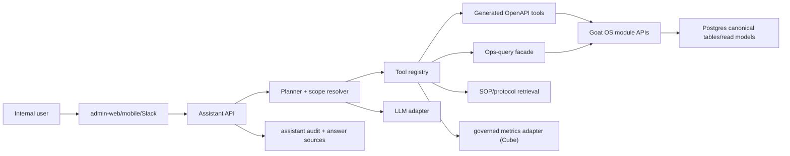

# Internal Ops Assistant TRD

Status: draft for implementation review.

## Technical Summary

The Internal Ops Assistant is a backend-owned AI/tool orchestration feature. It
accepts natural-language internal questions, plans tool calls, calls Goat OS APIs
or controlled ops-query tools, and composes answers with provenance.

It must not become a direct database console or a second source of business
truth. Goat OS canonical modules and read models remain authoritative. The
assistant owns conversation state, tool planning, answer provenance, evals, and
assistant-specific audit.

Core shape:

```text
admin-web / mobile / optional Slack
  -> assistant API
  -> planner + tool registry
  -> OpenAPI generated clients and ops-query tools
  -> module APIs/read models/Postgres repositories
  -> answer composer with source provenance
```

## Non-Negotiable Architecture Invariants

This feature follows the Goat OS phase rules:

- Go backend remains a modular monolith with strict module ownership.
- Domain logic talks through ports/interfaces, not vendor SDKs directly.
- Vendor adapters wrap LLMs, embeddings, vector stores, Slack, Google, and
  analytics tools.
- Adapter selection is wired in bootstrap/factory code.
- Web/mobile clients use REST/JSON APIs described by OpenAPI and generated
  clients.
- JSON Schema owns tool schemas, assistant events, eval cases, and decision
  records where payload compatibility matters.
- Protobuf/gRPC is allowed only behind the app API boundary for future
  high-volume internal workloads.
- Every mutating tool call requires idempotency, audit, outbox where downstream
  consumers need it, RBAC, observability, and replay behavior.
- Analytics questions use governed metrics and projections. Product clients do
  not directly query BigQuery, Sheets, GCS, Firestore, or operational DBs.
- AI may route, summarize, classify, and propose. It must not silently create
  canonical truth.

## Module Ownership

Proposed modules:

```text
backend/internal/opsassistant
  domain
  app
  ports
  adapters/http
  adapters/postgres
  adapters/llm
  adapters/tools

backend/internal/opsquery
  domain
  app
  ports
  adapters/http
  adapters/postgres
```

`opsassistant` owns sessions, messages, tool plans, tool-call audit, answer
sources, feedback, eval cases, prompt versions, and model/provider adapters.

`opsquery` owns assistant-shaped read-only query endpoints that cut across
existing dashboard-shaped APIs but still read canonical module tables through
approved repositories or controlled SQL views.

Feature modules such as vaccination, calendar, passport, locations, proof, and
permissions continue to own their domain tables and business rules.

## System Diagram



## Public App API

Initial OpenAPI routes:

```text
GET  /assistant/capabilities
POST /assistant/sessions
GET  /assistant/sessions/{session_id}
POST /assistant/sessions/{session_id}/messages
GET  /assistant/sessions/{session_id}/messages
POST /assistant/messages:answer
POST /assistant/tool-calls/{tool_call_id}/confirm
POST /assistant/feedback
GET  /assistant/evals/cases
POST /assistant/evals/runs
```

Implementation may start with `POST /assistant/messages:answer` as a thin
stateless route, but the contract should preserve a path to durable sessions and
tool-call audit before production rollout.

Required request context:

- tenant ID
- actor ID
- active grants from auth middleware
- locale/display timezone
- Goat OS business calendar, currently Asia/Kolkata, for operational date
  resolution
- optional current page/entity context
- idempotency key for mutating confirmed actions

Required response fields:

- answer markdown or structured blocks
- resolved scope and filters
- tool calls used
- source links and entity identifiers
- freshness envelope: `as_of` or `last_success_at`, `freshness_status`,
  `serving_state`, `stale`, `rebuild_required`, `source_watermark`,
  `unavailable_sources`, `conflict_count`, `projection_version`, and
  `source_composition` when applicable
- full visible count, returned count, truncation flag, and count taxonomy
- clarification request when needed
- unauthorized/no-data/missing-capability status when applicable
- owner of next action, due time, evidence/proof status, and history link for
  process-integrity answers
- suggested safe follow-up actions

## Tool Registry

Tools must be declared with JSON Schema:

```text
tool_name
description
input_schema
output_schema
permission_requirements
scope_requirements
mutation_class: read_only | low_risk_action | guarded_action
source_authority: api | ops_query | policy_doc | analytics
visibility_stage: pre_model_filtered
timeouts
row_limits
version
```

The planner receives only tools the current actor can potentially use. Each tool
still rechecks permissions server-side before execution.

Initial tool families:

| Family | Tool examples |
| --- | --- |
| Scope | `resolve_business_scope`, `resolve_location`, `resolve_animal_identifier` |
| Vaccination | `list_action_center`, `list_calendar_drives`, `list_drive_targets`, `get_goat_passport` |
| Ops-query | `get_missed_vaccination_targets`, `get_next_vaccination_drives`, `get_exception_summary` |
| Policy docs | `search_protocol_docs`, `explain_vaccination_rule` |
| Actions | `send_calendar_nudge`, `snooze_calendar_event`, `acknowledge_escalation` |
| Analytics | `query_governed_metric`, `list_metric_definitions` |

## Existing OpenAPI Tools

The v1 vaccination pack should wrap these existing operation IDs:

```text
listVaccinationActionCenter
getVaccinationProtocolAdherence
getVaccinationControlTower
getVaccinationOperations
listVaccinationExecution
getVaccinationExecutionShedDrilldown
listCalendarVaccinationEvents
getCalendarVaccinationEvent
listCalendarVaccinationDriveTargets
getCalendarVaccinationEventHistory
sendCalendarVaccinationEventNudge
snoozeCalendarVaccinationEvent
acknowledgeCalendarVaccinationEscalation
resolveCalendarVaccinationEscalation
vaccinationVerificationQueue
getGoatVaccinationPassport
```

These wrappers should call generated clients or internal app services. Do not
hand-copy DTOs into assistant code.

## Ops-Query API

Add assistant-shaped read APIs only where existing endpoints force unreliable
multi-step stitching.

Initial routes:

```text
GET /ops-query/vaccination/missed-targets
GET /ops-query/vaccination/next-drives
GET /ops-query/vaccination/catchup-plan
GET /ops-query/vaccination/exceptions
GET /ops-query/scope/resolve-location
GET /ops-query/scope/resolve-animal
```

Example:

```text
GET /ops-query/vaccination/missed-targets
  date=2026-07-06
  vaccine_code=PPR
  park_id=...
  shed_id=...
  group_by=park,shed
```

The response must include:

```text
query_id
as_of or last_success_at
freshness_status
serving_state
stale
rebuild_required
source_watermark
unavailable_sources[]
conflict_count
projection_version
source_composition
resolved_filters
scope
summary_counts
obligation_count
distinct_animal_count
full_visible_count
returned_count
result_truncated
groups[]
rows[]
source_obligation_ids[]
source_event_ids[]
source_routes[]
pagination
```

The SQL behind ops-query must be bounded by tenant, scope, date/status, and
pagination. For hot paths, add indexes or projection tables instead of scanning
all animals.

Summary counts must be computed over the full visible scoped set before
pagination. They must never be inferred from the returned page.

## As-Of And Status Semantics

Ops-query must answer date-specific operational questions from effective state
as of the requested Goat OS business date.

For `GET /ops-query/vaccination/missed-targets`, implementation must:

- resolve relative dates against the fixed Asia/Kolkata Goat OS business
  calendar.
- reconstruct effective missed state from due windows, accepted completion
  evidence, completion timestamps, and obligation status events.
- include animals that missed the requested date even if they completed later.
- exclude work that is only currently overdue unless the requested-date
  effective state proves a missed transition.
- avoid `WHERE status = 'missed'` as the only correctness condition.
- return per-animal rows from obligation/target membership, not only a drive
  rollup state such as `bool_or(status = 'missed')`.

Exception tools must keep these states separate and non-overlapping:

```text
due
overdue
missed
deferred
waived
completed
blocked
```

Drive and leadership summaries must label counts as obligations or distinct
animals. When one animal has multiple due doses, obligation counts may be higher
than distinct animal counts and the answer must say so.

`get_next_vaccination_drives` is pinned to the Calendar vaccination event
projection. Sort by `window_start`, then `due_at`, then `event_id`. Catch-up
drives are included only when the event/source type marks them as scheduled or
actionable for the actor's visible scope.

Species is a first-class query dimension. Tool schemas must accept `species`
where the backing capability pack is mixed-species. Legacy route names such as
`/goats/{goat_id}/passport` do not remove the requirement to answer animal-level
questions for sheep where the underlying domain supports them.

## Database Access Policy

Production assistant behavior:

- The LLM never receives raw database credentials.
- The LLM never emits arbitrary SQL to production.
- Read gaps are closed by backend APIs, ops-query endpoints, or allowlisted
  database views/functions called by backend code.
- Every query is tenant-scoped, permission-scoped, paginated, timed out, and
  audited.
- Unauthorized rows, hidden counts, and over-limit rows are filtered before any
  model prompt or tool-output context is built.
- Counts are computed only over rows visible to the actor unless the response
  explicitly says the count is unavailable because of authorization.
- Row-level security or application-side scope filters must be tested with
  leadership, park, shed, and operator grants.

Developer/admin debugging may use direct read-only SQL only outside the
assistant runtime and only through the approved Cloud SQL read-only workflow.

If a future internal SQL tool is approved, it must be:

```text
read-only SELECT only
allowlisted views/functions only
no arbitrary table access
no DDL/DML
hard row and timeout limits
tenant and scope parameters mandatory
query-plan checks for expensive paths
full audit of actor, prompt, SQL template, parameters, rows returned, and trace
disabled by default in production
```

## Planning Flow

The assistant uses a deterministic-plus-LLM flow:

1. Normalize actor, tenant, grants, current UI context, locale/display timezone,
   Goat OS business calendar, and message.
2. Classify question class and required capability pack.
3. Resolve dates such as "yesterday" using the Goat OS business calendar,
   currently Asia/Kolkata.
4. Resolve scope phrases such as "Shed A" through location tools.
5. Apply role defaults or ask clarification for ambiguous scope.
6. Select tools from the filtered registry.
7. Execute read-only tools with retries where safe.
8. Apply deterministic visibility filtering, row limits, truncation flags, and
   result hashing before constructing model context.
9. Treat all tool outputs, notes, reasons, and free-text fields as untrusted
   data. Delimit them and forbid tool-output text from instructing the planner
   to call tools or change policy.
10. Run the safety classifier over user input, selected retrieval chunks, and
   the draft answer for forbidden claims and injection patterns.
11. Compose answer only from filtered tool outputs and allowed cited policy
   docs.
12. Return structured answer blocks, provenance, and safe follow-ups.
13. Write assistant audit rows.

The planner may use model-generated JSON, but backend validation must reject
unknown tools, missing required slots, invalid dates, scope expansion, excessive
limits, and mutation attempts without confirmation.

## Data Model

Recommended tables:

### assistant_sessions

- `tenant_id`
- `session_id`
- `actor_id`
- `entry_surface`: `admin_web`, `operator_mobile`, `slack`, `api`
- `title`
- `status`: `active`, `archived`
- `created_at`
- `updated_at`

### assistant_messages

- `tenant_id`
- `message_id`
- `session_id`
- `actor_id`
- `role`: `user`, `assistant`, `tool`, `system`
- `content`
- `content_hash`
- `resolved_scope_json`
- `status`: `pending`, `answered`, `clarification`, `failed`
- `created_at`

### assistant_tool_calls

- `tenant_id`
- `tool_call_id`
- `session_id`
- `message_id`
- `tool_name`
- `tool_version`
- `input_json`
- `input_hash`
- `output_summary_json`
- `result_hash`
- `full_visible_count`
- `returned_count`
- `result_truncated`
- `row_limit`
- `truncation_reason`
- `freshness_json`
- `source_version`
- `projection_version`
- `source_authority`
- `permission_snapshot_hash`
- `status`
- `started_at`
- `completed_at`
- `latency_ms`
- `error_code`
- `trace_id`

### assistant_answer_sources

- `tenant_id`
- `source_id`
- `message_id`
- `tool_call_id`
- `source_type`: `api_route`, `entity`, `policy_doc`, `analytics_metric`
- `source_ref`
- `entity_type`
- `entity_id`
- `as_of`
- `source_version`
- `projection_version`
- `result_hash`
- `created_at`

### assistant_feedback

- `tenant_id`
- `feedback_id`
- `message_id`
- `actor_id`
- `rating`: `correct`, `useful`, `incomplete`, `wrong`, `unsafe`, `confusing`
- `comment`
- `created_at`

### assistant_eval_cases

- `eval_case_id`
- `capability_pack`
- `role`
- `scope_fixture`
- `question`
- `expected_behavior`
- `expected_tools_json`
- `forbidden_claims_json`
- `golden_sources_json`
- `status`

High-volume transcript retention must be configurable. If full content retention
is restricted, keep hashes, tool provenance, and feedback while redacting message
content after the retention window. The retained hashes, counts, truncation
flags, freshness envelope, source/projection versions, and tool inputs must be
enough to reconstruct what answer was supportable without keeping full row
payloads forever.

## Idempotency And Replay

Read-only message answering:

- Same `session_id + client_message_id` returns the same assistant message if
  already completed.
- Tool calls have deterministic input hashes and trace IDs.
- Tool retries are allowed only for idempotent reads.

Mutating tool calls:

- Require explicit confirmation.
- Require idempotency key.
- Require a frozen preview record with resolved arguments, `input_hash`, actor,
  permission snapshot, and scope.
- Confirmation must reference that frozen preview and must fail with conflict if
  the confirmed arguments differ from the previewed `input_hash`.
- Idempotency keys for assistant-confirmed actions should derive from the frozen
  resolved-argument hash plus actor/session/action identity.
- Same key and same payload returns prior result.
- Same key and different payload returns conflict with no side effects.
- Downstream module owns its own audit/outbox semantics.
- Assistant records the confirmed action and links to the module audit/history.

## RBAC And Scope Enforcement

Authorization layers:

1. Auth middleware verifies token and loads active grants.
2. Assistant API checks base assistant permission.
3. Tool registry filters possible tools by permissions.
4. Each tool validates required permissions and allowed scope.
5. Module API or repository enforces tenant and scope again.
6. Tool result builder filters unauthorized rows, hidden counts, and over-limit
   rows before model context is built.
7. Answer composer may only see and summarize the filtered visible result.

Required permission namespace:

```text
assistant.use
assistant.audit_read
assistant.eval_run
assistant.admin
opsquery.read
opsquery.admin
```

Existing module permissions such as `vaccination.read`, `obligation.read`,
`calendar.read`, `calendar.action`, `goat.read`, and `locations.read` remain
required for the underlying tools.

Operator v1 is blocked until the implementation adds one explicit scoped path:

- either shed/task-scoped operator grants that allow the needed
  `locations.read`, `obligation.read`, `vaccination.read`, and `calendar.read`
  module routes without tenant-wide over-granting; or
- a narrow `opsquery.read` operator tool path that joins assigned task/shed
  scope server-side and never exposes broad module list routes.

Tests must prove an operator can answer "my next drive" for assigned scope and
cannot see another shed, park, hidden count, or unauthorized row.

Do not trust model output for role, scope, tenant, permission, row limit, or
mutation class.

## Knowledge Retrieval

Policy/SOP retrieval is for explanation, not operational state.

Sources:

- versioned docs in `docs/`
- published protocol/ruleset metadata
- SOP builder contracts
- approved handbooks after sanitization and source-owner review

Rules:

- Cite document path, protocol version, or SOP version.
- Prefer runtime published protocol data over static docs when explaining an
  active rule.
- Do not answer "what happened today" from documents.
- Deterministically exclude ignored or forbidden source-rule branches from the
  retrieval index and model context. For Preventive Care vaccination, do not
  index or retrieve dam/mother vaccination-status branching text as a schedule
  option, fallback, or question.
- If asked whether dam/mother vaccination status affects kid scheduling, answer
  only the active canonical policy: Goat OS does not use dam/mother vaccination
  status for kid schedule branching, and the approved standard schedule applies.
- Run forbidden-claim evals and a safety post-filter so ignored source branches
  cannot be quoted back by the assistant.

## Model And Provider Adapters

The domain must not depend directly on a model vendor.

Ports:

```text
PlannerModel
AnswerComposerModel
EmbeddingIndex
SafetyClassifier
ToolExecutor
```

Adapters may target OpenAI, Gemini/Vertex AI, or another approved provider.
Google ADK or Agents CLI can be used later as deployment/evaluation scaffolding,
but they do not own Goat OS authorization, tools, memory, or truth.

Prompt versions must be stored and referenced by eval runs. Tool descriptions
must be generated from schema metadata where possible to avoid drift.

## Observability

Metrics:

- assistant request count, latency, p95/p99
- planner latency
- tool-call count, latency, error rate, timeout rate
- clarification rate
- unauthorized/denied count
- missing-capability count
- answer-source coverage
- token usage and cost by provider/model
- eval pass rate by capability pack
- prompt-injection blocked count
- data-borne injection blocked count
- per-actor and tenant token budget usage
- rate-limit and concurrency-limit rejections
- ops-query DB latency and row counts

Logs/traces:

- structured request logs with tenant, actor hash, session, message, trace
- tool call spans
- model provider latency and error class
- redacted prompt and output hashes
- no secrets, tokens, raw credentials, or unrestricted row dumps in logs

Alerts:

- elevated tool failure rate
- p95 answer latency breach
- authorization failure spike
- eval regression on protected cases
- ops-query slow query or row-limit truncation spike
- provider cost anomaly
- token budget exhaustion spike

## Scale And Performance

Targets for v1:

```text
read-only answer p95 <= 8 seconds for common vaccination questions
single tool p95 <= 1.5 seconds for indexed reads
ops-query row return default <= 100 rows, hard max <= 500 rows
date windows bounded unless a specific summary projection exists
no full-herd scan in assistant APIs
stream partial status for multi-tool answers if UI supports it
hard cap on tool-call iterations per answer
per-actor and per-tenant token budgets
per-actor rate limits and concurrent-answer caps
```

Hot queries must be backed by indexes or read-model projections over tenant,
park, shed, due date, status, owner, protocol, and event IDs.

If the answer hits the wall-clock deadline, return a partial-answer status with
completed tool provenance and a clear retry/drilldown affordance. Do not turn a
timeout into an unsupported complete answer.

## Testing

Required tests:

- OpenAPI contract tests for assistant and ops-query routes.
- Tool schema validation tests.
- RBAC matrix tests across CEO/COO, director, park head, verifier, operator,
  and unauthorized user.
- Scope-default tests for omitted shed/park/date.
- Vaccination golden cases from seeded Postgres data.
- As-of missed cases: completed after requested date, missed then recovered,
  un-swept overdue, and status-event ledger reconstruction.
- Status partition tests proving one item appears in exactly one of due,
  overdue, missed, deferred, waived, completed, or blocked for the requested
  answer class.
- Obligation count versus distinct animal count tests.
- Missing API/no-data/tool-failure tests.
- Prompt injection and data-borne injection tests using seeded notes/reasons.
- Idempotency and frozen-argument-hash tests for mutating confirmations.
- Query-plan and row-limit tests for ops-query SQL.
- Truncation tests proving `full_visible_count`, `returned_count`, and
  `result_truncated` are visible to the user.
- Species filter/group tests for goat and sheep where the pack supports both.
- Snapshot/eval tests for answer provenance and forbidden claims.

Production readiness requires local and cloud smoke tests with seeded data and
at least one end-to-end answer for:

```text
missed vaccination targets by shed
next drive for operator after scoped operator assistant-read path exists
company-wide missed summary for CEO/COO
animal passport next due explanation
unauthorized shed access denied
ambiguous multi-shed operator clarification
```

## Deployment

Recommended GCP shape:

- Assistant routes run in the existing Goat OS backend Cloud Run service unless
  load or dependency isolation requires a separate service.
- Secrets live in Secret Manager.
- Model provider credentials are environment-scoped.
- Cloud SQL/Postgres remains canonical truth.
- Pub/Sub/outbox may be used for async eval runs, feedback processing, or long
  summarization jobs.
- Cloud Monitoring/Error Reporting/Trace carry assistant metrics and incidents.
- BigQuery is allowed for warehouse/eval datasets behind analytics boundaries,
  not direct product answers.

Service accounts must be least privilege. Production assistant runtime must not
hold owner/editor database credentials.

## Rollout Gates

Gate 1: local dev

- route compiles
- generated clients updated
- seeded vaccination golden questions pass
- no direct SQL tool in runtime

Gate 2: dev cloud

- auth and grants enforced
- Cloud SQL read path works through backend
- observability dashboards exist
- eval suite runs in CI or controlled job

Gate 3: internal read-only pilot

- CEO/COO and engineering users only
- vaccination pack only
- transcripts and tool provenance reviewed
- missing-capability log reviewed weekly

Gate 4: park pilot

- one park head and limited operator scope
- ambiguity and unauthorized behavior verified
- latency and row limits validated

Gate 5: safe actions

- nudge/snooze/acknowledge only
- idempotency and module audit verified
- confirmation UI shipped
- action evals and rollback story documented

## Implementation Notes

- Prefer existing generated OpenAPI clients over hand-written HTTP calls.
- Keep assistant DTOs separate from domain DTOs, but do not duplicate module
  business types unnecessarily.
- Tool outputs should be structured JSON. The composer turns structured results
  into human-readable text.
- Keep prompts small and tool-heavy. Do not paste large raw row sets into the
  model when summaries can be computed deterministically.
- Store only redacted tool output summaries unless full row retention is
  explicitly approved.
- When adding a new capability pack, add tools, eval cases, permission mapping,
  source-of-truth mapping, and missing-data behavior in the same change.

## Open Technical Decisions

- Whether to run assistant routes inside the main backend service or a separate
  internal Cloud Run service.
- Whether v1 UI lives in admin-web only or also in operator mobile.
- Whether Slack is an entry surface in v1 or after read-only web pilot.
- Model provider for v1 and fallback provider policy.
- Transcript retention and redaction policy.
- Whether retrieval uses Postgres pgvector, managed vector search, or a simple
  document index for the first version.
