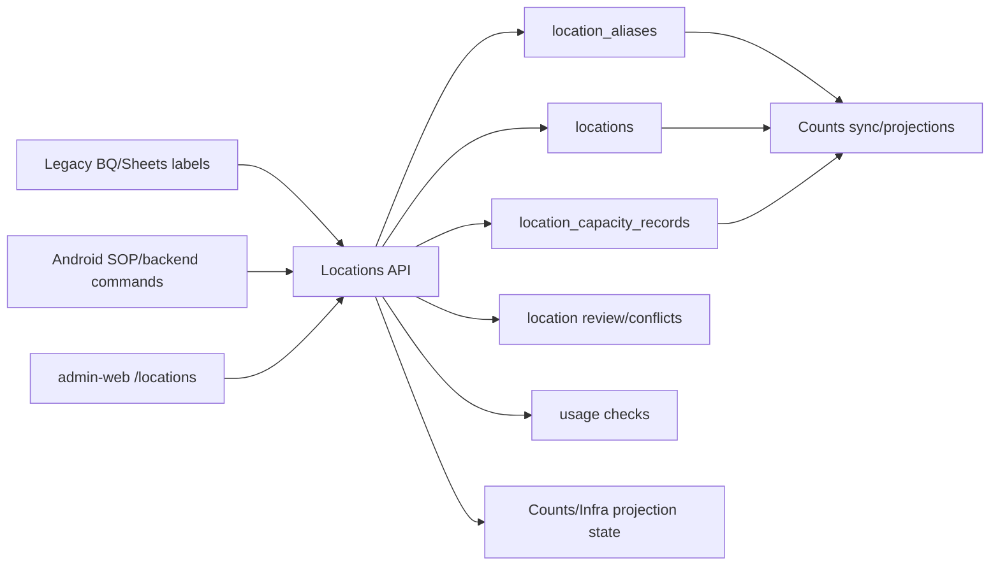

# Locations TRD

Status: draft for implementation review.

## Technical Summary

Locations is a shared backend-owned master-data module. It manages the canonical
location tree, source aliases, capacity records, usage checks, and projection
invalidation for location-dependent dashboards.

Counts and Locations should ship together:

```text
legacy BQ/Sheets labels -> location aliases/review -> canonical locations
  -> Counts snapshot/projections -> admin-web Counts
```

The frontend must call Goat OS APIs. It must not edit BQ/Sheets or local static
maps.

Location label cutover and blend behavior follows
`docs/features/cutover-contract.md`.

## Existing Foundation

Current Phase 1 schema already includes:

- `locations`
- `location_aliases`
- `goat_location_history`

The current `locations` table supports tenant, type, code, name, parent,
address-ish fields, geo, timezone, and status. The current allowed types are
`farm`, `park`, `shed`, `cohort`, `pen`, and `unknown`. V1 keeps these as the
physical hierarchy types and represents `holding`, `quarantine`, and `icu` as
operational attributes on a physical location. Adding those as first-class
`location_type` values is a later migration decision.

Migration `000017_phase_1_bq_dashboard_shed_locations.sql` seeds legacy BQ shed
labels under CBE/CPT. This is useful evidence, but it is not a CRUD surface.

The seeded CBE, CPT, and HF rows from Phase 1 are protected scope anchors. CBE
and CPT are `park` rows because old-tag identity scope already depends on those
IDs. Legacy dashboard `farm` labels for CBE/CPT resolve to those park rows in
Phase 1; they must not create duplicate `location_type = farm` rows for parity.

## Module Ownership

Proposed module:

```text
backend/internal/locations
  domain
  app
  ports
  adapters/http
  adapters/postgres
```

Responsibilities:

- location tree CRUD
- alias CRUD and conflict detection
- capacity CRUD
- usage checks
- audit/outbox events
- projection invalidation hooks
- source-label review helpers

Other modules consume location data through APIs or ports. They must not write
`locations` and `location_aliases` directly.

## System Diagram



## Tables

### locations

Existing table remains the canonical location record.

Required follow-up columns or compatible companion table support:

- `updated_at`
- `row_version`
- `display_order`
- `operational_notes`
- `retired_at`
- `retired_by`

If adding columns is too invasive for v1, expose equivalent values through
`location_operational_attributes`, but write commands must still behave like
versioned updates.

Recommended indexes:

- tenant, location type, status
- tenant, parent location, status
- tenant, lower name search support
- tenant, location code unique

### location_aliases

Existing table remains source-label mapping.

Required source contexts include:

- `legacy_location_code`
- `legacy_bq_dashboard_shed`
- `legacy_bq_counts`
- `legacy_bq_infra`
- `legacy_bq_feed`
- `legacy_bq_vaccination`
- `legacy_bq_mortality`
- `legacy_rfid_db`
- `android_sop`
- `manual`

`legacy_location_code` and `legacy_bq_dashboard_shed` are already seeded by the
Phase 1 migrations and must continue to resolve CBE/CPT/HF and legacy dashboard
shed aliases. Newer contexts may be added for feature-specific evidence, but
they must not strand or ignore already-seeded aliases.

Add if missing:

- status: active, retired, review
- updated_at
- row_version
- retired_at

Alias uniqueness remains tenant + alias code + source context for active rows.
If current unique constraints prevent retire/recreate behavior, add a partial
unique index strategy.

### location_capacity_records

New table for effective-dated capacity.

Required columns:

- `tenant_id`
- `capacity_record_id`
- `location_id`
- `capacity_kind`: `goat_occupancy`, `quarantine`, `feed_trial`, `other`
- `capacity_value`
- `effective_from`
- `effective_to` nullable
- `source`: `manual`, `legacy_bq`, `android_sop`, `import`
- `source_ref` nullable
- `notes`
- `created_by`
- `created_at`
- `updated_at`
- `row_version`

Constraints:

- positive `capacity_value`
- no overlapping active records for tenant/location/kind
- tenant-scoped FK to `locations`

Indexes:

- tenant, location, capacity kind, effective dates
- tenant, source, source ref

### location_operational_attributes

New table or strict JSONB companion for operational flags.

Required fields:

- `tenant_id`
- `location_id`
- `usable_for_counts`
- `usable_for_feed`
- `usable_for_vaccination`
- `usable_for_sop`
- `is_holding`
- `is_quarantine`
- `is_icu`
- `display_order`
- `notes`
- `updated_at`

Do not store current occupancy here. Occupancy is derived from goat/current-count
projections.

### location_review_items

New table for location-master review work. This owns source-label, alias,
capacity, parent/type, and retirement review items. Existing
`identity_conflicts` and `identity_correction_requests` remain goat-identity
queues; they may link to a location review item as evidence, but they do not own
location master-data resolution.

Required columns:

- `tenant_id`
- `review_id`
- `review_type`: `unknown_alias`, `alias_conflict`, `parent_type_conflict`,
  `capacity_conflict`, `retire_blocked`, `usage_conflict`
- `status`: `open`, `resolved`, `dismissed`
- `source_context`
- `source_label`
- `normalized_source_label`
- `canonical_location_id` nullable
- `candidate_location_ids` jsonb
- `evidence_json` jsonb
- `evidence_hash`
- `sync_run_id` nullable
- `created_by` nullable
- `resolved_by` nullable
- `resolution_notes` nullable
- `created_at`
- `updated_at`
- `resolved_at` nullable
- `row_version`

Indexes:

- tenant, status, review type, updated at
- tenant, source context, normalized source label
- tenant, canonical location id, status

Only one open review item should exist for the same tenant/source context/source
label/review type unless the evidence hash changes. The Data Quality surface may
aggregate these items, while the Locations tab owns their resolution workflow.

## CRUD Semantics

Create location:

- validate tenant scope
- validate type
- validate parent exists in same tenant
- prevent duplicate active code
- initialize status as staging/review/active based on caller and source
- audit and emit event

Update location:

- require row version
- validate parent change and type compatibility
- prevent cycles
- prevent cross-tenant parent
- block type/code/parent changes for seeded CBE/CPT/HF scope anchors unless an
  explicit migration plan updates old-tag scope, aliases, projections, and
  downstream references
- mark dependent Counts/Infra projections stale when parent/type/name/code
  affects dashboard dimensions
- audit and emit event

Delete location:

- hard delete only if unreferenced and status is staging or review
- otherwise return conflict with usage summary and require retire/inactivate

Retire location:

- require usage check
- block or warn when active goats, active child locations, active aliases, RBAC
  grants, open SOPs, or active projections depend on it
- set status inactive and retired fields
- do not remove history

Alias write:

- require row version for update
- one active alias/source context maps to one canonical location
- conflicting alias attempts create review item
- protect seeded `legacy_location_code` and `legacy_bq_dashboard_shed` aliases
  from remap/retire/delete unless an approved migration plan rewrites dependent
  old-tag scope, BQ reconciliation, and projection parity fixtures
- alias changes mark affected source/projections stale

Approved migration plan:

Seeded CBE/CPT/HF scope anchors and seeded legacy aliases may be changed only
with a committed or attached migration-plan artifact. The plan must name the
affected location IDs and aliases, old-tag scope impact, BQ reconciliation
impact, dependent Counts/Mortality/Infra projection grains, parity fixtures,
rollback path, approving actor, and audit/run id. The plan is required even in
dev because these anchors define legacy dashboard and identity-scope semantics.

Capacity write:

- require non-overlapping effective window
- close previous active capacity record when requested
- mark capacity-dependent projections stale
- audit source and actor

## APIs

Add OpenAPI contracts before implementation:

```text
GET    /admin/locations
POST   /admin/locations
GET    /admin/locations/{location_id}
PATCH  /admin/locations/{location_id}
DELETE /admin/locations/{location_id}
POST   /admin/locations/{location_id}/retire

GET    /admin/locations/{location_id}/children
GET    /admin/locations/{location_id}/usage

GET    /admin/locations/{location_id}/aliases
POST   /admin/locations/{location_id}/aliases
PATCH  /admin/location-aliases/{alias_id}
DELETE /admin/location-aliases/{alias_id}

GET    /admin/locations/{location_id}/capacity
POST   /admin/locations/{location_id}/capacity
PATCH  /admin/location-capacity-records/{capacity_record_id}
DELETE /admin/location-capacity-records/{capacity_record_id}

GET    /admin/location-review-items
POST   /admin/location-review-items/{review_id}/resolve
```

List filters:

- `type`
- `status`
- `parent_location_id`
- `search`
- `alias`
- `usable_for_counts`
- `limit`
- `cursor`

Lists must be tenant-scoped, keyset-paginated, and limit-capped.

## Response Contracts

Location DTO must include:

- id, type, code, name, parent id
- breadcrumb/path labels
- status
- address/geo/timezone
- operational flags
- current effective capacity
- current occupancy summary when requested
- alias count
- child count
- usage warning summary
- row version

Usage DTO must include counts or booleans for:

- goats currently assigned
- goat location history
- child locations
- active aliases
- active RBAC grants
- active SOP forms/tasks/submissions
- import/source rows
- dashboard projections

Usage checks should be bounded and indexed. They are guardrails, not full export
endpoints.

## Legacy Sync And Review

During Counts/Infra/Mortality sync:

1. Read legacy farm/shed/housing labels.
2. Normalize label text.
3. Resolve using `location_aliases`.
4. If no alias exists, create a `location_review_items` row.
5. If one alias maps ambiguously, create a conflict review item in
   `location_review_items`.
6. Do not auto-create active canonical locations unless a supervised import
   mode explicitly allows staging locations.
7. Projection input rows should carry canonical location IDs when resolved and
   source labels when unresolved.

Legacy capacity source rows from `counting_shed_capacity_status_dev` and
`shed_capacity_count_dev` can create staging/evidence capacity records. Manual
review or an approved import policy promotes them to active effective capacity.

All legacy-label dashboards use this same path. Mortality farm, housing, shed,
and status-location labels must resolve through `location_aliases` with
`legacy_bq_mortality` or another explicit source context. Feed, Vaccination,
Infra, and future dashboards must do the same. Feature modules may cache resolved
location IDs in projection rows, but they must not maintain private canonical
location maps.

## Projection Invalidation

Location changes that affect dashboard dimensions must mark affected projections
stale:

- location code/name/type/parent changes
- alias create/update/retire
- capacity create/update/close
- operational usability flag changes
- retire/inactivate

Initial implementation may mark all Counts/Infra projections for the tenant
stale. Later optimization can scope by location subtree and snapshot date.

## Frontend

Admin route:

```text
/locations
```

Controls:

- table search/filter
- tree navigation
- create/edit forms
- parent selector
- alias editor
- capacity editor
- usage panel before retire/delete
- review queue for unknown labels

The UI must not show a hard-delete primary action for referenced active
locations. Retire/inactivate is the normal path.

## RBAC

Permissions:

- `locations.read`
- `locations.write`
- `locations.review`
- `locations.retire`

Initial mapping:

- `admin`: all
- `ceo_internal`: read
- `verifier`: read and review if approved
- `park_head`: read for assigned scope, write only if explicitly granted
- `operator`: no admin Locations access by default; use scoped Android SOP
  lookup endpoints if needed

Use the shared permission registry. Do not authorize by email in handlers.

## Performance And Scale

At one million goats:

- location list reads remain small and paginated
- occupancy values come from projections/counters
- usage checks are indexed and summarized
- no frontend full-herd scans
- no request-time recursive unbounded tree walk over all tenants
- parent/path reads are tenant-scoped
- projection invalidation is tenant-scoped first, subtree-scoped later

Cycle prevention must run in the database transaction that changes parent.

## Observability

Log and metric:

- location create/update/retire/delete
- alias create/update/retire/conflict
- capacity create/update/close
- review item open/resolve
- usage-check conflicts
- projection invalidation requests
- API latency/errors

Logs must include tenant, actor, location id, source context, trace/request id,
and sync run id when applicable. Never log credentials or tokens.

## Test Plan

Backend:

- create/update/list/detail location
- seeded CBE/CPT/HF scope anchor edit guards
- parent cycle prevention
- cross-tenant parent rejection
- duplicate code rejection
- hard-delete blocked when referenced
- retire behavior with usage summary
- alias create/update/conflict
- seeded `legacy_location_code` and `legacy_bq_dashboard_shed` alias protection
- location review item uniqueness/status transitions
- capacity effective-date overlap rejection
- usage endpoint with goats/history/alias/child/RBAC/projection fixtures
- projection stale marker on location/alias/capacity changes
- RBAC allow/deny
- keyset pagination

Frontend:

- Locations tab renders table/tree/detail
- create/edit forms validate required fields
- alias editor states
- capacity editor states
- retire/delete conflict flow
- unknown-label review flow
- responsive layout

Integration:

- Counts sync resolves legacy shed labels through aliases
- Mortality sync resolves legacy farm/shed/housing labels through aliases
- unknown legacy shed label opens review item
- capacity change affects Infra/Counts projection freshness

## Rollout Gates

1. PRD/TRD accepted.
2. Location OpenAPI contracts added.
3. Migrations for needed type/status/capacity/metadata support added.
4. Backend CRUD/alias/capacity/usage tests green.
5. Counts sync uses aliases for location resolution.
6. Mortality sync uses aliases for farm/shed/housing resolution before
   mortality dashboards ship from Postgres projections.
7. Locations tab visual QA green.
8. Counts parity artifact confirms no location-label drift.
9. No required Locations CRUD, alias, capacity, usage, review, or seeded-scope
   protection behavior remains pending for production completion.
10. Manual legacy source sync approved for dev.
11. Scheduled sync remains off until unknown-label review and replay drift are
   stable.

## Open Questions

- Whether park heads can edit locations in their scope or only request changes.
- Whether capacity should allow multiple capacity kinds per location in v1 or
  start with only `goat_occupancy`.
- Whether a location merge command is required in v1 or can wait until duplicate
  source labels are observed.
