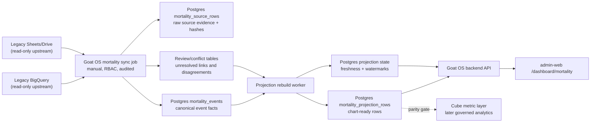

# Mortality TRD

Status: draft for implementation review.

## Technical Summary

Mortality is a high-scale dashboard feature. It must follow
`docs/decisions/high-scale-dashboard-projections.md`.

Runtime reads are served from Postgres projection tables. Sync/rebuild jobs may
read canonical facts, source rows, and temporary staging tables. Request
handlers must not run raw all-history aggregation queries for chart rendering.

`mortality_events` is required. It is the durable canonical event spine for this
feature, not an optional staging layer. Legacy BQ/Sheets adapters and future
Goat OS SOP/form adapters must normalize into `mortality_events`; projection
logic must read canonical events plus approved denominator projections, not
legacy source row shapes directly.

## System Diagram



## Data Store Matrix

| Store | Used For Mortality v1? | Role |
| --- | --- | --- |
| Postgres | Yes | canonical facts, source rows, projections, review, audit, freshness |
| BigQuery | Yes, upstream only | temporary legacy current-data source during migration |
| Sheets/Drive | Yes, upstream only | temporary legacy source where legacy BQ/views depend on Sheets |
| Cube | Later/optional in v1 | governed semantic metric for `mortality_rate`; requires parity gate |
| Redis | No canonical use | optional only for short-lived cache, job progress, rate limiting, locks |
| Tinybird | No | reserved for hot telemetry/live streams, not Mortality v1 |
| Time-series DB | No | not part of Mortality v1 |

The final runtime app storage is Postgres. BigQuery/Sheets feed Postgres until
Goat OS Android/SOP forms become the primary write path.

## Canonical Event Spine

Mortality follows the same pattern as identity:

```text
mortality_source_rows
  legacy/source evidence and replay material

mortality_events
  durable canonical mortality facts, required

mortality_projection_rows
  dashboard-serving rows

mortality_projection_state
  freshness, watermark, rebuild, and source availability
```

Only the source adapter layer should know legacy BigQuery/Sheets column names.
Projection code should be source-agnostic after facts are normalized into
`mortality_events`.

## Source Inputs

Implementation must inspect the legacy dashboard code and pin actual formulas.
Known source names from the legacy mortality dashboard area include:

- `mortality_total_dev`
- `mortality_overall_breedwise_dev`
- `mortality_this_month_dev`
- `overall_farmwise_mortality_dev`
- `load_Wise_pct_data`
- `deaths_monthly_trend_v`
- `mortality_genderwise`
- `mortality_trend_dev`
- `deaths_fact_dev`
- `mother_litter_size_dev_breedwise`
- `mother_litter_size_dev_overall`
- `mortality_by_litter_size_overall_dev`
- `last_month_mother_mortality_breed_dev`
- `last_month_mother_mortality_litter_dev`
- `last_month_mortality_by_litter_size_view`
- `load_wise_procurement_with_status`
- `breedwise_load_pct`
- `birth_analysis_view` or `mother_kid_facts` where legacy formulas use them

Source classification must be pinned before implementation. Do not convert every
source row into a mortality event.

| Source class | Current known examples | Allowed writes |
| --- | --- | --- |
| Event-creating sources | `deaths_fact_dev`; abortion fact source once pinned | May create or update `mortality_events` |
| Denominator/reference sources | `load_wise_procurement_with_status`; identity/count projections; source tables used only to derive populations | May update source rows and denominator/projection inputs, never create death events |
| Legacy rollup/parity sources | `mortality_total_dev`; `mortality_overall_breedwise_dev`; `mortality_this_month_dev`; `overall_farmwise_mortality_dev`; `load_Wise_pct_data`; `mortality_genderwise`; `mortality_trend_dev`; `deaths_monthly_trend_v`; `mother_litter_size_dev_breedwise`; `mother_litter_size_dev_overall`; `mortality_by_litter_size_overall_dev`; `last_month_mother_mortality_breed_dev`; `last_month_mother_mortality_litter_dev`; `last_month_mortality_by_litter_size_view`; `breedwise_load_pct` | Parity oracle, formula pinning, or projection validation only; never create events |

One real death must create at most one `mortality_events` row. Rollup tables can
validate or explain that event, but must not generate additional events for the
same real-world death.

Before running a real sync, probe every required source. If a source is blocked
by Drive/BQ permissions or is missing, record `source_unavailable` and do not
write fake zero projections.

## Formula Register

Before coding a chart or summary pill, add an explicit formula row here. The
initial implementation must fill this table from legacy code/SQL, not guess.

Window meanings:

- Overall: all-time legacy window unless the formula row pins another range.
- This Month: current month-to-date legacy window.
- Month-wise: one row per month bucket.

`review_status_filter` pins whether unresolved-but-real events are counted.
For death counts, include `accepted + needs_review` when `needs_review` means
the death is real but identity linkage is unresolved. Exclude `rejected` and
`superseded`.

| Metric/section | Numerator event types | Review status filter | Denominator basis | Window | Source oracle | Exact or reconciled parity |
| --- | --- | --- | --- | --- | --- | --- |
| Total Deaths | death only | accepted + needs_review | none | period-specific | legacy mortality SQL | reconciled |
| Kid Deaths | death only where age class is kid | accepted + needs_review | none | period-specific | legacy mortality SQL | reconciled |
| Adult Deaths | death only where age class is adult | accepted + needs_review | none | period-specific | legacy mortality SQL | reconciled |
| Total Mortality Rate | death only | accepted + needs_review | pinned population denominator from legacy formula | period-specific | legacy mortality SQL | to be pinned |
| Kid Mortality Rate | death only where age class is kid | accepted + needs_review | pinned kid population denominator from legacy formula | period-specific | legacy mortality SQL | to be pinned |
| Adult Mortality Rate | death only where age class is adult | accepted + needs_review | pinned adult population denominator from legacy formula | period-specific | legacy mortality SQL | to be pinned |
| Breed-wise mortality | death only by breed | accepted + needs_review | pinned breed population denominator from legacy formula | period-specific | legacy mortality SQL | to be pinned |
| Farm-wise mortality | death only by farm | accepted + needs_review | pinned farm population denominator from legacy formula | period-specific | legacy mortality SQL | to be pinned |
| Load-wise mortality | death only by load | accepted + needs_review | pinned load population denominator from legacy formula | period-specific | legacy mortality SQL | to be pinned |
| Gender-wise mortality | death only by gender/sex | accepted + needs_review | pinned gender denominator from legacy formula | period-specific | legacy mortality SQL | to be pinned |
| Status-wise mortality | death only by animal/status tag | accepted + needs_review | pinned status denominator from legacy formula | period-specific | legacy mortality SQL | to be pinned |
| Housing/shed-wise mortality | death only by shed/housing label | accepted + needs_review | pinned housing denominator from legacy formula | period-specific | legacy mortality SQL | to be pinned |
| Delivery/litter mortality | death and/or abortion, only as pinned by legacy formula | formula-specific | pinned denominator from legacy formula | period-specific | legacy mortality SQL | to be pinned |
| Trends | death only by month plus rate denominator where shown | accepted + needs_review | pinned monthly denominator from legacy formula | month bucket | legacy mortality SQL | to be pinned |

If a formula row remains `to be pinned`, that metric is not ready to implement.

Total Deaths must not include abortion unless the legacy formula explicitly
proves it does. Delivery/litter charts may show abortion as a separate series;
that does not automatically make abortion part of Total Deaths.

## Event Type Taxonomy

Initial event types:

- `death`: a death/mortality event counted by death totals and mortality rates.
- `abortion`: an abortion/pregnancy-loss event shown only in charts whose
  formula explicitly includes abortion.

Do not add catch-all event types such as `mortality_related` without pinning
which formulas include them. If a source row is ambiguous, keep it in
`mortality_source_rows` and open review instead of placing it into an event type
that can inflate totals.

## Cross-Module Denominators

Population denominators must not be recomputed by scanning goats from Mortality
request handlers.

Where a Mortality rate uses active-goat population, the denominator must come
from the identity/count projection at a pinned watermark or projection version.
Mortality freshness is then composed:

```text
mortality freshness = min(mortality event/source freshness,
                          denominator projection freshness)
```

The API response must expose unavailable/stale denominator sources in the same
freshness envelope as Mortality source availability.

## Proposed Postgres Ownership

Module ownership:

```text
backend/internal/mortality owns mortality source, fact, projection, and review
logic.
backend/internal/legacy_sync may own shared sync run/source status if reused.
backend/internal/permissions owns grants.
backend/platform/audit owns audit_log writes through public APIs.
```

Do not write another module's tables directly from Mortality services. Use
published package APIs or explicit interfaces for identity lookup, permissions,
legacy sync state, audit, and outbox.

## Tables

Use module-owned tables. Names may change during implementation, but the shape
must preserve this contract.

### mortality_source_rows

Stores source evidence from BQ/Sheets with idempotency and replay support.

Required columns:

- tenant_id
- source_system, for example `legacy_bigquery` or `legacy_sheet`
- source_table
- source_row_key
- source_observed_at
- source_watermark
- payload_json
- payload_hash
- row_status: current, superseded, invalid, ignored
- sync_run_id
- created_at
- superseded_at

Indexes:

- unique current row by tenant/source/row key when active
- tenant/source table/source observed date
- payload hash for replay drift checks

### mortality_events

Stores canonical event facts used by projections.

This table is required. Projections must read from this table, not directly from
`mortality_source_rows`.

Required columns:

- tenant_id
- mortality_event_id
- event_type: death, abortion
- event_date
- goat_id nullable
- source_goat_identifier nullable
- source_identifier_kind nullable
- age_class: kid, adult, unknown
- breed_key, breed_label
- farm_key, farm_label
- load_key, load_label
- delivery_key, delivery_label
- sex nullable
- source_row_id
- event_hash
- review_status: accepted, needs_review, rejected, superseded
- idempotency_key
- created_at / updated_at

Indexes:

- tenant_id, event_date
- tenant_id, event_type, event_date
- tenant_id, goat_id, event_date
- tenant_id, review_status
- unique tenant_id, idempotency_key
- source row uniqueness

Idempotency key:

```text
source_system + source_table + source_row_key + event_type
```

If a legacy source lacks a stable row ID, derive a deterministic key from the
minimum safe composite needed to avoid double-counting:

```text
source_system + source_table + event_date + source_goat_identifier
  + load/farm/breed context + event_type + source_row_hash
```

Do not collapse two distinct unmatched deaths into one event merely because both
lack a goat_id. Do not create a second event on re-sync for the same source
death row.

### mortality_projection_rows

Serves dashboard charts and summary pills.

Required shared contract:

- tenant_id
- period: overall, this_month, month_wise
- period_start nullable
- period_end nullable
- section: summary, breed, farm, load, delivery, trend
- grain: total, breed, farm, load, delivery, month, age_class, sex, status,
  housing
- dimension_key
- dimension_label
- metric_key
- numerator nullable
- denominator nullable
- value numeric
- unit: count, percent, ratio
- sort_order
- projection_version
- sync_run_id
- source_hash
- created_at / updated_at

Indexes:

- tenant_id, period, section, grain, sort_order
- tenant_id, period, section, metric_key
- tenant_id, projection_version

### mortality_projection_state

May be a mortality-specific table or a row in a shared projection-state table.
It must expose the standard freshness envelope.

Required fields:

- tenant_id
- module = mortality
- last_successful_run_id
- last_success_at
- source_watermark
- projection_version
- freshness_status
- row_count
- conflict_count
- unavailable_sources
- rebuild_required
- last_error
- updated_at

## Sync/Rebuild Flow

Manual sync is the v1 operating mode.

Flow:

1. Verify caller has sync permission.
2. Acquire tenant/module lock.
3. Probe all required legacy BQ/Sheets sources.
4. Load source rows into staging.
5. Compute row hashes and validate required columns.
6. Upsert `mortality_source_rows` idempotently.
7. Convert event-creating source rows into `mortality_events`.
8. Link events to Goat OS identity where deterministic.
9. Open or reuse review items for unresolved/ambiguous events.
10. Rebuild affected projection rows.
11. Update projection state and freshness envelope.
12. Write audit/outbox entries.

The command must dry-run by default if exposed as a CLI. Any mutation path must
require an explicit execute flag or API action.

Projection publication must be atomic per tenant/module/run. A failed rebuild
must not leave a mixed set of old and new projection rows visible as fresh.

## Rebuild Strategy

V1 may use a full mortality rebuild because the current source volume is small.
The design must still support scoped rebuild:

- tenant
- period
- section
- source watermark
- changed source rows
- changed event facts
- changed projection version

At one million goats, dashboard requests still read bounded projection rows.
Large raw fact scans are allowed only inside controlled rebuild/replay jobs, not
inside request handlers.

## API Contract

Initial API:

```text
GET /v1/mortality/dashboard?period=overall|this_month|month_wise
```

This endpoint returns a composed dashboard payload with `summary` and named
`sections`. If the implementation later splits reads for performance, the split
endpoints must still include `period`, `section`, and `grain` filters matching
the projection table contract.

For `period=month_wise`, the default response window is the latest 24 complete
month buckets plus the current month when present. Wider windows require an
explicit `from_month` / `to_month` request and must still cap each section with
bounded projection reads.

Response shape:

```json
{
  "freshness": {
    "as_of": "2026-06-18T00:00:00Z",
    "freshness_status": "fresh",
    "stale": false,
    "rebuild_required": false,
    "source_watermark": "2026-06-18",
    "unavailable_sources": [],
    "conflict_count": 0,
    "projection_version": 1
  },
  "summary": [],
  "sections": {
    "breed": [],
    "farm": [],
    "load": [],
    "delivery": [],
    "gender": [],
    "status": [],
    "housing": [],
    "trends": []
  }
}
```

Do not expose BigQuery table names to the frontend.

Freshness status enum:

```text
never_synced
fresh
stale
rebuilding
failed
source_unavailable
```

`conflict_count` is separate from `freshness_status`. A fresh projection can
still have open conflicts if the feature intentionally preserves unresolved
events in totals while surfacing review work.

Absent projection rows must not be treated as zero. The read path must join or
load projection state first:

- no successful projection for bucket -> `never_synced` or `source_unavailable`
- successful projection with value 0 -> real zero

Potential admin API:

```text
POST /v1/mortality/sync-runs
GET /v1/mortality/sync-runs/{run_id}
```

These endpoints require admin/sync permissions and must be audited.
Every sync run must record the authenticated actor, tenant, request trace, and
source set in audit/run metadata.

## RBAC Contract

Required permissions, final naming subject to RBAC package review:

- `analytics.mortality.read`
- `analytics.mortality.sync`
- `analytics.mortality.review`

Initial role mapping:

- `ceo_internal`: read
- `admin`: read, sync, review

Do not authorize by email inside request handlers. SSO email allowlists may
control who can create a session, but backend authorization must use DB grants.

## Frontend Contract

Admin-web route:

```text
/dashboard/mortality
```

Requirements:

- match legacy UI layout, spacing, tabs, colors, and chart ordering as closely
  as practical
- use Goat OS generated API client or a typed server API wrapper
- show freshness/status in a compact way without replacing chart content
- show source unavailable and rebuild-required states honestly
- no static chart data except in isolated tests/stories
- no BigQuery/Sheets/Drive calls

Visual acceptance requires screenshots:

- legacy full-page screenshot
- new Goat OS full-page screenshot
- comparison notes with mismatches and intentional differences

## Numeric Parity Plan

Numeric parity is separate from screenshot parity.

Required artifact:

```text
.codex-goatos-render/mortality-parity/<timestamp>/comparison-notes.md
```

The artifact must include value-by-value rows:

```text
section | metric | dimension | legacy_value | goatos_value | diff | status | reason
```

If the legacy dashboard API cannot be reached, extract the legacy SQL/formulas
from the legacy code and run the same formulas against the same snapshot/source
instead. Do not trust only the six headline pills.

Allowed status values:

```text
match
explained_delta
unexplained_delta
```

Known-correct differences must be recorded as `explained_delta`, for example a
Goat OS event total preserving an unmatched historical death that legacy dropped
because identity linkage was unresolved. Any `unexplained_delta` blocks feature
completion.

Once Cube owns `mortality_rate`, add projection-vs-Cube parity on a fixed
snapshot before calling the metric governed.

## Performance Requirements

Hot API reads:

- no raw all-history `GROUP BY`
- no full-herd scans
- bounded projection reads with tenant and section filters
- p95 target under 300 ms in dev-scale data and designed for one million goats

Sync/rebuild jobs:

- chunked reads/writes
- source hashes for idempotency
- explicit transaction boundaries
- safe retry behavior
- no silent partial projection publish

`mortality_events` does not need identity-style partitioning in v1. Death event
cardinality is expected to be hundreds or thousands, not one million hot rows.
The one-million-goat scale risk is in population denominators, which must come
from indexed identity/count projections. If mortality events later grow enough
to need partitioning, add a migration/ADR then.

Indexes must be part of the migration. Query plans for hot reads and expensive
rebuild writes must be reviewed before live deploy.

## Observability

Record:

- sync started/completed/failed
- source probe failures
- source row counts
- fact row counts
- projection row counts
- conflict counts
- rebuild duration
- API latency
- unavailable sources
- stale projection responses

Auth/session audit is separate from Mortality audit. Mortality sync and review
actions still need their own audit entries.

Outbox rows may be written for future warehouse/Cube egress, but no v1 outbox
consumer is required for Mortality dashboard correctness.

## Test Plan

Backend:

- source probe and unavailable-source handling
- idempotent source row upsert
- idempotent death-event creation on repeated sync
- event creation from source row
- unresolved event creates/reuses review item
- projection rebuild for summary, breed, farm, load, delivery, trend
- API freshness envelope
- absent projection row does not render as zero
- denominator projection unavailable marks Mortality stale/unavailable
- RBAC allow/deny

Frontend:

- route renders all tabs/sections
- empty/stale/source-unavailable states
- screenshot comparison against legacy
- no text overflow or uneven grid/card layout

Replay/parity:

- numeric legacy-vs-GoatOS comparison artifact
- same-source rerun idempotent
- changed-source replay does not silently keep stale facts

## Rollout Gates

1. PRD/TRD accepted.
2. Legacy formulas and source list pinned, including kid/adult cutoff,
   denominator source for every rate, and source classification as
   event-creating, denominator/reference, or rollup/parity-only.
3. Required BQ/Sheets/Drive source access probed and classified.
4. Migrations and API contracts added.
5. Backend sync/rebuild/API tests green.
6. Frontend visual and responsive checks green.
7. Numeric parity artifact reviewed.
8. Screenshots compared legacy vs Goat OS.
9. Deploy code only.
10. Run manual sync only after source credentials and replay gates are green.

If any required Drive-backed source remains blocked, the affected section must
ship as honest-pending or source-unavailable, not as zero.

Scheduled sync remains off until dirty old-snapshot-to-live replay reaches zero
goat-level drift.

## Open Questions

- Which legacy tables are Drive-backed and require special export credentials.
- Whether v1 ships all legacy charts at once or phases summary plus breed/farm
  first with honest pending states for the rest.
- Whether Mortality review items reuse an existing Import Review surface or need
  a Mortality-specific review queue.
