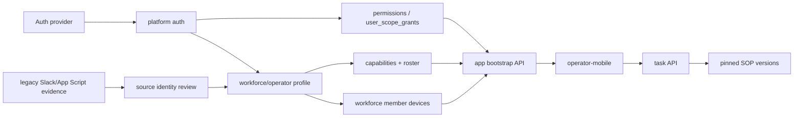

# Operator Management TRD

Status: draft for implementation review.

## Technical Summary

Operator Management extends the existing Goat OS auth/RBAC foundation into a
workforce roster and Android app bootstrap system.

Core rule:

```text
Auth provider verifies identity.
Goat OS maps identity to internal actor.
Operator Management verifies active profile, grant, scope, capability, roster,
and device/session state.
SOP/task modules return only allowed work and compatible form versions.
Backend revalidates all submissions.
```

Do not create a parallel auth system for Android. Use the platform auth adapter,
`user_scope_grants`, route-to-permission registry, audit log, and generated
OpenAPI clients.

## Existing Foundation

Phase 1 already has:

- bearer/JWKS auth middleware
- `user_scope_grants`
- `auth_pending_email_grants`
- route-to-permission registry
- auth session audit events for admin web
- roles: `admin`, `park_head`, `operator`, `verifier`, `ceo_internal`
- scope types: `tenant`, `custodian_party`, `farm`, `park`, `shed`, `cohort`

Current limitations to close:

- no canonical operator profile table
- no operator capability/skill catalog
- no roster/shift/absence/backfill records
- no device registration/revocation model
- no Android app bootstrap manifest
- no source-identity mapping for Slack/App Script submitters
- no per-operator app feature compatibility gate

## Module Ownership

Proposed module:

```text
backend/internal/workforce
  domain
  app
  ports
  adapters/http
  adapters/postgres
```

Responsibilities:

- operator/workforce profile CRUD
- activation/deactivation
- capability catalog and assignments
- roster, team, shift, absence, and backfill state
- device registration/revocation metadata
- app bootstrap manifest assembly
- legacy source-identity candidate review
- workforce-specific audit/outbox events

Existing modules remain owners of their own concerns:

- `backend/internal/platform/auth` verifies tokens and maps external identity.
- `backend/internal/permissions` owns role/scope grants and route checks.
- `backend/internal/sop` owns SOP definitions and version compatibility.
- `backend/internal/tasks` owns task lifecycle and assignment.
- `backend/internal/media` owns upload intents and proof metadata.
- `backend/internal/locations` owns location tree and aliases.

Naming convention:

- Product, API, and permission surfaces use `operator` because managers and app
  users understand `/admin/operators` and `operators.*`.
- Backend ownership and persistence use the `workforce` module and
  `workforce_*` table names because the same module owns operators, park heads,
  verifiers, rosters, capabilities, devices, absences, and backfill.
- `operator` is a workforce role/surface, not a separate backend module.

## System Diagram



## Tables

### workforce_members

Canonical tenant-scoped operator/workforce profile.

Required columns:

- `tenant_id`
- `workforce_member_id`
- `user_id` nullable until login/identity claim
- `display_code`
- `display_name`
- `status`: `candidate`, `active`, `inactive`, `suspended`, `left`
- `primary_role_hint`: `operator`, `park_head`, `verifier`, `supervisor`,
  `admin`, `other`
- `primary_location_id` nullable
- `metadata` JSONB for non-authoritative source notes
- `created_by`
- `created_at`
- `updated_at`
- `row_version`

Constraints/indexes:

- tenant + workforce member unique
- tenant + user_id unique where user_id is not null and status is active
- tenant + status + updated_at
- tenant + primary location + status

`display_name` is operational workforce data in production, but committed
fixtures must not contain real names.

`primary_role_hint` is non-authoritative review/display metadata only. It may
include values such as `supervisor` or `other`, but permissions must come only
from `user_scope_grants` and route-to-permission checks; never map
`primary_role_hint` directly to RBAC.

### workforce_external_identities

Maps legacy/source identities to canonical workforce members.

Required columns:

- `tenant_id`
- `external_identity_id`
- `workforce_member_id` nullable until reviewed
- `source_system`: `slack`, `app_script`, `sheet`, `bq`, `firebase`,
  `manual`, `other`
- `source_flow`
- `external_ref_type`: `slack_user_id`, `email`, `phone`, `staff_label`,
  `sheet_user`, `firebase_uid`, `other`
- `external_ref_hash`
- `encrypted_external_ref` nullable production-only
- `status`: `candidate`, `mapped`, `rejected`, `conflict`, `retired`
- `confidence`
- `first_seen_at`
- `last_seen_at`
- `observation_count`
- `reviewed_by`
- `reviewed_at`
- `review_reason`
- `metadata`
- `created_at`
- `updated_at`

Raw Slack IDs, emails, phones, and names must not be stored in committed
fixtures. Production storage may keep encrypted source refs if needed for
matching and audit.

Indexes:

- tenant + source system + external ref hash
- tenant + status + last seen
- tenant + workforce member + status

### workforce_capabilities

Capability catalog for task assignment and app feature eligibility.

Examples:

```text
movement.execute
count.verify
death.report
vaccination.execute
health.follow_up
feed.report
proof.verify
rfid.scan
media.video_capture
scale.capture
```

Required columns:

- `tenant_id`
- `capability_id`
- `capability_code`
- `description`
- `status`
- `created_at`
- `updated_at`

### workforce_member_capabilities

Effective-dated capability assignment.

Required columns:

- `tenant_id`
- `workforce_member_id`
- `capability_id`
- `scope_type`
- `scope_id`
- `status`
- `valid_from`
- `valid_to`
- `assigned_by`
- `created_at`
- `updated_at`

Indexes:

- tenant + member + status + valid window
- tenant + capability + scope + status

### workforce_roster_assignments

Roster/team/shift assignment for task generation, backfill, and escalation.

Required columns:

- `tenant_id`
- `roster_assignment_id`
- `workforce_member_id`
- `team_id` nullable for v1
- `scope_type`
- `scope_id`
- `shift_date`
- `shift_start_at`
- `shift_end_at`
- `task_type` nullable
- `status`: `scheduled`, `active`, `completed`, `missed`, `canceled`
- `escalation_owner_user_id` nullable
- `created_by`
- `created_at`
- `updated_at`

Indexes:

- tenant + shift date + scope + status
- tenant + workforce member + shift date + status

### workforce_absences

Absence/backfill source of truth.

Required columns:

- `tenant_id`
- `absence_id`
- `workforce_member_id`
- `scope_type`
- `scope_id`
- `starts_at`
- `ends_at`
- `reason_code`
- `status`: `reported`, `approved`, `rejected`, `canceled`
- `replacement_member_id` nullable
- `created_by`
- `approved_by`
- `created_at`
- `updated_at`

Absence must create reassignment/backfill records; it must not overwrite the
original task owner.

### workforce_member_devices

Registered Android device metadata.

Required columns:

- `tenant_id`
- `device_id`
- `workforce_member_id`
- `platform`: `android`
- `app_install_id`
- `device_public_key_hash` nullable
- `push_token_hash` nullable
- `app_version`
- `os_version`
- `status`: `active`, `revoked`, `lost`, `retired`
- `last_seen_at`
- `registered_by`
- `registered_at`
- `revoked_by`
- `revoked_at`
- `metadata`

Do not store raw FCM tokens in normal tables. Store hashes or use a secret
store/notification adapter as appropriate.

Indexes:

- tenant + workforce member + status
- tenant + app install id
- tenant + last seen

### workforce_member_app_sessions

Optional audit/session table for Android bootstrap and support diagnostics.

Required columns:

- `tenant_id`
- `session_id`
- `workforce_member_id`
- `device_id`
- `auth_subject`
- `started_at`
- `last_seen_at`
- `ended_at`
- `status`
- `app_version`
- `ip_hash` nullable
- `metadata`

## API Contract

Admin API additions:

```text
GET    /admin/operators
POST   /admin/operators
GET    /admin/operators/{operator_id}
PATCH  /admin/operators/{operator_id}
POST   /admin/operators/{operator_id}/activate
POST   /admin/operators/{operator_id}/deactivate
GET    /admin/operators/{operator_id}/grants
POST   /admin/operators/{operator_id}/grants
POST   /admin/operators/{operator_id}/capabilities
DELETE /admin/operators/{operator_id}/capabilities/{capability_id}
GET    /admin/operators/{operator_id}/devices
POST   /admin/operators/{operator_id}/devices/{device_id}/revoke
GET    /admin/operator-source-candidates
POST   /admin/operator-source-candidates/{candidate_id}/map
POST   /admin/operator-source-candidates/{candidate_id}/reject
```

App API additions:

```text
GET  /app/me
POST /app/devices/register
POST /app/devices/{device_id}/heartbeat
GET  /app/bootstrap
```

Phase 2 task/SOP endpoints consume the bootstrap result but remain owned by
SOP/task modules:

```text
GET  /app/tasks
GET  /app/tasks/{task_id}
GET  /app/sop-versions/{sop_version_id}
POST /app/tasks/{task_id}/submissions
```

Every write must support idempotency where mobile retry is plausible.

## App Bootstrap Manifest

`GET /app/bootstrap` returns the minimum dynamic contract needed by the native
app:

```text
actor
operator_profile
roles_and_scopes
capabilities
device_state
app_min_supported_version
feature_flags
visible_navigation
task_queue_descriptors
pinned_sop_versions
supported_field_types
supported_rule_operators
supported_proof_actions
option_source_descriptors
sync_policy
server_time
```

Compatibility rules:

- Backend publishes only declarative SOP DSL, never arbitrary executable code.
- Android renders only known native field/proof components.
- If a required SOP field type, rule operator, workflow node, or proof action is
  unsupported by the installed app, bootstrap marks that SOP version
  incompatible and does not return it as executable.
- Offline cache entries are scoped to actor, tenant, scope, app version, and SOP
  version.
- Backend revalidates every submission against current grants, profile status,
  task state, and pinned SOP version even if the draft was created offline.

## Source Discovery Flow

The discovery job reads source artifacts and emits sanitized candidates:

```text
legacy scripts/sheets/BQ snapshots
  -> extract source actor references and role/scope hints
  -> hash external actor refs
  -> count observations by flow/scope/date
  -> write candidate evidence
  -> admin/source reviewer maps or rejects
  -> mapped profile receives grants/capabilities only through approved actions
```

Candidate confidence inputs:

- repeated submissions from the same source actor
- observed farm/park/shed scope
- matching current grant or pending grant
- role hint from source flow: submitter, verifier, health manager, feed user,
  count staff, assignee
- recency and last-seen date

No source-discovery job may automatically grant production permissions from
legacy data alone. It may propose candidates and scope hints.

## Permissions

New permissions:

```text
operators.read
operators.write
operators.activate
operators.deactivate
operators.map_legacy_source
operators.manage_device
operators.manage_capability
operators.manage_roster
operators.view_audit
app.bootstrap
```

Suggested role grants:

| Role | Permissions |
| --- | --- |
| `admin` | all `operators.*`, `app.bootstrap` when acting as self |
| `ceo_internal` | all `operators.*`, `app.bootstrap` when acting as self |
| `park_head` | scoped `operators.read`, `operators.manage_roster`, scoped device read, scoped capability suggestions |
| `operator` | `app.bootstrap`, own profile/device read, own task execution through task permissions |
| `verifier` | `operators.read` for proof-review scope only when needed |

Route registry must fail closed. Token role claims are not authority.

## Observability

Metrics/logs:

- app bootstrap latency/error count by role/scope/app version
- denied bootstrap count by reason
- denied task/submission count by reason
- active operator count by scope/status
- device registration/revocation count
- incompatible SOP/app-version count
- source-candidate import count/conflict count
- offline heartbeat lag by scope
- audit write failures

Alerts:

- app bootstrap p99 breach
- sudden spike in denied submissions
- source-candidate import failures
- device revocation not enforced on next sync
- task queue empty for active operator scope when scheduled work exists

## Scale Requirements

- Operator lists are paginated by tenant/status/location/search.
- Task/bootstrap queries filter by actor, tenant, active scope, status, and due
  window.
- Source-candidate imports are chunked and idempotent by source/system/ref hash.
- Roster queries are indexed by tenant/date/scope/status.
- Device heartbeats use bounded writes and may coalesce updates.
- No API loads all operators, all tasks, all grants, or all source observations
  into memory.

## Testing

Backend:

```text
auth profile active/inactive tests
grant active/revoked/expired tests
scope allow/deny tests
device active/revoked tests
bootstrap compatibility tests
source candidate hash/dedup tests
operator profile CRUD tests
idempotent device registration tests
audit/outbox tests
```

Mobile/client:

```text
login/bootstrap success and denied states
unsupported app version state
unsupported SOP version state
offline cache scoped by actor/device
revoked device/grant submit denial after reconnect
```

Scale:

```text
query-plan validation for operator list, bootstrap, task queue, roster, device
heartbeat, and source-candidate review
synthetic large roster/task fixture before production rollout
```

## Rollout Plan

1. Add operator profiles and source-candidate review docs/contracts.
2. Import sanitized legacy submitter/assignee evidence into local/dev review.
3. Create a small active operator cohort with explicit grants and capabilities.
4. Register Android devices and test app bootstrap against fake tasks/SOPs.
5. Wire Shifting tasks to active operator profiles and scope grants.
6. Run Slack and Android in overlap for selected scopes.
7. Revoke Slack execution only after Android coverage, proof, audit, and rework
   paths pass.

## Open Technical Decisions

- Whether `workforce_members.user_id` should reference a future users table or
  remain the stable auth subject UUID used by `user_scope_grants`.
- Whether phone OTP is the first operator login adapter or follows verified
  email/Firebase bootstrap.
- Whether device registration needs cryptographic device keys in v1 or only
  app-install metadata plus server-side revocation.
- Exact schema for teams if park/shed roster is enough for Phase 2.
- How long stale offline bootstrap remains executable after grant revocation.
- Which source actor refs may be stored encrypted in production and which should
  remain hash-only.
