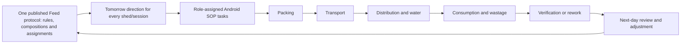
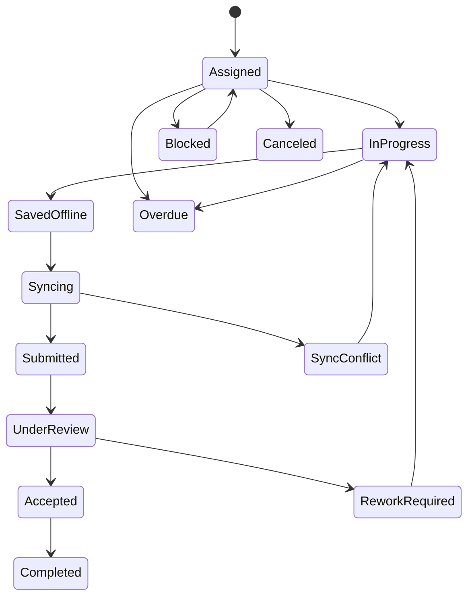

# Feed Direction Mobile SOP Cutover - Product Requirements

**Status:** Draft for owner review and implementation sequencing
**Date:** 2026-07-20
**Owner:** Feed Direction / Operations Platform
**Companions:** [Feed Direction PRD](./PRD.md),
[Feed Direction TRD](./TRD.md),
[Sheets/App Script Replacement PRD](./SHEETS-APP-SCRIPT-REPLACEMENT-PRD.md),
[Mobile Cutover TRD](./SOP-MOBILE-CUTOVER-TRD.md), and
[canonical legacy reference](../../context/source-findings/feed-direction-legacy-system-reference.md).

## 1. Product story in plain language

Today, a worker sees a Slack message saying that a shed needs a certain feed.
The bot asks for a video. The worker uploads something, another prompt appears,
and a Sheet is supposed to remember what happened. Normal feed and "experiment"
feed use different workbooks, channels, code, and wording even though the people
are doing nearly the same job.

GoatOS will turn that into one clear daily job story.

The Feed Director publishes tomorrow's directions. GoatOS creates the exact
work for each shed and session. When a worker opens the Android app, it shows
only the tasks that person is allowed and assigned to do. The task already knows
the shed, feed items, expected kg, deadline, and required evidence. The worker
enters the actual kg, captures the right video or photo, and submits even if the
network is poor. GoatOS later syncs the answer, checks it, saves the media in
GCS, records the database and audit events, and shows a verifier what needs
review.

If proof is wrong, missing, late, or the quantity is short, the original work is
not erased. The task moves into rework with a reason. The worker fixes only the
failed step. The Feed Director sees the exception and its effect on tomorrow's
plan.

If two sheds with the same tag need different mixtures, the director puts both
mixtures and their shed assignments inside the next Feed protocol version. One
authorized publish makes that whole version effective. The workers see the
normal packing and distribution tasks. They do not enter a separate "experiment
system."

## 2. Product decision

There is one Feed Direction product and one execution chain:

The composition may be the shared default, a custom exact-shed version, a
comparison variant, or an emergency bridge. That changes the instruction, not
the backend, mobile app, proof model, or verification process.

## 3. Goals

1. Replace every Feed Direction Slack prompt/form with a versioned SOP task in
   the existing GoatOS Android app.
2. Make Postgres the canonical process record and GCS the canonical media store.
3. Preserve every useful legacy field while separating direction context,
   operator answers, proof, reviewer verdict, and audit history.
4. Support default and same-tag custom compositions in one generation and
   execution path.
5. Work under intermittent connectivity without duplicate completion or lost
   evidence.
6. Give each role the right work and prevent channel membership from acting as
   authorization.
7. Make missing, late, short, rejected, and uncertain work visible and
   recoverable.
8. Keep Slack only as an optional notification surface during migration.
9. Give the Feed Director a closed feedback loop from published composition to
   actual quantities, water, wastage, proof quality, cause, correction, and
   next-day revision.

## 4. Non-goals

- Rebuilding the old Sheets or Apps Script design in Postgres.
- A second `experiment_feed` service, database, form library, or mobile flow.
- Requiring a scientific hypothesis/control/treatment model for an ordinary
  exact-shed composition override.
- Treating a Slack message, PDF, uploaded file, or sent notification as task
  completion.
- Hardcoding observed legacy trigger times as future business deadlines.
- Giving Android credentials or SDK access to Sheets, Slack, BigQuery, raw GCS
  buckets, or Postgres. Task-bound, short-lived signed HTTPS media operations
  issued by the app API are the required exception for proof upload/download.
- Building the full nutrition optimizer, procurement, or cost-accounting module
  inside this cutover.
- Treating noisy KT quantities or formulas as approved production policy.

## 5. People and authority

| Role | What the person can see and do | What they cannot do by default |
| --- | --- | --- |
| Feed Director | Draft compositions and exact-shed assignments inside a Feed protocol version, inspect tomorrow coverage, publish that complete version when authorized, review outcomes and exceptions, issue corrections/emergency adjustments | Complete field proof as another worker or silently rewrite issued work |
| Feed packing operator | See assigned shed/session packing tasks, enter actual quantities, capture required proof, explain shortfall and submit | Change the published expected quantity or verify their own submission/proof |
| Feed transport operator | See assigned route/destination tasks, capture departure/arrival evidence and exceptions | Complete distribution or alter direction quantities |
| Feed distribution operator | Record served/consumed quantity, distribution proof and water proof for assigned sheds/sessions | Publish the Feed protocol or hide a shortfall |
| Wastage/consumption operator | Record consumed/wasted kg, reason and proof where separately assigned | Change the plan or reviewer verdict |
| Video verifier | Inspect required evidence and quantities, accept/reject with reason, request step-specific rework | Change original submissions or approve outside assigned scope |
| Supervisor/escalation owner | Reassign, unblock, approve allowed exceptions, follow overdue/rejected work | Erase history or bypass safety rules without reason and audit |
| Admin/Data Ops | Manage SOP definitions, proof policy, reference data, workforce assignments, deadline policy and migration mappings | Publish a Feed protocol version unless granted Feed authority |

Assignment and actual submission are separate facts. One person may help another
in the field, but GoatOS must record who was assigned, who actually submitted,
who approved the substitution, and why.

Verification is also a separate fact. A principal who submitted an item or its
proof can never verify that same submission, even when the principal holds both
operator and verifier roles. Capability grants do not override this
per-submission separation-of-duties rule.

## 6. The daily product flow

### 6.1 Before work reaches a phone

1. GoatOS receives a safe tomorrow count/projection snapshot.
2. It resolves each physical shed/breed row to reviewed ration context.
3. It loads the single effective published Feed protocol version and selects a
   composition owned by that version: shared default or a more-specific
   exact-shed/cohort/date/session assignment.
4. It generates immutable direction items and validates coverage, overlap,
   stock/stage policy, and blockers.
5. An authorized publisher issues the direction.
6. GoatOS creates stage obligations and role assignments.
7. The mobile app receives the tasks through `/app/bootstrap` and task sync.
8. NotificationGateway may mirror a summary to Slack; failure to notify does not
   delete or complete the task.

### 6.2 On the worker's phone

1. The worker opens **My Feed Work**.
2. The app groups work into `Due now`, `Upcoming`, `Needs rework`, `Syncing`,
   and `Done`.
3. A task card shows farm, shed, session, stage, deadline, status and a short
   exception badge. It does not expose unrelated farms or roles.
4. The worker opens a task and sees read-only direction context followed by the
   exact SOP questions.
5. The app validates quantities, units, required proof kind/file count, remarks
   and conditional reasons before local submission.
6. Offline, the phone stores the pinned SOP version, answers and media queue and
   shows `Saved on this phone` rather than falsely showing `Completed`.
7. Online, the app obtains signed upload instructions, sends media to GCS, then
   submits the typed form with idempotency keys.
8. The server revalidates everything. Accepted submissions move to review or
   completion; conflicts remain visible with a repair action.

### 6.3 Verification and rework

1. A verifier sees the expected instruction, actual quantities, variance,
   required proof and all evidence versions.
2. The verifier chooses `Accept`, `Reject and request rework`, or a configured
   exception disposition.
3. Rejection requires a reason code and note where policy requires it.
4. GoatOS opens rework only for the failed stage/items/proof. The original
   submission remains immutable.
5. The assigned worker receives the rework task and deadline.
6. Acceptance closes the stage only when every required item and proof is valid.
7. Stage completion advances the direction chain, writes audit/outbox events and
   updates read models.

## 7. Mobile navigation and screens

The Feed slice is rendered inside the existing native Android/Compose app. It is
not a separate app.

### 7.1 My Feed Work

Required filters and groupings:

- business date: today/tomorrow/rework;
- farm/park and shed within the user's granted scope;
- stage: packing, transport, distribution, water, consumption, wastage,
  verification, emergency adjustment;
- session;
- status: assigned, due, in progress, saved offline, syncing, submitted, under
  review, accepted, rejected, rework, overdue, blocked, canceled;
- exception badge: short, excess, missing proof, stale direction, stock issue,
  assignment issue, upload issue, verification issue.

Each card must show one primary next action. A card must not say `Done` merely
because a notification or parent message was created.

### 7.2 Task detail

The top section is immutable context:

- business date and target feeding date;
- farm/park, shed and session;
- current tag/category and count snapshot;
- feed-direction run/version and composition version;
- optional `custom composition` or comparison label, expressed in operational
  language rather than forcing workers to understand an experiment model;
- expected feed items and kg;
- assigned role/person, due time and escalation owner;
- current stage and prerequisites;
- change notice when a Diff or emergency adjustment supersedes prior work.

The middle section is the SOP runner. The bottom section shows offline/sync
state, submission history, verifier feedback and the next allowed action.

### 7.3 Proof capture

- Open the camera from the task so evidence is automatically bound to task,
  stage and item.
- Show required kind: video, photo, or either; minimum/maximum files; duration,
  size or quality rules; and whether gallery selection is allowed.
- Record capture time, device, uploader, checksum and upload state.
- Prevent a JPEG from satisfying a video-only requirement.
- Let the worker retake before submission and preserve submitted evidence after
  submission.
- Never expose a raw public GCS URL. Render through authorized backend contracts.

### 7.4 Feed Director mobile view

The director needs a compact operating view, not a Sheet replica:

- tomorrow directions generated/blocked/missing;
- coverage by farm/shed/session;
- custom composition assignments and effective versions;
- count freshness and unresolved ration context;
- packing/transport/distribution/water/consumption/wastage progress;
- late, short, rejected, missing-proof and sync-conflict work;
- wastage/variance threshold breaches and root-cause status;
- stock runway/reorder/delivery signals when the inventory contract is ready;
- proposed next-day protocol/composition changes with preview, reason, authorized
  protocol publisher and effective date.

Publishing remains a high-authority action with preview and confirmation; it is
not an accidental edit from a task card.

## 8. Canonical mobile SOPs and fields

All forms are versioned GoatOS SOP definitions. Direction context is prefilled
and signed by the server; workers cannot edit it.

### 8.1 Common task envelope

Every Feed SOP carries:

| Field | Behavior |
| --- | --- |
| tenant, farm/park, shed | Server-scoped identifiers and human labels |
| business/target date, session | Pinned direction context |
| direction run/version | Immutable source of expected work |
| composition/version/assignment | Exact default or custom composition provenance |
| obligation/task/SOP version | Workflow and form identity |
| assigned role/person and escalation owner | Authorization and routing |
| expected feed items and quantities | Ordered typed values with `kg` units |
| deadline and grace policy | Effective-dated business policy |
| idempotency key | Stable logical submission identity |
| device/local submission id | Offline convergence identity |

### 8.2 Packing SOP

For each expected feed item:

- item name and expected kg, read-only;
- actual packed kg, required decimal quantity;
- optional batch/lot picker when inventory policy enables it;
- automatically calculated difference and tolerance status;
- short/excess reason when outside tolerance;
- stage remarks;
- required packing video(s), with exact proof policy;
- `cannot complete` reason for missing stock, wrong item, equipment, unsafe feed,
  direction dispute, assignment issue, or another governed code.

Session 1 and Session 2 may be separate tasks or children of one batch, but each
has its own completion and proof. A failed Session 1 must not automatically
invalidate accepted Session 2 proof.

### 8.3 Transport SOP

- source/staging location and destination shed, read-only;
- feed/session manifest, read-only;
- departure and arrival acknowledgement/time;
- optional route/container/batch reference from backend data;
- transport video/photo per proof policy;
- delivered condition and discrepancy reason;
- remarks and `cannot complete` reason.

All feed items are included; the legacy Feed-5 omission is forbidden. One
consolidated transport task may serve several sheds only when a versioned
transport plan explicitly maps every child direction and proof requirement.

### 8.4 Distribution/consumption SOP

- expected total and feed-item breakdown, read-only;
- actual quantity distributed/consumed in kg;
- distribution or consumption video(s);
- automatically calculated difference;
- deviation reason/root cause when outside tolerance;
- remarks;
- explicit `not served`/partial/unsafe outcome with reason.

The business owner must decide whether `distributed` and `consumed` are one
field or separate observations. GoatOS must not preserve legacy label ambiguity.

### 8.5 Water SOP

- water served: yes/no/partial;
- required water media;
- exception reason and remarks;
- actual submitter and time.

Water may be assigned to another person. It remains a required child step when
policy says so; distribution does not complete merely because feed media exists.

### 8.6 Wastage SOP

- related direction/session and expected/actual feed context, read-only;
- wastage kg, required numeric value including zero;
- wastage media when required;
- reason/category and root-cause note;
- corrective action or follow-up owner when threshold is breached;
- derived wastage percentage shown after submission.

This SOP is available to both default and custom compositions. It is not an
experiment-only feature.

### 8.7 Verification SOP

- expected versus actual values and difference;
- each required evidence object with capture/uploader/device metadata;
- accept/reject per stage or item according to proof policy;
- rejection reason code and remarks;
- rework scope and due time;
- verifier identity/time;
- escalation when proof is unsafe, fraudulent, missing, late or repeatedly
  rejected.

### 8.8 Emergency bridge/correction SOP

- triggering shifting/shortfall/direction exception;
- source and destination context;
- additional feed items/quantities;
- authorized reason and approving actor;
- packing/delivery proof;
- reconciliation note and effect on stock/next-day direction.

This is an additive, auditable event. It never overwrites the issued direction.

## 9. Product state model

`SavedOffline`, `Syncing`, `Submitted`, `Accepted`, and `Completed` are visibly
different. The app must never hide an unsynced submission behind a green
completion state.

## 10. Validation and failure behavior

- Server values and published versions win over stale mobile cache.
- If work was superseded before submission, the server returns a typed conflict
  with the replacement task. The app preserves local answers for guided repair.
- Quantity fields use decimal kg values, configured precision and explicit
  lower/upper/tolerance rules.
- Zero is a real answer for wastage or an allowed item, not the same as blank.
- Conditional reasons become required when a step is short, excess, partial,
  skipped, unsafe, rejected or blocked.
- Proof policy validates MIME/type, size, count, checksum, binding and upload
  completion server-side.
- Repeated submit/upload callbacks return the same result and do not create a
  second transition.
- A notification outage, Slack outage or PDF failure never blocks database work.
- An uncertain external side effect enters reconciliation/manual review rather
  than being blindly replayed.
- The app exposes retry, replace evidence, refresh task, contact supervisor and
  save-for-later actions according to the typed error.

## 11. Notifications

The backend creates work before notifying anyone.

Notification types include assignment, due soon, overdue, changed direction,
rework requested, upload/sync failure, verifier acceptance, exception escalation
and director summary. Delivery may use mobile push and, during overlap, Slack.

Each notification links back to the GoatOS task. Slack replies do not mutate the
canonical task after cutover unless a separately approved migration adapter
validates and submits through the same API.

## 12. Feedback and next-day adjustment

The outcome record links to the composition and direction versions that caused
the work. The director can review:

- planned and actual quantity by item/shed/session;
- packing short/excess;
- distribution/consumption variance;
- water completion;
- wastage kg and percentage;
- proof acceptance/rejection/rework;
- root cause and corrective action;
- changes in count, stage/tag or shifting;
- prior and proposed next-day composition.

Creating a new version requires a reason, effective window and authorized
publisher. The system shows which sheds will change before publication. Prior
versions and outcomes remain replayable. Optional comparison cohorts/metrics may
be added later without changing the core task flow.

## 13. Reporting and command views

Required product buckets:

- directions blocked or not issued;
- tasks unassigned, due, overdue, saved offline too long, or sync-conflicted;
- packing short/excess or proof missing;
- transport pending/rejected;
- distribution/water/consumption incomplete;
- wastage over threshold;
- verification pending/rejected/rework overdue;
- custom composition expiring or overlapping;
- emergency adjustments awaiting reconciliation;
- stage and whole-direction completion by farm/date/session.

All lists are bounded and filterable. A dashboard total must open the exact rows
behind it.

## 14. Migration experience

### Phase 0 - Freeze the evidence

- Use the canonical legacy reference as the field/channel/trigger inventory.
- Confirm active trigger ownership, live form headers and unresolved semantic
  conflicts without changing production.
- Create sanitized parity fixtures for default and custom compositions.

### Phase 1 - Shadow tasks

- GoatOS generates direction and SOP tasks but does not notify production users.
- Compare eligible sheds, expected items/kg, sessions and custom assignments to
  legacy output.

### Phase 2 - Sandbox mobile execution

- Run packing, transport, distribution, water, consumption, wastage,
  verification and rework in a separate sandbox scope/channel.
- Test offline, multiple files, wrong MIME, duplicate submit, stale version,
  missing prompt equivalent, and rejected proof.

### Phase 3 - Limited farm overlap

- A bounded farm/shed cohort uses GoatOS as execution truth while legacy output
  remains read-only comparison.
- Slack mirrors notifications only; Sheet rows are not manually reconciled into
  GoatOS canonical state.

### Phase 4 - Cutover

- GoatOS is authoritative for selected grain.
- Disable matching legacy senders and form ingestion only after parity and
  rollback evidence.
- Retain immutable exports/checksums and a read-only historical lookup.

### Phase 5 - Retirement

- Remove runtime dependency on Feed Sheets/App Script/Slack/BQ for the covered
  feature grain.
- Keep analytics migration separate from operational retirement.

## 15. Acceptance criteria

### Direction and composition

- One generation run covers default and exact-shed custom compositions.
- Same-tag sheds can receive different approved mixtures with pinned provenance.
- An equal-priority overlapping assignment blocks generation visibly.
- No experiment-only execution service, table family or mobile form is needed.

### Mobile and offline

- The correct role sees only assigned/scoped work.
- Every legacy prompt has a corresponding SOP step or explicit retirement
  decision.
- Full task context and required picker data are available offline.
- Offline media/answers survive process death and reboot.
- Reconnect converges without duplicate task completion or evidence.
- The UI distinguishes saved, syncing, submitted, accepted and completed.
- Every authorized task remains reachable through stable cursor pagination;
  crossing a page boundary, going offline and process death do not lose the
  continuation position.
- Every Feed cache, draft, queued command, captured file and in-memory task is
  scoped to the signed-in principal and is removed before another principal can
  use the device after logout or revocation.

### Proof and verification

- A photo cannot satisfy video-only policy.
- Multiple files do not duplicate the next step or completion event.
- Completion cannot occur before all required accepted evidence exists.
- Transport has an explicit accepted/rejected/rework completion path.
- Original and corrected submissions remain visible and audited.
- Reviewer identity, verdict, reason and time are stored.

### Quantities and exceptions

- Expected, actual, difference, unit, precision and tolerance are typed.
- Feed items beyond four are included everywhere.
- Short, excess, partial, zero, missing and unsafe outcomes behave differently.
- Wastage is available for every composition type.
- Emergency adjustments are additive and reconciled.

### Reliability and security

- Stable business/idempotency keys make retries safe.
- Notification failure does not change task state.
- No mobile client receives credentials or SDK access for Sheets, Slack,
  BigQuery, raw GCS buckets or Postgres.
- The app may upload/download proof only through task-bound, short-lived signed
  HTTPS operations; these operations are scoped, expiring and auditable and
  never expose a public URL or cloud credential.
- Every command is tenant/scope/capability checked server-side.

### Cutover

- Shadow comparison proves direction coverage, quantities, stage state,
  exceptions and verification for the agreed period.
- Legacy senders are disabled only for the proven grain and can be restored
  under a documented rollback plan.
- Production, staging and sandbox evidence are never mixed.

## 16. Product decisions still required

1. Final effective-dated business deadlines and grace periods; legacy observed
   triggers are not defaults.
2. Whether distributed and consumed quantity are one field or two events.
3. Which stages require video, photo, either, duration/quality limits and
   gallery restrictions.
4. Actual quantity tolerances by item/stage and who may override them.
5. Whether Session 1/2 remain the initial fixed policy or become published
   arbitrary session slots from day one.
6. Exact workforce positions and substitution/escalation rules per farm.
7. Transport consolidation rules and evidence grain.
8. Inventory reservation/consumption boundary and batch/lot capture timing.
9. Wastage reason taxonomy, threshold and required corrective action.
10. Which Feed Director actions are allowed on mobile versus admin web.
11. Retention and review policy for Feed proof media.
12. Whether optional formal comparison goals/cohorts/metrics are in the first
    release or a later analysis layer.
