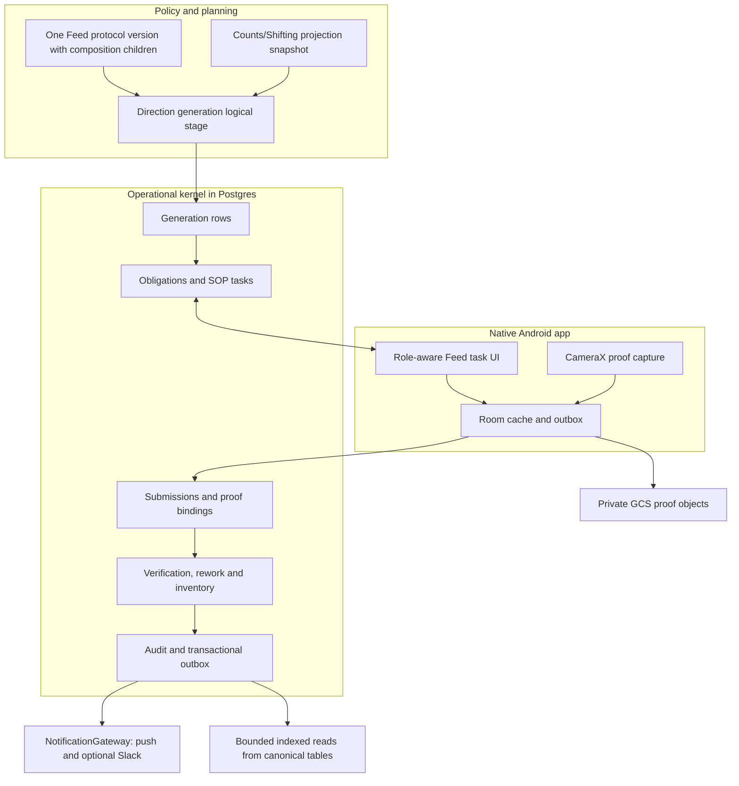
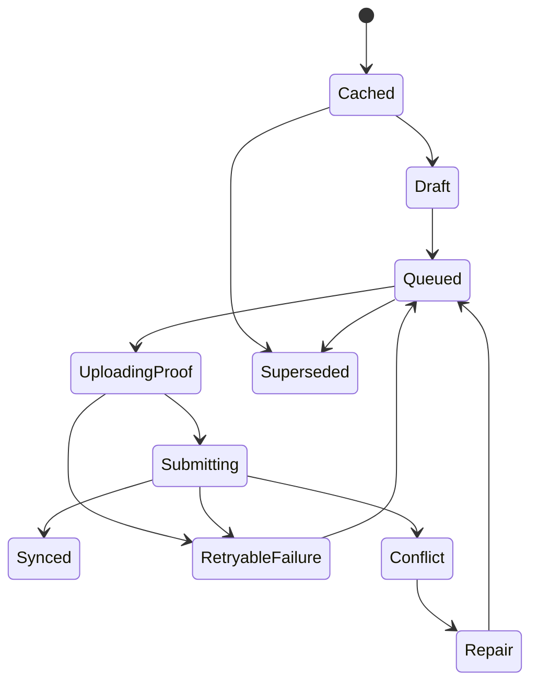

# Feed Direction Mobile SOP Cutover - Technical Requirements and Design

**Status:** Draft technical design
**Date:** 2026-07-20
**Companion PRD:** [SOP-MOBILE-CUTOVER-PRD.md](./SOP-MOBILE-CUTOVER-PRD.md)
**Canonical Feed design:** [PRD.md](./PRD.md) and [TRD.md](./TRD.md)
**Legacy evidence:**
[feed-direction-legacy-system-reference.md](../../context/source-findings/feed-direction-legacy-system-reference.md)

## 1. Design outcome

Build Feed Direction as one bounded module on the existing GoatOS operational
kernel. Postgres owns policy versions, generated instructions, obligations,
submissions, verification, inventory effects, audit and outbox. The native
Android app renders role-assigned versioned SOP tasks and works offline. GCS
stores private proof media through signed operations. Slack and legacy Sheets
are optional migration adapters and never participate in the canonical commit.

Default and legacy "experiment" feed use the same data path. Compositions and
their assignments are children of one mandatory Feed `protocol_version`; they
do not have an independent approval lifecycle. A generated row pins the
composition assignment selected from the effective published protocol version.
All later stages refer to that row, composition and owning protocol version.



## 2. Existing foundations versus required Feed work

### 2.1 Reuse as implemented foundations

| Capability | Existing GoatOS surface |
| --- | --- |
| Published policy | `protocol_definitions`, `protocol_versions`, rules, dimensions and triggers |
| Kernel work | `obligation_instances`, batches, status events, reminders/escalations |
| Versioned forms | `sop_definitions`, immutable `sop_versions`, tasks, submissions and items |
| Proof | `proof_artifacts`, task/scope binding, signed upload/download flow |
| Verification | Generic pending/approved/rejected verification queue and rejection reason |
| Reliability | `idempotency_keys`, audit log, transactional outbox and notification attempts |
| Counts/Shifting | Base anchors, shifting events, projections, snapshots and exceptions |
| Inventory | Generic inventory item, stock and movement ledger |
| Feed seed | `feed_direction_completions` record/accept/reject/history service |
| Android | Kotlin/Compose form runner, Room outbox, WorkManager, proof capture and process-death recovery |
| Workforce | Feed composite roles and tenant/park/shed assignments/capabilities |

### 2.2 Not complete today

- No production Feed generation run/row logical stage in the kernel worker.
- No complete Feed-protocol draft editor for composition/assignment children and
  their single protocol publish gate.
- No Feed obligation/stage generation and supersession path.
- `GET /app/tasks` now has the canonical 20-row cursor boundary and completeness
  metadata, but it still needs the Feed-specific filters below before the Feed
  mobile list can ship.
- No end-to-end inventory reservation/consume/release behavior for Feed.
- No complete bounded Feed command-lens queries for the legacy stage/exception
  buckets.
- Current Feed HTTP APIs cover readiness, preview and Counts/Shifting
  exceptions, not operational execution.
- The generic Android runner does not yet render every field needed here:
  explicit date/time, multiselect, read-only instruction tables and a
  server-owned planned-versus-actual quantity line control.
- Task detail has Room caching, but the assigned task list still needs a durable
  offline Feed cache.
- Feed and obligation state changes in the current completion service are not
  yet guaranteed as one canonical state + audit + outbox transaction.
- Common middleware does not yet enforce Feed park/shed scope consistently on
  app and Feed routes.
- The generic verifier service must explicitly forbid self-verification for a
  submitted proof/item.
- Older APK compatibility must block assignment of an SOP field/control the app
  cannot render.

These are implementation gaps, not reasons to create a parallel Feed platform.

## 3. Module boundaries

| Module | Owns | Does not own |
| --- | --- | --- |
| Counts/Shifting | Projected physical count snapshot and blocker state | Feed composition or operator proof |
| Feed policy/config | Draft composition/item/assignment children of a Feed protocol version plus session/proof/tolerance policy | Independent approval/publish state, mobile local state or generated execution truth |
| Feed generation | Deterministic run and immutable instruction rows | Direct notifications or media |
| Operational kernel | Obligations, deadlines, escalation, SOP tasks, state transitions | Feed nutrition calculations |
| SOP | Versioned fields/conditions, typed submissions and item answers | Direction selection |
| Proof/GCS adapter | Private media object lifecycle and task binding | Stage acceptance by file presence |
| Verification | Reviewer queue, verdict, rejection reason and rework signal | Mutation of original submission |
| Inventory | Reservation/consume/release movements and availability | Feed protocol publication |
| App API | Role/scope-checked mobile contracts | Business truth in client code |
| Android | Offline rendering/capture/sync and task-bound signed HTTPS media transfer | Credentials or SDK access to Sheets/Slack/BQ/raw GCS buckets/Postgres |
| NotificationGateway | Push and optional Slack delivery/reconciliation | Canonical task state |

## 4. Persistence design

### 4.1 Reuse before adding tables

Reuse protocol, obligation, SOP, proof, verification, inventory, audit, outbox,
counts, locations and workforce tables. Do not add Sheet-shaped tables or a
duplicate normal/experiment schema.

`feed_direction_completions` permits one completion per obligation and has no
stage discriminator. Therefore the preferred initial design is one obligation
per stage task, with a narrow stage record linked to that obligation. Do not
store several independent stage verdicts in one completion row.

### 4.2 Feed generation and composition tables

The names may change, but these contracts are required:

```text
feed_composition_versions
  id, tenant_id, code, version, name
  protocol_version_id NOT NULL
  source_evidence_ref, nutrient/calculation snapshot reference
  created_by/at, notes
  no independent status, approver or publish timestamp

feed_composition_items
  id, composition_version_id, feed_item_id
  optional session_code or split_ref
  planned_quantity_base_units, unit, sort_order
  internal calculation factors/provenance where approved

feed_composition_assignments
  id, tenant_id, protocol_version_id NOT NULL, composition_version_id
  park_id, optional shed_id, optional cohort_id
  effective_from, effective_to, optional session_code
  priority, reason, optional comparison_set_id/variant_label
  idempotency_key; no independent approval/effective status

feed_direction_generation_runs
  id, tenant_id, run_kind, target_date
  projection_snapshot_id, protocol_version_id
  source_hash, idempotency_key, request_fingerprint
  status, counts, actor, trace, timestamps, last_error

feed_direction_count_input_rows
  run_id, projection_snapshot_row_id
  park_id, shed_id, breed/cohort context, head_count
  ration_context_ref/state, blocker_reason, source_row_hash

feed_direction_generation_rows
  id, run_id, instruction_group_key, row_kind
  target_date, park_id, shed_id, session_code
  ration_context_ref
  composition_version_id, assignment_id, optional comparison_set_id
  feed_item_id, planned_quantity_base_units, unit
  obligation/batch refs, status, supersession refs

feed_direction_stage_records
  id, generation_row/group ref, obligation_id, stage_kind
  planned/actual/consumed/wasted/variance base units
  submission/proof/verification refs
  rejection/rework refs, idempotency_key, timestamps

feed_composition_observations
  id, composition/assignment/generation/stage refs
  shed/date/session/feed item
  consumed/wasted/variance base units
  proof/verifier/root-cause/director-note refs
  observed_by/at

feed_direction_bridge_events
  id, tenant_id, triggering shifting/shortfall ref
  destination shed, affected cohort/animal/aggregate ref
  additional item quantities, authorizer, proof
  reconciliation state, idempotency_key
```

`feed_comparison_sets` is optional metadata. A normal custom composition
assignment must work without it.

### 4.3 Database invariants

1. Every row is tenant-scoped; all foreign keys remain inside the tenant.
2. Every composition and assignment belongs to exactly one Feed
   `protocol_version_id`. It is editable only while that owning protocol version
   is a draft, becomes immutable when the protocol is published, and inherits
   retirement/effectivity from that protocol. Composition and assignment rows
   have no independent publish authority.
3. Publishing a Feed protocol validates and commits its rule DSL,
   compositions, assignments, proof/session policy and effective window as one
   canonical version. Publishing only a composition or assignment is impossible.
4. An issued generation row pins protocol, projection, composition and
   assignment provenance.
5. A generation run may select only compositions and assignments whose
   `protocol_version_id` equals its effective published Feed protocol version.
   A missing/mismatched owner blocks generation before any obligation is made.
6. At most one equally specific assignment inside that protocol version matches
   one tenant/park/shed-or-cohort/date/session. Ambiguity blocks generation.
7. Generated instruction identity is stable under replay through a business key
   such as tenant + target date + shed + session + cohort + item + run kind.
8. Full/Diff regeneration supersedes rows and cancels/replaces stale open work;
   it never appends a second active instruction silently.
9. Quantities use integer base units where practical. Display conversion to kg
   occurs at API/client edges with explicit precision.
10. Zero, blank, not-applicable and missing are distinct.
11. A stage record points to one obligation and immutable submission history.
12. Original proof, corrected proof and verifier decisions are append-only.
13. Notification references and legacy Slack links are never evidence object
    identifiers.
14. Canonical stage mutation, audit and outbox write commit atomically.

### 4.4 Assignment resolution

Resolution order must be deterministic and versioned. A recommended specificity
order is exact shed + cohort + session, exact shed + session, exact shed,
cohort + park, then the default inside the same published protocol version.
Priority breaks only explicit policy classes compiled into that version; it must
not conceal two equally valid records.

```text
effective_protocol = one published feed_direction protocol version for scope/date
candidates = assignments owned by effective_protocol and effective at date/session
max_specificity = candidates with most exact scope dimensions
max_priority = highest policy priority inside max_specificity

0 matches -> default composition owned by effective_protocol
1 match   -> use and pin assignment
>1 match  -> block generation with overlap exception
```

If any candidate or referenced composition carries a different
`protocol_version_id`, generation fails closed. A source document, import
reference or previously published composition can explain provenance but can
never substitute for ownership by the effective protocol version.

No averaging, last-write-wins, spreadsheet row order, or `Category` string
guessing is allowed.

## 5. SOP definition design

Use the existing GoatOS form DSL and native runner. Each task pins
`sop_version_id`; server and mobile evaluate the same declarative conditions.

### 5.1 New or completed field controls

- `instruction_table`: read-only ordered server-owned direction lines;
- `quantity_lines`: planned line id + actual decimal/base-unit answer, with no
  client-created item ids;
- explicit `date_time` renderer;
- `multiselect` renderer;
- strict `photo`, `video`, or `media` capture controls;
- backend option sources for inventory lots, reasons, corrective actions and
  workforce substitutions;
- read-only prior submission/rejection panel for rework.

Unsupported required controls cause the server/bootstrap to withhold the task
from an incompatible APK and return an upgrade-required reason. The app must
not render a text-field approximation.

### 5.2 Illustrative packing SOP payload

This is a contract illustration, not a final migration fixture:

```json
{
  "code": "feed.packing.execute",
  "version": 1,
  "required_client_capabilities": [
    "instruction_table.v1",
    "quantity_lines.v1",
    "video_capture.v1"
  ],
  "fields": [
    {
      "key": "direction_lines",
      "kind": "instruction_table",
      "read_only": true,
      "source": "task.feed_direction_lines"
    },
    {
      "key": "actual_quantities",
      "kind": "quantity_lines",
      "required": true,
      "source": "task.feed_direction_lines",
      "unit": "kg"
    },
    {
      "key": "variance_reason",
      "kind": "select",
      "required_when": "actual_quantities.any_outside_tolerance",
      "options_source": "feed.variance_reasons"
    },
    {
      "key": "packing_video",
      "kind": "video",
      "required": true,
      "min_files": 1,
      "max_files": 2
    },
    {
      "key": "remarks",
      "kind": "text",
      "max_length": 1000
    }
  ]
}
```

Server compilation turns policy, task context and SOP version into a signed
render contract. Mobile never decides which feed items or tolerance applies.

### 5.3 SOP codes

- `feed.packing.execute`
- `feed.transport.execute`
- `feed.distribution.execute`
- `feed.water.execute` when separate assignment/state is required
- `feed.consumption_wastage.observe`
- `feed.verification.review`
- `feed.rework.execute`
- `feed.emergency_bridge.execute`

Default/custom/comparison compositions share these definitions.

## 6. API contracts

### 6.1 Shared app API and mandatory task-list extension

- `GET /app/bootstrap`
- `GET /app/tasks/{task_id}`
- `GET /app/sop-versions/{sop_version_id}`
- `POST /app/tasks/{task_id}/submissions`
- `POST /app/proofs/uploads`
- `POST /app/proofs/{proof_id}/complete`
- `GET /verification/queue`
- `POST /verification/items/{item_id}/verdict`

The task submission route remains the operator command. Do not create one form
endpoint per Feed stage. The authoritative `GET /app/tasks` baseline now has:

- bounded `limit` (`1..20`, default `20`) and opaque `cursor`;
- stable ascending keyset order
  `(COALESCE(due_at, 'infinity'), task_id)` after authorization and filters;
- response fields `items`, page-independent `total`, `has_more`, nullable
  `next_cursor` and `trace_id`;
- at most 20 `items`; `has_more=true` if and only if another authorized row
  exists, in which case `next_cursor` is non-null.

Before Feed mobile implementation, the same endpoint must additionally support:

- filters for `vertical=feed`, business-date range, park, shed, Feed stage,
  session, one-or-more canonical task states and exception code;
- a cursor bound to the principal, tenant and normalized filter/sort hash so it
  cannot be replayed under another scope or query.

The query must return `next_cursor` whenever more authorized rows exist; it may
not truncate silently. Android must use Paging 3 with a Room `PagingSource` and
`RemoteMediator`, both fixed to the same 20-row boundary. Store one task summary
per Room row and one remote-key row per principal plus normalized filter; never
store a page as a JSON blob or expose a direct network-only task-list repository.
The mediator stores ordered rows, `total`, `has_more` and `next_cursor` in one
transaction. Refresh replaces only that filter's page chain, append resumes from
its stored cursor, and process death or offline launch continues from the last
committed boundary. The ViewModel exposes `Flow<PagingData<TaskSummary>>` and
Compose consumes `LazyPagingItems`; counts come from `total`, never from the
number of currently loaded Room rows.

### 6.2 Feed planning/admin API additions

Composition writes are draft-child edits under the existing protocol API. There
is deliberately no composition `approve`, `activate` or independent `publish`
route. `POST /protocols/versions/{version_id}/publish` is the only authority that
makes Feed rules, compositions and assignments effective together.

Required resource contracts:

```text
POST   /protocols/{protocol_id}/versions                         existing
GET    /protocols/versions/{version_id}                          existing
POST   /protocols/versions/{version_id}/feed-compositions        add
PUT    /protocols/versions/{version_id}/feed-compositions/{id}   add; draft only
DELETE /protocols/versions/{version_id}/feed-compositions/{id}   add; draft only
POST   /protocols/versions/{version_id}/feed-assignments         add
PUT    /protocols/versions/{version_id}/feed-assignments/{id}    add; draft only
DELETE /protocols/versions/{version_id}/feed-assignments/{id}    add; draft only
POST   /protocols/versions/{version_id}/publish                  existing; sole publish

POST   /feed-direction/generation-runs/preview
POST   /feed-direction/generation-runs
GET    /feed-direction/generation-runs/{id}
GET    /feed-direction/generation-runs/{id}/blockers
POST   /feed-direction/generation-runs/{id}/publish

GET    /feed-direction/command
GET    /feed-direction/directions/{instruction_group_id}
POST   /feed-direction/directions/{id}/emergency-adjustments
GET    /feed-direction/observations
```

Creating a new effective composition or ending an assignment means creating and
publishing a new Feed protocol version; published child rows are immutable.
Every add/change above must land in `contracts/openapi/app-api.yaml` and its
generated clients before backend or Android implementation. Reuse current
readiness/preview and count-projection exception routes where the contract
already matches. Avoid duplicate endpoints with new names.

### 6.3 Task detail contract

The app task detail must include:

- task/obligation/SOP version and optimistic row version;
- tenant/vertical/park/shed scope;
- target date/session/stage and deadlines;
- pinned direction/composition/assignment refs;
- ordered expected direction lines with immutable generation row ids;
- allowed actions and disabled reasons;
- required client capabilities;
- proof policy;
- prior submissions, verifier verdict and rework scope where allowed;
- replacement task ref if superseded;
- sync cache TTL/ETag.

OpenAPI is authoritative. Generate Android and web clients; no hand-written
shadow request models.

### 6.4 Mutation idempotency and replay contract

Every mutating route requires `Idempotency-Key`. The server computes a semantic
request fingerprint from HTTP method, normalized route/path ids, tenant,
canonical request body and expected row version. The idempotency scope is
`tenant + command/route + key`; principal identity is recorded for audit but a
retry by a newly authorized replacement actor cannot silently reuse another
actor's unfinished key.

The canonical transaction reserves the key before business writes and stores
the final HTTP status, response body/resource ids and outbox event ids before
commit. An exact replay returns that stored receipt without rerunning business
logic. The same key with a different fingerprint returns typed `409
idempotency_conflict` with no writes. A duplicate outbox/Pub/Sub delivery is
deduped by event id plus the command's stable business key.

| Mutation | Stable business identity included in fingerprint | Same canonical transaction must contain | Exact replay result | Different payload with same key |
| --- | --- | --- | --- | --- |
| `POST /protocols/{protocol_id}/versions` | protocol + proposed version/effective window | draft version, audit, outbox if any, receipt | original `201` and version id | `409`; no second draft |
| Feed composition/assignment `POST`, `PUT`, `DELETE` under `/protocols/versions/{version_id}` | draft protocol version + child id/code/scope + expected row version | child mutation, draft row-version bump, audit, receipt | original status and child/version ids | `409`; no partial child edit |
| `POST /protocols/versions/{version_id}/publish` | protocol version + complete compiled Feed payload hash + effective window | publish gate, immutable protocol/child state, audit, outbox and receipt | original publish receipt/status | `409`; no second window/event |
| `POST /feed-direction/generation-runs` | target date + run kind + effective protocol + projection snapshot/source hash | run/rows or blocker set, audit, outbox and receipt | original run id/counts/blockers | `409`; no parallel logical run |
| `POST /feed-direction/generation-runs/{id}/publish` | run id + row/source hash + expected run version | issued rows, obligations/tasks, audit, outbox and receipt | original issued counts/task ids | `409`; no duplicate work |
| `POST /feed-direction/directions/{id}/emergency-adjustments` | direction + adjustment reason/item quantities + expected version | additive adjustment, inventory/work effects, audit, outbox and receipt | original adjustment id | `409`; no doubled ration |
| Task submission, proof register/complete and verification verdict routes | task/proof/verification id + immutable payload/checksum + expected version | existing SOP/proof/verdict mutation, audit, outbox and receipt | original canonical response | `409`; no duplicate submit/verdict |

`POST /feed-direction/generation-runs/preview` is a side-effect-free calculation:
it creates no canonical run, audit mutation or outbox event. If implementation
later persists previews, it moves into the same replay contract as generation
runs instead of becoming an unguarded mutation.

## 7. Mobile architecture and offline convergence

### 7.1 Local data

Room stores:

- role/scoped bootstrap and Feed nav configuration;
- one row per assigned Feed task summary plus principal/filter-scoped remote key,
  `total`, `has_more`, next cursor and ETag;
- task detail and pinned SOP definition;
- dynamic picker/reference data required by assigned tasks;
- editable local draft answers;
- captured media metadata and local file reference;
- proof registration/upload/complete commands;
- task submission/verdict commands and stable idempotency keys;
- terminal receipts and typed repair/conflict state.

DataStore stores small non-relational preferences/config revision only. Do not
put task truth or media payloads there.

Every Feed Room row, remote-key/cursor row, outbox entry and draft carries the
authenticated `principal_id` and `tenant_id`; repository queries include both.
Captured proof files live under an app-private principal-scoped directory and
their metadata records the same owner. Principal scoping limits accidental
reads, but it does not replace the mandatory clean-slate wipe below.

### 7.2 Outbox ordering

Use one stable `groupKey` per task/instruction group so dependent commands stay
FIFO:

```text
capture local media
-> register proof
-> signed PUT to GCS
-> complete proof
-> submit task with proof ids
-> receive canonical submission receipt
```

Different task groups may sync in bounded parallel. Existing limits—bounded
drains, retry budget, process-death recovery and WorkManager backstop—remain.
The user-confirm action mints and persists the idempotency key once; repository
retry helpers must not generate timestamp keys.

### 7.3 Offline state machine



If a direction is superseded while the device is offline, the server rejects
the stale submission with a typed `task_superseded` conflict and replacement
reference. Android preserves the draft/evidence, prevents further stale submit,
and offers allowed copy/repair actions. It never auto-applies old actual values
to a materially changed instruction.

### 7.4 Proof media

1. Capture inside the task with CameraX.
2. Record requested proof kind, actual MIME/container, size, capture time,
   device and local checksum.
3. Register proof through app API with task/stage binding and idempotency.
4. Receive short-lived signed GCS upload metadata.
5. Upload the original directly to the private object path.
6. Complete proof through app API; backend verifies object generation, size,
   content constraints and expected binding.
7. Submit proof id in the SOP answer.

Add server comparison with the client-provided cryptographic media hash; current
GCS completion evidence alone is not enough for full end-to-end content
identity. Any derivative/transcode is a child artifact; preserve the original.

### 7.5 Logout, revocation and shared-device cleanup

Feed cannot ship until every new persistence surface is registered with the
existing clean-slate logout path. `LogoutCoordinator` must orchestrate one
failure-tolerant local cleanup sequence:

1. perform authenticated remote device deregistration best-effort while the
   departing session is still available;
2. cancel foreground sync, periodic/retry WorkManager jobs and in-flight Feed
   upload/submit coroutines, then prevent new drains;
3. clear in-memory Feed repositories, task/detail caches and pending UI state;
4. wipe all Feed Room rows and remote keys plus every Feed outbox row, including
   queued, in-flight, failed and terminal receipts;
5. delete unsent and downloaded Feed media from the departing principal's
   app-private directory and revoke any locally retained signed operation;
6. clear push/analytics identity, session/device stores and credentials before
   another principal can enter business UI.

Server-initiated device/session revocation runs the same local steps 2-6. It
does **not** preserve or later sync the previous principal's queue. Cleanup
continues even when remote deregistration or one callback fails; failures are
diagnosed without allowing another login to observe stale Feed state.

## 8. Backend command transactions

### 8.1 Protocol and direction publish

The existing `PublishProtocolVersion` command is the sole authority boundary
for compositions and assignments. In one transaction it:

1. acquires the idempotency record and validates the semantic fingerprint;
2. locks the draft Feed protocol version;
3. validates its complete rule DSL, composition children, assignments,
   effective window, overlap, proof/SOP binding and publish capability;
4. marks the protocol version published and all child rows immutable without
   giving those children a separate status;
5. records audit and the protocol-published outbox event;
6. stores the replay receipt and commits.

An exact retry returns the stored publish receipt. A changed-payload retry with
the same key returns `409` before any publish or outbox write.

`PublishFeedDirection` then issues a previously generated run in one canonical
transaction:

1. acquire the idempotency record or return/conflict on its stored fingerprint;
2. lock/validate the draft generation run and publish capability;
3. verify projection/source hashes and prove every selected composition and
   assignment is owned by the run's effective published Feed protocol version;
4. mark generation rows issued;
5. create one obligation/task per required stage and assignment;
6. record audit actor/reason and insert domain outbox messages;
7. store the complete replay receipt and commit;
8. logical kernel stages and NotificationGateway act idempotently after commit.

### 8.2 Submit stage

`SubmitFeedStage` transaction:

1. acquire idempotency result or validate fingerprint;
2. check tenant, Feed vertical, park/shed scope, task assignment and state;
3. load pinned task/SOP/direction row versions;
4. validate every typed answer and proof binding;
5. insert immutable SOP submission/items;
6. apply the explicit legal state mapping below;
7. create verification item when required;
8. write audit and outbox;
9. store idempotency receipt and commit.

| Moment | `sop_submissions.state` | `sop_tasks.state` / Feed stage state | `obligation_instances.status` |
| --- | --- | --- | --- |
| Submitted, review required | `needs_review` | `needs_review` | remains legal open state `in_progress` |
| Submitted, awaiting automatic acceptance work | `submitted` | `submitted` | remains `in_progress` |
| Accepted after review/validation | `accepted` | `accepted` | `completed` |
| Verifier requests rework | immutable prior submission plus new rework chain | `rework_requested` | remains `in_progress` |
| Canceled or superseded by authorized workflow | unchanged immutable submission history | `canceled` or replacement task | matching legal `canceled` or `superseded` |

`submitted`, `needs_review` and `rework_requested` are never written to
`obligation_instances`; `pending review` is not a canonical persisted value.
When policy permits immediate server acceptance, the submission/task acceptance
and obligation completion occur atomically rather than exposing an illegal
intermediate obligation state.

Inventory is reserved/consumed/released at the approved stage boundary in the
same transaction or through a durable idempotent command that keeps the Feed
stage non-final until reconciled. Never call an external inventory mutation and
then hope to update the stage.

### 8.3 Verification/rework

`RecordFeedVerificationVerdict` transaction:

1. validate verifier scope/capability, row version and separation of duties;
   reject when verifier principal equals submission actor or proof capturer even
   if that principal holds both operator and verifier capabilities;
2. append verdict/reason without altering original submission;
3. if accepted, complete the stage and advance eligible next work;
4. if rejected, create rework obligation/task scoped to failed items/proof;
5. record audit, outbox and idempotency receipt;
6. commit.

An accepted stage cannot later become rejected by update. Reversal is a new
authorized correction event.

## 9. Events and kernel-worker stages

Register Feed events in the central domain-event registry using the standard
tenant/event/id/occurred-at/trace/source envelope.

Consume the existing `protocol.version.published` event for
`category='feed_direction'`; there is no separate composition approval event.
Recommended Feed aggregate events:

- `feed_direction.generation.requested`
- `feed_direction.generation.blocked`
- `feed_direction.full.generated`
- `feed_direction.diff.generated`
- `feed_direction.instruction.superseded`
- `feed_direction.stage.due`
- `feed_direction.packing.started`
- `feed_direction.packing.accepted`
- `feed_direction.packing.rejected`
- `feed_direction.transport.accepted`
- `feed_direction.consumption_wastage.recorded`
- `feed_direction.composition_observation.recorded`
- `feed_direction.bridge.recorded`
- `feed_direction.notification.reconcile_failed`

Reuse the platform SOP/proof/verification events for generic submission,
verdict, and rework fanout instead of publishing a second Feed-named copy of
the same fact. Add a Feed event only when the Feed aggregate changes.

The following are **logical stages inside the existing single modular kernel
worker**, not separate worker services or Cloud Run Jobs:

- input readiness/event consumer;
- bounded full/Diff generation stage;
- obligation/task materialization stage;
- reminder/escalation cadence stage;
- proof/verification fanout stage;
- inventory reconciliation stage when the command cannot close atomically;
- NotificationGateway delivery/reconciliation stage;
- legacy shadow comparison stage during migration only.

Each logical stage leases bounded batches, checkpoints and runs under the
kernel worker's existing supervisor/advisory-lock rules. No stage performs a
40k-row Sheet-style scan for every shed. A separate Feed worker deployment,
projector command or projection table is prohibited in the current 5k-50k
envelope unless production query evidence identifies one measured hotspot and
the scale ADR is updated first.

## 10. Scheduling and effective business time

Use `Asia/Kolkata` business dates and versioned schedule policy. Store:

- direction preview/publish windows;
- cutoff and Diff window;
- stage due/deadline/grace times per farm/session;
- notification offsets;
- escalation policy;
- emergency bridge window.

Observed legacy trigger times live only in migration parity configuration.
Scheduler requests are idempotent by tenant + target date + run kind + policy
version. A watchdog detects missing runs and enqueues the same logical key; it
does not create accumulating one-shot triggers.

## 11. Authorization and separation of duties

Every route and command enforces:

- authenticated active workforce profile/device session;
- tenant id and `VerticalFeed` access;
- granted park/shed scope;
- task assignment or explicitly audited substitution;
- category-scoped Feed capability;
- current task state and allowed action;
- no self-verification for the same submission/proof;
- stronger capability and reason for publish, override, cancellation,
  reassignment and emergency adjustment.

Composite roles currently include `am_feed`, `manager_feed`, `head_feed`,
`director_feed`, and cross-vertical `verifier`. Final governance must resolve
the existing generic protocol-publish inheritance versus the product rule for
who publishes Feed policy. Implement a Feed-category capability rather than
relying on a broad generic permission.

Mobile navigation is derived from bootstrap module assignments and granted
tasks. It must not default non-leadership users to Vaccination when their
actual assigned work is Feed.

## 12. Read models, indexes and scale

### 12.1 Canonical command-lens reads

Serve bounded, indexed keyset queries over canonical generation, obligation,
SOP, proof, verification and inventory tables. The API composes buckets for
blocked generation, unassigned/due/overdue/sync conflict, packing short/proof
missing, transport pending/rejected, distribution/water/consumption incomplete,
wastage threshold, verification/rework, emergency reconciliation and completed
work. It does not maintain a Feed projection table in the current envelope.

Every returned row carries target date, park, shed/transport shed, session,
stage, owner, deadline, composition/assignment refs, proof/verification/
escalation state, instruction group and stable cursor components derived from
canonical rows.

### 12.2 Required index shapes

At minimum validate query plans for:

- `(tenant_id, target_date, park_id, status, cursor_key)` generation/task lists;
- `(tenant_id, assigned_user_id, due_at, status, cursor_key)` mobile work;
- `(tenant_id, shed_id, target_date, session_code, active_status)` active
  instructions and assignment overlap;
- `(tenant_id, obligation_id)` stage and completion lookup;
- `(tenant_id, verification_state, due_at, cursor_key)` verifier queue;
- `(tenant_id, composition_assignment_id, target_date)` observations;
- unique idempotency/business keys for runs, instructions, submissions and
  bridge events.

Use cursor pagination and explicit limits. Validate at the current 5k-50k
operating envelope with skewed sheds, repeated Diffs, offline backlog and media
retry. A new projection is the first measured-hotspot scale-out step only: it
requires query-plan/latency evidence, an owner, replay/rebuild contract,
architecture-guard update and an amendment to the accepted scale ADR.

## 13. Observability and audit

Metrics:

- generation requested/generated/blocked/failed duration and row counts;
- eligible sheds versus active instructions;
- task materialization and assignment gaps;
- due/overdue/recovered/missed by stage;
- mobile draft age, queue depth, upload attempts, sync conflicts and exhausted
  retries;
- proof kind mismatch, missing proof and checksum mismatch;
- verifier pending age, reject/rework/second-reject rates;
- planned/actual/variance/wastage threshold counts;
- notification attempts, dedupe and reconciliation failures;
- inventory reservation/consume/release mismatch;
- custom assignment overlap/expiry and emergency bridge reconciliation.

Logs include tenant-safe ids, run/task/submission/proof/outbox ids, trace id,
idempotency result and typed error; never raw media URLs, Slack tokens, personal
names or full form payloads.

Audit records actor, capability, source, before/after state refs, reason,
composition/direction/SOP versions and correction chain.

## 14. Security and media policy

- Private GCS bucket per environment under the correct GoatOS project, never
  `goatos-sheets`.
- Short-lived, task-bound signed upload/download operations.
- Object names are opaque and tenant/environment scoped.
- Server validates expected content type, size, generation, checksum and task
  ownership before proof becomes usable.
- Mobile secrets use Android secure storage; no service-account credentials.
- Retention/legal/access policy is explicit by proof type and environment.
- Preview/download authorization is checked each time; stored URLs are not
  treated as permanent capability tokens.
- Device/session revocation prevents new commands, cancels sync and invokes the
  same complete Feed cache/outbox/media/in-memory wipe as logout. No departing
  principal's queued data survives for later sync or another login.
- No PII or real legacy media in fixtures. Use generated/sanitized media.

## 15. Legacy adapters and migration

### 15.1 Read-only import/shadow adapter

Map legacy direction/config/form rows into sanitized evidence with source
workbook/tab/row hash, capture time and import run. Do not preserve a mutable
Sheet row as the canonical id.

The shadow comparator checks:

- eligible/missing/duplicate sheds;
- sessions and feed-item planned kg;
- default versus custom assignment;
- direction totals and supersession;
- task/message creation versus actual completion;
- proof count/kind, reviewer verdict and rework;
- consumption/water/wastage/transport coverage.

### 15.2 Slack adapter

During overlap, NotificationGateway may post assignment summaries and deep
links. Use a stable notification business key and record delivery separately.
Duplicate Slack callbacks do not advance GoatOS state.

Inbound legacy replies are disabled by default. If temporarily required, the
adapter must resolve a canonical task, authenticate/authorize the mapped actor,
validate media through the proof API and submit through the same SOP command.
It may not write tables directly.

### 15.3 Cutover gate

For an agreed farm/date/stage grain:

1. Freeze active legacy sender/trigger inventory and owners.
2. Run sanitized fixture and shadow parity.
3. Complete sandbox E2E including failures.
4. Enable a bounded live overlap with GoatOS canonical execution.
5. Verify rollback evidence and no duplicate active senders.
6. Disable only the matching legacy triggers/forms.
7. Retain export/checksum and read-only lookup.
8. Prove runtime no longer depends on Sheet/App Script/Slack/BQ for that grain.

Operational retirement and analytics migration are separate gates.

## 16. Testing strategy

### Unit

- assignment specificity/overlap/effective dates;
- quantity conversion/precision/tolerance and zero/missing;
- SOP condition compilation and unsupported capability;
- state transitions, separation of duties and rework scope;
- notification/idempotency business keys.

### Database/integration

- every Feed mutation: first request, exact replay, changed-payload/same-key
  conflict and duplicate downstream event delivery;
- protocol publish rejects a composition/assignment not owned by the effective
  Feed protocol version;
- generation replay creates no duplicate active rows;
- Diff supersedes/cancels stale obligations and mobile tasks;
- submit -> review -> accept and submit -> review -> rework use only legal SOP,
  stage and obligation states;
- atomic submission + stage + verification + audit + outbox;
- accepted/rejected verdict and immutable correction chain;
- inventory reserve/consume/release failure behavior;
- tenant/park/shed scope denial and dual-role capturer self-verification denial;
- all hot queries with plan checks and bounded results.

### Android

- every Feed field/control in Compose, accessibility and low-end-device budget;
- OpenAPI and Android contract tests proving default/max page size `20`, required
  page-independent `total`/`has_more`/`next_cursor`, and rejection of `limit=21`;
- Room `PagingSource`/`RemoteMediator` tests across the 20th/21st boundary,
  stable cursor append without duplicates or gaps, page-independent counts,
  offline continuation and process-death recovery;
- offline capture, reboot, reconnect and exactly-once logical submit;
- proof registration/upload/complete retry;
- same key/same payload replay and same key/different payload conflict;
- stale/superseded task repair;
- old APK capability block;
- role-aware Feed navigation and no cross-park cached data leak;
- seed Feed task pages, remote keys, drafts, outbox commands, receipts, media
  files and in-memory state; logout/revoke, sign in as another principal and
  prove none survives or syncs;
- signed media tests prove the app receives only scoped, expiring HTTPS
  operations—never GCS credentials, bucket-list access or public URLs.

### Architecture guard

- fail if Feed adds a new deployed worker service, active projector command or
  projection table without measured hotspot evidence and a scale-ADR update;
- keep kernel worker process count and active projection count within the
  accepted operational envelope.

### End to end

1. Default composition generation and accepted packing-through-wastage chain.
2. Three same-tag sheds with three different compositions owned by the same
   published Feed protocol version.
3. Assignment overlap blocks one shed visibly.
4. Offline packing with multiple videos syncs once after process death.
5. Wrong photo for video-only proof is rejected.
6. Short packing creates reason/exception and verifier rework.
7. Transport includes the fifth feed item and closes explicitly.
8. Water submitted by a different assigned actor remains correctly linked.
9. Rejected proof preserves original and accepts rectified proof.
10. Emergency bridge is additive and reconciles inventory/direction context.
11. Notification outage leaves work available and later reconciles.
12. Shadow parity catches a legacy missing/duplicate processed-flag case.
13. One principal holding both packing and verifier roles cannot accept their
    own submission or captured proof.

## 17. Implementation order

1. Correct stale Feed docs so custom composition is never an exclusion.
2. Ratify product decisions: stages, deadlines, roles, tolerances, proof and
   inventory boundary.
3. Add protocol-owned composition/assignment child contracts, enforce the sole
   protocol publish gate and reject cross-version generation.
4. Add generation run/row persistence and deterministic replay/supersession.
5. Materialize stage obligations/tasks using existing SOP/kernel tables.
6. Complete SOP controls and the authoritative OpenAPI task-list cursor/filter
   plus task-detail contracts; regenerate clients.
7. Add Android Feed navigation, principal-scoped Room list/detail/remote-key
   cache, SOP screens and complete logout/revocation cleanup registration.
8. Close signed-media checksum and proof-kind enforcement.
9. Implement transactional submission, verification, rework and inventory.
10. Add canonical indexed command-lens queries, reminders, escalation and
    notifications inside the existing kernel worker.
11. Run sanitized legacy shadow parity and failure-heavy E2E.
12. Cut over one bounded farm/stage grain, then expand only after evidence.

## 18. Explicit technical decisions still open

- Separate or combined distribution and consumption events.
- One obligation per stage versus a different narrow stage execution aggregate;
  one completion row cannot hide multiple independent stages.
- Exact inventory reservation/consume/release moments.
- Transport consolidation grain and child proof allocation.
- Initial arbitrary session slots versus two approved slots.
- Media hash algorithm/transcode policy and retention.
- Feed-category publish/override capabilities and approver hierarchy.
- Whether comparison-set metadata ships in the first migration.
- Exact legacy import period and parity thresholds.
