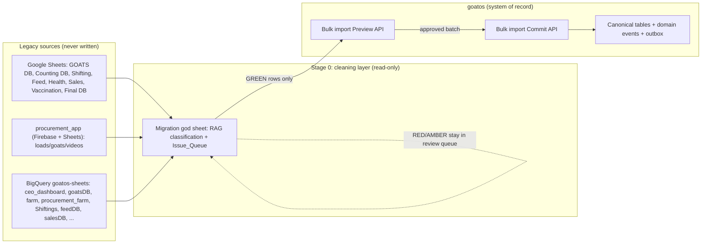
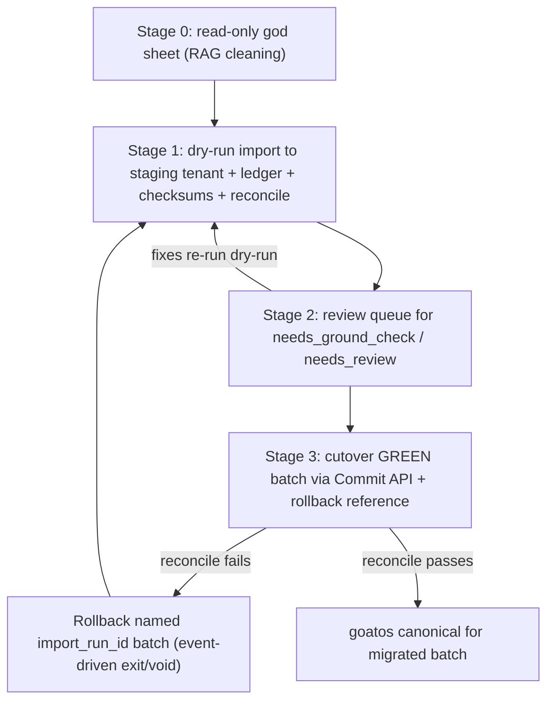

# Workstream 3 — Legacy-Data Migration Strategy & Scale Posture

Status: **design now, build deferred.** This is a **strategy / design document
only.** It specifies the migration strategy so it is ready when a goatos cutover
is explicitly approved. **No migration code — no importer, extractor, migration
job, SQL migration, or import-review UI — is authorized by this document.** No
such code may be written until the parked BigQuery migration/import-review track
is explicitly reopened by a product decision (see §8, hard-stop #1). This
document does **not** authorize building the migration pipeline now, and it does
**not** reopen the parked BigQuery migration/replay track. Every section below
is written as design/documentation of the eventual migration, not as work to
start today.

Last reviewed against: `README.md` ("Current Focus" = Vaccination Process
Integrity; parked BigQuery track), `docs/decisions/operational-kernel-5k-50k-scale-envelope.md`
(accepted envelope), `docs/decisions/one-million-postgres-readiness.md` (future
certification bar), `docs/runbooks/legacy-god-sheet-import-plan.md` (god-sheet
plan), `fixtures/google-dev-clean-slate/README.md` ("Future Migration" note),
`docs/decisions/scale-anti-patterns.md`, and the legacy audit taxonomy in
`../dashboard/docs/ceo-dashboard-data-quality-audit-plan.md`.

---

## 1. Overview

### Problem

goatos is the new Go + Postgres system of record. Legacy operational truth is
scattered across Google Sheets, Firebase (`procurement_app`), a legacy CEO
dashboard API, and BigQuery cleaned/dev tables under the `goatos-sheets`
project. Eventually the historical/current animal population and its lifecycle,
location, vaccination, procurement, health, and count evidence must be migrated
into goatos.

The user's core worry drives this design: **legacy data is not well maintained,
so seeding will miss edge cases.** The migration must therefore center on
edge-case detection and a data-quality classification discipline, not on a
happy-path bulk load. goatos deliberately enforces stricter identity, evidence,
idempotency, and vaccination-process requirements than the legacy dashboard, so
legacy rows cannot seed goatos directly.

### What this design covers

Migration principles, a source-to-canonical mapping approach, an edge-case
catalog with handling policy, a staged rollout tied to existing goatos tables
and commands, a reconciliation method to prove parity before cutover, and a
short scale-posture note confirming the 5k–50k envelope is kept.

### What this design deliberately does NOT do

- It does not rebuild a BigQuery-backed dashboard or import-review loop. The
  README parks that track: "current product work must not rebuild a
  BigQuery-backed dashboard or import-review loop unless the scope is explicitly
  reopened."
- It does not change the scale architecture. The 5k–50k envelope is an accepted
  ADR; 1M readiness stays a deferred certification bar.
- It does not write or schedule any importer, extractor, or migration job now.
  The god-sheet sync's live source extraction and goatos DB import remain the
  next (deferred) implementation slice, still gated behind RFID/DOB/sex/species/
  location cleanup.

### Existing scaffolding this strategy reuses (already in the repo)

The schema already anticipates a governed legacy import; the design leans on it
rather than inventing new structures:

- **Identity spine:** `goats` (with `display_id`, `lifecycle_status`,
  `identity_state` in {`clean`,`needs_review`,`disputed`,`merged`,`inactive`},
  `management_stage`, `custodian_party_id`, `current_location_id`) and
  `goat_identifiers` (types `old_tag`,`rfid`,`visual_tag`,`sheet_row_id`,
  `purchase_load_id`,`temp_field_id`,`external_system_id`; global active-RFID
  uniqueness index; scoped-active uniqueness for non-RFID types).
- **Legacy import ledger:** `legacy_import_runs` (dry_run flag, source hash,
  policy_version, created/updated/conflict/error counts) and
  `legacy_import_rows` (`source_row_key`, `source_row_version_hash`, `raw_payload`,
  `normalized_payload`, `processing_state` in {`pending`,`auto_linked`,
  `created_goat`,`needs_review`,`rejected`,`error`}, unique
  `(source_row_key, source_row_version_hash)`).
- **Import policy + identity policy:** `legacy_import_policies`,
  `identifier_policies`, `identifier_policy_versions` (source key recipe, hash
  recipe, field diff policy, auto-link policy, normalizer version).
- **Identity resolution + review:** `identity_match_candidates` (match score,
  reasons, state), `identity_conflicts`, `identity_decisions`,
  `legacy_status_mappings` (raw label → lifecycle/reproductive/growth/management
  stage/health/sex override, with `confidence` and `review_required`).
- **Location resolution:** `locations` (farm/park/shed/cohort/pen), `location_aliases`,
  the 1:1 profile extensions `farm_profiles` / `park_profiles` / `shed_profiles`
  (plus `animal_stage_lookup` and `shed_lifecycle_status_lookup`), and
  `location_operational_attributes` (the `usable_for_vaccination`, `usable_for_counts`,
  `is_holding`, `is_quarantine`, `is_icu` eligibility flags).
- **Domain source ledgers:** `count_source_import_runs` (typed Counts/Shifting
  import batch outcomes), `legacy_sync_runs` (dry_run/execute/nightly reconcile,
  domain, freshness, counter-check), `mortality_source_rows` (immutable source
  rows with payload hash + `row_status`).
- **Real import entrypoint (must be used):** the admin bulk import command pair
  `PreviewAdminGoatBulkImport` / `CommitAdminGoatBulkImport`
  (`backend/internal/identity/app/admin_goat.go`), surfaced through the admin-web
  "Import sheet" drawer (`apps/admin-web/features/counts/herd-register.tsx`).
- **God-sheet cleaning layer:** `backend/cmd/legacy-god-sheet-sync` and the
  `legacy-god-sheet-sync-dry-run` / `legacy-god-sheet-sync-apply` make targets,
  which create the migration/cleanup workbook (RED/AMBER/GREEN staging).
- **Edge-case fixture:** `fixtures/google-dev-clean-slate/invalid-goats.csv`
  already exercises missing DOB, future DOB (DOB after entry_date), non-existent
  shed, and unsupported stage, with expected row-level block reasons in
  `seed-ledger.json`.

---

## 2. Migration Principles

These are non-negotiable properties every migration stage must satisfy. They
align with the fixtures README "Future Migration" note (dry-run, checksums, row
ledger, rollback) and the god-sheet plan's import policy.

1. **Never write to legacy sources.** All extraction is read-only (viewer-scope
   service accounts). The god-sheet sync already forbids editing legacy source
   sheets and forbids direct Sheet→Postgres writes. Legacy stays authoritative
   until cutover is signed off; goatos never mutates it.
2. **Never bypass domain events.** Every animal enters goatos through the real
   bulk import Preview→Commit path so `goat.created` (and downstream obligation
   generation, audit, outbox) fire with real idempotency. No ad-hoc SQL inserts
   into `goats`/`goat_identifiers`. This is the explicit rule in the fixtures
   README step 7 and the god-sheet plan's "Import Policy".
3. **Dry-run first.** Every run is executable in `dry_run` mode
   (`legacy_import_runs.dry_run`, `legacy_sync_runs.mode='dry_run'`,
   `count_source_import_runs.mode='dry_run'`) and produces a full plan (rows
   read / planned / would-create / would-update / conflicts) with zero writes
   before any `execute`.
4. **Idempotent + replay-safe.** Re-running an import must not duplicate animals
   or events. Idempotency is anchored on `legacy_import_rows` unique
   `(source_row_key, source_row_version_hash)`, the identifier uniqueness indexes,
   and the bulk import command's idempotency key. Re-import of an unchanged
   source row is a no-op; a changed row (new hash) is a new reviewable version.
5. **Checksums at every boundary.** Each source row carries a content hash
   (`source_row_version_hash`, mirrored by god-sheet `source_row_hash` and
   `mortality_source_rows.payload_hash`). Same-key hash change across runs raises
   a `business_date_row_hash_drift` finding before the new value is trusted —
   this catches BigQuery tables (e.g. `farm.daily_summary_dev`) that recompute a
   `business_date` row in place with no `updated_at`.
6. **Row-level ledger.** Every source row's journey is recorded: raw payload,
   normalized payload, decision, matched goat, processing_state, and error
   reason live in `legacy_import_rows`; batch outcomes in `legacy_import_runs`.
   Nothing is imported without a durable row-level audit trail.
7. **Rollback reference.** Before any `execute` cutover, capture the pre-import
   goatos state reference (schema tag + baseline counts + the set of
   `import_run_id`s in the batch) so a batch can be identified and reversed. A
   goatos-side reversal removes only the rows created by a named `import_run_id`
   and is itself event-driven (exit/void), never a raw delete.
8. **Classification before change.** No mismatch triggers an automatic write
   unless a deterministic, allowlisted fix exists and validation passes. This is
   the audit plan's core rule and it governs the edge-case policy below.
9. **Aggregate evidence never closes a row.** Dashboard/BQ aggregate rows
   (`farm.daily_summary_dev`, `counting_db_with_holding_dev`) validate totals but
   carry no animal identifier, so they can detect gaps but must never be used as
   the row-level join source for canonical animals.

---

## 3. Source → Canonical Mapping Approach

Mapping is per legacy family → goatos entity, always through the god-sheet
canonical staging tabs (which use goatos canonical field names) and then the
bulk import API. Raw legacy column names are stored as provenance only.

### 3.1 Source families → goatos entities

| Legacy source (sheet / BQ) | Grain | goatos target | Mapping notes |
| --- | --- | --- | --- |
| GOATS DB `DB` tab / `goatsDB.goats_db_clean` | goat-level lifecycle events (birth/death/sale/purchase/abortion/shifting) | `goats` identity spine + `goat_location_history` + lifecycle status | Build the "active spine" = latest event per animal key with terminal-event priority (Death/Sale/Abortion exclude); DOB from Birth-event `date` only. |
| RFID source-of-truth `Combined` tab; fallback `goatsDB.goatsDB_rfid_mapping`, `farm_goat_id_mapping` | animal identifier | `goat_identifiers` (`rfid` = Animal ID 1, `old_tag`/`visual_tag` = Animal ID 2) | Identity resolution spine — see 3.2. |
| Counting DB `DB` + `FutureDB` tabs / `counting_db_with_holding_dev` | daily headcount per farm/shed/breed/stage with shed_tag codes | `count_source_import_runs` → canonical count anchors + `shifting_events`; aggregate reconciliation only | Aggregate; never seeds animal rows. shed_tag codes → stage (see 3.3). |
| Shifting Reports / `Shiftings.shiftings_fact`, `cbe/cpt_kids_current_stage_days` | movement/stage events | `goat_location_history` + `management_stage` transitions | "Completed" definition from audit plan; latest completed shifting wins current location. |
| Procurement DB + `procurement_app` (Firebase loads/goats/videos) / `procurement_farm.*` | load → animal intake | `Procurement_Source_Entry` staging → `goats` with `origin_type='procured'` | Identity-grain must be resolved first (see 3.2); videos → proof/evidence refs. |
| Health DB / `healthDB.health_db_clean_dev` | treatment/diagnosis events | health event history + `health_status` | Animal-level; requires resolved identifier. |
| Sales DB / `salesDB.salesDB_clean` | sale events | terminal lifecycle (`sold`) + sale event history | Terminal events exclude animals from active import. |
| Vaccination source / `ceo_dashboard.vaccination_external_table` | shed/count-grained vaccination rows (no animal id) | `untrusted_legacy_note` context only | MUST NOT seed animal-level vaccination history and MUST NOT suppress due work. |
| Feed Directions Automation DB / `feedDB.*`, `feed_directions` | shed-level feed directions | feed-direction operational tables (out of animal-identity scope) | Reconciliation/operational only; not part of animal seed. |
| Consolidated Final DB | reconciled current view | aggregate reconciliation target | Treated as aggregate evidence, not a row-level source. |

### 3.2 Identity resolution (old tag / RFID → canonical goat_id)

The hardest and highest-risk mapping. Approach:

1. **Normalize** every candidate identifier (RFID, old tag, visual tag) via the
   policy's `normalizer_version` and record raw + normalized in the god-sheet
   `Mapping_Crosswalks` tab.
2. **Resolve canonical identifier.** `animal_identifier_1` = trusted RFID from
   the `Combined` source-of-truth tab (or validated old/new-tag column when it is
   a real RFID/tag value). Legacy `goat_id`/`farm_goat_id`/`inp_goat_id` and
   location tags such as `dst_tag` are crosswalk/provenance inputs only — never a
   canonical identifier and never a demo-only provisional identifier.
3. **Match to existing goats** through `identity_match_candidates` (match score +
   reasons). Auto-link only when the identifier policy's `auto_link_policy`
   allows and uniqueness passes; otherwise emit `needs_review`.
4. **Enforce uniqueness** via the existing `goat_identifiers` indexes: global
   active-RFID uniqueness, scoped active uniqueness for non-RFID types. A reused
   fallen/retired tag is dirty data: record it as `retired`/`disputed`/
   `duplicate` in identifier history for the original animal and never assign it
   to a different animal.
5. **Map lifecycle/management labels** through `legacy_status_mappings`
   (`source_system` + `normalized_raw_label` → `lifecycle_status`,
   `reproductive_status`, `growth_cohort_tag`, `management_stage`, `health_status`,
   `sex_override`, with `confidence` and `review_required`). Low-confidence or
   `review_required=true` labels route to the review queue instead of auto-mapping.

### 3.3 shed_tag lifecycle codes → management_stage / lifecycle_status

Counting DB / Shiftings carry shed_tag lifecycle codes (K0–K4, F0–F2, plus
Milking, Mother, ICU, Quarantine). These are **stage/location semantics, not
animal identifiers.** They map through `legacy_status_mappings` +
`shed_profiles` / `location_operational_attributes`:

- `K0`–`K4`, `F0`–`F2` → `growth_cohort_tag` / `management_stage` (growth stage
  progression). Today the identity seed carries `legacy_status_mappings` rows for
  `Fattening`→`F2`, `F2-Male`/`F2-Female`→`F2` (review-required, contaminated sex
  evidence), `ICU-Non-Pregnant`, `M0`→`m0_post_delivery`, and `Warmup`; the
  canonical stage vocabulary itself (`K0`–`K3`, `F2`, plus reproductive/health
  axes) is seeded in `status_definitions`. The same pattern extends to the
  remaining shed_tag codes with an approved `legacy_status_mappings` row each.
- `Milking` / `Mother` → `reproductive_status` (`milking` / `mother`) plus stage.
- `ICU` → `health_status='icu'` + a shed flagged non-vaccination-usable
  (`location_operational_attributes.is_icu` / `usable_for_vaccination=false`) /
  defer.
- `Quarantine` → quarantine shed (`location_operational_attributes.is_quarantine`,
  vaccination defer).
- Every shed_tag also resolves a **location** via `shed_profiles` /
  `location_aliases` (shed→park→farm), and the
  `location_operational_attributes` flags (`usable_for_vaccination`,
  `usable_for_counts`, `is_holding`, `is_quarantine`, `is_icu`) gate downstream
  eligibility.

Unmapped or ambiguous codes are RED until an approved `legacy_status_mappings`
row (and, for stages, an `animal_stage_lookup` entry) exists.

---

## 4. Edge-Case Catalog & Handling Policy

This is the heart of the design. Every mismatch is **detected**, **classified**,
and **routed** (quarantine / auto-map / manual-review-queue), then surfaced to a
human. Classification reuses the legacy audit taxonomy
(`../dashboard/docs/ceo-dashboard-data-quality-audit-plan.md`):

- `software_pipeline_fixable` → data/dev owner (deterministic allowlisted fix;
  source already has clear evidence, cleaned/dashboard layer is stale).
- `source_sheet_correction_needed` → source-sheet owner (sources disagree; one
  trusted source shows another is missing/stale).
- `needs_ground_check` → ground/source operations owner (only aggregate/
  incomplete evidence; animals cannot be identified; sources disagree with no
  proof).
- `business_definition_mismatch` → metric/business owner + data/dev (two numbers
  look related but are not the same metric).

**Routing semantics:**
- **auto-map** — only for `software_pipeline_fixable` with a deterministic
  allowlisted transform that passes validation (e.g. approved shed_tag→stage
  mapping, normalized identifier match above policy threshold).
- **quarantine** — row is blocked from import and parked with its reason
  (`legacy_import_rows.processing_state='rejected'` / god-sheet RED); it is not
  imported and does not silently become truth.
- **manual-review-queue** — row needs a human decision
  (`processing_state='needs_review'`, `identity_match_candidates.state='needs_review'`,
  god-sheet `Issue_Queue` row with owner/next_action/SLA).

Surfacing: at design time the human surface is the **god-sheet Issue_Queue**
(RED/AMBER/GREEN with owner, evidence, next action). The eventual in-product
surface is an **import-review UI** reading `legacy_import_rows` +
`identity_match_candidates` + `identity_conflicts` — reintroduced only if the
parked import-review track is reopened (see §7). No import-review UI is built now.

| # | Edge case | Detection | Classification | Route | Human surface |
| --- | --- | --- | --- | --- | --- |
| 1 | Missing DOB (active animal, no Birth-event `date`) | Preview validation: `dob` required; god-sheet `dob_evidence_or_approved_estimate` rule | `needs_ground_check` (or `source_sheet_correction_needed` if a Birth row exists but is unsynced) | quarantine until approved estimated-DOB policy + evidence | Issue_Queue RED; import preview blocks row (matches `invalid-goats.csv` probe `missing_dob`) |
| 2 | Invalid DOB — DOB after entry_date / future DOB | Preview rule: `dob <= entry_date` and not in future | `software_pipeline_fixable` if transposition provable, else `source_sheet_correction_needed` | quarantine; auto-map only if deterministic correction | Issue_Queue RED (matches probe `bad_dob`) |
| 3 | `birth_time` misused as DOB | Rule `birth_time_not_dob`: time-of-day never satisfies DOB | `source_sheet_correction_needed` | quarantine DOB evidence; store birth_time as provenance | Issue_Queue RED |
| 4 | Positional-column drift (headers shifted / renamed) | Schema/header hash mismatch vs `Source_Catalog.last_schema_hash` | `software_pipeline_fixable` (parser) or `source_sheet_correction_needed` | quarantine whole source (`source_schema_or_access` RED) before any row preview | Issue_Queue RED, blocks the source, no partial import |
| 5 | Duplicate goat ID across farms | Identity-grain audit: distinct counts by `farm_goat_id` vs global `goat_id` vs `inp_goat_id`; `farm_goat_id_mapping` collapse | `needs_ground_check` (canonical grain undecided) or `software_pipeline_fixable` (retag mapping known) | manual-review-queue via `identity_match_candidates`; auto-collapse only with approved mapping | Issue_Queue + identity match review; `procurement_identity_grain_resolved` gate |
| 6 | Same goat active in two stages | Relationship check: no duplicate goat in two active stages (needs global identity) | `needs_ground_check` if only aggregate; `software_pipeline_fixable` if latest completed shifting resolves it | manual-review-queue; auto-resolve to latest completed stage when goat-level evidence exists | Issue_Queue; stage-conflict finding |
| 7 | Goat active in one source, dead/sold in another | Cross-source lifecycle compare (spine vs Sales/Death/Counting) | `source_sheet_correction_needed` or `needs_ground_check` | quarantine from active import (RED blocker) | Issue_Queue RED |
| 8 | Zero-feed positive-count / positive-count zero-feed | Feed operational integrity gate: positive-count non-experiment direction with zero feed | `business_definition_mismatch` or `needs_ground_check` | manual-review-queue (operational, not an animal-seed blocker) | Feed Direction integrity Slack/Issue section |
| 9 | Orphan sheds (shed referenced, not in Location_Profile) | Location resolution: shed→park mapping missing | `source_sheet_correction_needed` | quarantine affected animals (`current_location_status_resolved` RED) | Issue_Queue RED; location profile coverage check |
| 10 | Count snapshot present but zero populated values | Feed gate: latest DB snapshot has no populated counts | `needs_ground_check` | skip DB→FutureDB comparison; do not treat every FutureDB shed as a confirmed change | Issue_Queue; snapshot-incomplete finding |
| 11 | Malformed numerics coerced to 0 | Type/normalization validation on numeric fields (weight, count) | `software_pipeline_fixable` (parse) or `source_sheet_correction_needed` | quarantine value; never silently import 0 as truth | Issue_Queue; per-field finding |
| 12 | Same-key row hash drift (BQ recompute in place) | `business_date_row_hash_drift`: hash change for same `(source_id,business_date,grain,source_row_id)` | `software_pipeline_fixable` (intentional refresh) or `needs_ground_check` | quarantine new value until refresh confirmed | Issue_Queue; drift finding before trust |
| 13 | Missing / non-RFID identifier | `raw_source_row_has_identifier`, `animal_identifier_1_present` | `needs_ground_check` | quarantine (one RED per source row); no provisional ID from legacy `goat_id` | Issue_Queue RED |
| 14 | Reused / fallen / retired tag | `animal_identifier_uniqueness` vs `goat_identifiers` indexes + history | `source_sheet_correction_needed` / `needs_ground_check` | quarantine; record retired/disputed on original animal, never reassign | Issue_Queue + identifier history |
| 15 | Missing species / sex | `species_evidence_present`, `sex_evidence_present` (crosswalk + native gender) | `needs_ground_check` (blank) or `business_definition_mismatch` (taxonomy) | quarantine; auto-map only via approved `Species_Taxonomy_Crosswalk` | Issue_Queue RED |
| 16 | Unsupported management stage | Preview: stage not active in `animal_stage_lookup`; unmapped shed_tag code | `source_sheet_correction_needed` | quarantine (matches probe `unsupported_stage`) | Issue_Queue RED; import preview blocks row |
| 17 | Non-existent / non-resolving shed on import | Preview: `shed_code` does not resolve | `source_sheet_correction_needed` | quarantine (matches probe `invalid_shed`) | Import preview blocks row |
| 18 | Vendor/legacy vaccination note suppressing due work | `vaccination_legacy_count_not_suppressing_due` | `business_definition_mismatch` | store as `untrusted_legacy_note`; never suppress goatos due work | Vaccination_Due_View keeps due row honest |
| 19 | Procurement vs GOATS DB purchase count mismatch | `procurement_identity_grain_resolved`; identity-grain audit | `needs_ground_check` until canonical grain chosen | manual-review-queue; do not import affected animals | Procurement_Load_Reconciliation + Issue_Queue |
| 20 | Fattening vs shifting stage-source mismatch | `fattening_shiftings_stage_parity` by farm/stage | `business_definition_mismatch` or `needs_ground_check` | manual-review-queue (non-blocking unless attributable to an import row) | Fattening_Shifting_Reconciliation |
| 21 | Stale source past freshness SLA | `source_stale_past_sla` vs watermark | `needs_ground_check` / `source_sheet_correction_needed` | quarantine dependent rows | Issue_Queue RED |

---

## 5. Staged Rollout

Each stage maps to existing goatos tables/commands. Stages are sequential; each
gates the next. **No stage is executed now, and nothing in this section is a
task to start today** — it describes the intended shape of each stage for when a
reopen decision (§8) authorizes the build. The verbs below describe what a stage
*would* do once authorized, not work in flight.

### Stage 0 — Cleaning layer (read-only god sheet) — [foundation]

- The stage would build/refresh the migration god sheet via
  `legacy-god-sheet-sync-dry-run` then `legacy-god-sheet-sync-apply`
  (`backend/cmd/legacy-god-sheet-sync`), which creates managed tabs
  (Source_Catalog, Sync_Runs, Raw_Source_Snapshots, Mapping_Crosswalks,
  Animal_Master, Validation_Rules, Issue_Queue, Import_Batches, domain/history
  tabs) and is idempotent (never clears human/data tabs).
- Extraction from Sheets/Drive/BigQuery is read-only; raw snapshots are immutable
  with `run_id` + `source_row_hash`; validation rules and RED/AMBER/GREEN are
  recomputed each run.
- **Exit gate:** Drive/Sheets RFID source (`Combined` tab) readable; schema/header
  hashes stable; no `source_schema_or_access` RED; identity-grain decisions
  recorded in `Identity_Grain_Audit`.

### Stage 1 — Dry-run import into a staging tenant — [after Stage 0]

- For GREEN rows only, the stage would call the bulk import Preview API
  (`PreviewAdminGoatBulkImport`) against a **staging tenant**, writing a
  `legacy_import_runs` row with `dry_run=true` and per-row `legacy_import_rows`
  with `raw_payload` + `normalized_payload` + `source_row_version_hash`.
- Counts/Shifting would go through `count_source_import_runs` in `mode='dry_run'`;
  identity spine through `legacy_sync_runs` `mode='dry_run'`.
- Checksums and reconciliation (§6) run against legacy totals. Nothing is written
  to canonical `goats`.
- **Exit gate:** dry-run reconciliation within tolerance; zero unexpected RED;
  every planned create/update/conflict explained.

### Stage 2 — Review queue for `needs_ground_check` rows — [after Stage 1]

- Rows classified `needs_ground_check` / `needs_review` would sit in the queue
  (`legacy_import_rows.processing_state='needs_review'`,
  `identity_match_candidates.state='needs_review'`, god-sheet Issue_Queue with
  owner + SLA), resolved by ground/source teams in the god sheet (or the reopened
  import-review UI, if approved).
- The Stage 1 dry-run would be re-run after fixes (idempotent; changed rows get a
  new hash).
- **Exit gate:** all blocking RED resolved or explicitly deferred; AMBER rows
  each covered by an approved temporary migration rule (e.g. optional
  `animal_identifier_2` during double-tag rollout).

### Stage 3 — Cutover with rollback — [after Stage 2]

- A rollback reference would be captured first: goatos schema tag + baseline
  reconciliation counts + the set of `import_run_id`s in the batch.
- The approved GREEN batch would then be committed through
  `CommitAdminGoatBulkImport` with an idempotency key, firing `goat.created` +
  downstream events, recording goatos IDs back into the god-sheet
  `Import_Batches` and `Animal_Master.goat_os_animal_id`.
- Post-cutover reconciliation (§6) must pass before goatos is declared canonical.
- **Rollback:** if reconciliation fails, only the named `import_run_id` batch is
  reversed via event-driven exit/void (never raw delete); legacy remains
  authoritative until a clean cutover passes.

---

## 6. Reconciliation

Goal: **prove migrated Postgres totals match legacy dashboard/BQ totals before
cutover.** Reuse the audit's relationship and additive checks; declare the
comparison rule before comparing numbers (a visible mismatch is not evidence by
itself). Aggregate dashboard rows are targets/gap-detectors, never row-level
join sources.

Reconciliation dimensions and checks:

1. **Counts by farm / stage / breed.** goatos canonical count (from imported
   `goats` grouped by farm/park/shed, `management_stage`/`growth_cohort_tag`,
   breed) vs legacy `farm.daily_summary_dev` / `counting_db_with_holding_dev` for
   the same business date. Deltas recorded per dimension in god-sheet
   `Counts_Snapshots`, non-zero deltas open Issue_Queue rows.
2. **Active-spine vs dashboard active.** Event-spine active candidates
   (latest-event, terminal-event exclusion) vs canonical dashboard active total;
   `event_spine_dashboard_delta` recorded; gap stays open until
   `Current_Location_Status` decides source-of-truth priority. Treat as
   bidirectional (includes breed/species vocabulary mismatch).
3. **Additive / relationship checks** (from the audit plan): CBE + CPT + other =
   total (when declared additive); kid + adult = total; stage counts = total
   kids; top card = drilldown for same period; no duplicate goat in two active
   stages; percentage/share near 100% within declared tolerance; weighted
   averages recomputed from numerator/denominator.
4. **Identity-grain reconciliation.** Distinct counts at each candidate grain
   (`farm_goat_id`, global `goat_id`, `inp_goat_id`, coalesced) must be decided
   before treating procurement/GOATS DB purchase deltas as import blockers.
5. **Checksum reconciliation.** Every imported `legacy_import_rows` row hash
   matches its source snapshot hash; any drift (`business_date_row_hash_drift`)
   blocks trust.
6. **Freshness reconciliation.** Source watermark within SLA for its family;
   stale source blocks dependent rows.

Pass condition for cutover: all declared additive/relationship checks pass or
carry an explicit, owned exception; per-dimension count deltas are zero or
explained; identity-grain decision recorded; no open blocking RED for the batch.

---

## 7. Scale-Posture Note

**Decision: keep the 5k–50k envelope. No scale-architecture work now.**

- The accepted ADR (`operational-kernel-5k-50k-scale-envelope.md`) makes
  5,000-today / up-to-50,000-within-a-year the current release target. 1M
  topology is future work, not a present release requirement.
- **1M readiness is a deferred certification bar**, not a build item. The
  `one-million-postgres-readiness.md` contract is "accepted readiness contract;
  implementation and certification remain open." Goat OS is explicitly **not**
  1M-certified, and certification requires the committed
  `goatos-stg-1m-benchmark-v1` Cloud SQL profile and the High-Scale Kernel
  Validation Plan thresholds. Migration work does not trigger it.

**Why the 1M door stays open with no work now.** The existing disciplines keep
the shape survivable at higher scale without changing the architecture:

- **Compute-on-write, not compute-on-read.** `scale-anti-patterns.md` bans
  compute-on-read god CTEs on request paths and enforces it mechanically via
  `make scale-guard`. Reads are canonical, indexed, and bounded.
- **RANGE partitioning by time key** on append-only history
  (`goat_identity_events`, `audit_log`, `obligation_status_events`), with
  partition/retention decisions driven by table behavior, not row count. Migration
  writes history through the same partitioned parents.
- **Transactional outbox + Pub/Sub** retained deliberately (even though relay +
  consumer share one worker at this envelope) so the event contract and
  at-least-once/DLQ semantics stay stable for a future multi-worker extraction.
  Migration imports flow through these same events.
- **Keyset pagination** for list reads (~20 rows), bounded regardless of herd
  size; summary aggregates are indexed scans (the first extraction candidate).
- **Query-plan gates** proven at the ~500k obligation-row envelope upper bound;
  the indexing contract requires real planner proof on scaled data before any 1M
  claim.
- **Idempotency + row ledgers** (`legacy_import_rows`, idempotency keys) already
  carry replay-safety windows and retention hooks.

Migration therefore rides the existing scale envelope: imports are batched,
idempotent, tenant-scoped, and event-driven, so they do not change the scale
posture. The row-level ledger tables must declare their retention/replay window
(the 1M-readiness partitioning contract lists "idempotency and run ledgers" as a
P1 reconcile item) but this is a lifecycle-policy note, not scale work now.

**What would trigger reopening 1M readiness** (none of which is expected during
migration design):
- animal count approaching ~50,000 (upper bound of the current envelope), or
- open-obligation / daily-obligation counts approaching the ~500k envelope
  ceiling proven by the query-plan gates, or
- a single read/stage's measured p95, backlog age, or DB pressure crossing the
  extraction thresholds in the ADR's "When the architecture may scale out"
  ladder.
At that point the ADR's step-by-step ladder (repair plans → reduce scans → tune
batch/cadence → add one narrow projection → extract one stage → add
partition/queue/service per measured hotspot) applies — not a jump back to the
old topology.

---

## 8. Prerequisites / Decisions That Require Reopening the Parked Track

Per the README, the BigQuery migration/replay + import-review track is
**parked** and "current product work must not rebuild a BigQuery-backed
dashboard or import-review loop unless the scope is explicitly reopened." This
design is documentation only. Before **any** build begins, the following must be
explicitly decided/approved (they are the hard stops):

1. **Reopen decision.** An explicit product decision to reopen the parked
   migration/import-review track. Until then, no importer, extractor, migration
   job, or import-review UI is built. (Blocking — owner: product.)
2. **Drive/Sheets read credential.** A service account or OAuth credential with
   Drive + Sheets read scopes for the RFID source-of-truth `Combined` tab and
   fallback mappings, plus Apps Script / native-table loader lineage for
   `*_clean` / `*_dev` BigQuery tables. Animal-level import is hard-blocked
   without it. (Blocking — owner: data/dev + platform.)
3. **Canonical identity-grain decision.** Choose the canonical animal identity
   grain (`farm_goat_id` vs global `goat_id` vs `inp_goat_id` vs coalesced) before
   treating procurement/GOATS DB deltas as row-level blockers. Expensive to
   change after import. (Blocking — owner: data/dev + business.)
4. **Estimated-DOB and sex-backfill policies.** Approve the narrow
   `dob_estimated=true` policy (age class + event date + owner approval) and the
   sex-backfill precedence, since these gate GREEN promotion for
   purchase-origin/no-Birth animals. (Blocking — owner: business + ground/source.)
5. **shed_tag → stage/status mapping completion.** Approve `legacy_status_mappings`
   rows for the full code set (K0–K4, F0–F2, Milking, Mother, ICU, Quarantine) and
   matching `animal_stage_lookup` entries. Today only a partial set of
   `legacy_status_mappings` rows is seeded (`Fattening`, `F2-Male`, `F2-Female`,
   `ICU-Non-Pregnant`, `M0`, `Warmup`) and `animal_stage_lookup` carries no
   migration seed (it is tenant config data); the remaining codes need approved
   rows before GREEN promotion. (Blocking — owner: business + data/dev.)
6. **Double-RFID rollout state.** Confirm whether `animal_identifier_2` is still
   AMBER-optional or has become RED-required; this flips import validation.
   (Decision — owner: product.)
7. **Staging tenant + rollback tag policy.** Confirm the staging tenant used for
   dry-run import and the rollback reference (schema tag + baseline counts +
   `import_run_id` set) convention for cutover. (Decision — owner: platform.)
8. **Import-review surface.** Decide whether the human surface stays the god
   sheet or an in-product import-review UI is (re)built — the latter is exactly
   what the README parks, so it needs the reopen decision in item 1 and, if
   user-facing, a separate design pass. (Blocking for any UI — owner: product.)

None of these should be resolved by this planner picking a direction: they are
product/business decisions or require the explicit reopen. They are surfaced for
the main orchestrator to route to the user.
