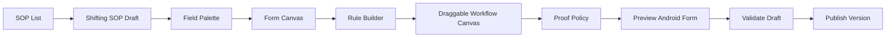
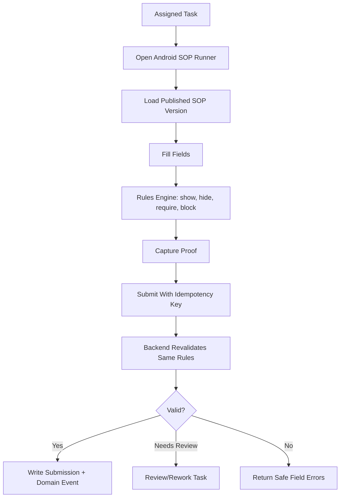

# Phase 2 PRD: SOP Forms, Task Engine, And Shifting

Status: draft for review.

## Summary

Phase 2 turns Goat OS from a trusted goat identity and review system into a
field-work execution system.

The first production workflow is the Shifting SOP because it is daily, simple
enough to prove the engine, and directly depends on the Phase 1 goat passport
and current-location foundation.

In short:

```text
Admin configures a versioned SOP.
Goat OS creates or exposes tasks.
Operator fills the SOP on Android.
Backend validates and applies the domain event.
Proof, audit, task status, and dashboard state update from Goat OS truth.
Slack becomes notification or migration input only.
```

Phase 2 is not just "a shifting form." It is the reusable SOP/task foundation
that later absorbs vaccination, health diagnosis/follow-up, death, birth/
abortion, feed, proof verification, procurement, and farmer/crop workflows
currently scattered across Slack, Sheets, App Script, Val.town, and operator
memory.

## Project-Level End State

The full SOP replacement program has one final operating path:

```text
Admin SOP Builder
  -> published SOP version
  -> Android operator runner
  -> Goat OS app API
  -> backend validation, idempotency, proof, audit
  -> module-owned canonical command/event
  -> Postgres projections
  -> operational product dashboards and notifications
```

Governed/leadership analytics KPIs and AI read the Cube metric layer, not raw
Postgres. Operational product dashboards read Postgres projections only when the
KPI is dual-served and covered by the parity gate in
`docs/decisions/high-scale-dashboard-projections.md`, per
`context/analytics/final-analytics-infra.md`.

During migration, legacy BigQuery, Sheets, Slack, App Script, and Drive-backed
evidence may feed backend-owned sync/reconciliation jobs. They are temporary
inputs and parity oracles. The final product must rely on backend DB facts
created by Android SOP submissions and backend domain commands, not on a
runtime BigQuery/Sheets sync loop.

The practical business goal is:

```text
Whatever operators currently do through Slack SOPs, they should be able to do
through Goat OS Android tasks once the relevant SOP family is migrated.
```

Phase 2 proves this with Shifting and the reusable platform. Full retirement of
BQ/Sheets is gated by the cross-feature coverage checks in
`SOP-CLOSEOUT.md`, `docs/features/counts/`, `docs/features/locations/`, and
`docs/features/mortality/`.

Treat these as separate gates: Phase 2 platform acceptance, full legacy SOP
execution retirement, and per-section dashboard BQ/Sheets retirement. Passing
the Shifting platform gate must not be described as full SOP closeout or
canonical-only dashboard readiness.

Android SOP execution also depends on the Operator Management feature:
`docs/features/operator-management/PRD.md` and
`docs/features/operator-management/TRD.md`. Phase 2 needs only the minimum v1
slice: active operator profile, verified login, role/scope grant, capability,
device/session state, app bootstrap manifest, and dynamic task/SOP delivery.

## Layman Explanation

Today, many SOPs live as Slack messages, Slack modals, Apps Script code, Sheets,
and human follow-up.

Phase 2 turns that into a product:

```text
Admin builds the SOP once.
Goat OS creates tasks from it.
Operators fill it on Android.
The form changes itself based on the rules.
Backend checks the same rules again.
Only approved, valid submissions update goat truth.
```

Think of this like a Jira/workflow-builder style system for goat operations:

- the admin defines fields
- the admin defines required/conditional logic
- the admin defines approval steps
- the admin defines proof rules
- the admin publishes a version
- operators only see the exact fields/actions allowed for their task
- the backend refuses submissions that do not match the published rules

The first SOP is Shifting because it is used daily and is simple enough to prove
the whole loop: move goat from one shed/location to another, capture proof, and
update the goat passport location history.

## What We Are Building Compared To Slack SOPs

Current Slack/App Script style:

```text
Slack button or workflow opens form
script reads hardcoded options or Sheets
operator submits fields
script writes a Sheet row
Slack thread/list item tracks status
someone checks proof manually
later someone reconciles goat/location truth
```

Goat OS Phase 2 style:

```text
Admin publishes versioned SOP
Goat OS creates assigned task
operator fills native Android form
rules show/hide/require/block fields live
media proof is captured through Goat OS
backend revalidates everything
approval/verification changes task state
domain module writes canonical goat event
audit/outbox/analytics update automatically
```

We are not copying every Slack automation into a new one-off screen. We are
building the common SOP builder, task engine, Android runner, proof system, and
backend validator from scratch, then migrating each existing SOP onto it.

Business behavior is reused from Slack scripts. Product architecture is new.

## Advantages Over Slack SOPs

What Goat OS gains:

- one standard way to build SOPs instead of Slack/API/Workflow Builder/App Script
  variations
- versioned SOPs, so old submissions can always be interpreted against the exact
  form/rules used at that time
- conditional logic that is visible, testable, and reusable instead of buried in
  script code
- Android-native execution for operators, including offline drafts and retry
- backend revalidation, so a bad client or stale mobile cache cannot corrupt goat
  truth
- dynamic options from Goat OS data, not hardcoded Slack dropdowns
- proof policy tied to task/submission/goat, not floating Slack/Drive links
- approval/rework paths that are part of the workflow, not manual follow-up
- per-goat results inside batch submissions
- audit, outbox events, analytics, and dashboards from the same command path

Complex workflows this unlocks:

- "If category is Health, require supervisor approval and proof video."
- "If the goat is not currently in the source shed, require an exception reason."
- "If destination shed is inactive or full, block submission."
- "If one goat in a batch is invalid, accept valid goats and route invalid goats
  to review."
- "If proof is rejected, create rework for the same task without losing the
  original submission."
- "If operator is offline, save draft and replay safely with idempotency."

## Simple Example Run

Example: park head wants to shift goats `G-101` and `G-102` from `K1 Shed A` to
`K1 Shed B`.

```text
1. Admin has already published Shifting SOP v1.
2. Park head creates a Shifting Direction task.
3. Goat OS calculates due time:
   high priority -> today
   low priority health/delivery -> tomorrow
   other low priority before 13:30 IST -> tomorrow
   other low priority after 13:30 IST -> day after tomorrow
4. Operator sees the assigned task on Android.
5. Operator scans/selects G-101 and G-102.
6. Form asks source shed and destination shed.
7. If the source shed does not match Goat OS current location, the form requires
   an exception reason.
8. Operator records destination count and captures video proof showing the goats
   in the destination shed.
9. Operator submits.
10. Backend rechecks the published SOP version, goat identity, current location,
    destination validity, proof requirement, permissions, and idempotency.
11. Valid goats become accepted submission items.
12. Park head or central verifier approves proof if policy requires it.
13. Movement/location domain writes one movement event per goat.
14. Goat passport now shows the new current location and movement history.
15. Slack/WhatsApp/FCM can receive a notification, but Slack is not truth.
```

If `G-101` is valid but `G-102` is already sold/dead/merged/quarantined, the
batch does not silently corrupt data. Goat OS can accept `G-101`, block or route
`G-102` to review, and show the operator/verifier exactly what happened.

## Builder And Runner Visualization

The Jira-style workflow builder experience is a product requirement inside the
existing Goat OS admin dashboard.

That does not mean copying Jira's UI literally. It means admins should create
SOPs through a visual builder, not by editing raw JSON, code, Sheets, or hidden
config files.

The dashboard must have an SOP Builder section where admins can build and
understand the workflow visually:

```text
field palette -> form canvas -> rule builder -> workflow canvas -> Android
preview -> validate -> publish version
```

Admin should be able to visually compose:

```text
form sections
fields
conditional rules
approval states
assignees or role/scope rules
proof requirements
rework paths
publish/retire version lifecycle
```

The workflow canvas must support draggable/linkable blocks for the business
flow, for example:

```text
Start -> Request Approval -> Assigned To Operator -> Operator Fills Form ->
Proof Required -> Park Head Verification -> Central Verification ->
Accepted Movement Event

Rejected Proof -> Rework Requested -> Operator Re-submits
Blocked Goat -> Review Queue
```

The first Phase 2 builder does not need every advanced no-code feature, but it
must already feel like a real product workflow builder: visually appealing,
draggable where the workflow needs links, clear validation errors, Android
preview, version publish, and a visible flow of what happens after submission.

Preview is mandatory while building, not only after saving. Admin must be able
to play with the SOP before publishing:

```text
change field answers
switch category/priority/type
select sample goats
select source/destination sheds
simulate missing proof
simulate supervisor approval/rejection
simulate verifier approval/rework
see which fields become visible/required/blocked
see the exact Android operator form preview
see the workflow path and final task/submission outcome
```

Draft SOPs cannot be published until validation and preview checks pass for the
required test scenarios.

Admin builder view:



Operator execution view:



Local source-material SOP visualization was reviewed, but the raw playground
HTML is not committed as product truth. The useful product intent is a
catalog-driven SOP builder with custom draft creation, field palette, field
editor, rule builder, workflow pattern/canvas, Android preview, scenario
simulator, proof state, validate, and publish.

## Builder Capabilities

Phase 2 builder must support enough capability to migrate real Slack SOPs:

- field types: text, number, date/time, select, multiselect, goat scan, RFID
  scan, goat lookup, shed/location picker, photo proof, video proof
- media/proof types from legacy SOPs: photo, video, generic file attachment,
  original proof, rectified proof, verifier proof, and proof metadata such as
  captured time, uploaded time, subject, and operator
- dynamic option sources: active goats, parks, sheds, operators, movement
  reasons, health categories, proof subjects
- conditional visibility: show a field only when another answer matches
- conditional required rules: require video only for selected categories
- block rules: prevent submission when goat/location/status makes it unsafe
- visual workflow links: connect approvals, operator execution, proof
  verification, acceptance, rejection, and rework nodes
- live preview/simulator: test sample answers and see Android form state,
  validation errors, proof requirements, workflow path, and publish blockers
- approval gates: request needs supervisor authorization; direction may be
  pre-authorized
- repeat-for-each-goat: one task/submission can create per-goat item results
- calculated values: due date, scheduled date, expected verifier, task risk
- proof policy: per goat, per batch, per shed, photo/video, required before
  submit or before final approval
- rework/correction path: verifier can reject proof or ask operator to fix
- offline-safe submission: Android can draft/retry, backend remains authority

## Builder And Android Parallel Delivery

Admin builder and Android runner must be built in parallel against the same SOP
contract. The builder cannot invent behavior that the runner/backend cannot
execute, and the runner cannot hardcode behavior that the builder cannot
preview and validate.

Parallel tracks:

```text
Track A: backend + admin builder
  DSL schema
  draft/version APIs
  rule validation and dry-run
  workflow/proof policy configuration
  publish/retire lifecycle
  admin preview and task/proof review

Track B: Android operator execution
  verified login and app bootstrap
  assigned task list
  pinned SOP version download
  native form runner
  offline option cache
  draft and sync queue
  proof capture/upload intent
  idempotent submit and rework states
```

Both tracks meet at the backend API. The backend remains authority for
permissions, pinned version validation, live goat/location state, proof policy,
idempotency, audit, and domain-event creation.

## SOP Closure Cross-Check

The already-written Counts, Locations, and Mortality PRD/TRDs show what is still
missing before SOP replacement can close the legacy loop.

| Area | Already covered | Missing before close |
| --- | --- | --- |
| Locations | Canonical location tree, aliases, capacity, review, usage checks, projection invalidation. | Android option sources/offline caches must use Locations APIs; Shifting must write canonical movement/current-location events; SOP-submitted location labels must enter alias/review flow. |
| Counts | Projection contract, blend mode, coverage registry, dashboard parity, current active goats, farm/shed/status/breed/age/gender sections. | Count verification SOP, Shifting/location events, lifecycle changes, status/stage transitions, weight capture or policy, valuation facts, sale/inactive events, and canonical shadow parity per section. |
| Mortality | Event-based dashboard semantics, required `mortality_events`, Death SOP cutover model, proof/correction/idempotency. | Death SOP, post-mortem checklist, abortion/birth/litter event ownership, denominator projections, event-source coverage gate, death dedup keys, and canonical-vs-legacy shadow parity. |
| SOP platform | Shifting walking skeleton, DSL/rules/proof/task state requirements. | Complete DSL schema/evaluator, builder APIs/UI, Android app/client/offline queue, media upload intents, workflow state machine, source inventory, reusable template seeds, and domain commands. |
| Operator Management | Phase 1 has auth/RBAC grants and architecture has workforce rules. | Active operator roster, source submitter mapping, capabilities, scopes, shifts/absence, devices, app bootstrap manifest, and Android feature/task visibility gates. |

The detailed closeout checklist lives in:

```text
docs/phases/phase-02-sop-task-engine/SOP-CLOSEOUT.md
```

## Why This Phase Exists

Phase 1 answers:

```text
Which goat is this?
Where is the trusted passport and identity history?
```

Phase 2 answers:

```text
What work must happen today?
Who is responsible?
What form/proof must they submit?
Did Goat OS validate it?
What canonical goat event did it create?
Who approved or rejected it?
```

Current Slack/App Script workflows already encode useful operating knowledge,
but they are not a safe product foundation:

- fields and conditions are spread across code, Sheets, Slack modals, and
  Workflow Builder style flows
- Slack/App Script writes to Sheets directly
- options are hardcoded or read from legacy sheets
- proof lives in Slack/Drive links instead of governed media records
- retries and corrections depend on ad hoc row edits
- conditional logic is imperative code instead of versioned deterministic rules
- mobile/offline execution is not native

Goat OS must preserve the business behavior while replacing the implementation
with a backend-owned modular monolith, generated API clients, native Android
execution, audit, idempotency, proof policy, and domain events.

## Standardization Decision

All legacy Slack automations, App Script flows, Workflow Builder flows, and
Val.town scripts become discovery inputs for one Goat OS implementation
standard.

Every migrated SOP must be represented as:

```text
versioned SOP definition
task creation or task exposure rule
Android operator execution flow
backend validation
proof policy
domain command/effect
audit and outbox event
notification adapter where needed
```

This means Goat OS does not rebuild each Slack automation from scratch as a
one-off screen or script. It rebuilds the reusable SOP/task/proof runtime once,
then migrates each SOP onto that runtime.

## Legacy Evidence

Phase 2 starts from local legacy evidence, not memory. The committed source of
truth is this repo's phase/context documentation and sanitized field/rule
summaries. Private local legacy scripts may be consulted during implementation,
but they are discovery inputs, not build dependencies.

Repo-owned primary sources:

```text
context/forms/final-forms-sop-engine.md
docs/phases/phase-01-goat-passport/legacy-discovery-proposals.md
```

Private local evidence already distilled into this PRD/TRD includes legacy
Slack/App Script shifting, unified automation, health, feed, and video
verification scripts. If a future implementation needs behavior not summarized
here, add a sanitized repo-owned snapshot or extraction before relying on it.

Legacy Shifting fields already captured:

```text
farm
type: Shifting Request | Shifting Direction
category: Health | Growth | Breeding | Delivery
priority: Low | High
goat_ids
breed
source_shed
destination_shed
comments
post_shift_animal_count
scheduled_date
completed_date
approval_status
status
message/thread/list item metadata
video stage
```

Legacy Shifting rules already captured:

```text
Shifting Request needs authorization.
Shifting Direction is already authorized.
High priority is due same day.
Health or Delivery low-priority work is due next day.
Other low-priority work is due next day if raised before 13:30 IST, otherwise
day after tomorrow.
Proof is a video showing each shifted goat ID in the destination shed.
```

## Users

```text
Admin / operations owner
  configures SOP definitions, versions, rules, proof policy, and option sources

Park head / supervisor
  reviews requests, authorizes gated shifts, monitors open and overdue work

Operator
  sees assigned work on Android, scans/selects goats, fills forms, captures proof

Verifier / central reviewer
  reviews proof, rejects or approves, requests rework, and audits exceptions

CEO/internal admin
  sees operational state, task health, open review workload, and location truth
```

## Product Goals

- Build a reusable SOP definition and task execution foundation.
- Prove it with Shifting as the first end-to-end SOP.
- Preserve current Shifting behavior from Slack/App Script while removing Slack
  and Sheets as canonical truth.
- Establish the Android/backend submission path that later lets Counts,
  Locations, Mortality, and other dashboards stop depending on BQ/Sheets sync
  after coverage and shadow-parity gates pass.
- Support conditional fields, required rules, repeat-for-each-goat, proof
  requirements, approval gates, and server-side validation from day one.
- Make Android the operator execution surface.
- Use Operator Management v1 for login, app bootstrap, role/scope/capability
  gates, source-submitter review, device/session state, and task visibility.
- Make admin web the SOP configuration and review surface.
- Keep backend domain modules, not form definitions, responsible for canonical
  goat truth.
- Emit audit, decisions, outbox events, and analytics-friendly task/submission
  facts for every meaningful transition.

## Non-Goals

Phase 2 does not build every SOP.

Deferred after the Shifting walking skeleton:

- full health diagnosis/problem/treatment engine
- feed stock and feed-consumption domain model
- procurement replacement
- polished drag/drop form-field canvas editing. Phase 2 still requires
  draggable/linkable workflow state blocks for approvals, proof verification,
  rejection, rework, and blocked-review paths.
- AI-generated SOP authoring
- Slack as a canonical execution surface
- arbitrary JavaScript rules inside forms
- direct frontend reads from BigQuery, Sheets, Slack, Drive, Firestore, or
  Postgres

Vaccination remains a natural next SOP on the same engine, but the first
implementation target is Shifting because it is daily and validates current
location truth.

## Architecture Guarantees

Phase 2 follows the same non-negotiable Goat OS architecture invariants as
Phase 1:

```text
Go backend = modular monolith with strict module ownership.
Domain logic follows dependency inversion: it talks through ports/interfaces,
not vendor SDKs directly.
Adapters wrap replaceable tools: auth, storage, analytics, media, devices,
notifications, AI, form runners, legacy sources, and external APIs.
Adapter selection is wired in bootstrap/factory code, not scattered through
business logic.
Web/mobile clients use REST/JSON APIs described by OpenAPI and generated
clients.
Forms, submissions, events, decisions, DLQ repair payloads, and imports use JSON
Schema where payload compatibility matters.
Protobuf/gRPC is allowed only behind the app API boundary for real internal
high-volume workloads or future split services.
Browser and React Native clients must not use direct gRPC unless a new ADR
replaces the current protocol decision.
Every phase keeps idempotency, audit, outbox, RBAC scope, observability, and
load-test expectations explicit.
```

Important Phase 2 ownership rule:

```text
The SOP engine validates operational forms and creates submissions/tasks.
Domain modules apply canonical truth.
```

For Shifting:

```text
SOP submission validates form version and proof.
Movement/location domain applies the goat location event.
Identity remains goat passport owner.
Locations remain location reference owner.
Media/proof owns media metadata.
Notifications owns Slack/FCM/WhatsApp delivery adapters.
```

The SOP engine must not become a generic table writer that can mutate any goat
field from a form.

## Core Product Surface

### Admin Web SOP Configuration

Phase 2 admin web must support a practical first creator, not a polished canvas.

Required:

- list SOP definitions and versions
- create/edit a structured DSL draft for Shifting
- validate a draft before publish
- preview the Android runner view
- publish/retire a version
- configure proof policy
- configure option sources such as active parks, sheds, goats, and assignees
- inspect submitted Shifting tasks and proof status

The first creator may be a structured editor with typed fields/rules. Drag/drop
can come later as long as the DSL does not change.

### Operator Android SOP Runner

Phase 2 operator Android must support the Shifting walking skeleton:

- My Tasks
- task detail
- scan/select goat
- batch goat selection for repeat-for-each-goat
- dynamic from/to location pickers from offline cache
- required and conditional fields
- photo/video proof capture
- offline draft and retry queue
- submit status: pending sync, submitted, needs review, rejected, rework
- per-goat partial failure/retry when a batch contains invalid goats

### Task Engine

Phase 2 task states:

```text
draft
open
assigned
in_progress
submitted
needs_approval
needs_verification
approved
rejected
rework_requested
missed
canceled
voided
```

The first implementation may use a subset, but the state machine must not block
later proof and verification workflows.

### Shifting SOP V1

Minimum Shifting fields:

```text
shift_type: request | direction
category: health | growth | breeding | delivery | routine | other
priority: low | high
goats: repeat_for_each_goat via goat_scan/goat_lookup
source_location: park/shed/partition
destination_location: park/shed/partition
scheduled_at
performed_at
performed_by
comments
destination_count
proof_video
exception_reason
```

Minimum rules:

```text
if shift_type=request -> supervisor approval required before execution
if shift_type=direction -> authorized at creation
if priority=high -> due same day
if category in health, delivery -> due next day unless high priority
if priority=low and category not in health/delivery -> due next day before
13:30 IST, otherwise day after tomorrow
if source_location differs from current goat location -> require override reason
if destination_location inactive -> block submission
if goat identity_state is merged -> block and redirect to survivor
if goat has unresolved blocking health/quarantine state -> block or require
supervisor override according to policy
if proof policy requires video -> proof_video required before final approval
```

Minimum effects after backend approval:

```text
create shifting task/submission record
create per-goat submission items
create location/movement event per accepted goat
update current location projection/cache through domain service
write proof metadata
write audit_log
write domain event and outbox row
notify assignee/supervisor/verifier as configured
```

## Slack And Legacy Migration

Slack/App Script remains reference and migration input only.

Allowed in Phase 2:

- outbound notifications to Slack/WhatsApp/FCM
- temporary inbound bridge only if it calls Goat OS APIs with auth,
  idempotency, validation, audit, and permissions
- legacy scripts preserved for behavior comparison and rollback during cutover

Not allowed:

- Slack/App Script writes canonical Goat OS tables directly
- frontend reads from Slack/Sheets as product truth
- Slack Workflow Builder becomes the canonical SOP runner
- hardcoded Slack users/channels become role authority

## Permissions

Phase 2 introduces permissions such as:

```text
sop.read
sop.write
sop.publish
task.read
task.assign
task.execute
task.verify
movement.request
movement.authorize
movement.execute
movement.verify
```

Exact role mapping must preserve Phase 1 internal goat-ops RBAC:

- admin and ceo_internal can configure SOPs
- park head/supervisor can authorize scoped shifting requests
- operator can execute assigned tasks
- verifier can review proof where granted

## Analytics And Monitoring

Phase 2 must emit operational facts without making BI tools canonical.

Minimum analytics facts:

- SOP versions published/retired
- tasks created/assigned/submitted/approved/rejected/reworked/missed
- Shifting events by source/destination/category/priority
- proof required vs proof received vs proof rejected
- task cycle time and overdue age
- offline retry count
- submission validation failures by safe reason

Monitoring:

- API latency and error counts by route/action
- DB transaction latency and conflict/stale-row rates
- outbox pending count and age
- media upload failure count
- Android sync failure count
- task overdue count by park/shed/category
- proof verification backlog

## Acceptance Criteria

Phase 2 is accepted when:

1. Admin can publish a Shifting SOP version from Goat OS admin web.
2. Operator Android can execute the published Shifting SOP for one goat and for
   a batch of goats.
3. Operator Android bootstrap proves active operator profile, active role/scope
   grant, capability, compatible app/SOP version, and active device/session
   state before Shifting tasks are returned.
4. Backend revalidates every submission against the pinned SOP version, live goat
   identity, location state, permissions, idempotency, and proof policy.
5. Approved Shifting submission creates canonical movement/location history and
   updates current location projections without direct frontend DB/vendor reads.
6. Audit, proof metadata, domain event, and outbox records are written in the
   same reliable command path.
7. Ambiguous or blocked shifts become review/rework tasks, not silent writes.
8. Slack is notification or migration input only.
9. The same DSL/runtime shape can support vaccination and health SOPs without
   rewriting the engine.
10. `SOP-CLOSEOUT.md` has been reviewed against Counts, Locations, and
   Mortality dependencies, and the remaining non-Phase-2 SOP families plus
   dashboard source-retirement gates are explicitly classified instead of being
   assumed complete.
11. Desktop admin screens and Android operator flow are visually verified.
12. Docs and agent references describe what was actually built.

## Open Product Decisions

These need business confirmation before or during implementation:

- Is Shifting Request approval always required, or only for cross-park/high-risk
  shifts?
- Which roles can authorize Shifting Requests by park/shed/category?
- Is proof video required for every shift or only selected categories?
- Should destination proof be per batch or per goat?
- What is the exact destination-count tolerance before review is required?
- Which goat states block movement: sold, dead, inactive, quarantine, open
  health problem, booked for sale, missing RFID?
- Are routine and growth shifts allowed without supervisor approval?
- What Slack notifications should remain after Goat OS becomes source of truth?
- Which SOP families must be promoted immediately after Shifting so Counts and
  Mortality can stop using BQ/Sheets for their first production sections?
- Which legacy Slack submitter/assignee sources are trusted enough to seed
  operator candidates, and who approves unresolved mappings?
- Should the first Android operator login use verified email, phone OTP, managed
  device, or a staged combination?
