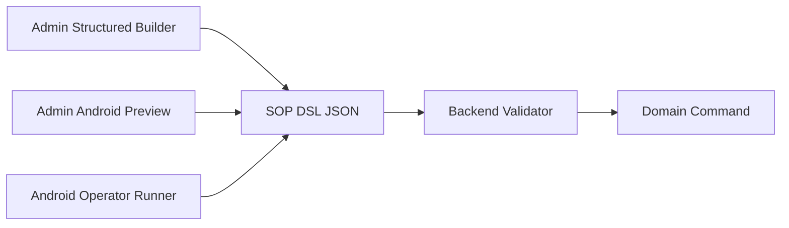

# Phase 2 TRD: SOP Forms, Task Engine, And Shifting

Status: draft for review.

## Technical Summary

Phase 2 builds the Goat OS SOP/task execution foundation and proves it with the
Shifting SOP.

Core technical rule:

```text
SOP definitions describe forms and validation.
Tasks describe assigned work.
Submissions record operator answers and proof.
Domain modules apply canonical truth.
```

For Shifting, the task/submission engine collects and validates the form, then a
movement/location application service applies per-goat location changes.

Project-level final path:

```text
Android SOP submission
  -> app API
  -> backend validation/idempotency/proof/audit
  -> module-owned canonical command/event
  -> Postgres source/fact/projection tables
  -> operational product dashboards/notifications
```

Governed/leadership analytics KPIs and AI read the Cube metric layer, not raw
Postgres; operational product dashboards read Postgres projections only when the
KPI is dual-served and covered by the parity gate in
`docs/decisions/high-scale-dashboard-projections.md`
(`context/analytics/final-analytics-infra.md`).

Legacy BigQuery, Sheets, Slack, App Script, and Drive-backed evidence remain
temporary migration inputs. They may be read only by backend-owned sync or
bridge adapters. The final runtime must not depend on frontend/mobile access to
legacy tools, and BQ/Sheets removal is gated per feature grain by the shared
cutover contract and `SOP-CLOSEOUT.md`.

Track the gates separately in implementation evidence: Shifting platform
acceptance, legacy SOP execution retirement, and dashboard BQ/Sheets retirement.
No deployment note or closeout artifact should collapse these into one switch.

Android SOP execution depends on Operator Management v1:
`docs/features/operator-management/PRD.md` and
`docs/features/operator-management/TRD.md`. Phase 2 should consume active
operator profile, role/scope grant, capability, device/session, app bootstrap,
and source-submitter mapping contracts instead of inventing task-local user
logic.

## Modules Touched

Backend modular monolith modules:

```text
backend/internal/sop             # SOP definitions, versions, DSL validation
backend/internal/tasks           # task lifecycle, assignment, due dates
backend/internal/submissions     # form submissions, batch items, idempotency
backend/internal/movement        # shifting domain commands and movement events
backend/internal/media           # proof metadata and upload intent integration
backend/internal/notifications   # Slack/FCM/WhatsApp outbound ports/adapters
backend/internal/identity        # goat lookup/identity-state read ports only
backend/internal/locations       # location reference read ports only
backend/internal/workforce       # operator profile, roster, capability, devices
backend/internal/permissions     # RBAC route/action permissions
backend/internal/outbox          # event publishing foundation
backend/internal/platform        # auth, db, observability, bootstrap wiring
```

Frontend/mobile:

```text
apps/admin-web                   # SOP config, task/review monitoring
apps/operator-mobile             # Android task list and SOP runner
packages/api-client              # generated OpenAPI clients
```

Contracts:

```text
contracts/openapi/admin-api.yaml                       # exists; extend
contracts/openapi/app-api.yaml                         # exists; extend
contracts/jsonschema/sop-form-version.schema.json      # to create
contracts/jsonschema/sop-submission.schema.json        # to create
contracts/jsonschema/domain-event-envelope.schema.json  # exists
```

## Phase Architecture Invariants

These rules are implementation requirements:

```text
Go backend = modular monolith with strict module ownership.
Domain logic follows dependency inversion through ports/interfaces.
Adapters wrap replaceable vendors/tools.
Bootstrap wires adapters.
Web/mobile clients use REST/JSON APIs and generated clients.
Forms/submissions/events use JSON Schema where compatibility matters.
No browser or React Native direct gRPC without a new ADR.
Every write path has RBAC, idempotency, audit, outbox, observability, and stale
state protection where human/admin concurrency applies.
```

Module ownership rules:

```text
sop owns SOP definition tables and DSL validation.
tasks owns task state, assignment, due dates, and escalations.
submissions owns form submission rows and per-goat item rows.
movement owns canonical shifting/movement events and current-location changes.
identity owns goat identity and identifiers.
locations owns location hierarchy.
media owns proof metadata.
notifications owns outbound Slack/FCM/WhatsApp adapters.
```

No module may directly write another module's tables. Cross-module behavior
goes through ports or explicit app-service interfaces.

## Legacy Automation Standard

Each existing Slack/App Script/Workflow Builder/Val.town workflow must be
cataloged and mapped into the same runtime primitives.

```text
legacy trigger        -> task creation source or notification adapter
legacy modal/form     -> SOP DSL version
legacy hardcoded menu -> backend option_source
legacy conditional JS -> declarative rule or named backend rule operator
legacy sheet write    -> backend command + domain event + outbox
legacy Slack message  -> notification adapter output
legacy Drive media    -> media/proof record
legacy row correction -> rework/correction command with audit
```

Do not port legacy scripts as permanent service code. They are behavior
references, cutover bridges, and rollback evidence only.

## Data Model

New tables should be added with new migrations only.

Proposed core tables:

```text
sop_definitions
  sop_id uuid primary key
  tenant_id uuid not null
  code text not null
  name text not null
  domain text not null
  status text not null -- draft | active | retired
  created_at timestamptz not null
  updated_at timestamptz not null
  row_version int not null

sop_versions
  sop_version_id uuid primary key
  tenant_id uuid not null
  sop_id uuid not null
  version int not null
  status text not null -- draft | published | retired
  dsl jsonb not null
  proof_policy jsonb not null
  option_sources jsonb not null
  created_by uuid not null
  published_by uuid
  published_at timestamptz
  retired_at timestamptz
  row_version int not null

sop_tasks
  task_id uuid primary key
  tenant_id uuid not null
  sop_id uuid not null
  sop_version_id uuid not null
  task_type text not null
  domain text not null
  state text not null
  priority text
  park_id uuid
  shed_id uuid
  assigned_to uuid
  assigned_role text
  due_at timestamptz
  source_ref jsonb
  created_at timestamptz not null
  updated_at timestamptz not null
  row_version int not null

sop_submissions
  submission_id uuid primary key
  tenant_id uuid not null
  task_id uuid
  sop_id uuid not null
  sop_version_id uuid not null
  submitted_by uuid not null
  state text not null -- submitted | accepted | needs_review | rejected | voided
  submitted_at timestamptz not null
  answers jsonb not null
  validation_result jsonb not null
  idempotency_key text not null
  row_version int not null

sop_submission_items
  submission_item_id uuid primary key
  tenant_id uuid not null
  submission_id uuid not null
  goat_id uuid
  item_key text not null
  state text not null -- accepted | needs_review | rejected | skipped
  answers jsonb not null
  domain_result jsonb
  row_version int not null

movement_events
  movement_event_id uuid primary key
  tenant_id uuid not null
  goat_id uuid not null
  submission_item_id uuid
  movement_type text not null -- shifting
  source_location_id uuid
  destination_location_id uuid not null
  reason text
  occurred_at timestamptz not null
  decided_by uuid not null
  evidence_refs jsonb not null
  created_at timestamptz not null
```

If Phase 1 already has a suitable goat location history/event table, reuse it
through the movement module instead of duplicating canonical movement history.

Indexes:

```text
(tenant_id, code) unique on sop_definitions
(tenant_id, sop_id, version) unique on sop_versions
(tenant_id, state, due_at, task_id) on sop_tasks
(tenant_id, assigned_to, state, due_at, task_id) on sop_tasks
(tenant_id, task_id, submitted_at desc) on sop_submissions
(tenant_id, submission_id, item_key) unique on sop_submission_items
(tenant_id, goat_id, occurred_at desc, movement_event_id desc) on movement_events
(tenant_id, idempotency_key) unique on sop_submissions or shared idempotency table namespace
```

## SOP DSL

The DSL is JSON and validated by JSON Schema.

Rules:

```text
declarative only
no arbitrary JavaScript
no network calls inside rules
no hidden time-dependent logic except named backend rule operators
same DSL evaluated by admin preview, Android runner, and backend validator
server is always authority
```

Required DSL constructs for Phase 2:

```text
fields:
  text
  number
  date_time
  boolean
  select
  multiselect
  goat_scan
  rfid_scan
  goat_lookup
  shed_picker
  photo_proof
  video_proof

rules:
  visible_if
  required_if
  enabled_if
  proof_required_if
  block_submission_if
  requires_supervisor_if
  repeat_for_each_goat
  calculated_value

option_sources:
  active_goats
  active_parks
  active_sheds
  operators_by_scope
  movement_reasons
```

Dynamic option sources come from backend APIs and mobile offline caches. They
must not be hardcoded Slack dropdowns.

## Builder/Runner Architecture

The same SOP version drives three views:



Implementation shape:

```text
admin builder
  edits structured SOP draft
  validates against JSON Schema
  previews client-safe rules
  publishes immutable version

android runner
  downloads assigned task + pinned SOP version
  renders fields from DSL
  evaluates client-safe show/hide/required rules
  captures answers and proof
  queues idempotent submission

backend validator
  loads the same pinned SOP version
  validates answers and proof
  evaluates server-authoritative rules
  calls domain application service
```

Rules are split by safety:

```text
client-safe rules
  visible_if
  required_if
  enabled_if
  calculated display values

server-authoritative rules
  permission gates
  live goat state
  live location state
  proof finality
  duplicate/idempotency checks
  domain safety blocks
```

The client may help the operator avoid mistakes, but the backend owns the final
decision.

## Parallel Workstreams

Admin builder and Android runner must be implemented against the same contracts,
not as separate products.

Backend/admin-web track:

```text
DSL JSON Schema
draft SOP create/edit APIs
workflow node/edge/proof policy validation
option source validation
preview dry-run endpoint
publish/retire lifecycle
admin task/proof/rework queues
OpenAPI + generated TypeScript client
```

Android track:

```text
verified login and app bootstrap manifest
active operator profile, role/scope grant, capability, and device checks
operator task list
pinned SOP version download
offline option-source cache
native DSL renderer/evaluator
draft persistence
media upload intent integration
idempotent sync queue
per-goat partial result/retry
rework and correction states
```

Shared contract artifacts:

```text
contracts/jsonschema/sop-form-version.schema.json      # to create
contracts/jsonschema/sop-submission.schema.json        # to create
contracts/jsonschema/sop-preview-dry-run.schema.json   # to create
contracts/jsonschema/sop-proof-policy.schema.json      # to create
contracts/openapi/admin-api.yaml                       # exists; extend
contracts/openapi/app-api.yaml                         # exists; extend
packages/api-client                                    # exists; regenerate
```

If Android needs a client-safe evaluator package, add it as a shared package with
deterministic rule semantics and backend parity tests. Do not duplicate rule
behavior independently inside admin-web and operator-mobile.

## Jira-Style Builder UX Technical Shape

The product requirement is a Jira-style workflow builder experience. The
technical implementation should be structured and schema-driven, not a free-form
custom script editor.

The existing admin dashboard must expose this as a first-class SOP Builder
section, backed by `apps/admin-web/features/sops`. It must not be a hidden admin
JSON editor.

Admin builder modules:

```text
Field Palette
  supported field types and option source bindings

Form Canvas
  ordered sections and fields

Rule Builder
  visible_if, required_if, block_submission_if, proof_required_if,
  requires_supervisor_if

Workflow Canvas
  draggable/linkable nodes for task states, approval gates, operator execution,
  verifier/rework transitions, acceptance, rejection, and blocked-review paths

Assignment Builder
  direct assignee or role/scope rule

Proof Policy Builder
  photo, video, generic attachment, original/rectified/verifier proof, subject,
  per-goat/per-batch scope, verification requirement

Preview Runner
  shows the Android operator view using the same client-safe DSL evaluator

Scenario Simulator
  lets admin test sample answers, sample goats, locations, missing proof,
  approval/rejection paths, and expected backend validation outcomes

Version Panel
  validate draft, show errors, publish, retire, inspect version history
```

Phase 2 must include a visual workflow canvas for the business flow. The form
canvas may start as a structured section/field editor, but workflow states,
approvals, proof verification, rejection, and rework must be visible as nodes
that can be connected by the admin. The architecture must still store the result
as validated DSL JSON and keep UI components replaceable with richer visual
editing later.

The workflow canvas persists to deterministic DSL, for example:

```text
nodes:
  request_approval
  assigned_to_operator
  operator_submission
  proof_verification
  accepted
  rejected
  rework_requested
  blocked_review

edges:
  request_approval -> assigned_to_operator when approved
  operator_submission -> proof_verification when proof_required
  proof_verification -> accepted when verifier_approves
  proof_verification -> rework_requested when verifier_rejects
  operator_submission -> blocked_review when server_rule_blocks
```

Builder state must not be canonical until saved through backend APIs. Preview
state can be local client state, but published SOP versions are immutable
backend records.

### Preview And Scenario Testing

Preview and test mode are required before publish.

Technical requirements:

```text
preview uses the same client-safe DSL evaluator as Android
preview renders mobile-sized operator form inside admin web
admin can edit sample answers without mutating the draft
admin can select sample goat/location fixtures from backend option sources
admin can simulate missing/invalid proof
admin can simulate approval, rejection, and rework edges
preview highlights visible, hidden, required, disabled, and blocking fields
preview shows the selected workflow path and final state candidate
backend exposes a dry-run validation endpoint for server-authoritative checks
publish blocks when required validation scenarios fail
```

Suggested dry-run endpoint:

```text
POST /admin/sop-versions/{sop_version_id}/validate-preview
  -> authenticate/RBAC sop.write
  -> accept draft DSL + sample answers + sample context
  -> run schema validation
  -> run client-safe rule evaluation
  -> run server-authoritative dry-run checks where sample IDs are provided
  -> return field states, workflow path, validation errors, warnings, blockers
```

## Shifting SOP Version Seed

The first seed should be checked in as a canonical fixture/migration or seed
command, not copied from Slack at runtime.

Proposed fields:

```text
shift_type
category
priority
goats
source_location
destination_location
scheduled_at
performed_at
performed_by
destination_count
proof_video
comments
exception_reason
```

Rules:

```text
shift_type=request -> requires_supervisor_if true before execution
shift_type=direction -> no request approval gate
priority=high -> due_at = submitted date in Asia/Kolkata
category in health, delivery and priority=low -> due_at = next day 09:00 IST
priority=low and category not in health/delivery and submit time < 13:30 IST
  -> due_at = next day 09:00 IST
priority=low and category not in health/delivery and submit time >= 13:30 IST
  -> due_at = day after tomorrow 09:00 IST
source_location != goat.current_location -> exception_reason required
destination_location inactive -> block
goat identity_state merged -> block with survivor redirect
proof_video required before final verification
```

## Backend Command Flow

### Publish SOP Version

```text
POST /admin/sops/{sop_id}/versions
  -> authenticate/RBAC sop.write
  -> validate DSL against JSON Schema
  -> validate option source names
  -> create draft version
```

```text
POST /admin/sops/{sop_id}/versions/{version_id}/publish
  -> authenticate/RBAC sop.publish
  -> row_version guard
  -> mark version published
  -> retire previous active version where applicable
  -> audit_log
  -> outbox sop.version.published
```

### Create Or Assign Shifting Task

```text
POST /admin/tasks
or domain-specific shifting request endpoint
  -> authenticate/RBAC movement.request or task.assign
  -> load published shifting SOP version
  -> compute due_at
  -> create sop_task
  -> audit_log
  -> outbox task.created
```

### Submit Shifting SOP

```text
POST /app/tasks/{task_id}/submissions
  -> authenticate/RBAC task.execute
  -> idempotency check
  -> load task + pinned sop_version
  -> validate answers against DSL
  -> evaluate client-safe and server-authoritative gates
  -> load goat identity/location state through ports
  -> validate destination location through location port
  -> one transaction:
       sop_submission
       sop_submission_items
       proof metadata refs
       movement_events for accepted items
       current location projection update through movement service
       audit_log
       domain event envelope(s)
       outbox row(s)
       task state transition
       idempotency completion
  -> response with submission_id, per-item state, task state
```

Idempotent replay returns the original response. Same idempotency key with a
different request hash returns a conflict.

## API Contracts

Admin API:

```text
GET /admin/sops
POST /admin/sops
GET /admin/sops/{sop_id}
POST /admin/sops/{sop_id}/versions
POST /admin/sops/{sop_id}/versions/{sop_version_id}/publish
POST /admin/sops/{sop_id}/versions/{sop_version_id}/retire
GET /admin/tasks
GET /admin/tasks/{task_id}
POST /admin/tasks/{task_id}/assign
POST /admin/tasks/{task_id}/approve
POST /admin/tasks/{task_id}/reject
```

App API:

```text
GET /app/tasks
GET /app/tasks/{task_id}
POST /app/tasks/{task_id}/start
POST /app/tasks/{task_id}/submissions
GET /app/sop-versions/{sop_version_id}
GET /app/offline-cache
```

Media/proof API can either be in app API or a shared media API:

```text
POST /app/media/upload-intents
POST /app/media/{media_id}/complete
```

All clients must use generated OpenAPI clients. No hand-copied DTOs.

## RBAC

New route permissions:

```text
sop.read
sop.write
sop.publish
task.read
task.assign
task.execute
task.verify
movement.request
movement.authorize
movement.execute
movement.verify
```

Route registry must fail closed for new protected routes. Tests must cover
admin, ceo_internal, park/supervisor, operator, and verifier paths where those
roles exist in Phase 2.

Operator identity, source-submitter mapping, capabilities, device state, and app
bootstrap are owned by Operator Management. SOP/task routes consume those
contracts and must still re-check `task.execute`, `task.verify`, movement
permissions, live task state, active profile, active grants, and compatible app
and SOP version at submit time.

## Offline And Mobile Sync

Android runner requirements:

```text
login through platform auth and fetch app bootstrap
block task execution when operator profile, grant, capability, device, or app
  version is inactive/incompatible
download assigned tasks and pinned SOP versions
download option source cache scoped to operator/park/shed
save local draft
queue submission with idempotency key
attach media upload references
retry after network failure
show per-goat item errors after sync
prevent edits to submitted immutable answers except through rework/correction
```

Server must revalidate every submission. Offline client validation is UX only.

## Proof And Media

Proof metadata:

```text
media_id
tenant_id
uploaded_by
task_id
submission_id
submission_item_id optional
proof_type photo | video
subject goat | batch | shed | medicine | feed | other
storage_ref
hash
captured_at
uploaded_at
verification_state
```

Phase 2 may use a local/dev adapter first, but production storage remains behind
a media/storage port. The app must not write directly to GCS/Firebase without a
backend-issued upload intent.

Video uploads must be designed for field conditions:

```text
large videos do not pass through the app API process body
backend issues scoped upload intent
client uploads to storage adapter target
client completes media record with hash/size/duration/captured_at/device info
backend validates completion before proof can be accepted
failed/expired uploads are retryable and visible in sync state
media processing and AI pre-checks run async through jobs/outbox/DLQ
raw media retention and derived thumbnail/transcode retention are policy fields
```

Every proof record must preserve:

```text
original proof
rectified proof when rework happens
verifier decision and verifier proof when configured
proof subject and scope: goat, batch, shed, medicine, feed, load, or other
operator/device/timestamp/location metadata where available
audit trail for acceptance, rejection, rework, void, reversal, and correction
```

Media scale checks are required before production: upload intent rate, object
size limits, retry behavior, storage lifecycle policy, DLQ/error monitoring, and
bounded proof-review queries.

## Events And Outbox

Minimum event types:

```text
sop.version.published
sop.task.created
sop.task.assigned
sop.submission.received
sop.submission.accepted
sop.submission.needs_review
sop.proof.rework_requested
goat.location.shifted
```

Events use the domain event envelope JSON Schema and are written through the
existing outbox pattern.

## Observability

Use `backend/internal/platform/observability` logger construction and existing
patterns. Do not hand-roll `slog.New`.

Module constructors receive logger, metrics, and tracing dependencies through
bootstrap wiring. Do not add package-level global loggers, ad hoc request IDs, or
direct stdout logging in application services.

Log at boundaries:

```text
task created
task assigned
submission received
submission accepted/blocked/rejected
movement applied
proof upload intent created/completed
outbox publish failed
```

Include safe IDs:

```text
tenant_id
request_id
actor_id
task_id
sop_id
sop_version_id
submission_id
goat_id
rfid/old_tag when relevant
```

Never log secrets, bearer tokens, service account JSON, private keys, or raw
credentials.

Metrics:

```text
api_latency_ms by route/action
submission_validation_failures by reason
task_overdue_count by park/category
offline_retry_count
proof_upload_failures
outbox_pending_age
movement_apply_failures
stale_row_version_conflicts
```

## Frontend/Admin Architecture

Admin web:

```text
SSR-first route modules under apps/admin-web/features/sops and features/tasks
server-side API adapters using generated @goatos/api-client types
no bearer token in browser code
no direct BQ/Sheets/Postgres/GCS reads
client components only for local builder/preview interactivity
```

Recommended feature shape:

```text
apps/admin-web/features/sops/
  index.tsx                 # server route composition
  actions.ts                # server actions / mutation handlers
  api.ts                    # generated-client adapter, no UI imports
  sop-editor.tsx            # client-only structured editor
  sop-preview.tsx           # client-only Android-form preview
  components/               # presentational pieces

apps/admin-web/features/tasks/
  index.tsx
  actions.ts
  api.ts
  task-queue.tsx
  proof-review.tsx
```

Keep DTO mapping at the API adapter boundary. Shared UI components stay
presentational; business rules live in backend contracts or in the shared
client-safe DSL evaluator, not buried inside React state.

Required admin screens:

- SOP list
- Shifting SOP version detail
- structured DSL editor for first version
- Android preview pane
- publish/retire controls
- task queue
- proof/rework review surface

Operator Android:

```text
uses generated app-api client
uses app bootstrap manifest for visible navigation and executable SOP versions
offline cache for tasks/SOP versions/options
native camera/media upload flow behind backend upload intents
no canonical data in Zustand/MMKV beyond local cache/draft/sync queue
```

## Migration From Slack/App Script

Phase 2 migration steps:

1. Extract Shifting SOP fields/rules from `shifting_death_automation.js`.
2. Extract legacy submitter/assignee evidence into sanitized Operator
   Management source candidates.
3. Activate a scoped operator cohort with explicit grants, capabilities, and
   device/session state.
4. Seed Shifting SOP v1 in Goat OS.
5. Run Goat OS Shifting in shadow mode against legacy Slack/Sheets for selected
   parks if needed.
6. Route Slack notifications from Goat OS outbox.
7. Disable direct Slack/App Script writes after cutover.
8. Keep legacy scripts frozen for audit until migration is accepted.

No inbound Slack bridge may bypass Goat OS auth, validation, idempotency, audit,
or RBAC.

## Dashboard Cutover Dependencies

Counts, Locations, and Mortality cannot drop BQ/Sheets merely because the SOP
builder exists. They can drop legacy sources only where canonical SOP/domain
coverage is complete, deduped, and parity-checked.

A tenant-wide or feature-wide `canonical_only` flag is not enough. Promotion
must be recorded at the section/grain that the serving API and dashboard use.

Technical dependencies by feature:

| Feature | Required SOP/domain inputs |
| --- | --- |
| Locations | location CRUD/alias/capacity APIs, Shifting movement events, Android option-source cache through Locations APIs, source-label review for SOP-submitted labels. |
| Counts | count verification SOP, Shifting/location events, lifecycle events, status/stage transition events, weight or valuation facts, sale/inactive events, and projection invalidation from accepted submissions. |
| Mortality | Death SOP to `mortality_events`, proof/correction/void model, post-mortem evidence policy, abortion/birth/litter ownership, denominator projection versioning, and source-independent event keys. |

Each promoted dashboard grain must write coverage registry state with:

```text
feature/module
section/metric
grain key
source mode being promoted
canonical source/version
legacy source/version
shadow parity artifact path
approving actor or job
rollback/expiry policy
```

Cross-source dedup tests are mandatory for overlap windows, especially for
death events and count verification facts where legacy and Android may describe
the same real-world event.

## Testing

Backend:

```text
unit tests for DSL validation and rule evaluation
unit tests for due-at calculation
repository integration tests for SOP publish/task/submission/movement
idempotency replay/conflict tests
RBAC route tests
outbox/audit transaction tests
stale row_version tests
server-side validation rejects stale/offline-invalid submissions
```

Frontend/mobile:

```text
admin-web typecheck/lint/build
admin-web visual smoke for SOP/task screens
Android runner unit tests for DSL visibility/required rules
offline submit/retry tests
camera/proof state tests with fake media adapter
```

SQL/scale:

```text
query-plan validation for task queue, assigned tasks, submission history, and
latest goat movement reads
bounded batch submission tests
1M-goat synthetic task-list shape proof before staging load
```

## Validation Commands

Expected phase gates:

```bash
make validate-migrations
make api-client-generate
make api-client-check
go test ./internal/sop/... ./internal/tasks/... ./internal/submissions/... ./internal/movement/... ./internal/identity/... ./internal/permissions ./internal/bootstrap
npm --prefix apps/admin-web run typecheck
npm --prefix apps/admin-web run lint
npm --prefix apps/admin-web run build
npm --prefix apps/admin-web run smoke:visual:live
```

Operator mobile validation commands must be added when the app package lands.

## Rollout Plan

```text
1. Seed Shifting SOP v1 as draft in local.
2. Publish in local and submit synthetic single-goat shift.
3. Submit synthetic batch shift with one valid goat and one invalid goat.
4. Verify current location update, audit, outbox, and task state.
5. Run shadow mode for one park/shed while Slack remains live.
6. Cut over Shifting creation/execution to Goat OS for selected users.
7. Keep Slack outbound notifications only.
8. Retire direct App Script writes after acceptance.
```

## Open Technical Decisions

- Whether movement lives in `backend/internal/movement` now or extends an
  existing locations module. It must not be owned by `sop`.
- Whether task assignments are direct user IDs in Phase 2 or role/scope-backed
  placeholders until Phase 4 workforce is built.
- Whether proof verification is required before applying location, or location
  applies with `needs_verification` and can be reversed/voided later.
- Whether Shifting Request creates a task only after authorization or creates a
  pending authorization task immediately.
- Exact operator mobile package path and generated app-api client integration
  once the mobile app lands in this repo.
- Exact first operator login adapter: verified email, phone OTP, managed device,
  or staged combination.
- Whether device registration needs cryptographic device keys in Phase 2 or can
  start with app-install metadata plus server-side revocation.
- Whether Count Verification, Weight Capture, Death Report, or Vaccination is
  the first post-Shifting SOP needed for dashboard cutover pressure.
- Which module owns status/stage transition events equivalent to legacy
  `shed_tag` semantics.
- Which module owns birth/abortion/litter denominator facts before Mortality
  rates can become canonical.
- Exact post-mortem checklist fields and media requirements for Death SOP.
