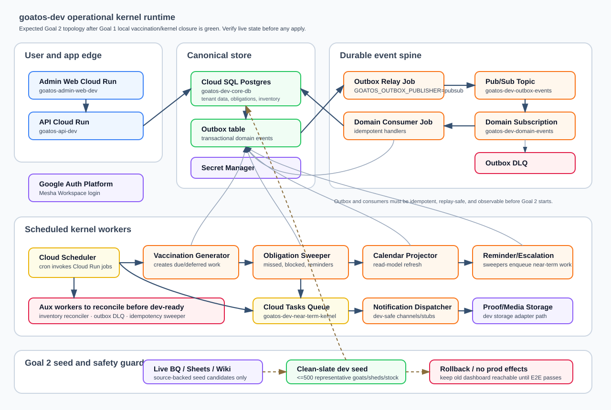

# goatos-dev Terraform And Kernel Runtime

Status: this directory now contains the dev Terraform for Goat OS foundation
resources and the operational-kernel runtime pieces. Some sections below record
historical bootstrap commands; do not infer current cloud state from this README
alone. Before any apply, deploy, reset, or traffic change, verify the active
Mesha/VGoats account, org `vgoats.com`, project `goatos-dev`, Terraform state,
and live resource drift.

For read-only data pulls from the live dev database, do not infer credentials or
scrape the dashboard. Use the `goatos-dev Read-Only Cloud SQL Access` workflow in
`docs/runbooks/google-cloud-environments.md`.

## State Backend

```text
Project:      goatos-dev
Project no:   634659905829
Org:          vgoats.com / organizations/563962826703
Folder:       goat-os / folders/188649904255
Region:       asia-south1
Bucket:       goatos-dev-tf-state
State prefix: terraform/dev
Backend:      gcs
```

The state bucket was bootstrapped imperatively before Terraform backend init. It
is not defined as a Terraform resource in this environment, because Terraform
cannot safely own the same bucket it uses as its backend.

Commands run:

```bash
gcloud storage buckets create gs://goatos-dev-tf-state \
  --project=goatos-dev \
  --location=asia-south1 \
  --uniform-bucket-level-access \
  --public-access-prevention

gcloud storage buckets update gs://goatos-dev-tf-state \
  --project=goatos-dev \
  --versioning
```

Verification command:

```bash
gcloud storage buckets describe gs://goatos-dev-tf-state \
  --project=goatos-dev \
  --format=json
```

Expected bucket posture:

```text
location: ASIA-SOUTH1
uniform_bucket_level_access: true
public_access_prevention: enforced
versioning_enabled: true
```

Terraform init command run:

```bash
env -u GOOGLE_APPLICATION_CREDENTIALS \
  -u GOOGLE_ADC_TOKEN \
  -u GOOGLE_API_KEY \
  GOOGLE_OAUTH_ACCESS_TOKEN="$(gcloud auth print-access-token --account=ravi@mesha.sg)" \
  terraform -chdir=infra/envs/dev init -input=false -reconfigure
```

The local shell had an Application Default Credential pointing outside
VGoats/Goat OS. Terraform commands for this environment must use verified
Mesha/VGoats credentials only; unset any unrelated ADC/service-account env vars
before init, plan, or apply.

This bucket is only for Terraform state metadata. Do not store goat data, legacy
exports, secrets, container images, app artifacts, or migration payloads here.

Using a state bucket inside `goatos-dev` is acceptable for dev simplicity. The
`goatos-stg` and `goatos-prod` state design can be stricter later, but do not
create or modify those environments during dev bring-up.

Do not delete, empty, rename, lock, or otherwise modify this bucket unless the
operator explicitly approves a Terraform-state teardown or migration.

## API and Budget Gate

Historical P5 bootstrap enabled this approved API set in `goatos-dev`:

```text
artifactregistry.googleapis.com
billingbudgets.googleapis.com
cloudbuild.googleapis.com
cloudscheduler.googleapis.com
compute.googleapis.com
identitytoolkit.googleapis.com
pubsub.googleapis.com
run.googleapis.com
secretmanager.googleapis.com
sqladmin.googleapis.com
```

Current Terraform desired API set is smaller/different because it only manages
the runtime services this environment needs from code:

```text
artifactregistry.googleapis.com
cloudscheduler.googleapis.com
cloudtasks.googleapis.com
fcm.googleapis.com
pubsub.googleapis.com
run.googleapis.com
secretmanager.googleapis.com
sqladmin.googleapis.com
```

Do not disable historically enabled APIs just because they are absent from
`services.tf`; some were enabled for bootstrap, build, identity, or budget
management outside the current runtime Terraform. Conversely, do not assume
Cloud Tasks or FCM are live until Goal 2 verifies/applies Terraform state.

Compute API enablement created the default VPC and default firewall rules. They
are unused for the current Cloud Run plus Cloud SQL connector/socket plan; do
not delete or modify them unless explicitly approved.

P6 budget:

```text
Billing account: 01FEDE-96BCB3-76D992
Budget:          Goat OS dev monthly budget
Budget id:       f90ceaf4-efea-4c4f-9059-32b57b349992
Scope:           projects/634659905829 (goatos-dev only)
Amount:          INR 4,750 monthly (billing-account currency; about USD 50)
Alerts:          50%, 80%, 100% current spend
```

## Dev Kernel Runtime Diagram



This diagram is the expected Goal 2 runtime shape, not proof that every resource
is already applied. The handoff in
`context/execution/operational-kernel-stability-closure-handoff.md` is the gate:
local kernel/vaccination closure must finish first, then Google dev rollout can
verify/apply this topology and run the same E2E in `goatos-dev`.

## Terraform Resource Plan

The current Terraform tree describes foundation resources and the base dev
kernel jobs/schedulers for the vaccination slice:

```text
Artifact Registry Docker repo
Cloud SQL Postgres instance shell + database shell
Secret Manager containers only, no secret versions
Pub/Sub outbox topic, analytics and domain-event subscriptions, DLQ, message storage in asia-south1
Pub/Sub service-agent IAM for DLQ correctness
Runtime service accounts
Cloud SQL client, secret accessor, and topic publisher IAM
Cloud Tasks near-term kernel queue
Cloud Run kernel jobs
Cloud Scheduler invocations for those jobs
```

Planned names:

```text
Artifact Registry: asia-south1-docker.pkg.dev/goatos-dev/goatos
Cloud SQL:         goatos-dev-core-db
Database:          goatos
Outbox topic:      goatos-dev-outbox-events
DLQ topic:         goatos-dev-outbox-events-dlq
Subscriptions:     goatos-dev-analytics-export, goatos-dev-domain-events
Cloud Tasks:       goatos-dev-near-term-kernel
Kernel jobs:       goatos-dev-outbox-relay, goatos-dev-domain-event-consumer,
                   goatos-dev-vaccination-generator,
                   goatos-dev-obligation-sweeper,
                   goatos-dev-calendar-projector,
                   goatos-dev-calendar-reminder-sweeper,
                   goatos-dev-calendar-escalation-sweeper,
                   goatos-dev-notification-dispatcher
```

Goal 2 topology proof items:

```text
outbox-dlq                  # Pub/Sub/native DLQ drain/replay/import runner
```

`inventory-batch-reconciler` and `idempotency-key-sweeper` are in the current
Cloud Run Job/Scheduler map and must be proven in Google E2E. `outbox-dlq`
exists as a backend command, but the Pub/Sub/native DLQ drain/replay/import
path still needs a scheduled job or a documented dev-safe operator runner before
calling the dev kernel runtime complete.

Cloud SQL is planned with `activation_policy = "ALWAYS"` for the live raw-URL
dev dashboard bring-up. This means the instance runs while the dashboard is
live and carries running CPU/RAM cost plus storage cost. Stop or change this
posture only through an explicit later dev-ops checkpoint.

Connectivity is public IP plus future Cloud SQL connector/socket:

```text
/cloudsql/goatos-dev:asia-south1:goatos-dev-core-db
```

Do not add authorized networks, private IP, or a Serverless VPC Access connector
for this dev batch.

Do not apply or mutate from this directory as a casual verification step. Goal 2
must first pass the cloud authority gate, reconcile live drift, and preserve the
old dashboard rollback path. The following operations are allowed only inside
that explicit Goal 2 rollout or another approved cloud-change session:

```text
terraform apply
Cloud Run services/jobs changes
Scheduler jobs changes
Load balancer/serverless NEGs/DNS
Cloud SQL users or passwords
Secret Manager secret versions
Firebase Hosting or Firebase App Hosting
Image pushes
Migrations
Legacy imports
```

Terraform plan command run:

```bash
env -u GOOGLE_APPLICATION_CREDENTIALS \
  -u GOOGLE_CREDENTIALS \
  -u GOOGLE_OAUTH_ACCESS_TOKEN \
  -u CLOUDSDK_AUTH_CREDENTIAL_FILE_OVERRIDE \
  GOOGLE_OAUTH_ACCESS_TOKEN="$(gcloud auth print-access-token --account=ravi@mesha.sg)" \
  terraform -chdir=infra/envs/dev plan -input=false -no-color
```

Historical pre-kernel-jobs plan result: `42 to add, 0 to change, 0 to destroy`.
That number is not current proof. Goal 2 must regenerate a fresh plan after
reconciling live drift and before any apply. No plan file was written; do not
commit `tfplan`, `*.tfplan`, `.terraform/`, or `*.tfstate*`.

## Dev Custom Dashboard URL

Status: live for dev HTTPS page load, created imperatively outside Terraform.
This is intentionally documented here because the P7 Terraform composition still
does not own Layer 2 load-balancer or DNS resources.

```text
Public URL:       https://dev.dashboard.mesha.sg/
Project:          goatos-dev / 634659905829
Region:           asia-south1 for the serverless NEG and Cloud Run backend
Global IP:        8.232.140.161
Global IP name:   goatos-nonprod-dashboard-ip
DNS provider:     Cloudflare, zone mesha.sg
DNS record:       A dev.dashboard -> 8.232.140.161, DNS-only, TTL Auto
Certificate:      goatos-nonprod-dashboard-cert
Certificate SAN:  dev.dashboard.mesha.sg
Certificate state: ACTIVE
Cloud Run target: goatos-admin-web-dev
```

Google Cloud resources:

```text
Serverless NEG:        goatos-admin-web-dev-neg (asia-south1)
Backend service:       goatos-admin-web-dev-backend
HTTPS URL map:         goatos-nonprod-dashboard-map
HTTPS target proxy:    goatos-nonprod-dashboard-https-proxy
HTTPS forwarding rule: goatos-nonprod-dashboard-https, 8.232.140.161:443
HTTP redirect map:     goatos-nonprod-dashboard-http-redirect
HTTP target proxy:     goatos-nonprod-dashboard-http-proxy
HTTP forwarding rule:  goatos-nonprod-dashboard-http, 8.232.140.161:80
```

Commands run for the Google LB side:

```bash
CLOUDSDK_PYTHON=/opt/homebrew/bin/python3 \
  gcloud compute addresses create goatos-nonprod-dashboard-ip \
  --project=goatos-dev \
  --global \
  --ip-version=IPV4

CLOUDSDK_PYTHON=/opt/homebrew/bin/python3 \
  gcloud compute network-endpoint-groups create goatos-admin-web-dev-neg \
  --project=goatos-dev \
  --region=asia-south1 \
  --network-endpoint-type=serverless \
  --cloud-run-service=goatos-admin-web-dev

CLOUDSDK_PYTHON=/opt/homebrew/bin/python3 \
  gcloud compute backend-services create goatos-admin-web-dev-backend \
  --project=goatos-dev \
  --global \
  --load-balancing-scheme=EXTERNAL_MANAGED \
  --protocol=HTTP

CLOUDSDK_PYTHON=/opt/homebrew/bin/python3 \
  gcloud compute backend-services add-backend goatos-admin-web-dev-backend \
  --project=goatos-dev \
  --global \
  --network-endpoint-group=goatos-admin-web-dev-neg \
  --network-endpoint-group-region=asia-south1

CLOUDSDK_PYTHON=/opt/homebrew/bin/python3 \
  gcloud compute ssl-certificates create goatos-nonprod-dashboard-cert \
  --project=goatos-dev \
  --global \
  --domains=dev.dashboard.mesha.sg

CLOUDSDK_PYTHON=/opt/homebrew/bin/python3 \
  gcloud compute url-maps create goatos-nonprod-dashboard-map \
  --project=goatos-dev \
  --default-service=goatos-admin-web-dev-backend

CLOUDSDK_PYTHON=/opt/homebrew/bin/python3 \
  gcloud compute target-https-proxies create goatos-nonprod-dashboard-https-proxy \
  --project=goatos-dev \
  --url-map=goatos-nonprod-dashboard-map \
  --ssl-certificates=goatos-nonprod-dashboard-cert

CLOUDSDK_PYTHON=/opt/homebrew/bin/python3 \
  gcloud compute forwarding-rules create goatos-nonprod-dashboard-https \
  --project=goatos-dev \
  --global \
  --load-balancing-scheme=EXTERNAL_MANAGED \
  --network-tier=PREMIUM \
  --address=goatos-nonprod-dashboard-ip \
  --target-https-proxy=goatos-nonprod-dashboard-https-proxy \
  --ports=443
```

HTTP to HTTPS redirect was added as a partial HTTP load balancer on the same IP:

```bash
printf '%s\n' \
  'name: goatos-nonprod-dashboard-http-redirect' \
  'defaultUrlRedirect:' \
  '  httpsRedirect: true' \
  '  stripQuery: false' \
  '  redirectResponseCode: MOVED_PERMANENTLY_DEFAULT' |
  CLOUDSDK_PYTHON=/opt/homebrew/bin/python3 \
  gcloud compute url-maps import goatos-nonprod-dashboard-http-redirect \
  --project=goatos-dev \
  --global \
  --source=- \
  --quiet

CLOUDSDK_PYTHON=/opt/homebrew/bin/python3 \
  gcloud compute target-http-proxies create goatos-nonprod-dashboard-http-proxy \
  --project=goatos-dev \
  --url-map=goatos-nonprod-dashboard-http-redirect

CLOUDSDK_PYTHON=/opt/homebrew/bin/python3 \
  gcloud compute forwarding-rules create goatos-nonprod-dashboard-http \
  --project=goatos-dev \
  --global \
  --load-balancing-scheme=EXTERNAL_MANAGED \
  --network-tier=PREMIUM \
  --address=goatos-nonprod-dashboard-ip \
  --target-http-proxy=goatos-nonprod-dashboard-http-proxy \
  --ports=80
```

Firebase/Auth Platform authorized domain update:

```text
Added authorized domain: dev.dashboard.mesha.sg
API: PATCH https://identitytoolkit.googleapis.com/admin/v2/projects/634659905829/config?updateMask=authorizedDomains
Required header: x-goog-user-project: goatos-dev
```

Current authorized domains:

```text
dev.dashboard.mesha.sg
goatos-admin-web-dev-634659905829.asia-south1.run.app
goatos-admin-web-dev-farig3r27a-el.a.run.app
goatos-dev.firebaseapp.com
goatos-dev.web.app
```

Validation:

```bash
dig +short A dev.dashboard.mesha.sg @1.1.1.1
# 8.232.140.161

dig +short A dev.dashboard.mesha.sg @8.8.8.8
# 8.232.140.161

CLOUDSDK_PYTHON=/opt/homebrew/bin/python3 \
  gcloud compute ssl-certificates describe goatos-nonprod-dashboard-cert \
  --project=goatos-dev \
  --global \
  --format='json(managed.status,managed.domainStatus,managed.domains)'
# managed.status = ACTIVE
# managed.domainStatus.dev.dashboard.mesha.sg = ACTIVE

curl -I https://dev.dashboard.mesha.sg/login
# HTTP/2 200

curl -I http://dev.dashboard.mesha.sg/login
# HTTP/1.1 301 Moved Permanently
# Location: https://dev.dashboard.mesha.sg:443/login
```

SSO console state:

```text
OAuth web client:
634659905829-mf5fkfdl92akln15asorvkcduem5bpk3.apps.googleusercontent.com

Authorized JavaScript origin:
https://dev.dashboard.mesha.sg

Google Auth Platform Branding app name:
Mesha
```

The Firebase authorized domain is not enough by itself. Google sign-in can still
fail with `origin_mismatch` on a custom host until the OAuth client has that
host's JavaScript origin. Make future auth-branding or custom-host changes while
signed into Google Cloud as a project-authorized Mesha/VGoats account; do not
use personal Gmail project access or grant broad IAM just to work around the
browser account.

Planned hostname split:

```text
dev.dashboard.mesha.sg -> goatos-dev, current non-prod LB/IP
stg.dashboard.mesha.sg -> future goatos-stg route, same non-prod LB/IP only after a stg backend/cert route exists
dashboard.mesha.sg     -> future goatos-prod route, separate prod LB/IP
```

Do not add `stg.dashboard.mesha.sg` DNS yet. If it points at this IP before the
stg cert and URL-map route exist, it will either fail TLS or route to the dev
backend. Do not add `dashboard.mesha.sg` to this non-prod IP.

Teardown guard: do not delete or modify the static IP, forwarding rules, target
proxies, URL maps, backend service, serverless NEG, DNS record, or certificate
unless explicitly approved. These resources are live outside Terraform state.
