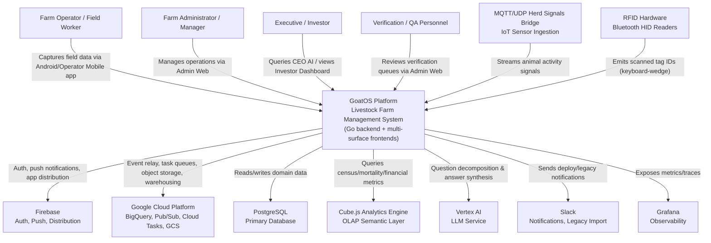

# System Context Overview

**Project:** GoatOS — Livestock Farm Management Platform
**Document Level:** C4 Model — Level 1 (System Context)
**Generated:** 2026-09-13 10:28:14 (UTC) (Timestamp: 1789295294)

---

## 1. Project Introduction

### 1.1 Overview

GoatOS is a full-stack, multi-surface livestock (goat farm) management platform designed to digitize and standardize end-to-end farm operations. It replaces manual and spreadsheet-based tracking with structured, verifiable digital workflows covering animal identity and health, feeding, vaccination programs, procurement and sales, workforce/roster management, and executive-level analytics through an AI-powered assistant.

The platform is built around a **Go backend** organized into 40+ bounded-context modules following a **hexagonal (ports-and-adapters) architecture**, consistently structured with `domain`, `app`, `ports`, and `adapters` layers. This backend serves four distinct client surfaces:

- An **admin web dashboard** (Next.js) for operational management, approvals, and the CEO AI chat interface
- A **native Android application** for offline-first field data capture with RFID scanning and media proof
- A **lightweight operator mobile app** for form-based task and device workflows
- A **read-only investor analytics dashboard** for aggregated business KPIs

### 1.2 Core Functionality and Business Value

GoatOS delivers value across three primary dimensions:

1. **Operational Digitization** — Structured, SOP-driven workflows for animal health tracking, vaccination scheduling and execution, feed direction generation and distribution, pen visits, weighing, and census counting, all replacing ad-hoc manual processes.
2. **Process Integrity & Trust** — A dedicated Verification & Process Integrity domain enforces proof capture (photo/video), sampling-based review, protocol adherence, and audit trails, ensuring that data reported from the field can be trusted for downstream decision-making.
3. **Leadership Visibility & Decision Support** — A Cube.js OLAP semantic layer combined with a Vertex AI-backed "CEO AI" orchestrator gives executives conversational, grounded access to farm KPIs (mortality, births, feed cost, census counts), while the investor dashboard provides read-only visualizations of the same underlying analytics.

The net effect is a reduction in operational losses (e.g., mortality, feed inefficiency) and improved compliance with health/vaccination protocols, achieved through consistent process enforcement and real-time, trustworthy visibility for both operational and executive stakeholders.

### 1.3 Technical Characteristics

- **Backend:** Go, hexagonal/ports-and-adapters architecture, 40+ bounded-context modules under `backend/internal`, PostgreSQL persistence via `pgx`/`sqlc`
- **Event-Driven Backbone:** Transactional outbox pattern with Pub/Sub-based domain event relay for loosely-coupled cross-domain communication
- **Analytics:** Cube.js semantic layer feeding both dashboards and the AI assistant's read-only tools
- **AI Assistant:** Vertex AI-backed orchestrator performing question decomposition, guarded tool execution, and grounded answer synthesis
- **Frontends:** Next.js admin web app, native Android (Kotlin) field app, cross-platform operator mobile app, Next.js investor dashboard
- **IoT Integration:** MQTT/UDP bridges ingesting herd signal data from smart tags and activity sensors
- **Cloud Platform:** Google Cloud (BigQuery, Pub/Sub, Cloud Tasks, GCS) and Firebase (auth, push, distribution)

---

## 2. Target Users

GoatOS serves four distinct user groups, each interacting with a purpose-built interface tailored to their operational context.

### 2.1 Farm Operators / Field Workers
On-ground staff performing daily tasks — feeding, weighing, vaccination, preventive health checks, animal counts — primarily via the **Android app** and, in some deployments, the **operator mobile app**.

**Needs:**
- Fast RFID-based animal identification via Bluetooth HID keyboard-wedge readers
- Offline-capable data capture with reliable background sync (outbox pattern)
- Simple, SOP-driven task/checklist workflows
- Photo/video proof capture for task verification
- Multi-language support (Hindi, Kannada, Telugu)

### 2.2 Farm Administrators / Managers
Users of the **admin web dashboard** who configure farm settings, oversee daily operations, approve leave/tasks, and manage vendors, procurement, and sales.

**Needs:**
- Centralized operational dashboards (counts, feed, health, vaccination, sales)
- Approval workflows for leave, tasks, and verification queues
- Roster and workforce scheduling tools
- Audit trail and dead-letter-queue (DLQ) monitoring for data integrity
- Vendor and procurement management interfaces

### 2.3 Executives / Leadership (CEO / Investors)
Senior stakeholders requiring aggregated, trustworthy business insight, accessed via the **CEO AI chat panel** in admin web and the standalone **investor dashboard**.

**Needs:**
- Conversational AI assistant for ad-hoc business questions, with grounded/verified answers
- Investor-facing analytics on mortality, births, feed cost, and census trends across farms
- Cross-farm/cross-shed trend and anomaly visibility
- Confidence that AI-generated answers are safety-reviewed and factually grounded

### 2.4 Verification / QA Personnel
Staff responsible for confirming that field-reported data (health records, counts, vaccination doses) is accurate and compliant with defined protocols, primarily via **admin web verification-review features**.

**Needs:**
- Verification review queues with sampling logic
- Audit and process-integrity tooling
- Protocol adherence and compliance scoring visibility

---

## 3. System Boundaries

### 3.1 Scope Statement

GoatOS covers the **full lifecycle of livestock farm management**: animal identity/health, feed operations, vaccination programs, procurement/sales, workforce/roster administration, verification/process-integrity, and leadership analytics/AI assistance. The system boundary encompasses backend services, four frontend applications, an analytics semantic layer, and supporting shared infrastructure/tooling.

### 3.2 Included Components (Inside System Boundary)

| Category | Components |
|---|---|
| **Backend Domains** | Identity, Health, Vaccination, Feed Management, Field Operations (Tasks/Workboard/Counts/Weighing), Procurement & Supply Chain, Workforce & Permissions, Herd Signals/IoT, Verification & Process Integrity, Notification & Event Infrastructure, Leadership Analytics & AI (CEO AI), Platform Infrastructure |
| **Frontend Applications** | Admin Web (Next.js), Android Field Operator App, Operator Mobile App, Investor Web Dashboard |
| **Analytics Layer** | Cube.js semantic model (cubes/views) used by both dashboards and the CEO AI orchestrator |
| **Shared Infrastructure** | API-client, device-client, media-client, forms-dsl, mobile-forms-runner packages; OpenAPI/JSON Schema contracts |
| **Operational Tooling** | Batch/CLI jobs (`backend/cmd`) for backfills, seeding, reconciliation, migrations; CI and data-repair scripts (`tools/`) |
| **IaC & Deployment** | Infrastructure-as-code and deployment configuration for the above |

### 3.3 Excluded Components (Outside System Boundary)

The following are explicitly **consumed, not built or owned**, by GoatOS:

- **Third-party AI model training/hosting** — Vertex AI is used as an external inference service, not developed in-house
- **Physical RFID/IoT hardware manufacturing** — Only integration with off-the-shelf Bluetooth HID readers and MQTT/UDP sensor bridges is in scope
- **External vendor/procurement systems** — Only data import integration exists; the vendor systems themselves are external
- **Payment processing systems** — No evidence of built-in payment processing capability
- **Native iOS application** — Only the Android platform is evidenced; no iOS client exists

---

## 4. External System Interactions

GoatOS integrates with several external platforms and services to deliver authentication, storage, messaging, analytics, and AI capabilities. None of these are developed by the GoatOS team; all are consumed as managed external dependencies.

| External System | Interaction Type | Description |
|---|---|---|
| **Firebase** | Authentication, Push Notifications, App Distribution | Email/password and Google OAuth authentication; FCM push notifications to Android/mobile clients; app distribution for internal testing |
| **Google Cloud Platform** (BigQuery, Pub/Sub, Cloud Tasks, GCS) | Cloud Infrastructure, Messaging, Storage | BigQuery for analytics warehousing; Pub/Sub for domain-event relay (outbox pattern); Cloud Tasks for async job scheduling; GCS for proof media object storage |
| **PostgreSQL** | Primary Database | Relational persistence layer used across nearly all backend bounded-context modules via `pgx` driver and `sqlc`-generated queries |
| **Cube.js Analytics Engine** | Analytics / OLAP Semantic Layer | Defines cubes and views (e.g., animal census/mortality) consumed by both the investor dashboard and the CEO AI read-tools |
| **Vertex AI (Google)** | AI / LLM Service | Backs the CEO AI orchestrator's question decomposition, tool-execution planning, and answer synthesis |
| **MQTT/UDP Herd Signals Bridge** | IoT Data Ingestion | Ingests real-time sensor/smart-tag signals reflecting animal activity and location |
| **RFID Hardware** (Bluetooth HID keyboard-wedge readers) | Device Integration | Physical scanning devices used by the Android app for animal identification |
| **Slack** | Notification / Legacy Data Import | Legacy feed data import channel and deployment bot notifications |
| **Grafana** | Observability / Monitoring | Dashboards for monitoring backend service health and infrastructure metrics |

### 4.1 Dependency Analysis

- **Critical-path dependencies:** PostgreSQL (persistence for nearly all domains) and Firebase (auth gating all user access) are hard dependencies — their unavailability halts core functionality.
- **Degradable dependencies:** Vertex AI and Cube.js support the CEO AI and analytics experiences; their unavailability degrades leadership-facing features without affecting core field/admin operations.
- **Asynchronous/buffered dependencies:** GCP Pub/Sub and Cloud Tasks are mediated by the internal outbox pattern, providing resilience against transient unavailability through retry and DLQ mechanisms.
- **Edge/best-effort dependencies:** MQTT/UDP herd signal ingestion and Slack notifications are supplementary; failures here do not block core task execution.

---

## 5. System Context Diagram

### 5.1 C4 SystemContext Diagram

### 5.2 Key Interaction Flows

The diagram above summarizes several concrete business flows identified in the domain analysis:

1. **Field Task Execution & Proof Verification** — Farm operators scan RFID tags and capture proof media on the Android app; data is persisted locally and synced via the outbox pattern to the backend, where it passes through verification review before task completion is confirmed.
2. **Feed Direction Generation & Distribution** — The backend generates daily feed direction sheets from shed scope, feed configuration, and grain projections; sheets move through an issue/amend/lock lifecycle, with distribution proof captured by field operators and progress visible to managers in admin web.
3. **Vaccination Program Execution** — Admin web is used to define vaccination plans; obligations are generated per animal/cohort; field execution occurs via the Android app with RFID and proof capture; verification certifies compliance; eligibility rollups feed back into the Cube analytics model.
4. **CEO AI Leadership Query** — Executives ask business questions in the admin web chat panel; the orchestrator decomposes the question, executes guarded read-only tools against Cube.js and domain services (via Vertex AI), and returns a grounded, safety-reviewed answer.
5. **Investor Analytics Reporting** — Investors access a read-only dashboard whose data is sourced from the same Cube.js semantic layer used by CEO AI, ensuring consistency of reported metrics across both surfaces.
6. **Procurement to Sales Value Chain** — Vendor purchases are recorded, reconciled against inventory, and linked to sales and farm-value reporting, with domain events published via the outbox for downstream notification and analytics consumption.

### 5.3 Architecture Decision Notes

- **Single backend, multiple frontends:** All four client applications depend on a shared Go backend, ensuring a single source of truth for business logic and data, while allowing each surface (field, admin, investor, operator) to be tailored to its user's context and constraints (e.g., offline-first for field, read-only for investors).
- **Verification as a cross-cutting supporting domain:** Rather than embedding proof/compliance logic into each business domain, GoatOS centralizes it in the Verification & Process Integrity domain, which is called by Health, Feed, and Field Operations domains alike — reducing duplication and standardizing data trust guarantees.
- **Event-driven decoupling via outbox pattern:** Cross-domain communication (e.g., procurement events triggering notifications) is mediated by a transactional outbox and Pub/Sub relay rather than direct synchronous calls, improving resilience and reducing coupling among the 40+ bounded contexts.
- **Shared analytics layer for consistency:** Both the CEO AI assistant and the investor dashboard query the same Cube.js semantic model, guaranteeing that executive conversational answers and dashboard visualizations remain consistent with one another.

---

## 6. Technical Architecture Overview

### 6.1 Main Technology Stack

| Layer | Technology |
|---|---|
| Backend Services | Go, hexagonal (ports-and-adapters) architecture |
| Database | PostgreSQL (via `pgx` and `sqlc`) |
| Admin Web Frontend | Next.js (React), TypeScript |
| Mobile (Field Operator) | Native Android, Kotlin, Room database (offline persistence) |
| Mobile (Operator alternate) | Cross-platform framework with feature modules for bootstrap/devices/forms/media/sync |
| Investor Dashboard | Next.js, TypeScript |
| Analytics | Cube.js (OLAP semantic layer) |
| AI Assistant | Vertex AI (Google), custom orchestrator with SQL guard and safety review layers |
| Messaging/Eventing | Transactional outbox pattern, Google Cloud Pub/Sub |
| Task Scheduling | Google Cloud Tasks |
| Object Storage | Google Cloud Storage (GCS), local storage fallback for proof media |
| Authentication | Firebase Authentication (email/password, Google OAuth) |
| Push Notifications | Firebase Cloud Messaging (FCM) |
| Observability | Grafana, plus internal platform tracing/metrics utilities |
| IoT Ingestion | MQTT and UDP protocol bridges |

### 6.2 Architecture Patterns

- **Hexagonal / Ports-and-Adapters:** Each of the 40+ backend bounded contexts consistently separates `domain` (business logic), `app` (use cases/services), `ports` (interfaces), and `adapters` (infrastructure bindings — HTTP, DB, external services). This pattern is applied uniformly, which strengthens testability and domain isolation but introduces coordination overhead given the large module count.
- **Domain-Driven Design (DDD):** The backend is organized around clear bounded contexts (Animal Health, Feed Management, Field Operations, Procurement, Verification, Notification, Leadership Analytics, Workforce, Herd Signals, Platform), each with well-defined sub-modules and responsibilities.
- **Transactional Outbox Pattern:** Ensures reliable, at-least-once delivery of domain events across bounded contexts without distributed transactions, backed by DLQ handling and idempotency-key sweeping for resilience.
- **Offline-First Mobile Architecture:** The Android app persists data locally (Room database) and syncs asynchronously through a local outbox, enabling field operators to work without continuous connectivity.
- **Semantic Layer for Analytics:** Cube.js decouples raw data storage from analytical consumption, providing a single, reusable metrics definition layer shared by the CEO AI orchestrator and the investor dashboard.
- **Guarded AI Tool Execution:** The CEO AI orchestrator does not have free-form access to data; it operates through a bounded set of read-only tools with SQL guards, rate limiting, and safety/grounding review, mitigating risks associated with LLM-driven data access.

### 6.3 Key Design Decisions

1. **Separation of presentation surfaces by user role and connectivity profile** — rather than a single universal frontend, GoatOS deliberately built four distinct applications (admin web, Android, operator mobile, investor web) optimized for their respective users' environments and needs.
2. **Centralizing verification and proof capture as shared supporting infrastructure** — avoiding duplicated compliance logic across Health, Feed, and Field Operations domains.
3. **Adopting event-driven, loosely-coupled integration** between the 40+ bounded contexts via the outbox/Pub-Sub pattern, rather than tightly-coupled synchronous service calls, to manage the complexity of a large modular backend.
4. **Grounding AI-generated executive answers in verifiable data** through the combination of the Cube.js semantic layer, guarded read-only tools, and explicit safety/grounding review steps — prioritizing trustworthiness over unconstrained conversational flexibility.
5. **Reusing shared client and contract packages** (`api-client`, `device-client`, `forms-dsl`, OpenAPI/JSON Schema contracts) across web, Android, and mobile surfaces to maintain consistency and reduce integration drift across the four frontend applications.