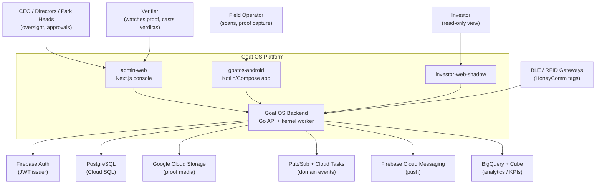

# Goat OS

Goat OS is Mesha's operating system for running a real goat farm end to end. Before it existed, the truth about the herd lived in a dozen scattered places — Google Sheets, Firebase exports, WhatsApp forwards, Slack threads, and files on someone's laptop — and none of them agreed with each other. Goat OS replaces that scattered truth with one governed backend where every goat, every task, every proof video, every vaccination, every movement, and every leadership decision has a single home and an audit trail.

The system is not "a dashboard." It is the **system of record** for herd operations. Each goat gets one permanent passport; dirty records go into review instead of silently becoming truth; field work becomes assigned tasks with proof instead of loose messages; dashboards read clean backend data instead of giant live spreadsheets; and AI can suggest but humans approve the decisions that matter. The repository (`README.md:1`) states the goal plainly: *"No more scattered truth… Every goat, task, proof, health record, movement, sale, device reading, and decision should eventually live in one governed Goat OS backend."*

What makes Goat OS interesting architecturally is that it treats a farm the way a distributed system treats work: as an **event-driven task/ticketing waterfall**. A business event (a kid is born, a load of animals arrives, a vaccine is due) opens a canonical transaction; that transaction assigns a real owner and a business-day clock; the work flows down a task hierarchy with a contact-escalation ladder; the operator captures live-camera proof; a separate verifier signs off; and the result rolls up into the shared command screens. This single "golden chain" (`context/architecture/operational-kernel.md`) is reused by every module — vaccination, weighing, feed, counts, health — so the farm behaves as one interlinked machine rather than a pile of features.

## What it can do

The platform's capabilities span the whole operational life of the farm. Rather than a flat feature list, think of them as answers to the questions a farm manager actually asks each day.

**"Which animal is this, and where is it?"** — The identity spine (`backend/internal/identity`) owns every goat's permanent passport: RFID and old tags, breed, sex, age band, lifecycle stage, and its exact location down to the pen. It reconciles messy imported records, forbids impossible moves (an animal can never hop between parks), and keeps a full timeline of every change with optimistic-concurrency versioning so two edits never silently clobber each other.

**"Is preventive care actually happening?"** — The vaccination engine (`backend/internal/vaccination`, `obligation`, `protocol`, `vaccinationexecution`) turns an authored rulebook into due dates, batches those due dates into operator drives that respect a 200-animals-per-day cap, tracks live execution shed by shed, and repeats the cycle automatically after each dose. Alongside it, PC Care (`backend/internal/pccare`) runs deworming, tick removal, and hoof/hair trimming, and pen visits (`backend/internal/penvisits`) add a next-day verification video as the last step of the care chain.

**"How fast is the herd growing?"** — Weighing (`backend/internal/weighing`) is deliberately the simplest possible thing: scan a tag, enter a weight, record a video, submit. From that stream it computes average daily gain by breed, sex, and stage — while staying rigorously isolated from every other module's data on the write path.

**"How much do we feed, and did it get fed?"** — Feed direction (`backend/internal/feeddirection`) multiplies projected pen head-counts by an authored ration grid to produce exact per-session quantities, freezes the sheet at a dispatch clock, and gates packing, transport, and distribution behind verification videos.

**"Who is in each pen right now?"** — Counts (`backend/internal/counts`) maintains the projected live herd composition from physical scans plus approved movements, runs the births/deaths/shifting approval workflow, and feeds the number of mouths into the feed sheet.

**"Was the work done honestly?"** — Verification (`backend/internal/verification`) is a single cross-module queue where a dedicated verifier watches proof videos and casts approve/reject verdicts. The CEO can set what percentage of each category's videos must actually be watched; the rest auto-accept, so review scales without stalling the work.

**"What should leadership do next, and what does the data say?"** — The command lenses (Control Tower, Action Center, Calendar, Protocol Adherence, Workflows) summarize gaps and next actions, while the read-only leadership assistant (`backend/internal/ceoai`) answers plain-language questions by routing through governed Cube metrics and curated reporting views — never by mutating a thing.

## System context

The diagram below places Goat OS in its ecosystem. Notice the shape: three thin client surfaces (an admin console for leadership and operations control, a native Android field app for operators, and an investor view) all talk to **one** backend, and that backend is the only thing allowed to touch the datastores and cloud services. The clients never read a database, a bucket, or BigQuery directly — they render contracts the backend hands them.

The key design decision visible here is the **single backend authority**. Every visible label, navigation item, page contract, and disabled-reason on both clients is composed by the backend and rendered verbatim; the clients own only layout, CSS, and local UI state. This is why the platform can change what an operator sees without shipping a new app, and why the same "business number" is guaranteed to match across the web console and the phone.

## The thinking behind the technology choices

The stack was chosen for a system that must be correct under concurrency, cheap to run at farm scale, and honest about time. Below is what each layer is and, more importantly, why it earns its place.

| Area | Choice | Why this, and not the obvious alternative |
|------|--------|-------------------------------------------|
| Backend language & runtime | Go 1.25 (`backend/go.mod`) | Strong concurrency primitives and a single static binary per service. The kernel does bounded, chunked sweeps over hundreds of thousands of rows; Go's goroutines + explicit contexts make those safe without a heavyweight framework. |
| Datastore | PostgreSQL via pgx v5 (`backend/migrations/postgres`, 267 tables) | Transactional integrity is the whole point — a state change and the read model it owns must commit together. Postgres gives real transactions, `FOR UPDATE SKIP LOCKED` sweeper claims, generated columns (sampling buckets), and query-plan proofs. A document store would have made the invariants aspirational. |
| Data access | Hand-written SQL + sqlc plan validation | No ORM. Every hot query is plan-checked (`make validate-sqlc-plans`) so a `Seq Scan` on a large table is caught before it ships, not after a latency incident. |
| Event spine | Transactional outbox → Pub/Sub, one registry of consumers (`backend/internal/eventwiring`) | Cross-module coordination must survive retries and never silently drop. The outbox writes the event in the same transaction as the business row; one shared consumer registry prevents the classic bug where a handler is wired on one bus but not another. |
| Admin console | Next.js 16 / React 19, SSR (`apps/admin-web`) | Server-side rendering lets the backend contract arrive at page load and drive every label, so the console stays a renderer. Firebase cookies handle auth at the edge. |
| Field app | Native Kotlin + Jetpack Compose (`apps/goatos-android`) | Field work is offline-first and camera-heavy. Native gives reliable RFID/camera access behind vendor-isolated ports and a Room single-source-of-truth for offline reads. |
| Auth | Firebase-issued JWT verified via JWKS (`backend/internal/bootstrap/api.go:186`) | Both clients already live in Google's identity world; RS256/JWKS verification keeps the backend stateless on auth while permissions are resolved server-side from grants. |
| Time | Asia/Kolkata business calendar (`backend/internal/platform/biztime`) | A farm's day is a *day*, not a UTC instant. Every due/missed/reminder computation converts to IST first; a vaccination drive is a business date, never "now ± N hours." |

The through-line is **compute-on-write, not compute-on-read**. Derived truth is materialized when data changes and served by an indexed lookup, because a god-query that reconstructs state per request is fast at a thousand rows and fatal at a million. The current release is sized for a 5,000–50,000-animal envelope (`docs/decisions/operational-kernel-5k-50k-scale-envelope.md`), with query-plan proof required up to roughly 500k obligation rows and a 1–5M-animal topology kept as a future certification bar.

## What Goat OS is, and what it deliberately is not

Understanding the boundaries matters as much as the capabilities, because several of them are hard, recorded product decisions rather than "not built yet."

**What it is.** A governed source of record for herd identity, preventive care, weighing, feed, counts/movement, health, procurement/sales, verification, devices, and read-only analytics — knit together by one operational kernel and one verification queue, served to a web console and a native field app that render backend-owned contracts.

**What it deliberately does not do.** It does not let a client invent business truth — the phone and web are renderers, and a cross-surface number disagreement is a backend bug, never a client fix. It does not let weighing know what animal a tag belongs to on the write path — weighing is isolated by design so a free-flow scan can never be gated on the herd register. It does not let the party being checked approve their own work — verdict authority belongs to the verifier alone, and leadership reads results without signing them. It does not calculate payroll from breaches — the kernel completes attribution, notice, and appeal but never touches salary. And it does not scatter deployment across GitHub Actions PRs — staging ships through a Slack-triggered Cloud Build path, deliberately.

These lines are enforced by machine guards (`make weighing-free-flow-guard`, `make scale-guard`, `make operational-read-model-contract-guard`, and dozens more) so that a well-meaning future change cannot quietly cross them.
