# System Architecture Documentation — GoatOS

**Document Version:** 1.0
**Date:** 2026-09-13
**Scope:** Container-level C4 architecture description of the GoatOS livestock farm management platform

---

## 1. Architecture Overview

### 1.1 Architecture Design Philosophy

GoatOS digitizes end-to-end goat farm operations — animal health, feeding, vaccination, procurement/sales, workforce scheduling, IoT herd monitoring, and executive analytics — across multiple physical farm sites. The architecture is driven by three foundational realities of the domain:

1. **The business is naturally decomposable into many narrow, well-bounded capabilities** (identity, vaccination, feed direction, weighing, counts, procurement, verification, notifications, etc.), which favors a Domain-Driven-Design-style decomposition rather than a single undifferentiated CRUD backend.
2. **Field data capture happens in low-connectivity rural environments**, which mandates an offline-first client architecture with guaranteed eventual delivery, mirrored by a reliable server-side event backbone.
3. **Data trustworthiness is a first-class business concern.** Because operational decisions (health interventions, payroll, investor reporting) depend on field-reported data, a pervasive "verification and process integrity" capability is woven through nearly every operational domain rather than bolted on as an afterthought.

To answer these forces, the engineering team chose a **modular monolith** written in Go, internally structured with strict **hexagonal (ports-and-adapters) architecture**, rather than a microservices topology. This gives the benefits of clear domain boundaries and independent internal evolution, while avoiding the operational overhead of running 45+ separately deployed services. Loose coupling between bounded contexts is achieved not through network service boundaries but through an in-process module boundary discipline **plus** a genuine transactional **Outbox + Pub/Sub event bus** for cross-domain integration — a deliberate hybrid that trades some compile-time coupling for much simpler operations.

### 1.2 Core Architecture Patterns

| Pattern | Purpose | Where Applied |
|---|---|---|
| **Hexagonal / Ports-and-Adapters** | Isolate business rules from I/O concerns (HTTP, Postgres, Pub/Sub, external APIs) | Uniformly across 45+ modules in `backend/internal/*` |
| **Modular Monolith** | Single deployable binary hosting many bounded contexts, avoiding microservice operational overhead | `backend/cmd/api` + `backend/internal/bootstrap` |
| **Transactional Outbox + Event Relay** | Guarantee reliable, decoupled, at-least-once cross-domain event delivery | `outbox`, `domainconsumer`, `cmd/outbox-relay`, `cmd/outbox-dlq` |
| **CQRS-style Analytics Split** | Separate OLTP write path from OLAP read/reporting path | Cube.js semantic layer over Postgres, consumed by dashboards and CEO AI |
| **Offline-First Edge Sync** | Guarantee field data capture despite intermittent connectivity | Android `core-database` (Room `OutboxDatabase`) |
| **Backend-for-Frontend (BFF)** | Each web client aggregates/proxies backend calls through its own server-side layer | `apps/admin-web/app/api/*`, `apps/investor-web-shadow/app/api/*` |
| **Job/Worker Decomposition** | Keep the always-on API lean; push batch/maintenance logic into independently scheduled binaries | 60+ binaries under `backend/cmd/*`, deployed as Cloud Run Jobs |
| **Infrastructure as Code** | Reproducible, auditable provisioning of cloud resources | Terraform under `infra/envs/{dev,stg}` |
| **Schema-First Contracts** | Reduce client/server drift across 4 client surfaces | `contracts/openapi`, `contracts/jsonschema` |

### 1.3 Technology Stack Overview

| Layer | Technology |
|---|---|
| Backend language/runtime | Go, single module, compiled into ~60 independent binaries |
| Backend persistence | PostgreSQL (Cloud SQL) via `pgx` driver + `sqlc` generated repositories |
| Messaging/eventing | Transactional Outbox pattern → Google Cloud Pub/Sub |
| Analytics/OLAP | Cube.js semantic layer, backed by Postgres, exported to BigQuery |
| AI/LLM | Google Vertex AI, orchestrated by the `ceoai` module |
| Admin/investor web | Next.js (React), server-side BFF API routes |
| Native mobile (field) | Android (Kotlin), multi-module Gradle project, Room local database |
| Operator mobile (lightweight) | Cross-platform mobile app sharing `forms-dsl` / `mobile-forms-runner` packages |
| Auth | Firebase Authentication (email/password, Google OAuth) |
| Push notifications | Firebase Cloud Messaging |
| Object storage | Google Cloud Storage (proof media) |
| Observability | OpenTelemetry, Grafana Alloy, Grafana dashboards |
| Infra provisioning | Terraform (`infra/envs/dev`, `infra/envs/stg`) |
| Compute platform | Google Cloud Run (Services + Jobs) |

---

## 2. System Context

### 2.1 System Positioning and Value

GoatOS replaces manual and spreadsheet-based livestock tracking with structured, auditable digital workflows. Its value proposition centers on:

- **Operational digitization**: animal health, feeding, vaccination, procurement/sales, and workforce scheduling are captured through structured, verifiable workflows instead of ad hoc paper/spreadsheet records.
- **Process integrity enforcement**: a pervasive verification layer certifies field-reported data (proof photos/videos, sampling review, SOP adherence) before it is trusted downstream, directly reducing mortality risk and improving feed efficiency through better data quality.
- **Leadership visibility**: an investor-facing dashboard and a conversational "CEO AI" assistant give executives real-time, grounded access to farm KPIs (counts, mortality, feed cost, births) without waiting on manual reporting cycles.

### 2.2 User Roles and Scenarios

| Role | Primary Surface | Key Needs |
|---|---|---|
| **Farm Operators / Field Workers** | Android app, Operator Mobile app | Fast RFID-based animal ID, offline-capable capture, simple SOP-driven checklists, photo/video proof capture, multi-language UI (Hindi, Kannada, Telugu) |
| **Farm Administrators / Managers** | Admin Web (Next.js) | Centralized operations dashboard, approval workflows (leave, tasks, verification), roster scheduling, DLQ/audit monitoring, vendor & procurement management |
| **Executives / Investors** | Admin Web (CEO AI chat), Investor Web Dashboard | Conversational AI querying, read-only KPI dashboards (mortality, births, feed cost, counts), cross-farm trend visibility |
| **Verification / QA Personnel** | Admin Web (verification review features) | Review queues, sampling tools, protocol adherence tracking |

### 2.3 External System Interactions

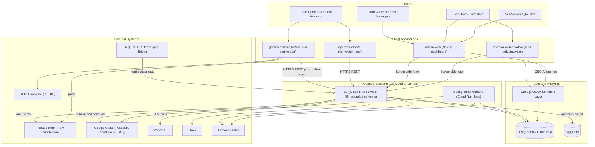

External systems and their roles:

| System | Interaction Type | Purpose |
|---|---|---|
| **Firebase** | Auth, Push, Distribution | Email/Google OAuth authentication, FCM push notifications, app distribution |
| **Google Cloud Platform** | Messaging, Storage, Warehousing | Pub/Sub (outbox relay), Cloud Tasks, GCS (proof media), BigQuery (analytics export) |
| **PostgreSQL (Cloud SQL)** | Primary datastore | OLTP persistence for virtually all bounded contexts via `pgx`/`sqlc` |
| **Cube.js** | OLAP semantic layer | Governed cube/measure definitions for census, mortality, and financial reporting |
| **Vertex AI** | LLM service | Question decomposition, planning, and answer synthesis for CEO AI |
| **MQTT/UDP Herd Signals Bridge** | IoT ingestion | Smart-tag sensor data ingestion for herd activity monitoring |
| **RFID Hardware** | Device integration | Bluetooth HID keyboard-wedge readers for animal identification |
| **Slack** | Legacy import / notifications | Legacy feed data import, deployment bot notifications |
| **Grafana** | Observability | Dashboards for API RED metrics, DB health, kernel pipeline, mobile, frontend RUM, SLO burn |

### 2.4 System Boundary Definition

**In scope:**
- Go backend with 45+ bounded-context modules (identity, health, feed, vaccination, sales, procurement, workforce, verification, notification, outbox, CEO AI, etc.)
- Admin web app (operations management, approvals, analytics, CEO AI chat)
- Android native app (RFID, offline sync, media capture)
- Operator mobile app (lightweight form-driven task capture)
- Investor web dashboard (read-only analytics)
- Cube.js analytics model layer
- Shared packages (`api-client`, `device-client`, `forms-dsl`, `media-client`, `mobile-forms-runner`)
- Infrastructure-as-code and deployment configuration
- Backend batch jobs/CLI tools for backfills, seeding, reconciliation

**Explicitly out of scope:**
- Training or hosting of the AI model itself (Vertex AI is consumed, not built)
- Physical RFID/IoT hardware manufacturing
- External vendor/procurement systems beyond data-import integration
- Payment processing (no evidence found in the codebase)
- Native iOS app (only Android is evidenced as the native mobile client)

---

## 3. Container View

### 3.1 Domain Module Division

The backend is organized into 45+ bounded-context modules grouped into ten conceptual domain families, plus four presentation-tier client applications and shared infrastructure/tooling.

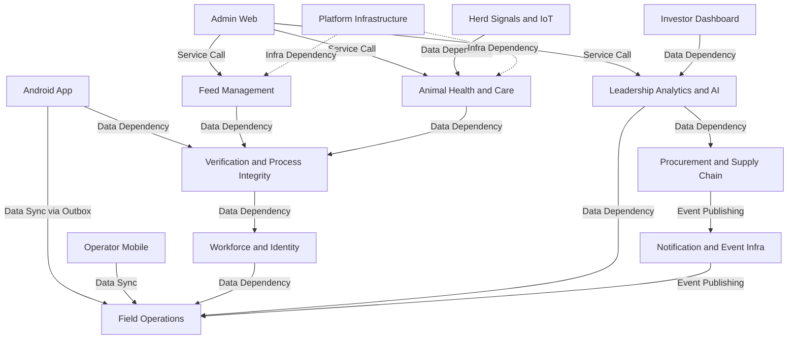

| Domain Group | Type | Representative Modules | Role |
|---|---|---|---|
| Animal Health & Care | Core Business | `identity`, `health`, `vaccination`, `vaccinationexecution`, `pccare`, `toxin`, `growthdirector`, `passport` | Clinical backbone: identity, vaccination programs, preventive care, toxin tracking, growth planning |
| Feed Management | Core Business | `feed`, `feeddirection`, `feedconfig`, `feedwaterremoval` | Ration configuration, daily feed-direction generation, issue/amend/lock lifecycle |
| Field Operations | Core Business | `tasks`, `workboard`, `leadershiptasks`, `penvisits`, `calendar`, `weighing`, `counts`, `countsbridge` | Task assignment, census counting, weighing, scheduling |
| Verification & Process Integrity | Supporting | `verification`, `verificationcatalog`, `processintegrity`, `protocol`, `operationsaudit`, `proof`, `sop`, `sopbridge` | Cross-cutting data-quality certification consumed by nearly all operational domains |
| Procurement & Supply Chain | Core Business | `procurement`, `sales`, `inventory` | Vendor purchasing, inventory reconciliation, sales |
| Workforce & Identity | Supporting | `workforce`, `permissions`, `adminui` | Roster/shift scheduling, leave, access control |
| Herd Signals & IoT | Core Business | `herdsignals`, `movement`, `locations`, `parkscope` | MQTT/UDP ingestion of sensor data, location hierarchy |
| Notification & Event Infra | Infrastructure | `notification`, `notificationaudience`, `notificationbridge`, `outbox`, `domainconsumer`, `eventwiring`, `bulkstatus` | Transactional outbox, Pub/Sub relay, notification dispatch, idempotency |
| Leadership Analytics & AI | Core Business | `ceoai` (54 files), `appanalytics`, Cube.js model | Question decomposition, guarded read-only tool execution, Vertex AI synthesis |
| Platform Infrastructure | Infrastructure | `platform/{auth,postgres,observability,eventbus,taskqueue,...}`, `bootstrap`, `kernelstages`, `appconfig` | Shared cross-cutting libraries consumed by all modules |

### 3.2 Domain Module Architecture (Hexagonal Shape)

Every bounded-context module follows an identical internal shape — this uniformity is the strongest architectural convention in the codebase.

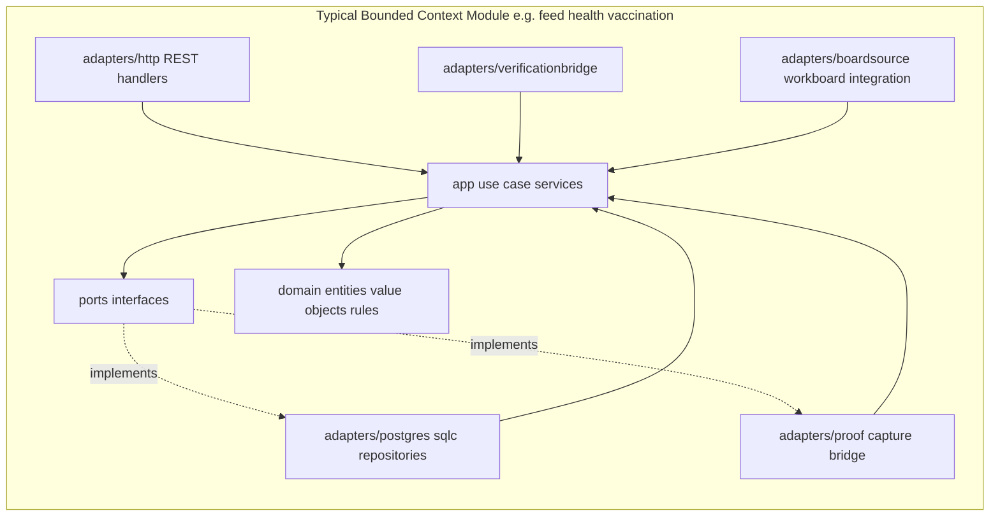

- **`domain/`** — Pure business entities, value objects, and invariants; free of I/O concerns.
- **`app/`** — Use-case orchestration services consumed by adapters; depends only on `ports` interfaces.
- **`ports/`** — Interface definitions that decouple `app` from concrete infrastructure.
- **`adapters/`** — Concrete implementations: HTTP handlers, Postgres/sqlc repositories, Pub/Sub publishers, proof/verification bridges.

This uniformity dramatically lowers onboarding cost: an engineer who understands one module's `domain/app/ports/adapters` layout can navigate any of the other 44 modules with minimal ramp-up.

### 3.3 Storage Design

| Store | Technology | Purpose |
|---|---|---|
| **Primary OLTP database** | PostgreSQL (Cloud SQL) | System of record for nearly all bounded contexts; accessed via `pgx` driver with `sqlc`-generated type-safe repositories |
| **Outbox table** | PostgreSQL (same instance, transactional) | Guarantees atomic write of domain state + outbound event in a single transaction |
| **OLAP semantic layer** | Cube.js (backed by Postgres) | Governed cube/measure definitions (e.g., `animals.yml`) for census, mortality, financial reporting; shared by CEO AI and Investor Dashboard |
| **Data warehouse export** | BigQuery | Downstream analytics warehousing for deeper historical/ad-hoc analysis |
| **Proof media storage** | Google Cloud Storage (with local fallback) | Durable storage of photo/video proof captured in the field |
| **Local mobile database** | Room/SQLite (Android) | `GoatDatabase` (domain caches, bootstrap cache) + `OutboxDatabase` (pending sync queue) enabling offline-first operation |
| **Secrets** | Google Secret Manager | Credential and API key management for Cloud Run services/jobs |

### 3.4 Inter-Domain Module Communication

Two complementary communication styles coexist:

1. **Synchronous, in-process calls** — Within the single Go binary, an `app` service in one module can call a `ports` interface backed by another module's exposed service (used sparingly, mostly for shared read models like locations/permissions).
2. **Asynchronous, event-driven communication** — The dominant pattern for cross-domain integration. A domain module writes its state change and an outbox row **in the same database transaction**; a separate relay process polls the outbox and publishes to Google Cloud Pub/Sub; a dedicated consumer process fans events out to interested downstream modules (notifications, counts bridge, SOP bridge).

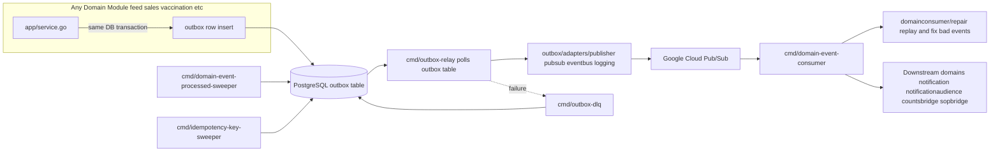

This is a genuine, production-grade transactional outbox implementation — not merely a naming convention — complete with dead-letter handling, sweeper jobs for cleanup, and a repair pipeline for replaying malformed events.

---

## 4. Component View

### 4.1 Core Functional Components

#### 4.1.1 Animal Health & Care

Manages the full clinical lifecycle: canonical animal identity and health records, vaccination plan design and execution, preventive care ("PCCare") task orchestration, toxin exposure tracking, and growth trajectory direction. This is the platform's clinical backbone and the highest-importance domain (9.5/10), since livestock wellbeing directly determines farm profitability.

#### 4.1.2 Feed Management

The operational core for daily feeding decisions. The signature `feeddirection` sub-module implements a "thin orchestration, bounded reads" pattern: shed scope filtering → feed config snapshot batch-read → in-memory grain-projection generation → issue/amend/lock lifecycle. This separation of pure generation logic (`service.go`) from state-machine lifecycle management (`lifecycle.go`) is a reusable architectural template that other generation-heavy domains (vaccination obligations, growth direction) could adopt.

#### 4.1.3 Field Operations & Task Execution

Coordinates day-to-day work: task/workboard assignment, leadership task tracking, pen visits, calendar-based scheduling, weighing, and census counts. This domain is the primary integration point between Android/operator-mobile field capture and backend verification.

#### 4.1.4 Verification & Process Integrity (Supporting, but Structurally Central)

Does not own primary business data but acts as a **mandatory cross-domain gatekeeper**. Nearly every operational domain (feed, health, weighing, counts, pen visits, PCCare, procurement, toxin) integrates with the same `proof`, `verification`, and `boardsource` adapter shapes to certify data quality before it is trusted downstream. Sub-components:

- **Verification Review** — Review queues and sampling logic for field-reported data.
- **Process Integrity** — Protocol adherence tracking and compliance scoring.
- **Protocol Management** — Rule definitions and rule lineage.
- **Operations Audit** — Audit trail and dead-letter-queue monitoring.
- **Proof Capture & Media** — Central proof upload/storage/retrieval (GCS/local) shared across all task-execution domains.
- **SOP Management** — Standard Operating Procedure definitions via a form DSL, with domain classification and trigger determination.

#### 4.1.5 Procurement & Supply Chain

Vendor management, source-entry loads, inventory batch reconciliation, and sales (including farm-value computation), publishing domain events via the outbox for downstream notification and analytics consumption.

#### 4.1.6 Workforce & Identity Management

Roster/shift coverage, leave approval workflows, position/duty assignment, person-identity linkage, and permission enforcement — determines who is scheduled and authorized for field operation tasks.

#### 4.1.7 Herd Signals & IoT Monitoring

Bridges MQTT/UDP IoT protocols into structured domain events (tag mapping, activity timelines), tracks animal movement, and manages the location/park-scope hierarchy consumed by feed, health, and analytics domains.

#### 4.1.8 Leadership Analytics & AI Assistant (CEO AI)

The most architecturally elaborate single bounded context (54 Go files). Structured as a **guarded read-only tool execution loop** rather than a generic chatbot:

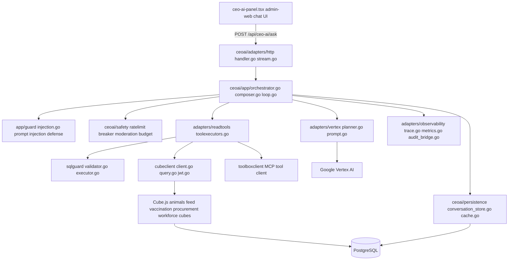

Notably, the safety/guard layer (`sqlguard/validator.go` at 27KB, plus `injection.go`, `breaker.go`, `moderation.go`, `budget.go`, `retention.go`) is proportionally larger than the orchestration logic itself — a deliberate, security-conscious design choice for LLM-driven data access over production business data.

### 4.2 Technical Support Components

| Component | Responsibility |
|---|---|
| **Platform Cross-Cutting Utilities** (`backend/internal/platform`) | Auth middleware, observability/tracing, Postgres connection management, task queue abstraction — consumed uniformly by all 45+ modules |
| **Bootstrap & Kernel Stages** (`backend/internal/bootstrap`, `kernelstages`) | Sequences application startup, wires every domain's HTTP/Postgres/app packages into the single `cmd/api` binary (`bootstrap/api.go`, ~90KB) |
| **App Configuration** (`backend/internal/appconfig`) | Centralized config CRUD and distribution to admin/mobile clients |
| **Migrations & Seed Tooling** (`backend/migrations`, `cmd/migrate`, `cmd/seed-*`, `cmd/backfill-*`) | Schema migration execution, environment seeding, data repair |
| **Outbox & Domain Event Bus** | Reliable event publishing/consumption backbone (detailed in §3.4) |
| **Shared Client Packages** (`packages/api-client`, `device-client`, `media-client`, `forms-dsl`, `mobile-forms-runner`) | Cross-application typed API clients, device/media abstraction, form DSL parsing/execution shared by web and mobile clients |
| **Contracts & Schemas** (`contracts/openapi`, `contracts/jsonschema`) | Schema-first API contracts reducing drift between Go backend and TS/Kotlin clients |
| **Developer & Operational Tooling** (`tools/`) | CI automation, contract validation, data repair scripts, telemetry/scale guardrails |

### 4.3 Component Responsibility Division

The responsibility split follows a consistent rule: **domain modules own business rules and lifecycle state; the Verification domain owns trust certification; the Notification/Outbox infrastructure owns reliable cross-domain propagation; Platform Infrastructure owns non-functional cross-cutting concerns (auth, observability, persistence primitives); and CEO AI owns synthesis/insight generation over already-certified data.** No module directly writes into another module's tables — all cross-domain effects are either synchronous read-only queries through exposed ports or asynchronous events through the outbox.

### 4.4 Component Interaction Relationships

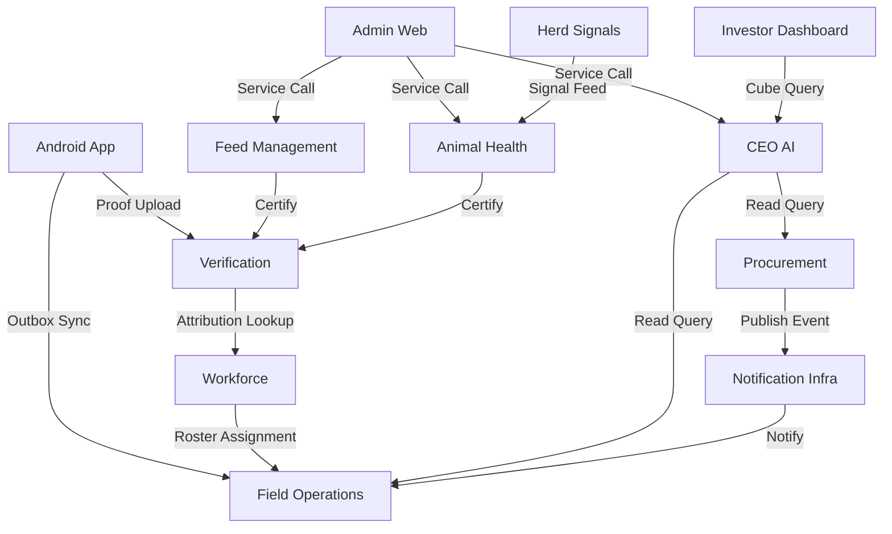

---

## 5. Key Processes

### 5.1 Core Functional Process: Field Task Execution & Proof Verification

This is GoatOS's signature cross-cutting workflow, underpinning feed distribution, preventive care, vaccination execution, weighing, and pen visits alike.

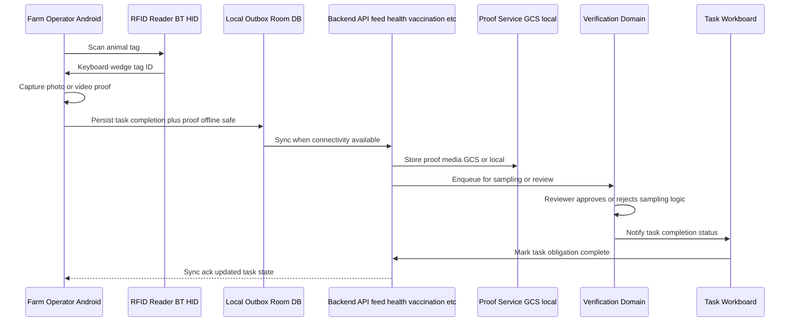

Key implementation touchpoints: `backend/internal/proof/adapters/storage/{gcs,local}`, `backend/internal/verification/adapters/{boardsource,proofmedia}`, and per-domain `adapters/verificationbridge` packages present in `feed`, `health`, `pccare`, `tasks`, `weighing` — confirming this bridge is a repeated integration contract, not a one-off implementation.

### 5.2 Technical Processing Workflow: Feed Direction Generation & Distribution

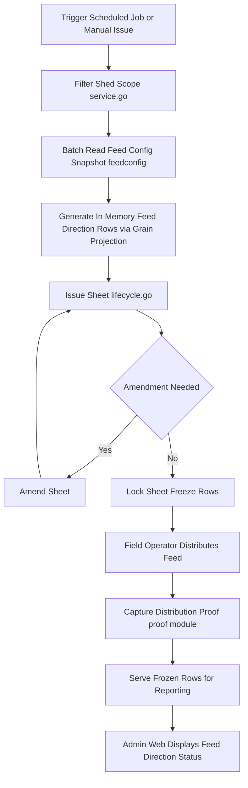

### 5.3 Data Flow: CEO AI Leadership Query

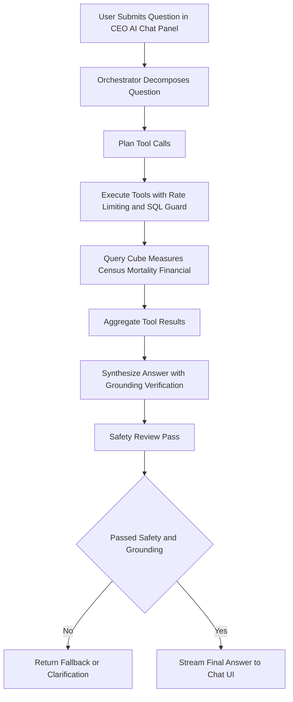

### 5.4 Data Flow: Vaccination Program Execution

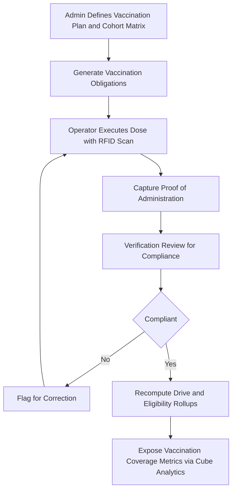

### 5.5 Exception Handling Mechanisms

| Failure Scenario | Handling Mechanism |
|---|---|
| **Device offline during field capture** | Local Room `OutboxDatabase` persists writes; sync retried automatically when connectivity resumes |
| **Outbox publish failure** | `cmd/outbox-dlq` routes failed messages to a dead-letter queue for inspection/replay |
| **Malformed or partially processed domain events** | `domainconsumer/repair` sub-package supports replay and correction of bad events |
| **Duplicate/retry event delivery** | `cmd/idempotency-key-sweeper` and `bulkstatus` domain enforce idempotency across async workflows |
| **Verification rejection** | Rejected submissions are flagged for rework and routed back to the operator via the Notification domain, re-entering the capture loop |
| **Stale processed events** | `cmd/domain-event-processed-sweeper` periodically cleans up processed outbox rows |
| **AI safety/grounding failure** | CEO AI orchestrator returns a fallback/clarification response rather than an ungrounded answer, gated by `safety/{injection,breaker,moderation,budget}` |
| **Force-required mobile app update** | Android bootstrap state machine intercepts startup and routes to an APK download/install flow before allowing further app use |

---

## 6. Technical Implementation

### 6.1 Core Module Implementation: Feed Direction Lifecycle

The `feeddirection` module exemplifies the "thin orchestration with bounded reads" design pattern:

- **`service.go`** performs three-step bounded reads: (1) filter shed scope, (2) batch-read a feed configuration snapshot, (3) generate in-memory feed direction rows via grain projection — deliberately avoiding row-by-row database chatter in favor of batched reads followed by pure in-memory computation.
- **`lifecycle.go`** manages a separate issue → amend → lock state machine, decoupled from the generation logic itself, allowing the sheet's operational status to evolve independently of how rows were computed.
- This separation of "computation" from "lifecycle state" is called out in the workflow research as a reusable template that could — and arguably should — be extracted and applied to other generation-heavy domains such as vaccination obligation generation and growth direction planning, since those domains currently reimplement a similar "generate → execute → verify → recompute rollups" cycle independently.

### 6.2 Key Algorithm Design: CEO AI Guarded Tool Execution Loop

The `ceoai` orchestrator implements a bounded, safety-gated reasoning loop rather than an open-ended LLM agent:

1. **Decomposition** — incoming natural-language questions are decomposed into sub-questions and a tool-call plan (`orchestrator.go`, `composer.go`).
2. **Guarded execution** — each planned tool call passes through `app/guard` (prompt-injection defense) and `safety` (rate limiting, circuit breaker, moderation, budget enforcement) before execution.
3. **SQL guarding** — any generated SQL against Cube.js/Postgres is validated by `sqlguard/validator.go` (the single largest file in the module at 27KB), enforcing read-only, bounded, and schema-conformant queries.
4. **Grounded synthesis** — results are aggregated and the final answer is synthesized only after a grounding-verification pass; failures return a fallback/clarification rather than a hallucinated answer.
5. **Observability** — every step is traced via `adapters/observability` (trace.go, metrics.go, audit_bridge.go), enabling post-hoc audit of what data was accessed and how an answer was derived.

This "guardrails-larger-than-orchestration" design is a deliberate security posture appropriate for LLM-driven access to sensitive operational and financial data.

### 6.3 Data Structure Design: Transactional Outbox

The outbox pattern is implemented with the following structural guarantees:

- An **outbox table row** is inserted in the **same database transaction** as the domain state mutation (`domain/types.go` in each writing module), guaranteeing atomicity between business state and the intent to publish an event.
- A dedicated relay process (`cmd/outbox-relay`) polls this table and publishes via pluggable adapters (`outbox/adapters/publisher/{pubsub,eventbus,logging}`), allowing the publish mechanism to be swapped (e.g., for local development, a logging publisher can replace Pub/Sub).
- Consumers (`cmd/domain-event-consumer`, backed by `domainconsumer/app`) process events idempotently and support a `repair` sub-package for replaying or correcting malformed events.
- Cleanup is handled by two independent sweeper jobs (`domain-event-processed-sweeper`, `idempotency-key-sweeper`), keeping the outbox table from growing unbounded while preserving idempotency guarantees.

### 6.4 Performance Optimization Strategies

| Strategy | Rationale |
|---|---|
| **Batched configuration reads** in feed direction generation | Avoids N+1 query patterns when generating sheets across many sheds/animals |
| **In-memory row generation before persistence** | Reduces transactional lock contention during the compute-heavy generation phase |
| **CQRS-style OLAP split via Cube.js** | Prevents analytics-heavy queries (mortality trends, coverage rollups) from competing with OLTP write traffic on the primary Postgres instance |
| **Independent Cloud Run Jobs for batch/maintenance work** | Keeps the always-on `api` service lean and responsive by moving backfills, reconcilers, and rollup recomputation into separately scaled/scheduled workloads |
| **Offline-first local caching (Android Room DB)** | Eliminates network round-trip latency for field operators during task execution; sync happens asynchronously |
| **Rate limiting and circuit breaking in CEO AI** | Protects both the Vertex AI budget and the underlying Postgres/Cube.js query load from runaway or abusive query patterns |

---

## 7. Deployment Architecture

### 7.1 Runtime Environment Requirements

- **Backend**: Go binaries compiled and containerized for deployment to Google Cloud Run (both long-running Services and on-demand/scheduled Jobs).
- **Database**: PostgreSQL, provisioned as Google Cloud SQL, sized to support both OLTP transactional load and being the source database for the Cube.js OLAP layer.
- **Messaging**: Google Cloud Pub/Sub topics/subscriptions for the outbox relay and domain event consumer.
- **Object storage**: Google Cloud Storage buckets for proof media.
- **Web clients**: Next.js applications (`admin-web`, `investor-web-shadow`) requiring a Node.js server-side runtime for their BFF API routes.
- **Mobile clients**: Android (Kotlin/Gradle, multi-module) requiring Google Play Services (FCM) and Bluetooth HID support for RFID integration; the operator-mobile app requires its own (currently unconfirmed) cross-platform runtime.

### 7.2 Deployment Topology Structure

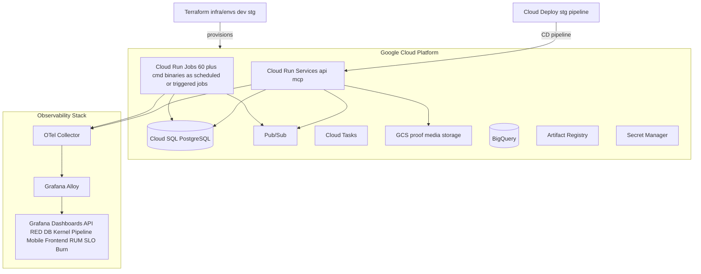

The `backend/cmd/` directory reveals the true deployment topology: **one always-on API server** (`cmd/api`) plus **~60 independent job/worker binaries**, all sharing the same domain modules but composed differently at `main()`:

- **Always-on service**: `cmd/api` (wires all 45+ domain HTTP handlers via `bootstrap.NewAPI`)
- **Event bus workers**: `cmd/outbox-relay`, `cmd/outbox-dlq`, `cmd/domain-event-consumer`, `cmd/domain-event-processed-sweeper`
- **Async task processors**: `cmd/kernel-worker`, `cmd/obligation-sweeper`, `cmd/bulk-status-worker`, `cmd/notification-dispatcher`, `cmd/notification-requeue`
- **Scheduled domain batch jobs**: `cmd/generate-vaccination-obligations`, `cmd/recompute-vaccination-drives`, `cmd/vaccination-eligibility-rollup-recompute`
- **IoT ingestion bridges**: `cmd/herd-signals-mqtt-bridge`, `cmd/herd-signals-udp-bridge`, `cmd/herd-signals-partition-maintenance`
- **Data migration/repair tooling**: `cmd/import-*`, `cmd/seed-*`, `cmd/backfill-*`
- **AI tool support**: `cmd/mcp` (Model Context Protocol server for CEO AI tool execution)
- **Schema management**: `cmd/migrate`

Each is provisioned by Terraform (`infra/envs/{dev,stg}/cloud_run_jobs.tf`, `cloud_run_worker.tf`, `cloud_run_services.tf`) as an independently scalable/schedulable Cloud Run Service or Job — the "single Go module, multiple deployables" pattern gives independent operational control without the coordination cost of a full microservices split.

### 7.3 Scalability Design

- **Horizontal scaling of the API service**: Cloud Run natively scales `cmd/api` instances based on request load; because the service is stateless (all state lives in Postgres/Pub-Sub), this scales linearly without sticky-session concerns.
- **Independent worker scaling**: Because batch/event-processing logic lives in separate Cloud Run Jobs rather than inside the API process, high-volume event backlogs (e.g., a burst of vaccination obligation generation) can be scaled or scheduled independently without impacting API latency.
- **OLAP isolation**: Cube.js provides a natural scaling boundary for read-heavy analytical queries, insulating the OLTP Postgres instance used by the write path.
- **Domain module extensibility**: New bounded contexts can be added by following the established `domain/app/ports/adapters` template and wiring into `bootstrap.NewAPI`, though this does increase the size of the central wiring file (`bootstrap/api.go`, ~90KB) — a scaling limit on *maintainability* rather than runtime performance.
- **Client-side scaling**: The Android app's offline-first design decouples field-operator throughput from backend/network availability, effectively scaling the "write" side of the system to match rural connectivity realities rather than requiring the backend to guarantee low latency to every field device.

### 7.4 Monitoring and Operations

- **Observability pipeline**: OpenTelemetry instrumentation in both `cmd/api` and Cloud Run Jobs feeds into Grafana Alloy, which populates purpose-built Grafana dashboards:
  - **API RED metrics** (Rate, Errors, Duration)
  - **Database health**
  - **"Kernel pipeline"** (background job processing throughput/latency)
  - **Mobile client telemetry**
  - **Frontend Real User Monitoring (RUM)**
  - **SLO burn-rate tracking**
- **Operational audit surfaces**: The admin-web `operations-audit` and `operations-dlq` features expose audit trails and dead-letter-queue monitoring directly to farm administrators/operations staff, closing the loop between backend reliability engineering and human operational oversight.
- **Infrastructure-as-Code discipline**: Two Terraform-managed environments (`dev`, `stg`) cover secret management, BigQuery, IAM, Pub/Sub, Cloud SQL, Cloud Run, and GCS provisioning — though notably **no `prod` Terraform environment was found** in the inspected repository, which is flagged as a documentation/process gap (see §7.5).
- **CD pipeline**: Cloud Deploy manages the staging release pipeline (`deploy/clouddeploy/stg`) promoting built artifacts from Artifact Registry into Cloud Run.

### 7.5 Architectural Risks and Recommendations for Operations Teams

| Risk | Impact | Recommendation |
|---|---|---|
| `apps/admin-web/lib/api/server.ts` is ~216KB — the single largest source file in the repository | High merge-conflict surface; hard to test in isolation; couples all admin-web features to one file | Continue the decomposition already begun (e.g., `procurement-server.ts`, `herd-signals.ts`) into per-domain client modules |
| `bootstrap/api.go` (~90KB) must import and wire all 45+ domains | Compile-time coupling despite runtime decoupling via outbox; slows builds and increases review surface for unrelated changes | Consider enforcing module boundaries via dependency-boundary tooling (e.g., `tools/agent-hooks/check-boundaries.sh`) actively in CI |
| No prose-form Architecture Decision Records found (`docs/architecture` empty; `context/architecture` contains only `domain-event-registry.json`) | Architectural rationale (why hexagonal, why one binary, why per-domain verification bridges) is implicit rather than documented | Establish `docs/decisions/` as the canonical ADR home and cross-link from `docs/architecture` |
| No `prod` Terraform environment found under `infra/envs` | Unclear whether production is managed elsewhere or missing from IaC coverage | Explicitly document the production deployment strategy, whether in this repo or a separate one |
| Local-stack guard logic (git shell-outs) embedded directly in `cmd/api/main.go` | Couples the production binary to development-environment safety checks | Extract into a build-tag-gated dev-only package |
| `operator-mobile` underlying framework not confirmed from directory structure | Documentation gap in an otherwise well-documented client fleet | Inspect `apps/operator-mobile/package.json`/build config and document alongside Android/Next.js stacks |

---

## 8. Summary

GoatOS is best characterized as a **domain-rich modular monolith** that applies hexagonal architecture discipline uniformly across 45+ livestock-management bounded contexts, decoupled at runtime through a genuinely production-grade transactional outbox/Pub-Sub event bus, and extended by a security-conscious AI analytics layer (CEO AI) built atop a governed Cube.js semantic model. Four client surfaces — admin web, Android, operator-mobile, and the investor dashboard — each consume the backend through their own BFF or direct REST layer, with the Android app's offline-first outbox mirroring the backend's own reliability pattern at the network edge. The system's cross-cutting "Verification & Process Integrity" concern acts as a shared trust gate for nearly every operational workflow, ensuring that downstream analytics and leadership-facing insights are built on certified, protocol-compliant data. The architecture's principal risks are not structural but scale-related — a handful of large "aggregator" files (the admin-web API client, the bootstrap wiring file, the CEO AI orchestrator) concentrate coupling and warrant ongoing decomposition discipline as the platform continues to add bounded contexts and client surfaces.