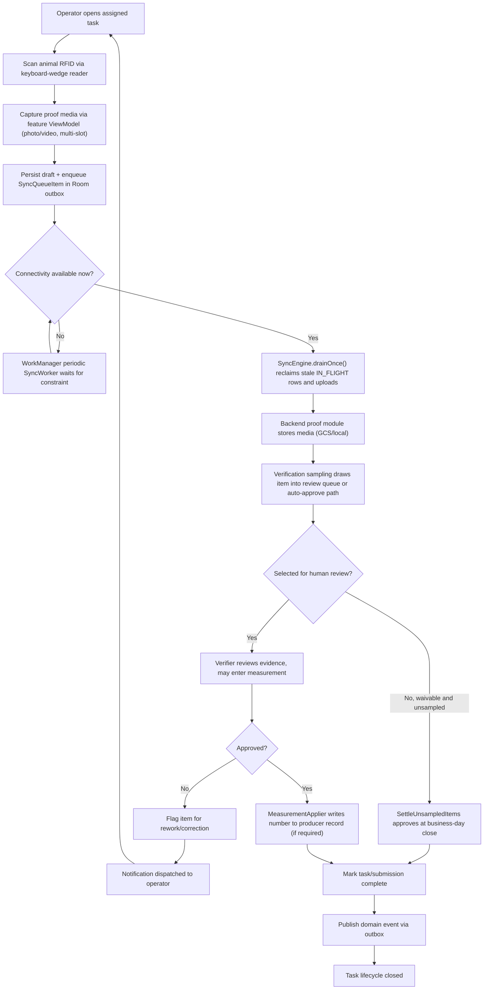
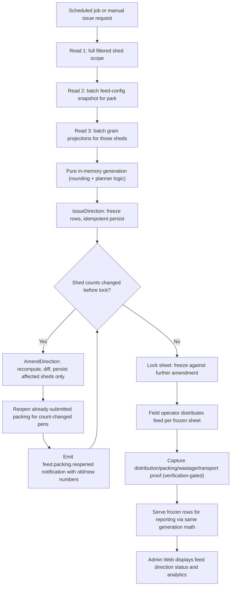
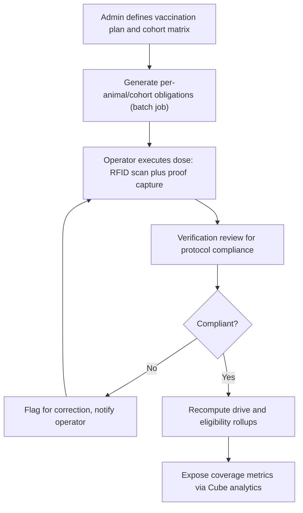
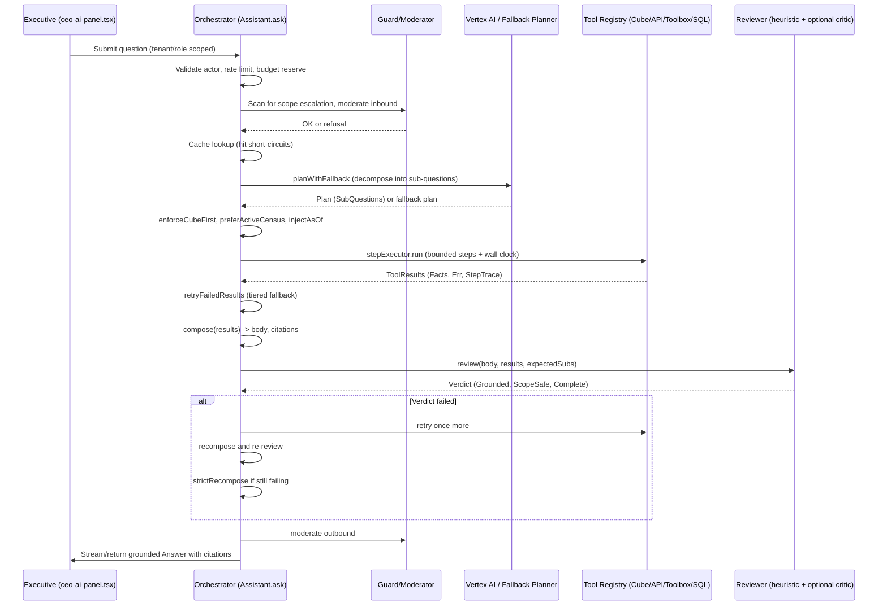
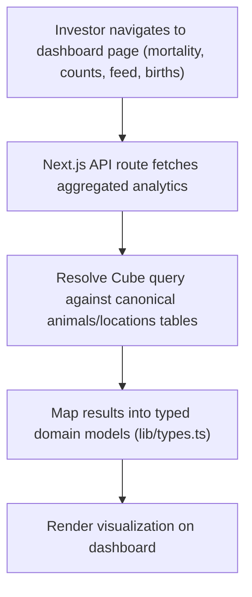
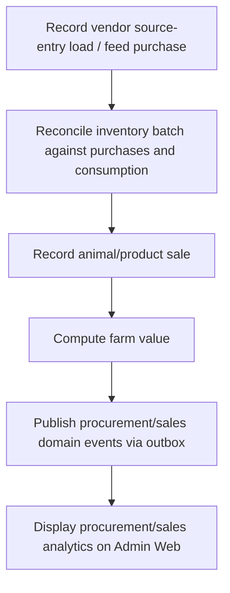
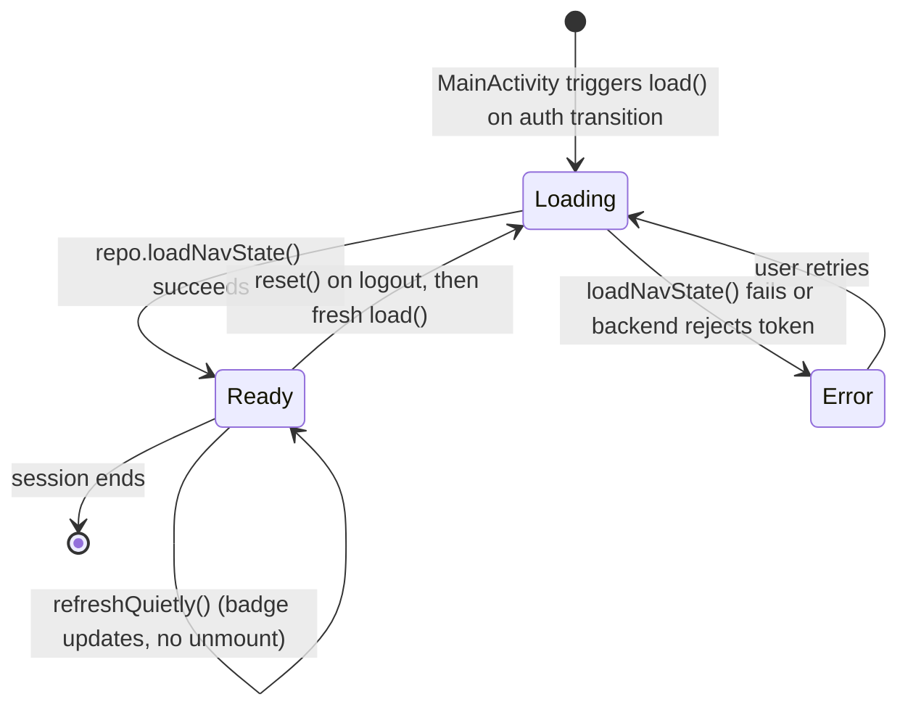

I now have comprehensive detail across all core workflows. Let me write the complete documentation.

# Core Workflows

## 1. Workflow Overview

GoatOS orchestrates livestock farm operations across four presentation surfaces (Android field app, admin web, investor dashboard, operator mobile) sitting on top of a 40+ bounded-context Go backend built in hexagonal (ports-and-adapters) style. Despite the module count, the system's runtime behavior collapses into a small number of **repeating structural patterns** that every business domain reuses:

1. **Capture → Persist Locally → Sync → Verify → Complete** — the universal field-operations pattern used by feed distribution, preventive care, vaccination execution, pen visits, weighing, and counts.
2. **Bounded Read → Pure In-Memory Compute → Lifecycle Freeze** — the generation pattern used by feed direction and (structurally) shareable with vaccination obligations and growth direction.
3. **Plan → Bounded Tool Execution → Grounded Synthesis → Safety Review** — the agentic pattern used by the CEO AI orchestrator, and echoed passively by the investor dashboard, which reads the same Cube.js semantic layer without the planning/synthesis steps.
4. **Transactional Outbox → At-least-once Relay → Downstream Consumer** — the event-driven decoupling pattern that connects Procurement/Sales, Field Operations, Verification, and Notification domains without direct synchronous coupling.

These four patterns are the skeleton of nearly every core workflow in the system. Understanding them is more valuable than memorizing individual module APIs, because a defect or an architectural change in any one pattern has a wide blast radius across the domains that depend on it.

### 1.1 Core Execution Paths (at a glance)

| # | Workflow | Primary Actors | Backend Anchor | Mobile/Web Anchor |
|---|----------|-----------------|-----------------|---------------------|
| 1 | Field Task Execution & Proof Verification | Field Operator, Verifier | `verification/app`, `proof`, `tasks` | `KeyboardWedgeRfidReader.kt`, `FeedDistributionCompleteViewModel.kt`, `PcCareTaskViewModel.kt`, `SyncWorker.kt` |
| 2 | Feed Direction Generation & Distribution | Feed Planner, Field Operator | `feeddirection/app/service.go`, `lifecycle.go` | Admin Web Feed Direction pages |
| 3 | Vaccination Program Execution | Admin, Field Operator, Verifier | `vaccination`, `vaccinationexecution`, `verification` | Admin Web plan UI, Android vaccination feature |
| 4 | CEO AI Leadership Query | Executive | `ceoai/app/orchestrator.go` (+ `loop.go`, `review.go`, `stream.go`) | `ceo-ai-panel.tsx` |
| 5 | Investor Analytics Reporting | Investor | `analytics/cube/model/cubes` | `investor-web-shadow` dashboard pages |
| 6 | Procurement to Sales Value Chain | Procurement/Sales staff | `procurement`, `inventory`, `sales`, `outbox` | Admin Web procurement/sales pages |
| 7 | Android App Bootstrap & Offline-First Init | Field Operator | — | `MainActivity.kt`, `BootstrapViewModel.kt`, `GoatOsShell.kt` |

### 1.2 Process Coordination Mechanisms Summary

- **Outbox-mediated eventing**: All cross-domain state propagation that does not need a synchronous answer (task completion notifications, procurement/sales events, verification outcomes) flows through `backend/internal/outbox`, which guarantees at-least-once delivery with retry/backoff/dead-letter handling.
- **Verification as a cross-cutting gate**: `backend/internal/verification/app` is invoked by Feed Direction, Vaccination, PcCare, and other domains as a shared, mandatory checkpoint before a submission is considered "complete." It does not own primary business data — it owns the judgment.
- **Bounded, deterministic reads**: Both the Feed Direction service and the CEO AI orchestrator enforce a **constant, bounded number of backend reads** regardless of data volume (three reads for feed direction generation; a capped step loop with wall-clock budget for the AI orchestrator), which is a deliberate anti-N+1, anti-runaway-cost design.
- **Offline-first local state machines**: The Android app maintains its own local truth (Room database, outbox table) and only reconciles with the backend opportunistically, driven by connectivity gates, WorkManager periodic jobs, and foreground-service fallbacks.

---

## 2. Main Workflows

### 2.1 Field Task Execution & Proof Verification Flow (Primary Workflow)

This is the operational backbone of GoatOS. Nearly every field-level business process — feed distribution, preventive care, vaccination dosing, pen visits, weighing, counts — funnels through this same pattern, because the platform standardizes "how a task gets proven and completed" independently of "what the task is about."

**Business Value**: This workflow is what makes GoatOS trustworthy as a system of record. Without a uniform proof-and-verification gate, digitized farm data would be no more reliable than a paper log; with it, every completed task carries photographic/video evidence and passes through a sampling-based human review before it can affect downstream analytics, payroll, or compliance reporting.

**Execution Steps**:

1. **RFID Identification** (`KeyboardWedgeRfidReader.kt`) — The operator scans an animal's RFID tag using a Bluetooth HID keyboard-wedge reader. The reader class implements `InputManager.InputDeviceListener` and a `BroadcastReceiver` to track device presence/pairing state (`RfidReaderStatus`), and intercepts the OS keyboard event stream (`RfidKeyboardCapture`) to extract tag payloads without requiring a custom SDK — Android already treats the reader as a keyboard, so scanned characters simply arrive as key events that are parsed into `RfidRead` events on a `SharedFlow`.
2. **Task-Specific Proof Capture & State Recording** (`FeedDistributionCompleteViewModel.kt`, `PcCareTaskViewModel.kt`) — Each business feature owns a purpose-built ViewModel that manages a **multi-step, resumable capture workflow**. For example, the feed-distribution completion screen requires **three independent offline-first proof writes** (a feed-weight photo, a feed-distribution video, and a water-distribution video) that can be captured in any order and replaced before final submission; the final verifier-gated completion only unlocks once all three uploads have synced. Idempotency keys (`DraftIdempotencyKey`) are generated per proof item so a retried or duplicated submission from an unreliable network never creates a second record.
3. **Local Persistence & Outbox Queueing** (Room `core-database` / outbox tables) — Every proof upload and task-completion mutation is first written to the local Room database (see the versioned schema history v28→v63 tracked under `core-data/schemas`) and enqueued as a `SyncQueueItem`. This durability guarantee is what allows field operators in low-connectivity sheds to keep working uninterrupted.
4. **Background Sync Drain** (`SyncWorker.kt`, `SyncEngine`) — Two complementary triggers drive the outbox drain: (a) an in-process `ConnectivitySyncTrigger` for immediate best-effort sync while the app is foregrounded, and (b) a WorkManager-scheduled `SyncWorker` (`PERIOD_MINUTES = 15`) that survives process death and reclaims stranded `IN_FLIGHT` rows on every pass. A `syncNow()` one-shot fallback exists specifically for Android 14+, where a `dataSync` foreground service cannot be started from a `BOOT_COMPLETED` context — without this fallback, a recorded birth/death/shifting event would appear "lost" for up to 15 minutes after a device reboot.
5. **Backend Proof Storage** (`backend/internal/proof`) — Uploaded media is durably persisted (GCS/local), retrievable by task/proof ID, and shared as common infrastructure across all field-capture domains.
6. **Verification Queueing & Randomized Sampling** (`backend/internal/verification/app/sampling.go`) — Rather than reviewing every submission, the platform uses **CEO-configurable, per-category sampling percentages**. Every registered category gets a `SamplingCategory` row; non-waivable categories (where the verifier IS the primary data source, not a spot-check) are locked at 100%. A scheduled closeout job, `SettleUnsampledItems`, auto-approves the pending items of **already-closed** business days that the random draw did not select, ensuring no producer workflow is blocked indefinitely by a review that was never going to happen.
7. **Verification Decision & Measurement Application** (`verification/app/measurement.go`) — For categories requiring a verifier-entered number (e.g., feed wastage weight), the design deliberately couples the number and the approval into **one atomic action** ("the approve carries the number"), after a prior bug allowed a race between a value-save and an approve to silently drop the approval due to optimistic-concurrency version mismatch. The `MeasurementApplier` interface runs the producer's own write **before** the verdict is recorded, so a refusal (out-of-range, immutable record, closed bucket) stops the whole approve rather than leaving an approved item beside a number that never landed.
8. **Task Completion & Event Publication** — Once verification passes, the owning domain (`tasks`, `feeddirection`, `vaccinationexecution`, etc.) marks the submission complete and publishes a domain event via the outbox for downstream notification/analytics consumers.
9. **Rework Loop** — If verification fails, the item is flagged for correction and routed back to the operator (via notification), closing the loop back to step 2.



---

### 2.2 Feed Direction Generation & Distribution Flow

**Business Value**: Feeding is the single largest recurring operational cost and welfare risk in livestock farming. This workflow converts feed-ration policy (feed config) and live shed occupancy (counts) into a daily, auditable, distribution-ready sheet — while still allowing same-day corrections (amendments) when animal counts shift, without corrupting already-submitted field work.

**Architectural Pattern — "Thin Orchestration, Rich Domain Logic"**: `feeddirection/app/service.go` deliberately implements **exactly three bounded reads**, always in this order, regardless of park size or page size:
1. Read the **full filtered shed scope** (unpaged, bounded by the park's active shed catalog).
2. Batch-read the **authored feed-config snapshot** for the park (one call, set-based).
3. Batch-read the **projected grains** for exactly those sheds (one call, shed-set filter).

The code explicitly documents why this shape matters: "There is no per-shed read, no per-grain read, and no loop containing a ctx-taking call to an injected dependency — the N+1 fan-out shape the scale rules ban." The read count is constant — three — independent of how many sheds or how large the park is. All feed-quantity aggregation then happens in **one pure in-memory generation pass** over the whole scope, from which any requested page is sliced; this is necessary because feed quantities cannot be correctly aggregated in SQL (rounding rules, planner logic).

**Lifecycle State Machine** (`lifecycle.go`): Feed for business day D is always produced on D−1 (`feed_day = businessDate(AsOf) + 1`). The service owns three lifecycle operations that all reuse the same generation math from `service.go`, never recomputing it differently:

- **IssueDirection** — Freezes the generated rows for a (tenant, park, workflow, feed_day) tuple. Idempotent: an exact replay or in-place re-issue is safe via a deterministic idempotency key.
- **AmendDirection** — Recomputes the sheet, diffs it against the stored version, and persists an amendment **only for the affected sheds**. Critically, it also **reopens any already-submitted packing** for pens whose animal count moved, generating an operator-facing sentence that names the old and new numbers (e.g., "This bag was 4 kg for 2 animals; it is now 24 kg for 12 animals") so the reopened worklist card and the notification never disagree. Amendment is refused once the sheet is locked.
- **Lock** — Freezes the sheet against further amendment once distribution is confirmed.



**Verification Gating Granularity**: Notably, the Feed Direction service manages **four separate verification-gated completion stores** — completion (packing overlay), distribution, packing, and wastage — each with its own optional store and its own verifier-queue enqueuer. Each is independently optional at construction time (a pure-generation unit test wires only `config` + `counts`), but production wires the full set. This granularity means a partial verification-infrastructure outage degrades only the affected sub-flow (e.g., wastage review) rather than the entire feed pipeline — an important operational resilience property.

---

### 2.3 Vaccination Program Execution Flow

**Business Value**: Vaccination compliance directly affects herd mortality and regulatory standing. This workflow ensures every dose administered is traceable to a specific animal (via RFID), evidenced by proof, verified for protocol compliance, and rolled up into coverage metrics that leadership can query.

**Execution Steps**:
1. Admin defines a vaccination plan and cohort matrix in Admin Web.
2. `backend/cmd/generate-vaccination-obligations` computes per-animal/cohort dose obligations.
3. Field operator executes the dose via the Android vaccination feature, scanning RFID and capturing proof — reusing the same capture-and-outbox pattern as Section 2.1.
4. `backend/internal/verification` reviews the execution record for protocol compliance (sampling-gated, same mechanism as Section 2.1 step 6).
5. `backend/cmd/recompute-vaccination-drives` recomputes drive completion and eligibility rollups once verified records land.
6. Coverage metrics are exposed through the Cube.js `analytics/cube/model/cubes` layer for both the Investor dashboard and the CEO AI assistant.



*This flow, along with Feed Direction and Preventive Care, independently reimplements a "generate obligations → execute in field → verify → recompute rollups" cycle. Given the shared platform infrastructure, extracting a common **scheduled obligation lifecycle** abstraction (analogous to `feeddirection/app/lifecycle.go`) is a concrete opportunity to reduce duplicated logic across `feeddirection`, `vaccination`, and `pccare`.*

---

### 2.4 CEO AI Leadership Query Flow

**Business Value**: Gives executives a conversational interface over the same governed analytics that power dashboards, with hard guarantees against hallucinated numbers, cross-tenant leakage, and prompt-injection scope escalation — critical given the sensitivity of farm financial and operational data.

**Architecture**: `backend/internal/ceoai/app/orchestrator.go` implements the runtime as: *plan → decompose → orchestrate many tools in one turn (Cube-first) → synthesize ONE grounded answer → runtime review pass*. The `Assistant` struct depends only on injected **ports** (Vertex AI provider, deterministic fallback planner, Cube client, registry of read tools, cache, rate limiter, budget, moderator, critic, telemetry) — no adapter is imported directly, preserving hexagonal purity.

**Detailed Execution Path** (`Ask` / `ask`):

1. **Authorization & Input Validation** — Rejects non-leadership actors or missing tenant scope (`ErrForbidden`), empty questions (`ErrEmptyQuestion`), and resolves `AsOf` to business-day start if unset.
2. **Rate Limiting & Budget Reservation** — A per-tenant/user `RateLimiter` and a token `Budget` guard finite Vertex AI capacity; both failures degrade to a friendly `ModeRefused` answer rather than an error, and both are telemetry-recorded (`RateLimitTrip`, `BudgetRejection`).
3. **Prompt-Injection / Scope-Escalation Guard** (`guard.Scan`) — Detects attempts to escalate beyond the caller's tenant/role scope embedded in the question text itself, refusing with an explicit "tenant and access scope come from your session" message. A separate content `Moderator.CheckInbound` runs afterward.
4. **Cache Lookup** — A cache hit short-circuits the entire pipeline, returning the prior grounded answer with a fresh `RequestID`.
5. **Concurrency Admission** (`Semaphore.Acquire`) — Bounds concurrent in-flight assistant work (Vertex calls + read-only DB pool). If the bound is exceeded and the context expires while queued, the caller receives `ErrBusy`, mapped to a graceful "assistant is busy" `ModePartial` answer — **never a 500**.
6. **Conversational Memory Recall** — Session memory (`MemoryStore.Recall`) lets a follow-up question ("and yesterday?") bind entities (park/shed) resolved in a prior turn; a nil memory store defaults to a bounded in-process implementation rather than silently dropping context.
7. **Planning with Fallback** (`planWithFallback`) — Calls the primary Vertex AI provider with `retryTransient` (2 attempts, 150ms linear backoff). On persistent failure (and only if the context itself hasn't expired — a client disconnect is propagated, never masked), it fails over to a deterministic keyword-based fallback planner, recording a `VertexFailover` telemetry event. This is a textbook circuit-breaker-adjacent resilience pattern: **degrade gracefully to a lesser but functioning planner rather than fail the whole turn**.
8. **Deterministic Business-Rule Overrides** — Several rule passes run over the planner's sub-questions *after* planning but *before* execution: `enforceCubeFirst` forces any sub-question matching a governed Cube metric to route through Cube.js regardless of planner choice; `preferActiveCensus` corrects a "how many animals" question to use the living-herd count rather than the all-time total; `ensureUtilizationForOverload` guarantees an operator-capacity question actually queries the utilization ratio metric; `injectAsOf` threads the resolved business instant into every sub-question.
9. **Bounded Step Execution** (`loop.go` — `stepExecutor.run`) — Executes each sub-question via the tool registry, capped by both `MaxSteps` (default 6) and a `WallClock` deadline (default 25s). Each step gets its own derived context timeout bounded by the remaining wall-clock budget. Exceeding either bound sets `truncated = true`, which downgrades the answer mode to `ModePartial` rather than silently dropping sub-questions. Every step outcome (success, tool-reported error via `ToolResult.Err`, or Go-level error) is recorded as an internal `StepTrace` for audit — **never exposed to the end user**.
10. **Runtime Fallback Retry** (`retryFailedResults`) — Before composing an answer, any errored/empty result is retried at the next tier in a fixed order: Cube → API → Toolbox → SQL. This is what turns an unwired or mismatched API tool into a real grounded answer instead of silently composing from an empty result.
11. **Answer Composition** (`composer.compose`) — Synthesizes a single answer body plus citations from the collected tool `Facts`. Citations are tagged with whether the plan came from the model or the fallback planner.
12. **Runtime Review** (`review.go` — `reviewer.review`) — A deterministic heuristic reviewer checks three properties without any LLM call: (a) **Groundedness** — every number in the answer body must trace back to a number that appeared in a tool `Fact.Value`, `Fact.Label`, or `Fact.Scope` (explicitly *not* `Fact.Summary`, which is prose and could smuggle a hallucinated figure); (b) **Scope safety** — the body must not leak banned internal tokens ("chain of thought", "system prompt", raw SQL fragments like `select ` or `tenant_id =`); (c) **Completeness** — the count of non-empty tool results must match the number of sub-questions asked. An optional Gemini critic (`ports.Reviewer`) can additionally challenge the answer, gated by `MESHA_AI_REVIEW`, but is explicitly skipped on the streaming path to avoid blocking the first rendered frame.
13. **Self-Correction & Degradation** — If the verdict fails on any axis, the pipeline retries failed results once more and recomposes. If it still fails, `strictRecompose` renders a **grounded-by-construction** fallback (every line emitted verbatim from a Fact's label/scope/value) and validates it with the heuristic reviewer only (never the fuzzy model critic, since the critic previously misflagged legitimate disclaimer prose as an "unsupported claim"). If even that fails, the user receives an explicit, honest refusal rather than an unverified number.
14. **Outbound Moderation, Persistence, Caching** — `Moderator.CheckOutbound` gives a final content check; the conversation store persists both turns; session memory records resolved entities for follow-ups; the answer is cached only when `ModePlanned` **and** grounded — a fallback-mode or ungrounded answer is never cached.

**Streaming Variant** (`stream.go`): `AskStream` reuses the identical `ask` pipeline (routing, review, audit, caching are byte-identical to the non-streaming path) and only changes *delivery*: it emits coarse progress frames (`planning` / `querying` / `synthesizing` — never chain-of-thought) via an optional `ProgressSink`, then chunks the already-composed answer into whitespace-preserving tokens for a word-at-a-time render. Client disconnection is honored end-to-end: cancellation propagates into the planner, Cube, Toolbox, SQL, and DB ports, aborting upstream work rather than composing an answer for a request nobody is listening to.



---

### 2.5 Investor Analytics Reporting Flow

**Business Value**: Provides investors a trustworthy, read-only window into farm KPIs using the **same governed Cube.js semantic layer** as the CEO AI assistant, guaranteeing that a number an investor sees on a dashboard matches what the AI assistant would say if asked the equivalent question.



The `animals.yml` cube definition explicitly documents that its **FORMULAS (measure definitions) are a governed contract** that must remain stable across source-table changes — this is the load-bearing assumption underpinning both this workflow and the CEO AI's Cube-first tool routing. A latent risk noted in this flow: both the CEO AI and investor dashboard terminate in the same canonical `animals`/`locations` tables, so upstream data-quality defects (identity, counts, health records) propagate directly into leadership-facing analytics with no additional validation layer beyond the general Verification domain further upstream.

---

### 2.6 Procurement to Sales Value Chain Flow

**Business Value**: Connects vendor purchasing, inventory consumption, and animal/product sales into one auditable financial chain, enabling farm-value computation for leadership reporting.



---

### 2.7 Android App Bootstrap & Offline-First Initialization Flow

**Business Value**: Ensures a field operator always lands on a correctly-scoped, correctly-permissioned navigation shell — never a stale identity from a prior logged-out session, and never a blank shell masquerading as a signed-in state when the backend is actually unreachable.

**Execution Steps** (`BootstrapViewModel.kt`):

1. `MainActivity` drives `BootstrapViewModel.load()` on the auth-state transition (deliberately **not** in `init {}` — a bootstrap fetched before the new session is active would render a stale shell; and calling it from both places would double-fire the `BOOTSTRAP_LOADED` analytics event, corrupting funnel metrics).
2. State transitions to `Loading`, unmounting the shell and its NavHost/back-stack.
3. `repo.loadNavState()` fetches the backend-composed navigation state, wrapped in `runCatching` so failure becomes an explicit `BootstrapUiState.Error` — critical because an unreachable backend or a rejected (401) token **must not** silently look like a signed-in principal with no modules.
4. On success: analytics identity is applied **before** any event is tracked (`setUserId()` and user properties must precede the first event of the session); the signed-in user's email/Firebase UID are logged, with a specific carve-out that a missing identity is *expected* (not a bug) for the dev bearer-token auth flavor, which never touches Firebase Auth.
5. The `BOOTSTRAP_LOADED` analytics event is extended (never duplicated) with chrome mode, role hint, granted module keys, and whether the answer came from network or the offline cache fallback.
6. State transitions to `Ready(navState)`, and `GoatOsShell` renders drawer/bottom navigation.
7. A **quiet refresh** path (`refreshQuietly`) exists separately for in-place nav-state updates (e.g., a Leadership Tasks badge count) that must **never** pass through `Loading` — doing so would tear down the NavHost and back stack for what should be an invisible update. A quiet-refresh failure leaves the current shell untouched, deferring repair to the next full `load()`.
8. `reset()` provides a **logout clean-slate**: because this ViewModel is Activity-scoped rather than session-scoped, without an explicit reset a new user signing in on the same device/Activity would momentarily render the departing user's `Ready` state.



---

## 3. Flow Coordination and Control

### 3.1 Multi-Module Coordination Mechanisms

GoatOS coordinates across its 40+ bounded contexts using three complementary mechanisms, chosen deliberately per interaction type:

1. **Direct Service Calls (Synchronous)** — Used when a caller needs an immediate answer bounded by the request lifecycle: Admin Web → backend feature APIs, CEO AI orchestrator → tool registry → Cube client, Investor dashboard → Cube query resolution. These calls are always **read-mostly** and, in the CEO AI case, explicitly documented as **read-only** at the architecture level ("the assistant is READ-ONLY").
2. **Transactional Outbox + Pub/Sub Relay (Asynchronous, Reliable)** — Used for cross-domain propagation that does not need a synchronous response: procurement/sales events, task completion notifications, verification outcomes. `backend/internal/outbox/app/service.go` is the canonical implementation.
3. **Ports-and-Adapters Dependency Injection** — Every bounded context (and the CEO AI orchestrator specifically) depends only on interfaces (`ports.AIProvider`, `ports.Cache`, `ports.RateLimiter`, etc.), with concrete adapters (Vertex, Cube, Toolbox, SQL guard, persistence) injected at composition time. This is what allows optional dependencies to "degrade gracefully" — a nil `MemoryStore`, `Critic`, or `Moderator` simply disables that capability rather than crashing.

### 3.2 State Management and Synchronization

- **Feed Direction Lifecycle State**: `issue → amend → lock`, persisted per (tenant, park, workflow, feed_day), with idempotency keys preventing duplicate issues and a **past-date regeneration guard** preventing accidental rewrite of history.
- **Verification Item State**: tracked through sampling draw → pending review or auto-settle → approved/rejected, with **optimistic concurrency** (`row_version`) protecting against races between a value-save and an approve action. The 2026-08-20 "approve carries the number" design decision is a direct, documented fix for a version-fencing race that silently dropped approvals.
- **Outbox Message State**: `pending → publishing (leased) → published | failed | dead_letter`, with stale-lease reclamation (`ReclaimStalePublishing`) protecting against a crashed worker holding a lease indefinitely.
- **Android Sync Queue State**: `PENDING → IN_FLIGHT → SYNCED | FAILED(retry-scheduled)`, with `SyncEngine.drainOnce()` reclaiming stranded `IN_FLIGHT` rows at the start of every pass (protecting against a process death mid-upload).
- **CEO AI Answer Mode**: `ModePlanned → ModeFallback → ModePartial → ModeRefused`, a strictly-degrading enum that the caller (UI) uses to decide how much confidence to display alongside an answer.

### 3.3 Data Passing and Sharing

- **Governed Semantic Contracts**: The Cube.js `animals.yml` model is explicitly documented as a stable measure-definition contract consumed identically by the CEO AI orchestrator and the Investor dashboard. Any schema change here must be versioned carefully to avoid simultaneously breaking two independent leadership-facing consumers.
- **Fact-Based Grounding**: The CEO AI pipeline passes data between tool execution and answer synthesis exclusively through a `domain.Fact` structure (`Value`, `Label`, `Scope`), which is also the unit the review pass uses to verify groundedness — this tight coupling between the data-passing shape and the verification mechanism is what makes hallucination detection tractable without a second LLM call.
- **Idempotency Keys as Cross-Boundary Contracts**: Both the Android outbox (`DraftIdempotencyKey`) and backend write paths (feed-direction issue keys, verification sampling policy keys, measurement-apply keys) use deterministic, content-derived idempotency keys so retried operations from an unreliable network are collapsed into a single logical write rather than duplicated.

### 3.4 Execution Control and Scheduling

- **Bounded Step Loop** (CEO AI): `MaxSteps` (default 6) and `WallClock` (default 25s) jointly bound tool execution; each step additionally gets its own derived context timeout capped by the remaining wall-clock budget — a nested-timeout design that prevents one slow step from consuming the entire budget of subsequent steps.
- **Concurrency Semaphore** (CEO AI): Bounds total in-flight assistant work against finite Vertex AI and read-DB-pool capacity; acquisition respects the caller's context deadline so queued work sheds (`ErrBusy`) instead of piling up unboundedly.
- **Circuit Breaker** (`concurrency.go`/`resilience.go`): A per-dependency `Breaker` implements a three-state machine (closed/open/half-open) with a single-probe half-open gate — explicitly designed because a naive breaker without the probe gate would either never re-open (bug) or admit every call at full downstream-timeout latency the instant cooldown elapses (thundering herd).
- **Periodic + Event-Driven Scheduling** (Android sync): A 15-minute WorkManager periodic job provides guaranteed eventual drain; an in-process connectivity trigger provides low-latency best-effort drain while foregrounded; a one-shot `syncNow()` provides an immediate fallback specifically for the Android 14+ foreground-service restriction after reboot.
- **Business-Day-Anchored Scheduling** (Verification sampling): Sampling policy changes take effect from the **server's** business date, never the client's, preventing an operator from retroactively altering a day the verifier has already worked.

---

## 4. Exception Handling and Recovery

### 4.1 Error Detection and Handling Philosophy

A recurring, explicitly-documented design philosophy across the codebase is: **"A write that dies must at minimum be VISIBLE."** Multiple comments in `outbox/app/service.go` describe a prior incident where 12 undeliverable weighing events survived an entire real device run unnoticed because a terminal failure path had a status-column write but no log line and no counter. The fix pattern — applied consistently — is: every terminal failure state gets both a structured log entry (`ErrorContext`/`WarnContext` with the message ID, event type, and reason) and a metric counter, deduplicated so a dead-letter isn't double-counted against its own dedicated counter.

### 4.2 Exception Recovery Mechanisms by Layer

**CEO AI Orchestrator**:
- Planner failure → `retryTransient` (2 attempts, linear backoff) → deterministic keyword fallback planner → if that also fails, a graceful `ModePartial` answer (never a raw error to the user).
- Client disconnect (`ctx.Err() != nil`) is explicitly distinguished from a transient fault and propagated rather than masked with a graceful degradation — the code comment is explicit: *"A cancelled/expired context is the client disconnecting... not a transient planner fault: propagate it so the caller stops upstream work instead of degrading to a graceful answer for a request nobody is listening to."*
- Tool execution failure → recorded in `ToolResult.Err` without aborting the whole turn → tiered runtime fallback retry (Cube → API → Toolbox → SQL) → if still empty, the composer simply omits that fact and the completeness check downgrades the mode.
- Review verdict failure → one retry-and-recompose cycle → `strictRecompose` (grounded-by-construction fallback) → final honest refusal if even the strict recompose cannot pass the heuristic reviewer. **The system is architected to never emit an unverified number under any failure combination.**

**Outbox Relay**:
- Invalid envelope → immediately marked `failed`, terminal, logged and counted.
- Non-retryable publish failure → marked `failed` permanently, logged at Error level (a domain event that will *never* be published must be as visible as possible).
- Retryable failure within attempt budget → exponential-ish backoff (`backoff(AttemptCount)`) and rescheduled via `MarkRetry`.
- Attempts exhausted → `dead_letter`, logged and counted, queryable via `GET /operations/dlq` for manual repair.
- Mid-batch context cancellation → unprocessed claimed messages are explicitly released (not left leased) so the next tick can reclaim them immediately rather than waiting for the full lease timeout.

**Verification & Measurement**:
- A `MeasurementApplier` refusal (out-of-range value, already-closed bucket, immutable record) **stops the entire approve** before the verdict is recorded — deliberately fail-closed, because accepting a number the system cannot actually write would falsely tell the verifier her reading landed.
- Present-but-out-of-range input (e.g., a sample percentage of 140) is always a hard refusal with an explicit error code, never a silently-clamped default — documented as "the authored-config rule."
- A category with a measurement-correction spec but no registered applier can still be approved, but the number is refused rather than silently dropped.

**Android Offline-First Layer**:
- `SyncWorker.doWork()` distinguishes `CancellationException` (re-thrown, honoring WorkManager's own cancellation semantics) from generic exceptions (caught, logged via `CrashReporter`, and mapped to `Result.retry()` — durable rows survive locally and are reclaimed on the next pass).
- A completed drain pass returns `Result.success()` even when some rows failed transport, because those failures have already scheduled their own explicit retry via `SyncEngine → retryScheduler.scheduleAt()` — returning `Result.retry()` in addition would double-schedule the same row ("retry-churn"), an explicitly avoided anti-pattern.
- `BootstrapViewModel`'s quiet refresh explicitly swallows failures (`onFailure { logError(...) }`) because a badge-update failure must never disturb an already-rendering shell — the shell simply keeps its last-known-good state.

### 4.3 Fault Tolerance Strategy Summary

| Strategy | Where Applied | Purpose |
|---|---|---|
| Circuit Breaker (closed/open/half-open, single-probe) | CEO AI dependency calls | Fail fast against a dead dependency; avoid thundering-herd on recovery |
| Bounded Semaphore + Load Shedding | CEO AI concurrency control | Protect finite Vertex AI / DB pool capacity; degrade to "busy" rather than crash |
| Tiered Runtime Fallback (Cube→API→Toolbox→SQL) | CEO AI tool execution | Turn an unwired/mismatched tool into a real answer instead of an empty one |
| Stale Lease Reclamation | Outbox relay, Android sync engine | Recover work orphaned by a crashed worker/process death |
| Idempotency Keys | Feed direction issue, verification sampling policy, Android proof uploads | Collapse retried/duplicated writes from unreliable networks into one logical operation |
| Fail-Closed Refusal | Measurement application, sampling percentage validation, past-date regeneration | Prevent silent data corruption; force an explicit error over a guessed default |
| Grounded-by-Construction Fallback | CEO AI answer synthesis | Guarantee a degraded answer is still 100% traceable to real facts |

---

## 5. Key Process Implementation

### 5.1 Bounded, Deterministic Read Pattern (Feed Direction Generation)

The feed-direction generation algorithm is a strong reference implementation for any future "generate at scale, bounded cost" requirement in the platform:

```
generate(park, workflow, asOf):
    scope      = readFilteredShedScope(park)          # Read 1 — unpaged, bounded by park catalog
    configSnap = readConfigSnapshot(park)              # Read 2 — one batch call
    grains     = readGrainProjections(scope.shedIDs)   # Read 3 — one batch call, set filter
    rows       = pureInMemoryGenerate(scope, configSnap, grains, roundingPolicy, plannerSet)
    return paginate(rows, requestedPage)
```

The design explicitly rejects any per-shed or per-grain loop containing a context-taking call to an injected dependency, because that shape is banned by internal scale-anti-pattern rules (`docs/decisions/scale-anti-patterns.md`) and, critically, is invisible to a naive "raw SQL driver call" static check since the offending loop would live an adapter layer down from where such a check operates. **This pattern should be treated as a template** for any other "obligation generation" domain (vaccination, growth direction) currently implementing similar logic independently.

### 5.2 Groundedness Verification Algorithm (CEO AI Review Pass)

The heuristic reviewer's groundedness check is a deterministic, LLM-free algorithm central to the platform's trust guarantee:

```
groundedSet = {}
for result in toolResults:
    for fact in result.Facts:
        groundedSet += normalizeNumbers(fact.Value)
        groundedSet += normalizeNumbers(fact.Label)
        groundedSet += normalizeNumbers(fact.Scope)   # dimension values, e.g. operator codes
    # result.Summary is explicitly EXCLUDED — it is prose, not evidence

for number in extractNumbers(answerBody):
    if normalize(number) not in groundedSet:
        verdict.Grounded = false
        verdict.FailReasons += "ungrounded number: " + number
```

`normalizeNum` strips grouping commas and trailing sentence periods so that "1,200." in prose correctly matches "1200" stored as evidence. This algorithm is what allows the system to catch a hallucinated figure smuggled into a tool's free-text summary while still trusting numbers that appear in structured fact fields — including numbers embedded in dimension/scope labels (an important edge case fix, since operator display names like "Fixture Staff 012" contain digits that must not be misclassified as ungrounded claims).

### 5.3 Randomized Sampling & Auto-Settlement Algorithm (Verification)

```
SamplingOverview(tenant, businessDate):
    for category in registry.List():
        if not category.SamplingWaivable():
            row.SamplePercent = 100  # locked — verifier IS the data source
        else:
            row.SamplePercent = storedPolicy[category].Percent  # CEO-configured
        row.Stats = dayStats[category]

SettleUnsampledItems(tenant, limit):
    # Runs on a recurring cadence (kernel stage), not at enqueue time,
    # because the percentage stays editable for the WHOLE current business day.
    approve(pendingItems.where(
        businessDay < today,               # only CLOSED days
        category in waivableCategories,    # never a non-waivable category
        not drawnBySamplingPolicy
    ).limit(limit))
```

This design intentionally defers settlement to a scheduled closeout rather than an immediate decision at enqueue time — allowing the CEO to adjust a category's sampling percentage for a still-open business day without needing to reconcile already-queued items against a percentage that hasn't been finalized yet.

### 5.4 Offline-First Proof Capture State Machine (Android)

The `FeedDistributionCompleteViewModel` exemplifies the platform's most complex client-side workflow: coordinating **three independently-progressing, resumable proof uploads** that must all complete before a single verifier-gated action becomes available.

```
state: {feedWeightPhoto: Slot, distributionVideo: Slot, waterVideo: Slot}
each Slot: NotCaptured -> Captured -> Queued -> Uploading -> Synced | Failed(retryable)

CompleteDistribution() is enabled only when:
    all(slot.state == Synced for slot in [feedWeightPhoto, distributionVideo, waterVideo])
```

Each slot carries its own deterministic idempotency key (derived from a stable business context: park/shed/session/workflow/date), so a screen rotation, process death, or retried submission never produces a duplicate proof record. This three-independent-slot pattern, combined with the backend's four separately-optional verification-gated stores (Section 2.2), demonstrates a consistent design principle across the stack: **decompose a compound completion requirement into independently-progressing, independently-recoverable sub-units**, rather than a single atomic all-or-nothing operation that would be fragile under intermittent connectivity.

### 5.5 Recommendations for Development and Operations Teams

- **For developers extending a new field-capture feature**: Follow the FeedDistributionCompleteViewModel pattern — decompose proof requirements into independently-progressing slots with deterministic idempotency keys, rather than one atomic submission.
- **For developers adding a new generation-heavy domain** (e.g., a new obligation type): Model it on `feeddirection/app/service.go` + `lifecycle.go` — three bounded reads, one pure in-memory compute, and a separate issue/amend/lock lifecycle file — rather than ad hoc per-item queries.
- **For operations teams monitoring outbox health**: Alert on `outbox_message_dead_lettered` and `outbox_message_permanently_failed` log events (both now guaranteed to be logged, not just counted); a growing DLQ queryable at `GET /operations/dlq` indicates a downstream consumer or schema-validation problem that needs proactive repair.
- **For operations teams monitoring the CEO AI assistant**: Track the `VertexFailover`, `RateLimitTrip`, `BudgetRejection`, and `ReviewCorrection` telemetry events — a rising failover rate signals Vertex AI degradation; a rising review-correction rate signals planner quality regression that the self-correction loop is compensating for.
- **For QA/verification staff**: Understand that sampling percentages only take effect for review-queue routing on the **current** business day going forward; already-closed days settle automatically via `SettleUnsampledItems` and cannot be retroactively re-sampled.