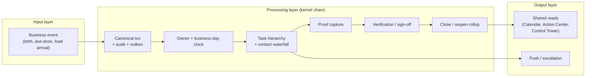
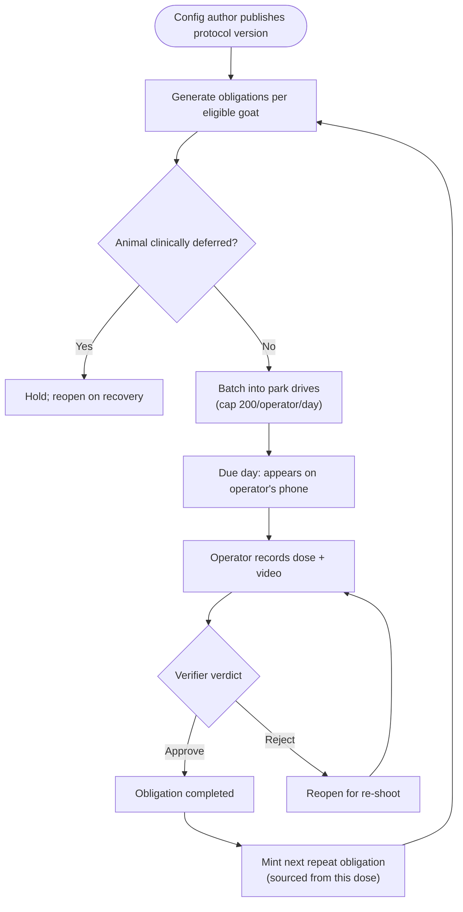
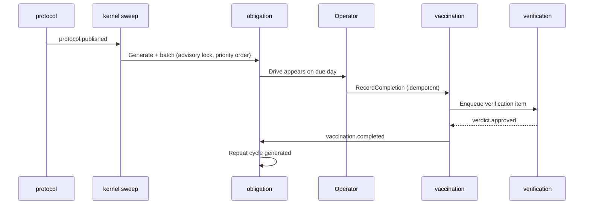
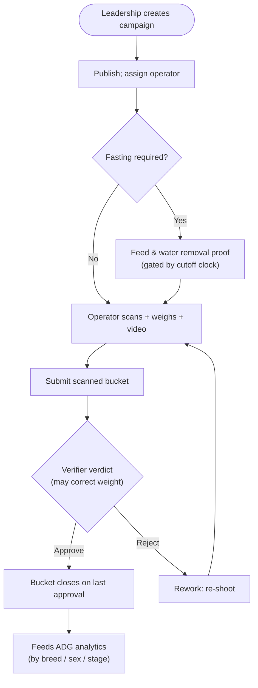
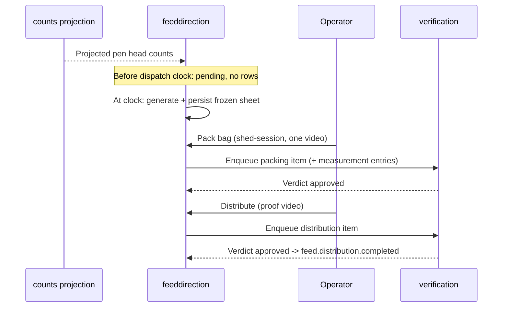
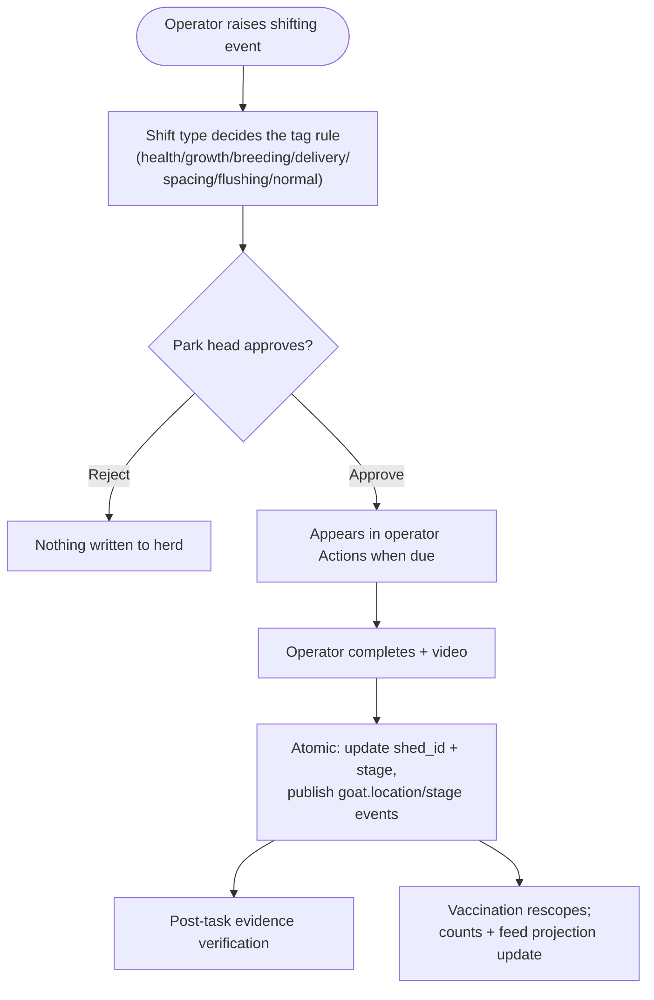

# Core Workflows

## 1. Workflow overview

The easiest way to understand how Goat OS *runs* is to picture a relay race that repeats every day across the whole farm. A business event fires the starting gun — a kid is born, a vaccine comes due, a load of animals arrives at the gate. From there the baton passes through a fixed set of runners: a canonical transaction records the fact and drops an event in the outbox; the kernel assigns a real owner and a business-day clock; the work appears on an operator's phone; the operator captures live-camera proof and submits; a verifier watches the video and casts a verdict; and the outcome rolls up into the command screens leadership watches. Then the loop closes — an accepted vaccination mints its own next repeat, a completed pen task raises tomorrow's pen visit.

Almost every feature in the system is a variation on this one relay. That is the point of the **operational task kernel** (`context/architecture/operational-kernel.md`): rather than each module inventing its own scheduler, owner-resolution, escalation ladder, and proof flow, they all plug into the same chain. What differs between vaccination, weighing, feed, and counts is the *evidence* and the *rules*, not the shape of the race.

### 1.1 The kernel philosophy

The kernel answers seven questions for every piece of work, and it answers them the same way every time: *What process was expected? Was it followed? Where did it break? Who owns the next action? What is due, by when? What evidence proves it? What alert fires when a deadline is crossed?* Because the answers are uniform, a park head's Action Center, an operator's task list, and a director's escalation all read from the same truth instead of three modules' private guesses.

### 1.2 The core execution path

At the widest zoom, work flows left to right through three layers. The input layer is where facts enter the system; the processing layer is the kernel chain that turns a fact into owned, clocked, proven work; the output layer is where results become shared reads and pushes.

The rest of this document walks the workflows that matter most, each one an instance of this chain.

---

## 2. Major workflows

### 2.1 Vaccination: from authored rule to next repeat

Vaccination is the flagship workflow and the best illustration of "generation, not manual scheduling." Nobody types a drive into a UI. A config author publishes a rulebook; the system derives every due date, batches them into operator drives, tracks execution shed by shed, and — the crucial part — mints the *next* dose automatically once a verifier accepts the current one. The farm's preventive-care calendar is a computed consequence of the rules, not a hand-maintained list.

Two properties make this trustworthy. First, the operator-day cap of 200 animals is honored by the batcher, filling complete pens first (`AGENTS.md`, vaccination rules). Second, an animal in a clinical state (sick, under treatment, quarantine, ICU) has its dose *deferred*, never cancelled, and reopened when it recovers — a medical safety rule enforced on both the publish path and the generator.

#### Flow

#### Sequence

#### Stage detail

| Stage | Executor | Input | Output | Notes |
|-------|----------|-------|--------|-------|
| Generate | obligation SM-1 | published rules + eligible goats | open obligations | Suppressed if trusted history exists |
| Batch | kernel obligation sweep | scheduled/due obligations | park drives + SOP tasks | Per-tenant advisory lock; cap 200/day |
| Record | vaccination | operator dose entry | `recorded` completion | Idempotency key; stock reserved |
| Verify | verification | recorded completion + video | approved/rejected | One item per goat per submission |
| Repeat | obligation SM-6 | accepted completion | next cycle obligation | Sourced from (vaccine, administered_at, sequence) |

### 2.2 Weighing: the deliberately simple relay

Weighing is included precisely because it shows what the chain looks like when the rules are stripped to the bone. The maintainer's standing statement is that weighing is "scan-and-submit, nothing else": scan an RFID, enter a weight, record a video, submit — with exactly one business rule, that an animal cannot be scanned twice in the same bucket before submit. There is no roster, no expected count, no herd lookup on the write path. The scanned string *is* the identity.

Yet it still runs the full kernel chain: a campaign is created and published, a work item gets a business-day clock, the operator captures and submits, a verifier approves (and may correct the weight number), and the bucket closes only when verification is resolved. The close gate is unconditional — the only two verbs are *close* and *reopen*.

The ADG headline is computed as an animal-weighted mean over every kid weighed twice plus every whole-shed pen weighed twice — one number the leadership headline and the by-breed charts must agree on, pinned by a test.

### 2.3 Feed direction: the frozen sheet

Feed direction turns two inputs — the projected number of mouths in each pen (from `counts`) and the authored ration grid (from `feedconfig`) — into exact per-session quantities. Its defining behavior is the **dispatch gate**: before the day's dispatch clock, the screen shows a pending state with "sheet arrives at HH:MM" and *no rows*; at the clock instant, the first read generates and *freezes* the sheet; every later read serves the frozen rows. This matters because a movement approved after the freeze must not silently re-price a sheet the packers are already working from.

An afternoon correction reopens any already-packed pen whose head count actually moved — both the morning and evening bags, because head count scales both — while leaving experiment pens and unchanged pens alone.

### 2.4 Counts and shifting: approve before you move

The counts workflow governs births, deaths, and shifting (animals moving between pens). Its central rule is **approve-first**: an operator raises a movement, but nothing changes in the herd register until a park head approves it, and only then does the completion transaction atomically update the animal's pen, stamp its stage per the shift type's rules, and publish the location/stage events that ripple into vaccination and feed.

### 2.5 The pen visit: closing the care chain

The pen visit is the smallest but most instructive workflow because it shows the kernel raising work *itself*. The day after any PC Care task or vaccination shed proof is submitted in a pen, the kernel raises one pen-visit task; a configured park visitor records one live-camera video; and — since the 2026-09-12 decision — that video goes to the verifier as the *last step* of the parent care work. The parent task's clock stays open until the visit is verified. The visit is never a task of its own on the board; it rides the parent card.

---

## 3. Concurrency and asynchronous model

Goat OS separates its clocks deliberately, and the separation is a "stability over speed" choice rather than a performance one. The **API service** handles synchronous, latency-budgeted request/response work — every operator read is meant to return in well under half a second. The **kernel worker** handles everything time-driven and potentially slow: sweeping hundreds of thousands of obligations, relaying the outbox, dispatching pushes, running daily closeouts. Pushing sweeps and fan-outs onto the worker keeps the API fast and keeps a slow batch job from blocking a scan.

Within the worker, each stage runs on its own cadence and its own budget so a slow outbox drain cannot starve notification dispatch. The obligation sweep serializes per tenant behind an advisory lock — parallelism across tenants, single-writer within one — which is exactly the shape needed to order vaccines by priority without two sweeps double-booking a shot cap. Cross-module work is asynchronous through the outbox: the producer commits its row and an event atomically, and consumers pick it up later, retry-safe. The rule that keeps this honest is that a producer with no consumer is a silent drop and a consumer with no producer is dead code — both are checked (`make domain-event-architecture-guard`).

On the client side, the Android app is offline-first: reads render instantly from a Room single-source-of-truth while a background refresh revalidates, and writes go to a local outbox that drains with stable idempotency keys, so a flaky field network never loses an operator's work or duplicates it.

---

## 4. Error handling and graceful degradation

The system's error philosophy is that a local failure must never become a global outage, and that failing *closed* is safer than failing *convenient*.

**Fail closed on missing configuration.** When an operator-assignment config exists but resolves to zero operators, the batcher refuses rather than inventing a fallback operator (`ErrOperatorAssignmentConfigPresentButEmpty`). When a feed ration rate is missing (as opposed to an authored zero), the quantity is *blocked* — represented as a nil pointer that cannot be summed or rendered as `0` — so a configuration gap can never masquerade as "feed nothing." When a verification enqueuer is not wired, the health completion fails before the write rather than stranding an item mid-flight.

**Serve last-known-good on the read path.** Projection-backed screens follow a freshness contract: a stale-but-covering projection serves its rows with freshness metadata rather than taking the page down, while a genuinely uncovered date or a never-built projection fails closed. A rebuild keeps serving the old rows and a failed rebuild never clobbers them.

**Retry the small write, not the big upload.** For any proof-backed workflow, upload success is not business success. If the blob upload succeeds but the business link/register/submit fails, the system retries that small business write with the existing proof id — it does not re-upload the media to repair a link (`docs/decisions/proof-business-ack-contract.md`).

**Escalate, but never punish automatically.** A missed deadline runs the attribution → notice → appeal → independent-decision ladder before it becomes a finding, and the kernel never calculates or changes payroll. A breach is a process signal, not a verdict on a person.
