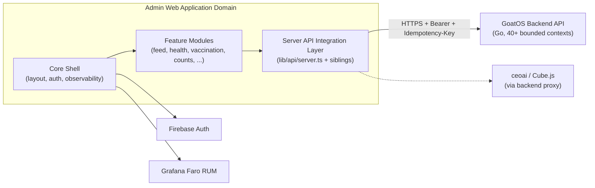
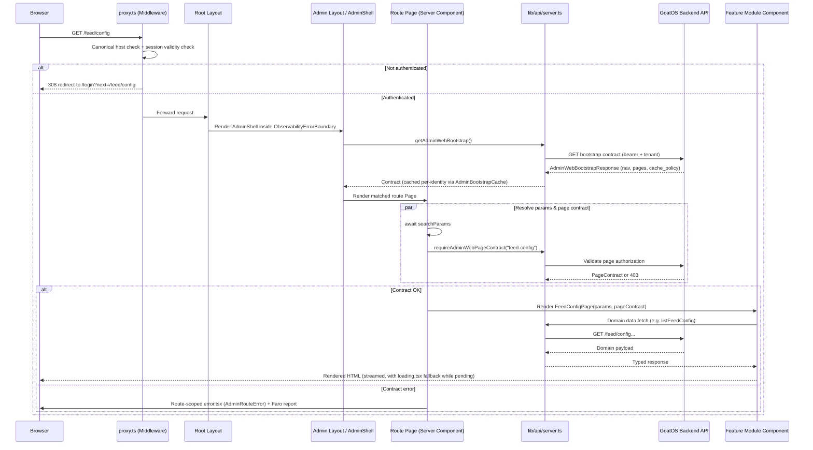

I now have comprehensive detail across the Admin Web Application Domain. I'll compose the full technical documentation.

# Admin Web Application Domain

## 1. Overview

The **Admin Web Application Domain** is the primary human interface of GoatOS for farm managers, park heads, HR staff, verification/QA personnel, and executive leadership. Implemented as a **Next.js 16 (App Router) application** at `apps/admin-web`, it is the operational cockpit of the platform: it does not own business logic or persistent state itself, but instead orchestrates authentication, authorization, page-level UI contracts, and typed data access against the Go backend for every business capability GoatOS exposes — feed management, animal health, vaccination, counts, procurement, sales, weighing, workforce/roster, verification, operations audit, and the CEO AI leadership assistant.

Architecturally, the domain is a **Backend-for-Frontend (BFF)** layered on top of React Server Components: nearly every page is rendered server-side per request (`export const dynamic = "force-dynamic"`), fetches its data through a **server-only typed API client**, and delegates authorization to a **backend-issued UI contract** rather than embedding role logic in the frontend. This design keeps admin-web thin and “dumb” by intention — the backend is the single source of truth for what a signed-in user is allowed to see and do, and admin-web's job is to render that contract faithfully, handle loading/error states gracefully, and stream real-time experiences (like the CEO AI chat) without leaking business rules into client code.

## 2. Position in the GoatOS Architecture

Admin-web is one of four client surfaces the GoatOS backend serves (alongside the native Android field app, the operator-mobile app, and the read-only investor dashboard). Unlike the Android app — which is offline-first and syncs through a local outbox — admin-web is always-online and stateless between requests: every page load re-authenticates, re-fetches the authorization contract, and re-renders from fresh backend state. This trades offline resilience for correctness and freshness, which is appropriate for management/oversight workflows where staleness is a bigger risk than momentary unavailability.



## 3. Structural Composition

The domain decomposes into three cooperating layers, consistent with the reports' findings:

| Layer | Location | Responsibility |
|---|---|---|
| **Admin Web Core Shell** | `app/layout.tsx`, `app/(admin)/layout.tsx`, `components/admin-shell.tsx`, `components/mesha-shell.tsx`, `lib/auth/firebase-client.ts`, `components/observability/*` | Root HTML shell, Firebase authentication bridge, observability instrumentation, and the navigation chrome (drawer/top bar) driven by a backend-issued bootstrap contract |
| **Admin Web Feature Modules** | `features/*` (27 feature packages), `app/(admin)/*` (24+ route segments) | Business-domain UI: feed, health, vaccination (plan/execution/sheds/live-tracker), counts, procurement, sales, weighing, work-board, leadership-tasks, people, leave, calendar, operations-audit, operations-dlq, verification-review, process-integrity, sops, herd-signals, control-tower, ceo-ai, ceo-ai-admin, goat-passport, root-route |
| **Admin Web API Integration Layer** | `lib/api/server.ts` (216 KB, the single largest source file in the repository), `lib/api/client.ts`, and per-domain server modules (`procurement-server.ts`, `herd-signals.ts`, `work-board-server.ts`, `vaccination-*.ts`, etc.) | Server-only, typed backend client hub; centralizes auth-token resolution, UI-contract enforcement, error normalization, and per-endpoint request functions consumed by every server component page |

### 3.1 Admin Web Core Shell

The shell establishes the application's outer skin and cross-cutting concerns before any business UI renders.

- **Root layout** (`app/layout.tsx`) sets the dark-themed HTML document, mounts `FaroProvider` (Grafana Faro RUM bootstrap) and a top-level `ObservabilityErrorBoundary`. This root boundary is the *final safety net*: it also covers routes that render outside the `(admin)` route group, such as `/login` and `/auth/action`, which have no nested boundary of their own.
- **Admin layout** (`app/(admin)/layout.tsx`) nests a second, scoped `ObservabilityErrorBoundary` inside `AdminShell`. Nested boundaries are intentional — the innermost boundary catches first, the outer one is the fallback — so an error rendering one admin screen doesn't take down the login/auth surfaces.
- **AdminShell** (`components/admin-shell.tsx`) is a server component that fetches the backend-owned `AdminWebBootstrapResponse` via `getAdminWebBootstrap()` *before* rendering any navigation or business UI. If the bootstrap contract fails, the shell deliberately renders an explicit "contract unavailable" error screen rather than falling back to a locally hard-coded information architecture — a strong architectural stance that the backend, not the frontend, is authoritative for what navigation exists. On success, it derives the top-bar park list from `contract.top_bar.park_selector.options` and renders `MeshaShell` (the actual drawer/top-bar navigation implementation, ~40 KB) wrapped around `children`.
- **FirebaseSessionBridge** (`components/auth/*`) mounted alongside `MeshaShell` keeps the Firebase ID-token/session cookie fresh across the shell's lifetime.
- **Authentication** (`lib/auth/firebase-client.ts`) wraps the Firebase Web SDK: it lazily initializes a named Firebase app (`goatos-admin-web`), supports email/password and Google-credential sign-in, exchanges Firebase ID tokens plus refresh tokens for a server-managed session via `POST /api/auth/session` (the `SESSION_ROUTE`), and exposes a `FirebaseSessionError` type carrying backend-issued error codes for precise UX (expired session, incomplete config, etc.). The refresh token is persisted server-side specifically so SSR can mint fresh ID tokens after the ~1-hour ID-token TTL lapses, letting a server session outlive a single token.
- **Observability** (`components/observability/faro-provider.tsx`, `error-boundary.tsx`) integrates Grafana Faro Web SDK for RUM: errors, Web Vitals, console capture, and session tracking, using only the two approved Faro packages (`@grafana/faro-web-sdk`, `@grafana/faro-web-tracing`) — deliberately avoiding the React-Router-oriented `@grafana/faro-react` package since App Router doesn't need it. `TracingInstrumentation` auto-injects W3C `traceparent` headers onto same-origin `fetch`/XHR calls, which the Next.js server then forwards onto the backend (`apiClientOptions`), giving an unbroken, end-to-end trace from browser RUM through the Next.js server into the Go backend's OpenTelemetry span chain. `AdminRouteError`/`ObservabilityErrorBoundary` push caught errors to Faro (`faro.api?.pushError`) with safe no-op behavior when no collector is configured (e.g. local dev).

### 3.2 Admin Web Feature Modules

Each business capability is implemented as a self-contained package under `features/<domain>` (e.g. `feed`, `health`, `counts`, `procurement`, `vaccination-plan`, `vaccination-execution`, `vaccination-sheds`, `vaccination-live-tracker`, `weighing`, `work-board`, `leadership-tasks`, `people`, `leave`, `calendar`, `operations-audit`, `operations-dlq`, `verification-review`, `process-integrity`, `sops`, `herd-signals`, `control-tower`, `ceo-ai`, `ceo-ai-admin`, `goat-passport`, `preventive-care-vaccination`, `root-route`, `approvals`). Each is wired to a corresponding route segment under `app/(admin)/*`.

**Route-page pattern.** Every route page follows a highly consistent shape, exemplified by the Feed Configuration route:

```tsx
export const dynamic = "force-dynamic";

export default async function Page({ searchParams }: { searchParams: Promise<RouteSearchParams> }) {
  const [params, pageContract] = await Promise.all([
    searchParams,
    requireAdminWebPageContract("feed-config"),
  ]);
  return <FeedConfigPage searchParams={params} pageContract={pageContract} />;
}
```

Key conventions embedded in this pattern:

1. **`force-dynamic` rendering** — nearly every business page opts out of Next.js's default static/ISR caching, guaranteeing that operational data (task queues, counts, feed status) is always fetched fresh per request, which is essential for a management dashboard where stale reads could hide safety-critical state.
2. **Promise-based `searchParams`** — reflecting Next.js 15+/16 App Router semantics where `searchParams` is now an awaited promise rather than a plain object; a shared helper module (`lib/search-params.ts`) normalizes access (`one()`, `boundedInt()`) and builds cursor-based pagination hrefs (`hrefWithCursor`, `hrefPreviousCursor`) uniformly across list pages, including a bounded cursor-stack (max depth 8) to support "go back a page" without server-side session state.
3. **Parallel fetch via `Promise.all`** — search params resolution and the page's authorization contract (or feature data) are always fetched concurrently, minimizing time-to-first-byte for server-rendered pages. A dedicated CI check (`scripts/check-serial-await.mjs`) enforces this pattern is not accidentally serialized.
4. **Contract-gated rendering** — `requireAdminWebPageContract(<route_id>)` (and the broader `getAdminWebBootstrap()`) is the mandatory authorization gate. Every page must resolve its contract before rendering; feature components receive both the resolved `searchParams` and the `pageContract` as props, and render purely from what the backend has authorized — no client-side role branching.
5. **Scope propagation** — a single shared `Scope` model (`lib/scope.ts`) standardizes company/park scoping, date ranges, and (recently) a "command-lens domain" selector across Control Tower, Action Center, Protocol Adherence, and Workflows screens, parsed once via `parseScope(searchParams)` and serialized consistently via `scopeHref(...)`, so that scope can never diverge between screens sharing the same top-bar concept.
6. **Sibling `loading.tsx` skeletons** — many routes (e.g. `feed/config/loading.tsx`) define lightweight, inline-styled skeleton placeholders (`skel`, `phead` classes) that Next.js automatically renders via React Suspense while the async page component awaits its data, improving perceived performance without extra client-side state machines.
7. **Route-scoped `error.tsx` boundaries** — several routes (e.g. `procurement/feed-purchases/error.tsx`) define a dedicated error boundary scoped to just that segment rather than relying solely on the shared `(admin)/error.tsx`. This keeps the navigation shell and unrelated screens alive when only one screen's data fetch fails, while still routing the failure through the shared `AdminRouteError` component (which reports to Faro via `pushError`) for consistent UX and telemetry.
8. **Compatibility redirects** — renamed routes are kept alive as thin redirect shims. For example, `app/(admin)/actions/page.tsx` exists purely to 301/308-redirect legacy `/actions` bookmarks and deep-links to the renamed `/verify` route, preserving query parameters (including repeated array params) so old links (e.g. `?category=`) continue to work after a UX rename.

**Root landing logic.** `app/(admin)/page.tsx` (the `/` route) is notable for encoding business-owned landing-page rules directly from the backend contract rather than a hardcoded redirect: it inspects the bootstrap contract's `pages` array to find the caller's designated landing route (`LANDING_ROUTE_ID = "weighing-analytics"`), supports an explicit `?lens=control-tower` deep link, and falls back to the first enabled/published navigation leaf (preferring `/verify`) if no landing page is granted — again demonstrating that admin-web treats itself as a rendering engine over backend-declared navigation, not an independent router of business logic.

### 3.3 Admin Web API Integration Layer

All backend communication is centralized in `lib/api/*`, marked with the `"server-only"` directive so this code can never be bundled into client JavaScript (preventing accidental token or backend-URL leakage to the browser). This layer has two tiers:

- **`lib/api/server.ts`** (~216 KB, 5,900+ lines) — the dominant aggregator. It re-exports strongly typed schema aliases generated from the backend's OpenAPI contract (via `@goatos/api-client`'s `AppApiComponents`/`AdminApiComponents`/`AppApiPaths`/`AdminApiPaths` types) for essentially every domain: goat passports, health analytics, herd analytics, counts breakdowns, weighing/growth/ADG metrics, vaccination queues/plans/executions/sheds/command-board/live-tracker, leadership tasks, process-integrity/control-tower/workflow-drilldown models, sale allocation, and more. Alongside these types it defines the actual request functions (e.g. `listAdminWebApprovals`, `decideAdminWebApproval`, `postVerificationReviewEvents`, `listSaleCandidates`, `previewSaleAllocation`, `confirmSaleAllocation`) that every feature module calls from its server components or server actions.
- **Per-domain server modules** — recognizing the risk of a single monolithic file, some domains have already been decomposed into dedicated files alongside `server.ts`: `procurement-server.ts` (27 KB), `herd-signals.ts` (17 KB), `work-board-server.ts`, `vaccination-actions.ts`, `vaccination-execution.ts`, `vaccination-sheds.ts`, `vaccination-live-tracker.ts`, `vaccination-command-board.ts`, `herd-locations.ts`, `park-scope.ts`, and `scope-parks.ts`. This partial decomposition is an ongoing architectural pattern the team is expected to continue.
- **`lib/api/client.ts`** — the client-side ("use client" component-callable) counterpart, used sparingly for interactive workflows that need browser-driven fetches against Next.js's own `/api/*` route handlers (e.g. roster positions, backup config, vaccination capacity/operator-assignment config), rather than calling the Go backend directly from the browser.

**Session and request plumbing.** Every server-side request function follows a uniform shape:
1. Resolve `getServerConfig(true)` — which resolves the authenticated Firebase session into a bearer token, tenant ID, base URL, and `traceparent` header (or a `local-dev-token.ts` fallback bearer for local development).
2. Construct a typed client via `createAppApiClient` / `createAdminApiClient` (from `@goatos/api-client`, the shared generated client package under `packages/api-client`) with `apiClientOptions(config.data)`.
3. Issue the call through a shared `request(...)` wrapper that normalizes `GoatOSApiError` responses into a discriminated `ApiUiError` (`unauthorized`, `tenant_scope_mismatch`, `permission_denied`, `bad_request`, `not_found`, `api_error`, `backend_down`), preserving backend-issued `trace_id`, `retryable` flags, and structured `field_errors` for form validation. Notably, a `403 route_not_registered` response is explicitly distinguished from a genuine permission denial — it signals a stale backend deployment rather than an authorization failure, so the error message correctly tells operators to redeploy rather than "check your access."
4. Mutating requests attach a mandatory `Idempotency-Key` header, ensuring retries (from network flakiness or double-clicks) cannot double-apply an approval, sale allocation, or config change.

**Bootstrap caching.** `AdminBootstrapCache` (`lib/api/admin-bootstrap-cache.ts`) is a process-local, in-memory cache for the (potentially large) backend-owned UI contract. It is keyed by a SHA-256 digest of `(baseUrl, tenantId, bearerToken)` so that responses for different users, tenants, or credentials can never be cross-contaminated within the same Node.js process. It respects a backend-advertised TTL (`cache_policy.in_process_ttl_sec`, clamped between 1s and 10 minutes) and supports ETag-based revalidation (HTTP 304) to avoid retransmitting the full contract when nothing has changed for that identity, with simple least-recently-used eviction bounded to 128 entries.

## 4. Authentication & Request Gatekeeping (`proxy.ts`)

Before any Next.js route resolves, `proxy.ts` (Next.js Middleware, matched against `/:path*`) performs three responsibilities:

1. **Canonical host redirection** — normalizes requests to a single canonical dashboard host (`GOATOS_CANONICAL_DASHBOARD_HOST`) via a 308 redirect, but explicitly *skips* this for loopback hosts (`127.0.0.1`, `localhost`, `[::1]`). This carve-out fixes a documented production incident (STG, 2026-08-18): Next.js Server Actions self-fetch through an internal loopback origin to stream a redirect response, and re-canonicalizing that internal call would route it back out through the load balancer — where Node's `fetch` drops the `Cookie` header on cross-origin redirects, causing a spurious logout/login flash after every approval action.
2. **Session validity checks** — determines whether a request carries a valid Firebase ID-token cookie (`FIREBASE_ID_TOKEN_COOKIE`, TTL-checked via `maxAgeForFirebaseIdToken`), a refresh-token cookie, or a local-only bearer-token fallback (`GOATOS_ENV=local` + `GOATOS_AUTH_MODE=bearer`), used exclusively for local development convenience.
3. **Login-path and public-prefix routing** — redirects an already-authenticated user away from `/login`, allows a fixed allowlist of public prefixes to pass through unauthenticated (`/api/auth`, `/login`, `/auth/action`, static assets, favicon/icons), and otherwise redirects unauthenticated requests to `/login` with a safety-checked `next` return path (rejecting protocol-relative `//` redirects to prevent open-redirect attacks).

## 5. Sequence Flow: Standard Page Render



## 6. The CEO AI Chat Surface

The `features/ceo-ai` package is the admin-web endpoint of the platform's most sophisticated cross-cutting flow: the Leadership Analytics & AI Assistant. Its architecture deliberately keeps admin-web as a *thin, security-conscious proxy* rather than a business-logic participant:

- **UI layer**: `ceo-ai-panel.tsx` (~26 KB) is the chat panel component, backed by `ceo-ai-chart.tsx`/`ceo-ai-chart-geometry.ts` for rendering data visualizations returned inline in assistant answers, and `ceo-ai-styles.tsx` for its dedicated styling.
- **Client fetchers**: `ceo-ai-client.ts` covers non-streaming REST calls — capability probing (`/api/ceo-ai/starters`, which doubles as a `200`/`403` leadership-authorization check), and conversation CRUD (list/create/rename/delete) — while `lib/ceo-ai-stream.ts` (10.8 KB) handles the streaming answer protocol.
- **Backend proxy routes**: every `/api/ceo-ai/*` Next.js route handler (`ask`, `starters`, `admin`, `conversations`) delegates to shared plumbing in `_forward.ts`, which:
  - Resolves the authenticated session and attaches `Authorization: Bearer`, `X-GoatOS-Tenant-ID`, and an inbound `traceparent` header to the outbound backend call.
  - For `forwardStream`, pipes the backend's `text/event-stream` response body straight through untouched (enabling progressive token rendering in the chat UI) with headers tuned for SSE (`Cache-Control: no-store, no-transform`, `Connection: keep-alive`, `X-Accel-Buffering: no`); non-streaming JSON fallbacks/errors are forwarded verbatim so the client has a single response-handling code path.
  - Explicitly documents that it "re-implements NO routing, reads NO business data, and does NOT gate on a display-name regex" — the backend's `ceo_internal` permission is the sole security boundary, and a non-leadership session correctly receives a `403` surfaced honestly to the UI rather than being silently hidden or faked client-side.

This design means admin-web contributes zero AI orchestration, guardrail, or Cube.js query logic — all of that lives in the backend's `ceoai` bounded context — while still delivering a first-class, low-latency streaming chat experience to executives.

## 7. Cross-Cutting Frontend Concerns

- **Design system**: Tailwind CSS 4 (`tailwind.config.ts`, `postcss.config.mjs`) combined with shadcn/ui, configured via `components.json` (`base-nova` style, RSC-enabled, `lucide-react` icons, path aliases `@/components`, `@/lib`, `@/hooks`, `@/components/ui`). A custom dark-first design-token stylesheet (`app/mesha-theme.css`) defines CSS variables for color, radius, and typography, layered under `app/globals.css`.
- **Data visualization primitives**: hand-built SVG chart components (`components/svg-bars.tsx` 20 KB, `svg-series.tsx` 17.7 KB, `svg-column-bars.tsx`, `hbar-list.tsx`, `chart-hover.tsx`) plus `recharts` for richer charts, supporting the analytics-heavy nature of feed, health, weighing, and counts dashboards.
- **Reusable data UX**: a generic `data-table.tsx` (React Table via `@tanstack/react-table`), cursor-based `worklist-pager.tsx`/`worklist-filters.tsx` (41 KB, the largest single reusable component), themed date pickers, and a `window-date-filter.tsx`/`top-bar-date-picker.tsx` pairing for the shared scope/date model.
- **State/query management**: `@tanstack/react-query` (`lib/query-provider.tsx`) is available for client-side data needs that fall outside the server-component-first model (e.g. live-updating widgets).
- **Type safety**: TypeScript in strict mode (`tsconfig.json`) with path aliases mirroring the shadcn configuration; a custom `images.d.ts` module declaration supports typed PNG imports.
- **Skills/AI tooling metadata**: `skills-lock.json` tracks versioned AI "skill" extensions, presumably consumed by internal engineering/agent tooling integrated into the development workflow around this codebase.

## 8. Build, Deployment & Quality Tooling

- **Containerization**: a multi-stage `Dockerfile` builds on `node:24-alpine`. The `deps` stage installs dependencies (including the locally-linked `@goatos/api-client` workspace package); the `build` stage bakes Faro/observability configuration (`NEXT_PUBLIC_FARO_COLLECTOR_URL`, `NEXT_PUBLIC_GOATOS_ENV`, `NEXT_PUBLIC_APP_VERSION`) as build-time environment variables and runs `next build`; the final `runtime` stage copies only the Next.js `standalone` output and static assets, runs as a non-root `nextjs` user, and listens on port 8080 for Cloud Run compatibility.
- **`next.config.mjs`**: enables `output: "standalone"` for minimal container images, sets `outputFileTracingRoot` to the monorepo root (needed because admin-web depends on sibling workspace packages), transpiles `@goatos/api-client`, and rewrites Firebase's `/__/auth/action` callback path to the app's own `/auth/action` handler. A dev-only `allowedDevOrigins: ["127.0.0.1"]` setting works around a Next 16 dev-server restriction that would otherwise silently break HMR when the app is opened via `127.0.0.1` instead of `localhost`.
- **Local-stack safety guard**: `scripts/assert-origin-main-local-stack.mjs` and `scripts/lib/origin-main-local-stack-guard.mjs` run before `npm start`, performing git-based checks (branch/origin verification) to prevent accidentally running a local production-mode server against unintended state — a safety net specific to this team's development workflow.
- **Extensive smoke/quality automation**: the `package.json` scripts surface a large custom testing suite beyond typical `lint`/`typecheck`/`test`, including:
  - `check:ia-guard` — validates the information-architecture (navigation) contract usage.
  - `check:serial-await` — statically detects accidentally-serialized `await` chains that should be `Promise.all`.
  - `check:ui-contract` — flags UI copy that should be backend-owned "literals" rather than hardcoded.
  - `check:action-center-request-plan`, `check:calendar-request-plan`, `check:request-plan-fanout` — validate that specific high-traffic pages issue a bounded, predictable set of backend requests (guarding against request fan-out regressions).
  - `check:vaccination-command-lenses`, `check:herd-import-security`, `check:goal1-frontend` — domain-specific correctness/security guards.
  - `check:token-leak` (run as part of `build`) — scans the production build output to ensure no bearer tokens or secrets leak into client-shipped JavaScript, reinforcing the `"server-only"` boundary enforced in `lib/api/*`.
  - `smoke:visual:live` / `smoke:visual:baseline` — Playwright-driven visual regression smoke tests against a live environment, with baseline capture/update modes.
  - `perf:lighthouse` / `perf:pagespeed` — automated performance auditing.

This breadth of custom tooling reflects a mature engineering discipline around a codebase where a single large aggregator file (`lib/api/server.ts`) and a backend-contract-driven UI carry real risk of silent drift or regression if not continuously guarded.

## 9. Interaction With Other Domains

| Peer Domain | Relationship |
|---|---|
| **Animal Health & Care Domain** | Admin-web's health/vaccination feature pages call backend health, vaccination, and pccare endpoints to render dashboards, define vaccination plans, and manage clinical workflows. |
| **Feed Management Domain** | The feed direction/config/analytics feature pages consume feed-direction and feed-config APIs for planning, issuing, amending, and locking daily feed sheets, and for surfacing distribution analytics. |
| **Verification & Process Integrity Domain** | The `verification-review`, `process-integrity`, `operations-audit`, and `operations-dlq` features surface review queues, protocol adherence scores, and audit/DLQ monitoring; `postVerificationReviewEvents` lets verifiers submit review decisions batched with idempotency keys. |
| **Field Operations & Task Execution Domain** | `work-board`, `leadership-tasks`, `calendar`, `weighing`, and `counts` feature modules render task assignment, scheduling, weighing analytics, and census data sourced from the corresponding backend bounded contexts. |
| **Procurement & Supply Chain Domain** | `procurement` and `sales` feature pages (backed by `procurement-server.ts`, `procurement.ts`) manage vendor purchasing, sale recording, and — notably — sale-to-animal allocation, which deliberately calls *admin* identity routes rather than the sales module's own schema, since sales records intentionally carry no `goat_id`. |
| **Workforce & Identity Management Domain** | `people` and `leave` features drive roster/position management, backup configuration, and leave approvals via `/admin/roster/*` endpoints, consumed through the client-side `lib/api/client.ts`. |
| **Leadership Analytics & AI Assistant Domain** | The `ceo-ai` and `ceo-ai-admin` features are a thin, security-delegating proxy in front of the backend's `ceoai` orchestrator, streaming grounded, safety-reviewed answers without performing any orchestration logic locally. |
| **Herd Signals & IoT Monitoring Domain** | The `herd-signals` feature and its dedicated `lib/api/herd-signals.ts` (17 KB) module surface IoT-derived animal activity/tag-mapping data. |
| **Shared Contracts & Developer Tooling Domain** | Admin-web consumes the generated `@goatos/api-client` package (typed OpenAPI client) as its sole mechanism for talking to the backend, ensuring schema drift between backend and frontend is caught at compile time. |

## 10. Architectural Strengths and Risks

**Strengths**

- **Backend-as-source-of-truth for authorization and navigation.** By gating every page render on a backend-issued contract (`getAdminWebBootstrap` / `requireAdminWebPageContract`) rather than embedding role/permission logic in the frontend, admin-web avoids a common class of authorization drift bugs where UI and backend permissions fall out of sync.
- **Consistent, enforceable page pattern.** The `force-dynamic` + `Promise.all(searchParams, contract)` + feature-component-render pattern is not just a convention but an *enforced* one, via dedicated static-analysis scripts (`check-serial-await`, `check-ia-guard`, `check-request-plan-fanout`) run in CI.
- **Defense-in-depth observability.** Faro RUM instrumentation, route-scoped error boundaries, and trace-header propagation from browser through Next.js server to the Go backend give end-to-end diagnosability for a UI this operationally critical.
- **Fail-closed session handling.** The proxy middleware, session-sync error typing (`FirebaseSessionError`), and identity-scoped bootstrap caching all favor explicit failure and re-authentication over silently degraded or stale UI state.
- **Idempotency discipline.** Every mutating server-side call requires an `Idempotency-Key`, consistently protecting approval, sale-allocation, and configuration-write actions from double-application on retry.

**Risks (as also identified in the broader architecture research)**

- **`lib/api/server.ts` monolith.** At 216 KB and 5,900+ lines, this file is the single largest source file in the entire GoatOS repository. It aggregates type re-exports and request functions for nearly every backend bounded context, making it a high-traffic merge-conflict surface and a barrier to isolated testing. The team has begun decomposing it (e.g. `procurement-server.ts`, `herd-signals.ts`), but the bulk of domains still live in the shared file.
- **Coupling to backend contract shape.** Because nearly all authorization and navigation state flows through one bootstrap contract, a backend regression or stale deployment (the explicitly-handled `route_not_registered` case) has an outsized, platform-wide blast radius on admin-web's usability.
- **Operational complexity of the tooling surface.** The large number of bespoke smoke/guard scripts (`check-*`, `smoke-*`) indicates meaningful engineering investment is required just to keep the admin-web/backend contract, request-fanout behavior, and visual baselines from silently regressing — a cost of the dynamic, contract-driven rendering model chosen here.