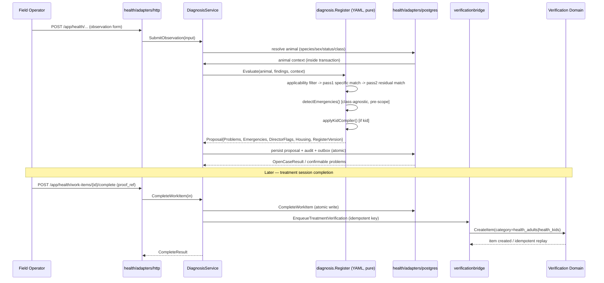

# Animal Health & Care Domain

**GoatOS Technical Documentation — Domain Module Reference**
*Document version 1.0 · Generated 2026-09-13*

---

## 1. Purpose and Scope

The Animal Health & Care Domain is the clinical backbone of GoatOS. It owns everything that concerns the physical wellbeing of an individual animal across its lifetime on the farm: who the animal is (identity and passport), what illnesses it has had and how they were treated (health cases and diagnosis), what preventive interventions it has received (vaccination, deworming, tick removal, trimming), what environmental hazards it has been screened against (toxin testing), and how its growth is tracked against expectation (growth direction).

Architecturally the domain is not one Go package but a *federation* of independently deployable, hexagonally-structured bounded contexts that share a common vocabulary (goat identity, park/shed/partition location, proof-backed evidence, verification review) but deliberately do **not** import each other's storage layers. This is a conscious design decision repeatedly documented in code comments across the domain ("free-flow isolation guard", "maintainer boundary") — each sub-module owns its own tables and exposes only a narrow port interface to its neighbours, wired together at the composition layer (`backend/internal/bootstrap`).

Six sub-modules compose the domain:

| Sub-module | Backend Package(s) | Responsibility |
|---|---|---|
| Animal Identity & Health Records | `identity`, `health`, `passport` | Canonical animal registry, clinical case lifecycle, cross-module passport aggregation |
| Vaccination Programs (Planning) | `vaccination` | Dose/completion recording, obligation generation (SM-1), stock consumption, anchors |
| Vaccination Programs (Execution) | `vaccinationexecution` | Field drive command board, live tracker, operator/roster planning |
| Preventive Care (PC Care) | `pccare` | Assigned-task orchestration for deworming, tick removal, trimming, feed/water removal |
| Toxin Management | `toxin` | Server-gated 7-step aflatoxin screening procedure on every feed load |
| Growth Direction | `growthdirector` | Read-only growth trajectory and weight-band analytics |

---

## 2. Architectural Pattern

Every sub-module follows the platform-wide hexagonal (ports-and-adapters) layering:

```
domain/    → pure types, invariants, state machines, error taxonomy (no I/O)
ports/     → interfaces the app layer depends on (Repository, ProofValidator, Enqueuer…)
app/       → use-case orchestration: validation, permission gating, transaction sequencing
adapters/  → http (REST handlers), postgres (sqlc-backed repositories), verificationbridge,
             boardsource (workboard integration), proof (proof validators), salesbridge, roster
```

This shape is visible identically in `health`, `vaccination`, `pccare`, `toxin`, and `growthdirector`. The consistency is deliberate: an engineer who understands one module's directory layout can navigate any other without re-learning conventions.

### 2.1 Cross-module composition without cross-module imports

Because Go's import graph would otherwise let any module reach into any other's tables, the domain relies on **composition-layer bridge adapters** that sit between two modules and translate one module's use-case call into another's port interface — without either module importing the other's storage package. The canonical example is `backend/internal/health/adapters/verificationbridge/enqueue.go`:

```go
// Package verificationbridge holds the composition-layer adapter that connects the health module
// to the verification module's service API without either module importing the other's storage.
type TreatmentEnqueuer struct{ verification verificationCreator }

func (e *TreatmentEnqueuer) EnqueueTreatmentVerification(ctx context.Context, in healthapp.TreatmentVerificationEnqueueRequest) error {
    _, err := e.verification.CreateItem(ctx, verificationdomain.CreateItem{
        Vertical: healthdomain.VerificationVerticalHealth,
        Category: healthdomain.VerificationCategoryForAgeBand(in.AgeBand),
        Source:   verificationdomain.SourceRef{Module: "health", RefType: "health_treatment_session", RefID: in.SessionID},
        MediaRefs: in.MediaRefs, ...
    })
    return err
}
```

The same shape recurs for PC Care (`pccare/adapters/verificationbridge/enqueue.go`) and for the Work Board (`health/adapters/boardsource/source.go`, `pccare/adapters/boardsource/*`). This pattern is the domain's primary defence against tight coupling: the `app` layer defines a narrow interface it needs (e.g. `TreatmentVerificationEnqueuer`), and the bootstrap wiring decides at startup which concrete adapter satisfies it.

### 2.2 Fail-closed wiring discipline

A recurring safety idiom throughout the domain is *failing closed when a dependency seam is unwired*, rather than silently degrading. In `health/app/service.go`:

```go
if in.ProofRef != "" && s.enqueuer == nil {
    // Fail closed BEFORE the write: a proof accepted with no review path is a silent drop.
    return domain.CompleteResult{}, ErrVerificationEnqueuerNotWired
}
```

Growth Direction's `NewDiagnosisService` shows the same instinct at startup rather than at request time — every class register is parsed eagerly so a malformed rule table becomes a deploy-time failure, never a silent 500 the first time an operator submits a kid observation.

---

## 3. Sub-Module: Animal Identity & Health Records

### 3.1 Identity (`backend/internal/identity`)

The `identity` module is the canonical registry for every animal (`goats` table) and the identifiers that resolve to it (`goat_identifiers` — RFID tags, temporary tags, etc.). It is the largest sub-module by file count (40 Go files) and owns:

- **Goat lifecycle** (`app/goat_lifecycle.go`, 32KB) — birth, entry, exit, merge, relocation between sheds/parks/partitions.
- **Sale allocation** (`app/sale_allocation.go`, `adapters/salesbridge`) — links identity records into the Procurement & Supply Chain domain via a bridge adapter, mirroring the verification-bridge pattern.
- **Identifier management** (`app/identifier.go`) — RFID/temporary tag assignment, promotion of temporary tags to permanent RFID.
- **Census correction** (`app/census_correction.go`) — retroactive fixes to headcounts.
- **Recovery workflows** (`goatcreatedrecovery/recovery.go`) — described in detail in §3.3.

Domain types (`identity/domain/types.go`) define the wire contracts consumed by every other health sub-module — `GoatSummary`, `GoatPassport`, `LocationPath`, `EvidenceRef` — with an emphasis on **stable, singular display fields**. A representative comment documents a real production incident:

> *"The `display` alias was RETIRED on 2026-08-06. This type used to ship the same string twice — a required `display` and an optional `operational_location_display` — which is how one name gets updated and the other silently does not... clients deserialized "" with no error."*

Every `GoatSummary` also carries a `RowVersion` optimistic-concurrency token so mutating flows (e.g. recording a death from a scan/search result) can be resolved server-side without the operator ever having to type a version number.

### 3.2 Health (`backend/internal/health`)

The `health` module owns the **clinical case and treatment-session lifecycle**. Its `domain/types.go` defines the case-closure vocabulary precisely:

- `recovered` — the treatment course worked.
- `referred` — handed to specialist/external care; the case remains "open" for the death workflow.
- `canceled` — clinically withdrawn.
- `continued` is explicitly **not** modelled as a closure outcome — extending a course needs new session materialization and is treated as a separate feature, a boundary the code calls out directly to prevent future conflation.

The service layer (`app/service.go`) implements the case → session → completion pipeline:

1. `OpenCase` — validates tenant/actor/goat UUIDs, disease key, age band, and an idempotency key before delegating to the repository, which materializes the protocol's session schedule.
2. `ListWorkItems` / `GetWorkItem` — paginated worklist (max page size 20) filterable by age band, status, disease, park, shed, and session.
3. `CompleteWorkItem` — records a session completion and, if proof was attached, **synchronously enqueues a verification-review item** via the `TreatmentVerificationEnqueuer` port before returning success. The idempotency key for that enqueue is deliberately `"health-treatment-verification:" + sessionID + ":" + proofRef`, so a retried sync collapses onto the same review item while a genuine rework re-shoot (new proof ref) creates a fresh one.
4. `CloseCase` — the Director's clinical decision (`health.diagnose` permission).

A critical architectural point, stated explicitly in code comments and confirmed by the boardsource mapping (`workStateSQL`): **verification in Health is post-task evidence review, never a completion gate.** A treatment is considered given the moment the operator submits it; the verifier's approve/reject only stamps `verified_by` or flips the row to `rework` for a re-shoot. This differs from other modules (see Toxin, §5) where verification-equivalent review *does* gate downstream state.

Health also subscribes to cross-domain lifecycle events via the platform event bus (`app/event_handlers.go`):

```go
const (
    EventCountsDeathReported = "counts.death.reported"
    EventCountsDeathRejected = "counts.death.rejected"
    EventGoatExited          = "goat.exited"
)
```

`handleExited` closes **every** open clinical case for a goat once its exit reason is confirmed as "died", attaching an optional coded `DeathCause` to the specific case that caused it — but closing the rest regardless, since "every open case still closes; the cause only decides which one is MARKED as the cause."

### 3.3 The Diagnosis Engine (`health/diagnosis`)

The most architecturally distinctive component of the entire domain is the diagnosis engine — a **pure, dependency-free, deterministic rule engine** with no database, HTTP, or clock dependency. Its package doc states the contract plainly:

> *"A form plus an animal plus a follow-up context go in; a Proposal comes out. Same input, same output, every time."*

**Design properties, all load-bearing:**

1. **Parallel rule evaluation, no decision tree.** Every applicable rule is evaluated independently over an evidence set; there is no branching hierarchy and no backtracking, because co-morbidity is the clinical norm and absence of a sign never excludes a disease.
2. **Output is a proposal, never a write.** The engine never closes a case, culls an animal, or moves it between sheds — "Housing is a directive that some other module applies."
3. **Version-pinned execution.** Every run records the `register_version` it ran against so a historical case remains interpretable even after the rule table is later edited.

**Clinical rule table (registers).** Rules are authored as YAML per animal class — `adult-1.yaml`, `kid-milk-7.yaml`, `kid-weaning-1.yaml`, `kid-fattening-1.yaml` — and loaded once at startup, embedded into the binary. Each `Rule` declares:
- Applicability filters (species, sex, status, required/excluded evidence gates)
- Three tiers of matching clauses — `Pathognomonic`, `Probable`, `Possible` — scanned in that order, first match wins the tier
- A `SeverityBase` plus `SeverityModifiers` that can only *escalate* severity via `max()`, never reduce it
- An `AcuteActionable` flag distinguishing "clinically bad" from "bad in the next ten minutes" — deliberately kept separate to avoid alarm fatigue

**Matching and arbitration (`match.go`).** Evaluation runs in two passes:
- **Pass 1 — specific clauses.** Every rule whose gates and clause findings match fires; matched findings (excluding "non-specific" tokens) are marked as *explained*.
- **Pass 2 — residual clauses.** A residual rule fires only if at least one of its findings remains unexplained after pass 1. If every finding is already explained, the rule is recorded as `covered` rather than dropped — because "suppression merges treatment and must never erase evidence: if the animal is not improving, the covered diagnosis is the first thing re-opened."

**Emergency detection (`emergency.go`).** Emergencies (bloat, tube feeding, calcium, uterine prolapse, etc.) are **finding-triggered, never diagnosis-triggered**, and fire for every animal class *before* the scope check — a kid with frothy bloat raises the alarm even though no adult diagnostic rule applies to it. Emergencies mean hands have already acted; the Director is notified after the fact because "the animal would be dead before a review completes." The **kid crash ladder** in particular encodes an explicit clinical treatment order in code comments: dextrose before warming (a hypoglycaemic kid burns its last reserve if warmed first), and oral milk only if the kid can still suckle and is warmer than 100°F — otherwise subcutaneous fluids, because "pouring milk into a cold or non-suckling kid drowns it."

**Kid-specific logic (`kids.go`).** Rather than branch the whole engine on age class, kid-specific behaviour is isolated into its own file so "the engine's shape is class-agnostic... and the registers carry most of the difference as data." A `kidState` structure records milk-refusal counts, floppy/crash flags, and drives a director-flag compiler (`applyKidCompiler`) that follows one governing rule stated verbatim in the code: *"NEVER PUT MILK INTO AN ANIMAL THAT CANNOT SWALLOW IT."*

**Response contract hardening.** `Proposal.MarshalJSON` explicitly normalizes every `nil` slice to an empty JSON array and every `nil` map to an empty object. This was added after a real production defect: a rejected-diagnosis proposal (whose lists were legitimately all `nil`) serialized as JSON `null`, which a strictly-typed mobile client could not decode; the sync engine treated the decode failure as retryable and looped indefinitely, leaving the operator's screen stuck on "will appear once this syncs" forever.

### 3.4 Passport (`backend/internal/passport`)

`passport` is a small, deliberately **read-only aggregator** (3 Go files) with no tables of its own. `GetPassport` composes:

- Vaccination history (`VaccinationReader.GoatHistory`)
- Open obligations (`ObligationReader.ListOpenByGoat`)
- Last accepted dose (`VaccinationReader.LastAccepted`)
- Shed location resolution (`LocationResolver.ResolveShedLocation`)

into a single `Passport` DTO decoupled from each source module's internal domain types, guaranteeing empty sections render as `[]` rather than `null` for API-shape stability — the same JSON-null defensiveness seen in the diagnosis engine.

---

## 4. Sub-Module: Vaccination Programs

Vaccination is split across **two** bounded contexts that together implement the full SOP-1 through SM-5 pipeline described in code comments: `vaccination` (planning, completion recording, stock consumption) and `vaccinationexecution` (field drive orchestration, live tracking, operator/roster planning).

### 4.1 Obligation Generation (SM-1)

`vaccination/app/generation.go` — at 147KB, the single largest file in the domain — implements **SM-1: obligation generation**. It resolves, per goat, the *effective* published protocol version for that goat's park scope, then materializes `obligation_instances` rows. Generation is triggered two ways:

- **Event-driven**, on the `goat.created` domain event (the production, always-on path).
- **Batch/CLI**, via `backend/cmd/generate-vaccination-obligations`, which invokes the exact same `GenerationService.GenerateForVersion` / `GenerateEffectiveForAllGoats` code path — deliberately reusing production logic rather than hand-writing rows — for backfilling an existing cohort after a new protocol version is published.

The generation service exposes rich per-run counters (`Generated`, `Reconciled`, `Deferred`, `Reopened`, `FailedGoats`, `AmbiguousOpenWork`, `ReconcileDateBlocked`, `SkippedNoDueDate`, `SuppressedByTrustedHistory`) and distinguishes **partial failure** (some goats poison-recorded, run continues) from **abort errors** (infrastructure/connection failures that must stop the run and be retried by the scheduler) via `IsGenerationPartialFailure` / `IsGenerationAbortError`.

### 4.2 goat.created Recovery (`identity/goatcreatedrecovery`)

Because `goat.created` is the **sole trigger** for SM-1 generation, a lost event silently leaves a live animal with zero vaccination obligations indefinitely — documented in code as `BUG-016`. The `goatcreatedrecovery` package is the single shared implementation of gap detection and repair, consumed by both:
- A manual CLI (`backend/cmd/backfill-goat-created`)
- A **scheduled reconciliation stage inside the kernel worker** (`kernelstages.GoatCreatedRecoveryStage`)

`ScanCandidates` finds every live goat with no `goat_identity_events` row of type `goat.created`; `Recover`/`BackfillOne` republishes the canonical event (identity event + outbox row + audit) transactionally per goat, idempotently skipping any goat whose event appeared between scan and repair. This is a textbook illustration of the domain's broader philosophy: *"Recovery must not depend on a human noticing."*

### 4.3 Completion Recording and Verification (SM-5)

`vaccination/app/service.go` records administered doses (`RecordCompletion`) and exposes an **atomic accept-and-complete transaction** (`AcceptCompletionAtomic`, `RecordAndAcceptCompletionAtomic`) when the underlying repository supports the stronger interface — a graceful-degradation pattern where the service checks via Go type assertion whether the wired repository implements the optional atomic port, falling back to the weaker two-step path if not. Accepting a completion (SM-5) atomically completes the obligation and consumes the reserved dose from inventory in one database transaction, recording an outbox event.

Domain types (`vaccination/domain/types.go`) carry deliberate presentation-safety rules — `VaccineLabel` is explicitly documented as "the HUMAN dose label... already run through `DoseDisplayLabel`... It is what the verifier is shown, so it must never be the raw dose_code — that is a config token and is banned from user-facing copy (enforced by `make ui-vaccine-labels-guard`)."

### 4.4 Vaccination Execution (`vaccinationexecution`)

This sub-module (29 Go files, including a 218KB repository and an 84KB SQL builder) serves the **field-facing command board and live tracker** used during a vaccination drive. Two architectural highlights:

**Single source of park authority (`domain/authority.go`).** The module documents a real cross-adapter drift bug: the HTTP handler's tenant-wide check once accepted a different permission set than the Postgres repository's park filter, producing "empty screens" rather than clean 403s for legitimately-authorized users (a tenant-wide Park Head could pass the handler gate and then be silently filtered to zero rows by the repository). The fix is a single exported `ParkAuthorities` list, imported by *both* the handler and the repository, so the gate and the filter can never disagree again:

```go
var ParkAuthorities = []string{
    permissions.VaccinationRead, permissions.ObligationRead,
    permissions.VaccinationOverseeExecution, permissions.TaskExecute,
    permissions.VaccinationCampaign,
}
```

**Live Tracker (`domain/live_tracker.go`).** Models the drive-day UI as five distinct state axes: row status (`active/done/pending/review`), per-operator state, per-shed×partition state, per-animal proof state, and per-dose obligation state. Constants like `LiveTrackerIdleMinutes = 90` and `LiveTrackerSlowShedRatio = 0.25` are explicit, named thresholds rather than magic numbers scattered through queries — turning operational heuristics ("this operator looks idle", "this shed is starting slow") into auditable, single-sourced values.

---

## 5. Sub-Module: Preventive Care (PC Care)

PC Care (`backend/internal/pccare`, 24 files) is an **assigned-task module**: the CEO (or delegated planner) plans one task per `(category, pen, business date)` tuple and names one or more operators. It governs seven work categories:

| Category | Planner-created? | Verifier-reviewed? | Notes |
|---|---|---|---|
| `deworming` | Yes (CEO) | Yes | Triggers a same-transaction `feed_water_removal` precondition row |
| `anti_protozoan` | Yes (CEO) | Yes | Deworming's twin; no feed/water removal step |
| `ticks_removal` | Yes (CEO) | Yes | |
| `hoof_trimming` | Yes (Breeding Director, via `pc_care.plan_trimming`) | Yes | |
| `hair_trimming` | Yes (Breeding Director) | Yes | |
| `inventory_vaccine` | No — kernel-owned | No — Director-approved via stock-verdict route | Excluded from generic verifier queue by design |
| `feed_water_removal` | No — born inside deworming's create transaction | Yes | Visible in worklist only from 20:00 IST |

Operators scan RFID tags **free-flow** — the domain doc explicitly notes "the tag is stored VERBATIM, never resolved against the herd" — and record mandatory live-camera videos per animal. **Capture modes** differ by category: quick jobs (deworming, ticks removal) are *scan-and-record* (scan a tag, camera opens immediately); trimming jobs are *roster-pick* (the operator selects an animal from a pen roster list rather than scanning).

A whole task is submitted atomically and enqueues **exactly one** verification item per submission via the same `VerificationEnqueuer` bridge pattern used by Health. A distinctive rule: `RemovalPenID`/`RemovalPenLabel` fields on the enqueue request let a feed-water-removal item be filed against a *pen* rather than a *task*, since removal evidence is pen-grain, not task-grain.

PC Care also owns the concept of **pen visits obligations** (`OwesPenVisit`): a task in one of the five hands-on-animal categories, executed against a named shed, obliges a next-day pen visit whose kernel clock stays open until the visit itself is verified — an example of one sub-module's completion generating a downstream obligation consumed by the Field Operations domain (`penvisits`).

### 5.1 Android Field Capture (`PcCareTaskViewModel`)

On the Android client, `PcCareTaskViewModel` (Hilt-injected, 3117 lines) is the largest single-screen state holder observed in the domain's mobile surface. Its documented merge rule captures the offline-first design tension precisely:

> *"Room is the single source of truth... a LOCAL proof row for this phone's own capture wins while it is recording or uploading. Final green is different: it only comes from the PC Care business row carrying the proof ref, never from the blob upload alone."*

Slot chips (one per required video/photo per animal) are explicitly **parallel and independent** — a slot's rendered state derives only from its own capture rows plus the task lifecycle lock, never from a sibling slot's state, preventing one delayed upload from blocking the visual feedback of an already-completed capture.

---

## 6. Sub-Module: Toxin Management

The `toxin` module (10 files) implements a single, tightly specified clinical safety procedure: **aflatoxin screening of every feed load** recorded on `/procurement/feed-purchases`, using the SafetiX SHF 001-A rapid strip kit. This is the most rigorously state-gated workflow in the domain.

### 6.1 The Seven-Step Procedure

```go
func Steps() []StepSpec {
    return []StepSpec{
        {No: 1, Kind: StepKindVideo, Title: "Take the sample"},
        {No: 2, Kind: StepKindVideo, Title: "Grind and weigh"},
        {No: 3, Kind: StepKindVideo, Title: "Mix and shake"},
        {No: 4, Kind: StepKindWait,  Title: "Let it sit", WaitMinutes: 60},
        {No: 5, Kind: StepKindVideo, Title: "Dilute and fill the well",  GateAfterStep: 3, GateMinutes: 60},
        {No: 6, Kind: StepKindVideo, Title: "Place the strip",           GateAfterStep: 5, GateMinutes: 3},
        {No: 7, Kind: StepKindPhotoReading, Title: "Read the strip",     GateAfterStep: 6, GateMinutes: 8},
    }
}
```

Every wait gate (`GateAfterStep`/`GateMinutes`) is **hard-blocked on the server clock** — the step specification itself is backend-owned; clients render titles/instructions verbatim and never invent step logic of their own. Steps 1/2/3/5/6 each require exactly one in-app-camera **video** proof; step 7 (the final reading) requires one in-app-camera **photo** of the developed strip plus the qualitative reading itself (`negative` / `positive` / `invalid`).

Critically, **steps are person-independent**: any holder of `toxin.execute` may complete the next open step, and each completion durably records who did it — the procedure survives shift changes without losing evidentiary chain.

### 6.2 Review as a Gate, Not Post-Hoc Evidence

Unlike Health's treatment-session verification, Toxin's review genuinely gates state transitions: an **Invalid** strip reading, or a **CEO/CXO reject** verdict, **cancels the entire round** and mints a fresh retest task for the same feed load, while the cancelled round's evidence is retained as permanent history. Review is explicitly **CEO/CXO-only**. The module's own documentation notes it is deliberately modelled as an approval gate in the "counts_approver" shape rather than a generic verification category, in order to keep a separately-documented "verifier verdict-exclusivity lock" intact.

Reuse of a single video/photo capture across two steps is explicitly rejected at the write layer (`ErrProofAlreadyUsed`) — "one capture proves ONE step" — because the proof validator cannot itself distinguish which procedural step a given clip depicts.

---

## 7. Sub-Module: Growth Direction

`growthdirector` is architecturally the simplest sub-module (a handful of files) but its design rationale is the clearest illustration of the domain's module-boundary discipline. Its package doc states outright why it is a *separate* module rather than a feature of `weighing`:

> *"Weighing is isolated from the herd (it knows a scanned string and a weight, never an animal), while these widgets need breed and sex from `goats`... Putting this read in the weighing module would trip the free-flow isolation guard and violate the maintainer boundary."*

It is explicitly declared a **READ-ONLY reporting layer** that consumes weighing's tables but "never gates any weighing behaviour" — it can read but never write into the module it reports on.

**Notable implementation details:**

- **Read caching with single-flight de-duplication** (`adapters/postgres/repository.go`): a 30-second TTL cache keyed by request parameters, combined with an in-flight request map (`readFlight`) that collapses concurrent identical requests into one database round-trip — a classic thundering-herd guard for an expensive dashboard aggregation query.
- **Two measurement grains reconciled in one report.** The `RoadToSale` widget explicitly merges scanned-identity weights (individual animals with RFID tags) with whole-shed pen averages ("lump sum" weighing), disclosing both `TotalIdentities` and `TotalAnimals` as *separate* fields rather than conflating them — the code notes this was a deliberate maintainer decision (2026-09-01) after a board built from scanned tags alone was found to represent only 226 of 781 kids on a farm, silently excluding 555 kids weighed only by pen.
- **Deliberately duplicated permission-scope logic.** `resolveMonitorParkScope` in `growthdirector/app/service.go` is a byte-for-byte copy of the equivalent function in `weighing`, with a comment stating this is intentional so "both surfaces resolve scope identically" without creating an import dependency between the two modules.

---

## 8. Cross-Cutting Concerns

### 8.1 Verification as a Shared, Non-Uniform Contract

Every operational sub-module in this domain integrates with the platform's Verification & Process Integrity domain, but the *semantics* of that integration differ meaningfully by sub-module:

| Sub-module | Verification role | Gates completion? |
|---|---|---|
| Health | Post-hoc evidence review of treatment proof | **No** — treatment is already given; reject only triggers rework |
| PC Care | Whole-task proof review (one item per submission) | Yes — verifier approval is required for task closure |
| Toxin | CEO/CXO accept/reject of strip reading | Yes — reject/invalid cancels the entire test round |
| Vaccination | SM-5 acceptance of recorded completion | Yes — acceptance completes the obligation and consumes stock |

This distinction is not incidental; it is explicitly called out in code comments (`health/adapters/boardsource/source.go`'s `workStateSQL`) as a deliberate clinical design choice, and any engineer extending the domain must preserve it rather than assume a single uniform "verification always gates" rule.

### 8.2 Idempotency and Replay Safety

Nearly every mutating entry point across the domain requires a caller-supplied `Idempotency-Key` header, validated as non-empty before any write (`OpenCase`, `CompleteWorkItem`, `CompleteStep`, `SubmitReading`, `RecordCompletion`). Idempotency keys are frequently composed from business identifiers rather than left opaque — e.g. Health's verification enqueue key `"health-treatment-verification:" + sessionID + ":" + proofRef` — so that a network retry naturally collapses onto the same record, while a genuine business change (a new proof after rework) naturally produces a new key and a new record.

### 8.3 Business-Day and Location Semantics

Time-window resolution throughout the domain (Growth Direction's `resolveWindow`, PC Care's cutoff reads, Toxin's server-clock wait gates) consistently anchors on **India business days** (`biztime.BusinessDayStart`, Asia/Kolkata) rather than UTC midnight, reflecting the farm-operations timezone. Location display is similarly standardized via `oploc.OperationalLocation.Display()` — composing "`<shed> - <partition>`" only when a shed is genuinely partitioned — enforced as the *single* required field (`OperationalLocationDisplay`) on every location-carrying DTO, replacing an earlier dual-field design that was found to silently desynchronize.

### 8.4 Event-Driven Decoupling

The domain both publishes and consumes platform domain events through the shared `eventbus`/outbox infrastructure:

- **Consumes:** `goat.created` (triggers SM-1 vaccination obligation generation), `counts.death.reported` / `counts.death.rejected` / `goat.exited` (drive Health's case hold/resume/close lifecycle).
- **Publishes:** vaccination obligation status events, treatment-session outbox rows, and — via `vaccinationexecution`'s optional `eventbus.Bus` — `vaccination.capacity.changed` / `vaccination.roster.changed` cascade events when operator-assignment configuration changes actually alter capacity or default-operator assignment.

---

## 9. Representative Sequence: Field Observation to Confirmed Diagnosis



---

## 10. Key Risks and Engineering Considerations

Drawing on patterns and explicit comments observed across the codebase:

1. **Two-context vaccination split (`vaccination` + `vaccinationexecution`) carries coordination cost.** The 218KB and 84KB files in `vaccinationexecution/adapters/postgres` and the 147KB `vaccination/app/generation.go` indicate substantial accumulated business logic concentrated in single files; both modules would benefit from continued decomposition discipline as new drive-tracking or obligation-generation features are added.
2. **goat.created is a single point of failure for the entire vaccination pipeline.** The existence of a dedicated recovery package (`goatcreatedrecovery`) and a documented historical bug (`BUG-016`) shows this was a real production incident, now mitigated by a scheduled kernel-stage reconciler — but the underlying single-trigger design remains a structural fragility worth monitoring.
3. **Verification semantics are not uniform across sub-modules** (§8.1). Any engineer adding a new preventive-care or clinical category must explicitly decide — and document — whether verification gates completion or merely reviews it after the fact; the domain provides no single shared abstraction that enforces this choice.
4. **The diagnosis engine's purity is a valuable but fragile invariant.** Its entire acceptance-test strategy (a "180-story acceptance catalog") depends on the engine remaining free of I/O, clocks, and database access. Any future contributor adding a database lookup or `time.Now()` call directly inside `health/diagnosis` would silently break this contract without necessarily breaking a build.
5. **Read-model modules (Growth Direction, Passport) intentionally duplicate small amounts of logic** (park-scope resolution, DTO shaping) from the modules they report on, rather than importing them, to preserve module boundaries. This is a deliberate trade-off favouring isolation over DRY — worth preserving, but easy for a future refactor to "clean up" incorrectly by reintroducing a cross-module import.