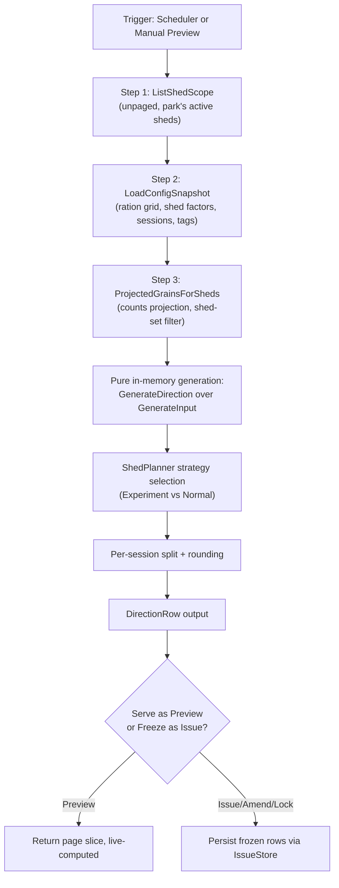
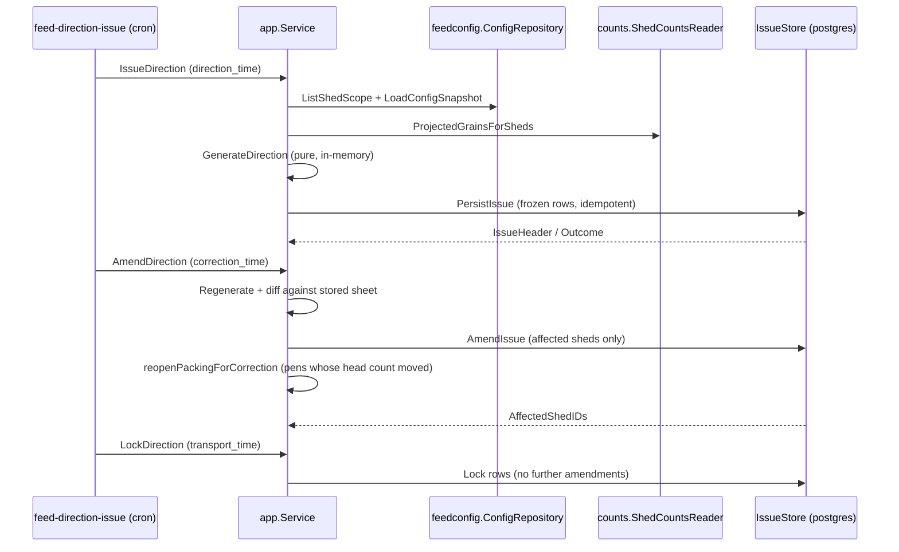
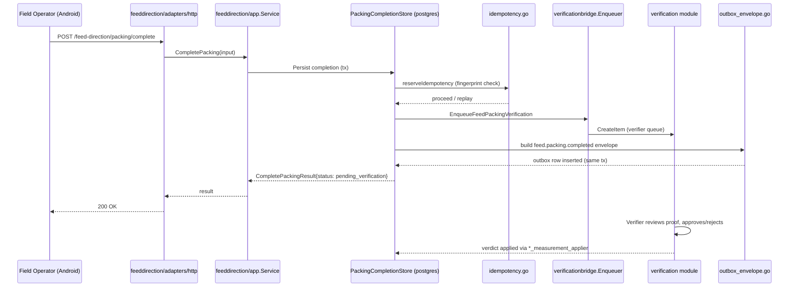
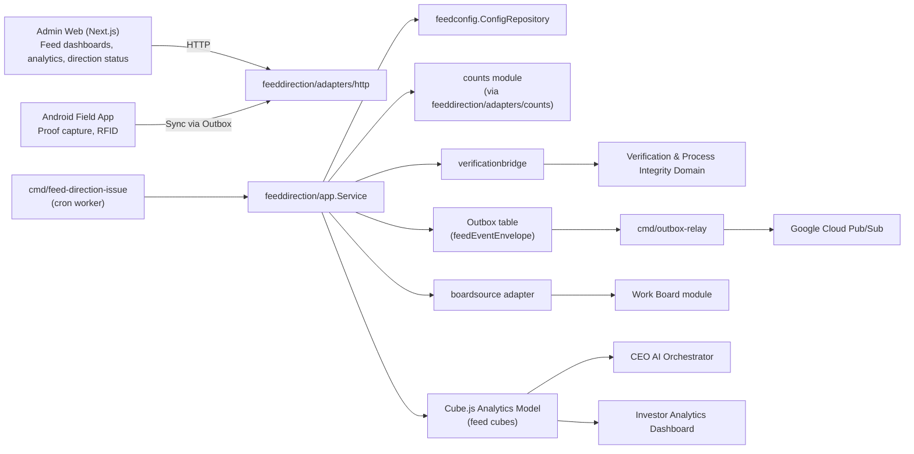

I now have comprehensive coverage of the Feed Management Domain. Let me write the documentation.

# Feed Management Domain

## 1. Overview

The Feed Management Domain is the operational core of GoatOS's daily farm workflow: it decides **what each shed is fed**, **when the instruction is issued and frozen**, and **how the physical work of packing, distributing, transporting, and disposing of wastage is proven and verified**. Every goat on every farm depends on this domain running correctly every single day — an error here does not surface as a UI glitch, it surfaces as an animal that goes unfed or overfed.

The domain sits in `backend/internal/{feed, feeddirection, feedconfig, feedwaterremoval}` and is implemented in Go following the project's hexagonal (ports-and-adapters) convention: pure computation lives in `domain/`, use-case orchestration in `app/`, dependency boundaries in `ports/`, and I/O concerns (HTTP, PostgreSQL, verification bridges, work-board integration) in `adapters/`.

| Attribute | Value |
|---|---|
| Domain type | Core Business Domain |
| Importance | 9.3 / 10 |
| Complexity | 8.0 / 10 |
| Primary language / stack | Go, PostgreSQL (pgx driver, no sqlc in this submodule except `feed`) |
| Deployable entry points | `backend/cmd/api` (HTTP serving), `backend/cmd/feed-direction-issue` (scheduler), `backend/cmd/seed-feed-ration`, `backend/cmd/import-feed-*` |

### 1.1 Sub-modules

| Sub-module | Code Path | Responsibility |
|---|---|---|
| **Feed Direction & Distribution** | `backend/internal/feeddirection` | Generates daily per-shed, per-session feed quantities; owns the issue → amend → lock lifecycle; tracks packing/distribution/transport/wastage completions; the largest and most business-critical sub-module (64 Go files, ~964 KB of source) |
| **Feed Configuration** | `backend/internal/feedconfig` | Owns the authored configuration tables the generator reads: ration rates, shed factors, session split, experiment config, feed-item catalog, dispatch clock |
| **Feed Core Domain Logic** | `backend/internal/feed` | Base feed entities, feed-completion recording against obligations, counts-projection exception handling, legacy import support |
| **Feed Water Removal** | `backend/internal/feedwaterremoval` | A small, focused cross-cutting rule module: computes the evening cutoff that governs when feed/water must be withheld before weighing or in-feed deworming |

---

## 2. Architectural Boundaries and Table Ownership

A defining discipline of this domain is **strict table ownership**: each module owns a distinct set of PostgreSQL tables, and no other module writes to them.

- **`feedconfig`** owns *authored configuration*: `feed_ration_rates`, `feed_shed_factors`, `feed_session_templates`, `feed_schedule_config`, `feed_experiment_config`, the feed-item catalog, and `feed_config_write_log` (an append-only audit ledger). It is the **only writer** of these tables.
- **`feeddirection`** owns **no configuration tables at all**. Per its own package documentation: *"This module OWNS NO TABLES. It is a read-only generator over two other modules' data."* Its only genuine write path is the completion/proof tables it introduced for packing, distribution, transport, and wastage (`feed_direction_issues`, `feed_direction_issue_rows`, `feed_packing_completions`, `feed_distribution_completions`, `feed_transport_tasks`/`feed_transport_attempts`, `feed_wastage_completions`, `idempotency_keys`).
- **`feed`** (core) owns feed-completion records against animal-health obligations and imports of legacy/external consumption data.
- **`feedwaterremoval`** owns nothing beyond a single configuration row (`feed_water_removal_config`) that both the Weighing and Preventive Care (PC Care) modules consult through this package so they can never disagree about when the removal evening begins.

This separation enforces a clean read/write contract: `feeddirection`'s `ports.ConfigRepository` interface reads *from* `feedconfig`'s tables but never mutates them, and `feedconfig`'s own `app.Service` is where authored values are validated or rejected before they are persisted.

---

## 3. Core Concept: The Three-Step Bounded-Read Generation Pipeline

The single most important architectural pattern in this domain is the feed-direction generation service's **deliberately thin orchestration with exactly three bounded reads**, documented directly in `feeddirection/app/service.go`:

1. **Read the full filtered shed scope** — unpaged, bounded by the park's active shed catalog (`ports.ConfigRepository.ListShedScope`).
2. **Batch-read the authored config snapshot** for the park in one call, set-based (`ports.ConfigRepository.LoadConfigSnapshot`).
3. **Batch-read the projected grains** for exactly those sheds in one call, shed-set filtered (`ports.ShedCountsReader.ProjectedGrainsForSheds`).

From these three reads, **one pure in-memory generation pass** produces every direction row for the park, from which the requested page is sliced. This design is a deliberate rejection of the classic N+1 fan-out anti-pattern: there is no per-shed loop containing a database call, and no per-grain lookup. The read count is *constant* — three — regardless of park size or page size.



The reader adapters that implement steps 1–3 are themselves careful about scale. `feeddirection/adapters/counts/reader.go`, for instance, drains the counts module's projection page-by-page (200 grains per page, capped at 25 pages) but treats a truncated result as a hard failure (`ports.ErrScopeTooLarge`) rather than silently returning a partial set — a design choice explicitly made to prevent a "wrong pack weight presented as a correct one."

### 3.1 Why unpaged reads are safe here

Both the shed-scope read and the config-snapshot read are deliberately **unpaged** even though the module elsewhere strictly bounds pagination. The justification, documented directly in the ports package, is that a feed-quantity total *cannot be aggregated in SQL* — it must be computed in memory over the whole matching population, or the summary would silently describe a different (smaller) set than the visible page. Both scope reads therefore **fail closed** (`ErrScopeTooLarge`) rather than truncate, and the bound is justified because these are configuration-scale sets (a park's shed catalog — order of tens to ~78 sheds in the largest live park), not sets that grow with herd size.

---

## 4. The Quantity Resolution Rule: Configured Zero vs. Missing Configuration

The domain enforces one safety-critical distinction throughout its type system, described as *"the single most important property"* of the generation model:

| State | Meaning | Behavior |
|---|---|---|
| `rate = 0` | The rate was **authored** as zero (e.g., milk-fed kids correctly receive 0 g of solids) | Resolved. Proceed as instructed. |
| `rate not found` | The configuration needed to derive a quantity **does not exist** | **Blocked.** The gap must be surfaced, never defaulted. |

This is enforced *structurally*, not by convention: `ItemQuantity.QuantityKg` is a pointer that is `nil` for every blocked item, so no downstream sum, render, or JSON encoding pass can silently coerce a blocked cell into a numeric zero. Named block-reason codes (`BlockReasonNoRationRate`, `BlockReasonUnknownShedTag`, `BlockReasonUnknownRationGroup`, `BlockReasonNoSessionTemplate`, `BlockReasonInvalidShedFactor`) give both machine-groupable and human-readable explanations for why a cell could not be resolved.

The resolution formula itself:

```
ration_group = (feed_shed_tags.applies_to = 'kid') ? 'Kid' : feed_ration_groups[breed]
tag          = goats.management_stage
grams/head   = feed_ration_rates[park, ration_group, tag, feed_item]   (currently open row)
shed total   = projected_head_count × grams_per_head × COALESCE(shed_factor, 1.0)
per session  = shed total × feed_session_templates.split_fraction
```

Notably, the kid/adult branch is derived from `feed_shed_tags.applies_to` — a tag vocabulary — rather than from the animal's stored `age_band`, because a maintainer decision (documented in code) found the two fields disagree for a handful of live animals, and the tag vocabulary is what the ration grid is actually indexed by.

---

## 5. Quantity Strategies: The Planner Pattern

A shed's daily quantity can be derived two fundamentally different ways, and the domain resolves this with a clean **strategy pattern** (`feeddirection/domain/strategy.go`) rather than scattering `if experiment { ... }` branches through the generator:

```go
type ShedPlanner interface {
    Workflow() string
    Applies(shed ShedInput, cfg ConfigSnapshot) bool
    PlanDaily(shed ShedInput, cfg ConfigSnapshot) []DailyRow
    SessionFeedItems(cfg ConfigSnapshot, session SessionTemplate) (items []FeedItem, scoped bool)
}
```

Two planners are registered, evaluated **in order** (first match wins):

- **`ExperimentPlanner`** — matches sheds with hand-authored rows in `feed_experiment_config`; quantities are *absolute kg per shed*, entirely independent of head count arithmetic.
- **`NormalPlanner`** — the universal fallback; computes `head_count × grams_per_head × shed_factor` from the ration grid.

Because `NormalPlanner.Applies` always returns true, the planner set is *total by construction*: no shed can silently fall through the strategy selection and produce zero rows, which would be visually indistinguishable from an empty (correctly fed-nothing) shed. Adding a third feeding workflow in the future requires only writing one new `ShedPlanner` and registering it ahead of `NormalPlanner` — no change to the shared pipeline (session splitting, rounding, blocked-cell handling) is needed.

Everything **downstream** of daily-quantity derivation — session splitting, rounding, and blocked-vs-zero encoding — is deliberately shared code (`generate.go`) so the two workflows can never disagree about *what a shed is fed* once the planner has answered *how much*.

---

## 6. Exact-Arithmetic Rounding Policy

Feed quantities are computed with `math/big.Rat`, never `float64`, throughout the pipeline. The database's own numeric precision (`numeric(12,3)` grams, `numeric(8,4)` multipliers, `numeric(6,4)` split fractions) cannot be represented exactly in binary floating point, and a float pipeline would make a shed's quantity depend on evaluation order — an unacceptable property for a farm-facing number that must reconcile.

Rounding is applied **once**, at the very end of the pipeline, per session — to the number that is actually packed — using the legacy rule of *rounding up to the nearest 100 g*. The design deliberately rounds up rather than to nearest, because under-feeding is the unsafe direction. Critically, rounding is applied **per session, not per day**: the daily total is *defined as the sum of the rounded sessions*, so a two-session shed's printed numbers always sum exactly to the reported daily total — an invariant that would break if the daily total were rounded first and then split.

The `RoundingPolicy` struct supports a per-feed-item override map, currently unused but reserved for a documented (unresolved as of writing) special case involving baking soda's much smaller per-head rate.

---

## 7. The Issue → Amend → Lock Lifecycle

Feed direction sheets are not served live to operators in production; they are **frozen** through an explicit lifecycle managed by `feeddirection/app/lifecycle.go`, which reuses the exact same generation math as the preview path — it never recomputes differently, it only *freezes and serves* the same output.

### 7.1 Feed-day offset

Feed for business day **D** is produced on **D-1**. Every lifecycle operation computes `feed_day = businessDate(AsOf) + 1`, meaning on business day X, the issue, correction, and lock actions all act on `feed_day = X+1`.

### 7.2 Lifecycle states

| Action | Trigger clock | Effect |
|---|---|---|
| **Issue** (`IssueDirection`) | `direction_time` | Generates and freezes the day's sheet for the first time. Idempotent — an exact re-issue is a no-op, and a differing re-issue re-issues in place. |
| **Amend** (`AmendDirection`) | `correction_time` | Recomputes the whole sheet, diffs it against the stored version, and persists an amendment *only for the affected sheds*. Refused once the sheet is locked. |
| **Lock** (`LockDirection`) | `transport_time` (lock_time) | Freezes the sheet permanently; later changes roll to the next feed day. A second lock is a no-op. |



### 7.3 Amendment side-effect: reopening packing

A particularly notable piece of domain logic is `packingReopenContexts`/`packingReopenSentence` in `lifecycle.go`. When an afternoon correction changes a pen's projected head count (an animal was moved in or out), any packing already submitted for that pen is **reopened** — the operator must re-pack against the new numbers. The system composes a farm-language sentence explaining *why*, citing the old and new packed quantities where available ("This bag was 4 kg for 2 animals; it is now 24 kg for 12 animals"). This was a direct response to a documented staging incident (2026-08-28) in which a corrected sheet silently updated the displayed quantity without explaining what had changed — the fix is deliberately fail-open: every clause of the sentence degrades independently rather than inventing a number it doesn't have.

### 7.4 The scheduler entry point

`backend/cmd/feed-direction-issue/main.go` is the tenant/park/workflow/feed-day-scoped CLI worker that drives the lifecycle from a configurable dispatch clock (`feed_schedule_config`). It:

- Resolves which parks have a dispatch clock configured (or targets one explicitly named park);
- Narrows the requested workflow (`normal`, `experiment`, or `both`) to only the workflows a park actually runs;
- Dispatches `issue`, `amend`, or `lock` per `(park, workflow)` pair;
- Treats "amend/lock a day that was never issued" (`ErrIssueNotFound`) as a benign scheduling gap that is logged and skipped rather than a fatal error, so one park's misconfiguration cannot abort the whole run.

---

## 8. Verification-Gated Completion Write Paths

Feed execution — the actual physical work of packing, distributing, transporting, and disposing of wastage — is **not instantly completable**. Per a maintainer decision (2026-07-26, superseding an earlier "packing stays instant" rule), every one of these activities requires proof capture followed by verifier review before it is marked complete. The old instant-complete HTTP route is deliberately left unregistered.

The domain implements **four separate, verification-gated completion stores**, each owning its own table and each requiring a different combination of mandatory proof:

| Completion type | Table | Mandatory proof | Grain |
|---|---|---|---|
| **Packing** | `feed_packing_completions` | One packing video | Shed + partition (pen) + session number + target date + workflow |
| **Distribution** | `feed_distribution_completions` | Three proofs: weight photo, distribution video, water video | Shed + session |
| **Transport** | `feed_transport_tasks` / `feed_transport_attempts` | Transport proof, append-only attempts | Daily, non-session shed task |
| **Wastage** | `feed_wastage_completions` | One wastage video | Experiment pens only, one row per pen per feed day |

Each of these is a **separate table from every sibling** — packing, distribution, and wastage never share a completion record, even though they gate on the same underlying sheet. This separation lets each proof type progress independently: three different operators can complete three different proof slots for the same pen-session without contention.

### 8.1 The verification bridge pattern

Rather than importing the `verification` module's storage directly, `feeddirection` talks to it through a small composition-layer adapter package: `feeddirection/adapters/verificationbridge`. This mirrors the same pattern used by `countsbridge` and `sopbridge` elsewhere in the codebase — a deliberate, repeated architectural convention that keeps bounded contexts decoupled at the storage layer while still allowing synchronous calls at the service layer.

```go
type verificationCreator interface {
    CreateItem(ctx context.Context, in verificationdomain.CreateItem) (verificationdomain.CreateItemResult, error)
}
```

For a feed distribution completion, **all three proofs travel on one verification item** — a verifier approves or rejects the full set together, in capture order (weight photo first, because it is the only proof checkable against the expected ration). `CreateItem` is idempotent on `(tenant, idempotency_key)`, so a retried enqueue after a partial failure heals rather than duplicates. Media references are filtered to drop blank slots so a verifier's card never shows a media slot that cannot load — and subject labels are built exclusively from stable business identifiers (session number, shed label via `oploc.Display()`), never raw database UUIDs, per a hardened project-wide "never render a UUID" rule.



### 8.2 Fail-closed enqueue guarantees

Every completion store requires its corresponding verification enqueuer to be wired; without it, the completion call fails closed with a dedicated error (`ErrPackingStoreUnavailable`, `ErrDistributionStoreUnavailable`, `ErrWastageStoreUnavailable`) rather than silently flipping a row to `pending_verification` with nothing for a verifier to act on. This is a recurring theme across the domain: **missing wiring must surface as a 500, never as silent data loss.**

Similarly, `ErrPackingAlreadyRecorded` distinguishes an idempotent replay of the *same* proof (a safe no-op) from a *different* video arriving against an already-recorded pen-session (a hard conflict) — because silently discarding a genuinely different recording while returning HTTP 200 would tell the operator their work was saved when it was not.

---

## 9. Request-Level Idempotency

Every mutating write in the `feeddirection` module — the domain's *only* genuine write boundary — goes through a shared idempotency guard (`adapters/postgres/idempotency.go`) that mirrors the same pattern used by the obligation and procurement modules elsewhere in GoatOS:

1. The caller supplies a client-generated idempotency key.
2. A **semantic request fingerprint** is computed via SHA-256 over the ordered fields that define the completion's effect.
3. Both are reserved in the **same transaction** as the write's side effects (`INSERT ... ON CONFLICT DO NOTHING`).
4. An exact replay (same key + same fingerprint) returns the original result without rerunning any side effect.
5. A same-key-different-fingerprint replay is rejected with `ErrIdempotencyConflict` — it is a genuine payload conflict, not a safe retry.

```go
func reserveIdempotency(ctx context.Context, tx pgx.Tx, tenantID, scope, key, fingerprint string) (idemReservation, error)
```

This guard is what allows the Android field app's offline-first sync (which retries uploads after connectivity gaps) to safely resend a completion request without risk of double-counting a packed session.

---

## 10. Domain Event Publishing: A Shared Envelope Builder

Completion writes publish domain events (`feed.packing.completed`, `feed.distribution.completed`) into the transactional outbox for downstream consumption (notifications, analytics). The module's `outbox_envelope.go` file exists specifically to fix a real production defect: three independent producer call sites had each hand-built an event envelope map, and all three omitted required schema fields (`occurred_at`, `recorded_at`, `actor`, `visibility_scope`, `evidence_refs`) or misshaped the `producer` field.

The consequence was insidious: the `INSERT` into `outbox_messages` succeeded, the transaction committed, and the operator's screen showed the completion as successful — but the event was only rejected *later*, by the outbox relay's schema validator, as `invalid_event_envelope`. **Nothing on any screen ever reported the failure**, and the event silently never reached a downstream consumer.

The fix centralizes envelope construction in a single `feedEventEnvelope.build()` function that guarantees every one of the seventeen schema-mandated fields is present:

```go
type feedEventEnvelope struct {
    EventID, EventType, SchemaVersion, SchemaRef      string
    AggregateType, AggregateID, IdempotencyKey        string
    TenantID, ParkID, ShedID                          string
    ActorID                                            string
    OccurredAt                                          time.Time
    Payload                                             map[string]any
    TraceID                                             string
}
```

Notable details enforced by this builder:
- The subject type is *derived* from `ShedID` rather than passed by each caller as a free-form string (all three prior call sites happened to spell it `"shed"`, which is not a value in the schema's enum — the correct value is `"location"`). Deriving it structurally makes the mistake *unavailable*, not merely discouraged.
- An empty `ActorID` is rendered as `actor_type: "system_rule"` (not `"system"`, which is not in the schema's enum), while a populated one renders as `actor_type: "human"`.
- `evidence_refs` is always emitted as an empty array rather than omitted — the *absence* of the field, not an empty array, is what fails schema validation, since the actual proof media lives on the verification item, not on the feed event itself.
- Optional scope fields (`park_id`, `shed_id`) are omitted entirely when unset (a `jsonb_strip_nulls` equivalent), so a consumer filtering on scope can never accidentally match an empty string against a real identifier.

---

## 11. Work Board Integration (Read-Only Aggregation)

The `feeddirection/adapters/boardsource` package is Feed's read-only contribution to the cross-module Work Board (documented under a maintainer decision dated 2026-09-12). It aggregates **one card per park per activity** — packing, direction/distribution, transport, and wastage — with individual sheds listed as subtasks *inside* the card, rather than one card per shed.

Key design points:
- **Isolation preserved in both directions**: this package lives inside `feeddirection` and reads only its own tables; the generic Work Board module never reads a feed table directly.
- **"The work day, not the serve day"**: a board date `D` shows what the crew should *film* on `D` — direction and wastage are filmed on the serve day itself, while packing and transport are filmed the day *before* the serve day, so a single card correctly gathers same-day filming obligations across activities with different timing.
- **Leftmost-lane placement**: a card lands in whichever lane still has outstanding work — *To do* if any shed is unstarted, else *In progress*, else *In review*, else *Done* — computed via a `MIN` over per-shed subtask ranks, so the board always surfaces the most urgent outstanding state.
- The module is explicitly documented as **reporting-only**: it materializes no state and cannot submit, verify, or trigger rework — it only reads and rolls up existing completion status.

---

## 12. Analytics and Alerts

- **Directed Analytics** (`adapters/postgres/analytics.go`, the largest single file in the domain at ~129 KB) serves windowed rollups of the frozen sheet — directed kilograms, head-days, and per-head grams — for the Feed Analytics page. It is cached with TTL-based invalidation and fails closed (rather than serving stale/empty data silently) when the analytics reader is not wired.
- **Alerts** (`adapters/postgres/alerts.go`) surfaces the module's own lifecycle alert feed (e.g., a park whose dispatch clock never fired) via cursor-based pagination — deliberately not offset-based, since alerts are an unbounded, growing stream rather than a small configuration list.
- Additional analytics surfaces — `ExecutionAnalytics`, `ExperimentAnalytics`, `StockAnalytics`, `ShedFeedAnalytics` — are all exposed through dedicated read-only HTTP routes and feed both the Admin Web dashboard and, indirectly, the Cube.js semantic layer consumed by the CEO AI assistant and the Investor dashboard.

---

## 13. Feed Water Removal: A Focused Shared Rule

`feedwaterremoval` is architecturally the simplest sub-module but illustrates an important cross-domain consistency pattern. Per a maintainer decision (2026-09-07), the *cutoff* — the farm-wide Asia/Kolkata wall-clock time at which the "removal evening" opens before an animal is weighed or given an in-feed deworming — is treated as **configuration, not code**, and is stored once per tenant.

Both the Weighing and Preventive Care (PC Care) modules answer two questions exclusively through this shared package so the two domains can never disagree:

- **Planning**: the earliest date a task requiring feed/water removal can be scheduled for, computed relative to `now` and the cutoff.
- **Visibility**: the instant the removal card should surface on an operator's task list — the cutoff time on the evening *before* the work date.

All comparisons are strictly **business-day-grained** (IST wall-clock minute-of-day), never `now ± N hours`, which avoids the class of bug where an operation drifts across a day boundary depending on when exactly it runs.

---

## 14. Integration with the Broader GoatOS Platform



- **Verification & Process Integrity Domain**: every completion write path (packing, distribution, wastage) enqueues into the shared verification queue through the `verificationbridge` adapter, making Feed one of the domain's principal producers of review work.
- **Field Operations & Counts Domain**: the generation pipeline's third bounded read consumes the counts module's *projected* head-count (live herd plus approved-but-unexecuted movements), never the raw current census — a subtle but important distinction that ensures a feed plan covers animals that will be present on the target feed day, not merely animals present today.
- **Notification & Event Infrastructure Domain**: all domain events are published through the transactional outbox pattern, decoupling Feed from its consumers (notifications, downstream analytics) at runtime.
- **Leadership Analytics & AI Assistant Domain**: feed-related cubes in the Cube.js semantic layer are queried both by the CEO AI orchestrator's guarded read-tools and by the Investor dashboard, giving leadership consistent feed-cost and stock metrics across both conversational and static reporting surfaces.
- **Admin Web Application Domain**: farm managers view feed direction status, packing/distribution/wastage worklists, and the various analytics windows through dedicated feature pages backed by this domain's HTTP handlers.

---

## 15. Design Principles Observed Across the Domain

Reviewing the module's code comments and structure surfaces a set of consistently applied engineering principles that any contributor should internalize before modifying this domain:

1. **Fail closed, never silently truncate or default.** Scope reads, grain projections, and idempotency reservations all prefer a hard error over a partial or plausible-but-wrong result.
2. **A configured zero and a missing configuration are opposite facts and must never collapse into one.** This rule is enforced by the type system (pointer semantics), not by convention alone.
3. **Constant, bounded read counts regardless of scale.** The generation pipeline is explicitly documented to never issue an N+1 fan-out, and reader adapters drain paginated sources to completion rather than accepting a silently capped result.
4. **Rounding happens exactly once, at the point of physical action (the session), never earlier.** This preserves the invariant that reported totals always equal the sum of what was actually packed.
5. **Strategy over branching for divergent business logic.** The normal vs. experiment feeding workflows are separate `ShedPlanner` implementations rather than conditional branches scattered through shared generation code.
6. **Verification bridges, not direct table access, connect bounded contexts.** `feeddirection` never writes to the `verification` module's tables directly; it calls a narrow composition adapter.
7. **Copy and error messages are farm language, not database language.** Operator-facing text (e.g., packing-reopen sentences) deliberately never names a table, job, or internal identifier — and UUIDs are structurally excluded from any subject label a human will read.
8. **One shared envelope builder, not N independent ones**, for anything that must satisfy an external schema contract — because independently maintained copies of the same structure reliably drift apart.