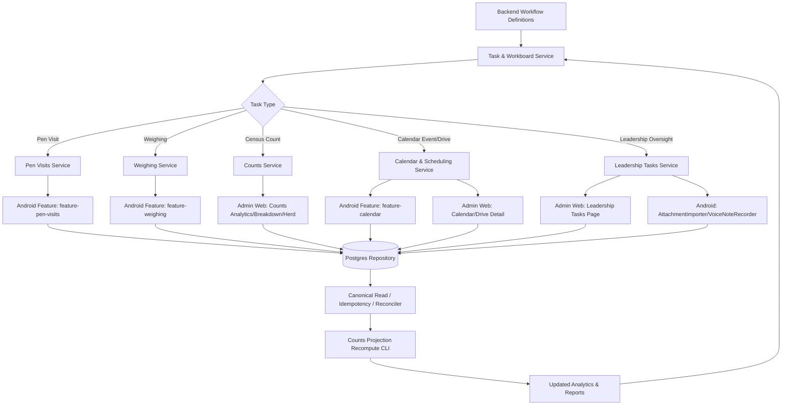
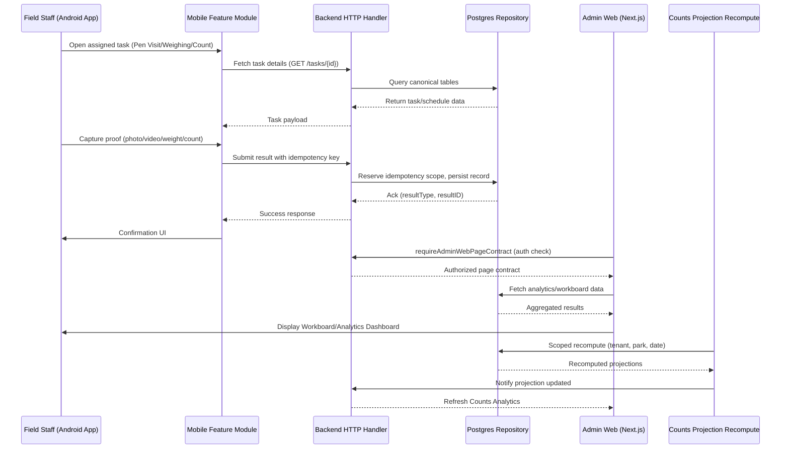

I now have a solid, evidence-based understanding of the domain. Let me write the complete documentation.

# Field Operations & Task Execution Domain

## 1. Overview

The **Field Operations & Task Execution Domain** is the operational heart of GoatOS. It is the layer where paperwork becomes action: it schedules and tracks the day-to-day work performed by field operators (feeding, weighing, counting, health visits) and by the leadership team supervising them, and it bridges the gap between backend workflow definitions and the mobile capture tools operators use in the field.

Structurally, the domain is a **cluster of six sibling Go bounded contexts** that share the same hexagonal shape (`domain / app / ports / adapters`) and the same cross-cutting integration contracts (idempotency, verification bridging, workboard sourcing):

| Sub-module | Backend package | Responsibility |
|---|---|---|
| **Task & Workboard Management** | `internal/tasks`, `internal/workboard` | Birth/death per-goat follow-up workflows; the unifying cross-module "Work Board" read |
| **Leadership Tasks** | `internal/leadershiptasks` | Executive-to-executive task delegation with attachments/voice notes |
| **Pen Visits** | `internal/penvisits` | Post-work animal-welfare confirmation visits raised by other modules |
| **Calendar & Scheduling** | `internal/calendar` | Unified hot-list/month calendar across vaccination, feed, and other time-bound obligations |
| **Weighing** | `internal/weighing` | Weighing campaigns, work items, growth/fasting analytics |
| **Counts (Census) & Shifting** | `internal/counts`, `internal/countsbridge` | Herd counting, animal shifting/movement execution, milk feeding/preparation, projection recompute |

These modules do not operate in isolation — they are stitched together by two unifying mechanisms unique to this domain:

1. **The Work Board** (`internal/workboard`) — a read-only aggregation layer that normalizes work items from every operational module (feed, health, vaccination, weighing, counts, milk, PC care, toxin, procurement, verification) into one row shape, one keyset-paged endpoint, and one four-lane Kanban view (`todo / in_progress / in_review / done`) consumed identically by admin-web and the Android app.
2. **Pen Visits** — a cross-cutting "closing step" raised automatically by other modules (PC Care, vaccination) rather than a standalone task type, illustrating how this domain composes derivative work from primary operational events.

On the client side, the domain is rendered through two parallel surfaces:
- **admin-web** (Next.js App Router) — server-rendered management screens under `app/(admin)/{tasks,work-board,calendar,weighing,counts}` for managers, leaders and verification staff.
- **goatos-android** — Kotlin/Jetpack Compose feature modules (`feature-calendar`, `feature-pen-visits`, `feature-weighing`, plus the `leadershiptasks` package) used by field operators and leadership on-device, with proof-capture tooling (RFID scan, photo/video, voice notes) and multi-language (en/hi/kn/te) support.

---

## 2. Architectural Pattern

Every sub-module in this domain strictly follows the project-wide **hexagonal (ports-and-adapters) architecture**:

```
domain/     — pure business rules, sentinel errors, state machines, display-copy composition
ports/      — interfaces the app layer depends on (repository, verification enqueuer, board source)
app/        — use-case orchestration (services, event handlers, verification verdict handlers)
adapters/
  http/            — REST handlers (snake_case JSON, backend-composed display copy)
  postgres/        — sqlc/pgx repositories, canonical reads, idempotency, reconciliation
  verificationbridge/ — enqueues proof-bearing work into the shared Verification module
  boardsource/     — implements ports.Source so the module's work surfaces on the Work Board
  proof/           — validates proof references before a completion is accepted
```

This uniformity means an engineer who understands one module (say, `weighing`) can immediately navigate `counts` or `penvisits` — the same layering, the same idempotency contract, the same bridge pattern to Verification recur module after module.

### 2.1 The "no shared table" rule

A defining architectural decision, made explicit in the `workboard` package documentation, is that **the Work Board owns no table of its own**. Each contributing module (`weighing`, `counts`, `penvisits`, etc.) implements a `ports.Source` over its *own* tables and emits a normalized `domain.Row`. The board's `Service.List` walks the registered sources in a fixed, versioned order using a **global keyset cursor over `(module, source_type, source_id)`**, bounded to one tenant, one park, and one business date per request. This lets the board scale to dozens of contributing modules without ever performing a cross-module join, and it isolates one module's slow query from blanking the whole board — a failing source is recorded as `Degraded` rather than aborting the page.

### 2.2 Idempotency as a first-class contract

Every write path in this domain — task action answers/completions, pen-visit submissions, leadership-task status changes, calendar reconciliation — is guarded by the same **idempotency_keys** pattern, reimplemented consistently in `tasks/domain`, `calendar/adapters/postgres/idempotency.go`, and `penvisits/adapters/postgres/idempotency.go`:

1. A scoped key is derived as `tenant_id:scope:client_key`.
2. A SHA-256 **request fingerprint** is computed over the fields that define the operation's semantic effect.
3. `INSERT ... ON CONFLICT DO NOTHING` claims the key inside the same transaction as the side effect.
4. An **exact replay** (same key + same fingerprint) returns the original result with zero new side effects.
5. A **same-key/different-payload** replay is rejected as `ErrIdempotencyConflict` (HTTP 409).
6. A **new key against a terminal row** (already completed, or in verifier review) is rejected with domain-specific sentinel errors (`ErrActionAlreadyCompleted`, `ErrActionInReview`).

This is essential given the domain's offline-first mobile clients: a field operator who submits a weight or a completion twice due to a retry after a dropped connection must never create duplicate task state or duplicate verification items.

### 2.3 Verification as the universal gate

Nearly every completion path in this domain — task actions, pen visits, weighing observations, shifting moves, milk feeding/preparation — routes proof-bearing work through the shared **Verification & Process Integrity domain** via a per-module `adapters/verificationbridge` package. This bridge pattern is deliberately repeated rather than centralized: each module composes its own domain-specific `verificationdomain.CreateItem` (subject label, context rows, media refs) and calls a narrow `verificationCreator` interface (`CreateItem`, `WithdrawItemsBySource`, `MarkVerdictApplied`, `RelabelItemBySource`), so a module never writes another module's tables. `countsbridge` explicitly documents this as mirroring the earlier `sopbridge` pattern — a composition-layer adapter that decouples two modules while keeping their storage private.

---

## 3. Sub-module Deep Dive

### 3.1 Task & Workboard Management

**Package**: `internal/tasks` (birth/death workflow engine) + `internal/workboard` (cross-module board read).

`internal/tasks` is scoped narrowly and deliberately: it is documented as *"the birth/death follow-up workflow engine"* (maintainer decision 2026-07-27). A birth submission creates every child goat and immediately opens one per-goat workflow instance; a death report opens its workflow while the animal is still alive so the operator can capture both mandatory proof videos before admin approval. Each workflow is stamped from a **code-defined template** (`TemplateBirthKid`, `TemplateBirthMother`, `TemplateDeath`) — an explicit rejection of a database-driven template engine in favor of compiled, reviewable templates.

Key domain types:
- `WorkflowInstance` — the card (state, `ActionsTotal`/`ActionsDone`, `NextActionKey`, `AwaitingVerification`, `RowVersion` for optimistic concurrency).
- `WorkflowAction` — one step (question, question_select, or action type; `RequiresVideo`; idempotency fields).
- `ActionWriteResult` — carries `NeedsVerificationEnqueue`, `DeathProofRefs`, and `DeathReviewRound` (a monotonic counter baked into the verification idempotency key so a re-shoot after rejection always opens a fresh review item, even with byte-identical proof).

The domain enforces a rich sentinel-error vocabulary for sequencing: `ErrActionOutOfSequence` (steps must complete in section order), `ErrActionNotYetDue` (dependency-timed actions), `ErrPermanentIdentifierRequired` (a kid cannot be "tagged" complete before its permanent RFID is scanned), and `ErrProofRequired` for `requires_video` actions.

`internal/workboard` is the aggregation layer described in §2.1. Its domain vocabulary reuses `WorkState` and `Severity` **verbatim** from `processintegrity/domain` (eleven canonical work states, four lanes) rather than inventing a twelfth — an explicit anti-duplication decision recorded in the code comments. `LaneFor` derives the Kanban column from the work state (e.g., `overdue`/`rejected`/`blocked` all render `in_progress`), and the same mapping is the single source of truth for both the phone's "My Work" view and the web console's board.

The HTTP surface exposes:
- `GET /work-board/rows` — the keyset-paged board read.
- `GET /work-board/summary` — per-state counts.
- `GET /work-board/rows/{row_key}/subtasks` — a row's sub-task drilldown, itself keyset-paged.
- `POST /work-board/flags` — operator/leadership flagging.

### 3.2 Leadership Tasks

**Package**: `internal/leadershiptasks`.

This module implements a distinctly different kind of task from the operational workflows above: it is **not operational work** — no shed, no animal, no proof requirement by default. A director raises a task for exactly one assignable person (title + brief + optional attachments), the assignee sees it, opening it stamps `SeenAt` (which drives a badge count), and it moves through a closed status vocabulary: `open → in_progress → done` (or `cancelled`). Both parties may append **Notes** to a Jira-style activity stream while the task is active; a legacy `AssigneeComment` single field is preserved for older mobile clients but new clients read the `Notes` array.

Key constraints baked into the domain layer:
- Every tenant-scoped task carries a running number (`#12`) minted inside the raise transaction, never reused — the human-readable identifier used in conversation.
- The raiser may edit the brief/attachments or cancel **only** while the task is `open` or `in_progress`; a finished task is immutable history (`ErrTaskClosed`).
- Attachments are capped (`MaxAttachments = 12`) and typed (`audio`, `video`, `photo`, `file`); the byte payload lives in the shared **proof store**, referenced by `ProofID`.
- `ErrSelfAssignment` prevents a director from raising a task addressed to themselves.

On **admin-web**, `features/leadership-tasks` implements a `NewTaskModal` mirroring the phone's "New task" screen (assignee picker, title, brief, three attachment pickers). Server actions in `actions.ts` (`raiseLeadershipTaskAction`, `changeLeadershipTaskStatusAction`, `setLeadershipTaskCommentAction`) validate idempotency-key length (8–200 chars), upload attachment files server-side via `uploadLeadershipTaskAttachment` before calling `raiseLeadershipTask`, and use `revalidatePath` + `redirect` with query-string feedback (`lt_status`, `lt_code`) rather than client-side toasts — consistent with the App Router's server-first mutation pattern.

On **Android**, the `sg.mesha.goatos.leadershiptasks` package supplies two field-capture primitives used nowhere else in the codebase quite this way:
- `ContentResolverAttachmentImporter` — copies a picker's transient `content://` grant into app-private storage (`filesDir/leadership-task-drafts`) *before* the picker's grant expires, refusing files that exceed `maxBytes` **before** the copy completes (checked both from `OpenableColumns.SIZE` and defensively re-checked as bytes stream in, to catch content providers that misreport size).
- `MediaRecorderVoiceNoteRecorder` — wraps `MediaRecorder` to produce AAC-in-MP4 (`.m4a`) voice notes in the same private directory, with an explicit `discard()` path for abandoned recordings and defensive handling of a `stop()` on a recorder that captured nothing (treated as "no note produced," not an error).

### 3.3 Pen Visits

**Package**: `internal/penvisits`.

Pen Visits is architecturally the most interesting sub-module because it demonstrates **derived work** rather than primary work: it is explicitly documented as *not a task of its own*. The day after preventive-care work (a vaccination shed proof, or PC Care work like deworming/anti-protozoan/tick-removal/hoof- or hair-trimming) is submitted in a pen, one of the park's configured visitors must record **one live-camera video** confirming the animals' condition. That video is routed to the Verifier exactly like every other proof clip in the system, and — critically — **the parent care task closes only once the visit itself is approved**, chaining two verification gates together.

Domain highlights:
- A **dual-dimension state model**: `WorkState` (`scheduled/delayed/completed/canceled` — the kernel/scheduling dimension) is orthogonal to `Status` (`open/pending_verification/completed/rework` — the verification-gate dimension). `completed` on the work-state axis is reached *only* when the verifier approves.
- `Source` records which parent raised the visit (`SourceKindPCCareTask` or `SourceKindVaccinationSubmission`), and the materializer copies both mandatory attributes from the parent's own verification item.
- A closed, ordered `Reason` vocabulary (vaccination, deworming, anti_protozoan, ticks_removal, hoof_trimming, hair_trimming) drives both card display order and de-duplication — a pen visited for two reasons on the same day is **one visit row**, not two.
- The visitor pool is **not fixed to one person**: "if multiple people are there, if anyone does then enough" — any configured park visitor may record the confirmation.

Pen Visits contributes to the Work Board through `adapters/boardsource`, with a subtle rule: its rows surface **under the parent module's own board lane** (e.g., "Deworming · Castro 2" under Preventive Care), not as an independent "Pen Visits" module column — reinforcing that a pen visit is conceptually the tail end of the parent task's chain, not a peer task type. Two disjoint `Source` implementations (`NewPCCare`, `NewVaccination`) guarantee a visit is never double-counted across the two parent modules.

The `feature-pen-visits` Android module is explicitly a **stateless renderer**: its `build.gradle.kts` forbids Hilt, networking, and Room dependencies inside the feature module itself — all state (paged Room flows, the recorder, the outbox) lives in `@HiltViewModel`s (`PenVisitListViewModel`, `PenVisitDetailViewModel`) in the `:app` module, with the feature module receiving state as parameters and emitting events via callbacks. The visit list renders `LazyPagingItems`, bounding memory at both the Room-window and network-page layers simultaneously.

### 3.4 Calendar & Scheduling

**Package**: `internal/calendar`.

The Calendar module is the domain's **temporal aggregation layer**, functionally analogous to the Work Board but organized around *time* rather than *state*. Its `CalendarEvent` domain type is deliberately **source-agnostic**: a single generic payload shape (`EventID`, `EventType`, `DueAt`, `WindowStart/End`, `Timezone`, `Severity`, `Status`) represents everything from `vaccination_dose_due` to `vaccine_cold_chain_check` to `vaccination_config_activation_review` — a closed vocabulary of over a dozen `Event*` constants defined once in `domain/types.go`.

A striking design decision documented in `DriveSummary` is the **single cross-surface progress definition** rule: both Android and admin-web *must* render `ProgressCompleted`/`ProgressTotal`/`ProgressPct` verbatim from the backend rather than deriving their own numerator client-side. The comment explicitly references a fixed defect where "the same drive showed different completion numbers... because each client picked its own fields" — `ProgressCompleted` is now canonically defined as *field work done* (`completed + submitted`), so an operator who has vaccinated and submitted proof for every animal sees 100% immediately, while outstanding verifier review is separately surfaced via `SubmittedCount` and the `verification_pending` status chip rather than by artificially holding the progress ring below 100%.

Calendar's Postgres adapter layer is unusually elaborate for this domain (its `canonical_read.go` alone is ~129KB, the largest single file across the whole domain), reflecting three distinct concerns:
- **Canonical read-through** (`canonical_read.go`) — optimized queries feeding the hot-list/month views.
- **Reminder cadence** (`reminder_cadence.go`, ~39KB) — computing when reminder notifications should fire.
- **Reconciliation** (`reconciler.go`) — a SQL-side integrity function, `goatos_reconcile_calendar_event_references`, that validates every `notification_requests`/`calendar_snoozes.calendar_event_id` against its typed prefix vocabulary (`obligation:`, `batch:`, `parkdrive:`, `catchup:`, `completion:`, `calendar:`), catching malformed references with SQL exception handlers rather than surfacing a runtime cast failure. Both the reconciler and its progress cursor use **stable keyset pagination** (`WHERE (source_table, record_id) > cursor`) — explicitly called out in comments as a fix (CAL-MAIN-03) for an earlier `LIMIT/OFFSET` implementation that rescanned rows at scale. The cursor itself is persisted per tenant in `calendar_reconciler_progress`, so a scheduled daily reconciliation run resumes exactly where the previous run stopped.

On admin-web, the calendar's drive-detail screen (`app/(admin)/calendar/drive/[eventId]/page.tsx`) is documented as a deliberate **full-screen replacement for a drawer** pattern, with its route allow-listed in an information-architecture guard script (`check-ia-guard.mjs`) that otherwise restricts nested drilldown routes.

### 3.5 Weighing

**Package**: `internal/weighing` — the largest sub-module by file count (56 Go files, ~1.19MB total), reflecting its breadth: weighing campaigns, work-item scheduling, growth trajectory computation, fasting-gate logic, weight corrections, demographics, exports, and leadership video review.

The domain's central abstraction is the **weighing work item**: *"the weighing equivalent of an obligation instance"*, whose grain is explicitly **one `weighing_campaign_sheds` bucket — never one animal, never one campaign**. Because one bucket has exactly one operator, a work item has exactly one owner, which simplifies both assignment and the Work Board's per-owner filtering.

Time handling is disciplined: everything is expressed as an **Asia/Kolkata business-day string** (`YYYY-MM-DD`) resolved through the shared `platform/biztime` package — never as a raw instant or a `now ± N hours` offset, which would be fragile across midnight boundaries and daylight considerations.

The kernel's cadence model publishes three registered domain events with explicit **routing directionality** documented inline:
- `weighing.work_item.day_start` → downward only, to the assigned operator.
- `weighing.work_item.rolled_forward` → downward to the operator **and** upward to leadership.
- `weighing.work_item.delayed` → upward escalation to `growth_director` and `ceo_internal`.
- `weighing.work_item.merged_on_carry_over` → a carry-over landing on a shed another task already covers is **closed, not reassigned** — "nothing is transferred" — with notification both to the operator whose item closed and to leadership.

A **fasting gate** interlocks with the kernel: work items are pushed to the next day if their campaign's feed-and-water-removal task was not submitted before a midnight deadline (`FastingGatedWorkItems`, `FastingTasksRolled` counters in `KernelSweepResult`), tying the Weighing sub-module operationally to the Feed Management domain.

Weighing's `verificationbridge/enqueue.go` illustrates the richest verification-integration contract in the domain, implementing four distinct seams beyond simple enqueue:
- `WithdrawItemsBySource` — retires a still-pending verification item when its underlying observation is superseded (e.g., a reopened weighing bucket).
- `MarkVerdictApplied` — acknowledges that the verdict has actually been written onto the observation, so the item doesn't silently vanish from the pending queue before the effect is real.
- `RelabelItemBySource` — re-composes the verifier-facing subject label after a weight correction, so the verifier is never shown a stale number they already replaced.
- The enqueue itself is explicitly **one item per piece of evidence** (per-animal video for individual weighing; per-shed video for lump-sum) — the code comments flag that batching this to one item per submission "has been raised twice as a scale defect."

On Android, `feature-weighing` is notable for one documented **exception** to the platform's strict "feature-* depends on core-* only" module-boundary rule: it depends directly on `feature-scan` to reuse two UI value types (`ScanReaderConnection`, `ProofUploadStatus`) rather than promoting them to `core-ui`, a pragmatic trade-off explicitly justified in the build file as avoiding unrelated scope creep. It also mandates that proof-video playback route through `ProofPlayerFactory` (in `core-media`) rather than instantiating `ExoPlayer.Builder` directly, so that a failed video fetch is guaranteed to reach the app's instrumented OkHttp telemetry pipeline.

### 3.6 Counts (Census) & Shifting

**Package**: `internal/counts` (63 files, ~986KB — the second-largest sub-module) + `internal/countsbridge` (4 files, the composition-layer adapter).

Counts is the broadest of the six sub-modules functionally, encompassing:
- **Herd register & analytics** — the canonical entry point for registering/importing a goat, which cascades into `goat.created` events and downstream vaccination-obligation generation.
- **Shifting execution** — recording animal movements between pens/sheds, including destination-tag (management stage) resolution.
- **Milk feeding & preparation** — verification-gated milk-related operational workflows.
- **Pen reconciliation** — detecting and resolving count discrepancies between expected and observed pen populations.
- **Approvals** — a dedicated approval workflow layer (`approval_service.go`, `approval_repository.go`) for count/shifting sign-off.
- **Projection recompute** — the bounded, scheduler-facing recompute path feeding the Feed Direction generation pipeline (see §3.6.1).

A representative domain rule from `shifting_stage.go` shows the sophistication of this module's business logic: **a movement into a pen adopts the destination shed's cohort tag** (a 2026-08-15 maintainer decision reversing an earlier "never adopt" rule), but only under strict conditions — the destination shed's residents must be a single, non-mixed cohort, non-empty, and drawn from the tenant's **writable stage vocabulary** (`animal_stage_lookup`). Any ambiguity (a mixed-cohort shed, an empty shed, or an unwritable/clinical tag such as `ICU` or `Quarantine`) falls back to **"preserve current stage"** rather than guessing — explicitly reasoned in comments as avoiding a decision "on as little as 41% evidence" that would flip results daily as animals move in and out. Clinical states remain permanently off-limits to a movement-triggered stage change, because an animal in `ICU`/`Quarantine`/`sick`/`under_treatment`/`recovering` has its vaccinations postponed by medical authority alone — a placement action must never make that call.

Each of Counts' verification-bearing sub-flows (shifting, milk feeding, milk preparation, pen reconciliation) has its own dedicated verification-verdict handler in `app/` and its own bridge file in `countsbridge/`, following the same `verificationCreator`-interface pattern documented in §2.3. The `countsbridge` package doc comment explicitly states its purpose: *"connect the counts module to other modules' service APIs without either module importing the other's storage. This mirrors sopbridge."*

#### 3.6.1 Counts Projection Recompute CLI

`backend/cmd/counts-projection-recompute` is a standalone Go binary — one of the ~60 independent job binaries in the platform's "single module, multiple deployables" pattern — dedicated to a narrowly scoped task: recomputing Counts/Shifting **projection snapshots** for the **Feed Direction generation gate G2**. Its own header comment is explicit about scope discipline: *"It is scheduler-facing and tenant/park/date scoped; it must not become a full-herd scan or a Feed generation shortcut."*

Key operational parameters (CLI flags / env vars):
- `--tenant-id`, `--park-id` — mandatory scope bounds.
- `--horizon` — one of `both`, `count_as_of`, or `feed_target_date`; `both` expands to running the recompute for each horizon in sequence.
- `--target-date` — required for the `feed_target_date` horizon; accepts `YYYY-MM-DD` or RFC3339.
- `--as-of` — the instant used to resolve the business date; defaults to now in the platform's default (Asia/Kolkata) timezone.
- `--source-contract-version` (default `counts-shifting-v1`) — a versioned contract identifier stamped onto the resulting snapshot, allowing downstream consumers to detect a schema/semantics shift.
- `--timeout` — bounds the whole run (default 120s).

The binary connects directly to Postgres via `platform/postgres.Connect`, constructs a `countsapp.Service` over the `counts` Postgres repository, and calls `RecomputeProjectionSnapshotWithResult` once per resolved horizon, printing a structured one-line summary (`run_id`, `snapshot_id`, `status`, `rows`, `exceptions`, `target_date`, `as_of`) to stdout for operational log scraping. This CLI is a clean illustration of the platform's broader pattern of **thin orchestration binaries** kept out of the always-on API process, deployed instead as scheduled Cloud Run Jobs.

---

## 4. Frontend Implementation

### 4.1 Admin Web (Next.js App Router)

Every route under `apps/admin-web/app/(admin)/{tasks,work-board,calendar,weighing,counts}` follows an identical, disciplined server-component pattern:

```tsx
export const dynamic = "force-dynamic";

export default async function Page({ searchParams }) {
  const [params, pageContract] = await Promise.all([
    searchParams,
    requireAdminWebPageContract("<page-key>"),
  ]);
  return <FeaturePage searchParams={params} pageContract={pageContract} />;
}
```

Three architectural conventions recur across all pages in this domain:

1. **`force-dynamic` rendering** — every page opts out of static generation, appropriate for operationally live data (task queues, weighing analytics, counts) that must never be served stale from a build-time cache.
2. **`requireAdminWebPageContract(pageKey)`** — a shared authorization gate resolved *before* rendering, tying every page to a permission-checked contract keyed by page identity (`"work-board"`, `"herd-register"`, `"calendar"`).
3. **Thin routing, thick features** — the route file itself contains almost no logic; all data-fetching, transformation (`rowsFromPage`, `scopesFromPage`), and rendering is delegated to a `features/*` module (`features/leadership-tasks`, `features/work-board`, `features/calendar`, `features/counts`, `features/weighing`).

Server **mutations** are implemented as Next.js Server Actions (`"use server"`) in `features/*/actions.ts`, following a consistent recipe: validate required fields and idempotency-key length inline, perform any necessary attachment upload, call the typed backend client function (`raiseLeadershipTask`, `changeLeadershipTaskStatus`, etc.), then `revalidatePath` the listing route and `redirect` with query-string success/error feedback codes (`lt_status`, `lt_code`) rather than relying on client-side toast state — keeping the page's server-rendered state as the single source of truth after every mutation.

Each route also ships a segment-scoped `error.tsx` using the shared `AdminRouteError` component, which routes the failure to the Faro observability pipeline via `pushError` while preserving the surrounding admin shell and navigation — so a failure in, say, the Weighing Weights read does not take down the entire admin console, only that segment.

### 4.2 Android (Kotlin / Jetpack Compose)

The domain's Android surface is implemented as independent Gradle feature modules (`feature-calendar`, `feature-pen-visits`, `feature-weighing`) plus a standalone `leadershiptasks` package under `app/src/main/kotlin/sg/mesha/goatos/`. Two structural conventions govern all of them:

- **Feature modules are stateless renderers.** Per the `feature-pen-visits` build file's explicit annotation, feature modules depend only on `core-*` modules (never on Hilt, networking, or Room) and receive state as composable parameters, emitting user actions through callbacks. All stateful concerns — Room-backed paged flows, `@HiltViewModel`s, the recorder, and the sync outbox — live in the `:app` module (`PenVisitListViewModel`, `PenVisitDetailViewModel`, `WeighingViewModel`, `WeighingPlanWizardViewModel`, `WeighingShedDetailViewModel`, `WeighingLeadershipVideosViewModel`).
- **Every business string is backend-owned.** Localized `strings.xml` resources (en/hi/kn/te) in each feature module are explicitly restricted to UI "chrome" — button labels, accessibility text, progress copy — while every farm-facing sentence (titles, pen labels, reason lines, state chips, instructions) is composed server-side and rendered verbatim, guaranteeing consistent wording across languages and preventing client-side copy drift.

Field capture is bounded and telemetry-instrumented at every layer:
- The **weighing** feature routes all proof-video playback through `ProofPlayerFactory` (backed by Media3 ExoPlayer) to guarantee failed fetches reach the instrumented telemetry pipeline, rather than allowing a raw `ExoPlayer.Builder` instance to fail silently.
- The **leadership tasks** attachment/voice-note tooling (`ContentResolverAttachmentImporter`, `MediaRecorderVoiceNoteRecorder`) enforces size caps and private-storage staging before any network upload is attempted, ensuring a large or corrupt capture never enters the sync pipeline unbounded.
- Lists (e.g., pen visits) render via `LazyPagingItems`, bounding both the local Room window and the remote page size simultaneously — a defensive pattern against unbounded memory growth on low-end field devices.

---

## 5. Cross-Domain Interactions



The domain integrates with the rest of GoatOS along three well-defined seams:

- **Verification & Process Integrity** (upstream dependency): almost every completion event in this domain (task action completions, pen visit submissions, weighing observations, shifting moves, milk feeding/preparation) is enqueued into the shared `verification` module through a per-module `verificationbridge` adapter, and the corresponding sub-module owns the reverse verdict-handling callback (`verification_verdict_handler.go`, `verification_handler.go`) that applies the reviewer's decision back onto its own state.
- **Feed Management** (bidirectional dependency): the Weighing kernel's fasting gate defers work items pending a feed-and-water-removal submission; the Counts Projection Recompute CLI exists specifically to feed **Feed Direction gate G2**, meaning Feed Direction generation cannot proceed for a given tenant/park/date until Counts has produced a fresh projection snapshot.
- **Workforce & Identity** (upstream dependency): roster/position assignments (`internal/workforce`, `internal/permissions`) determine who is eligible to be an "assignee," a "configured park visitor," or an "operator" bound to a work item — this domain consumes that assignment data but does not own it.
- **Notification & Event Infrastructure** (downstream consumer): the Weighing kernel's cadence events (`day_start`, `rolled_forward`, `delayed`, `merged_on_carry_over`) and Calendar's reminder cadence are published through the platform's transactional outbox and consumed by the notification dispatcher — every event has a registered consumer in `context/architecture/domain-event-registry.json`, with the code explicitly warning that "a producer with no consumer is a silent drop."
- **Leadership Analytics & AI Assistant** (downstream consumer): count, weighing, and task completion data surfaced through this domain feed the Cube.js semantic layer, which both the CEO AI orchestrator and the Investor dashboard query for census/mortality/operational-throughput metrics.

---

## 6. Representative Business Flow: Field Task Execution & Proof Verification



This flow illustrates how the domain's core loop — **capture → idempotent persist → verify → surface on Work Board/Calendar → periodically recompute derived projections** — is the same underlying pattern regardless of whether the concrete task is a pen visit, a weighing observation, or a herd count, reflecting the deliberate structural consistency the whole domain is built on.

---

## 7. Design Strengths & Observations

- **Consistent hexagonal shape across six sub-modules** dramatically lowers the cost of cross-module maintenance; the same `domain/app/ports/adapters` mental model applies whether reading `weighing/domain/kernel.go` or `counts/domain/shifting_stage.go`.
- **The Work Board's "no owned table" design** is a strong example of preserving module isolation while still delivering a genuinely cross-cutting user-facing feature — new operational modules can register a `Source` without the board or any existing module changing.
- **Backend-owned display copy** (explicitly enforced in Pen Visits, Leadership Tasks, and Calendar) eliminates an entire class of cross-surface inconsistency bugs, as evidenced by the Calendar module's `ProgressCompleted` fix, which was a documented real-world defect caused by clients deriving their own numerators.
- **Repeated verification-bridge pattern** trades a small amount of code duplication (each module reimplements a similar `verificationCreator` adapter) for strict storage isolation — a deliberate, consistently-applied trade-off rather than an oversight.
- **Scoped, single-purpose CLI binaries** (like `counts-projection-recompute`) keep bounded, schedule-driven recomputation logic out of the always-on API process, with explicit anti-scope-creep documentation baked into the source itself.
- **A potential risk worth monitoring**: the `weighing` sub-module's `repository.go` (227KB) and `weight_demographics.go`/`growth.go` (70–80KB each) are among the largest adapter files in the codebase, suggesting this sub-module carries disproportionate complexity relative to its siblings and may benefit from further decomposition as it continues to grow (mirroring a similar concern flagged for `admin-web/lib/api/server.ts` at the platform level).