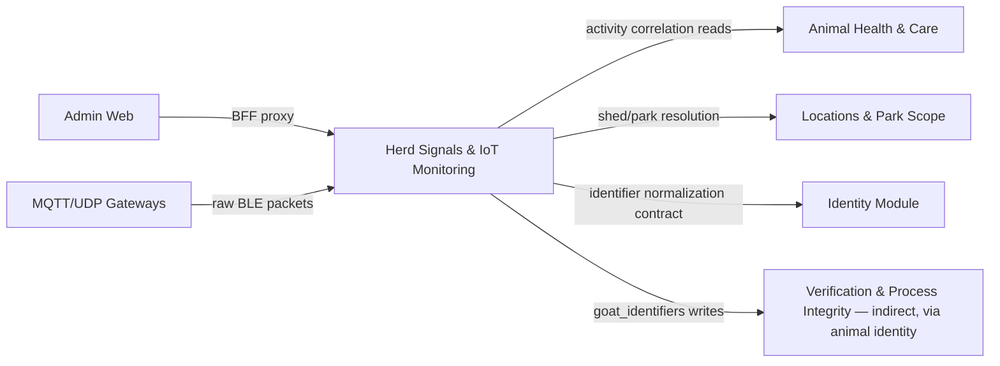

I now have a comprehensive understanding of the Herd Signals & IoT Monitoring Domain implementation. Let me compose the technical documentation.

# Herd Signals & IoT Monitoring Domain

## 1. Purpose and Scope

The Herd Signals & IoT Monitoring domain is GoatOS's real-time animal telemetry subsystem. It ingests BLE ("Bluetooth Low Energy") smart-tag advertisements broadcast by ear-mounted sensor tags, decodes them into structured motion, battery, temperature, and signal-quality readings, resolves tags to animals, and surfaces the resulting state through a live monitoring dashboard, historical timelines, farm-activity correlation overlays, and CSV exports.

Architecturally, the domain is a **Core Business Domain** composed of three cooperating modules:

| Module | Responsibility | Importance |
|---|---|---|
| **Herd Signals Gateway** (`backend/internal/herdsignals`) | MQTT/UDP ingestion, tag-to-animal mapping lifecycle, live/timeline/activity/export reads | 0.85 |
| **Movement Tracking** (`backend/internal/movement`) | Command handoff boundary for SOP-driven shed/pen movement submissions | 0.65 |
| **Locations & Park Scope** (`backend/internal/locations`, `backend/internal/parkscope`) | Location hierarchy (park/shed/pen), capacity, aliasing, and per-person scope derivation | 0.80 |

The domain follows GoatOS's standard hexagonal layering (`domain/ → app/ → ports/ → adapters/`) and is deployed as part of the single API binary plus two dedicated always-on bridge processes (`herd-signals-mqtt-bridge`, `herd-signals-udp-bridge`).

A principle threaded through every layer of this domain, stated explicitly in the code comments, is the **correlation-not-causation discipline**: a BLE tag reports only a cumulative motion counter, a battery voltage, a housing temperature, and radio signal strength. It classifies no behavior and no medical condition. Every derived state (pattern, risk, activity overlay) is clearly labeled as *inferred* or *correlated*, never as a diagnosis, and this boundary is enforced structurally, not just by convention.

---

## 2. Architecture Overview

```mermaid
flowchart TD
    subgraph Devices["IoT Devices"]
        A1[Smart BLE Ear Tags]
    end
    subgraph Transport["Transport Bridges (cmd/)"]
        B1[herd-signals-mqtt-bridge]
        B2[herd-signals-udp-bridge]
    end
    subgraph Gateway["Shared Decode Layer"]
        C1[gateway/decode.go]
    end
    subgraph AppLayer["herdsignals/app"]
        D1[Service.IngestPackets]
        D2[Mapping: MAP/REPLACE/UNMAP]
        D3[Activity/Timeline/Live queries]
        D4[CSV Export]
    end
    subgraph DomainLayer["herdsignals/domain"]
        E1[Thresholds & State Machines]
        E2[Motion/Pattern classification]
        E3[Activity overlay semantics]
        E4[Mapping errors]
    end
    subgraph Persistence["herdsignals/adapters/postgres"]
        F1[(Repository / pgxpool)]
        F2[(goat_identifiers mapping)]
        F3[(Activity scope + windows)]
        F4[(Keyset cursor export)]
    end
    subgraph HTTPLayer["herdsignals/adapters/http"]
        G1[Tag mapping endpoints]
        G2[Live/timeline/gateway/insights endpoints]
        G3[CSV export endpoint]
    end
    subgraph Frontend["admin-web Next.js proxies"]
        H1[/api/herd-signals/animals/]
        H2[/api/herd-signals/tag-mappings/]
        H3[/api/herd-signals/tags/[tagId]/activity, /timeline]
    end
    subgraph Related["Related Domains"]
        I1[Locations & ParkScope]
        I2[Movement Tracking]
    end

    A1 --> B1
    A1 --> B2
    B1 --> C1
    B2 --> C1
    C1 --> D1
    D1 --> F1
    D2 --> F2
    D3 --> F3
    D4 --> F4
    D2 --> E4
    D3 --> E2
    D3 --> E3
    D1 --> E1
    G1 --> D2
    G2 --> D3
    G3 --> D4
    H1 --> G2
    H2 --> G1
    H3 --> G2
    F3 --> I1
    D2 --> I2
```

---

## 3. Ingestion Pipeline

### 3.1 Transport Bridges

Two independent, always-on Cloud Run Jobs bridge raw hardware signals into the domain's single write path:

- **`herd-signals-mqtt-bridge`** subscribes to a Mosquitto broker topic (`GwData` by default) that a gateway device publishes to once per second. Each message (`scan_report`) carries a `dev_infos` array of *every* BLE device the gateway's radio heard — phones, earbuds, Apple continuity beacons, and randomized MACs are all present. A live payload audit found 178,209 non-tag rows across 414 devices in one capture; only devices whose advertisement carries the "HoneyComm" signature (a Service Data AD structure, AD type `0x16`, 16-bit UUID `0xAB4C`) are treated as ear tags — everything else is counted and discarded.
- **`herd-signals-udp-bridge`** listens on a UDP socket for the same JSON envelope shape, for gateways that use UDP transport instead of MQTT. UDP is explicitly unauthenticated and unordered; unparseable datagrams are logged (hex sample) and counted rather than crashing the process or being silently dropped.

Both bridges share identical operational discipline:
- **Batching and backpressure**: decoded packets are pushed into a bounded channel (`queue: make(chan decodedPacket, cfg.QueueMax)`) and drained by a background loop that flushes on `BatchSize` or `BatchInterval`, whichever comes first.
- **Migration-drift guard**: on startup, each bridge compares its own compiled migration version against the database's applied migration version (`migrationguard.Check`) and refuses to start if the database is ahead — this prevents the bridge from crashing mid-stream on a missing column (e.g. `pkt_sn`).
- **Machine actor identity**: both bridges authenticate in-process as a distinct service principal (`svc-herd-signals-mqtt-bridge` / `svc-herd-signals-udp-bridge`), never as a human user, and never with elevated oversight permissions.
- **Single write path guarantee**: both bridges call the *same* `app.Service.IngestPackets` entrypoint — the code comments explicitly warn against inventing a second ingest shape, referencing a prior incident where a seed script did exactly that and produced state that never matched the real ingest path.
- **Heartbeats**: gateways also emit `pkt_type:"state"` messages (`data.state == "sta_gw_hb"`) roughly every 5 minutes carrying no device rows. These update `herd_signal_gateways.last_seen_at` directly, which is what makes "gateway up but hearing nothing" distinguishable from "gateway down."

### 3.2 Shared Payload Decoding

Both bridges delegate decoding to a single shared package, `herdsignals/gateway` (`decode.go`), ensuring MQTT and UDP produce byte-identical `domain.IngestPacket` structures:

- `IsHoneyCombAdvertisement` walks the BLE advertisement's length-prefixed TLV structures generically (robust to firmware reordering) looking for the HoneyComm signature.
- `DecodeHoneyCombPacket` parses the fixed-offset advertisement layout:
  - byte 8 = battery in decivolts (`× 100` → millivolts)
  - byte 17 = sensor state
  - bytes 18–19 = temperature (integer + fractional part, 0.1°C resolution)
  - bytes 21–24 = 32-bit big-endian cumulative motion counter
- The printed tag ID is derived from the last 3 bytes of the device's MAC address, uppercased (e.g. `f0c990a00036` → `A00036`).
- The gateway's own device timestamp (`gateway_seen_at`) is carried through **uncorrected**, explicitly marked diagnostic-only — a live measurement during development found one gateway's clock running ~2h33m ahead of real time, and clock drift is known to vary across reboots.

### 3.3 Server-Stamped Timestamps (Security-Critical)

A deliberate, security-reviewed design decision governs every packet: `ReceivedAt` is stamped **once per ingest call**, from the server's own clock (`time.Now().UTC()`), and is the *only* timestamp used for staleness detection, reception-gap detection, ordering, the advance-only "latest" guard, and packet deduplication identity. The caller's own claimed capture time (`DeviceSeenAt`, from the request field `seen_at`) and the gateway's relay time (`GatewaySeenAt`) are preserved purely for diagnostics and are never read by any decision logic. This closes a class of vulnerability where a far-future caller-supplied timestamp could permanently freeze a tag's live state (since the advance-only guard would then reject every subsequent real packet as "not newer").

### 3.4 Ingest Endpoint Hardening

`POST /herd-signals/packets` (`adapters/http/handler.go`) applies several defensive controls added after a security review identified an unbounded-decode risk (an oversized payload could hold `FOR UPDATE` row locks and memory indefinitely):

- Request body capped at 2 MiB (`http.MaxBytesReader`) before JSON decoding begins.
- Packet count per request capped at 2,000.
- Strict JSON decoding (`DisallowUnknownFields`) so malformed/misnamed fields fail loudly rather than being silently dropped.
- The batch's maximum `PktSN` (gateway scan-report sequence number) drives packet-loss accounting: a forward jump accrues missed reports, a decrease signals a gateway reboot and triggers re-anchoring (never a negative loss value).
- Gateway upsert, packet insert, activity-window rollup, and tag-latest update all commit inside **one transaction** in the Postgres repository.

---

## 4. Domain Model & Signal Classification

### 4.1 Thresholds

`domain.Thresholds` centralizes every classification boundary used across the module (signal strength, battery voltage bands, motion deltas, staleness, reception gaps, pattern durations, spike multiplier). Every threshold is explicitly documented as **provisional**, pending vendor confirmation or operational tuning — a maintainer's decision to be transparent about uncertainty rather than presenting fabricated precision. `DefaultThresholds()` supplies the current operating values:

| Category | Threshold | Default |
|---|---|---|
| Signal (RSSI) | Strong / Weak / Avg-weak | -65 / -75 / -80 dBm |
| Battery (mV) | Healthy / Watch / Critical / Fall (trend) | 3000 / 2800 / 2600 / 80 mV drop |
| Motion delta | Active / Low / Quiet | ≥100 / 10–99 / 1–9 |
| Staleness | No packet | ≥30 min |
| Reception gap | Delta becomes a "gap total" | >30 min |
| Pattern durations | Quiet-watch / Inactive / Missing | 90 / 180 / 30 min |
| Spike multiplier | vs. per-animal p75 baseline | 2.5× |

### 4.2 Motion & Pattern State Machine (`domain/motion.go`)

The classification pipeline computes several layered states per tag on every read:

- **`MovementStateFromDelta`** — instantaneous bucket classification: `moving` / `low` / `quiet` / `not_moving`, derived from the 15-minute windowed motion delta.
- **`PatternStateFromHistory`** — a duration-aware state machine over 24h of history, producing: `missing_signal`, `spike`, `recovered`, `inactive`, `quiet_watch`, `no_movement`, or `normal` (wire value; internal constant name is `PatternUnknown`). Key correctness rules baked into this function:
  - **Reconnect lumps are not spikes.** A tag that returns after a reception gap reports a cumulative total with unknown time distribution and is explicitly excluded from spike comparison and from the baseline.
  - **Grain-matched spike comparison.** The current delta is measured over a 900-second (15-minute) window while the baseline (`Baseline75`) is computed from 300-second (5-minute) buckets. The code scales the baseline by the grain ratio (3×) before comparing — a documented fix for a defect where an un-scaled comparison caused false spikes at ~0.83× normal rate.
  - **"Inactive" requires packets still arriving.** `countConsecutiveQuietWindows` walks stored (sparse) buckets by *time*, not by array index, so a reception gap between two stored quiet buckets correctly breaks the "inactive" run instead of being silently bridged.
  - **`recovered` is checked before quiet/inactive re-classification** so a single active packet after a long quiet tail reads as "recovered," not as a fresh quiet_watch classification off a stale tail.
- **`Baseline75` / `percentile75`** — computes a **per-animal p75** baseline of 24-hour non-gap motion deltas. The p75 statistic is used deliberately instead of the median, because a resting animal's median bucket is 0 (which would make nearly every packet register as a spike against a median baseline).

### 4.3 Battery Trend Model

Because the tag reports raw voltage only, GoatOS replaced a previously removed "days remaining" estimate (judged to be false precision against an unconfirmed discharge curve) with a **trend model**:

- `BatteryStateFromVoltage` classifies a single reading into an absolute band (`healthy`/`watch`/`low`/`critical`).
- `BatteryTrendFromHistory` compares the first and last voltage readings within a configurable window (default 30 days), returning `nil` unless the readings span at least `BatteryTrendMinSpanHours` (default 24h) — coin-cell voltage is noisy and temperature-sensitive, so a direction is never invented from two adjacent packets.
- `BatteryStateWithTrend` composes the absolute state with the trend: a *falling* trend escalates `healthy` → `watch`; a falling trend combined with a currently *missing* pattern state escalates to `critical`. This "critical-on-silence" inference is explicitly documented as inferred, never to be read as "the tag is dead."

### 4.4 Reception Gap Handling

`IsGapDelta` flags a packet whose interval since the tag's previous sighting exceeds `ReceptionGapMinutes` (30 min default). Because the gateway does not buffer scan reports through a WAN outage, and a tag broadcasts only its *current* cumulative counter, a gap this long means the eventual reconnect delta is a total across an unknown time span — not ordinary in-window movement. This distinction (`GapDelta`) propagates through `TagLatest`, `ActivityWindow`, `TimelineWindow`, and CSV exports as its own explicit boolean, kept deliberately separate from the conceptually similar `StalePacketMinutes`, because the two fields answer different questions ("is this row too old to trust" vs. "is this delta smeared across a hole").

---

## 5. Application Services (`herdsignals/app`)

### 5.1 Ingestion Service (`service.go`)

`Service.IngestPackets` validates the actor, parses the envelope's `gateway_seen_at`, converts each raw packet into a `domain.Packet` (stamping the shared `serverNow` as `ReceivedAt`), computes the batch's maximum `PktSN` for loss accounting, and delegates the transactional write to the repository. Malformed per-packet timestamps degrade gracefully to "no diagnostic timestamp" rather than dropping real sensor data (a caller's malformed clock must never become a denial-of-service lever over data the backend no longer trusts anyway for ordering purposes).

### 5.2 Live View & Risk Signals (`ListLive`)

`GET /herd-signals/live` supports filtering by park, shed, movement state, mapping state, pattern, risk state, and free-text search, with keyset pagination and configurable sort. Its most architecturally distinctive behavior is the **risk-state filter path**: because "risk" is a group-relative signal (a tag's motion/temperature deviation compared against its cohort), the service must first materialize the *entire* filtered cohort (`listAllTagsLatest`, walking pages up to `liveSignalCohortMaxRows` = 50,000 rows in pages of 5,000) before it can compute group statistics and apply the risk filter and downstream pagination in memory. This is a deliberately bounded exception to the module's otherwise strict database-side pagination discipline, annotated in code with a `scale-guard:ignore` directive and an expiry date for periodic review.

### 5.3 Batched Enrichment (`enrichTagsBatch`)

Every list/gateway/export read enriches raw `TagLatest` rows with animal identity, shed/park names, baseline deltas, and battery trend — and does so with **one batched query per data kind for the whole page**, never per-row. This "never N+1" discipline is called out repeatedly in code comments as an explicit operational read-model contract (`ResolveTagsBatch`, `GetGoatsByIDs`, `GetShedLocations`, `GetBaselineDeltas`, `GetBatteryHistory` are all page-scoped batch calls).

### 5.4 Timeline (`GetTimeline`)

`GET /herd-signals/tags/{tag_id}/timeline` returns bucketed motion history. Bucket tier selection follows a fixed rule when the caller does not pin one: ≤1h range → 60s buckets, ≤24h → 300s, otherwise 3600s. An explicitly requested `bucket_seconds` must be one of the three tiers actually materialized in storage (`SupportedBucketSeconds = [60, 300, 3600]`) or the request is rejected as a validation error. The response is always **densified**: because stored windows are sparse (a bucket with zero packets has no row at all), the service walks every expected bucket boundary and fills gaps explicitly with `IsGap: true`, so a client can distinguish "no packets" from "packets arrived, zero movement" from "packets arrived carrying a reconnect total" — three genuinely different facts that must never collapse into one representation. The whole response is bounded by `MaxTimelineBuckets` (2,000) regardless of range/tier combination.

### 5.5 Farm-Activity Overlay (`activity.go`)

`GetTagActivity` (`GET /herd-signals/tags/{tag_id}/activity`) is the correlation surface that places farm records (vaccination, treatment, feed, weighing, hoof-trimming, shed moves) alongside a tag's movement history for the *same time window* — explicitly correlation only, never causation, a boundary enforced by a backend-owned `ActivityCorrelationNote` string returned verbatim in every response for the client to render unmodified.

Key mechanics:
- **Monitoring boundary clamp**: an animal's history with a tag begins only at the instant the tag was mapped to it (`smart_tag_mapped_at`). The requested `from` is clamped upward to this instant before any record is read, so no pre-mapping "device on a bench" period can leak into a farm-activity response.
- **Structural empty reasons**: an empty result always carries a typed `Reason` (`tag_not_mapped_to_animal`, `monitoring_boundary_unknown`, `window_entirely_before_monitoring_start`) distinguishing "nothing happened" from "this tag cannot have activity at all."
- **Bounded reads**: `maxActivityRangeDays` = 31, `maxActivityEvents` = 500 — beyond these the response reports `Truncated: true` rather than silently dropping data.
- **Batched correlation math**: `computeEventCorrelationsBatched` fetches all 5-minute activity-window buckets for the entire event span in one query, then partitions in memory per event — a documented optimization reducing up to 500 serial DB reads to one. Motion-delta correlation windows (2h before/after each event) are marked `Incomplete` and return `nil` rather than a computed value whenever any bucket in the window is a gap or a gap-delta, since a partial truth is judged worse than an honest absence.

### 5.6 Mapping Writes (`mapping.go`, adapters `postgres/mapping.go`)

Tag-to-animal mapping is the module's primary write surface beyond ingestion, exposed as three verbs — **MAP**, **REPLACE**, **UNMAP** — deliberately with no fourth "mark as smart tag" verb, since every tag appearing on the mapping screen is by definition already a smart tag (it is listed because the gateway is receiving its advertisements).

- **`BindTagMapping`**: claims a tag's normalized value(s) (tag ID and, if distinct, its MAC — both are claimed because the read path matches by either) as an active, smart-tag-capable `goat_identifiers` row for the target animal, and stamps `smart_tag_mapped_at`/`mapped_by`/`mapped_at`. Idempotent re-binding of an already-bound tag does not restart the monitoring period (`COALESCE` on the mapped-at stamp).
- **`ReplaceTagMapping`**: atomically unbinds the animal's current smart tag and binds a new one in one transaction — the real-world re-tagging case (a tag falls off, a replacement goes on) — and must never leave the animal with two live tags or zero.
- **`UnmapTagMapping`**: releases a binding with no replacement (tag lost, animal sold, or mapping error). Nothing is deleted from the packet history; the tag simply returns to "unmapped" and its monitoring period ends.
- **Provenance-aware release semantics**: rows the module itself created to carry a binding (`source_system = 'herd_signals'`) are **deleted** on release (they were never identity history — they represented a device attachment period, fully preserved in `herd_signal_packets`). Rows that pre-existed as the animal's real identity (an ear tag merely flagged as smart-tag-capable) are only **flag-cleared**, never destroyed — this distinction prevents a BLE unbinding from ever destroying identity the module does not own.
- **Row-level locking discipline**: `lockIdentifiersByValue` and `liveSmartTagsForGoat` both take `FOR UPDATE` locks before mutation, because `goat_identifiers` enforces a *lifetime-scoped* uniqueness constraint on normalized value — two concurrent binds of the same physical tag must serialize rather than race into a constraint violation.
- **Error taxonomy for HTTP mapping**: `domain.ErrMappingNotFound` (404) and `domain.ErrMappingConflict` (409) are distinct sentinel errors so a caller can differentiate "unknown ID" from "this write would create a forbidden state" (a tag claimed by another animal, an animal already carrying a live tag, or a REPLACE with nothing to replace). A mapping refusal is explicitly treated as a first-class business answer, not a server failure.
- **Permission separation**: mapping writes are gated by a distinct `herd_signals.map` permission, separate from the read permission that unlocks the dashboard — deciding which animal a tag belongs to is a different authority than viewing the board, and every downstream animal-attributed number depends on this decision being correct.

### 5.7 Gateway Heartbeats (`RecordGatewayHeartbeat`)

`POST /herd-signals/heartbeats` records the `sta_gw_hb` state message. The server-clock timestamp discipline applies here identically to packet ingestion. A `ticks_cnt` value that decreases from the stored value is treated as a gateway reboot and triggers re-anchoring — the same non-negative counter-reset pattern applied to `motion_count` and `pkt_sn` elsewhere in the module. An unrecognized `state` value is refused rather than silently counted as proof of life, since the entire value of a heartbeat is asserting "this gateway is alive right now."

### 5.8 CSV Export (`export.go`)

`GET /herd-signals/export.csv` streams the **same filtered, keyset-ordered result** the live view renders — same repository filter builder, same page reads, same enrichment — so a download can never disagree with what the operator sees on screen. Memory discipline:

- Pages of `exportPageSize` = 500 rows are read, enriched, written, and released before the next page is fetched — peak memory is one page regardless of result size.
- A hard ceiling of `maxExportRows` = 100,000 stops runaway exports; when hit, the file's *last row* states the cap was hit and instructs the operator to narrow filters, rather than silently truncating (a silently truncated file reads as complete data, which the code identifies as the more dangerous failure mode).
- A `countingResponseWriter` tracks whether any bytes have reached the client, so a mid-stream failure is never "corrected" by appending a JSON error body to an already-partial CSV — which would produce a corrupt file that *looks* like valid data. A pre-stream failure gets a proper HTTP error status; a mid-stream failure simply stops.
- Absent values are rendered as empty CSV cells, never as `0` or `"unknown"` — a blank cell means "not reported," a zero would misrepresent it as an actual measurement.

### 5.9 Insights Cards (`GetInsights`)

`GET /herd-signals/insights` returns 12 backend-computed cards (tags live now, missing signal, low/high movement watch, pen signal coverage, weak signal, battery attention, post-vaccination movement watch, health-case activity trend, feed×activity, weight×activity, unmapped smart tags). Each card carries backend-owned `label`, `formula`, `signal_type` (`direct`/`derived`/`correlated`/`inferred`), and `caveat` text — the frontend renders this copy verbatim rather than hardcoding its own, per the module's "backend-owns-labels" convention. Each card's underlying value is computed by its own small, indexed, tenant-scoped query rather than a single "compute-on-read" aggregate query.

---

## 6. Persistence Layer (`herdsignals/adapters/postgres`)

The `Repository` (backed by `pgxpool`) implements the `ports.Repository` interface and is the sole gate to PostgreSQL. Its defining characteristics:

- **Transactional ingest**: gateway upsert, packet insert, activity-window rollup, and tag-latest update commit as one atomic unit (`IngestPackets`).
- **Batch-only reads for hot paths**: `ResolveTagsBatch`, `GetGoatsByIDs`, `GetShedLocations`, `GetBaselineDeltas`, `GetBatteryHistory`, `GetGatewayTagStats`, and `GetGatewayWindowStats` all resolve many keys in a single query — an explicit architectural rule against N+1 patterns on `GET /herd-signals/live` and `GET /herd-signals/gateways`.
- **Keyset (cursor) pagination**: `liveCursor` and `liveSortSpec` encode a versioned, base64-encoded cursor (`v1.…`) carrying the sort key, direction, comparison value, and tag ID, with backward compatibility for older bare-tag-ID cursors used by CSV export's page walk.
- **Activity scope resolution** (`GetTagActivityScope`): resolves a tag to its animal, shed, park, and monitoring boundary via a single query using `LEFT JOIN LATERAL`, preferring the authoritative `goat_identifiers.smart_tag_mapped_at` and falling back to the denormalized `herd_signal_tag_latest.animal_monitoring_since` copy.
- **Multi-source farm activity read**: `ListFarmActivity` deliberately issues **one small, indexed, tenant-scoped, time-bounded, LIMITed query per source** (vaccination, treatment, shed-move, feed, weighing, hoof-trimming) and merges/sorts the results in Go, rather than a single cross-module JOIN — each source has a different grain (animal, shed, or raw scanned string) and a single join would blur that distinction and plan poorly.
- **Identifier normalization contract**: every write and read path applies `domain.NormalizeTagIdentifier` (uppercase + trim), mirroring the identity module's canonical normalizer exactly — a documented defect fix for a case-mismatch bug that caused lowercase device MACs to silently never resolve against uppercase-stored identifiers.

---

## 7. HTTP API Surface

Registered routes (`adapters/http/handler.go`):

| Method & Path | Purpose | Permission |
|---|---|---|
| `POST /herd-signals/packets` | Bulk ingest raw BLE packets | ingest |
| `GET /herd-signals/live` | Paginated live tag/animal status with filters | read |
| `GET /herd-signals/tags/{tag_id}/timeline` | Bucketed motion history | read |
| `GET /herd-signals/gateways` | Gateway health & window stats | read |
| `GET /herd-signals/insights` | 12 dashboard insight cards | read |
| `POST /herd-signals/tag-mappings` | MAP a tag to an animal | `herd_signals.map` |
| `POST /herd-signals/tag-mappings/replace` | REPLACE (re-tag) | `herd_signals.map` |
| `POST /herd-signals/tag-mappings/unmap` | UNMAP a tag | `herd_signals.map` |
| `POST /herd-signals/heartbeats` | Gateway liveness heartbeat | ingest |
| `GET /herd-signals/export.csv` | Streamed CSV of the live view | read |
| `GET /herd-signals/tags/{tag_id}/activity` | Farm-activity correlation overlay | read |

All handlers extract tenant/actor identity from request context (set by upstream auth middleware), reject unauthenticated calls with 401, and map domain sentinel errors to precise HTTP statuses: `ErrValidation` → 400, `ErrMappingNotFound`/`ErrTagNotFound` → 404, `ErrMappingConflict` → 409, everything else → 500 with structured logging.

---

## 8. Frontend Integration (Admin Web)

The Next.js admin-web application never talks to the Go backend directly from the browser. Instead, `apps/admin-web/app/api/herd-signals/*` implements a set of authenticated same-origin **BFF proxy routes** that call server-only functions in `lib/api/herd-signals.ts` (which mints the bearer token and reads server-only request context). This pattern exists specifically because the underlying client library uses `server-only` imports that would break the entire webpack build if pulled into a client component bundle.

Notable proxy routes:

- **`/api/herd-signals/animals`** — a typeahead search feed for the "Map to animal" / "Replace tag" dialogs. It deliberately reuses the *same* bounded `searchGoats` call the Herd Register list already uses (one search contract, one scope rule), caps results to 8, filters to `status=alive` (an invented "active" status previously matched nothing and silently broke every search), and de-duplicates by `goat_id` since the underlying search returns one row per matching identifier.
- **`/api/herd-signals/tag-mappings/*`** and shared `_write.ts` utilities — `readJsonBody`, `invalidBody`, `optionalString`, `writeMappingResult` provide consistent request/response shaping across MAP/REPLACE/UNMAP. Backend mapping-conflict messages are forwarded verbatim with their original status code, since (as in the backend) a mapping refusal is a first-class UI state, not a generic error.
- **`/api/herd-signals/tags/[tagId]/activity`** and **`/timeline`** — require explicit `from`/`to` query parameters (never defaulted to "all time," reinforcing the monitoring-boundary discipline from the backend) and forward the backend's response with `Cache-Control: no-store`.

---

## 9. Related Modules

### 9.1 Movement Tracking (`backend/internal/movement`)

Currently a minimal **command handoff boundary**: accepted SOP (Standard Operating Procedure) submissions for animal shifting write `movement_commands` rows. Per its own package documentation, a later Locations integration is expected to consume these commands and apply canonical location truth — this module is explicitly scoped narrowly today, acting as a staging point rather than a full location-transition engine.

### 9.2 Locations & Park Scope (`backend/internal/locations`, `backend/internal/parkscope`)

- **`locations`** manages the farm's location hierarchy (`farm`/`park`/`shed`/`cohort`/`pen`), including operational attributes (usable-for-counts/feed/vaccination/SOP flags, holding/quarantine/ICU markers), capacity records, aliasing (mapping raw source labels like legacy shed-DB names to canonical locations), and a review-queue workflow for ambiguous or conflicting source labels. Its `Service` layer enforces tenant validation, UUID shape checks, and bounded list limits (max 500 rows, max offset 1,000,000) before delegating to the repository, and maps repository-level sentinel errors (`ErrNotFound`, `ErrIdempotencyConflict`, `ErrBlockingUsage`, etc.) into precise HTTP-facing errors.
- **`parkscope`** solves a specific, previously-observed correctness defect: a person's park scope was formerly answered by three independently-maintained records (grant rows, People-screen scope ticks, and `workforce_members.primary_location_id`) that could drift out of sync — a real incident saw an operator gain unintended cross-park access because a grant was added without updating the other two records. The fix, `SyncGrantScope`, establishes the scope **ticks** as the single authored source of truth; grants and the home-park designation are *derived* from the ticks inside the same transaction that writes them. It also encodes organizational policy directly in code: certain roles (`ceo_internal`, `verifier`, directors, `counts_approver`, `toxin_tester`) are **tenant-only** and cannot be narrowed to specific parks (narrowing would either lock them out of routes or silently hide half the herd from a director), while pure operator/park-head roles can never receive tenant-wide scope, ensuring no real field operator is ever granted access beyond their assigned parks.

Both modules matter to Herd Signals because every tag/animal reading is ultimately displayed and filtered in the context of a park/shed, and the correctness of "which park does this person see" directly bounds what herd-signal data reaches a given user.

---

## 10. Cross-Domain Dependencies



- **Animal Health & Care**: the activity overlay reads vaccination completions, treatment sessions, and health-case activity for correlation display, and the insights module surfaces post-vaccination movement watch and health-case activity trend cards — always framed as correlation, never diagnosis.
- **Identity module**: the mapping subsystem's normalization rule (`NormalizeTagIdentifier`) explicitly mirrors the identity module's canonical normalizer so both modules agree on how identifier values compare.
- **Locations & Park Scope**: every live item, gateway, and export row resolves its shed/park display name through `GetShedLocations`, and dashboard access itself is bounded by the park-scope grants that `parkscope.SyncGrantScope` derives.

---

## 11. Key Engineering Principles Observed

1. **Correlation, never causation.** Every derived signal in this domain (pattern state, risk state, activity overlay markers) is explicitly and structurally prevented from being presented as a diagnosis or explanation. The `ActivityCorrelationNote` is backend-owned and travels with the data specifically so no client can drift from this discipline.
2. **Never invent precision from noisy data.** The battery model returns `nil` rather than a trend when there isn't enough time-span in the history; a "critical-on-silence" escalation is described as inferred, not measured.
3. **Fail closed on ambiguous boundaries.** The monitoring-boundary clamp in the activity overlay, and the refusal to compute a pattern state without sufficient history, both default to withholding an answer rather than guessing.
4. **No N+1 on hot read paths.** Every list-style endpoint batches its per-row lookups into whole-page queries — a rule enforced by repeated, explicit code comments referencing an "AGENTS.md operational read model contract."
5. **Bounded everything.** Ingest body size, packet count per request, activity range/event count, timeline bucket count, export row count, and live cohort size are all hard-capped, with the response explicitly signaling when a cap was hit rather than silently truncating.
6. **Provenance-aware writes.** The mapping subsystem tracks which `goat_identifiers` rows it created versus which pre-existed as real animal identity, ensuring a BLE tag unbind can never destroy identity data it does not own.
7. **Machine actors are first-class and distinctly scoped.** Ingest bridges authenticate as dedicated service principals, separate from human users and from privileged roles, minimizing blast radius if a bridge process were compromised.