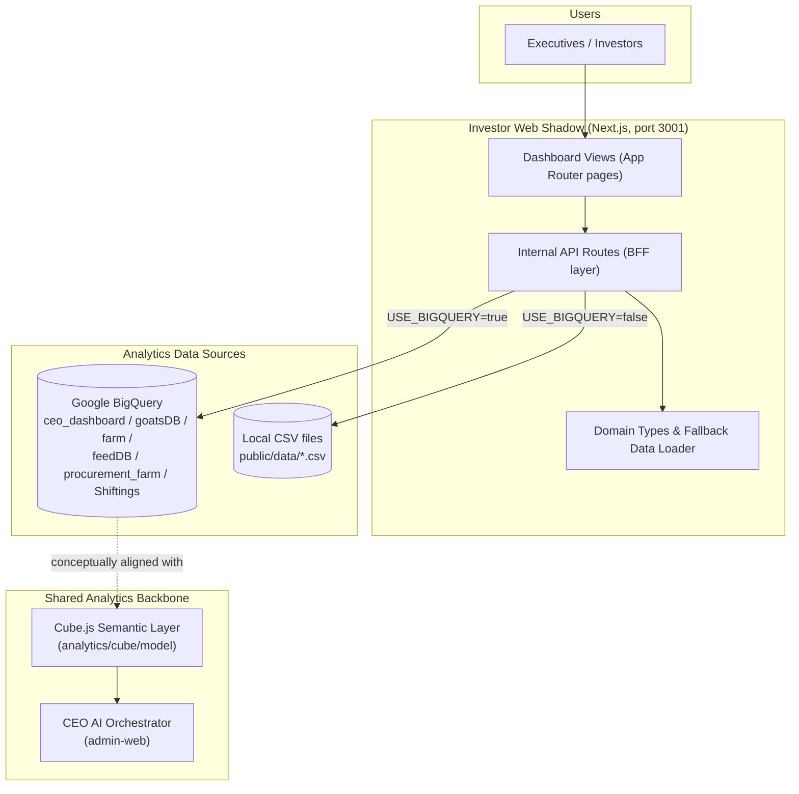
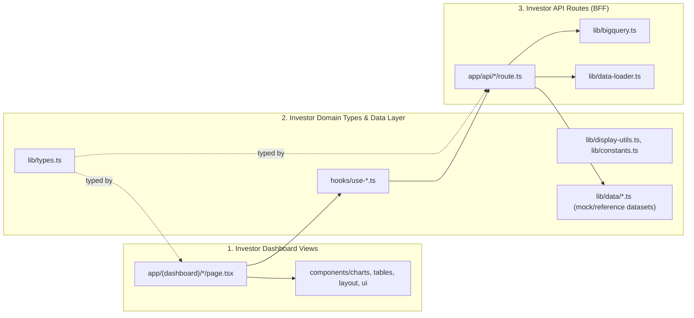
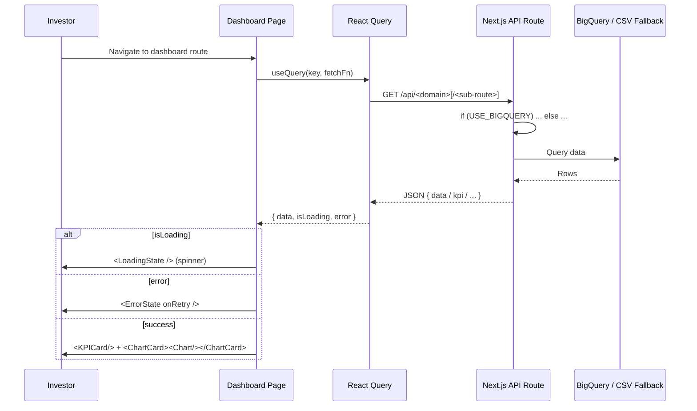
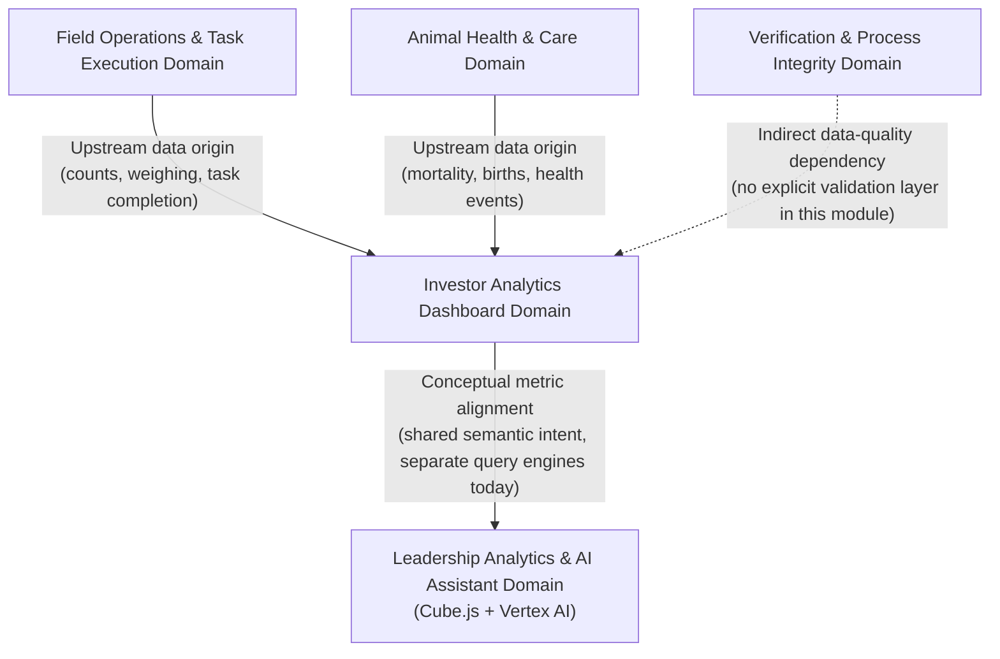

Now I have comprehensive data to write the full documentation.

---

# Investor Analytics Dashboard Domain

## 1. Overview

The **Investor Analytics Dashboard Domain** (implemented as the `investor-web-shadow` application, internally branded as "VGoats Dashboard") is a **read-only, presentation-tier module** of the GoatOS platform. Its sole purpose is to expose aggregated, executive-friendly business analytics — animal counts, mortality, feed economics, births, infrastructure occupancy, purchase cost, shiftings, and financial (MIS/summary) metrics — to investors and senior leadership, without providing any write/mutation capability back into the operational system.

Architecturally, it is one of four client surfaces built on top of GoatOS's backend (alongside `admin-web`, the native Android field app, and `operator-mobile`), and it shares its semantic data foundation — the Cube.js/BigQuery analytics layer — with the CEO AI conversational assistant embedded in `admin-web`. This shared foundation is a deliberate design choice intended to guarantee that numbers shown to investors and numbers reasoned over by the AI assistant are computed from the same governed metric definitions.

A distinctive characteristic of this module, explicitly called out in its own source code, is that it is a **"shadow" application**: a legacy-compatible dashboard preserved primarily for **migration comparison** against the BigQuery-based reporting pipeline that predates GoatOS's Postgres-centric backend. New GoatOS surfaces are expected to consume canonical Go backend APIs rather than replicate this BigQuery access pattern.

| Attribute | Value |
|---|---|
| Module name | Investor Web Shadow Analytics Dashboard (`apps/investor-web-shadow`) |
| Domain type | Presentation Domain (read-only) |
| Framework | Next.js 14.2.35 (App Router), React 18 |
| Dev port | 3001 |
| Primary users | Investors / Executives (per System Context research) |
| Data sources | Google BigQuery (`ceo_dashboard`, `goatsDB`, `farm`, `feedDB`, `procurement_farm`, `Shiftings`, `crop_season` datasets) **or** local CSV fallback data |
| Write capability | None — 100% read-only |

---

## 2. Position Within the GoatOS Architecture



Within the broader system, the Investor Dashboard is deliberately **decoupled from the Go backend's OLTP write path** (Postgres). It does not call `backend/internal/*` HTTP APIs directly; instead it queries an analytics-oriented BigQuery project (`goatos-sheets`), which historically preceded the current hexagonal backend. This is an important architectural nuance: while the domain-relations research suggests the Investor Dashboard depends on the "Leadership Analytics & AI Assistant Domain" (Cube.js layer), in the current codebase the direct technical dependency is BigQuery, with Cube.js serving as the conceptual/semantic sibling consumed by the CEO AI assistant. Both surfaces are expected to converge on consistent metric definitions, but they are not (yet) backed by the identical query engine.

---

## 3. Internal Structure

The module follows a light three-layer separation consistent with Next.js App Router conventions:



### 3.1 Investor Dashboard Views (`app/(dashboard)/*`)

All dashboard pages live under the `(dashboard)` route group, sharing a common `layout.tsx` that renders a persistent `AppSidebar` (collapsible navigation) and `Navbar`. Each page is a **client component** (`'use client'`) responsible for:

1. Fetching data via a TanStack React Query `useQuery` call.
2. Rendering `LoadingState` while pending and `ErrorState` (with retry) on failure.
3. Composing `KPICard` and `ChartCard` primitives around Recharts-based visualizations.

Pages currently implemented:

| Route | Purpose |
|---|---|
| `/counts/overall`, `/counts/cbe`, `/counts/cpt`, `/counts/core-farms`, `/counts/holdings` | Herd census counts, delegating to a single shared `CountsDashboard` component parameterized by `tab` |
| `/mortality` | Breed-wise, farm-wise, load-wise, and delivery-related mortality analytics |
| `/births` | Kidding efficiency, birth counts, kidding frequency, litter size |
| `/feed` | Feed spend, consumption, stock breakdown, nutrition-by-breed/housing |
| `/infra` and `/infra/[shed]` | Shed occupancy/vacancy KPIs, drill-down to per-shed breed composition |
| `/purchase-cost` | Vendor/load purchase cost analytics |
| `/shiftings` | Animal movement/shifting analytics |
| `/mis` | Management information system rollups |
| `/summary` | High-level cross-domain summary |

The application root (`app/page.tsx`) immediately redirects to `/counts/overall`, establishing counts as the default landing experience for investors.

### 3.2 Investor Domain Types & Data Layer

**`lib/types.ts`** centralizes all TypeScript contracts consumed across the module:
- Raw CSV-row shapes: `CountingRecord`, `DailySummaryRecord`, `FeedLoadRecord`, `SeasonRecord`.
- Aggregated/UI-ready shapes: `BreedCount`, `StatusCount`, `FarmCount`, `ShedPartition`, `MortalityBreedRow`, `MortalityFarmRow`, `FeedStockSummary`.
- The `FarmTab` union type (`"overall" | "core-farms" | "cbe" | "cpt" | "holdings"`) that drives tab-based navigation for the counts section.

**`hooks/`** wraps `useQuery` calls into small, page-specific hooks (`use-mortality.ts`, `use-counts.ts`, `use-feed.ts`, `use-births.ts`, `use-infra.ts`, `use-purchase-cost.ts`, `use-shiftings.ts`, `use-summary.ts`). These hooks standardize query keys, error handling, and endpoint URLs, keeping page components declarative. For example, `useMortality(period)` fetches from the combined `/api/mortality` endpoint, while `useMortalityEndpoint(endpoint, params)` provides granular access to mortality sub-routes (`/api/mortality/breed`, `/api/mortality/farm`, etc.).

**`lib/data/*.ts`** holds domain-specific fallback/reference datasets and pure transformation functions used when BigQuery is not configured, e.g.:
- `lib/data/mortality.ts` — static `MORTALITY_BY_BREED`, `MORTALITY_BY_FARM`, `MORTALITY_BY_LOAD` sample rows.
- `lib/data/infra.ts` — `buildShedPartitions()` aggregates raw `CountingRecord[]` into per-shed breed breakdowns with capacity/vacancy calculations, and `getVacancyStatus()`/`getVacancyClasses()` derive UI badge states.
- `lib/data/births.ts`, `lib/data/feed.ts`, `lib/data/counts.ts`, `lib/data/purchase-cost.ts`, `lib/data/shiftings.ts`, `lib/data/fattening.ts`, `lib/data/summary.ts` — analogous per-domain fallback datasets and helpers.

**`lib/display-utils.ts`** provides presentation-normalization utilities:
- `displayStatus()` maps internal shed/animal status codes (e.g., `F0`, `K2`, `M0`, `ICU-Kid`) to human-readable labels.
- `formatLabel()` converts snake_case API field names into Title Case, with special-casing for acronyms (`CBE`, `CPT`, `KG`, `ADG`, `ICU`, `MTD`) and a large dictionary of field-name overrides (`mortality_percent` → "Mortality %", `landing_cost_per_kg` → "Landing Cost Per KG", etc.).
- `getChartDescription()` supplies contextual subtitle text under chart titles to aid investor comprehension of what each visualization represents.

**`lib/constants.ts`** centralizes cross-cutting presentation constants:
- A 25-shade "cyberpunk" gradient (`GRADIENT_25`) and `pickSpacedColors(n)` — a smart color-assignment algorithm that maximizes visual contrast for small series counts and produces a smooth gradient for larger ones.
- Indian-locale currency formatting: `formatINR()` (full grouped format, e.g., `₹1,23,456`) and `formatINRCompact()` (`₹1.5Cr`, `₹12.3L`, `₹45K`).
- `formatNumber()` for `en-IN` locale-aware integer formatting.
- The canonical `BREEDS` list (Beetal, Anantapur, Kenguri, Sojat, Malai, Osmanabadi, Boer) and `FARM_TABS` navigation metadata.
- `SHED_CAPACITIES` — a hard-coded lookup table mapping dozens of individual shed names (e.g., `"Gandhi 1 - Part 1"`, `"Mandela 2 - Part 7"`, `"Yashoda 9"`) to their physical capacity, with `getShedCapacity()` defaulting to `15` for unknown sheds. This table underpins vacancy/occupancy calculations on the Infra dashboard.
- The **`USE_BIGQUERY`** feature flag, read from `process.env.NEXT_PUBLIC_USE_BIGQUERY === "true"`, which is the central switch governing every API route's data source.

### 3.3 Investor API Routes (Backend-for-Frontend Layer)

Every dashboard feature is backed by one or more Next.js Route Handlers under `app/api/*`, each declared with `export const dynamic = 'force-dynamic'` to disable static caching (ensuring fresh data on every request). The API surface is organized as:

| Domain | Endpoints |
|---|---|
| Births | `/api/births`, `/api/births/analysis`, `/api/births/frequency`, `/api/births/kidding`, `/api/births/recent` |
| Counts | `/api/counts` |
| Feed | `/api/feed`, `/api/feed/age`, `/api/feed/breakdown`, `/api/feed/consumption`, `/api/feed/distribution`, `/api/feed/nutrition-breed`, `/api/feed/nutrition-housing`, `/api/feed/seasons`, `/api/feed/spend` |
| Infra | `/api/infra`, `/api/infra/capacity`, `/api/infra/housing` |
| Mortality | `/api/mortality` (combined) plus granular sub-routes: `/breed`, `/farm`, `/deaths`, `/delivery`, `/delivery-overall`, `/delivery-split`, `/gender`, `/load`, `/trends`, `/this-month` |
| Purchase Cost | `/api/purchase-cost` |
| Shiftings | `/api/shiftings` |
| Summary/MIS | `/api/summary`, `/api/business`, `/api/delta` |

Every handler follows a **consistent dual-mode pattern**:

```ts
if (USE_BIGQUERY) {
  // Execute parameterized SQL via queryBigQuery() against BigQuery tables
} else {
  // Return static/local fallback data (mock arrays or CSV-parsed records)
}
```

This design allows the dashboard to run in three practical modes:
1. **Production/live mode** — `USE_BIGQUERY=true`, querying real BigQuery datasets.
2. **Local development mode** — `USE_BIGQUERY` unset/false, serving deterministic mock data from `lib/data/*.ts` constants.
3. **CSV-fixture mode** — for endpoints like counts, feed loads, and seasons, `lib/data-loader.ts` parses CSV files from `public/data/*.csv` (e.g., `counting_db_with_holding_dev.csv`, `daily_summary_dev.csv`, `last_10_loads_feedwise.csv`, `seasons.csv`) using PapaParse, with in-memory caching (`Map`) per data type to avoid repeated disk reads within a server process lifetime.

---

## 4. BigQuery Data Access Layer

### 4.1 Client Initialization (`lib/bigquery.ts`)

The BigQuery client is lazily instantiated as a module-level singleton (`_client`). Authentication resolves in priority order:
1. A service-account JSON key file path from `GOOGLE_APPLICATION_CREDENTIALS` (defaulting to `./service-account-key.json`), if it exists on disk.
2. Otherwise, Application Default Credentials (ADC) — appropriate for Cloud Run deployment where the runtime service account is auto-attached.

The client requests two OAuth scopes: `bigquery` and `drive.readonly` — the latter indicating that some underlying BigQuery tables are **external tables backed by Google Sheets/Drive**, a legacy artifact of the pre-GoatOS reporting pipeline this shadow app is designed to replicate.

### 4.2 Query Execution & Table Resolution

`queryBigQuery<T>(sql, params)` executes parameterized SQL (via `@paramName` placeholders) against the `US` location, returning typed rows and logging (with SQL and params) on failure for debuggability.

The `table(name)` helper resolves a bare table name to a fully-qualified `project.dataset.table` reference using a **per-table dataset override map** (`TABLE_DATASET`), since the underlying BigQuery project (`goatos-sheets`) spreads its tables across multiple datasets by subject area:

| Dataset | Example Tables |
|---|---|
| `goatsDB` | `mother_kid_facts`, `birth_analysis_view`, `breedwise_kidding_8m`, `kidding_frequency`, `v_birth_count_last_10_days` |
| `farm` | `daily_summary_dev`, `kids_counting_vs_weighing`, `adg_summary_age_shed` |
| `procurement_farm` | `load_Wise_pct_data`, `procurement_db_loadwise_cost`, `breedwise_load_pct` |
| `Shiftings` | `deaths_monthly_trend_v`, `mortality_genderwise`, `cbe_kids_current_stage_days`, `cpt_kids_current_stage_days` |
| `feedDB` | `feedDB_clean`, `feed_daily_spend`, `feed_daily_expense_feedwise`, `feed_breed_age_daily`, `last_7_days_feed_per_animal[_shedwise]`, `last_10_loads_feedwise` |
| `crop_season` | `seasons_clean` |
| (default) `ceo_dashboard` | Any table not explicitly mapped |

Tables not present in `TABLE_DATASET` implicitly fall back to the default `DATASET` (`ceo_dashboard`), which is itself overridable via `BIGQUERY_DATASET`.

`serializeDate(d)` normalizes BigQuery's date-object return shape (`{ value: "2024-05-15T..." }`) into a plain `YYYY-MM-DD` string, handling both object and primitive representations.

> **Important architectural note (validated directly in source comments):** `lib/bigquery.ts` explicitly states: *"LEGACY - DO NOT COPY INTO GOAT OS RUNTIME APPS... Real admin/mobile apps must call Goat OS APIs backed by Postgres projections instead of querying BigQuery or Drive-backed tables."* This confirms the Investor Dashboard is intentionally isolated as a transitional/legacy-compatible surface and is not the pattern to follow for new GoatOS feature development.

### 4.3 Example: Births API Data Resolution

The `/api/births` route illustrates the standard multi-query aggregation pattern used throughout the module. On a single GET request it fires six parallel BigQuery queries via `Promise.all`:

1. Total births count (`COUNTIF(is_birth = 1)` against `mother_kid_facts`).
2. Breed-wise kidding efficiency (`breedwise_kidding_8m`).
3. Last-10-days birth count time series (`v_birth_count_last_10_days`).
4. Kidding frequency in months between births (`kidding_frequency`, excluding null/blank/"mixed" breeds).
5. Average litter size per breed (`birth_analysis_view`).
6. Overall average kids-per-mother (`birth_analysis_view`, aggregated).

Results are rounded to two decimals, normalized (e.g., auto-detecting whether percentage values are expressed as 0–1 decimals vs. 0–100 and rescaling accordingly), sorted, and shaped into a single composite JSON payload (`{ kpi, kiddingEfficiency, birthCountLast10Days, kiddingFrequency, litterSize }`) consumed directly by the `/births` page's chart components.

### 4.4 Example: Counts API — Farm Scoping and KPI Rollups

The `/api/counts` route demonstrates the module's most elaborate query orchestration, reflecting the `FarmTab` concept (`overall`, `core-farms`, `cbe`, `cpt`, `holdings`):

- Farm filters are translated into SQL predicates: `core`/`core-farms` maps to `LOWER(farm) IN ('cbe','cpt')`; `holdings` maps to `farm NOT IN ('CBE','CPT')`.
- A "yesterday" date (computed in `Asia/Kolkata` timezone) is used as the default reporting date if none is supplied, reflecting the batch/ETL nature of the upstream BigQuery pipeline (same-day data is not yet available).
- Three KPI values (`totalActive`, `farmValue`, `totalWeight`) are derived from `daily_summary_dev` with farm-specific column selection logic (e.g., `cbe_summary_count` vs. `cpt_summary_count` vs. a summed `core-farms` value).
- Age breakdown, adults-by-gender, kids-by-gender, and fattening-gender-count queries against `counting_kpis_daily` are executed concurrently via `Promise.allSettled`, so a failure in one metric query does not block the others — each failure is logged independently and defaults to an empty result set.
- In non-BigQuery mode, the same farm-scoping and latest-date logic is reimplemented in-memory against CSV-loaded `CountingRecord[]` arrays, ensuring functional parity between the two data-source modes.

---

## 5. Client-Side Data Flow & State Management

### 5.1 React Query Configuration

`lib/query-provider.tsx` wraps the entire application in a `QueryClientProvider` with global defaults:
- `staleTime: 15 minutes` — analytics data is treated as acceptable-to-be-stale for a reasonable window, avoiding unnecessary refetches given the batch-oriented nature of upstream BigQuery ETL.
- `refetchOnWindowFocus: false` — prevents redundant network calls when investors switch browser tabs, appropriate for a dashboard rather than a live operational tool.

This global configuration is deliberately conservative, acknowledging that investor-facing data does not need real-time freshness and instead prioritizes reduced query cost and load on the BigQuery backend.

### 5.2 Component Composition Pattern

Every dashboard page follows a **repeatable Loading → Error → Success rendering contract**:



Shared UI primitives enforcing this consistency:
- `LoadingState` — centered spinner with "Loading data..." caption; `LoadingSkeleton` offers a pulse-animated block alternative for list-like content.
- `ErrorState` — displays an alert icon, message, and an optional `onRetry` button wired to React Query's `refetch()`.
- `KPICard` — a bordered dark card showing a label, large numeric value, optional subtitle, and an icon, with staggered fade-up animation classes (`stagger-1` … `stagger-5`) for a polished multi-card entrance effect.
- `ChartCard` — a bordered container providing title/subtitle framing around any chart component.

### 5.3 Chart Component Library (Recharts-based)

Located under `components/charts/`, the following primitives are composed across dashboards:
- `HorizontalBarChart`, `VerticalBarChart` — single-series bar charts using `pickSpacedColors()` for automatic color assignment.
- `GroupedBarChart` — multi-series comparison charts (e.g., mortality vs. abortion by breed), supporting multiline X-axis tick labels and a 25-color "stacked" palette.
- `LineChart` — time-series visualizations (e.g., birth counts over the last 10 days).
- `PieChart` — proportion breakdowns (e.g., gender or status distribution).
- `StackedBarChart`, `GanttChart` — used for more specialized views such as feed load timelines or multi-segment breakdowns.

All charts share a consistent dark-theme tooltip style (`#1A1D24` background, `#334155` border) and draw from the centralized `GRADIENT_25` color system in `lib/constants.ts`, ensuring visual consistency across the entire dashboard regardless of which chart type is used.

### 5.4 Drill-Down Navigation

The Infra domain demonstrates the module's drill-down capability: `/infra` lists shed-level occupancy summaries, and clicking through to `/infra/[shed]` (a dynamic route segment) uses `useParams()` to extract the shed name, independently fetches CBE and CPT records via two parallel `useQuery` calls, merges them client-side, filters to the selected shed, and recomputes breed composition, vacancy status (`getVacancyStatus()`), and capacity utilization — all without a dedicated per-shed API endpoint, relying instead on client-side aggregation over the already-fetched farm-level dataset.

The Counts domain achieves a similar effect through **route-level parameterization rather than component duplication**: `/counts/overall`, `/counts/cbe`, `/counts/cpt`, `/counts/core-farms`, and `/counts/holdings` are each thin page files that render the same shared `CountsDashboard` component with a different `tab` prop, which in turn maps to a different `farm` query parameter sent to `/api/counts`.

---

## 6. Visual Design System

- **Styling engine**: Tailwind CSS (`tailwind.config.ts`), configured with the `shadcn/ui` component convention (`components.json` defines aliases for `components`, `ui`, `utils`, `hooks`).
- **Theme**: Hard-coded dark mode via the `dark` class applied at the HTML root in `app/layout.tsx`, with a fixed background (`#0F1115`) and foreground (`#FFFFFF`) — there is no light-mode toggle, reflecting a fixed "executive dashboard" aesthetic rather than a user-configurable theme.
- **Typography**: Google Inter font, loaded via `next/font/google` and exposed as a CSS variable (`--font-sans`).
- **Color language**: A distinctive neon-teal/cyberpunk gradient (`#14F1D9` primary accent) is used consistently for active navigation states, chart series, and KPI icon backgrounds, giving the dashboard a distinct visual identity separate from the more utilitarian `admin-web` application.
- **Navigation**: `AppSidebar` is a collapsible left rail organized into two logical sections — "Livestock" (Counts, Mortality, Births) and "Operations" (Feed, MIS, Infra, Purchase Cost, Shiftings, Summary) — using `lucide-react` icons and Next.js `Link`/`usePathname` for active-state highlighting.

---

## 7. Cross-Domain Relationships



- **Data provenance, not direct coupling**: The Investor Dashboard does not call any `backend/internal/*` Go service directly. Its BigQuery tables are populated by upstream ETL processes originating from the same operational data (counts, mortality, feed, births) that Field Operations, Animal Health, and Procurement domains generate — but the exact ETL/ingestion pipeline feeding BigQuery is outside this module's own codebase.
- **No intermediate validation layer**: As identified in the workflow research, both the CEO AI flow and the Investor Dashboard flow terminate in analytics queries against canonical data without an explicit validation checkpoint at the dashboard layer itself — data quality is expected to have already been certified upstream by the Verification & Process Integrity domain (proof capture, sampling review) before it reaches any analytics store. This means upstream data-entry errors can propagate into investor-facing charts without further gatekeeping at this layer.
- **Shared visual/semantic contract with CEO AI**: While the query engines differ today (BigQuery vs. Cube.js/Postgres), both surfaces are intended to answer the same category of executive questions (mortality trends, count rollups, feed cost, births) — making metric-definition consistency between the two an ongoing architectural concern rather than an automatically guaranteed one.

---

## 8. Configuration & Environment

| Variable | Purpose | Default |
|---|---|---|
| `NEXT_PUBLIC_USE_BIGQUERY` | Master switch: `"true"` enables live BigQuery queries; anything else uses local fallback data | unset (fallback mode) |
| `BIGQUERY_PROJECT_ID` | GCP project hosting the analytics dataset | `goatos-sheets` |
| `BIGQUERY_DATASET` | Default dataset for tables not explicitly mapped in `TABLE_DATASET` | `ceo_dashboard` |
| `GOOGLE_APPLICATION_CREDENTIALS` | Path to a service-account key file for local/dev BigQuery auth | `./service-account-key.json` |

In production (e.g., Cloud Run), the absence of a key file causes the BigQuery client to fall back to Application Default Credentials, relying on the attached runtime service account — consistent with the rest of GoatOS's GCP-native deployment model.

---

## 9. Technology Stack Summary

| Concern | Technology |
|---|---|
| Framework | Next.js `14.2.35` (App Router), React `18` |
| Data fetching/caching | TanStack React Query `5.90.21` |
| Analytics backend | `@google-cloud/bigquery` `8.1.1` |
| Charts | Recharts `3.8.0` |
| Styling | Tailwind CSS `3.4.1` + `shadcn` component conventions, `class-variance-authority`, `tailwind-merge` |
| Icons | `lucide-react` |
| CSV parsing (fallback mode) | `papaparse` |
| Language | TypeScript `5` |

---

## 10. Design Observations & Practical Considerations

1. **Deliberate "shadow"/legacy status**: This module is explicitly documented in its own source as a **migration-comparison artifact**, not a long-term architectural template. Any new investor- or leadership-facing feature should be built against the Go backend's Postgres-projected APIs or the Cube.js semantic layer, not the BigQuery pattern used here.
2. **Dual-mode resilience by design**: Every API route's `USE_BIGQUERY` branch means the entire dashboard is independently runnable and demoable without live GCP credentials — a strong developer-experience and testing advantage, at the cost of needing to keep fallback data and BigQuery logic in sync as schemas evolve.
3. **Hard-coded shed capacity table**: `SHED_CAPACITIES` in `lib/constants.ts` embeds dozens of specific shed names and capacities directly in frontend code. This is a maintenance risk — any physical infrastructure change (new shed, capacity change) requires a code deployment rather than a data update, and it duplicates information that likely also exists in the backend's `locations`/`parkscope` domain.
4. **Component reuse via route-parameterization**: The Counts sub-domain's pattern of thin page files (`/counts/cbe/page.tsx`, `/counts/cpt/page.tsx`, etc.) delegating to a single `CountsDashboard` component is a clean, low-duplication approach that other multi-tab sections of the dashboard could emulate.
5. **Client-side aggregation load**: Several pages (e.g., `/infra/[shed]`) fetch broader datasets (all CBE + CPT records) and perform filtering/aggregation entirely in the browser rather than pushing that logic into a dedicated, narrower API endpoint. This simplifies the API surface but shifts computational cost to the client and increases payload size for drill-down views.
6. **Eventual-consistency awareness gap**: Since BigQuery data reflects a batch ETL pipeline (evidenced by the "yesterday" date-fallback logic in `/api/counts`), the dashboard inherently displays data with at least a one-day lag. This staleness is not surfaced explicitly in the UI (no "as of" timestamp banner was identified), which could create a misleading impression of real-time accuracy for investors.