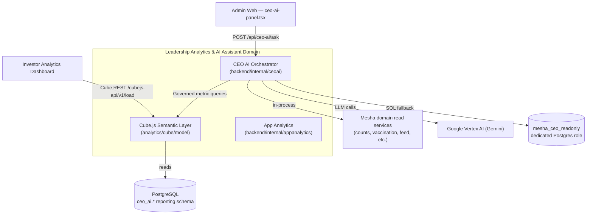
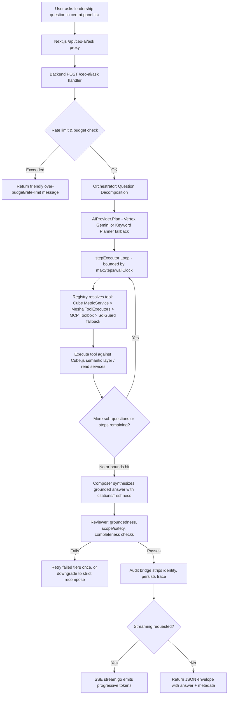
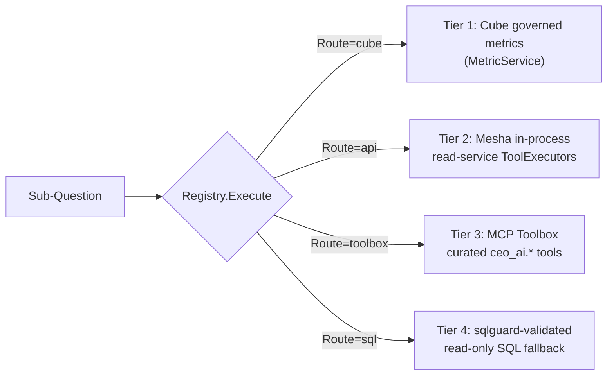

I now have comprehensive material to produce a thorough, accurate documentation. Let me write the final documentation.

# Leadership Analytics & AI Assistant Domain

## 1. Overview

The **Leadership Analytics & AI Assistant Domain** (internally referred to by its code package name, `ceoai`) is GoatOS's executive-facing intelligence layer. It gives farm leadership (CEOs, senior operators, investors-with-internal-access) a single conversational entry point — the **CEO AI** chat — through which they can ask natural-language business questions ("How many goats do we have?", "Which operators are behind on vaccination?", "Why are we behind on vaccination this week?") and receive a **grounded, read-only, tenant-scoped answer** synthesized from live operational data.

Architecturally, this domain is the union of two tightly coupled subsystems:

1. **The CEO AI Orchestrator** (`backend/internal/ceoai`) — a Go, hexagonal (ports-and-adapters) agentic runtime that decomposes questions, runs a bounded loop of governed read tools, synthesizes an answer, and runs a runtime safety/groundedness review before returning it.
2. **The Cube.js Semantic (OLAP) Layer** (`analytics/cube/model`) — a governed metrics model that is the *first-class* source of truth for leadership KPIs (census, mortality, vaccination, feed, procurement, workforce), shared identically by the AI assistant and by the read-only Investor Analytics Dashboard.

The domain's guiding design principle, stated repeatedly in the source comments, is: **"decompose → orchestrate many tools in one turn (Cube-first) → synthesize ONE grounded answer, behind a bounded step loop with a runtime review pass."** Every architectural decision in this module — the tiered tool registry, the SQL guard, the prompt-injection scanner, the numeric-grounding reviewer — exists to enforce that the assistant can **never fabricate a number** and can **never escalate scope** beyond what the requesting user's session already grants.

### 1.1 Business Value

- Gives executives instant, self-service access to farm KPIs without needing to navigate dashboards or wait on analysts.
- Enforces a single governed definition of every KPI (via Cube.js), eliminating "two versions of the truth" between the chat assistant and the static Investor dashboard.
- Applies defense-in-depth security engineering (prompt-injection screening, SQL guarding, tenant isolation, rate/budget limiting) appropriate for a system that lets an LLM touch production data, even in a strictly read-only capacity.

---

## 2. Position in the System Architecture



Within the broader GoatOS platform, this domain sits at the top of the analytics stack: it consumes data surfaces produced by nearly every other bounded context (Animal Health & Care, Feed Management, Field Operations, Procurement & Supply Chain, Workforce), but it **never writes** back to any of them. It shares its Cube.js semantic layer with the **Investor Analytics Dashboard**, which is the other primary consumer of governed KPI definitions — a deliberate architectural choice to guarantee that AI-composed answers and static investor charts never disagree on a number.

---

## 3. Module Structure

The `backend/internal/ceoai` package follows the platform-wide hexagonal convention (`domain / app / ports / adapters`), with a notably large and elaborate `safety`/`sqlguard` surface reflecting the sensitivity of exposing an LLM-driven read path over production data.

| Layer | Path | Responsibility |
|---|---|---|
| **Domain** | `ceoai/domain/types.go` | Pure, I/O-free core types: `Question`, `Plan`, `SubQuestion`, `ToolResult`, `Fact`, `Answer`, `Citation`, `Chart`, `ReviewVerdict`, `Route`, `Mode`. No framework or adapter imports. |
| **Ports** | `ceoai/ports/ports.go` | Interfaces the orchestrator depends on: `AIProvider`/`Planner`, `Reviewer`, `MetricService`, `ToolExecutor`, `SQLFallback`, `Toolbox`, `Moderator`, `ConversationStore`, `MemoryStore`, `Cache`, `RateLimiter`, `Budget`, `AuditSink`, `Telemetry`. |
| **App** | `ceoai/app/*.go` | The orchestration engine: `orchestrator.go` (main pipeline), `loop.go` (bounded step executor), `registry.go` (tiered tool catalog/router), `composer.go` (answer synthesis), `review.go` (grounding/scope/completeness verdict), `memory.go` (session entity recall), `budget.go` (in-process token caps), `resilience.go` (circuit breaker + retry), `concurrency.go` (load-shedding semaphore), `guard/injection.go` (scope-escalation scan on the app boundary). |
| **Adapters — Transport** | `ceoai/adapters/http/*.go` | `handler.go` (JSON `/ceo-ai/ask`), `stream.go` (SSE streaming), `routes.go` (single-route mux dispatch), `conversations.go` (thread CRUD), `admin_trace.go` (admin-only debug). |
| **Adapters — Planning** | `ceoai/adapters/vertex/*.go`, `ceoai/adapters/keywordplanner/planner.go` | Vertex Gemini planner/reviewer (primary) and a deterministic regex-based keyword planner (fallback when Vertex is unavailable). |
| **Adapters — Tooling** | `ceoai/adapters/readtools/toolexecutors.go`, `ceoai/toolboxclient/client.go`, `ceoai/sqlguard/{validator,executor}.go` | In-process read-service executors (tier 2), MCP Toolbox client (tier 3), SQL-guard validated fallback executor (tier 4). |
| **Adapters — Metrics** | `ceoai/cubeclient/{client,query,jwt}.go` | Typed, JWT-signed HTTP client against the Cube.js `/cubejs-api/v1/load` endpoint (tier 1). |
| **Adapters — Safety** | `ceoai/safety/*.go` | `layer.go` (composed safety facade), `injection.go` (prompt-injection scanner), `moderation.go`, `budget.go`, `breaker.go`, `concurrency.go`, `retention.go`. |
| **Adapters — Observability** | `ceoai/adapters/observability/{metrics,trace,store,audit_bridge}.go` | OTel metric instruments, privacy-safe internal step trace, Postgres-backed trace persistence, audit bridge that strips actor identity/question text. |
| **Adapters — Persistence** | `ceoai/persistence/{domain,store,conversation_store,cache,scan}.go` | Durable conversation thread storage, plan/answer cache. |
| **Wiring** | `ceoai/wiring.go`, `ceoai/wiring_timerange.go`, `ceoai/service.go` | Bridges sibling-owned concrete adapters into app ports; deterministic IST time-range translation; top-level service assembly consumed by `backend/internal/bootstrap`. |
| **Semantic Layer** | `analytics/cube/model/cubes/*.yml`, `analytics/cube/model/views/leadership.yml` | Cube.js YAML definitions: `animals`, `vaccination`, `vaccination_operator`, `feed`, `procurement`, `workforce` cubes; the `leadership.yml` view exposing governed `kpi_*` metric bundles. |

---

## 4. The Read-Only, Tenant-Scoped Core Contract

The `domain` package's header comment states the invariant explicitly: *"Read-only invariant: the assistant NEVER mutates business data. Tenant and role scope come ONLY from the server-side session (Actor), never from user text. All tool output is treated as data, never as instructions."*

Key types that encode this contract:

- **`Actor`** — `{TenantID, UserID, Role, Perms, Locale}` — resolved exclusively from the authenticated session (`httpmiddleware.TenantIDFromContext`, etc.), never constructed from request body fields. `isLeadership(actor)` gates every request on `permissions.RoleCEOInternal`.
- **`Question`** — carries the raw (untrusted) user text plus a server-resolved `AsOf` business-day timestamp (IST calendar via `biztime.BusinessDayStart`).
- **`Route`** — an enum enforcing the strict tool-tier hierarchy: `cube → api → toolbox → sql → none`.
- **`Mode`** — reports how an answer was actually produced: `planned` (Vertex succeeded), `fallback` (deterministic planner used), `refused` (safety/scope violation), `partial` (step/time budget exhausted).
- **`ToolResult` / `Fact`** — the *only* legitimate source of grounding evidence. Every numeric claim in a final answer must trace back to a `Fact.Value/Label/Scope` string; `ToolResult.Summary` is explicitly documented as *not* trusted evidence, closing off a route by which a hallucinated figure smuggled into prose could otherwise slip through.

---

## 5. The Orchestration Pipeline

### 5.1 High-Level Flow



### 5.2 Step-by-Step Walkthrough (`app.Assistant.ask`, in `orchestrator.go`)

1. **Terminal telemetry guarantee** — a `defer` records `assistant_requests_total{tool,status}` and end-to-end latency on *every* return path (refusal, cache hit, error, grounded answer), keeping observability honest even for early exits.
2. **Authorization** — rejects if the actor is not leadership (`isLeadership`) or has no tenant ID (`ErrForbidden`), and rejects an empty question (`ErrEmptyQuestion`).
3. **Business-day resolution** — if `Question.AsOf` is unset, it is resolved to the IST business-day start.
4. **Rate limiting & budget** — `ports.RateLimiter.Allow(tenant,user)` and `ports.Budget.Reserve(actor)` are checked before any expensive work; both fail *gracefully* with a friendly `ModeRefused` message rather than a raw HTTP error.
5. **Prompt-injection scan** — `guard.Scan(q.Text)` flags scope-escalation attempts embedded in the question text; a match returns an explicit refusal ("Tenant and access scope come from your session and can't be changed by the question.").
6. **Content moderation (inbound)** — an optional `ports.Moderator.CheckInbound` pass for abusive/off-domain content.
7. **Cache lookup** — a per-tenant/day/normalized-question cache key (`cacheKey`) is checked; a hit short-circuits the entire pipeline.
8. **Concurrency admission** — a bounded `Semaphore.Acquire` sheds load rather than piling up requests against finite Vertex/DB capacity.
9. **Session memory recall** — `ports.MemoryStore.Recall` fetches previously resolved entities (park/shed/metric) for the conversation, enabling elliptical follow-ups such as "and yesterday?".
10. **Planning** — `planWithFallback` calls the primary `AIProvider.Plan` (Vertex Gemini) with two bounded retries; on failure (and if the context isn't already cancelled) it transparently falls back to the deterministic `keywordplanner`, flipping `Mode` to `fallback` and firing `VertexFailover` telemetry.
11. **Deterministic plan corrections** — several *post-planning* rewrite passes enforce business rules the model may get wrong:
    - `enforceCubeFirst` — forces any sub-question whose tool name matches a governed Cube metric onto `RouteCube`, regardless of what the planner proposed.
    - `preferActiveCensus` — rewrites `total_animals` to `active_animals` for plain headcount questions (living herd, not all-time including dead/exited), unless the question explicitly asks for an all-time total.
    - `ensureUtilizationForOverload` — deterministically appends an `operator_vaccination_utilization` sub-question grouped by operator whenever the question matches an "overloaded/at-capacity" intent pattern, so the answer can always name which operators are over capacity.
    - `normalizeVaccinationIntent` — normalizes "missed/overdue/behind" phrasing and shed/park breakdown intent into consistent tool params.
    - `injectAsOf` — threads the resolved business-day instant into every sub-question's params so date-scoped questions ("counts as of yesterday") actually reach the executing reader.
12. **Bounded tool execution loop** — `stepExecutor.run` (see §6) executes each sub-question against `Registry.Execute`, capped by `MaxSteps` (default 6) and a wall-clock budget (default 25s), and captures a `StepTrace` per step for internal audit only.
13. **Fallback-tier retry** — `retryFailedResults` retries any errored/empty result at the *next* tier in the Cube → API → Toolbox → SQL order before composing, turning an unwired or mismatched tool into a real answer instead of composing from empty data.
14. **Answer composition** — `composer.compose` builds the answer body strictly from `ToolResult.Facts`, with an aggregate-first narrative lead sentence.
15. **Runtime review** — the deterministic `reviewer.review` (plus, on the non-streaming path, an optional Gemini "critic" via `ports.Reviewer.Critique`) checks groundedness, scope-safety (no leaked internals), and completeness. On failure, the pipeline retries the failed tiers once more; if still failing, it falls to `strictRecompose` — a template-driven, grounded-by-construction rendering directly from `Fact` values, which is never re-validated by the fuzzy model critic (only the deterministic reviewer), since the model critic has been observed to falsely flag legitimately grounded prose.
16. **Output moderation** — `ports.Moderator.CheckOutbound` screens the composed body before it can reach the user.
17. **Conversation persistence & memory update** — the turn is appended to `ports.ConversationStore`, and newly resolved entities are written back to `ports.MemoryStore` for future follow-ups.
18. **Audit recording** — `recordAudit` persists a `ports.AuditRecord` (routes, tools, row counts, latency, step traces, review verdict) via the audit bridge, deliberately **excluding** actor identity and raw question text from the trace surface (only a SHA-256 question hash is kept).
19. **Budget recording & caching** — actual token usage is recorded; a grounded, `planned`-mode answer is cached for reuse.

---

## 6. The Bounded Step Executor

`loop.go`'s `stepExecutor` is the safety valve that prevents a single leadership question from turning into an unbounded, runaway sequence of tool calls:

- **Hard caps**: `maxSteps` (default 6) and `wallClock` (default 25s) — whichever is hit first truncates execution and marks the answer `partial` rather than blocking indefinitely.
- **Per-step deadline propagation**: each sub-question execution gets a context derived from the remaining time budget, not a fresh timeout, so a slow first step correctly starves later steps rather than each getting a full allotment.
- **Error-visibility guarantee**: a tool executor may report failure via `ToolResult.Err` while returning a `nil` Go error (so the loop doesn't abort the whole turn); the step trace records whichever of the two is non-nil, closing a previously identified bug where a failed step looked identical to a successful empty one.

---

## 7. The Tiered Tool Registry — "Cube-First"

`registry.go` implements the in-process tool catalog and router in a strict, committed precedence order:



1. **Tier 1 — Cube governed metrics** (`ports.MetricService`): the *official*, business-signed-off KPI source. `enforceCubeFirst` in the orchestrator guarantees that any sub-question whose tool name matches a known Cube metric is routed here regardless of the planner's original choice.
2. **Tier 2 — Mesha read-service executors** (`ports.ToolExecutor`, implemented in `adapters/readtools/toolexecutors.go`): in-process (not HTTP self-calls) adapters to domain read models — e.g., `counts_breakdown`, `vaccination_shed_summary`, `vaccination_execution`. Each executor advertises a `ToolSpec` (name, route, description, accepted params) that becomes part of the model-facing catalog the planner consults.
3. **Tier 3 — MCP Toolbox** (`ports.Toolbox`, `toolboxclient`): curated tools exposed via the Model Context Protocol for capabilities not otherwise modeled (e.g., dose pickup lookups, pre-arrival history review).
4. **Tier 4 — SQL fallback** (`ports.SQLFallback`, `sqlguard`): a last-resort, validated read-only SQL executor over a dedicated reporting schema, never advertised as a named tool in the catalog — it is chosen only when no metric/API/toolbox tool matched.

The `Catalog()` method assembles this list in exactly this order for the planner prompt, reinforcing Cube-first preference at the *prompting* layer as well as at the *routing* layer (defense in depth). `cubeParams` normalizes flat planner-emitted parameters (`group_by`, `dimensions`, `time_range`, equality filters) into a governed `MetricQuery`, explicitly stripping reserved keys (`tenant_id`, `as_of`) so they can never leak into a Cube filter.

---

## 8. Answer Composition & Grounding Discipline

`composer.go`'s `compose` function is deliberately narrow: it renders sections directly from `ToolResult.Facts` (never inventing a number), attaches per-surface `Citation`s (route, freshness `AsOf`, metric governance status), and prepends a synthesized natural-language lead sentence built **only** from restated Fact values.

Two specialized lead-sentence builders illustrate the domain's business awareness:
- **`synthesizeOverloadLead`** — for "who is overloaded/at capacity" questions, explicitly names each operator whose utilization Fact is ≥100%, sorted worst-first, capped at 6 named operators.
- **`synthesizeLead`** — the general case, merging same-metric, differently-scoped facts (e.g., a "goats vs sheep" split emitted as two species-filtered sub-queries) into one coherent breakdown sentence.

When a tool step errors, the composer never surfaces the raw internal error to the user — it renders a clean "isn't available to the assistant yet" line, keeping wiring/SQL/route failures confined to the internal audit trace.

An **optional, additive `Chart`** (bar/line, built only from real grounding Facts) may be attached when the question is plot-worthy or the result is a dimensioned series; it never replaces or alters the text answer, source, mode, or citations, so the client can always fall back to rendering text alone.

---

## 9. The Runtime Review Pass ("Reviewer")

`review.go` implements the deterministic, authoritative safety net that runs on every drafted answer before it can be returned:

1. **Groundedness** — every numeric token in the composed body (via `numberRe`) must appear in the *grounded set* built from `Fact.Value`, `Fact.Label`, and `Fact.Scope` strings across all successful `ToolResult`s. `ToolResult.Summary` is explicitly excluded from grounding — it is prose, not evidence — which is what lets the reviewer catch a hallucinated figure smuggled into a summary.
2. **Scope safety** — the body is scanned (case-insensitive) for leaked internal tokens: `"chain of thought"`, `"step trace"`, `"system prompt"`, `"select "`, `"tenant_id ="`. Any match flags `ScopeSafe=false`.
3. **Completeness** — counts how many `ToolResult`s produced a non-empty, non-errored result and compares against the number of planned sub-questions; a shortfall flags `Complete=false`.
4. **Optional model critic** — when `ports.Reviewer` (the Gemini critic) is wired and `ReviewEnabled`, its judgment is folded in but can only *downgrade* — a `nil`/errored critic call never blocks the answer, since "app is authoritative."

On any failure, the orchestrator (a) retries failed-tier results once, re-composes, and re-reviews; if still failing, (b) falls back to `strictRecompose`, a template that emits every fact verbatim — grounded by construction — validated only by the deterministic reviewer (never re-run through the fuzzy model critic, which has been observed to falsely reject legitimately grounded per-operator breakdowns).

---

## 10. Safety, Abuse, and Cost Controls

The `safety` package composes an ordered, eight-stage admission pipeline (`layer.go`), invoked around the orchestrator's model call:

```
1. Identity validity        (scope must come from the session)
2. Rate limit                (per-actor + per-tenant)
3. Concurrency/backpressure  (bounded in-flight, semaphore-based load shedding)
4. Input moderation          (abuse/unsafe/off-domain)
5. Prompt-injection screen   (override attempts in the question)
6. Budget pre-check          (per-request + per-actor/tenant day)
   ... orchestrator runs the model under the circuit breaker ...
7. Output moderation         (screen the composed answer)
8. Budget record             (persist actual usage)
```

Notable implementation details:

- **`InjectionScanner`** (`safety/injection.go`) maintains an explicit, auditable corpus of regex families (not one mega-regex) covering: instruction-override attempts, role/persona reassignment, fake system/turn spoofing, tenant/role scope-escalation phrasing, exfiltration-of-internals attempts, and write-coercion smuggled as instructions. It normalizes zero-width character obfuscation before matching and provides `SanitizeToolText`, which wraps *any* text returned from a tool/DB (park names, operator names, exception titles) as an explicitly delimited, non-executable `[DATA field="..."]` token before it can reach a prompt — because injected payloads can originate from data, not just from user questions.
- **`EnforceScope`** is the hard, structural guarantee: given the session `Identity` and any tenant/role string parsed from user text, it **always** returns the session's own scope, discarding anything the user attempted to assert, and reports `flagged=true` when a mismatch is detected (for auditing).
- **`Budgeter`** and **`Limiter`** enforce per-tenant/day and per-user/day token or request caps; a rejection is never a silent empty answer, always a friendly, explicit message.
- **`CircuitBreaker`** (per dependency, e.g., "vertex") implements a closed → open → half-open state machine with a single-probe half-open gate, so a persistently failing dependency degrades gracefully instead of retrying at full latency against a dead endpoint.
- **`RetentionCleaner`** purges stored conversation data on a schedule, addressing data-retention compliance for a system that stores leadership chat history.

The `app/guard/injection.go` package provides a second, orchestrator-boundary scope-escalation `Scan`, layered on top of the `safety` package's scanner — a deliberate defense-in-depth duplication rather than a single point of failure.

---

## 11. SQL Guard — The Last-Resort Fallback Tier

`sqlguard/validator.go` is the largest single file in the entire `ceoai` module (~28KB) and implements a **pure-Go, dependency-free, deny-by-default** validator for any SQL the Gemini planner drafts as tier-4 fallback:

- Gemini may *draft* a read-only query over the governed `ceo_ai.*` reporting schema, but it **never executes SQL and never decides permissions** — every draft must pass `Validate` before `ExecuteReadOnly` runs it on a dedicated, non-privileged connection pool (`mesha_ceo_readonly`) inside a `READ ONLY` transaction with a statement timeout and a hard row cap (`MaxRowLimit = 100`).
- The validator tokenizes the statement by first stripping string literals (so payloads hidden inside quoted values cannot smuggle SQL keywords), then rejects: any of ~40 banned keywords (all DML/DDL/DCL, session/transaction control, procedural execution, `WITH` CTEs, `OFFSET` pagination), any banned function (`pg_sleep`, `pg_read_file`, `dblink`, dynamic-SQL builders like `format`/`decode`), non-ASCII characters outside literals, statement separators (`;`), comments (`--`, `/* */`), dollar-quoting, and backslashes.
- `AllowedSchema = "ceo_ai"` is enforced independently of database role grants — defense in depth even if role permissions were ever misconfigured.
- `MaxSQLBytes = 8000` bounds the accepted statement size to keep tokenization cheap and reject pathological model output.

This tier exists purely as a safety-valve fallback for questions the governed Cube model and read-service catalog cannot yet answer — it is explicitly *not* the primary or preferred path.

---

## 12. Planning Adapters: Vertex Gemini and the Deterministic Fallback

### 12.1 Vertex Gemini Planner (`adapters/vertex`)

`planner.go` implements `ports.AIProvider` (via `Plan`) and `ports.Reviewer` (via `Critique`) using the Vertex AI `generateContent` REST endpoint, authenticated with Application Default Credentials (no secrets in code).

- **Cube-first system prompt** (`prompt.go`, `systemPlannerInstruction`): explicitly instructs the model to (a) never write SQL when a governed Cube metric exists; (b) prefer `active_animals` (living herd) over `total_animals` (all-time) for plain headcount questions unless explicitly asked otherwise; (c) group operator-load questions by `operator_label`; (d) decompose diagnostic "why are we behind" questions into shed- and operator-level contributor breakdowns; and (e) refuse and select no tools for any write-intent request (mark done, approve, reschedule, delete, etc.).
- **Structured JSON output**: `GenerationConfig.ResponseMIMEType = "application/json"` at low temperature (0.1), parsed by `parsePlan` with tolerant fence/prefix stripping (`extractJSON`).
- **Critique**: a second Gemini call judging whether every number/data claim in a drafted answer is grounded in a supplied fact list, explicitly instructed to ignore narrative framing and disclaimers and flag only genuine unsupported claims. A reviewer failure or parse error is defensively treated as `grounded=true` — the app-layer deterministic reviewer remains authoritative, so the critic can only *add* scrutiny, never become a single point of failure.

### 12.2 Deterministic Keyword Planner (`adapters/keywordplanner`)

A model-free, ordered-regex-rule planner (`planner.go`) used whenever Vertex is unavailable or in tests. It never invents SQL — an unmatched intent simply refuses. Its rule ordering is deliberately significant (e.g., operator-grain patterns are matched before shed-grain patterns to prevent "which operators are behind" from collapsing into a tenant-wide shed metric), and it emits the exact same `domain.Plan` shape as the Vertex planner, keeping the orchestrator's downstream logic provider-agnostic.

`planWithFallback` in the orchestrator retries the primary provider twice with linear backoff before failing over to this planner, at which point `Mode` becomes `fallback` and `VertexFailover` telemetry fires.

---

## 13. The Cube.js Semantic Layer

### 13.1 Purpose

`analytics/cube/model` defines the **single governed source of truth** for every leadership KPI, consumed identically by the CEO AI assistant (via `cubeclient`) and the Investor Analytics Dashboard. This shared-layer design is explicitly called out in the code comments as a committed architectural contract: metric *formulas* live only in the Cube model and must not silently change even as the underlying SQL source tables migrate.

### 13.2 Cube Definitions

| Cube | File | Grain | Key Measures | Governance |
|---|---|---|---|---|
| `animals` | `cubes/animals.yml` | One row per animal, all species | `active_animal_count` (approved), `total_animal_count` (approved), `dead_count` (draft), `mortality_rate` (draft) | Reads `ceo_ai.animals_base` — a governed reporting view, never raw `public` tables |
| `vaccination` | `cubes/vaccination.yml` | Obligation grain | Due/overdue/completed/compliance metrics | Draft |
| `vaccination_operator` | `cubes/vaccination_operator.yml` | Operator grain | Assigned load, capacity, utilization, overdue per operator | Draft |
| `feed` | `cubes/feed.yml` | — | Feed quantity, feed cost | Draft/blocked (no price source yet) |
| `procurement` | `cubes/procurement.yml` | — | Load count, procurement cost | Draft/blocked (no cost source yet) |
| `workforce` | `cubes/workforce.yml` | — | Task counts, verification, operator completion rate | Draft |

Each cube exposes `tenant_id` as a plain dimension, but tenant filtering is **never trusted from the query itself** — it is injected server-side by Cube's `queryRewrite` from the signed security-context JWT (see §13.3), a critical separation between "what the model is allowed to ask for" and "what data it can actually see."

### 13.3 Governed Views (`views/leadership.yml`)

The `leadership.yml` view file defines the stable, public contract member names the planner is allowed to reference — `kpi_animals`, `kpi_vaccination`, `kpi_vaccination_operator`, `kpi_feed`, `kpi_procurement`, `kpi_workforce` — each a single-cube view (no cross-cube joins, to keep grain exact) re-exposing `tenant_id` so the tenant filter applies at the view level too.

### 13.4 Metric Status Governance

Measures carry an explicit `MetricStatus`: **`approved`** (official, business-signed-off figures like `active_animal_count`) vs. **`draft`** (interim, pending business sign-off, such as `mortality_rate` — whose denominator/window definition is explicitly documented as ambiguous). This status flows all the way through `ToolResult.MetricStatus` → `Citation.MetricStatus`, so the frontend can (and does) visually distinguish official numbers from provisional ones, and the wiring layer's `cubeMetricBindings` table (`wiring.go`) documents, per metric, exactly why it is approved or draft.

### 13.5 The Go Cube Client (`cubeclient`)

`cubeclient.Client` is described in its own package comment as **"the ONLY sanctioned way for the Mesha backend to read official leadership KPIs from Cube."** Key guarantees:

- **Tenant scoping via signed JWT, never query fields**: `jwt.go`'s `signSecurityContext` mints a short-lived (2-minute TTL) HS256 JWT carrying `{tenant_id, securityContext: {tenant_id}}`, signed with the shared `MESHA_CUBE_API_SECRET`, verified by Cube's `queryRewrite`.
- **Hard per-call deadline** (default 8s), **bounded retries** (default 2, linear backoff), and a **hard row ceiling** (default/max 100 rows) enforced regardless of caller input.
- **Typed error classification** in `doLoad`: `401/403` → `ErrUnauthorized` (non-retriable); `5xx` → retriable `APIError`; Cube's `{"error":"Continue wait"}` warm-up response → retriable timeout.
- **`Query`/`Result` types** (`query.go`) mirror the Cube REST `/cubejs-api/v1/load` contract subset needed here — measures, dimensions, time dimensions (IST business-day buckets), filters, order, limit — deliberately omitting `Offset` support for hot paths (keyset pagination preferred) and never including a tenant filter field, structurally preventing tenant leakage through the query object itself.

### 13.6 Deterministic Time-Range Translation

`wiring_timerange.go` bridges free-form `time_range` planner params into governed IST-based Cube `timeDimension` queries. This is a deliberately narrow, deterministic translation layer — not left to the LLM — because getting a business-calendar date window wrong is exactly the kind of subtle correctness bug that could silently corrupt a leadership answer.

---

## 14. HTTP Transport & API Surface

### 14.1 Backend Routes (`adapters/http`)

| Route | Handler | Notes |
|---|---|---|
| `POST /ceo-ai/ask` | `routes.go` dispatch → `handler.go` (JSON) or `stream.go` (SSE) | **Single route, single permission** (`admin_web_bootstrap`); streaming vs. JSON is a *transport* choice driven by the request body's `stream` field (default `true`), never a separate authz surface. |
| Conversation CRUD | `conversations.go` | List/create/get/update/delete threads with keyset pagination. |
| `GET /ceo-ai/admin/trace/{request_id}` | `admin_trace.go` | **Admin-only** internal step-trace debug surface, hard-gated to `permissions.RoleCEOInternal`. A non-admin gets an identical 403 for both "forbidden" and "not found" cases, so request-ID existence cannot be probed. Even for admins, the returned record is passed through `Sanitize()` a second time at the boundary. |

The `Ask` handler (`handler.go`) resolves the `Actor` strictly from session middleware context (`httpmiddleware.TenantIDFromContext`, `ActorIDFromContext`, `AuthGrantsFromContext`) — **never** from the request body — and truncates oversized question text (>1200 chars) defensively. The response envelope contains only the allowed user-facing fields (`answer`, `source`, `mode`, `request_id`, `conversation_id`, `citations`, optional `chart`) — step traces and chain-of-thought are structurally impossible to leak through this type, since `domain.Answer` simply has no field for them.

### 14.2 Frontend Integration (`apps/admin-web`)

- **`features/ceo-ai/ceo-ai-panel.tsx`** — the chat UI: streaming reader, conversation history sidebar, per-message citation/freshness formatting. It contains deliberate **presentation-layer sanitization** (`formatCitationSurface`, `formatSource`, `PLUMBING_PREFIX`/`PLUMBING_TOKENS`) that strips any residual "Cube · <id>" or route-tier plumbing that might leak through from older stored history, ensuring the CEO-facing chip only ever shows a neutral "Live data" freshness tag or a clean business label — reinforcing, at the UI layer, the backend's rule that internal routing details never reach the leadership user.
- **`app/api/ceo-ai/*` Next.js route handlers** — thin, `force-dynamic`/Node-runtime authenticated proxies (`_forward.ts`) that forward both JSON and SSE-streamed responses to the Go backend without re-implementing business logic.

---

## 15. Observability & Auditability

The domain treats "how the answer was produced" and "who asked" as two data classes with very different sensitivity, and structurally separates them:

- **Metrics** (`adapters/observability/metrics.go`) — a fixed, documented OTel instrument set: `assistant_requests_total{tool,status}`, `assistant_latency_ms{tool}`, `assistant_tool_rows_returned{tool}`, `assistant_sql_rejected_total{reason}`, `assistant_vertex_failover_total`, `assistant_toolbox_errors_total`, `assistant_rate_limit_trips_total`, `assistant_budget_rejections_total`, `assistant_cache_lookups_total{result}`, `assistant_review_corrections_total`, `assistant_injection_blocked_total`, `assistant_breaker_state{dependency}`. Labels are **strictly bounded, low-cardinality enums** — never tenant ID, actor ID, request ID, or question text — so metric cardinality stays finite regardless of traffic volume.
- **Internal step trace / audit** (`adapters/observability/{trace,store,audit_bridge}.go`) — one row per request keyed by `RequestID`, containing tool routes, row counts, latency, per-step timing, and the review verdict. The `audit_bridge.go` mapping deliberately **drops actor identity entirely** and **never carries question text**, keeping only a SHA-256 question hash for correlation — "the trace surface is about HOW the answer was produced, not WHO asked."
- **Admin trace endpoint** — the only surface where this internal trace is ever exposed, and only to the `ceo_internal`/superadmin cohort, purpose-built so engineers can debug "each step" without violating the committed rule that step traces/chain-of-thought must never appear in the leadership-facing chat answer itself.

---

## 16. Persistence & Session Continuity

- **`ConversationStore`** (`persistence/conversation_store.go`) — durable thread storage: `EnsureConversation`, `AppendTurn`, `RecentTurns`, enabling multi-turn chat history across sessions.
- **`InMemoryMemory`** (`app/memory.go`) — a process-local, tenant-scoped, LRU-capped bounded cache of `ResolvedEntities` (last park/shed/metric/intent resolved per conversation), specifically built to fix a real regression: without it, every follow-up question ("and yesterday?") planned from scratch and silently dropped the scope the previous turn had established. Entries are capped per conversation (last N turns) and the conversation set itself is LRU-evicted so a long-lived backend process cannot grow memory unboundedly. Empty resolved-entity snapshots are never stored, so a scopeless turn cannot overwrite a prior, still-needed park binding.
- **`Cache`** (`persistence/cache.go`, `adapters/memcache/cache.go`) — an answer/plan cache keyed by `(tenant, normalized question, as_of business-day)`, explicitly documented as never crossing tenant boundaries.

---

## 17. Cross-Domain Relationships

| Relationship | Direction | Nature |
|---|---|---|
| Admin Web ↔ CEO AI Orchestrator | Admin Web → Leadership Analytics | Service call: the `ceo-ai-panel.tsx` chat UI is the orchestrator's primary human interface. |
| CEO AI Orchestrator ↔ Field Operations / Feed / Vaccination read models | Leadership Analytics → other domains | Data dependency (read-only): tier-2 `ToolExecutor`s call in-process read services owned by other bounded contexts. |
| CEO AI Orchestrator ↔ Procurement & Supply Chain | Leadership Analytics → Procurement | Data dependency via Cube `procurement`/`workforce` cubes for financial/operator KPIs. |
| Investor Analytics Dashboard ↔ Cube.js Semantic Layer | Investor Dashboard → Leadership Analytics | Data dependency: both leadership surfaces (AI chat and static dashboard) resolve the *same* governed metric definitions, guaranteeing consistency. |
| CEO AI Orchestrator ↔ Verification & Process Integrity | Indirect | The underlying data the assistant reads (counts, vaccination, health records) has already passed through the Verification domain's certification gates upstream; the assistant performs no additional validation of source data quality itself. |

---

## 18. Design Strengths

1. **Committed, structurally-enforced read-only invariant** — the `domain.Answer` type has no field capable of carrying a mutation instruction or internal reasoning; safety is enforced by *type shape*, not just by convention.
2. **Defense-in-depth security engineering** — prompt-injection scanning occurs at *two* independent layers (`safety/injection.go` and `app/guard/injection.go`); tenant scope is enforced independently at the HTTP handler, the Cube JWT signer, and the SQL guard's schema allowlist — no single control is a single point of failure.
3. **Grounding is mechanically verifiable, not just prompted** — the reviewer's numeric-extraction-and-matching approach means an ungrounded figure is *structurally* detectable, not merely discouraged by prompt wording.
4. **Graceful, layered degradation** — Vertex failure → deterministic keyword planner; Cube/API/Toolbox tool failure → next-tier retry; model critic failure → deterministic reviewer remains authoritative; budget/rate-limit exhaustion → friendly message, never a silent drop or a 500. Every failure mode has an explicit, tested fallback path rather than an unhandled exception.
5. **Shared semantic layer eliminates metric drift** — the Cube.js model is the single governed contract consumed identically by the AI assistant and the Investor dashboard.
6. **Privacy-conscious observability** — the split between low-cardinality OTel metrics, an identity-stripped internal audit trace, and a hard admin-only debug gate reflects mature operational security practice for an LLM-adjacent system.

## 19. Known Risks & Considerations

1. **Concentration of logic in `orchestrator.go`** (26KB, largest file in the module besides `sqlguard/validator.go`) — the main pipeline function is long and carries several intent-specific post-planning correction passes (`preferActiveCensus`, `ensureUtilizationForOverload`, `normalizeVaccinationIntent`); as leadership question patterns grow, this file's complexity will likely continue to grow unless these heuristics are extracted into a more declarative rule engine.
2. **Draft metric proliferation** — several key business metrics (`mortality_rate`, all vaccination and feed/procurement cubes) remain `draft` pending business sign-off; the assistant must continue to reliably surface this status to avoid leadership treating provisional figures as official.
3. **In-process memory/budget/breaker state is not distributed** — `InMemoryMemory`, `InMemoryBudget`, and the circuit breaker are per-process; in a multi-instance Cloud Run deployment, session continuity and budget caps are only correct if requests from one conversation/tenant are consistently routed to (or replicated across) the same instances, or if a durable equivalent is substituted in production wiring.
4. **SQL fallback tier, while heavily guarded, remains an inherent residual risk surface** — any future relaxation of the `sqlguard` denylist (e.g., to support a legitimate new read pattern) requires the same rigor as the original implementation, given the file's explicit "when in doubt it rejects" design philosophy.