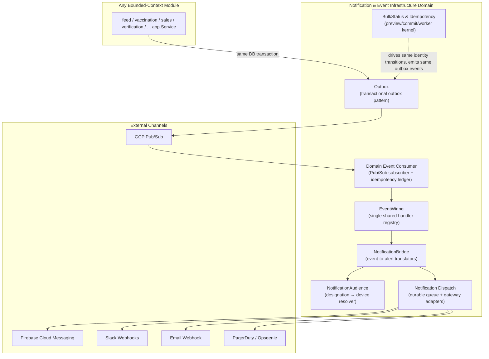
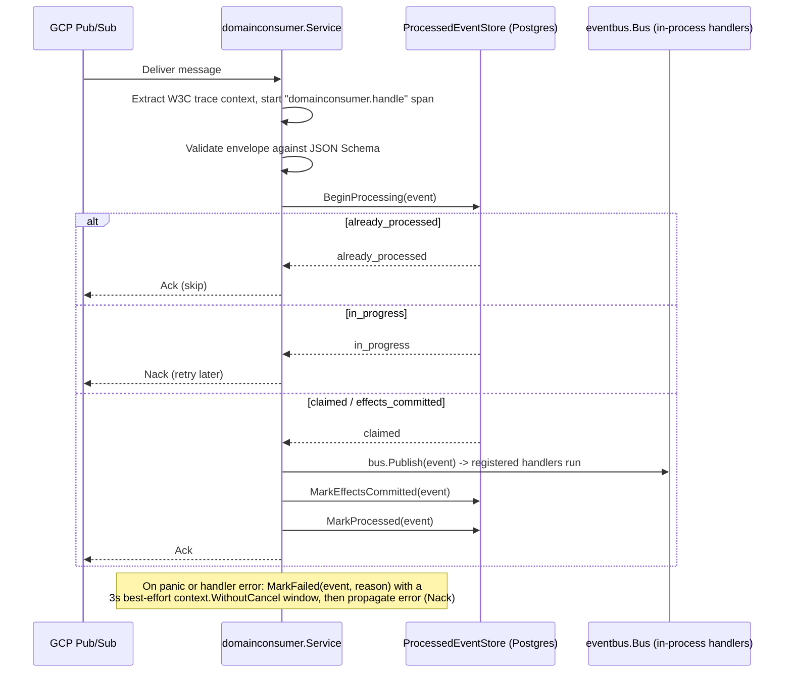

# Notification & Event Infrastructure Domain

**GoatOS Technical Documentation — Backend Infrastructure Domain**

Document Version: 1.0
Last Updated: 2026-09-13
Scope: `backend/internal/{notification,notificationaudience,notificationbridge,outbox,domainconsumer,eventwiring,bulkstatus}` and their corresponding `backend/cmd/*` deployables

---

## 1. Purpose and Role in the System

The Notification & Event Infrastructure Domain is the asynchronous communication backbone of GoatOS. It is classified as an **Infrastructure Domain** — it owns no primary business data (no goats, no feed, no vaccination records) but provides the mechanism through which GoatOS's 45+ bounded-context modules stay loosely coupled while still reacting to each other's state changes in near real time.

Concretely, this domain answers four questions for the rest of the platform:

1. **How does a write in one module reliably reach another module without a synchronous call?** → the transactional **Outbox** pattern relayed over Google Cloud Pub/Sub.
2. **How does a consuming process guarantee it acts on an event exactly once, even though delivery is at-least-once?** → the **Domain Event Consumer** with a `processed_events` ledger.
3. **How does a domain event become a human-facing alert on the right person's phone?** → **Notification Bridge** consumers, the **Notification Audience** designation-resolution catalog, and the **Notification Dispatch** service with pluggable channel gateways.
4. **How does the platform perform safe, resumable, massive-scale asynchronous state changes (e.g., updating thousands of animal records at once) without violating the same domain invariants a single-record API call enforces?** → the **Bulk Status & Idempotency** kernel.

Every one of GoatOS's operational domains — Feed Management, Animal Health & Care, Verification & Process Integrity, Field Operations, Procurement & Sales, Workforce — depends on this infrastructure to publish state changes and to fan out notifications, making it one of the most heavily "fanned-in" bounded contexts in the codebase despite carrying no core business semantics of its own.

---

## 2. Architectural Position

This domain follows the same hexagonal (ports-and-adapters) layering convention used throughout the GoatOS backend: each sub-module is organized into `domain/` (pure types and invariants), `app/` (use-case services), `ports/` (interfaces the app layer depends on), and `adapters/` (Postgres repositories, HTTP handlers, Pub/Sub clients, gateway integrations). This uniformity means the event infrastructure is not a special-cased "framework" bolted onto the system — it is built with the exact same discipline as, e.g., the Feed or Vaccination domains, which makes it approachable to any backend engineer already familiar with GoatOS conventions.



---

## 3. Sub-Module Breakdown

| Sub-Module | Code Path | Responsibility |
|---|---|---|
| **Outbox & Domain Event Bus** | `backend/internal/outbox`, `backend/internal/domainconsumer`, `backend/internal/eventwiring` | Transactional outbox writer/relay, Pub/Sub publish/subscribe, idempotent processing, cross-module handler wiring |
| **Notification Dispatch** | `backend/internal/notification` | Durable notification queue, retry/backoff, multi-channel delivery gateway |
| **Notification Audience** | `backend/internal/notificationaudience` | Configurable "who hears this alert" designation catalog and resolver |
| **Notification Bridge** | `backend/internal/notificationbridge` | Event-driven consumers that translate domain events into queued notification requests |
| **Bulk Status & Idempotency** | `backend/internal/bulkstatus` | Preview/commit/worker pipeline for large-scale asynchronous status changes; idempotency-key hygiene |

### Deployment Topology

Unlike a typical microservice split, all of the above logic lives in **one Go module** but is composed into **multiple independent deployables**, each a thin `main.go` wiring the same domain packages differently:

| Binary (`backend/cmd/...`) | Role |
|---|---|
| `outbox-relay` | Polls the `outbox_messages` table and publishes ready rows to Pub/Sub (or a local in-process bus for dev/E2E) |
| `outbox-dlq` | Operator CLI to list/inspect the outbox dead-letter queue |
| `domain-event-consumer` | Long-running Pub/Sub subscriber process that applies domain events via `eventwiring` |
| `domain-event-processed-sweeper` | Deletes/retention-sweeps old rows from the `domain_event_processed_events` idempotency ledger |
| `notification-dispatcher` | Claims due `notification_requests` rows and sends them through the gateway adapters |
| `notification-requeue` | Operator CLI to list and recover `exhausted` notification rows |
| `bulk-status-worker` | Claims and applies `bulk_status_job_row` rows via the identity bridge |
| `idempotency-key-sweeper` | Deletes expired rows from the generic `idempotency_keys` table |

This is the classic "single module, multiple Cloud Run Services/Jobs" pattern used across the whole GoatOS backend: the code is one artifact, but each binary is independently deployed, scaled, and scheduled in the Terraform-managed GCP environment.

---

## 4. The Transactional Outbox Pattern

### 4.1 Why It Exists

A domain service (e.g., `sales`, `feeddirection`, `vaccination`) must record a business fact and reliably announce it to other modules — without a distributed transaction spanning Postgres and Pub/Sub, and without losing the event if the process crashes between the write and the publish. GoatOS solves this with the standard transactional outbox pattern: the producing service writes its business row **and** an `outbox_messages` row in the **same database transaction**. If the transaction commits, the event is guaranteed to exist durably; if it rolls back, neither the business fact nor the event exists. Publishing to the actual message broker is decoupled into a separate, independently retryable process.

### 4.2 Outbox Message Lifecycle

The `outbox` domain model (`backend/internal/outbox/domain/types.go`) defines the following states for every `Message`:

```
pending → publishing → published
                     ↘ failed        (permanent envelope/publish errors)
                     ↘ dead_letter   (max_attempts exhausted)
```

Key fields on `domain.Message` include `EventID`, `EventType`, `SchemaVersion`, `AggregateType/AggregateID`, `Topic`, `Headers`, `Payload`, `IdempotencyKey`, `TraceID`, and `AttemptCount` — giving every event a stable identity, a versioned schema, a logical partition key, and a distributed-tracing hook.

### 4.3 Relay Service (`outbox/app/service.go`)

The `outbox-relay` binary runs `Service.RunOnce` (or `RunUntilDrained` for scheduled batch jobs) on a polling cadence:

1. **`ReclaimStalePublishing`** — requeues rows stuck in `publishing` past their lease timeout (default 5 minutes), which happens if a worker crashes between claiming a message and marking its outcome. Critically, the reclaim **decrements `attempt_count`** in the same atomic UPDATE, because `ClaimPending` increments the counter at *claim* time rather than at actual-publish time — without this correction, repeated crashes before a real publish attempt would silently exhaust `max_attempts` and dead-letter a message that was never truly attempted.
2. **`ClaimPending`** — atomically claims up to `Limit` (default 50) ready rows inside a DB transaction, dead-lettering any row that has already exhausted `MaxAttempts` (default 5) directly in SQL.
3. **Per-message processing** (`processMessage`):
   - Validates the payload against a **JSON Schema envelope** (`santhosh-tekuri/jsonschema/v6`). An invalid envelope is marked `failed` immediately (never retried).
   - Publishes via the pluggable `ports.Publisher` interface, wrapped in an OpenTelemetry `outbox.publish` span.
   - On success → `MarkPublished`.
   - On a **permanent** publish error (`ports.PermanentPublishError`) → `MarkFailed`.
   - On a **retryable** error, if attempts remain → `MarkRetry` with exponential backoff (base 5s, max 5 minutes); if attempts are exhausted → `MarkDeadLetter`.
4. Every terminal outcome (`failed` or `dead_letter`) is **logged at WARN/ERROR level with full context** (`outbox_message_undeliverable`, `outbox_message_dead_lettered`) — a deliberate fix documented in code comments after an incident where 12 undeliverable weighing events silently died with only a counter increment and no human-visible trace. This "a dead write must be VISIBLE" principle recurs throughout the domain's implementation and is one of its most important operational safeguards.

### 4.4 Pluggable Publisher Adapters

The `outbox/adapters/publisher` package selects an implementation of `ports.Publisher` by environment (`publisher.Select`), enabling the **same relay binary** to run unmodified in local development and in production:

- **`logging`** — the safe local default; logs the would-be publish instead of sending it.
- **`pubsub`** — the production adapter (`outbox/adapters/publisher/pubsub`), wrapping a `MessagePublisher` seam so the adapter's attribute-building, error classification, and `event_id`-based dedup logic is fully unit-testable without the GCP SDK. On publish, it stamps `event_id`, `event_type`, `tenant_id`, `outbox_id`, `logical_topic`, and injects the **current span's W3C trace context** into the Pub/Sub message attributes — this is what allows the `domain-event-consumer` to continue the same distributed trace the original write started.
- **`eventbus`** — an in-process adapter used by local/E2E test fixtures so the story test suite can exercise the full write → publish → consume chain without a real broker.

### 4.5 Dead Letter Queue and Repair

The **DLQ** is exposed for operator visibility and recovery through:

- **HTTP endpoints** (`outbox/adapters/http/handler.go`): `GET /operations/kernel-health`, `GET /operations/dlq`, `POST /operations/dlq/replay`, `POST /operations/dlq/discard` — all requiring a `reason` and idempotency protections (`ErrDLQActionConflict`, `ErrDLQActionPending`) to prevent duplicate or racing operator actions, plus full **audit logging** of every replay/discard action.
- **`outbox-dlq` CLI** for command-line inspection outside the admin UI.
- **`domainconsumer/repair`** — a dedicated repair service for the **consumer-side** Pub/Sub dead-letter topic (distinct from the outbox table's own DLQ). It models `Message`/`Delivery`/`Publisher`/`Auditor` abstractions so an operator can `list`, `replay`, or `discard` a specific dead-lettered event by matching its `event_id` against the `CloudPubSubDeadLetterSource*` attributes GCP attaches, republishing to the **source topic** (not directly re-invoking the handler), and always writing a `platformaudit.Event` recording the actor, reason, and delivery count.

---

## 5. Domain Event Consumption & Idempotency

### 5.1 The Delivery Guarantee Problem

Pub/Sub provides **at-least-once** delivery. A naive consumer that reprocesses a redelivered message risks re-running non-idempotent side effects (e.g., double-decrementing feed stock, double-firing a downstream notification). The `domainconsumer` module (`backend/internal/domainconsumer/app/service.go`) solves this with a **processed-event ledger** backed by Postgres.

### 5.2 Processing State Machine

Each incoming message is tracked in `domain_event_processed_events`, keyed by `(tenant_id, subscription_id, event_id)`, with a decision returned from `BeginProcessing`:

| Decision | Meaning |
|---|---|
| `claimed` | Fresh event, or a stale/failed row reclaimed for a full retry |
| `effects_committed` | A prior attempt's handler ran (`bus.Publish`) successfully, but the process crashed before the terminal `processed` mark. **Only the finalize step may be retried — the handler must never run again.** |
| `already_processed` | Terminal state; the message is a pure duplicate delivery and is skipped/acked |
| `in_progress` | Another delivery is currently processing this event (still within the stale window, default 15 minutes) |

This `effects_committed` intermediate state is a deliberate design decision to avoid a documented incident class (referenced in code as **C35-024**): if a handler's side effect (e.g., publishing further events) had already succeeded but only the bookkeeping write failed, naively reprocessing the whole message on redelivery would replay a non-idempotent effect. By durably recording "effects committed, only finalize left to retry" *before* the terminal write, the consumer guarantees each handler invocation with real side effects happens **at most once**, even though message delivery itself is at-least-once.

### 5.3 Consumption Flow



A dedicated `ErrPermanentDispatchFailure` marks deterministic domain-rule rejections (e.g., a stock-gate check that will never pass on redelivery) so the consumer can Ack-and-log rather than Nack-and-loop forever — this was introduced after an incident where a `verification.verdict.approved` event was retried **3,056+ times** against a deterministic rejection because nothing stopped the Nack loop.

### 5.4 `eventwiring` — The Single Source of Truth for Handler Registration

`backend/internal/eventwiring` exists specifically to prevent **registration drift**. Its doc comments describe a real production incident: the shifting/feed-distribution/feed-packing verification handlers were registered on the API's in-process bus but *not* on the actual outbox-relay and domain-event-consumer processes that consume the durable event stream — meaning every verifier approval for those modules was silently stranded in `pending_verification` state indefinitely, because verdicts are delivered **only** through the outbox, never through a direct API call.

`eventwiring.RegisterVerificationAppliers` and `eventwiring.RegisterWorkflowConsumers` are now the **single, shared registration functions** called identically by:
- `bootstrap/api.go` (the API's in-process bus),
- `cmd/outbox-relay` (local eventbus for E2E fixtures),
- `cmd/domain-event-consumer` (production Pub/Sub consumer),
- `backend/internal/kernelstages` (background pipeline),
- `backend/internal/domainconsumer/wiring/bus.go` (the domain-consumer's bus builder).

This eliminates the "three hand-maintained lists that drifted" defect class by construction. The appliers registered here cover the full range of verifier-verdict-driven state machines: shifting, feed distribution/packing/transport/wastage, milk preparation/feeding, pen reconciliation, weighing, preventive-care (PC Care) tasks and per-pen removals, health treatment sessions, and pen visits — each filtered strictly by `source.module` + `source.ref_type` so cross-module event "cross-fire" is structurally impossible.

`eventwiring/workflows.go` similarly centralizes the birth/death lifecycle workflow consumers (`counts.death.reported`, `goat.created` with `origin_type=birth`, `goat.exited` with `exit_reason=died`, and their verification verdict handlers).

---

## 6. Notification Dispatch

### 6.1 Durable Queue Model

The `notification` module owns a durable `notification_requests` table modeled with states `queued → sending → sent | failed | exhausted | suppressed | read`. Each `domain.Request` carries `CalendarEventID`, `TargetType/TargetID`, `NotificationType`, `Channel`, `RecipientRef`, `Title/Body`, `TraceID`, structured `Context` (JSON), and a `LeaseToken` for safe concurrent claiming.

### 6.2 Dispatcher Service (`notification/app/service.go`)

The `notification-dispatcher` binary runs `Service.RunOnce(ctx, tenantID)` per tenant:

1. **`ReclaimStaleSending`** — recovers rows stuck mid-send past their lease (default 2 minutes).
2. **Backlog-age probe** (`OldestDueRequestedAt`) — measures the age of the globally oldest due-but-undelivered request **before** claiming, specifically because claiming flips status to `sending` and would otherwise make the backlog appear artificially younger. This metric powers a documented ADR-defined "1-minute fast-lane" SLO alert.
3. **`ClaimDue`** — claims up to `Limit` (default 50) due rows.
4. **Per-request dispatch** (`dispatchOne`):
   - Sends via the `ports.Gateway`/`ResultGateway` interface.
   - On success: `MarkSent` (or `MarkSentWithResult`, which additionally persists the provider's message ID for providers like FCM that return one).
   - On failure: classifies the error into one of several distinct outcomes, each with different retry semantics:
     - **`ErrInvalidRecipient`** (provider confirms the device token is dead, e.g., FCM `NotRegistered`) → suppress that specific recipient's other queued pushes (only known-dead devices are suppressed).
     - **`ErrRecipientUnusable`** (malformed identifier, e.g., a role name used incorrectly) → **not** suppressed, since `recipient_ref` on the calendar-reminder path is a role name shared by many rows; suppressing it would silently kill every queued push for that role tenant-wide.
     - **`ErrChannelNotConfigured`** → deliberately **excluded from the retry/backoff schedule** and exhausted on the *first* attempt. The rationale documented in code: a missing channel config is tenant-wide and static until an operator fixes it, so scheduling 5 rounds of exponential backoff only delays the "this needs a human" signal while wasting worker budget. The intentional trade-off is that fixing the config does **not** automatically resurrect already-exhausted rows — that is the explicit, human-gated job of `notification-requeue`.
     - Otherwise → exponential backoff retry (base 30s, max 15 minutes) up to `MaxAttempts` (default 5).
   - **Every exhaustion is logged at WARN with full structured context** — again the "a dead write must be VISIBLE" principle, since a config-driven exhaustion on the first attempt might otherwise be the *only* place a lost push is ever surfaced.

### 6.3 Requeue as an Explicit Operator Action

`cmd/notification-requeue` exists because the dispatcher's `ClaimDue` only claims rows in `queued`/`failed` — nothing automatically resurrects `exhausted` rows. This is a deliberate design choice: an automatic self-heal ("un-exhaust everything the instant a config check passes") was considered and rejected because it could silently resurrect notifications whose subject is no longer relevant, with no human in the loop. The CLI mirrors `outbox-dlq`'s shape: a `list` mode for safe, read-only inspection and a `requeue` mode requiring `tenant-id` + `notification-type` (no "requeue everything" mode by design) plus a `-confirm` flag, always recording who performed the requeue.

### 6.4 Gateway Adapters

`notification/adapters/gateway/gateway.go` implements a single `Gateway` supporting multiple channels dispatched by string key: `local-stub` (dev/test), `slack` (with per-channel webhook routing via `SlackChannelWebhookURLs`, since a Slack incoming webhook is permanently bound to one channel), `webhook` (generic), `incident`/`opsgenie`/`pagerduty`, `email`, and `push_fcm` (Google OAuth2-authenticated FCM HTTP v1 API). A `DryRun` flag short-circuits all channels for safe rehearsal, while a distinct `LocalStubUnconfiguredChannels` flag substitutes the local-stub delivery path **only** for channels that are genuinely unconfigured, so local/E2E environments without Firebase or Slack credentials still exercise real per-request routing logic instead of silently failing after one attempt — this flag must always be `false` in production so a real configuration gap fails loudly.

---

## 7. Notification Audience — Configurable "Who Hears What"

### 7.1 Problem Solved

Historically, every leadership-facing push hardcoded its recipient as a literal position code inside the notifier that sent it — meaning "the Park Head should also hear the low-stock alert" required a code change and a release. `notificationaudience` (`domain/catalog.go`, `app/resolver.go`) replaces this with a **configurable-by-designation** model.

### 7.2 The Catalog

`domain/catalog.go` is a declarative registry: one `Alert` entry per configurable notification (keyed `<module>.<alert>`, e.g. `feed.low_stock`, `vaccination.drive_ready`, `weighing.verdict_approved`), each carrying its `Module`, admin-facing `Label`/`Blurb`, and `DefaultDesignations` — the exact audience the code used to hardcode, ensuring the feature's rollout changes nobody's phone by default. Designations are job titles (e.g., `pc_director`, `feed_director`, `park_head`, `verifier`, `operator`), never individual people, because "an alert is addressed to a desk, and whoever holds the desk hears it." Designations are further classified as **tenant-scoped** (one seat across the whole tenant, e.g., directors, the verifier) or **park-scoped** (one seat per park, e.g., park head, operator, procurement manager) via `DesignationScope`.

Two categories of pushes are deliberately excluded from this catalog: person-addressed pushes (the specific operator whose bag was reopened) stay on dedicated member resolvers, and Slack channel posts (addressed to a channel, not a desk).

### 7.3 The Resolver

`app/resolver.go`'s `Resolver` answers "who hears this alert" for a tenant:
- **`Designations`** — returns the tenant's stored override if customized (via `AudienceRepository.LoadAudience`), otherwise the catalog default. An unknown alert key returns `ErrUnknownAlert` rather than silently degrading to an empty audience — a wiring defect must be surfaced, not swallowed.
- **`Recipients`** — resolves the effective designation list into concrete devices via a `PositionRecipientResolver` (the workforce module), scoped by `parkID` for park-scoped desks.
- **`Addressed`** — the more nuanced case for alerts addressed to a *specific person* (e.g., the CXO who raised a leadership task, or the verifier on duty). The addressee's own device is **kept only if their designation is ticked** on the alert matrix, and any *other* ticked designation is resolved as a normal audience and added as a copy — so unticking the addressee's own title is the precise on/off switch the admin matrix promises, without silencing anyone else.

A `nil AudienceRepository` is explicitly legal, meaning "serve catalog defaults only" — this lets existing tests keep simple fakes while production wires the full Postgres-backed override store (`notificationaudiencepg`).

---

## 8. Notification Bridge — Event-to-Alert Translation

`backend/internal/notificationbridge` is the layer of pure, read-only **consumers** that sit on the domain event bus and turn already-decided state transitions into `notification_requests` rows. Architecturally, this package never drives, reimplements, or depends on the state machine of the module it observes — its only job is "resolve recipients, queue notification."

Representative consumers (17 files):

| File | Trigger Events | Purpose |
|---|---|---|
| `verification_notify_consumer.go` | `verification.item.pending`, `verification.verdict.rework`, `verification.verdict.approved`, `verification.item.closed`, vaccination drive ready/closed | Per-module routing of proof lifecycle pushes — the largest consumer (61KB), using a `pendingModuleProfile` table keyed by the verification item's own `Module` field so a weighing proof is never misrouted to the vaccination verifier |
| `weighing_lifecycle_notify_consumer.go` / `weighing_submission_notify_consumer.go` | Weighing plan published, submitted, reopened, verdicts, pen/task closure | Weighing-specific leadership and operator pushes |
| `feed_low_stock_notify.go` | Daily scheduled scan | Per-(farm, feed) low-stock alerts to CEO/CXO, Feed Director, Procurement Director; deduplicated once per business day via an idempotency key carrying the business date |
| `feed_packing_reopen_notify_consumer.go` | `feed.packing.reopened` | Downward push to the packer whose bag was reclaimed, carrying old-vs-new quantities |
| `sale_feed_reduce_notify.go` | `goat.sale_allocated` | Notifies the Feed Director of pen-by-pen feed reduction after a confirmed sale |
| `pen_visit_due_notify.go` | Pen-visit scheduling events | Reminds the responsible party a pen visit is due |
| `leadership_task_notify_consumer.go` | Leadership task raised/done | Routes between directors and the CXO who raised the task |
| `leave_request_notify_consumer.go` | Leave request raised/decided | Routes to park head + HR on raise, back to the requester on decision |
| `load_age_notify.go` / `obligation_missed_notify.go` | Procurement load overdue / missed obligations | Escalation alerts |
| `vaccine_labels.go` / `location_names.go` | (support) | Resolve raw vaccine/location codes into human-readable copy for push bodies |

These consumers are registered on **every process that owns a domain-event bus** (API, outbox-relay, domain-event-consumer, kernelstages) via the shared `eventwiring`/`domainconsumer/wiring` builders — the same anti-drift discipline described in Section 5.4.

---

## 9. Bulk Status & Idempotency

### 9.1 Purpose

`backend/internal/bulkstatus` is the durable kernel for **large-scale asynchronous status changes** — for example, updating the reproductive, health, or exit status of up to millions of goats in one operator-initiated action — without bypassing the same domain invariants, audit trail, and event emission a single-record admin API call would produce.

### 9.2 Preview → Commit → Worker Pipeline

```mermaid
flowchart LR
    A[Operator submits rows] --> B["Preview: compute rows fingerprint\n(order-independent SHA-256)"]
    B --> C["Sign HMAC-SHA256 preview token\n(30 min expiry, 2 min clock skew)"]
    C --> D[Operator reviews & commits]
    D --> E["Verify token matches fingerprint\n(reject stale/tampered commits)"]
    E --> F["Enqueue bulk_status_job\n+ one bulk_status_job_row per goat"]
    F --> G["bulk-status-worker:\nSKIP LOCKED batch claim"]
    G --> H["identitybridge: apply via SAME\nsingle-goat transition (Reproductive/Health/ExitGoat)"]
    H --> I["Domain event, decision record,\noutbox message, guardrails all fire normally"]
```



Key implementation details:

- **Preview/commit token** (`app/token.go`): the rows are fingerprinted via an order-independent, length-prefixed SHA-256 over the normalized `(tenant, axis, rows)` tuple, collapsing millions of rows into a single 32-byte hash so the signed token stays O(1) regardless of batch size. The token is HMAC-SHA256 signed, valid for 30 minutes with 2 minutes of clock-skew tolerance, and re-verified byte-for-byte at commit time — preventing a stale or tampered preview from being committed.
- **Row-level idempotency and no-clobber**: resume state is the `row_state` ledger itself (re-scanning `pending`/`retry` rows), never a positional cursor. Each row is anchored on `(job_id, goat_id, axis, target, expected_row_version)` — if the goat's live `row_version` no longer matches the row's captured `expected_row_version`, the row is **skipped** rather than clobbering a newer concurrent write.
- **Worker concurrency** (`app/worker.go`): uses `golang.org/x/time/rate` to bound the per-run dispatch rate (default 200 rows/sec, burst 50) — because every applied row emits a domain event that fans out further processing (e.g., vaccination recompute), an unbounded burst could overwhelm downstream consumers. Row batches (default size 200) are claimed with Postgres `FOR UPDATE SKIP LOCKED` for safe horizontal worker scaling, and applied concurrently via `errgroup` bounded by `Concurrency` (default 8).
- **`identitybridge`** (`identitybridge/bridge.go`): the critical consistency guarantee of this whole sub-module. Every bulk row is routed through the **exact same** `ReproductiveGoat`/`HealthGoat`/`ExitGoat` transition functions the single-goat admin API uses (`identityapp.Service`), so a bulk update produces the identical domain event, decision record, outbox message, and vocabulary/guardrail validation as a manual one-at-a-time change. Notably, bulk "death" exits are explicitly rejected at this layer — death is a critical action requiring the dedicated guardrail path, and is intentionally absent from the bulk `exitReasonByLifecycle` map.

### 9.3 Idempotency Key Sweeper

A separate, generic `idempotency_keys` table (used across many write APIs for request deduplication) is kept bounded by the `idempotency-key-sweeper` CLI, which deletes expired rows in `LIMIT`-bounded, `FOR UPDATE SKIP LOCKED` batches, optionally scoped to a tenant, with a `-dry-run` mode for safe verification before deletion.

---

## 10. Cross-Cutting Implementation Patterns

Several disciplined patterns recur across this domain and are worth calling out explicitly, since they represent hard-won lessons encoded directly into the code (visible in extensive inline documentation referencing specific past incidents):

1. **"A dead write must be VISIBLE."** Every terminal failure path — invalid envelope, permanent publish failure, dead-letter, notification exhaustion — is logged at WARN/ERROR with full structured context, not just incremented as a silent metric. This was retrofitted after real incidents where undeliverable events (12 weighing events; a stranded verification verdict) went unnoticed for extended periods.
2. **Single shared registration, never hand-maintained lists.** `eventwiring.RegisterVerificationAppliers`/`RegisterWorkflowConsumers` exist specifically to prevent the multiple-buses-drift defect class, after a real incident where verifier approvals were silently stranded because handler registration diverged across the API process and the durable-bus processes.
3. **Effects-committed as a first-class ledger state**, not just claimed/processed, to guarantee non-idempotent handler side effects run at most once despite at-least-once delivery — closing the C35-024 defect class.
4. **Human-in-the-loop recovery over automatic self-healing.** Both `notification-requeue` and the DLQ repair services are deliberately operator-driven rather than automatic, because automatic resurrection of stale failures risks silently resurrecting notifications or events whose subject is no longer relevant.
5. **Distinct error taxonomies drive distinct retry policies.** The notification dispatcher's `ErrInvalidRecipient` vs. `ErrRecipientUnusable` vs. `ErrChannelNotConfigured` distinction is not academic — conflating them previously risked either destructively suppressing shared role-based recipients or wastefully retrying a static, tenant-wide configuration gap five times before surfacing it to a human.
6. **Bulk operations reuse single-record domain logic**, never a parallel "fast path" that could drift from the guardrails, vocabulary checks, and event contracts of the canonical per-item API.

---

## 11. Key Interfaces Summary

| Interface | Package | Contract |
|---|---|---|
| `ports.Repository` (outbox) | `outbox/ports` | `ClaimPending`, `MarkPublished/Retry/Failed/DeadLetter`, `ReclaimStalePublishing`, `ListDeadLetters`, `ReplayDeadLetters`, `DiscardDeadLetters` |
| `ports.Publisher` (outbox) | `outbox/ports` | `Publish(ctx, PublishMessage) error`, with `RetryablePublishError`/`PermanentPublishError` classification helpers |
| `ProcessedEventStore` | `domainconsumer/app` | `BeginProcessing`, `MarkEffectsCommitted`, `MarkProcessed`, `MarkFailed` |
| `Subscriber` | `domainconsumer/app` | `Receive(ctx, subscriptionID, Handler) error` |
| `ports.Repository` (notification) | `notification/ports` | `ClaimDue`, `MarkSent[WithResult]`, `MarkFailed`, `ReclaimStaleSending`, `OldestDueRequestedAt` |
| `ports.Gateway` / `ResultGateway` | `notification/ports` | `Name() string`, `Send`/`SendWithResult` |
| `ports.RequeueRepository` | `notification/ports` | `ListExhausted`, `RequeueExhausted` |
| `ports.PositionRecipientResolver` / `ports.AudienceRepository` | `notificationaudience/ports` | Resolve designation codes to workforce devices; load per-tenant audience overrides |
| `bulkapp.GoatTransitionApplier` | `bulkstatus/app` | `ApplyBulkStatusRow(ctx, ApplyRowRequest) (ApplyRowResult, error)` — implemented by `identitybridge.Bridge` |
| `eventbus.Bus` | `platform/eventbus` (consumed here) | `Publish`, handler `Register` — the in-process bus shared by all wiring builders |

---

## 12. Practical Guidance for Engineers Extending This Domain

- **Publishing a new domain event:** write the outbox row in the same DB transaction as the business state change, using the existing `outbox.domain.Message` shape; do not invent a parallel event-emission path.
- **Consuming a new domain event:** register the handler through `eventwiring` (or `domainconsumer/wiring` for workflow-specific builders), never directly on a single process's bus — this is the single most important rule in this domain, given the documented drift incidents it exists to prevent.
- **Adding a new notification type:** define it in `notificationaudience/domain/catalog.go` with its default designations, add a `notificationbridge` consumer if it is event-triggered, and ensure the `notification_type` is present in the relevant Postgres CHECK constraint enum.
- **Adding a new delivery channel:** extend `notification/adapters/gateway/gateway.go`'s `dispatchByChannel` switch; ensure `ErrChannelNotConfigured` is returned for a missing configuration rather than a generic error, so the dispatcher's fast-exhaust policy applies correctly.
- **Building a new bulk-operation kernel:** consider following the `bulkstatus` template (preview/commit signed-token, `row_state` ledger with `expected_row_version` no-clobber checks, SKIP LOCKED worker, and a thin bridge into existing single-record domain transitions) rather than building a new ad-hoc batch path.