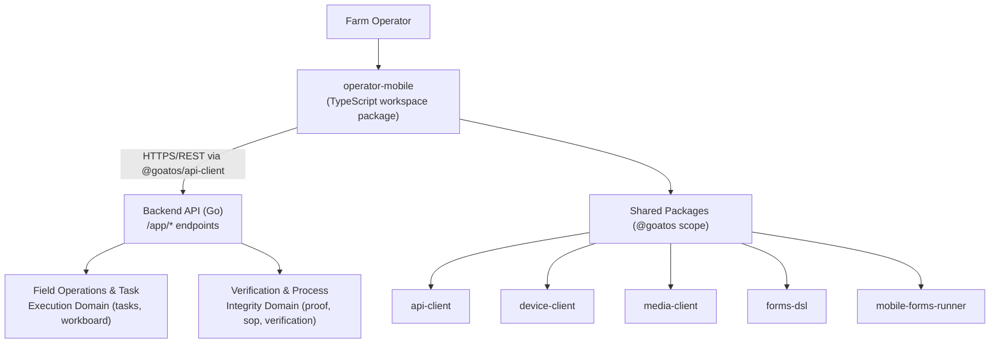
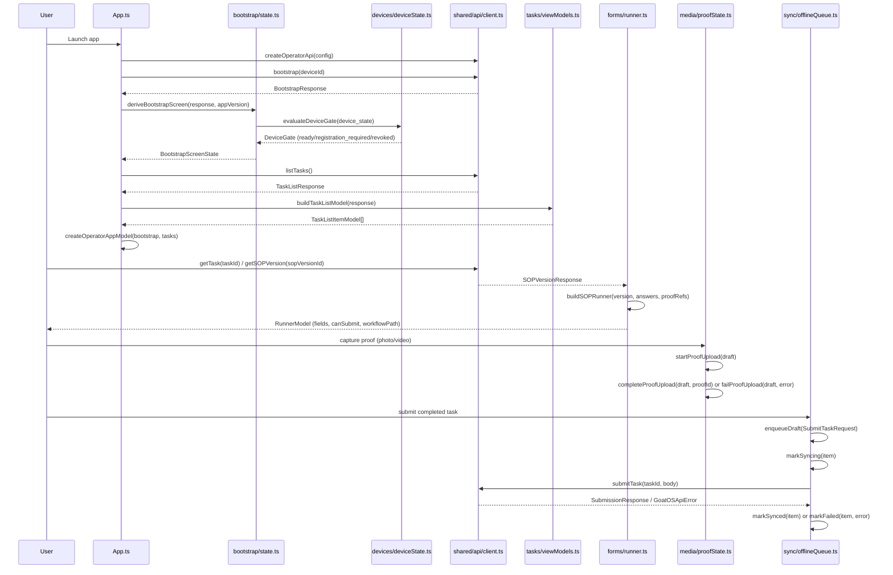

I now have sufficient detail to produce the complete documentation.

# Operator Mobile App Domain

## 1. Overview

The **Operator Mobile App Domain** encapsulates the lightweight, cross-platform mobile client (`apps/operator-mobile`) that provides field operators with an alternative, feature-scoped entry point into GoatOS's task and SOP execution workflows. It complements the native Android application (`goatos-android`) by offering a leaner, TypeScript-based experience organized around a small set of well-bounded feature modules: **bootstrap**, **devices**, **forms**, **media**, **sync**, and **tasks**.

Architecturally, this domain is best understood not as a monolithic app but as a **thin composition layer**: nearly all business logic — device gating, proof-media lifecycle, SOP form evaluation, and offline queueing — is implemented once in shared `@goatos/*` packages and simply re-exported or lightly adapted by the operator-mobile feature modules. This design maximizes code reuse across GoatOS's multiple client surfaces (web, Android, operator-mobile) while keeping the mobile app itself easy to reason about, test, and maintain.

The domain occupies a **Presentation Domain** role in the overall system architecture, sitting alongside the Admin Web Application, Android Field Operator App, and Investor Analytics Dashboard as one of the four client-facing surfaces of the GoatOS platform. It depends on the backend's `app` API family (`/app/bootstrap`, `/app/tasks`, `/app/sop-versions`) — a distinct, mobile/operator-focused subset of endpoints separate from the `admin` and `analytics` API families used by other clients.

## 2. Position in the System Architecture



Key relationships (as previously validated in system-wide research):
- **Operator Mobile → Field Operations & Task Execution Domain** — synchronizes form-based task captures with the backend `tasks`/`workboard` services (Data Sync relation, strength 7.0).
- **Operator Mobile → Shared Contracts & Developer Tooling Domain** — consumes generated API clients and the shared forms DSL/runner infrastructure (Tool Support relation).
- **Operator Mobile → Verification & Process Integrity Domain** (indirect) — SOP proof policies (`verify_before_apply`) drive the same review-gated completion pattern used across Android, feed, and health workflows.

## 3. Technology Stack & Project Configuration

The operator-mobile app is implemented as an **ES module TypeScript workspace package** scoped under `@goatos/operator-mobile`:

| Aspect | Configuration |
|---|---|
| Package type | `"type": "module"` (native ESM, `.js` extension imports required even for `.ts` source) |
| Target / Module | `ES2022` target, `NodeNext` module + resolution |
| Type strictness | `strict: true`, `noUncheckedIndexedAccess: true`, `exactOptionalPropertyTypes: true` |
| Path aliases | `@goatos/api-client`, `@goatos/forms-dsl`, `@goatos/mobile-forms-runner`, `@goatos/media-client`, `@goatos/device-client` mapped to sibling package sources under `packages/` |
| Scripts | `typecheck` (tsc `--noEmit`), `lint` (custom governance script), `test` (compile-then-run with Node's built-in test runner) |

Notably, the `tsconfig.json` `include` list pulls in the source of `forms-dsl`, `mobile-forms-runner`, `media-client`, and `device-client` directly, meaning the operator-mobile package type-checks against the **actual current source** of its shared dependencies rather than a pre-built artifact — a tight-coupling convenience appropriate for a monorepo but one that requires all packages to be checked out together.

The underlying UI rendering framework (React Native, Expo, or another cross-platform toolkit) is **not present in this layer** — the `apps/operator-mobile/src` directory inspected contains only pure business/state logic (view-model builders, state derivation functions, and an API client wrapper), with no UI component files. This confirms the architectural characterization of operator-mobile as a **logic-first, framework-agnostic core** that a native shell (not included in the inspected structure) would consume for rendering.

## 4. Feature Module Breakdown

The domain is organized into six feature directories under `src/features/`, plus a `src/shared/` layer for cross-feature concerns.

### 4.1 App Composition Root (`src/App.ts`)

The single entry point that assembles the overall client-side application model:

```typescript
export function createOperatorAppModel(input: {
  bootstrap: BootstrapResponse;
  tasks: TaskListResponse;
  appVersion: string;
}): OperatorAppModel {
  return {
    bootstrap: deriveBootstrapScreen(input.bootstrap, input.appVersion),
    tasks: buildTaskListModel(input.tasks),
  };
}
```

This function is a pure composition of two independent feature-level derivations — `deriveBootstrapScreen` (bootstrap feature) and `buildTaskListModel` (tasks feature) — producing a single `OperatorAppModel` that a UI shell can render directly. There is no framework dependency here; `App.ts` acts purely as an orchestration function, reflecting the project's broader "functional, testable transformation" convention.

### 4.2 Bootstrap Feature (`src/features/bootstrap/state.ts`)

Responsible for deriving the initial application screen state from the backend's bootstrap payload, combining three independent gating checks into a single discriminated union:

```typescript
export type BootstrapScreenState =
  | { kind: "loading" }
  | { kind: "denied"; reason: string }
  | { kind: "revoked_device"; reason: string }
  | { kind: "incompatible_app"; minVersion: string }
  | { kind: "ready"; navigation: ...; taskQueues: ... }
  | { kind: "no_tasks"; navigation: ... };
```

The `deriveBootstrapScreen` function applies checks in this precedence order:
1. **Device Gate Evaluation** — delegates to `evaluateDeviceGate` from `@goatos/device-client` to classify the device as `ready`, `registration_required`, or `revoked`.
2. **App Version Compatibility** — a locally-implemented semantic version comparator (`compareVersions`) checks the running app version against `bootstrap.app_min_supported_version`; a lower version routes to `incompatible_app`.
3. **Task Queue Availability** — if `bootstrap.task_queue_descriptors` is empty, the screen resolves to `no_tasks` rather than `ready`.

This mirrors the Android app's own bootstrap state machine (Loading/Ready/Error) at a conceptual level, but is expressed here as a pure function over typed inputs rather than a stateful ViewModel — consistent with operator-mobile's lighter-weight design philosophy.

### 4.3 Devices Feature (`src/features/devices/deviceState.ts`)

This module is a **direct re-export** of `evaluateDeviceGate` from `@goatos/device-client`:

```typescript
import { evaluateDeviceGate } from "../../../../../packages/device-client/src/index.js";
export { evaluateDeviceGate };
```

`evaluateDeviceGate` (defined in the shared package) evaluates a `DeviceRegistrationInput`-derived state into one of three `DeviceGate` outcomes (`ready`, `registration_required`, `revoked`), based on `required`, `status`, and `reason` fields on the bootstrap-supplied device state. Because device registration/revocation state is a security-sensitive concern shared across all GoatOS mobile surfaces, keeping this logic in a single shared package (rather than duplicating it per client) ensures consistent device-trust enforcement between operator-mobile and any other consuming client.

### 4.4 Forms Feature (`src/features/forms/runner.ts`)

Wraps the shared `mobile-forms-runner` package to translate a backend-supplied SOP form definition and current answer/proof state into a renderable `RunnerModel`:

```typescript
export function buildSOPRunner(version, answers, proofRefs) {
  return buildRunnerModel(
    version.form_dsl as SOPFormDSL,
    version.proof_policy as { required?: boolean; verify_before_apply?: boolean },
    answers,
    proofRefs,
  );
}
```

The heavy lifting occurs in `@goatos/mobile-forms-runner`, which in turn depends on `@goatos/forms-dsl` (the SOP form domain language). Together these two shared packages implement:

- **Field-to-component mapping** — `mobile-forms-runner`'s `componentFor()` maps abstract SOP field types (`text`, `number`, `date_time`, `select`, `multiselect`, `goat_lookup`, `animal_id_scan`, `location_picker`, `photo_proof`, `video_proof`) to concrete UI component identifiers (`TextInput`, `NumberInput`, `GoatLookup`, `AnimalIDScan`, `PhotoProof`, `VideoProof`, etc.). This is a crucial abstraction: `animal_id_scan` maps to an `AnimalIDScan` UI component whose actual RFID/scan implementation would be supplied by the native shell, while the runner core stays platform-agnostic.
- **Form evaluation** — `forms-dsl`'s `evaluateForm()` computes per-field validation state (`required`, `blocked`, `message`), enforces proof-required rules (rejecting submission unless at least one proof reference has `upload_state: "completed"`), and computes a `final_state` of `accepted`, `needs_review`, or `blocked` — where `needs_review` is triggered specifically when the SOP's `proof_policy.verify_before_apply` flag is set, pushing the submission into a `proof_verification` step in the returned `workflow_path`.

This directly implements the platform-wide **Verification & Process Integrity gatekeeper pattern**: SOP-driven forms on operator-mobile route flagged submissions into review before they are considered complete, exactly mirroring the same pattern enforced on the Android app and backend `verification` domain.

### 4.5 Media Feature (`src/features/media/proofState.ts`)

A thin adapter over `@goatos/media-client`'s proof-upload lifecycle functions:

```typescript
export function startProofUpload(draft: LocalProofDraft) { return markUploadStarted(draft); }
export function completeProofUpload(draft, proofId) { return markUploadCompleted(draft, proofId); }
export function failProofUpload(draft, error) { return markUploadFailed(draft, error); }
```

The underlying `LocalProofDraft` type models a client-local proof capture (photo/video/attachment) tied to a `subject_type` (`batch`, `goat`, `shed`, `task`, `other`) with an `upload_state` state machine (`pending → uploading → completed | failed`). Each transition function returns a **new immutable object** rather than mutating in place — consistent with the project-wide preference for pure, testable state transitions over mutable class-based models. This proof-draft abstraction becomes the `ProofReference` consumed by the forms runner's `evaluateForm()` to satisfy proof-required SOP rules.

### 4.6 Sync Feature (`src/features/sync/offlineQueue.ts`)

Implements the **offline-first submission queue** — the local-side counterpart to the backend's transactional outbox pattern:

```typescript
export type QueueItem = {
  queue_id: string;
  task_id: string;
  body: SubmitTaskRequest;
  status: "draft" | "queued" | "syncing" | "synced" | "failed";
  attempt_count: number;
  last_error?: string;
};
```

Key behaviors:
- **`enqueueDraft`** — deduplicates by `body.idempotency_key` before appending a new item in `queued` status, preventing duplicate task submissions from re-queued drafts.
- **`markSyncing`** — transitions an item to `syncing` and increments `attempt_count`, clearing any prior `last_error`.
- **`markSynced`** — finalizes an item as `synced`, clearing error state.
- **`markFailed`** — records the failure reason in `last_error` while retaining the item in the queue (implicitly available for retry).

Every function returns a **new `QueueItem`/array** rather than mutating existing state, which — combined with the discriminated `status` field — makes the queue's state machine trivially unit-testable and safe to reason about under concurrent sync attempts. This mirrors, at a much smaller scale, the Android app's `OutboxDatabase` and the backend's transactional outbox pattern, extending the "capture locally, sync when connected" reliability guarantee down to this lighter mobile surface.

### 4.7 Tasks Feature (`src/features/tasks/viewModels.ts`)

Transforms raw API responses into UI-ready view models:

```typescript
export function buildTaskListModel(response: TaskListResponse): TaskListItemModel[] {
  return response.items.map((task) => ({
    taskId: task.task_id,
    title: task.title,
    subtitle: `${task.sop_code} · ${task.scope_type}`,
    state: task.state,
    priority: task.priority,
    blocked: task.state === "accepted" || task.state === "rejected" || task.state === "canceled",
  }));
}

export function buildTaskDetailModel(response: TaskResponse) {
  return {
    taskId: response.task.task_id,
    title: response.task.title,
    state: response.task.state,
    sopVersionId: response.task.sop_version_id,
    sopTitle: response.sop_version?.form_dsl?.title ?? response.task.sop_code,
    canExecute: ["assigned", "in_progress", "rework_requested"].includes(response.task.state),
    proofReviewRequired: Boolean(response.sop_version?.proof_policy?.verify_before_apply),
    submissionCount: response.submissions?.length ?? 0,
  };
}
```

`buildTaskListModel` powers the task list screen, flagging tasks in terminal states (`accepted`, `rejected`, `canceled`) as `blocked` (i.e., no further action expected from the operator). `buildTaskDetailModel` powers the task detail/execution screen, computing `canExecute` from an explicit whitelist of actionable states (`assigned`, `in_progress`, `rework_requested`) — notably including `rework_requested`, which allows an operator to re-attempt a task that was previously kicked back by verification review. It also surfaces `proofReviewRequired` directly from the SOP version's `proof_policy`, letting the UI pre-emptively signal to the operator that their submission will be gated by a review step.

## 5. Shared API Layer (`src/shared/api/client.ts`)

This module is the **single source of truth** for all operator-mobile API contract types and the sole gateway through which the app talks to the backend. It re-exports strongly-typed schema aliases sourced from the generated OpenAPI client:

```typescript
export type BootstrapResponse = AppApiComponents["schemas"]["BootstrapResponse"];
export type TaskListResponse = AppApiComponents["schemas"]["TaskListResponse"];
export type TaskResponse = AppApiComponents["schemas"]["TaskResponse"];
export type SOPVersionResponse = AppApiComponents["schemas"]["SOPVersionResponse"];
export type SubmitTaskRequest = AppApiComponents["schemas"]["SubmitTaskRequest"];
export type SubmissionResponse = AppApiComponents["schemas"]["SubmissionResponse"];
```

It exposes a small, purpose-built `createOperatorApi(config)` factory wrapping `createAppApiClient` from `@goatos/api-client`:

| Method | Endpoint | Purpose |
|---|---|---|
| `bootstrap(deviceId?)` | `GET /app/bootstrap` | Fetches device gate state, minimum supported app version, navigation manifest, and task queue descriptors |
| `listTasks(state?)` | `GET /app/tasks` | Fetches the operator's task list, optionally filtered by state |
| `getTask(taskId)` | `GET /app/tasks/{taskId}` | Fetches full task detail including linked SOP version and prior submissions |
| `getSOPVersion(sopVersionId)` | `GET /app/sop-versions/{sopVersionId}` | Fetches the SOP form DSL and proof policy for a given version |
| `submitTask(taskId, body)` | `POST /app/tasks/{taskId}/submissions` | Submits a completed task (answers + proof references) for processing |

All requests are issued with `cache: "no-store"`, ensuring the operator always sees live server state rather than a stale cached response — an important property for a field app where task state changes frequently (assignment, rework, completion) and staleness could lead an operator to act on outdated instructions.

This shared client is generic across three **API families** defined in `@goatos/api-client` — `app`, `admin`, and `analytics` — of which operator-mobile exclusively consumes the **`app`** family (`AppApiPaths`/`AppApiComponents`), reflecting its identity as an operator-scoped, task-execution-focused client distinct from the admin-web dashboard (which additionally uses the `admin` and `analytics` families).

### 5.1 Underlying Generic Client (`@goatos/api-client`)

The shared `createGoatOSClient<Paths>()` factory (consumed indirectly via `createAppApiClient`) provides:
- **Typed path/response inference** driven by the generated OpenAPI `paths`/`components` types.
- **Repeated-parameter query serialization** — array-valued query parameters are serialized using `append()` per element (producing `?feed_item=Hybrid&feed_item=COFS`) rather than a comma-joined single value, matching the OpenAPI contract's `style: form, explode: true` convention and avoiding a documented pitfall where Go's `r.URL.Query()` would otherwise silently fail to match comma-joined values.
- **Tenant and auth context propagation** — `tenantId` is attached via a `TENANT_CONTEXT_HEADER`, and `bearerToken` via a standard `Authorization: Bearer` header.
- **Pluggable trace-context propagation** — an optional `getTraceHeaders()` hook lets the caller attach W3C trace-context headers (e.g., `traceparent`), keeping the client decoupled from any specific tracing SDK.
- **Typed error handling** — non-2xx (excluding 304) responses are thrown as a `GoatOSApiError` carrying the HTTP status and parsed response body.

## 6. Architectural Governance: The Boundary-Enforcing Lint Script

A distinctive engineering control in this domain is `scripts/lint.mjs`, a custom Node.js script run as part of the package's own `lint` script (invoked outside any general-purpose linter):

```javascript
const forbidden = ["firebase", "firestore", "bigquery", "gcs", "slack"];
// ...recursively walk src/, scanning every .ts file's lowercase text for these substrings
// and throw immediately if any forbidden marker is present.
```

This script recursively scans every `.ts` file under `src/` and fails the build if any file contains a string reference to a backend/cloud SDK name (`firebase`, `firestore`, `bigquery`, `gcs`, `slack`). The intent is explicit and important: **operator-mobile must never talk directly to Firebase, Firestore, BigQuery, GCS, or Slack** — all such integrations must be mediated through the shared `@goatos/api-client` abstraction and the backend's `/app/*` API surface. This is a lightweight but effective form of **architectural boundary enforcement**, preventing accidental coupling between this client and cloud infrastructure that should remain a backend-only concern, and keeping the client portable and testable without cloud credentials.

## 7. Runtime Interaction & Data Flow



The end-to-end flow: on launch, `App.ts` calls `bootstrap()` and `listTasks()` through the shared API client, feeding results into `deriveBootstrapScreen` and `buildTaskListModel` to produce an `OperatorAppModel`. When an operator opens a task, `getTask`/`getSOPVersion` retrieve the SOP form definition, which `buildSOPRunner` evaluates into a `RunnerModel` describing which fields to render and whether the form can currently be submitted. Proof capture (photo/video) is tracked through the `media` feature's upload-state transitions, and on submission the `sync` feature enqueues the request into the local offline queue, attempting delivery via `submitTask` and updating queue status (`synced`/`failed`) based on the outcome.

## 8. Design Patterns & Conventions

| Pattern | Application in this Domain |
|---|---|
| **Delegation / thin adapter layers** | `deviceState.ts`, `proofState.ts`, and `runner.ts` contain little to no original logic; they exist to provide a stable, app-local import surface over shared packages, decoupling operator-mobile's internal module layout from the shared package layout. |
| **Discriminated union state modeling** | `BootstrapScreenState`, `DeviceGate`, `QueueItem.status`, and `LocalProofDraft.upload_state` are all modeled as tagged unions, enabling exhaustive, type-safe branching in consuming UI code. |
| **Pure factory/builder functions** | `createOperatorAppModel`, `buildTaskListModel`, `buildTaskDetailModel`, `buildSOPRunner`, `buildRunnerModel`, `deriveBootstrapScreen`, `evaluateDeviceGate`, and the queue transition functions are all side-effect-free functions taking explicit inputs and returning new values — no classes, no hidden mutable state, no framework lifecycle dependency. |
| **Immutable state transitions** | Every queue and proof-draft transition function returns a new object (via spread) rather than mutating its argument, simplifying reasoning about concurrent sync/upload attempts and making unit testing straightforward. |
| **Contract-first typing** | All request/response shapes are sourced from `AppApiComponents["schemas"][...]`, generated from the platform's OpenAPI contracts (`contracts/openapi`), ensuring the mobile client's type surface tracks the backend contract automatically rather than through hand-maintained interfaces. |
| **Build-time architectural governance** | The custom `lint.mjs` script enforces a hard boundary against direct cloud/backend SDK usage, complementing type-level and structural conventions with an explicit, automated policy check. |

## 9. Relationship to Other Bounded Contexts

- **Field Operations & Task Execution Domain** (`backend/internal/tasks`, `workboard`): operator-mobile's `/app/tasks` and `/app/tasks/{id}/submissions` calls are the direct client-side counterpart to this domain's task lifecycle management; `buildTaskDetailModel`'s `canExecute` logic reflects the same task-state machine (`assigned`, `in_progress`, `rework_requested`) enforced server-side.
- **Verification & Process Integrity Domain** (`backend/internal/verification`, `sop`, `proof`): the `proof_policy.verify_before_apply` flag consumed by the forms runner and surfaced via `proofReviewRequired` is the client-visible reflection of this domain's mandatory review gate; SOP form DSL (`SOPFormDSL`) itself is authored and versioned server-side under the `sop`/`sopbridge` modules.
- **Shared Contracts & Developer Tooling Domain** (`packages/`, `contracts/`): operator-mobile is arguably the **purest consumer** of this domain's shared packages — `api-client`, `device-client`, `media-client`, `forms-dsl`, and `mobile-forms-runner` are used almost verbatim, with operator-mobile providing minimal additional logic of its own. Any change to these shared packages has a direct and immediate blast radius on this app.
- **Android Field Operator App Domain**: operator-mobile is a conceptual sibling to the native Android app, sharing the same `forms-dsl`/`mobile-forms-runner` and `media-client`/`device-client` packages, and implementing an equivalent (though simpler) offline-queue and proof-capture pattern — evidence that GoatOS is deliberately standardizing field-capture behavior across multiple mobile surfaces rather than maintaining divergent implementations.

## 10. Architectural Observations

- **Minimal, high-leverage codebase**: The entire feature/business-logic layer of operator-mobile spans just eight small TypeScript files. This reflects a deliberate strategy of maximizing reuse through shared packages rather than duplicating logic already proven on the Android app or backend — an efficient design for a "lighter alternative" client surface, but one whose correctness depends heavily on the shared packages remaining stable and well-tested.
- **UI-framework agnosticism**: No UI rendering code was found in this layer; the inspected `src/` tree is entirely composed of pure state/model derivation logic. This suggests operator-mobile's rendering shell (whatever framework it uses — React Native, Expo, or a native wrapper) is either not yet implemented in this snapshot or lives outside `src/`, and is a good candidate for follow-up documentation once confirmed.
- **Consistency with platform-wide patterns**: The offline queue (`offlineQueue.ts`), proof-upload lifecycle (`proofState.ts`), and verification-gated form evaluation (`runner.ts` + `forms-dsl`) all mirror patterns already established in the Android app and backend (`outbox`, `proof`, `verification` modules), demonstrating strong architectural discipline in extending the same reliability and data-quality guarantees across every client surface rather than reinventing them per platform.
- **Effective boundary enforcement at low cost**: The `lint.mjs` script is a simple, easily auditable ~30-line script, yet it provides a meaningful architectural safeguard against a common failure mode in growing mobile codebases — ad-hoc, undocumented coupling to cloud SDKs that bypass the backend's API layer and its accompanying auth, tenancy, and observability guarantees.
- **Contract-first coupling to the backend's `app` API family**: Because all types flow from generated OpenAPI schemas, any backend contract change to `/app/bootstrap`, `/app/tasks`, `/app/sop-versions`, or `/app/tasks/{id}/submissions` will surface immediately as TypeScript type errors during `typecheck`, giving strong compile-time protection against contract drift — a valuable property given the domain's reliance on a shared, centrally generated client rather than hand-written request/response typing.