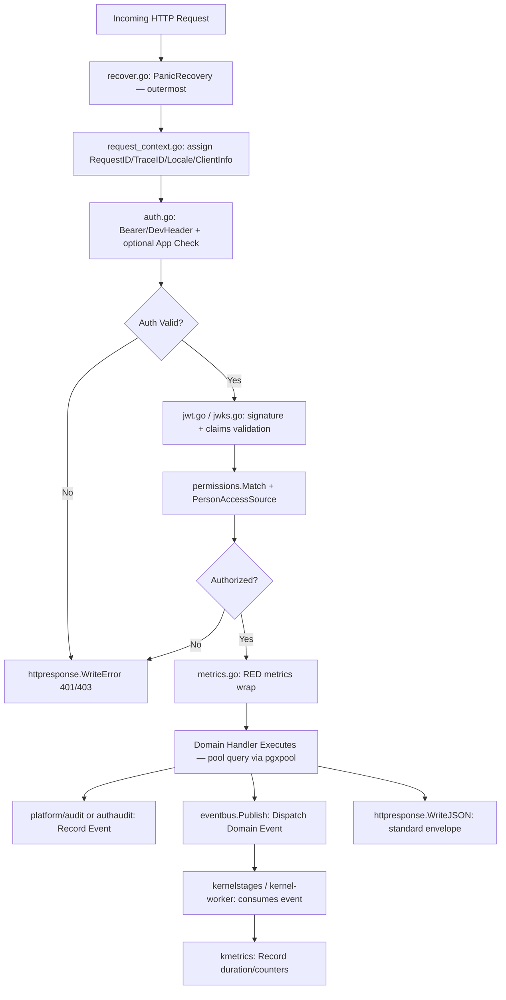
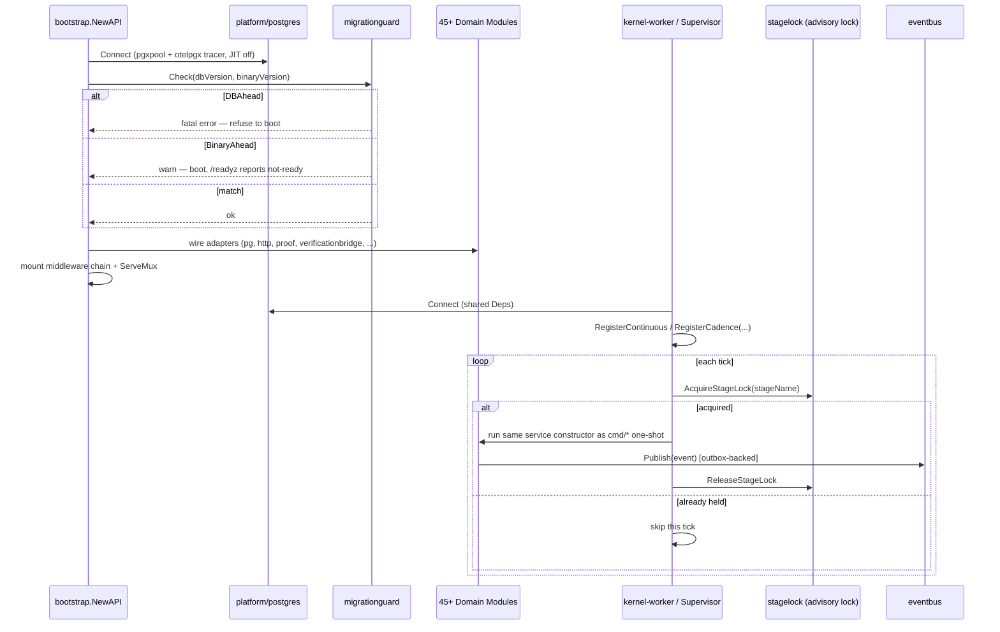

Now I have everything necessary to write a thorough, technically-grounded documentation for the Platform Infrastructure Domain.

---

# Platform Infrastructure Domain — Technical Documentation

## 1. Overview

The **Platform Infrastructure Domain** is GoatOS's shared cross-cutting foundation — the library layer that every one of the backend's 45+ bounded-context modules (identity, health, feed, vaccination, sales, workforce, verification, ceoai, etc.) depends on for authentication, request lifecycle handling, observability, database connectivity, event dispatch, and application bootstrap. Unlike the other domains, Platform Infrastructure owns no business data of its own; its value is entirely structural — it guarantees that every module behaves consistently with respect to security, tracing, error reporting, and operational safety, so that the sheer number of bounded contexts in this modular monolith does not translate into 45 different ways of handling a bearer token or a database timeout.

Structurally, the domain spans four physical locations in the codebase, each with a distinct responsibility:

| Location | Responsibility |
|---|---|
| `backend/internal/platform/*` | Reusable Go libraries: auth, HTTP middleware, observability, Postgres access, event bus, audit, task queue, localization, misc utilities |
| `backend/internal/bootstrap/*` | Composition root — wires every domain module's adapters into the single `cmd/api` HTTP server |
| `backend/internal/kernelstages/*` | Thin `StageRunner` wrappers that let the `kernel-worker` binary run scheduled/background work that previously lived in dozens of independent one-shot Cloud Run Jobs |
| `backend/internal/appconfig/*` | A small bounded-context-style module (domain/app/adapters) that serves the mobile "backend-driven config" bundle — included here because it is a platform capability (remote config), not a farm business capability |
| `backend/migrations/`, `backend/cmd/migrate`, `backend/cmd/seed-*` | Schema migration execution and seed/state provisioning tooling shared by every environment |

The domain's guiding architectural principle, visible throughout the code, is **"fail fast and visibly rather than degrade silently in a way nobody notices"** — advisory locks that must be explicitly released, migration-drift guards that block the API from booting against the wrong schema, panic recovery that never swallows a trace ID, and rate limiters that bound memory rather than grow unbounded. Comments throughout the code frequently cite real production incidents this guard exists to prevent (e.g., the migration-drift guard's docstring narrates the exact incident that motivated it), which is a strong signal of a codebase that has matured under real operational pressure.

---

## 2. Sub-Module Breakdown

### 2.1 Authentication & Authorization (`platform/auth`, `platform/authallow`, `platform/httpmiddleware/auth.go`)

Two independent token-verification strategies coexist behind a common `TokenVerifier` interface (`Verify(token string) (Claims, error)`):

- **`auth.HS256Verifier`** (`jwt.go`) — a self-contained symmetric JWT implementation (no external JWT library) used to mint and verify short-lived tokens signed with a shared secret (`GOATOS_AUTH_HS256_SECRET`, enforced ≥32 bytes via `ErrWeakSecret`). It supports issuer/audience pinning, a configurable `MaxTTL` (default 24h), clock injection for testability, and maps non-UUID external subjects to a stable internal actor ID via `StableSubjectID`.
- **`auth.JWKSVerifier`** (`jwks.go`) — verifies RS256/ES256 tokens against a remote JWKS endpoint (e.g., Firebase's `securetoken` issuer or `firebaseappcheck.googleapis.com`), with an in-memory key cache (`CacheTTL`, default 5 min), configurable clock skew (default 60s), and an explicit allow-list of algorithms — HS256 and `alg=none` are hard-rejected regardless of configuration, closing the classic JWT algorithm-confusion vulnerability at the type level.

Both verifiers funnel into the **same claims-validation routine** (`rawClaims.validateWithSkew`), which the code deliberately keeps unified so that HS256 (used for dev/local/HS-mode deployments) and JWKS (the production path, `AuthModeJWKS`) can never diverge in how they interpret `exp`, `nbf`, `aud`, or tenant/subject shape.

`httpmiddleware.AuthMiddleware` (`auth.go`, ~35KB — the largest single file in the domain) is the request-time enforcement point. It:

- Supports two modes: `bearer` (production) and `dev_headers` (explicitly gated to non-production environments via `DevHeadersEnvironmentAllowed`, and mutually exclusive with App Check).
- Optionally enforces **Firebase App Check** (`AppCheckModeOff` / `Monitor` / `Enforce`) as a second, independent token check via the `X-Firebase-AppCheck` header, allowing App Check to be rolled out in "monitor" mode before hard enforcement.
- Resolves authorization through `permissions.Match(method, path)` and a pluggable `PersonAccessSource`, which — per an explicit 2026-08-24 maintainer decision documented in code — prefers **per-person module access** over role-based access, falling back to the role path only when per-person access is not yet provisioned. Critically, a resolution **error** fails closed (deny), while "not provisioned" falls back open to roles — the code comments explain this asymmetry is deliberate: an error must never accidentally hand back authority a person's access was revoked to remove.
- Consults an **email allow-list** (`authallow.EmailSet`) that can be extended dynamically from a DB-backed source (`DynamicAllowedEmails`) unioned with the static `GOATOS_AUTH_ALLOWED_EMAILS` list.

### 2.2 HTTP Middleware Pipeline (`platform/httpmiddleware`)

The middleware chain, assembled in `bootstrap.NewAPI`, is composed of independently testable layers wired in a specific, load-bearing order:

1. **`PanicRecovery`** (`recover.go`) — the outermost layer. It must wrap everything, including `RequestContext` and auth, because a panic inside those layers would otherwise escape uncaught. It uses a documented fallback chain to recover a trace/request ID even when the panic occurs before `RequestContext` has populated the context: context value → echoed response `traceparent` header → echoed response `X-Request-ID` → raw inbound header. On recovery it logs the full stack trace and, if no response bytes were written yet, emits a standard JSON `internal_error` envelope carrying the trace ID for support correlation.
2. **`RequestContext`** (`request_context.go`) — generates or propagates `X-Request-ID` and W3C `traceparent`, extracts locale (`X-GoatOS-Locale` / `Accept-Language`), tenant/actor placeholders (dev-only), and structured client metadata (app version, build type, device model, platform, OS/SDK version) from custom `X-GoatOS-*` headers. It wraps the `ResponseWriter` to capture the final status code for the completion log line (`http_request`), and implements `Hijack`/`Flush`/`Unwrap` so it composes transparently with streaming handlers (used by CEO AI's SSE stream).
3. **`AuthMiddleware.Wrap`** — authenticates and authorizes, described above. Public health routes (`/livez`, `/readyz`) bypass it.
4. **`Metrics`** (`metrics.go`) — records OpenTelemetry RED metrics (`http.server.request.duration`, `http.server.requests`, `http.server.active_requests`) labeled by a **route template**, not raw path, resolved via `(*http.ServeMux).Handler` so cardinality stays bounded per the project's observability cardinality guard.

`httpresponse.WriteError` is the single choke point through which every handler's error path flows. It applies a deliberate logging policy: 5xx logs at `ERROR` with the underlying cause; 4xx logs at `WARN` with the envelope's machine-readable `code` (so a `409` can be distinguished as "shed already scheduled" vs. "operator outside park scope" from logs alone, without per-handler logging boilerplate); `401` is explicitly excluded from this logging because auth failures are already logged in full by the auth middleware, avoiding a duplicate WARN per bot/scanner probe.

### 2.3 Observability (`platform/observability`, `platform/kmetrics`, `platform/tracecontext`)

`observability.New` is declared the **single canonical constructor** for every `*slog.Logger` in the codebase — a project-level rule enforced by a CI guard script (`tools/agent-hooks/check-boundaries.sh`) that forbids calling `slog.New` directly outside this package. It stamps `service`, `version`, and `env` on every log line, resolves log level and sink (`stdout_json`, `otlp`, `gcm`) from environment variables, and always emits logs as structured JSON to stdout regardless of sink — the OTLP/GCM sink only additionally activates a real OTLP exporter for **metrics and traces** via `SetupTelemetry` (`telemetry.go`), never logs. This split (logs→stdout, metrics/traces→OTLP) is a deliberate design decision documented directly in the package comment.

`kmetrics` provides pre-registered, typed OpenTelemetry instruments for every kernel subsystem — `outbox.go`, `consumer.go`, `sweeper.go`, `notify.go`, `cloudtasks.go`, `analytics.go`, `herdsignalspartitionmaintenance.go` — each exposing a small `RecordX` API (e.g., `RecordOutboxPublish`, `RecordOutboxBatch`, `RecordOutboxFailed`) rather than exposing raw OTel primitives to callers. Instruments are created **eagerly** against the OTel global `Meter`, exploiting the OTel API's delegating-instrument behavior: instruments created before `SetupTelemetry` installs a real `MeterProvider` still start reporting correctly once it is installed, and behave as safe no-ops when telemetry is never enabled (local/dev). A representative example, `outbox.go`, shows the design's attention to failure-mode observability: it tracks not just success/retry/dead-letter outcomes but a dedicated `failed` counter for the "permanently undeliverable, never retried, never dead-lettered" terminal state — added, per the code comment, after 12 weighing events silently reached exactly that unobserved state in production.

`platform/postgres/metrics.go` registers four async gauges (`db.client.connections.usage/idle/max/pending`) directly from `pgxpool.Stat()`, giving connection-pool pressure visibility without any polling loop of its own.

### 2.4 Database Access (`platform/postgres`, `platform/pgconv`, `platform/migrationguard`, `platform/pgtest`)

`postgres.Connect` builds a single shared `pgxpool.Pool` per process from `Config` (`DatabaseURL`, `MaxConns` default 10, `ConnectTimeout` default 5s, `QueryTimeout` default 3s — all overridable via `GOATOS_PG_*` env vars). Two OLTP-specific tuning decisions are baked in and documented: **JIT is disabled per-connection** (`configureOLTPRuntime`) because Postgres's JIT compiler can add multi-second latency spikes compiling large statements (the canonical Calendar query is called out specifically) that are irrelevant for a workload of many small, low-latency queries; and **`otelpgx.NewTracer()`** is attached to every connection, giving per-query span/duration/error telemetry for free once `SetupTelemetry` installs a real provider.

`migrationguard` is one of the domain's most safety-critical components. It exists to prevent a **specific documented incident**: a long-running `cmd/api` process kept serving traffic after migrations dropped tables it still queried, producing opaque 500s with no signal that the real cause was a stale binary rather than a code bug. `migrationguard.Check(dbVersion, binaryVersion)` compares the highest migration the database has applied against the ceiling this binary's embedded migration set knows about, and reports one of two asymmetric drift directions:

- **`DBAhead`** (database migrated further than the binary knows) — **fatal**; `bootstrap.NewAPI` refuses to boot the API process at all.
- **`BinaryAhead`** (binary expects migrations not yet applied, including a never-migrated DB) — **transient**; the API boots but `/readyz` reports not-ready until migrations catch up, avoiding crash-loops during normal deploy sequencing (migrate → deploy → readiness recovers without a restart).

`backend/cmd/migrate` is the standalone migration runner: it computes a SHA-256 checksum per migration file, supports `-dry-run`, and gates a `-allow-local-checksum-drift` escape hatch strictly to `GOATOS_ENV=local` against a loopback host, so historical checksum drift can never silently pass in staging/production. It also calls `localtarget.ValidateStagingCloudSQLDatabaseTarget` / `ValidateLocalDatabaseTarget` before connecting — an explicit safety check that the `DATABASE_URL` actually points at the expected environment's database before running irreversible DDL.

### 2.5 Event Bus (`platform/eventbus`)

`eventbus` is the **transport-agnostic dispatch seam** behind the domain-event-driven state machines used across the kernel (feed-direction generation, cancellation, booster scheduling, etc.). It defines a minimal `Bus` interface (`Subscribe`, `Publish`) and ships one concrete implementation today — `InProcessBus`, a synchronous fan-out dispatcher used for local/dev in-process delivery. The design explicitly anticipates a second, Pub/Sub-backed implementation of the same interface for deployed environments, so handler code (which must be **idempotent**, since delivery is at-least-once by contract) never needs to change based on transport. A `PermanentError` wrapper lets a handler mark a failure as non-retryable, distinguishing "retry me" from "give up" failures without a bespoke error taxonomy per handler; `IsPermanentError` correctly walks `errors.Join` trees so a batch of joined handler errors is only considered permanent if every constituent error is. `envelope.go` decodes the shared cross-service domain-event JSON envelope (`event_id`, `event_type`, `aggregate_id`, `payload`, `visibility_scope`) into the bus's internal `Event` shape, with fallback values so older payload versions that omit newer fields still resolve sensibly.

### 2.6 Worker Orchestration (`platform/worker`)

`worker.Supervisor` is the runtime engine behind the `kernel-worker` binary, and it directly replaces what used to be dozens of independently scheduled Cloud Run Jobs. It organizes work into **cadence classes**:

- **Continuous stages** (`RegisterContinuous`) — long-running, no forced timeout (e.g., the Pub/Sub domain-event consumer), left running until process shutdown cancels their context.
- **Cadence stages** (`RegisterCadence` / `RegisterCadenceWithTimeout`) — run on a fixed interval, each on its **own goroutine and own advisory lock**, so a slow stage (e.g., outbox relay) cannot starve a sibling on the same clock (e.g., notification dispatch) — a scenario the code calls out by ID (`KERN-REV-05A`) as a fixed regression.

Per-run stage timeouts are derived automatically from the cadence interval via `defaultStageTimeout`, capped at 90% of the interval, guaranteeing a wedged stage always releases its advisory lock with headroom before the next tick — preventing the classic "stuck job blocks all future runs forever" failure mode. `stagelock.go` implements the underlying mutual-exclusion primitive: a **session-level Postgres advisory lock** (`pg_try_advisory_lock(hashtext(...))`) acquired on a dedicated connection held out of the pool for the stage's duration, with the lock key being a pure, stable function of the stage name (not a registration-order-dependent salt) — meaning any two `kernel-worker` instances of *any* build/version compute the identical lock key for the same stage, which is what makes cross-instance mutual exclusion safe during a rolling deployment. The code explicitly documents the release-order hazard this exists to prevent: `pgxpool` does not reset session state on `Release()`, so failing to issue an explicit `pg_advisory_unlock` before returning the connection would leak the lock onto a pooled connection and silently corrupt future lock attempts.

`worker.HealthServer` exposes `/livez` and `/readyz` purely to satisfy Cloud Run's requirement that a **service** (not a job) bind a port and answer health checks, even though the kernel worker's actual job is a background loop with no request surface of its own. `/readyz` additionally pings the database with a bounded 2s timeout and flips to `503` during graceful shutdown (`BeginDraining`) so Cloud Run stops routing to a draining instance before the process actually exits.

### 2.7 Bootstrap & Kernel Stages (`bootstrap`, `kernelstages`)

`bootstrap/api.go` (90KB — the largest wiring file in the repository) is the **composition root** for the entire backend: `bootstrap.NewAPI(ctx, cfg, log)` constructs the shared Postgres pool, runs the migration-drift guard, builds every one of the 45+ domain modules' repositories/services/HTTP handlers, and assembles them onto a single `http.ServeMux`. Every domain module follows the identical import pattern (`<domain>pg`, `<domain>app`, `<domain>http`), which is what keeps this file navigable despite its size. `bootstrap/ceoai_readers.go` is a dedicated 23KB sibling file that specifically wires the CEO AI module's read-only tool adapters, kept separate from the main wiring file given the CEO AI domain's own internal complexity.

`kernelstages` is explicitly documented as **not reimplementing business logic** — each file (`outbox_relay.go`, `notification_dispatcher.go`, `obligation_sweeper.go`, `pc_care_kernel.go`, `weighing_kernel.go`, `reminder_cadence.go`, `verification_sampling.go`, `domain_consumer.go`, etc.) is a thin `StageRunner` adapter that constructs the same domain-module service the equivalent one-shot `backend/cmd/*` binary would call, and invokes the same method. The one-shot commands are deliberately **retained** for manual/emergency repair even after their scheduled responsibilities move into the kernel worker — a pragmatic operational safety net. `deps.go` defines the shared `Deps{Pool, PgCfg, Logger}` struct injected into every stage constructor, plus small typed env-var helpers (`intEnv`, `boolEnv`, `durationEnv`, `envTruthy`) used consistently across stage configuration.

`cmd/kernel-worker/main.go` demonstrates the practical wiring: it requires `GOATOS_TENANT_ID` to be explicitly set (refusing to start rather than silently operating against a placeholder tenant), builds a shared outbox publisher and envelope validator once, and gates stage registration behind a `GOATOS_WORKER_STAGES_ENABLED`-style flag (`stageShadowEnabled`) that lets the worker deploy in a health-check-only "shadow" mode while legacy Cloud Run Jobs are still the system of record — a safe, staged migration path rather than a big-bang cutover.

### 2.8 Application Configuration (`appconfig`)

`appconfig` is architecturally a miniature bounded context (its own `domain/app/adapters/http` split) that serves the Android/mobile **"backend-driven config" / live-config bundle** at `GET /app/config`. `app/service.go`'s `ConfigFromEnv` reads `GOATOS_APP_CONFIG_*` overrides and **clamps every value** to a hardcoded safe `[min, max]` range (e.g., page size 10–200, sync backoff 250ms–30s) — the client is guaranteed to never receive an unbounded operational knob, regardless of misconfiguration. `Compile` assembles a `Response` containing feature flags, `ClientRuntimeConfig`, and a `PolicyRevision` (a doc-name echo, deliberately never a raw business threshold), stamping a SHA-256-derived content-hash `revision`/`ETag` so the mobile client's polling loop can cheaply short-circuit to a `304 Not Modified` via `If-None-Match` when nothing has changed. This mirrors the same hash-based conditional-GET pattern used by `adminui`'s bootstrap compile endpoint, kept as an independently-typed Go struct per module-boundary discipline while sharing an OpenAPI component schema.

### 2.9 Migration & Seed Tooling (`backend/migrations`, `cmd/migrate`, `cmd/seed-*`)

Beyond `cmd/migrate` (above), `internal/seedrun` defines a small, deliberately pure **seed-run state machine** (`loading → generating → verified`, or `failed` on any error) that a source-backed seed command persists into a `seed_runs` table. `cmd/seed-state-check` reads the latest run for a tenant and enforces two independent gates via the pure, DB-free `seedrun.EvaluateGate` function:

- **`closeout`** mode rejects only a *known-broken* half-seed (latest state `failed`); a legacy database with no seed-run history at all is still allowed through.
- **`promotion`** mode is strictly stricter — it additionally requires at least one `verified` run to exist; a database that was seeded but never verified is refused promotion.

This state machine is a clean example of the domain's broader pattern: isolate the decision logic as a pure function (`EvaluateGate` takes no DB handle) so it is unit-testable without infrastructure, while the `main.go` wrapper only handles I/O plumbing. `cmd/seed-dev-email-grants` similarly provisions the dev-only email allow-list/grant rows consumed by `platform/authallow` and `httpmiddleware.AuthMiddleware`.

### 2.10 Supporting Utilities

A handful of small, single-purpose packages round out the domain, each solving one narrow, recurring problem rather than accumulating into a generic "utils" grab-bag:

- **`biztime`** — centralizes GoatOS's fixed operational calendar (`Asia/Kolkata`), providing `BusinessDayStart`, `BusinessDate`, and a deliberate **two-format split**: structured payload fields always stay ISO `YYYY-MM-DD` (for clients to parse), while visible copy (notification text, screen labels) uses `dd/mm/yyyy` (`FarmDateFormat`) to match the farm's own paper sheets — a UX-driven convention documented directly at the type level.
- **`localization`** — normalizes and negotiates locale tags across four supported languages (`en`, `hi`, `kn`, `te`), parsing `Accept-Language` with proper `q`-value weighting and falling back to English.
- **`csvutil`** — `SafeCell`/`WriteSafeRow` defend CSV exports (e.g., weighing campaign exports) against formula-injection: any cell beginning with `=`, `+`, `-`, or `@` is prefixed with a `'` so it can never execute as a spreadsheet formula when opened by a reviewer, while the raw text is preserved for audit fidelity.
- **`oploc`** — the single source of truth for "where is this animal/task located" (`park + shed + optional partition_label`), including a `NormalizePartition` function that mirrors, byte-for-byte, a SQL `regexp_replace` expression used elsewhere, explicitly to prevent the Go and SQL normalization logic from drifting apart.
- **`taskqueue`** — a thin, metrics-instrumented wrapper over Google Cloud Tasks (`EnqueueJSONPost`), with `SafeTaskID` sanitizing arbitrary strings into valid Cloud Tasks task-ID characters, and idempotent-collision handling (`codes.AlreadyExists` is treated as success, not error).
- **`firebaseidentity`** — a client for the Firebase Identity Toolkit / Admin-style API, supporting an emulator override (`GOATOS_FIREBASE_IDENTITY_BASE_URL`) for local development.
- **`authaudit`** — a dedicated audit trail specifically for authentication events (distinct from the general-purpose `platform/audit` recorder), with its own token-bucket `RateLimiter` (bounded to `defaultRateLimiterMaxKeys = 4096` buckets, with oldest-bucket eviction) to prevent unbounded memory growth from a flood of failed-auth attempts from many distinct keys.
- **`buildinfo`** — exposes the running binary's git SHA (ldflags-stamped `SHA`, or a `GOATOS_BUILD_SHA` env fallback), consumed by `/version` and every log line so a migration-drift error can always be traced to an exact build.

---

## 3. How Platform Infrastructure Is Consumed

Every one of the ~45 domain modules interacts with this domain in essentially the same shape, which is itself the domain's core value proposition: predictability. A typical request lifecycle looks like this:

And at the process level, `bootstrap.NewAPI` and `cmd/kernel-worker` share the same platform building blocks but assemble them into two different runtime shapes:

---

## 4. Design Principles Observed

1. **One canonical way to do each cross-cutting thing.** Logging must go through `observability.New`; database connections must go through `postgres.Connect`; JWT/JWKS validation logic is unified through a single `rawClaims.validateWithSkew` regardless of algorithm. This is enforced partly by convention and partly by a CI boundary-check script, reducing the risk that 45 independently-owned modules quietly diverge in security- or reliability-relevant behavior.
2. **Fail loud, fail early, fail in the right direction.** The migration-drift guard treats "database ahead of binary" as fatal-at-boot but "binary ahead of database" as boot-but-not-ready — an asymmetric response calibrated to two different real operational scenarios (a stale process vs. a normal deploy race).
3. **Advisory-lock and lease safety is treated as a first-class correctness concern**, not an implementation detail — `stagelock.go`'s explicit unlock-before-release discipline, and the Supervisor's per-cadence independent locks, exist specifically to prevent silent cross-instance corruption during rolling deployments.
4. **Observability instruments degrade gracefully.** Every OTel instrument constructor in `kmetrics` and `httpmiddleware/metrics.go` falls back to a nil instrument (logged via `otel.Handle`) rather than panicking, and delegating global instruments mean call sites never need to know whether telemetry is actually wired up yet.
5. **Bounded, not unbounded, everything.** Rate limiter buckets are capped and evict oldest-first; `appconfig`'s client-facing operational knobs are clamped server-side; metric labels are route templates, never raw paths or IDs — cardinality and memory growth are treated as attack surfaces, not just performance tuning.
6. **Composition over inheritance at the process level.** The same domain module services are reused, unmodified, by both the always-on `cmd/api` HTTP server (via `bootstrap`) and the scheduled `cmd/kernel-worker` (via `kernelstages`), and the legacy one-shot `cmd/*` commands remain available as an escape hatch — three different composition roots sharing one set of business services, glued together entirely by Platform Infrastructure primitives.