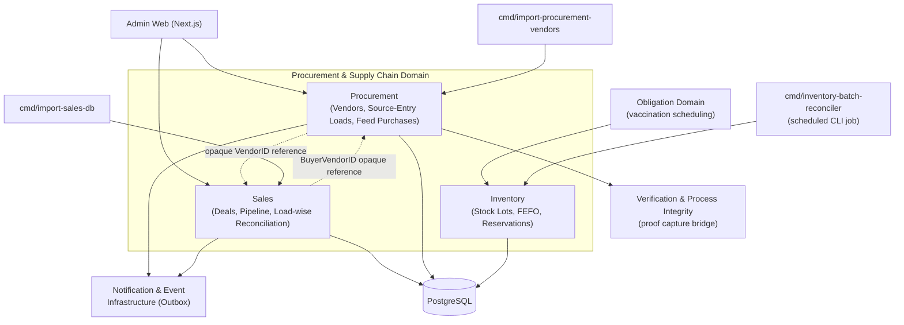
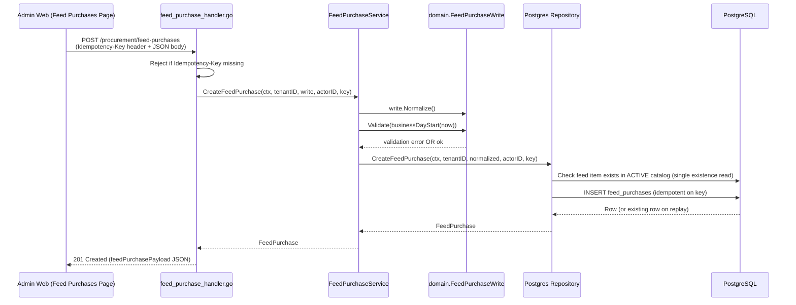
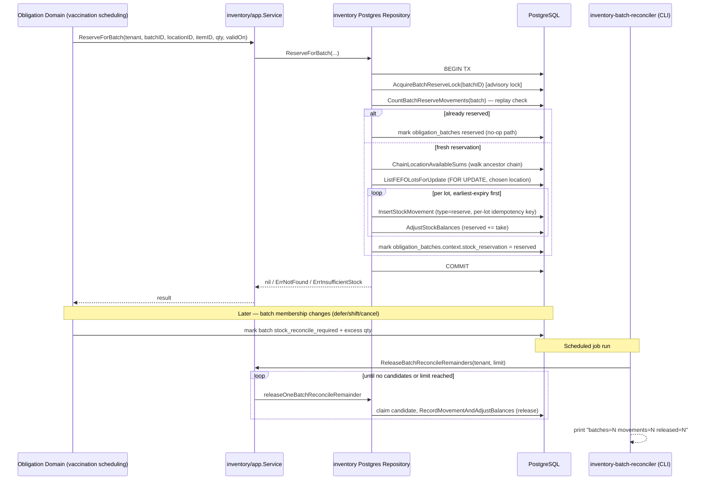
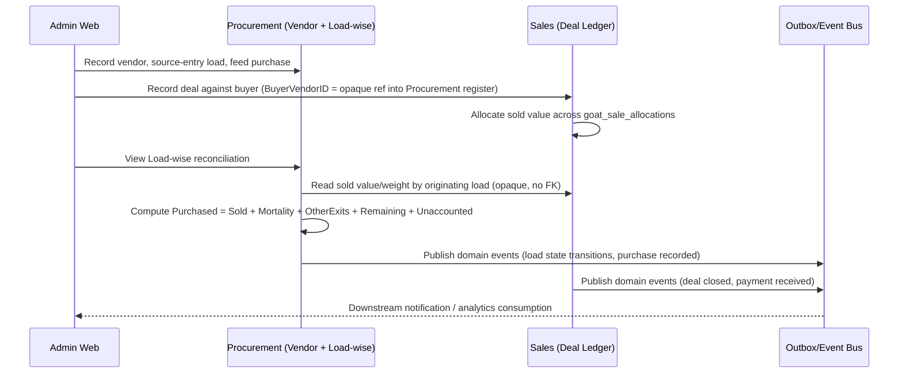

I now have comprehensive coverage. Let me write the complete documentation.

# Procurement & Supply Chain Domain

## 1. Overview

The Procurement & Supply Chain Domain is one of GoatOS's core business domains, responsible for the financial and material supply-chain lifecycle that surrounds livestock farming: acquiring animals and feed from external vendors, tracking the associated money flows, selling livestock and by-products back out to buyers, and reconciling inventory (primarily vaccine/dose stock) against operational consumption. It sits alongside — but is architecturally decoupled from — the Animal Health & Care and Field Operations domains, deliberately reading none of their tables directly. Cross-domain facts (e.g., a sold animal's terminal exit) travel as opaque references or through the Notification & Event Infrastructure's outbox, never through foreign keys into another bounded context's schema.

The domain is composed of three tightly related but independently deployable sub-modules under `backend/internal/`:

| Sub-Module | Responsibility | Package Path |
|---|---|---|
| **Procurement** | Vendor register (buy-side), source-entry load tracking (goat acquisition pipeline), feed-purchase ledger | `backend/internal/procurement` |
| **Sales** | Sales deal ledger, demand pipeline (buyer leads/FPO leads/market quotes), sold-tag & weight evidence, farm-value/load-wise reconciliation | `backend/internal/sales` |
| **Inventory** | Stock-lot tracking with FEFO (First-Expired-First-Out) picking, batch reservation/consumption for vaccination doses, obligation-batch reconciliation | `backend/internal/inventory` |

Each sub-module follows the project-wide hexagonal layering convention: `domain/` (pure business types and validation rules), `app/` (thin orchestration services), `ports/` (repository interfaces and typed sentinel errors), and `adapters/` (HTTP handlers, sqlc-backed Postgres repositories). Inventory additionally exposes a standalone CLI reconciler (`backend/cmd/inventory-batch-reconciler`) as an independently scheduled maintenance job rather than an API-triggered flow.

---

## 2. Architectural Position



A defining design principle, stated explicitly in code comments across all three sub-modules, is **schema isolation with opaque cross-references**: Sales carries a `BuyerVendorID` that points into the Procurement vendor register, and Procurement's Load-wise reconciliation reads Sales' allocation data — but both relationships are treated as **opaque identifiers rather than foreign keys**, deliberately avoiding a hard coupling that would let one module's migration break the other's writes. This mirrors the same "opaque reference" pattern used elsewhere in the platform (e.g., Sales' animal-count fields never resolve to a real goat in the herd schema) and reflects a conscious decision to keep commercial record-keeping independent of the clinical/operational data model.

---

## 3. Procurement Sub-Module

### 3.1 Vendor Register

The vendor register (`backend/internal/procurement/domain/vendor.go`) is a **single shared table** covering 22 record types spanning both sides of the business relationship — livestock agents/stockists, transport, feed suppliers, manure buyers, pellet factories, labour contractors, insurance providers, test labs, and site trades. Rather than splitting vendors and customers into separate tables, the register uses a **`register_side` column** (`procurement` vs `sales`) attached to each record-type catalog entry, so a vendor's side is *derived from its record type*, never stored redundantly on the vendor row itself — eliminating any possibility of the two disagreeing.

This design directly explains a notable frontend pattern: **`/procurement/vendors` and `/sales/vendors` render the exact same `VendorBoardPage` React component**, differentiated only by which page contract (`vendors` vs `sales-vendors`) is passed in, which in turn filters by `register_side`. This is intentional (per an explicit maintainer decision recorded in code comments dated 2026-09-05) — treating it as two logical views over one physical entity rather than duplicating UI and validation logic.

Key domain fields on `Vendor`:
- **Identity/contact**: `BusinessName`, `ContactPersonName`, `PhoneNumber`, `State`, `City`
- **Commercial terms**: `PricePerGoat`, `CapacityQuantity`/`CapacityUnit`/`SupplyFrequency` (delivery capacity, added 2026-09-03), `AverageAnimalWeightKg` (buy-side expected live weight, added 2026-09-08)
- **Finance fields** (`BankName`, `AccountNo`, `IFSCCode`, `UPIID`, `PANNumber`): access-gated by a `VendorFinanceRead` permission. A caller lacking that permission receives `FinanceRedacted = true` with every finance field nil'd out by `RedactFinance()` — this redaction happens **after** the repository write, at the service layer, so the same code path enforces read-time confidentiality regardless of whether the caller just wrote the record.
- **Voice-note proof**: `VoiceNoteProofRef`, validated against the shared Proof Capture service via an injectable `VoiceNoteValidator` port — a vendor write carrying an unverified voice-note reference is rejected outright rather than stored as a dangling link.
- All monetary and quantity values (`PricePerGoat`, `CapacityQuantity`) are carried as **decimal strings, never `float64`**, to avoid floating-point round-trip corruption of money figures — a convention repeated consistently across Procurement and Sales domains.

Status values (`active`, `inactive`, `negotiating`, `banned`) are strictly normalized on import — the source spreadsheet's inconsistent casing and trailing whitespace ("Active", "In Active ") are canonicalized by `NormalizeStatus`, since the database CHECK constraint would otherwise reject the raw import data outright.

### 3.2 Source-Entry Load Tracking

Source-entry (`backend/internal/procurement/domain/types.go`, HTTP handler in `handler.go`) models the **goat-acquisition pipeline**: from initial candidacy through health screening, pre-dispatch decisioning, transit, arrival review, and herd intake. This is the most state-machine-heavy piece of the domain, tracking two parallel state ladders:

- **Load status**: `source_warmup → health_pending → pre_dispatch_pending → dispatch_ready → in_transit → arrival_review → accepted_intake` (with `rejected`, `deferred`, `blocked` branch states)
- **Per-goat state** (`LoadGoat.CurrentState`): a finer-grained ladder from `source_candidate` through `source_health_passed/failed`, `pre_dispatch_accepted/rejected/deferred/blocked`, `loaded`, `in_transit`, `arrival_accepted/rejected`, to `accepted_herd_intake` (or terminal `dead`/`sold`/`lost`)

Each transition point (`RecordSourceHealth`, `PreDispatchDecision`, `DispatchLoad`, `RecordArrivalReview`, `AcceptIntake`) is exposed as a discrete HTTP endpoint under `/procurement/source-entry/*`, backed by domain types (`Decision`, `TransitHandoff`, `SourceHealthCheck`, `HFVaccinationEvidence`) that carry an optional `ProofRefID` and `SOPTaskID`, tying the acquisition pipeline into the platform-wide Verification & Process Integrity supporting domain. Several response types carry a `Replayed bool` transient flag (never persisted) that signals to the service layer whether a result came from an idempotent replay — used to skip replay-unsafe side effects such as re-cancelling downstream vaccination obligations.

Cursor-based pagination (`backend/internal/procurement/domain/cursor.go`) is used for the load list and generic "work" (drill-down) queries, encoding `(updated_at, id)` pairs as base64 opaque tokens capped at 512 bytes — a defensive bound against malformed or hostile cursor input.

Notably, four projection endpoints (`ActionCenter`, `ProtocolAdherence`, `ControlTower`, `WorkflowDrilldown`) exist on the `Service` interface but are **explicitly parked/unregistered** in the HTTP router, per a `TODO(procurement-lens)` comment — command-center lenses for this vertical are deliberately deferred to a future top-level cross-domain routing contract rather than nested under `/procurement/source-entry/*`.

### 3.3 Feed Purchase Ledger

The feed-purchase ledger (`backend/internal/procurement/domain/feed_purchase.go`, service in `app/feed_purchase_service.go`) is the authored (non-imported) continuation of a legacy spreadsheet ("Feed DB") that was frozen read-only by migration 000174. The module's stated ownership boundary is explicit: **"Procurement owns the WRITE; feeddirection keeps the READ"** — the Feed Management domain's `/feed/analytics` stock/days-left cards consume this ledger's data, but Feed Purchase itself performs only a single existence check against the active feed catalog, never a deeper read of feed-domain tables.

Key business rules encoded in the domain layer:

- **Farms**: closed vocabulary `CBE`/`CPT` (two physical farm codes)
- **Payment states**: closed to `Paid`/`Pending` — matching the legacy sheet's exact vocabulary, with no synthetic third value invented
- **Delivery lifecycle**: `purchased` ("in transit", not yet counted as stock) → `reached` ("delivered", counted as stock from the arrival date, and the moment an aflatoxin/toxin test task is spawned). Deliberately only two states — an intermediate "dispatched" state is rejected as unrecorded and therefore untrustworthy
- **Landed cost derivation** (`DeriveFeedPerKgCost`): landed cost divided by *actual received weight* when known, falling back to *buying weight* otherwise — so a load that lost weight in transit correctly shows a higher effective per-kg cost
- **Idempotency**: `CreateFeedPurchase` and `RecordFeedPurchasePayment` both **mandate** a caller-supplied idempotency key; a purchase or payment is money, and the service layer refuses to process a write without one — this is enforced before any domain validation runs, since a duplicated purchase would double-count farm stock

The service layer (`FeedPurchaseService`) is explicitly documented as "deliberately thin, the same shape as VendorService" — there is no state machine, no clock, no proof requirement beyond validating writes and read filters, since a feed purchase is treated as a pure commercial record. All business-date comparisons (purchase date, delivery date, payment date) are evaluated against **IST business-day boundaries** (`biztime.BusinessDayStart`), not raw UTC timestamps, to avoid a purchase made in the evening in India being mis-dated by up to 5.5 hours of UTC skew.

### 3.4 Load-wise Reconciliation

`backend/internal/procurement/domain/loadwise.go` implements a per-load financial and headcount reconciliation view (`LoadwiseLoad`), documented as governed by a formal decision record (`docs/decisions/sales-loadwise.md`). Its core invariant:

```
Purchased = Sold + Mortality + OtherExits + Remaining + Unaccounted
```

A non-zero `Unaccounted` value is **surfaced loudly, never silently absorbed** into another bucket — the row visibly disagrees with the load's declared headcount rather than reconciling itself into a false balance. Money rules are similarly strict:

- **Purchase value** = `animal_cost + transport_cost + other_cost`; a load with no recorded cost reports an explicit "cost not recorded" state, never a defaulted zero
- **Sold value** is attributed *per animal* via `goat_sale_allocations` — a sale's value is split evenly across the animals tagged to it and summed by originating load; an untagged sold animal contributes nothing and is counted separately as "unpriced"
- **Remaining stock value** falls back through three price bases (`load` → `overall` → `none`), and the chosen basis travels with the number (`LoadwisePriceBasisLoad/Overall/None`) so the UI can label exactly which average priced the estimate

The module also tracks two deliberately distinct time clocks per load: `DaysSincePurchase` (money-tied-up clock, starts at purchase) and `DaysOnFarmSoFar`/`FatteningDays` (animal-tied clock, starts at arrival) — the code explicitly warns against conflating them, since they answer different business questions ("how long has capital been tied up" vs. "how long have the animals been eating here").

---

## 4. Sales Sub-Module

### 4.1 Sales Deal Ledger

The `Deal` type (`backend/internal/sales/domain/sales.go`) records one commercial transaction — live animals (sheep/goat) or manure — sold to a buyer. The module's package comment is explicit about its isolation boundary: *"Sales is a COMMERCIAL module: it records deals with buyers... and reads NOTHING from the herd, vaccination, or procurement schemas."* Even the animal counts on a deal are sheet-era labels that resolve to no specific goat identity; the authoritative terminal "sold" state of a physical animal lives exclusively in the herd/health workflow, not here.

Closed vocabularies enforced at the domain layer:
- **Farms**: `CBE`/`CPT` (shared with Procurement)
- **Product types**: `Sheep`, `Goat` (live — carry counts and live weight), `Manure` (weight/revenue only, never counts)
- **Deal status**: `Deal Closed`, `Deal Failed`, `In Discussion`, `Advance Paid` — only `Deal Closed` counts toward the sales overview's revenue/animals/price aggregates; the other three are pipeline states that must not pollute closed-deal metrics
- **Breed-per-product** mapping (`BreedsByProduct`) is duplicated intentionally between the backend and the admin-web page contract layer (rather than imported), because the contract compiler must not depend on a feature package — a dedicated test (`TestSalesOptions`) pins the two literal lists equal to prevent drift
- `BuyerVendorID` is the opaque link into the Procurement vendor register described in §2 — nil for legacy-imported deals that predate the register's existence, with `BuyerName` retained as a point-in-time snapshot of what the buyer was called at the time of sale, independent of any later vendor-register edits

`PaymentReceived` is maintained as a **running total** across possibly multiple recorded receipts, seeded once from the legacy sheet's `advance_amount` field, then advanced transactionally by each subsequent `RecordDealPayment`/`UpdateDealPayment` call. Editing a payment applies an old/new *delta* under a row lock rather than treating the edit as an additional receipt.

### 4.2 Demand Pipeline & Evidence

`backend/internal/sales/domain/pipeline_writes.go` covers pre-deal activity recorded now that the legacy spreadsheet has been fully retired (explicit 2026-08-18 maintainer decision: "there will be no sheet in future"): `BuyerLead`, farmer-group (FPO) leads, market quotes, and sold-tag/weight evidence. A deliberate design choice here is that **`CallStatus` is free text, not an enum** — imported rows carry organic phrasings ("Not Intrested", "Connected and he will get back") that the pipeline's charts bucket by exact string match; forcing these into a canonical enum would fragment existing buckets, so the server instead offers the observed vocabulary as suggestions via a `status_options` field on reads.

All write types follow a strict **Normalize-then-Validate** sequence — whitespace collapsing and trimming happen before validation runs, so a value that is only whitespace fails the "required" check rather than passing because it was technically non-empty pre-trim.

### 4.3 Overview & Ledger Service

`SalesService` (`backend/internal/sales/app/sales_service.go`) is explicitly modeled "the same shape as procurement's VendorService" — deliberately thin, with no state machine or clock beyond validation and read-filter normalization. Key behaviors:

- `GetOverview` rejects unrecognized farm filters rather than silently widening them to "all farms" — an important guard against showing company-wide numbers mislabeled as a single farm's figures
- `ListDeals` enforces a hard `MaxDealOffset` bound and **rejects rather than clamps** out-of-range offsets — clamping would silently serve page 1's rows while displaying page 400's page number, an inconsistency the caller could not detect
- `CreateDeal`, `RecordDealPayment`, `UpdateDealPayment`, and `DeleteDealPayment` all mandate idempotency keys for the same money-safety reasoning as the feed-purchase ledger
- `SetDealStatus` performs case-insensitive matching against the closed status vocabulary but **stores only the canonical form**, rejecting anything unrecognized rather than defaulting

---

## 5. Inventory Sub-Module

### 5.1 Domain Model

Inventory (`backend/internal/inventory/domain/types.go`) is the smallest but most algorithmically dense of the three sub-modules, tracking:

- **`Item`**: an inventory item definition (vaccine, dewormer, feed, etc.) — `ItemCode`, `Category`, `BaseUnit`
- **`StockLot`**: a quantity of an item at a specific location, with `QuantityInStock`, `QuantityReserved`, and an optimistic-concurrency `RowVersion`
- **`FEFOPick`**: the earliest-expiring lot with unreserved availability, computed as `AvailableQuantity = QuantityInStock - QuantityReserved`
- **`Movement`**: an **append-only ledger entry** — every stock change (receive, reserve, consume, release, adjust, expire, transfer) is recorded as a positive-magnitude row whose direction is implied by `MovementType`, never as a direct balance mutation alone. This ledger-plus-balance dual-write pattern gives the module a full audit trail independent of the current-state balance columns.
- **`BatchStockReconcileSummary`**: the result shape (`Batches`, `Movements`, `Released`) returned by the reconciler

All quantities are carried as **decimal strings** (never `float64`), consistent with the money-safety convention seen throughout Procurement and Sales, and parsed via a floor-to-int64 helper (`parseQty`) since doses are always whole units.

### 5.2 Repository Contract & Typed Errors

The `ports.Repository` interface (`backend/internal/inventory/ports/ports.go`) defines three distinct, semantically meaningful sentinel errors:

| Error | Meaning |
|---|---|
| `ErrNotFound` | No stock exists anywhere in the location-ancestor chain for the item |
| `ErrInsufficientStock` | Stock exists somewhere in the chain, but **no single location** at or above the requested one can *fully* cover the requested quantity |
| `ErrMovementIdempotencyConflict` | A replayed idempotency key was submitted with different stock semantics than the original |

This distinction matters operationally: `ErrNotFound` signals a genuine stock-out (nothing to give), while `ErrInsufficientStock` signals a *location-topology* problem (stock exists, but it's fragmented in a way the reservation logic won't span two independent ancestor branches to satisfy) — these map to different remediation actions for an operator.

### 5.3 FEFO Reservation Algorithm

`ReserveForBatch` (`backend/internal/inventory/app/reserve.go` orchestrating `adapters/postgres/repository.go`) is the domain's most sophisticated piece of logic, designed to support **shed-scoped vaccination drives drawing on park/farm-level stock**. The algorithm:

1. **Advisory-locks the batch** (`AcquireBatchReserveLock`) to serialize concurrent reservation attempts for the same batch — this makes the subsequent idempotency check authoritative rather than racy.
2. **Checks for existing reserve movements** for the batch; if any exist, the call is treated as a replay and no-ops (after re-marking the obligation batch as reserved), even if the *original* reservation spanned multiple lots or locations.
3. **Walks the location-ancestor chain** upward from the requested (possibly shed-scoped) location via `ChainLocationAvailableSums`, choosing the **nearest ancestor** whose lots *together* — not necessarily any single lot — cover the requested quantity. A near location that's merely short on stock is skipped in favor of a farther one that has enough, rather than partially reserving from the near one.
4. **Applies FEFO lot selection** within the chosen location (`ListFEFOLotsForUpdate`, row-locked with `FOR UPDATE`), consuming the earliest-expiring lots first and spanning as many lots as necessary to satisfy the full quantity.
5. **Records one `reserve` movement per consumed lot**, each with its own idempotency key of the form `<batchID>:reserve:<lotID>` — this per-lot keying is what allows a reservation spanning several lots to remain correctly idempotent under retry (a single batch-level key would collapse the second lot's insert).
6. **Fails closed** if the chosen location is drained by a concurrent reservation between the unlocked "resolve" step and the locked "consume" step — returning `ErrInsufficientStock` rather than partially committing.
7. **Marks the originating `obligation_batches` row** with a `stock_reservation: {state: reserved, reserved_at: ...}` JSONB annotation inside the same transaction, giving the Obligation domain (vaccination scheduling) a durable signal that stock has been committed for that batch.

This is a textbook example of combining **PostgreSQL advisory locks + row-level `FOR UPDATE` locking + idempotency-key-based replay safety** to guarantee exactly-once semantics for a financially/operationally sensitive reservation across a multi-lot, multi-location search space — all within a single atomic transaction.

### 5.4 Consumption & Release

`ConsumeForBatch` and `ReleaseForBatch` (`backend/internal/inventory/app/consume.go`) share a common `settle` implementation distinguished by two booleans:

- **`consumeOnHand`**: whether the on-hand quantity drops alongside reserved (consume = true) or only reserved drops (release = true, on-hand unchanged)
- **`strictReserved`**: whether an under-reserved request is a hard error (consume = strict — the completion halts for manual reconciliation) or forgiving (release = lenient — capped at whatever remains reserved, used for no-show cleanup at batch close)

This asymmetry is deliberate: **consuming more than was reserved is a data-integrity emergency** (something drifted between reservation and actual field usage and must be investigated), while **releasing more than was reserved is an expected no-show scenario** that should degrade gracefully rather than error. Both operations are idempotent per `(batch, key)` via the movement idempotency mechanism — a disambiguating key format like `batch:consume:<goat>` allows per-animal consumption tracking within a single batch.

### 5.5 Batch Reconciliation & the CLI Reconciler

When a vaccination batch's planned membership changes after stock has already been reserved (an animal is deferred, shifted to another shed, or the drive is cancelled), the reserved doses for the excess animals become stranded. Rather than reconciling this synchronously and risking partial-transaction complexity inside the write path, the Obligation domain marks the affected batch with a `stock_reconcile_required` flag and records the *exact* excess quantity to release. This is picked up asynchronously by:

- **`ReleaseBatchReconcileRemainders`** (app service, `backend/internal/inventory/app/service.go`), which bounds its `limit` parameter to `[1, 5000]` regardless of caller input, defaulting to 1000
- **The repository-level `ReleaseBatchReconcileRemainders`** (`backend/internal/inventory/adapters/postgres/repository.go`), which loops one claimed candidate at a time via `releaseOneBatchReconcileRemainder`, each in its own short transaction — trading a slightly less atomic "all N batches" guarantee for shorter individual lock durations under load
- **`backend/cmd/inventory-batch-reconciler`**, a standalone CLI binary (not part of the always-on API process) that connects to Postgres, wraps the same `inventoryapp.NewService`, and is intended to run as a scheduled job. It takes `--tenant-id`, `--limit`, and `--timeout` flags (also configurable via `GOATOS_TENANT_ID`, `GOATOS_INVENTORY_BATCH_RECONCILE_LIMIT`, `GOATOS_INVENTORY_BATCH_RECONCILE_TIMEOUT` environment variables), and prints a one-line summary (`batches`, `movements`, `released`) on completion.

This CLI-job pattern is consistent with the platform-wide architecture of separating the always-on API server (`backend/cmd/api`) from dozens of independently scheduled maintenance binaries under `backend/cmd/`, each deployed as its own Cloud Run Job.

---

## 6. Sequence Flows

### 6.1 Feed Purchase Recording (Procurement)



### 6.2 FEFO Batch Reservation & Reconciliation (Inventory)



### 6.3 Procurement-to-Sales Value Chain (Cross-Sub-Module)



---

## 7. Frontend Integration (Admin Web)

The admin-web Next.js application exposes this domain under two route groups sharing significant UI logic:

| Route | Purpose | Notes |
|---|---|---|
| `/procurement` | Redirects to `/procurement/source-entry` | Source Entry is the vertical's home surface |
| `/procurement/source-entry` | Load acquisition pipeline board | `force-dynamic` rendering; `source-entry/loads/[load_id]` for per-load detail |
| `/procurement/vendors` | Buy-side vendor register | Renders `VendorBoardPage` with `vendors` page contract |
| `/procurement/feed-purchases` | Feed purchase ledger | Renders `FeedPurchasesPage`; has a dedicated `error.tsx` for Faro-observability-integrated error boundaries |
| `/sales` | **Retired** — redirects to `/sales/sold`, preserving query parameters | Explicit maintainer decision (2026-09-11) split the old Sales board into Sold and Farm Value |
| `/sales/sold` | Sold-animal tracking board | Successor to the retired `/sales` board |
| `/sales/farm-value` | Farm-value calculation view | Successor to the retired `/sales` board |
| `/sales/loads` | Purchase-and-born reconciliation | Renders `SalesLoadsPage`; the UI-facing view of Load-wise reconciliation |
| `/sales/vendors` | Sell-side vendor register | Renders the **identical** `VendorBoardPage` component as `/procurement/vendors`, differing only by `sales-vendors` page contract |
| `/sales/config` | Sales configuration | Vendor/breed/status option management |

Two architectural patterns are worth calling out explicitly:

1. **Shared component, contract-driven differentiation**: `/procurement/vendors` and `/sales/vendors` both render `VendorBoardPage` from `@/features/procurement`, with the only difference being which page contract (`vendors` vs. `sales-vendors`) is fetched via `requireAdminWebPageContract`. This avoids maintaining two UI implementations for what is structurally one register table, viewed from two sides.
2. **Legacy-route redirection with query preservation**: retired routes like `/sales` and `/procurement` don't 404 — they issue a server-side `redirect()` to their successor route while carefully reconstructing the query string from `searchParams`, so bookmarked or externally-linked URLs continue to work after a UI reorganization.

All list/board pages use `export const dynamic = "force-dynamic"` to guarantee live data on every request (no static caching of ledger/vendor data), and each route segment typically pairs a `page.tsx` with a dedicated `loading.tsx` skeleton and an `error.tsx` boundary wired to the observability stack (Faro RUM).

---

## 8. Data Import & Migration Tooling

Two standalone CLI binaries handle one-time historical data migration into this domain, both following an **idempotent, natural-key-matching import** pattern rather than blind inserts:

- **`backend/cmd/import-procurement-vendors`**: loads the vendor register from JSON fixtures (originating from the legacy spreadsheet), matching on natural keys so repeated runs don't duplicate rows.
- **`backend/cmd/import-sales-db`**: loads historical sales-deal data from the retired "Sales DB" sheet, seeding `PaymentReceived` from the sheet's `advance_amount` field and preserving `SourceSalesID`/`SourcePurchaseID`/`SourceRowNo` provenance fields on the `Deal` struct so imported rows remain traceable to their original spreadsheet position.

Both imports are explicitly one-off/periodic tools run outside the always-on API process, consistent with the platform's broader convention of keeping data-repair and migration logic in `backend/cmd/` rather than embedded in request-handling code paths.

---

## 9. Cross-Cutting Design Principles Observed

Across all three sub-modules, several consistent engineering conventions emerge that are worth calling out as reusable patterns for this domain and adjacent commercial-record modules:

1. **Money and quantity values are always decimal strings**, never `float64` — protecting against floating-point precision loss in financial figures and dose counts. Conversion to numeric types happens only inside the Postgres adapter layer via `pgconv.Numeric`/`pgconv.NumericString`.
2. **Mandatory idempotency keys on every money-affecting write** (feed purchases, purchase payments, sales deals, deal payments, inventory movements) — the domain treats a missing idempotency key as a hard rejection, not an optional safety net.
3. **Reject-don't-clamp on out-of-range pagination offsets** — across Vendor, Feed Purchase, and Deal listing endpoints, an offset beyond the maximum bound is refused rather than silently clamped, because clamping would present page 1's data under a misleading page number.
4. **Reject-don't-widen on unrecognized filter values** — an unknown farm, delivery state, or vendor-register side is refused rather than silently treated as "all", preventing company-wide data from appearing mislabeled under a narrower scope.
5. **IST business-day date semantics** for every business-date comparison (purchase dates, payment dates, delivery dates) via `platform/biztime.BusinessDayStart`, avoiding UTC-boundary date-shifting errors for a farm operating in the India timezone.
6. **Thin application services, rich domain validation** — both `VendorService` and `SalesService` are explicitly documented in code as deliberately minimal orchestration layers, since these are commercial records without state machines, clocks, or proof requirements — in deliberate contrast to the state-machine-heavy Source-Entry sub-module.
7. **Explicit, auditable non-absorption of discrepancies** — the Load-wise `Unaccounted` field and the deliberate red-flagging of reconciliation mismatches reflect a domain-wide philosophy that financial/headcount discrepancies must be visible on screen, never silently reconciled away.