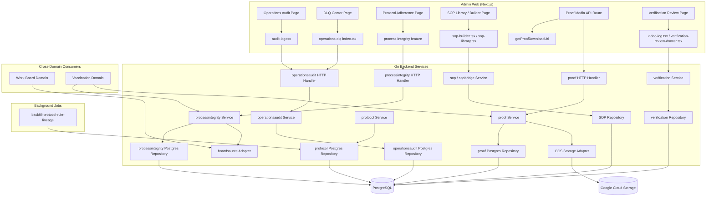
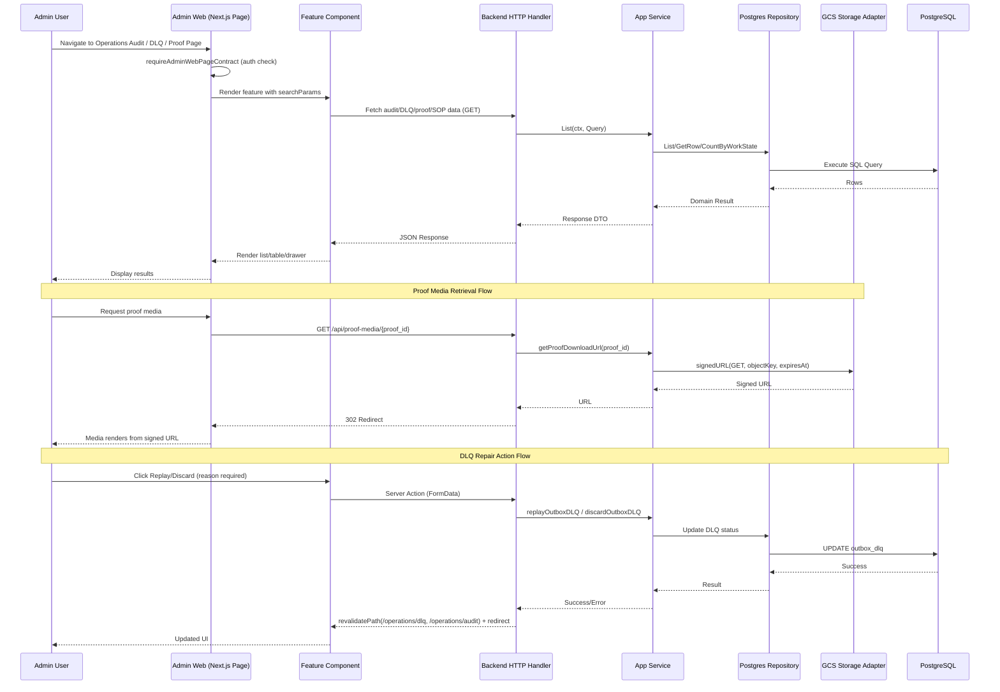

I now have a comprehensive, evidence-grounded understanding of this domain. I'll write the full technical documentation.

# Verification & Process Integrity Domain

## 1. Purpose and Role in the System

The **Verification & Process Integrity Domain** is GoatOS's cross-cutting integrity backbone. It does not own any primary business record — no animal, no obligation, no feed sheet — but instead acts as a **mandatory certification checkpoint** that every operational domain (Animal Health & Care, Feed Management, Field Operations, Procurement) must pass through before its work is trusted as "done." Whenever a field operator scans an RFID tag, films a vaccination dose, or packs a feed ration, the resulting evidence and its compliance status flow through this domain before the originating obligation is allowed to close.

Architecturally, this domain is classified as a **Supporting Domain** (importance 8.8/10, complexity 7.5/10) with six cooperating submodules, each implemented as an independent hexagonal (`domain → app → ports → adapters`) Go package under `backend/internal/`:

| Submodule | Backend Path | Responsibility |
|---|---|---|
| **Verification Review** | `verification`, `verificationcatalog` | Sampling-driven review queue, verdict recording, media-backed evidence review |
| **Process Integrity** | `processintegrity` | Cross-domain read-model ("Action Center," "Control Tower," "Protocol Adherence") over obligation/proof/verification state |
| **Protocol Management** | `protocol` | Protocol/rule definitions, versioning, and rule lineage across plan republishes |
| **Operations Audit** | `operationsaudit` | Tenant-wide audit trail and dead-letter-queue (DLQ) monitoring/repair |
| **Proof Capture & Media** | `proof` | Centralized photo/video/audio evidence storage (GCS/local), signed-URL issuance, integrity hashing |
| **SOP Management** | `sop`, `sopbridge` | Form-DSL-based Standard Operating Procedure authoring, versioning, and dry-run simulation |

A defining design principle stated directly in the code comments is that **verification is deliberately ignorant of business meaning**. The `verification` module's domain package explicitly states it "knows nothing about vaccination/feed/diagnosis/etc. internals; producers speak to it only through the generic Item shape + a back-pointer `SourceRef`." This keeps the module reusable across an open-ended set of producer domains without per-vertical code changes.

---

## 2. Architectural Pattern

Every submodule follows the same hexagonal shape consistently applied across the ~45 backend modules of GoatOS:

```
adapters/http        → REST handlers, permission checks, request/response envelopes
adapters/postgres     → pgx/v5-based repositories implementing ports.Repository
adapters/storage/*    → media storage backends (GCS, local)
adapters/boardsource  → cross-domain read bridges (e.g., into Work Board)
app/service.go        → use-case orchestration, business rules, biztime-aware clocks
ports/*.go            → repository/storage interface contracts
domain/*.go           → pure entities, value objects, error types, cursor codecs
```

This uniformity means a change to, say, the pagination cursor format in `processintegrity` follows the exact same conventions as `sop` or `operationsaudit`, lowering the cost of cross-team maintenance.

### 2.1 Component & Data Flow



---

## 3. Submodule Deep Dive

### 3.1 Verification Review (`backend/internal/verification`)

This is the largest and most elaborate submodule (~32 Go files, ~490KB), and it implements the actual human-in-the-loop review workflow.

**Producer-facing API — `CreateItem`.** Any producing module (vaccination, feed packing, weighing, diagnosis, breeding, death, toxin, etc.) enqueues one *verification item* by calling `Service.CreateItem`. The service validates:
- `tenant_id` is a well-formed UUID
- `vertical`, `module`, `category` are non-empty
- `category` is a **registered** category (see registry below) — an unknown category is rejected outright
- `source.module`, `source.ref_type`, `source.ref_id` (the `SourceRef` back-pointer) are all present
- at least one `media_refs` entry exists
- an `idempotency_key` is supplied (retried submissions from the mobile outbox must not create duplicate items)

**Category Registry — plug-and-play extensibility.** `domain.CategoryDefinition` is described in code as "the RT-registry analog from the Slack Workflow Engine." Registering a `CategoryDefinition` (vertical, module, category, expected media types, media labels, SLA hours, optional measurement-correction spec, navigation-module metadata) is *all* a new producer domain needs to appear in the verifier queue, the admin-web screen, and the mobile section — **no code change inside the verification module itself is required.** This registry-driven design is what allows GoatOS's many producer domains (vaccination first, feed/diagnosis/death/breeding later) to share one review pipeline without verification accumulating per-vertical branches.

**Randomized Verification Sampling.** A deliberately central feature (explicitly dated as a "maintainer decision 2026-08-26" in code comments) lets the CEO/leadership set, per category, what *percentage* of that category's proof videos a human verifier must actually watch; the rest are auto-settled by policy. Key mechanics:
- `SamplingBucket(itemID)` derives a stable 0–99 draw from `md5(item_id)`, mirroring a **generated column in Postgres** byte-for-byte (`mod(('x' || substr(md5(item_id::text),1,6))::bit(24)::int, 100)`), so the database is the single authority for the draw.
- `InSample(bucket, percent)` uses **strict less-than**, making the setting monotonic — raising the sampling percentage mid-day can only add work to the queue, never retract an item already reviewed.
- Categories whose approval must carry a producer-required measurement (e.g., feed-packing quantities, feed-wastage weight) are **not waivable** — `SamplingWaivable()` returns `false` and the UI shows a locked "Randomization" row with a fixed explanatory string, because approving without a number would silently complete a pen-day with no quantity recorded.
- An item that is drawn out of sample is auto-resolved with `AutoResolutionNotSampled`, is marked **approved** (never rejected — sampling only decides what gets *watched*), and carries no `verified_by`, so it never inflates a verifier's productivity metrics.

**Verdict lifecycle and eventual consistency.** The domain distinguishes **`Status`** (what the verifier decided — `pending`/`approved`/`rejected`/`withdrawn`) from **`VerdictState`** (what is actually happening right now — `awaiting_review` / `applying` / `settled`). This split exists because `RecordVerdict` writes the decision **plus an outbox row**, and the producing module's own record only updates once that event is durably consumed. A surface that only reads `Status` would show an "empty pending queue" the instant a verifier taps Approve even though the change hasn't propagated — `VerdictState` makes that lag visible instead of hiding it.

**Video Log.** A separate, per-shed, per-business-day read (`video_log.go`) answers "what proof arrived from this shed today, and when," distinct from the review queue ("what must I decide") and oversight analytics ("how is the backlog trending"). It is two-level (shed rollup → per-shed proof detail) because a single park-day can carry hundreds of vaccination items — a flat list is not a safe bound.

**Cross-domain bridges:**
- `adapters/boardsource` — surfaces verification-backed rows into the shared Work Board.
- `adapters/proofmedia` — resolves proof-artifact metadata into rendered evidence for review UIs.
- `adapters/adminuibridge` — exposes registered categories/modules to the Admin UI configuration layer.

### 3.2 Process Integrity (`backend/internal/processintegrity`)

This submodule provides a **read-model** — deliberately described in code as "the reusable process-integrity read model" — that aggregates obligation, SOP-task, proof, and verification state into a single denormalized row shape (`domain.Row`), keyed by category (`vaccination`, `feed_direction`, extensible to more).

**Work-state machine.** Each row carries a `WorkState` enum (`scheduled → due → overdue/in_progress → proof_pending → verification_pending → rejected/deferred/missed/blocked → completed`), a `Severity` (`ok/watch/at_risk/broken`), separate `SOPState`, `ProofState`, and `VerificationState` sub-states, and drive-capacity fields (`DriveCapacityState`, animal/operator caps, medical-defer reasons) specific to vaccination drives.

**Three primary read APIs exposed by `app.Service`:**
1. **`ActionCenter`** — the paged, filterable operational queue of open/at-risk work.
2. **`ActionCenterCounts`** — work-state tallies for dashboard chips.
3. **`ProtocolAdherence`** — a 30-day-lookback compliance summary joined against `AdherenceRow` (expected vs. actual vs. gap, with drive-capacity context), used by the admin-web `protocol-adherence` page.
4. **`ControlTower`** — an alert-only view (`OnlyBrokenOrAtRisk=true`) summarizing critical/warning counts, verification backlog, and config/SOP blockers, used for at-a-glance leadership monitoring.

**Fail-closed freshness guarantee.** This is the submodule's most important non-functional property. Two dedicated sentinel errors govern the read path:
- `ErrProjectionUnavailable` — returned when the tenant's read-model projection has never been built (or is rebuilding with no prior serving version). The code comments are explicit that the request path **must not** fall back to a canonical compute-on-read replay of raw obligation/SOP/proof/completion history at scale (the "god-CTE" join), because that is the slowest possible path exactly when the system is already degraded. Callers surface this as an honest HTTP 503 rather than an unbounded, ever-slower fallback query.
- `ErrProjectionStale` — returned when a serving version exists but its freshness/state is outside a five-minute operational policy window; the system fails closed rather than presenting stale process state as current truth.

This design decision is documented and referenced against two named ADRs (`docs/decisions/high-scale-dashboard-projections.md`, `docs/decisions/operational-kernel-5k-50k-scale-envelope.md`), reflecting a deliberate scale strategy targeting a 5,000–50,000-animal envelope today with a stated 1–5M future certification bar.

**Cursor encoding.** `domain/cursor.go` implements a strict, whitelisted opaque cursor: base64-encoded JSON carrying `(sort_priority, due_at, row_id)`, size-capped (≤512 bytes encoded, ≤384 bytes decoded payload), with `DisallowUnknownFields` decoding and an explicit trailing-data check. `row_id` itself is validated against a closed set of shapes (`obligation:<uuid>`, `batch:<uuid>:rule:<uuid>:shed:<uuid>`, an extended protocol-version/partition/date variant, and `feed_projection_exception:<uuid>`), preventing cursor forgery or injection.

**Boardsource bridge (`adapters/boardsource`).** This adapter is Vaccination's contribution to the cross-domain Work Board: rather than issuing new SQL, it **wraps** the existing `processintegrity.Repository.ListRows` canonical read and re-shapes it into Work Board rows, one per vaccination-drive pen (batch × rule × pen × day grain). It is explicitly documented as **read-only and reporting-only** — work state, severity, and counts are copied verbatim; only display titles, subtitles, and owner-identity mapping are composed locally. Because the wrapped read's native cursor is `(sort_priority, due_at, row_id)` rather than a plain `row_id` keyset, the adapter performs a *bounded walk* (capped at `maxWalkPages × walkPageSize = 2,000` rows) over one park-day and re-sorts by `row_id` locally to satisfy the Work Board's own keyset contract — a pragmatic, explicitly-flagged trade-off rather than a full-table scan.

**Domain-specific label composition (`vaccinelabels.go`).** `ControlTowerDoseLabel` composes a human-readable dose label (e.g., "Rabies · Booster kid course dose 2") by combining the canonical antigen label from the vaccination domain with regex-derived qualifiers (`_w([0-9]+)$` wave suffix, `_adult_`/`_kid_` course markers, `revac`/`booster` keyword detection). This logic deliberately replaced a former SQL join into the CEO-AI reporting schema, because — per an explicit architectural boundary decision (`docs/decisions/ceo-ai-reporting-boundary.md`) — a core operator-facing read path must not depend on the leadership-analytics schema.

### 3.3 Protocol Management (`backend/internal/protocol`)

Defines protocols, protocol versions, and rules (vaccination dose matrices, eligibility windows, proof policies). The standout engineering concern here is **rule lineage across republishes**.

Because `protocol_rules.rule_id` is a fresh UUID on every version publish (publishing rewrites every rule row), two derived values answer questions the raw `rule_id` cannot:

- **`RuleIdentityKey(vaccineCode, doseCode, sequence)`** — a stable, length-prefixed composite key identifying *which* rule this is in business terms, invariant across versions. Length-prefixing (rather than a printable delimiter) avoids ambiguity when operator-authored codes contain delimiter characters (e.g., `"a"+"b|1"` colliding with `"a|b"+"1"`).
- **`RuleContentFingerprint(rule)`** — a SHA-256 hash over every field that can change *what an animal owes or when* (trigger type, offsets, gap/repeat rules, SOP version, withdrawal days, canonicalized eligibility/proof-policy JSON). `sort_order` and `created_at` are deliberately excluded so that cosmetic reordering never looks like a substantive rule change. JSON canonicalization (decode→re-encode via `interface{}`) ensures two semantically identical documents hash identically regardless of key order or whitespace. A fingerprint computation failure returns an empty string, which **never matches** — the system fails safe by falling back to cancel-and-regenerate obligations rather than risking an unverified carry-over.

Both derived values feed a **carry-over mechanism**: when a plan republish adds one new vaccine to a live protocol, animals' existing open obligations for unchanged rules are rebound to the new version (matched on identity key + content fingerprint) rather than being cancelled and re-minted — preserving in-flight vaccination schedules across administrative plan edits.

The `backfill-protocol-rule-lineage` CLI tool (`backend/cmd/backfill-protocol-rule-lineage`) retroactively populates lineage rows for rules that existed before this feature shipped, so the *first* republish after deployment can immediately benefit from carry-over rather than falling back to full regeneration. It is idempotent, tenant-scopable, and runs in a dry-run-by-default mode (`-apply` flag required to write), computing fingerprints via the exact same domain helper the live publisher uses — deliberately avoiding a parallel SQL-side computation that could drift by even one byte.

### 3.4 Operations Audit (`backend/internal/operationsaudit`)

Provides a tenant-wide, keyset-paginated audit trail (`AuditRow`: actor, action, resource, scope, anomaly flag, arbitrary metadata, trace ID) plus aggregate `SummaryResponse` metrics (total actions, awaiting-verification count, proof events, proof-coverage percentage, rejected/rework/anomaly counts) over a caller-specified time window.

The service layer (`app/service.go`) is intentionally thin: it applies sane query defaults (default 100/max 500 row limit; default 24-hour lookback window ending "now" in business timezone) and delegates entirely to the `ports.Repository` interface. Cursor encode/decode uses a simple base64-JSON pair of `(recorded_at, audit_id)`.

This same audit subsystem backs the **DLQ (Dead-Letter Queue) monitoring and repair UI** in admin-web. Server actions (`operations-dlq/actions.ts`) expose `replayDLQAction` and `discardDLQAction`, both requiring an operator-supplied `reason`, both invoking backend repair endpoints (`replayOutboxDLQ` / `discardOutboxDLQ`) and triggering Next.js `revalidatePath` on both `/operations/dlq` and `/operations/audit` — ensuring the audit trail and the DLQ view stay consistent after a manual intervention.

### 3.5 Proof Capture & Media (`backend/internal/proof`)

The central evidentiary store for every photo/video/audio artifact captured anywhere in the platform — the single storage service consumed by Feed, Health, Vaccination, PC-Care, Weighing, Pen Visits, and more.

**Core domain type — `Artifact`.** Tracks `ProofID`, `StorageProvider`, `ObjectKey`, `ContentHash`, `MimeType`, `SizeBytes`, `UploadState`, scope/subject linkage, `RetentionPolicy` + `RetentionExpiresAt`, and an optimistic `RowVersion`.

**Idempotent upload registration.** `CreateUpload.IdempotencyKey` is the stable per-capture key the mobile outbox sends on every sync retry. A replay with the *same key and same logical request* returns the original `Artifact` unchanged (never mints a duplicate object); a same-key-but-different-request replay is rejected with `ErrIdempotencyConflict`. This directly supports the offline-first Android sync model, where network retries after partial failures are expected and must be safe.

**GCS Storage Adapter — signed URLs and integrity.** `adapters/storage/gcs/storage.go` implements RSA-based V4 signed URLs (`crypto/rsa`, `crypto/x509`, `crypto/sha256`) entirely in-process (no Google client library dependency for signing):
- **Video uploads** use resumable sessions (`x-goog-resumable: start`, `8 MiB` chunk size) suited to multi-minute clips.
- **Photos, attachments, and short audio notes** use a simple signed `PUT`.
- Both request classes set `x-goog-if-generation-match: 0`, meaning **the signed URL can only create a new object, never overwrite an existing one** — an important immutability/integrity guarantee for evidentiary media.
- **`FinalizeUpload`** issues a signed `HEAD` request to confirm the object landed, cross-checks the reported `Content-Length` against the client-declared size (raising `ErrIntegrityMismatch` on mismatch), and derives a `ContentHash` preferentially from the GCS object generation number (`gcs-generation:<n>`) or ETag, giving each stored artifact a durable, tamper-evident fingerprint.
- **`StatObject`** is explicitly restricted by contract (`ports.ObjectStatter`) to a *single-item, irreversible-decision* use case (verifier approval) — the code comment is emphatic that it must never be used to decorate a list/queue page, since one HEAD-per-row would be exactly the N+1 fan-out pattern the platform's scale guardrails ban.
- Deletion issues a signed `DELETE`; a 404 is treated as already-deleted (idempotent).

**Retention and cleanup.** The `ports.Repository` interface includes `ApplyRetention`, `BackfillSubmissionRetention`, `PurgeExpired`, and `PurgeAbandonedUploads` — batch-oriented lifecycle operations that support scheduled data-retention policies rather than unbounded evidence accumulation.

**Frontend integration.** Proof media is never served directly to the browser from GCS; the admin-web exposes a thin proxy route (`app/api/proof-media/[proof_id]/route.ts`) that calls the server-only `getProofDownloadUrl(proofId)` and issues an HTTP redirect to the resulting signed URL, keeping bucket credentials entirely server-side.

### 3.6 SOP Management (`backend/internal/sop`, `sopbridge`, admin-web `features/sops`)

Defines and versions **Standard Operating Procedures** via a form-DSL (`FormDSL` as an opaque `map[string]any`), paired with a `ProofPolicy` describing what evidence a task under that SOP requires.

**Backend authority for field types.** The admin-web derivation layer (`sop-derive.ts`) is explicit that the canonical list of supported field types (`text | number | date_time | select | multiselect | goat_lookup | animal_id_scan | location_picker | photo_proof | video_proof`) lives in `backend/internal/sop/app/service.go`'s `supportedFieldType` function — the SOP Builder UI offers a *richer* mock-derived vocabulary but maps every type down to a backend-supported one, flagging any unmapped type as a documented gap (`DSL_GAPS`) rather than silently emitting invalid DSL.

**Pure, framework-free derivation layer.** `sop-derive.ts` is explicitly documented as "no React, no server — unit-friendly": it classifies each SOP's business domain (`counts`, `feed`, `milk`, `weighing`, `health`, `breeding`, `parks`, `procurement`, `farmernet`, `inventory`, `people`, `general`) from its `code`/`name` using a **prefix-first, keyword-fallback** strategy — e.g., a `counts.*`-prefixed code always wins over a keyword match, preventing `counts.birth` from being misclassified as "Breeding" purely because the string contains "birth."

**Dry-run simulation.** `DryRunRequest`/`DryRunResponse` let the SOP builder simulate a form submission against answers + proof refs + context, returning per-field visibility/required/blocked states (`FieldState`) and the resolved workflow path — enabling live conditional-visibility preview in the SOP Builder UI without a real task ever being created.

**SOP Bridge.** `sopbridge` connects SOP task state into the cross-domain `processintegrity` read model (`SOPTaskState`, `SubmissionState` fields on `domain.Row`), so an SOP's in-progress/submitted/accepted/rework status is visible in the same Action Center and Protocol Adherence views used for proof and verification state.

---

## 4. Cross-Domain Interaction Pattern

The domain exposes itself to producer domains through **three narrow, stable contracts**, rather than shared tables or direct database access:

1. **Proof contract** — a producer registers evidence via `proof.CreateUpload`/`CompleteUpload`, gets back an `Artifact` with a `ProofID`, and stores that ID on its own records. Verification/process-integrity never store the media bytes themselves — only `ProofID` references.
2. **Verification contract** — a producer enqueues a review via `verification.CreateItem`, carrying a generic `SourceRef{Module, TaskID, SubmissionID, RefType, RefID}` back-pointer. Verification never queries producer tables directly.
3. **Process-Integrity contract** — producers (or their read adapters, like `boardsource`) query the read-model via `ports.Repository.ListRows`/`CountByWorkState`/`GetRow`, all filtered by a strongly-typed `Query` object.

### 4.1 Sequence: Proof Retrieval, DLQ Repair, and Verdict Recording



### 4.2 How the Field-Task Verification Flow Invokes This Domain

In the platform's signature end-to-end flow (Field Task Execution & Proof Verification), the Verification & Process Integrity domain participates as follows once an Android operator syncs a completed task from the local outbox:

1. The backend endpoint for the originating module (e.g., `vaccinationexecution`) receives the synced submission.
2. It calls `proof.CreateUpload`/`CompleteUpload` to persist the captured photo/video and obtain a durable `ProofID` (with GCS-side content-hash verification).
3. It calls `verification.CreateItem`, registering a new `Item` against the appropriate registered `category` (e.g., `"vaccination"`), attaching the `ProofID`(s) as `MediaRefs` and a `SourceRef` pointing back at its own task/submission ID.
4. The sampling engine determines whether this item is drawn for human review (`InSample`) or auto-resolved (`AutoResolutionNotSampled`).
5. If drawn, the item sits in `pending` `Status` / `awaiting_review` `VerdictState` until a verifier reviews the proof video and calls `RecordVerdict`.
6. The verdict is recorded transactionally with an outbox event; once the originating module's applier consumes that event, `VerdictState` transitions to `settled`.
7. Meanwhile, `processintegrity`'s read-model (fed by its own projection pipeline) reflects the updated `ProofState`/`VerificationState`/`WorkState` for that obligation, which the Admin Web Action Center, Control Tower, and Protocol Adherence views — as well as the `boardsource` bridge into Work Board — all read from consistently.

---

## 5. Notable Engineering Decisions and Design Rationale

| Decision | Rationale (as documented in code) |
|---|---|
| Verification is category-registry-driven, not per-vertical hardcoded | Lets new producer domains join the review pipeline with zero changes to `verification` itself — "an RT-registry analog." |
| Sampling percentage is monotonic (strict `<`) | Raising a sampling rate mid-day can only add work, never retract items already in a verifier's queue or already reviewed. |
| Measurement-required categories cannot be sampled below 100% | The verifier is the *data source* (not just a checker) for those categories; waiving review would complete work with no recorded quantity. |
| `VerdictState` is derived, never stored | Prevents a second state machine from drifting out of sync with the `applier_ack_expected`/`applied_at`/`status` columns that are the actual source of truth. |
| Process-Integrity reads fail closed (`ErrProjectionUnavailable`/`ErrProjectionStale`) rather than falling back to a live compute-on-read join | The naive fallback ("god-CTE") is slowest exactly when the system is degraded, and gets worse as animal counts scale toward the 1–5M target. |
| GCS signed uploads always set `x-goog-if-generation-match: 0` | Guarantees uploaded evidence objects are create-only — never silently overwritten. |
| `StatObject` is restricted to single-item, irreversible decisions | Prevents an N+1 HEAD-per-row anti-pattern from creeping into list/queue rendering. |
| Rule lineage uses length-prefixed identity keys and SHA-256 content fingerprints, excluding cosmetic fields | Guarantees vaccination obligations carry over correctly across protocol republishes without false-positive "changed" detection from reordering or unrelated metadata edits. |
| SOP builder maps its richer type vocabulary down to backend-supported field types, flagging gaps explicitly | Prevents the UI from emitting a `form_dsl` payload the backend cannot validate, while keeping the mismatch visible rather than silently lossy. |
| `boardsource` explicitly labeled read-only/reporting-only, wrapping rather than duplicating `processintegrity`'s SQL | Avoids two competing sources of truth for the same batch × rule × pen × day read; the trade of a bounded in-memory walk (capped at 2,000 rows/park-day) over a native keyset is documented as temporary. |

---

## 6. Summary

The Verification & Process Integrity Domain is GoatOS's **trust layer**: it doesn't produce farm data, it certifies it. Its six submodules — Verification Review, Process Integrity, Protocol Management, Operations Audit, Proof Capture & Media, and SOP Management — together provide a reusable, registry-extensible pipeline for capturing evidence, sampling it for human review, tracking protocol/rule compliance across plan versions, and exposing a fail-closed, scale-aware read-model that every other operational domain (and multiple leadership-facing surfaces via the Work Board bridge) depends on. Its architecture consistently favors **generic, module-agnostic contracts** (`SourceRef`, `CategoryDefinition`, `ProofID` references) over tight coupling to any single producer domain, and its scale-related design decisions (fail-closed projections, bounded walks, batched N+1-avoidant queries, idempotent uploads) reflect a deliberate, documented strategy for growing from a 5,000–50,000-animal operating envelope toward a much larger future scale without architectural rework.