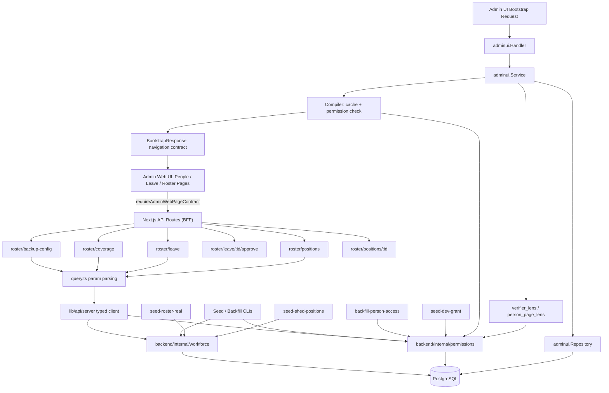
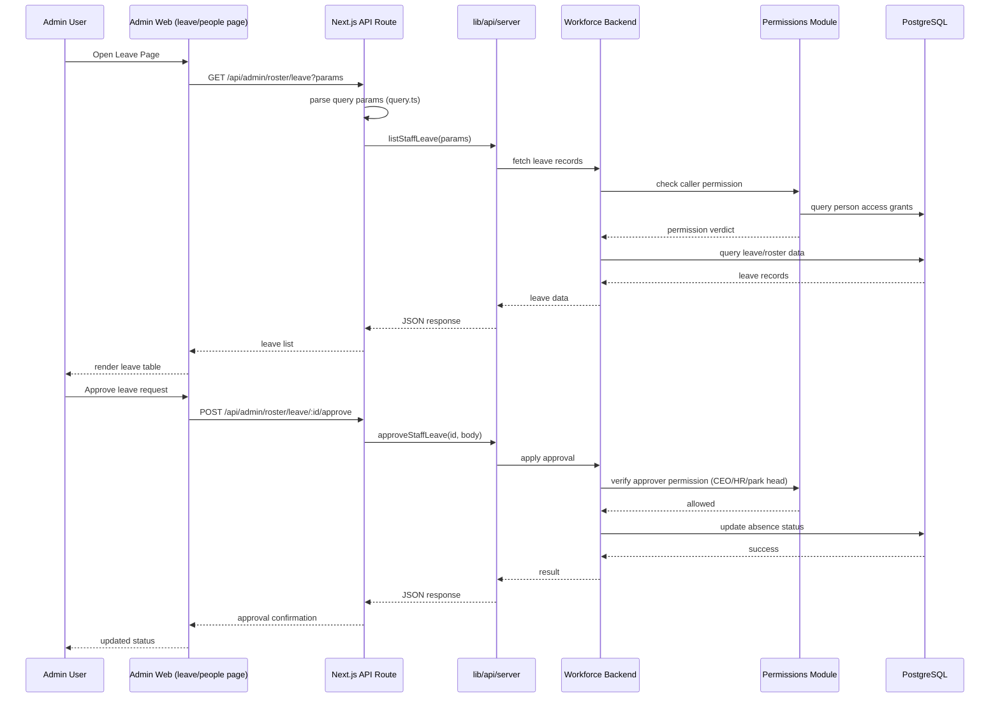

I now have enough detail across the domain models, application services, ports/adapters, permissions catalog, HTTP handlers, Next.js API layer, and seed/backfill CLI tooling to compose a comprehensive technical document.

---

# Workforce & Identity Management Domain

## 1. Domain Purpose and Scope

The **Workforce & Identity Management Domain** is the supporting bounded context in GoatOS responsible for answering one deceptively simple question that gates almost every other operation on the platform: *"Who is this person, what seat do they hold, and what are they allowed to do?"*

It is composed of three tightly coupled submodules, each independently deployable as Go packages within the backend monolith, but conceptually inseparable:

| Submodule | Responsibility |
|---|---|
| **Workforce & Roster** (`backend/internal/workforce`) | Personnel directory, fixed operational positions/seats, backup/coverage configuration, leave request workflow, and Clock In/Out attendance tracking. |
| **Person Identity & Permissions** (`backend/internal/permissions`) | The permission catalog, role definitions, and — since the 2026-08-24 cutover — per-person module/capability assignment that replaced role-derived access. |
| **Admin UI Backend** (`backend/internal/adminui`) | Compiles the backend-owned navigation/page contract ("Bootstrap") served to admin-web, narrowing it per person via lens mechanisms that consume the permissions catalog. |

This domain does not own farm-operational data (animal health, feed, vaccination) — it owns **who may act on it, in what seat, and under what authority**. It sits structurally close to Platform Infrastructure (auth, Postgres, observability) but is classified as a Supporting Domain because it exists to serve every Core Business Domain's need for identity, scheduling, and access enforcement rather than delivering farm value on its own.

## 2. Architectural Position

Consistent with the rest of the GoatOS backend, each submodule follows the hexagonal (ports-and-adapters) layout:

```
backend/internal/workforce/
├── domain/     -- pure types: Position, LeaveRequest, ClockEntry, PersonSummary, Access*
├── app/        -- use-case services: RosterService, LeaveService, AccessService, ClockService
├── ports/      -- repository/gateway interfaces consumed by app/
└── adapters/
    ├── http/       -- REST handlers (mux.HandleFunc registrations)
    └── postgres/    -- pgx/sqlc-backed repositories
```

`backend/internal/permissions` deviates slightly — it is flatter (no domain/app/ports split), acting instead as a **shared library** consumed by nearly every other bounded context (workforce, adminui, tasks, verification, etc.) for role/permission constants, route protection tables, and capability-to-permission mapping. `backend/internal/adminui` follows the full hexagonal shape but treats `workforce` and `permissions` as upstream ports it depends on (`ModuleDutyReader`, `PersonPageAccessSource`) rather than importing their domain packages directly — preserving bounded-context decoupling.



## 3. Workforce & Roster Submodule

### 3.1 Data Model

The Workforce module deliberately minimizes new schema surface. Per `docs/hr/roster-rbac-design.md`, **`workforce_positions` is the only genuinely new table** introduced for the roster/RBAC redesign; every other capability (leave, coverage, temporary execution permission) reuses tables that already existed:

- **Leave/absence** reuses `workforce_absences` (migration 000050). Its pre-existing `replacement_member_id` column becomes the coverage pointer — filled automatically by `effectiveBackup` logic, never chosen manually by an operator.
- **Temporary execution permission** (a backup holder gaining the ability to *do* a covered position's work) reuses `workforce_member_capabilities` via an injected `CapabilityGranter` port — a normal time-bounded capability row, no new grants table.
- **CEO superuser tier / escalation** is reused as-is from `user_scope_grants.ceo_internal` and `workforce_roster_assignments.escalation_owner_user_id`.

Three independent axes describe a person, and the domain model explicitly refuses to fold one into another:

1. **HR Designation Grade** (`workforce_members.hr_designation_grade`) — informational job grade (cxo/director/manager/assistant_manager).
2. **Operational Position** (`Position` domain type, table `workforce_positions`) — the fixed, scheduled seat a person holds at a given scope (tenant/center/shed), carrying `position_code`, `position_tier`, `is_backup_slot`, `backup_group_code`, and `week_off_weekday`.
3. **Department Ownership** (`workforce_members.department_id`) — unchanged, drives mobile module navigation via `department_module_grants`.

Key domain types (`backend/internal/workforce/domain`):

- **`Position`** — a seat: who holds it, at which scope, its tier, whether it is a backup slot, and its recurring week-off day. Enriched with `PositionDuty` rows (`position_module_duties`, migration 000157) describing which modules the seat executes/manages and what capability code a temporary backup grant confers.
- **`ShedOwnership`** — a computed manager/backup pair for a shed, used by vaccination ownership-resolution reads.
- **`LeaveRequest`** / **`LeaveSlotDecision`** — the leave workflow's wire model, with every human-facing label (`StatusLine`, `DatesLabel`, `HoursLabel`) composed server-side. Clients render these strings verbatim; this "backend-owns-copy" convention recurs throughout the domain to guarantee cross-surface (web/mobile) consistency.
- **`ClockEntry`** / **`ClockPunchRequest`** / **`ClockIntegrity`** — the attendance/Clock In-Out model, including device-honesty verdicts (mock-location detection) captured at punch time.
- **`PersonSummary`** — the People/HRMS directory row, joining park, department, designation, and rolled-up proof/verification statistics (approved/rejected/pending proof counts) per person.
- **`AccessModuleRow`, `PersonAccessResponse`, `SavePersonAccessRequest`** — the per-person access editor payload (detailed in Section 4).

### 3.2 Application Services

Four cooperating services live under `backend/internal/workforce/app`:

**`RosterService`** (`roster_service.go`, ~57KB, the largest single service) — implements position CRUD, backup-slot configuration, and the *shed ownership resolution* logic used by vaccination scheduling:
- `ShedManager` / `ShedBackup` resolve the active position holder covering a shed, falling back from shed-scoped to center-scoped backup slots — returning `(nil, nil)`, never an error, when a seat is simply unconfigured (a seed/config gap the UI renders as "–").
- `ShedOwnerships` batches this resolution for a page of shed rows in one repository round trip.
- **Cross-cover rejection is structural, not a runtime check**: because `effectiveBackup` only ever resolves an `is_backup_slot=true` seat, a Feed Manager can *never* be selected to cover a vaccination position — the constraint is enforced by the shape of the data model itself, not by an if-statement that could later be bypassed.
- `CreatePosition` validates scope (`tenant`/`center`/`shed` with UUID scope IDs), position tier (`assistant`/`manager`/`head`/`director`/`cxo`), and enforces idempotency via an optional `idempotency_key`.
- Publishes `vaccination.leave.changed` domain events via an injected `eventbus.Bus` when leave approvals change coverage — a manually-synced constant mirrored in `backend/internal/obligation` to avoid a cross-module import cycle (obligation depends on workforce-adjacent concepts, never the reverse).

**`LeaveService`** (`leave_service.go`) — implements the leave-request state machine described in `docs/features/leave-requests/plan.md`:
- An operator raises a request from the phone Clock screen; **both** their Park Head and a holder of the `hr` role must approve (either rejecting ends it); the operator may withdraw while pending.
- `LeaveApprover` is derived entirely from the caller's *active grants*, never from the request body — a park head decides only for the parks they head, an `hr` holder decides the `hr` slot, and the CEO floor (`Any: true`) may decide either.
- Validation enforces: idempotency key required, `starts_on`/`ends_on` parseable ISO dates, end not before start, start not in the past, window ≤ `MaxLeaveDays` (90), and a non-empty, ≤2000-character reason.
- If a person has no assigned park, the park-head approval slot is automatically dropped rather than blocking the request — but if *neither* slot is required (a tenant misconfiguration), the request is refused with `leave_routing_unavailable` rather than silently auto-approving.
- Every routing decision reads a per-tenant `LeaveApprovalConfig` (CEO-editable: `park_head_required` / `hr_required`), so the approval chain is configurable without a deploy.

**`AccessService`** — serves the per-person module access editor described in Section 4; it composes every visible word (module labels, capability blurbs, park names, warnings) from the permissions catalog and tenant data, deliberately leaving the client owning nothing but layout ("copy firewall").

**`ClockService`** (`clock_service.go`, ~42KB) — the Clock In/Out feature (`docs/features/clock-in-out/plan.md`):
- Owns every label rendered on both the phone's "My Clock" screen and the admin "Team" presence board — punch time labels, the elapsed-hours string, honesty flag chips, and presence bucket counts.
- **Location is mandatory** (maintainer decision 2026-08-29): a punch without a captured, coordinate-bearing GPS fix is refused with HTTP 422 `location_required` — not merely flagged.
- **Mock-location tamper defense is server-enforced**: a punch flagged `MockLocation=true` or carrying `MockProviderPackages` is refused (`422 mock_location_detected`) *regardless of what the client decided*, closing the gap a tampered client could otherwise exploit.
- Presence buckets (`working` / `clocked_out` / `not_clocked_in`) are disjoint per person for a given date; `flagged` deliberately overlaps them (it counts flagged punches, not a fourth bucket of people).
- Composes with `LeaveService` via `WithLeave` so a person's Clock status read also carries pending/upcoming/recent leave requests, and suppresses the "not clocked in" reminder banner on an approved-leave day (while still accepting and recording an actual punch).

### 3.3 HTTP Surface

`backend/internal/workforce/adapters/http` exposes two route families registered on the shared mux:

- **Admin routes** (`/admin/operators/*`): full operator lifecycle — list/create/get/update, activate/deactivate (via a shared `statusChange` helper with optimistic-lock `RowVersion`), grant management, capability assignment/removal, and device listing/revocation.
- **App routes** (`/app/*`): the mobile-facing surface — `GET /app/me`, `GET /app/bootstrap` (device-scoped bootstrap, distinct from the admin-web `adminui` bootstrap), and device registration/heartbeat/deregistration for FCM push binding.

Separate handler files (`roster_handler.go`, `leave_handler.go`, `access_handler.go`, `clock_handler.go`) keep each sub-feature's HTTP surface isolated even though they share the same `Handler` struct and mux registration entry point.

### 3.4 Frontend Consumption (Admin Web BFF)

`apps/admin-web/app/api/admin/roster/*` implements a thin Backend-for-Frontend layer of Next.js route handlers:

- `backup-config/route.ts`, `coverage/route.ts`, `leave/route.ts`, `positions/route.ts`, `positions/[position_id]/route.ts` — each parses query parameters via shared helpers in `query.ts` (`stringParam`, `positiveIntParam`, `booleanParam`) and delegates to typed backend-calling functions exposed from `@/lib/api/server` (e.g., `listStaffPositions`, `listStaffLeave`, `approveStaffLeave`, `updateStaffPosition`).
- `leave/[absence_id]/approve/route.ts` is representative of the write path: it accepts an `ApproveStaffLeaveRequest` body plus an optional `Idempotency-Key` header, forwards both to the backend, and normalizes the error envelope (`{error: message}` with the backend's HTTP status) for the frontend.
- All routes are marked `export const dynamic = "force-dynamic"` and respond with `Cache-Control: no-store` — appropriate for personnel/attendance data that must never be served stale from a CDN or the Next.js data cache.

These routes back the `apps/admin-web/app/(admin)/people` and `apps/admin-web/app/(admin)/leave` pages, which call them via `requireAdminWebPageContract` for authenticated, dynamically-rendered server components.

## 4. Person Identity & Permissions Submodule

### 4.1 The 2026-08-24 Cutover: From Roles to Per-Person Access

The permissions model underwent a foundational redesign captured directly in code comments (`capability.go`): access used to be **derived** from a stacked combination of role + department + park, and — as production STG data revealed — this had already broken down: people wore multiple stacked job titles (one person held five), a department was literally named after an individual, and roster rows were duplicated for the same human. These were all workarounds for one missing primitive: *"this person, this module, this much authority."*

The redesign makes access **assigned** rather than derived: a person is granted, **per surface** (`web` / `mobile`), a **level** on each **module**. Three properties are explicitly documented as load-bearing invariants:

1. **Levels are not a cumulative ladder.** Each level authors its *full* permission set independently. `oversee` is deliberately *not* `do` plus oversight verbs — a Feed Director reads every feed-chain page but is structurally denied the ability to record a transport task as done (`FeedDirectionComplete` is intentionally absent from the role). A cumulative ladder would silently hand over that authority the moment someone set the level to `oversee`.
2. **The catalog is the contract, not the UI.** Admin-web renders levels the backend declares; it never maps a level to permissions client-side, preventing a compromised or buggy client from self-granting arbitrary permissions.
3. **Parity is the acceptance test.** The one-time backfill must reproduce every existing person's *current* effective permission set exactly. `capability_parity_test.go` diffs the new catalog's output against the legacy `rolePermissions` map for all 47 registered roles; any discrepancy is either encoded explicitly or accepted in writing — nobody silently gains or loses authority on cutover day.

Access levels, in display order (not authority order — see invariant 1): `none`, `stock` (a Procurement-Director-specific feed-stock read tier), `view`, `do`, `oversee`, `configure`.

### 4.2 Role Catalog

`backend/internal/permissions/permissions.go` (~99KB, the single largest file in this domain) defines the role vocabulary as string constants, each documented with its organizational rationale drawn from internal handbooks. Notable patterns:

- **Job roles vs. per-person authority grants** are explicitly distinguished. `RoleFeedDirector`, `RoleProcurementManager`, `RoleProcurementDirector`, `RoleBreedingDirector` are *jobs* — granting the role to a named person means a future holder of that desk inherits the same authority. In contrast, `RoleCountsApprover` and `RoleToxinTester` are *per-person authority grants* carrying a narrow, fixed permission set (e.g., counts approval alone), deliberately **never** attached to a job role — a future Park Head does not automatically inherit Counts approval just by becoming Park Head.
- **Separation of duty** is enforced structurally in several places: `RoleToxinTester` carries `ToxinExecute` but never `ToxinVerdict` (the tester cannot review their own test); `RoleBreedingDirector` carries PC-Care *planning* for hoof/hair trimming but not `PCCareExecute` (a planner who could also film the work would be approving their own evidence).
- **One-module-one-director segregation** is a locked architectural invariant, tested by `director_module_segregation_test.go`, protecting against silently widening a director role's scope by attaching new permissions to it instead of granting a narrow per-person role.

### 4.3 Capability Assignment & Route Protection

`capability.go`, `capability_pages.go`, and `capability_backfill.go` implement the assignment machinery:
- `AssignmentsForRole` / `AssignmentsForRoles` — the proven mapping from a legacy role to its full per-module assignment set, used both by the backfill tool and to pre-fill "designation defaults" when adding a new person.
- `FillDefaultPages` — expands a module grant into its full page set so a page shipped tomorrow reaches an existing holder automatically, rather than requiring an explicit re-tick.
- `PageAccessForAssignments` / `pageIsOpenable` — resolve which admin-web pages a set of module assignments actually opens, checking a screen's own permission requirements against what the assignments produce.

`routes.go` (~114KB) is the **route protection table**: an explicit `[]Route{}` slice mapping every protected backend HTTP operation to required `Permissions` (ANDed) or `AnyPermissions` (ORed), e.g., sale allocation routes are gated on a narrow `SalesAllocateAnimals` grant rather than the broader `SalesWrite`, so recording a sales ledger entry does not implicitly grant animal-lifecycle mutation authority. This table is the backend's own defense-in-depth layer, independent of and stricter than any UI-level page hiding.

### 4.4 Migration & Seeding Tooling

- **`backend/cmd/backfill-person-access`** — the safety-critical cutover tool. For every active workforce member, it reads their current active role grants, expands them through `permissions.AssignmentsForRoles`, and persists the result as individual per-person access rows — guaranteeing that "effective access the morning after release is the access they had the night before." It is explicitly idempotent and safe to run before the API switches over, since nothing reads the new tables until cutover. An `-overwrite-existing` flag is opt-in and off by default, specifically to prevent accidentally reverting edits an admin has already made in the new access editor.
- **`backend/cmd/seed-dev-grant`** — seeds department codes and module keys for development environments with regex-validated identifiers.
- **`backend/cmd/seed-roster-real`** / **`backend/cmd/seed-shed-positions`** — import real HRMS roster/attendance data (from a maintainer-reviewed CSV mapping with explicit confidence levels — `UNRESOLVED` leaves a slot unlinked and logs it, `MANUAL_SEED` creates a seed-only member for someone not yet in the source sheet) into `workforce_positions`, applying a strict PII rule: **no literal person name or email ever appears as a source-code literal** — names flow only as runtime values from gitignored source files, and all deterministic UUIDs are keyed on non-PII identifiers.

## 5. Admin UI Backend Submodule (Bootstrap & Access Lensing)

### 5.1 The Bootstrap Contract

`backend/internal/adminui` compiles a single, cacheable `BootstrapResponse` (`domain/types.go`) that is the **entire backend-owned UI contract** consumed by admin-web on load: navigation (`NavigationContract`, primary items + collapsible groups), top bar controls, role-lens metadata, and a full set of `PageContract` definitions (sections, tables, drawers, controls, copy strings, option groups). This is a deliberate architectural choice: **the frontend renders what the backend declares**, rather than embedding business rules about who sees what in client code.

Caching (`app/compiler.go`) uses a two-tier strategy:
- An **in-process cache** with a 60-second TTL and 512-entry cap.
- A **Redis TTL hint** of 600 seconds embedded in `ContractCachePolicy.RedisTTLHintSec` for downstream cache layers.

Critically, **a person's own per-person page ticks are resolved *before* the cache key is computed**, and their fingerprint is folded into the cache key. This is explicitly not treated as an optimization but as a correctness requirement: without it, an admin editing someone's access in the People screen would see no effect for up to 60 seconds — acceptable when a role change required a deploy, unacceptable now that access is a live edit.

### 5.2 Lensing Mechanisms

Two distinct narrowing mechanisms compose the final contract, both implemented as optional dependency-injected sources (setter pattern, since `adminui.Service` is constructed before `workforce`/`verification` exist in the bootstrap wiring):

**Verifier Lens** (`verifier_lens.go`) — a *different workspace*, not a narrowing. A principal holding `verification.review` but not `verification.act` receives *only* the `/verify` route and its `verification-review` page contract; every other admin-web page contract is dropped entirely. The lens is built from a generic `VerificationModuleSource` registry (evidence modules registered by each vertical) rather than a hardcoded list — a maintainer-enforced rule (`docs/decisions/role-module-nav-composition.md`) explicitly bans "a fixed nav template array hardcoded per role or per module." This makes the lens self-updating: adding a producer to the registry surfaces its evidence in both the Android drawer and this web sidebar without touching this file.

**Per-Person Page Lens** (`person_page_lens.go`) — the replacement (2026-08-27) for a previously hardcoded "procurement-director lens." Instead of a developer writing "only Procurement and Feed, hide Feed Config," the narrowing is now *data*: the person's own ticked pages from the People screen. Key behavioral rules, explicitly documented in code:
- **Fail-open on absence, never on error-to-narrower.** A person with no stored access rows is not narrowed at all (still on the legacy role-derived path); a *source error* likewise degrades to serving the full role-composed contract with a `DisplayRule` documenting the degradation — because every page behind the sidebar is *independently* permission-gated at its own route (`routes.go`), the sidebar is convenience, the 403 is the actual lockout.
- **A withheld leaf is removed, not disabled.** A greyed-but-unreachable nav item would advertise work the person is not part of; removal states plainly who is.
- **Ticks can widen past role-derived RBAC disabling.** `enableTickedLeaf` re-enables a leaf the role path would grey, since a per-person tick has already been checked against the *screen's own* permission requirements (`pageIsOpenable`) — a documented example is a manager whose per-person grants included `protocol.read` (a benign gain from the backfill) even though their underlying role did not, which without this logic would render a page visible-but-dead.



## 6. Cross-Domain Relationships

The Workforce & Identity Management Domain has directional data dependencies to and from several other bounded contexts:

- **→ Field Operations & Task Execution Domain**: Roster and position assignments determine who is scheduled for field operation tasks; `ShedOwnerships`/`ShedManager`/`ShedBackup` resolution directly feeds vaccination drive scheduling and obligation assignment.
- **← Verification & Process Integrity Domain**: Verification and audit workflows reference person identity and permission data to attribute reviews and authorize reviewer actions (the Verifier Lens is itself an `adminui` consumer of the Verification module's registry).
- **↔ Platform Infrastructure Domain**: Like every backend module, `workforce`, `permissions`, and `adminui` consume shared Postgres access (`pgx`/`sqlc`), the event bus (`eventbus.Bus` for `vaccination.leave.changed`), auth middleware, and observability from `backend/internal/platform`.
- **→ Obligation / Vaccination Scheduling**: `RosterService` publishes `vaccination.leave.changed` domain events consumed elsewhere (`backend/internal/obligation/app/operator_config_replan.go`) to trigger obligation re-planning when a vaccination-eligible operator's leave status changes — an example of event-driven decoupling even within closely related contexts, avoiding a direct import cycle.
- **→ Admin Web Application Domain**: The `adminui` Bootstrap endpoint is the foundational contract every admin-web page depends on for navigation, and the People/Leave feature pages are direct HTTP consumers of the workforce roster/leave/access API routes.

## 7. Design Principles Observed

Several recurring conventions distinguish this domain's implementation style and are worth calling out explicitly as they diverge from purely "CRUD" personnel management:

- **Backend-owns-copy.** Every human-facing string — leave status lines, clock hours labels, access-editor blurbs, warning messages — is composed server-side and rendered verbatim by clients. This is enforced deliberately so that raw internal vocabulary (`aas_health`, `oversee`, `pc_care`) never reaches a screen where an admin is deciding what a colleague may do.
- **Wholesale writes over patches for access.** `SavePersonAccessRequest` always sends every module row the editor rendered, even unticked ones as empty lists — a patch-shaped API cannot distinguish "leave this alone" from "remove this," and on an access-control screen that ambiguity is precisely the kind of bug that leaves someone with authority nobody intended them to keep.
- **Fail-closed on missing configuration, fail-open on missing narrowing.** A leave request with no valid approver routing is refused outright (never silently auto-approved); by contrast, a person with no per-page access rows is served the full legacy contract, not an empty one — the two failure modes are asymmetric by design because one guards against acquiring undeserved capability and the other guards against locking someone out of their job.
- **Structural rather than procedural constraint enforcement.** Cross-cover rejection in the roster and separation-of-duty in permissions (tester vs. reviewer, planner vs. executor) are encoded as an inherent property of *what the query can return*, not as an `if` check that a future refactor could accidentally remove.
- **Idempotency as a first-class concern.** Nearly every mutating request (`CreatePositionRequest`, `LeaveRequestCreate`, `ClockPunchRequest`) carries an `idempotency_key`, essential given offline-first mobile clients that queue writes and replay them once connectivity resumes.

## 8. Summary

The Workforce & Identity Management Domain is the platform's authority substrate: it decides who holds which operational seat, who may act as a temporary backup for it, who approves whose leave, whether a clock punch is trustworthy, and — increasingly precisely, since the 2026-08-24 redesign — exactly what each individual person may see and do, independent of any job title they carry. Its recent evolution from role-derived to person-assigned access, backed by a rigorous parity-tested migration and a fail-safe lensing architecture in the Admin UI Backend, reflects a mature response to real production drift (stacked roles, ad-hoc departments) that a purely role-based model could not express. As the gatekeeper referenced by Verification, Field Operations, and the Admin Web navigation contract alike, this domain's correctness is foundational: an error here does not corrupt farm data directly, but it can silently grant or withhold the authority to correct it.