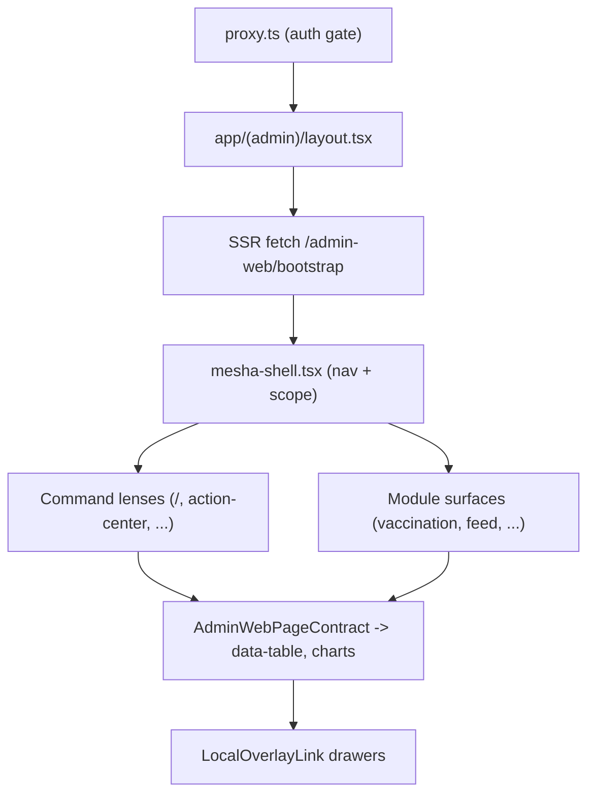

# Admin-Web Frontend

**Module path:** `apps/admin-web/`
**Generated:** 2026-09-13

---

## What this module is doing

Admin-web is the browser console for everyone who runs the farm from a desk — leadership doing oversight and approvals, verifiers reviewing proof, and staff authoring config. It is a Next.js 16 / React 19 application, server-rendered, and its single most important characteristic is what it is *not*: it is not the owner of any business truth. Every page title, table column, filter option, chip, empty-state sentence, and disabled-reason it shows is composed by the backend and rendered verbatim. Admin-web owns layout, CSS, icon rendering, and local open/closed state — nothing more.

This "renderer, not truth-owner" stance is the golden frontend rule of the whole platform, and it is what makes the same business number identical on the web and on the phone: both surfaces render backend contracts, so a disagreement is a backend bug, never a client fix. The practical mechanism is a single server-side fetch of `/admin-web/bootstrap` at page load, which returns the navigation, the actor's identity and scope, and a per-route `AdminWebPageContract` describing exactly which tables, columns, filters, and controls to draw.

The information architecture is deliberate: five **command lenses** (Control Tower at `/`, Action Center, Calendar, Protocol Adherence, Workflows) sit at the top level as cross-module screens, while verticals (vaccination, feed, weighing, counts, health, procurement, sales, people, config) are module surfaces. A guard forbids nesting a command lens under a vertical.

---

## Core capabilities

**Contract-driven rendering.** The generated types in `lib/api/server.ts` (a large file holding `AdminWebBootstrapResponse`, `AdminWebPageContract`, and per-page table/field/control definitions) are the shape of the backend's authored UI. Components read `tables[].columns[].label`, `option_groups[].options[]`, and `controls[].disabled_reason` and render them, never hardcoding a business label. A CI guard (`check-ui-contract-literals.mjs`) forbids stray literal labels, and `check:mock-fidelity` enforces that the rendered anatomy matches the authoritative mock.

**Firebase auth at the edge.** `proxy.ts` middleware validates the Firebase ID-token cookie and redirects to `/login` when absent or expired; `lib/auth/*` manages the token lifecycle (id + refresh cookies) and mints a bearer for SSR fetches. Auth is handled before a page renders, so the bootstrap fetch always runs authenticated.

**Same-page overlays without a route refetch.** The `LocalOverlayLink` + `local-overlay-drawer` pattern opens a detail drawer via local state — no new App Router page payload, no RSC refetch, no loading flash — with Back/Escape/scrim close. This is enforced (`admin-web-local-overlay-guard`) because query-only links or router pushes to toggle an overlay were a recurring defect.

**Scope chrome owned by the shell.** The park selector and "as of" date live only in the top-bar shell (`mesha-shell.tsx`); page bodies never duplicate park/date chips, so scope has one source of truth.

**Server-rendered charts and cursor pagination.** Charts render as server SVG components (`svg-series.tsx`, `svg-bars.tsx`) reading CSS variables; tables paginate by cursor (~20 rows) via `worklist-pager.tsx`, never a full-table COUNT.

---

## Key components

| Component | File path | Responsibility |
|-----------|-----------|----------------|
| Bootstrap types | `apps/admin-web/lib/api/server.ts` | Generated backend UI contract |
| API client | `apps/admin-web/lib/api/client.ts` | Bearer-auth HTTP client + telemetry |
| Auth middleware | `apps/admin-web/proxy.ts`, `lib/auth/*` | Firebase cookie gate + bearer mint |
| App shell | `apps/admin-web/components/mesha-shell.tsx` | Nav, breadcrumb, park/date scope bar |
| Overlay pattern | `apps/admin-web/components/local-overlay-link.tsx`, `local-overlay-drawer.tsx` | Same-page drawers |
| Data table | `apps/admin-web/components/data-table.tsx` | Contract-driven table |
| Command lenses | `apps/admin-web/app/(admin)/{page,action-center,calendar,protocol-adherence,workflows}` | Top-level cross-module screens |

---

## Directory structure

The App Router tree under `app/(admin)/` holds the authenticated routes; `features/` (about 31 directories) holds feature logic; `lib/` holds the contract types, auth, and formatting helpers; `components/` holds shared UI; and `scripts/` holds the CI guards. The split matters: routes are thin, features carry page logic, and `lib/api/server.ts` is the single place the backend contract lands.

---

## How it consumes the backend contract

At page load, `proxy.ts` confirms auth, then SSR fetches `/admin-web/bootstrap`, which returns nav chrome, visible navigation (titles, labels, empty/error copy), the actor and operator profile, and per-route page contracts. Components render those contracts directly: table headers from the contract's column labels, filter options from its option groups, disabled tooltips from its controls' disabled reasons. Because the backend also unions permissions and capability-gates every control, a page renders a control disabled with its backend reason rather than hiding it — so a reader sees *why* they cannot act, and a role never gets a different component, only a different contract.

---

## Notable patterns and rules

The console follows a handful of hard rules, each with a machine guard. **No hardcoded business copy** — labels come from the contract (`check-ui-contract-literals.mjs`). **Mock fidelity** — the rendered structure must match `mock/goatos-dashboard-mock.html` (`check:mock-fidelity`), the single UI/UX source of truth (structure, not just color). **Command lenses stay top-level** — never nested under a vertical (`check-ia-guard.mjs`), with a small allowlist of recorded module-surface exceptions (`/feed/config`, `/health/config`, `/sales/config`, and the five per-module SOP routes). **No SSR full-table walk** — a helper that drains a paginated endpoint into one array to compute a KPI is banned (`admin-web-request-reads-guard`); read a summary endpoint instead. **Dates render DD/MM/YYYY** via `lib/format.ts`, never a hand-rolled format. And **UI work requires real-surface proof** — a change is not done until the exact route is reloaded in Chrome after the final edit and verified at both laptop and mobile widths.

---

## Interaction with the backend

| Backend surface | Purpose |
|-----------------|---------|
| `/admin-web/bootstrap` | Nav, actor, per-route page contracts |
| module read endpoints | Table/chart data for each page |
| `/api/proof-media/*` | Signed proof download URLs (tap-triggered) |
| verification routes | Verifier queue + verdict (verifier lens) |

## Performance considerations

Admin-web is read-mostly SSR plus client-side React Query for interactive lists, so most pages render on the server with the contract already resolved. Hot reads honor the platform's sub-500ms budget; tables use cursor pagination rather than counting large sets; and charts are server-rendered SVG to avoid heavy client chart libraries on first paint. Proof media is never auto-loaded — bytes move only on an explicit user action, keeping a list render from triggering egress.

## Implementation highlights

The console's defining achievement is discipline: by treating itself as a pure renderer of backend-authored contracts, it guarantees cross-surface number parity with the phone, ships product changes without a deploy, and makes role-scoped UI a matter of capability-gated contracts rather than role conditionals scattered through components. The `LocalOverlayLink` pattern and the top-bar-only scope chrome are the small ergonomic touches that keep that discipline from feeling heavy — detail opens instantly, and scope has exactly one home.
