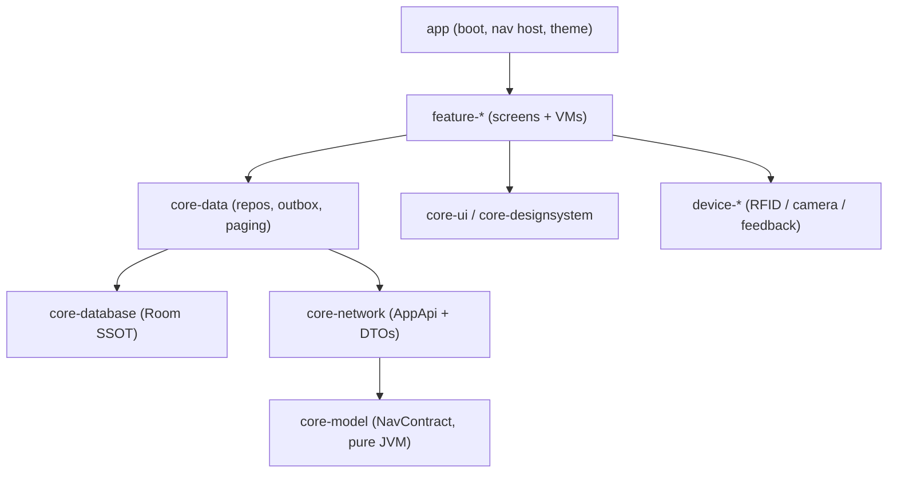

# Android Mobile App

**Module path:** `apps/goatos-android/`
**Generated:** 2026-09-13

---

## What this module is doing

The Android app is the farm's field surface — the phone in an operator's hand that scans RFID tags, records proof videos, and captures the work as it happens. Leadership and CEO-facing work belongs in admin web, CEO AI, and investor analytics; Android remains the field execution surface. It is one common, role-aware native application for field execution: roles arrive at runtime from `/app/bootstrap`, and the environment (dev/staging/prod) is a build flavor, so there is no separate "operator app" and "manager app." It is native Kotlin with Jetpack Compose, and its two defining characteristics are that it is **offline-first** (the field has no reliable network) and that it, like admin-web, is a **renderer of the backend contract**, not an owner of business truth.

Offline-first here is literal and structural: Room is the single source of truth for every read screen. The UI renders from the local Room cache instantly, a background refresh revalidates, and writes go to a local outbox that drains with stable idempotency keys when the network returns. An operator who scans twenty animals in a dead zone loses nothing and duplicates nothing. Reads never show a blank loading wall when cached data exists.

The codebase is 22 Gradle modules with a strict dependency rule — `feature-*` may depend only on `core-*`, never on another feature, and vendor SDKs (Chainway RFID, CameraX, haptics) are quarantined behind `device-*` ports. This is what lets the app be extracted to its own repository with the OpenAPI contract as its only backend coupling.

---

## Core capabilities

**Backend-driven navigation.** `core-model`'s `NavContract.kt` (pure JVM) mirrors `/app/bootstrap`: `NavChrome` (expanded drawer for 2+ modules, minimal bottom bar for one), `NavItem`, `NavModule`, `NavState`. `GoatOsShell` renders this state directly — the app never counts modules or checks roles locally; selecting a module in the drawer swaps the bottom bar from data already cached in the module DTO, with no second network call.

**Offline-first reads.** `core-data`'s `BootstrapRepository` (and its per-feature siblings) cache backend reads to Room and expose them as Flows the ViewModel observes; a refresh-on-open upserts Room, which re-emits. The `RefreshOnResume` composable fires a background refresh every time a screen is resumed, and `SyncIconButton` spins and disables while a refresh is in flight so duplicate taps cannot race.

**Outbox writes with idempotency.** Mutations write Room first, then queue in the outbox; the sync engine drains with a stable idempotency key per operation, so a retry is safe and the server can return an idempotent-replay result rather than double-applying.

**Keyset pagination, ~20 rows.** Every list (tasks, calendar, weighing, verification) paginates by cursor at about twenty rows via Room `PagingSource` + `RemoteMediator`, so neither the network nor the DB ever over-fetches. Calendar overviews render day *markers* (dots) from a backend marker set, never by fetching a day's events to draw the grid.

**Vendor-isolated capture.** `device-rfid`, `device-camera`, and `device-feedback` expose ports with fakes; feature code is vendor-agnostic. Proof media plays through an ExoPlayer built over the same authenticated OkHttp client, and remote bytes move only on explicit user action.

---

## Key components

| Component | File path | Responsibility |
|-----------|-----------|----------------|
| Nav contract | `apps/goatos-android/core/core-model/.../nav/NavContract.kt` | Backend-driven nav state (pure JVM) |
| AppApi port | `apps/goatos-android/core/core-network/.../AppApi.kt` | One suspend method per endpoint + DTOs |
| Bootstrap repo | `apps/goatos-android/core/core-data/.../BootstrapRepository.kt` | Room cache + refresh |
| App shell | `apps/goatos-android/app/.../ui/GoatOsShell.kt` | Renders nav chrome, module switch |
| Room database | `apps/goatos-android/core/core-database/.../GoatDatabase.kt` | Offline single source of truth |
| Shared UI | `apps/goatos-android/core/core-ui` | `RefreshOnResume`, `SyncIconButton` |
| Device ports | `apps/goatos-android/device/{device-rfid,device-camera,device-feedback}` | Vendor SDK isolation |

---

## Module structure

The 22 modules split into a thin `app` (boot, DI, nav host, theme), a `core-*` layer (model, common, design system, ui, network, database, datastore, data, analytics, notifications, media, testing), a `feature-*` layer (auth, calendar, vaccination, counts, health, feed, weighing, scan, submit, verify, sheds, and more), and a `device-*` layer for vendors. `core-model` and `core-common` are Android-free pure JVM; vendors live only in `device-*`.

---

## How it consumes the backend contract

At launch, a ViewModel asks `BootstrapRepository` for nav state; the repository serves the Room-cached `/app/bootstrap` immediately and refreshes in the background. The `BootstrapDto` carries nav chrome, visible navigation, modules (each with its own bottom-bar items), the actor and operator profile, device state, feature flags, the minimum supported version, and the feed-water-removal cutoff time. `GoatOsShell` renders that state verbatim; each feature screen then reads its own endpoint contract (task form DSL, execution rows, verification items) the same way. The app makes no business decisions — it renders nav state and feature contracts.

---

## Notable patterns and rules

The app is governed by hard rules with machine guards. **Room is the single source of truth** — a network-only read repository is banned; new read models ship with their Room entity, DAO, and Flow from day one. **Every read screen is refresh-on-open** via `RefreshOnResume`. **Room migrations are upgrade-safe** — every schema bump ships its `Migration` plus both an equivalence test and an upgrade-crash test (`room-migration-guard`), because an added entity with no migration crashes every in-place upgrade. **Lists fetch one screen-page** (~20 rows), never 50/200/1000 (`mobile-guard`), and in-heap caches are bounded (`android-bounded-memory-guard`). **Navigation is a hosted stack** where only backend-composed L0 destinations own the bottom bar/drawer (`android-navigation-stack-guard`), and feature entry points live in the bar or drawer, never the top-right app bar (`nav-entry-point-placement-guard`). Proof media follows the egress rules — stable `mediaIdentity`, tap-triggered downloads, no auto-preview. And a UI change is not done until it is verified on the physical device or emulator after the final edit.

---

## Interaction with the backend

| Backend surface | Purpose |
|-----------------|---------|
| `/app/bootstrap` | Nav state, actor, device state, feature flags |
| `/app/tasks`, `/app/pc-care/*`, `/app/weighing/*` | Feature contracts + submits |
| `/verification/*` | Verifier queue + verdict (verifier role) |
| proof upload endpoints | Signed blob upload (chunked) |
| FCM | Push delivery + deep-link routing |

## Performance considerations

The app never over-fetches: keyset pagination bounds both the network page and the observed Room window, per-field parsing happens once off the main thread, and calendar grids draw from day markers rather than day events. Memory is bounded by `LruCache`/TTL'd Room JSON caches and filtered DAO reads. Offline reads render from Room with no loading wall, and the sync engine batches outbox drains rather than one request per queued write. Version gating from `app_min_supported_version` blocks a stale build before it can send incompatible writes.

## Implementation highlights

The app's best design is the marriage of two disciplines: it is offline-first (Room SSOT + outbox with idempotency keys) *and* backend-contract-driven (nav and screens rendered from `/app/bootstrap` and per-feature contracts). Together these give the field the reliability it needs — no lost scans, no duplicate submits, instant reads with no blank walls — while keeping the phone in lockstep with the web console on every business number, because both are renderers of the same authored truth. The vendor isolation behind `device-*` ports is the quieter win: the RFID and camera SDKs can change without touching a single feature screen.
