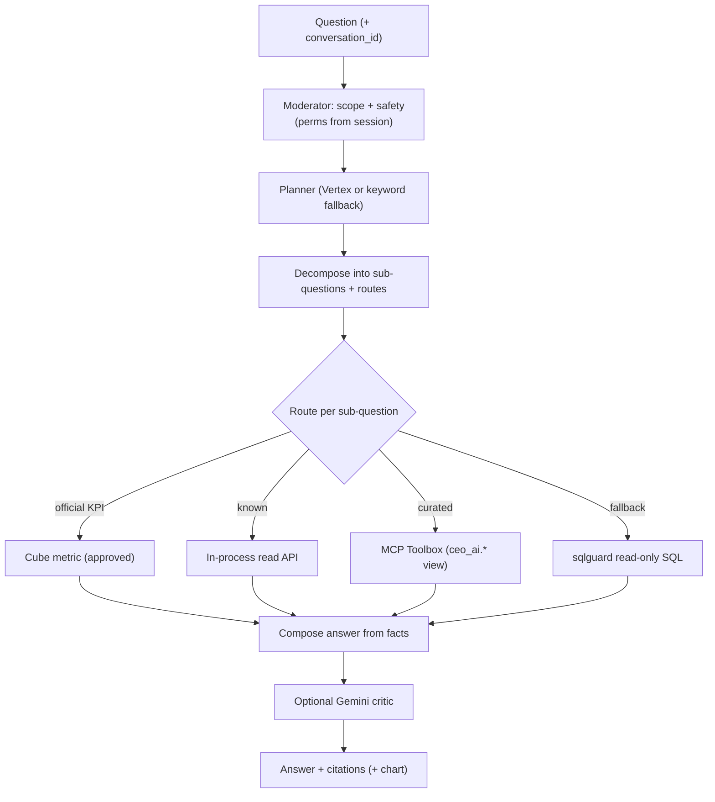

# CEO AI & Analytics

**Module paths:** `backend/internal/ceoai/`, `backend/internal/analytics_export/`, `backend/internal/appanalytics/`, `backend/internal/appconfig/`
**Generated:** 2026-09-13

---

## What this module is doing

The CEO AI is the leadership assistant — a tenant-scoped, strictly read-only conversational layer that answers a director's plain-language question ("how many kids are overdue for their booster in Coimbatore?") by routing the question through governed data sources and grounding every number in real evidence. It is the "ask the farm a question" surface, and its defining constraint is that it can only ever *read*. It never mutates business data, its tenant and role scope come from the authenticated session and never from the user's text, and its answers cite where each fact came from.

The reason this is a whole module rather than a thin wrapper around a language model is that trustworthy answers require a disciplined routing hierarchy. The assistant does not just run SQL a model invents. It routes: an official KPI goes to a **Cube** metric (governed, approved); a known question goes to an in-process read API; a curated question goes to an MCP Toolbox tool backed by a `ceo_ai.*` reporting view; and only as a last resort does a sqlguard-validated read-only SQL fallback run. Each step is labeled with its metric status (approved vs. draft), so leadership always knows whether a number is an official KPI or a best-effort read.

Around the assistant, `analytics_export` handles bulk report and BigQuery egress, `appanalytics` tracks usage, and `appconfig` holds tenant settings like the feed-and-water-removal cutoff time.

---

## Core capabilities

**Governed route hierarchy.** `ceoai/domain/types.go` models a `Route` (Cube → API → Toolbox → SQL) and a `Mode` (planned via the Vertex planner, fallback via a deterministic keyword planner when Vertex is down, refused for scope/safety, partial for step budget). A `MetricStatus` of approved or draft accompanies every result so official KPIs are distinguished from labeled drafts.

**Grounded answers with citations.** An `Answer` carries text, source, mode, request id, conversation id, citations, and an optional chart — and both the text and the chart are built only from `ToolResult` facts, never fabricated. Each `Citation` records the surface, route, freshness (`as_of`), and metric status.

**The orchestrator loop.** `app/orchestrator.go`'s `Ask` (`:57`) and `AskStream` run a bounded loop (default 6 steps, 25s wall clock): a moderator checks scope and safety, memory supplies conversation context, the provider plans and decomposes into sub-questions with route assignments, tools execute Cube-first, the answer is composed from facts, an optional Gemini critic reviews, and an audit sink logs the trace (never exposed to the client).

**The read-only boundary.** The `ceo_ai.*` schema is a set of reporting views (about 20, e.g. `ceo_ai.vaccination_obligations_base`, `ceo_ai.feed_adherence`, `ceo_ai.procurement_pipeline`) that the assistant and Cube consume. A core operator read path must *never* join `ceo_ai.*` for its own runtime data — a boundary enforced by `make ceo-ai-boundary-guard`, because doing so once 500'd Control Tower when the schema was absent.

---

## Key components

| Component / type | File path | Responsibility |
|------------------|-----------|----------------|
| `Answer` / `Citation` | `backend/internal/ceoai/domain/types.go` | Grounded answer with sources |
| `Route` / `Mode` | `backend/internal/ceoai/domain/types.go` | Cube→API→Toolbox→SQL hierarchy, planner mode |
| `Ask` / `AskStream` | `backend/internal/ceoai/app/orchestrator.go:57` | Bounded plan→execute→compose loop |
| Cube / Toolbox / sqlguard adapters | `backend/internal/ceoai/adapters` | Metric, curated tool, and safe-SQL clients |
| `ceo_ai.*` views | `backend/migrations/postgres` | Read-only reporting schema |

---

## Internal data flow

The Cube-first ordering is the design's integrity: whenever an official metric exists, it is preferred over ad-hoc SQL, so leadership sees the governed number rather than a model's improvisation, and the fallback SQL is both last-resort and sandboxed by sqlguard.

---

## Key interfaces and extension points

The assistant is a composition of ports — `AIProvider`, `MetricService` (Cube), `Moderator`, `ConversationStore`, `MemoryStore`, `Toolbox`, `SQLGuard`, `AuditSink`, `Reviewer` — so each concern is swappable. The extension model for *coverage* is the leadership-assistant coverage rule (`make leadership-assistant-coverage-guard`): any new leadership-relevant table, read API, or KPI must resolve to a Cube metric, a `ceo_ai.*` view, an MCP tool, a mapped read API, or a documented exclusion — in the same change — with the whole planner → catalog → wiring → reader chain proven live (route closure).

---

## Interaction with other modules

| Module | Direction | Interface | Notes |
|--------|-----------|-----------|-------|
| all read models | reads (only) | `ceo_ai.*` views, Cube, read APIs | Never mutates; never joined by core paths |
| permissions | gated by | session scope + role | Perms resolved server-side, never from text |
| analytics_export | sibling | BigQuery egress | Bulk reports |
| appconfig | sibling | tenant settings | e.g. feed cutoff time |

---

## Cross-module collaboration scenarios

**In a leadership question**, the orchestrator decomposes "which pens are behind on deworming?" into sub-questions, routes each to its best source (a Cube adherence metric if one exists, otherwise a `ceo_ai.feed_adherence`-style view via the Toolbox), composes an answer grounded only in the returned facts, attaches citations with freshness and metric status, and — if the answer is plot-worthy — a chart built solely from the dimensioned series. The whole turn is read-only and audited.

**In the boundary discipline**, the same `ceo_ai.*` views the assistant reads are strictly walled off from operator screens: a Control Tower read may not join a `ceo_ai_*` table for its runtime data, and shared display logic (like vaccine labels) lives in a neutral core package read by both, so the reporting layer never becomes a load-bearing dependency of the operational path.

---

## Performance considerations

The orchestrator is bounded by a step budget and a wall clock, with rate limiting and optional result caching, so a runaway plan cannot consume unbounded resources. Cube metrics and `ceo_ai.*` views are pre-aggregated reporting surfaces, keeping the assistant's reads off the raw event tables. The keyword fallback planner is deterministic and requires no model call, so the assistant degrades to a working (if simpler) mode when Vertex is unavailable rather than failing outright.

## Implementation highlights

The assistant's best design decision is that *governance is structural, not aspirational*. By making the route hierarchy Cube-first, grounding every fact in a cited `ToolResult`, resolving permissions from the session rather than the prompt, and walling the `ceo_ai.*` schema off from operational reads with a machine guard, the module gives leadership a natural-language interface that cannot invent numbers, cannot exceed the asker's authority, and cannot quietly become a dependency the operational farm relies on to stay up.
