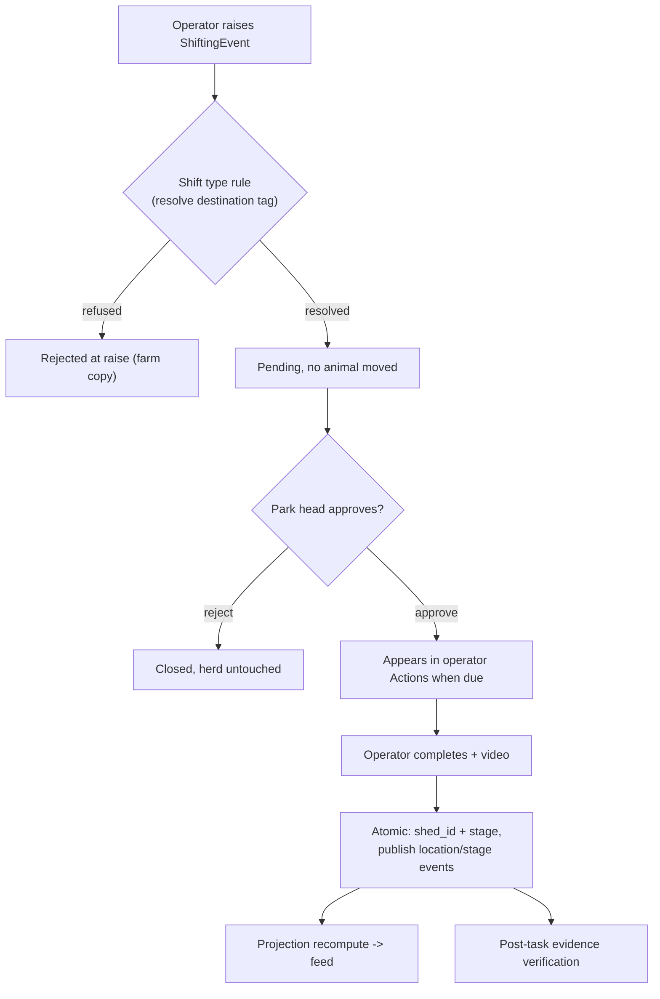

# Counts & Movement

**Module paths:** `backend/internal/counts/`, `backend/internal/countsbridge/`, `backend/internal/movement/`, `backend/internal/breeding/`
**Generated:** 2026-09-13

---

## What this module is doing

Counts answers "who is in each pen right now, and who is allowed to change that?" It is the module that keeps the projected live herd composition — how many animals of each breed, stage, sex, and age class sit in each pen — and it is the gatekeeper for the three events that change that composition: births, deaths, and shifting (animals moving between pens). Its output is consumed directly by feed direction (the projected head count *is* the number of mouths the ration grid multiplies) and it publishes the location and stage events that ripple into vaccination.

Two design decisions define the module. First, **approve-first**: an operator can *raise* a birth, death, or movement, but nothing changes in the herd register until a park head approves it. Recording a movement writes a pending event and moves no animal; only approval plus operator completion applies the change atomically. This exists because an unapproved movement that had already moved animals — or burned a proof video — was a real, expensive failure mode. Second, **the shift type decides the tag**: rather than asking the raiser to choose an animal's destination stage, the *category* of the shift (health, growth, breeding, delivery, spacing, flushing, normal) is the rule selector, and the backend resolves what the tag becomes.

`countsbridge` is the composition layer that connects counts to the shared verification module; `movement` and `breeding` are reserved placeholders whose function is folded into counts' shifting and projection logic.

---

## Core capabilities

**A projected herd read model.** `ProjectionSnapshot` (`backend/internal/counts/domain/types.go:104`) is an immutable count state at a target date, built from `BaseCountAnchor` physical scans (`:25`) plus approved `ShiftingEvent` movements (`:44`). Feed direction reads this snapshot, so the projection is where "mouths per pen" becomes a durable, auditable fact.

**Typed-raise shifting rules.** `domain/shifting_type.go:37` defines the seven shift types and, for each, a `ShiftTypeDecision` (`:148`) that resolves the destination tag: *health* stamps a clinical destination tag (the one type allowed to); *growth* stamps forward along the authored lifecycle ladder (`:72`) with sex-gating (`:88`); *breeding* never changes the tag; *delivery* stamps except the newborn stage; *spacing* moves the whole pen carrying its tag; *flushing* moves females onto the Flushing tag; and *normal* is the plain move where the tag never changes. A raise the rule refuses is rejected at raise time with backend-owned farm copy — before approval, before any video.

**The approval workflow.** `domain/approval.go:61` models an `ApprovalRequest` (pending → approved/rejected) with a raiser and an approver. On approval, the completion transaction atomically updates `goats.shed_id` and, when the shift type dictates, `management_stage`, writes identity audit, and publishes per-animal `goat.location.changed` and `goat.stage_changed` events.

**Pen reconciliation.** When a weighing shed submission completes, counts raises one reconciliation card per scanned tag whose registered pen does not match where it was weighed — the "wrong pen" signal, deduplicated per animal.

**Milk preparation and feeding tasks.** The module also owns the milk prep/feeding capacity tasks keyed at partition grain.

---

## Key components

| Component / type | File path | Responsibility |
|------------------|-----------|----------------|
| `BaseCountAnchor` | `backend/internal/counts/domain/types.go:25` | A physical count scan (no herd change) |
| `ShiftingEvent` | `backend/internal/counts/domain/types.go:44` | Append-only movement header + authorization state |
| `ProjectionSnapshot` | `backend/internal/counts/domain/types.go:104` | Immutable per-grain head count for feed |
| `ApprovalRequest` | `backend/internal/counts/domain/approval.go:61` | Birth/death/shifting approval gate |
| shift types + ladder | `backend/internal/counts/domain/shifting_type.go:37`, `:72` | Tag decision per category, growth ladder |
| shifting verification enqueue | `backend/internal/countsbridge/shifting_verification_enqueue.go` | Bridge to verification queue |

---

## Internal data flow

The flow shows a shifting movement from raise to applied, which is the module's most characteristic path. Note that the herd register changes only at the very end, inside one atomic transaction.

The two gates are the whole point. The rule gate at raise time means an operator cannot even submit a movement a rule would refuse (an ICU stamp by a non-health shift, a wrong-sex growth stage). The approval gate means the herd register — and any feed or vaccination that reads from it — only ever reflects authorized reality.

---

## Key interfaces and extension points

Counts exposes a `Repository` port plus a `ShiftingVerificationEnqueuer` fulfilled by `countsbridge`, and consumes goat lifecycle events through a projection event handler. The shift-type rulebook (`domain/shifting_type.go`) is the primary extension point: adding or changing a category's tag behavior is a domain-only change with mutation-tested pins, and the same resolver is used at raise time and at apply time so the park head approves exactly the stage the completion applies. The projection recompute is a separate concern so a new read dimension can be added without touching the write path.

---

## Interaction with other modules

| Module | Direction | Interface | Notes |
|--------|-----------|-----------|-------|
| identity | emits/consumes | `goat.location.changed`, `goat.stage_changed` | Apply updates the canonical goat |
| feed direction | produces to | `ProjectionSnapshot` | Projected head count = mouths per pen |
| vaccination | emits to | stage/location events | Rescopes open work, re-evaluates eligibility |
| verification | produces to | shifting proof, pen reconciliation | Post-task evidence review |
| weighing | consumes | `weighing.shed_submission.completed` | Raises pen-reconciliation cards |
| health | emits to | `counts.death.reported` | Death routes to health case state |

---

## Cross-module collaboration scenarios

**In the feed projection**, counts counts *authorized-and-pending* shifting movements toward the next feed sheet the moment a park head authorizes them, excluding only *applied* movements (whose animals already sit in the destination in canonical `goats`). This authorized-plus-pending-minus-applied arithmetic (`counts/adapters/postgres/feed_projected_counts.go`) is what keeps a destination pen from being either double-fed or under-fed during the window between authorization and completion.

**In the shifting → vaccination handoff**, the apply transaction publishes `goat.location.changed` and `goat.stage_changed`; vaccination consumes the result twice — first to rescope open shed-scoped work while preserving in-progress history, then to re-evaluate clinical eligibility and schedule. A real shifting-completion → vaccination end-to-end test is mandated (`AGENTS.md`), because separate producer and consumer tests are not considered closure.

---

## Performance considerations

The projection is a materialized snapshot rebuilt on recompute rather than reconstructed per read, keeping feed direction's read cheap. Shifting events are append-only, so history is never mutated. The pen-reconciliation card carries a unique index per animal so duplicate weighing submissions are idempotent. All of this stays within the scale envelope by pre-aggregating on the write/recompute path rather than computing composition on read.

## Implementation highlights

The elegant idea here is that the *type of movement* is a complete rule specification. By making the seven shift types the single selector for what happens to an animal's tag — and resolving that decision at raise time with the same function used at apply time — counts guarantees the park head approves exactly the outcome that will occur, eliminates the raiser's freedom to invent an impossible stage, and keeps the whole tag-transition rulebook in one mutation-tested domain file rather than scattered across the UI and the write path.
