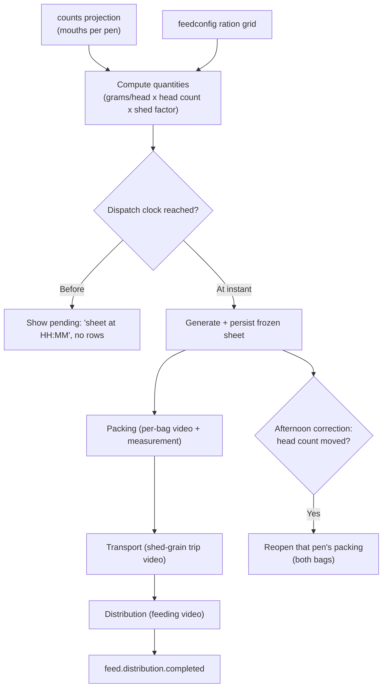

# Feed Direction

**Module paths:** `backend/internal/feeddirection/`, `backend/internal/feedconfig/`, `backend/internal/feed/`, `backend/internal/feedwaterremoval/`
**Generated:** 2026-09-13

---

## What this module is doing

Feed direction answers two linked questions — "how much do we feed each pen today?" and "did it actually get fed?" — and the interesting part is that it treats a feed sheet the way an accountant treats a ledger: once issued, it is frozen. The module takes two inputs, the projected number of mouths in each pen (from `counts`) and the authored ration grid (from `feedconfig`), multiplies them into exact per-session quantities, and then *freezes* that sheet at a dispatch clock. From that moment the sheet is the truth the packers work from, and a movement approved later in the day cannot silently re-price it out from under them.

This is the largest module in the backend (~68 files) because it is really four coordinated workflows: **direction** (compute and freeze the sheet), **packing** (weigh out each pen's bags), **transport** (stage feed outside the sheds), and **distribution** (actually feed the animals) — each gated behind its own verification video. `feedconfig` owns the authored ration data; `feed` holds execution records; and `feedwaterremoval` owns the fasting-cutoff config that both weighing and PC Care lean on.

The design tension the module manages is between *authored zero* and *missing config*, and between a *generation grain* and a *serving grain*. Both are solved with deliberate representations rather than conventions, because both were sources of real bugs.

---

## Core capabilities

**Quantity computation with a safety-typed result.** The domain distinguishes `QuantityResolved` from `QuantityBlocked` (`backend/internal/feeddirection/domain/types.go:58`). A resolved quantity may legitimately be zero ("feed nothing today"). A *blocked* quantity — missing ration rate, unknown shed tag, unknown ration group, no session template, invalid shed factor — is represented as an `ItemQuantity` with a `nil` `QuantityKg` pointer (`:219`), so a configuration gap literally cannot be summed or rendered as `0`. The pointer *is* the safety mechanism.

**Two grains, collapsed on serve.** A `DirectionRow` (`:259`) is generated at the ration-lookup grain (park, shed+partition, shed tag, breed) × session but *served* collapsed to one row per operational location per session via `CollapseDirectionRowsByLocation`. Sex is deliberately absent from the grain — the ration lookup is not keyed on sex, so carrying it would split one feeding instruction into two half-sized rows the operator would have to re-add.

**The dispatch gate (freeze on first read).** `app/lifecycle_gate.go` implements the defining behavior: before the day's dispatch instant the screen shows a pending lifecycle with "sheet arrives at HH:MM" and *no rows*; at the instant the first read generates and persists the frozen sheet; every later read serves the frozen rows. A horizon guard ensures past days never freeze-on-read (which would stamp today's herd onto counts that are gone), and `PersistIssue` is idempotent so concurrent first-reads are safe.

**Per-stage verification gates.** `packing_service.go` (per-bag shed-session, one video, with per-feed-item measurement entries the verifier confirms), `distribution_service.go` (proof video → `feed.distribution.completed`), `transport_service.go` (one shed-grain trip), and `wastage_service.go` each drive a stage through the verification queue.

---

## Key components

| Component / type | File path | Responsibility |
|------------------|-----------|----------------|
| `QuantityResolved` / `QuantityBlocked` | `backend/internal/feeddirection/domain/types.go:58` | Authored-zero vs missing-config distinction |
| `ItemQuantity` (nil-pointer safety) | `backend/internal/feeddirection/domain/types.go:219` | Blocked quantity cannot be summed as 0 |
| `DirectionRow` + collapse | `backend/internal/feeddirection/domain/types.go:259` | Generation grain vs serving grain |
| dispatch gate | `backend/internal/feeddirection/app/lifecycle_gate.go` | Freeze the sheet at the dispatch instant |
| packing service | `backend/internal/feeddirection/app/packing_service.go` | Per-bag verification gate + measurement |
| transport / distribution / wastage | `.../app/{transport,distribution,wastage}_service.go` | Downstream stage gates |
| ration grid | `backend/internal/feedconfig` | Authored group × tag × item → grams/head |

---

## Internal data flow

The flow below shows one feed day from projection to a distributed, verified meal. The freeze point in the middle is the conceptual center of the module.

The afternoon correction branch is where the frozen-sheet discipline earns its keep: only pens whose *head count* actually changed are reopened, and both the morning and evening bags come back because head count scales both. Experiment pens and unchanged pens are left alone.

---

## Key interfaces and extension points

The module's ports are `Repository`, `CountsProjectionReader` (the immutable projection snapshot it prices against), `FeedConfigReader` (the ration grid), and `Schedule` (the per-park, per-workflow dispatch clocks). The `Schedule` port is the extension seam for timing policy — a park or route may enforce a stricter dispatch than the default. The verification gates compose through the shared verification module rather than a private queue, so a new feed stage is an added service plus a registered category, not a new pipeline.

---

## Interaction with other modules

| Module | Direction | Interface | Notes |
|--------|-----------|-----------|-------|
| counts | reads from | `CountsProjectionReader` | Frozen projection snapshot = mouths per pen |
| feedconfig | reads from | `FeedConfigReader` | Ration grid, session templates, shed factors |
| verification | produces to | packing/distribution/transport/wastage items | Verifier approves each stage |
| notification | produces to | feed packing reopen; sale feed-reduce notice | Downward + directed pushes |
| feedwaterremoval | provides | fasting cutoff config | Consumed by weighing + PC Care |

---

## Cross-module collaboration scenarios

**In the daily feed chain**, feed direction consumes the *frozen* counts projection — which itself counts authorized-but-unexecuted shifting movements as pending feed inputs the moment a park head authorizes them (a raised movement counts toward the sheet before approval per the 2026-08-10 correction rule). This is why a movement raised at 09:00 can feed a destination pen the same day even though the normal sheet was issued at 07:00: the afternoon correction reopens the affected pens.

**In the verification-measurement flow**, packing hands the verifier per-feed-item entry boxes; the verifier types the packed weight and it rides the *approve* (there is no separate save button — a 2026-08-20 lock). A packed weight more than 500g from plan triggers a one-time warning naming only the direction, never the plan, so the verifier is warned but not told (2026-09-09).

---

## Performance considerations

Direction computation is a bounded join over the projection snapshot and the ration grid, and the frozen sheet means the expensive computation happens once per feed day per park, not per read. Serving reads are keyset-paginated with shed-batch filters capped at 500 items, and the collapse-by-location happens on read so the stored rows stay at the fine ration grain for auditability. The transitional concentrate-merge folds (a temporary reporting-only feature, `docs/decisions/feed-stock-transitional-concentrate-merge.md`) are read-side only and touch no write path.

## Implementation highlights

The nil-pointer `QuantityKg` is the small design choice with the biggest payoff: by making a blocked quantity *unrepresentable* as a number, the type system itself prevents a missing ration rate from ever being summed into a total or shown as "0 kg." Combined with the freeze-on-first-read dispatch gate — which turns the audit question "what quantity did we tell the packer?" into a stored fact rather than a re-derivation — the module achieves ledger-grade honesty about a workflow that changes many times a day.
