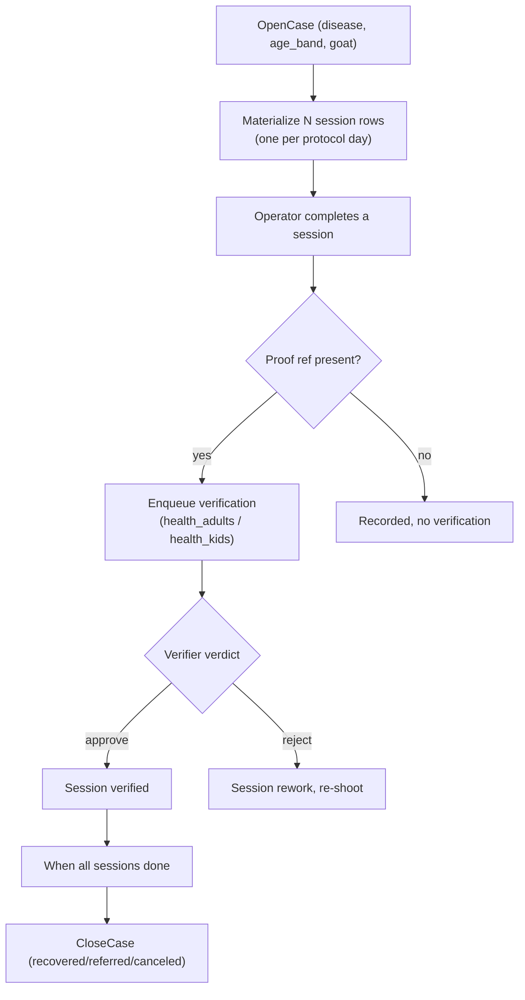

# Health

**Module path:** `backend/internal/health/`
**Generated:** 2026-09-13

---

## What this module is doing

The health module runs clinical treatment: when an animal is diagnosed with a disease, it opens a case, schedules the multi-day course of treatment as a set of sessions, captures video evidence at each session, and routes the completed sessions to the verifier for approval. Where vaccination is *preventive* (a schedule that runs whether or not an animal is sick), health is *reactive* — it starts from a diagnosis and follows an authored treatment protocol day by day until the case closes with an outcome.

Its most important design property is **protocol immutability**: a treatment protocol is versioned and never edited in place. Editing builds a draft; publishing promotes it and retires the version it replaces. A case pins the protocol *version* at diagnosis (`health_protocol_version_id`), so an animal mid-treatment finishes on the dosages it started on, and the exact version it was treated under stays readable forever. This is a medical-safety property, not an implementation preference — an in-place edit could change the dose an animal currently being treated receives, which is why the one-time Google-Sheet bootstrap fails closed once any version carries an app-authoring source ref.

The health director authors these protocols through `/health/config` (a recorded module-surface exception), holding `health.config.read`/`health.config.write` — a distinct authority from the vaccination protocol path, because preventive care and health are separate departments that must not merge.

---

## Core capabilities

**Versioned treatment protocols.** A `Protocol` carries a version, an age band (adult/kid), a duration in days, and an ordered list of `ProtocolStep`s (day, session, record type medicine or critical action, with medicine name, dosage, route, and instruction). Publishing retires the prior version; a draft has no operational effect.

**Case opening with session materialization.** `app/service.go`'s `OpenCase` (`:49`) creates a `health_cases` row and materializes one session row per protocol day *up front* (idempotent on an idempotency key), returning the case id and session count. Sessions exist from case open, not on demand, so the treatment schedule is fully visible immediately.

**Session work and evidence.** `ListWorkItems` filters sessions by age band, date, status, disease, park, and shed; `CompleteWorkItem` records the operator, timestamp, and an optional proof ref. When a proof ref is present, it enqueues exactly one verification item through the `TreatmentVerificationEnqueuer`, keyed on session id + proof ref so a rework with a new clip replaces the item. If the enqueuer is unwired, completion fails *closed* before the write rather than stranding an item.

**Age-band verdict routing.** The verification category is `health_adults` or `health_kids`, chosen by the session's age band, so the verifier's queue is scoped correctly.

**Case closure with outcome.** `CloseCase` records recovered, referred, or canceled — a one-way transition; "continued" is not a closure and requires further session materialization.

---

## Key components

| Component / type | File path | Responsibility |
|------------------|-----------|----------------|
| `Protocol` / `ProtocolStep` | `backend/internal/health/domain/types.go` | Versioned, immutable treatment recipe |
| `WorkItem` | `backend/internal/health/domain/types.go` | One treatment session (due/in_progress/completed/rework/held) |
| `OpenCase` | `backend/internal/health/app/service.go:49` | Case creation + session materialization |
| `CompleteWorkItem` | `backend/internal/health/app/service.go` | Records evidence, enqueues verification |
| `TreatmentVerificationEnqueuer` | `backend/internal/health/ports/repository.go` | Bridge to the verification queue |

---

## Internal data flow

The design decision worth noting is that sessions are materialized at case open. This makes the treatment plan a concrete, countable set of work items from day one — the operator and the kernel both see the full course immediately — rather than a plan that unfolds session by session.

---

## Key interfaces and extension points

Health's ports expose case, work-item, completion, and protocol-catalog operations, plus the `TreatmentVerificationEnqueuer` fulfilled by the composition layer. The verification contract constants (vertical, module, ref type `treatment_session`, categories `health_adults`/`health_kids`) must match the `verificationcatalog` registration — a fixed contract, not a per-call choice. Protocol authoring is an extension point through `/health/config`, but a guarded one: the versioning discipline means every author edit creates a new version rather than mutating a live one.

---

## Interaction with other modules

| Module | Direction | Interface | Notes |
|--------|-----------|-----------|-------|
| verification | produces to | one item per session+proof | Age-band routes the category |
| counts | consumes | `counts.death.reported` | Death may put a case in held state |
| identity | reads | goat + location | Session labels name the animal + pen |
| permissions | gated by | `health.config.*`, `goat.write_health` | Health director authors protocols |

---

## Cross-module collaboration scenarios

**In the death-hold interaction**, when counts reports a death, a health work item may enter a `held_death_review` state so an in-treatment animal's remaining sessions are not blindly marked outstanding while the death is reviewed — the two modules coordinate through the event spine rather than one reaching into the other's tables.

**In the verification handoff**, a completed session's clip becomes a `health_adults` or `health_kids` verification item; approval stamps the session verified while rejection flips it to rework with the verifier's words, and the health applier (registered in `eventwiring`) writes the outcome back — post-task evidence review, never a gate on recording the treatment itself.

---

## Performance considerations

Session materialization is a bounded set-based insert (one row per protocol day) at case open, so there is no per-day round trip later. Work-item listing is filtered and page-limited. Verification enqueue is idempotent on session id + proof ref, so a retried completion collapses onto one queue item rather than fanning out duplicates.

## Implementation highlights

The standout is protocol version pinning as a medical-safety guarantee. Because a case captures `health_protocol_version_id` at diagnosis and protocols are never edited in place, an animal always finishes on the exact dosages and step sequence it started under, and the historical record of "what standard was this animal treated to" is permanent and unambiguous. The retired-on-publish model, plus the fail-closed Sheet bootstrap once app authoring begins, ensures that convenience can never silently rewrite an in-flight treatment.
