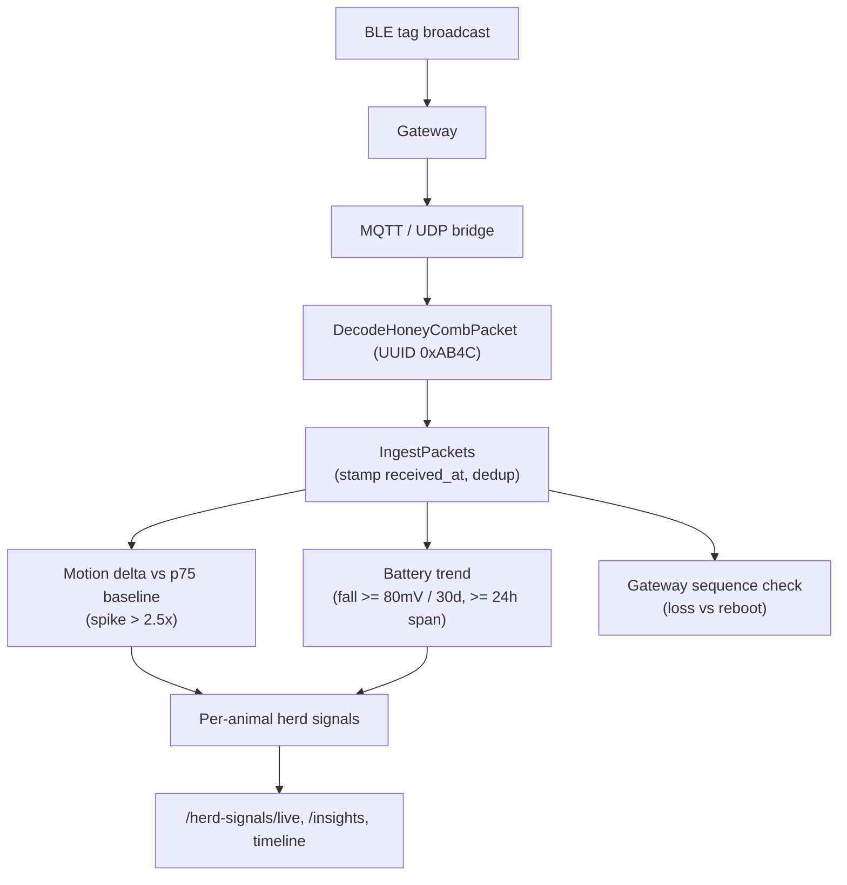

# Herd Signals & Devices

**Module paths:** `backend/internal/herdsignals/`, `backend/internal/devices/`
**Generated:** 2026-09-13

---

## What this module is doing

Herd signals is the IoT layer — the part of Goat OS that listens to the animals themselves. Physical BLE (Bluetooth Low Energy) tags of the HoneyComm family sit on the goats and continuously broadcast small packets carrying motion counts, battery voltage, temperature, and signal strength. Gateways placed around the sheds pick up these broadcasts and forward them to the backend, which decodes them, deduplicates them, analyzes motion and battery trends, and turns the raw telemetry into human-meaningful herd-health signals: this animal is active, that one has gone quiet, this tag's battery is falling, that gateway has stopped reporting.

The `devices` module is the adjacent concern of device *registration* — the FCM push tokens and app installs on `workforce_member_devices`, plus the device gateway that fronts IoT ingestion. Together they let the platform both *hear* the herd (BLE telemetry) and *reach* the people (push notifications).

The design theme here is trusting the server clock over the device's. A tag or gateway reports its own view of time, but that view is unreliable and, if believed, a security and correctness hazard. So the backend stamps `received_at` at ingestion and treats the device's own timestamp as a diagnostic hint only. Everything downstream — staleness, gaps, motion deltas — is computed against the server's clock.

---

## Core capabilities

**Packet ingestion and decoding.** `herdsignals/gateway/decode.go` recognizes a HoneyComm advertisement by its service-data UUID (0xAB4C) and extracts battery (decivolts → mV), sensor state, temperature (0.1°C resolution), and a cumulative motion count, deriving the tag id from the device MAC. `app/service.go`'s `IngestPackets` batch-ingests gateway reports and deduplicates on (tenant, tag, received_at).

**Motion and battery analysis.** A `Packet` (`domain/types.go`) records the server-stamped `received_at` (immutable) alongside diagnostic device/gateway timestamps. Motion is analyzed as a delta from the previous packet against a per-animal baseline computed at the 75th percentile (not the median), flagging a spike above 2.5× baseline. Battery is flagged "falling" only when voltage drops at least 80mV over a 30-day window *and* there is at least 24 hours of actual data — because a coin cell's noisy voltage needs a wide window to trend honestly.

**Gateway health.** A `Gateway` record tracks status (active/inactive/error) and the last packet sequence number, so a forward jump in the sequence signals lost packets and a decrease signals a gateway reboot.

**Staleness vs. reception gap.** The module distinguishes two ideas that look alike: a *stale* packet (this row is too old, ≥30 min) versus a *reception gap* (this delta is smeared across a hole in reception, ≥30 min between packets). Conflating them would misread a reporting outage as an inactive animal.

**Device registration and reach.** `devices` registers push tokens on `workforce_member_devices`, self-healing recoverable devices on heartbeat while keeping administratively-revoked ones terminal, so the notification dispatcher can reach the right phones.

---

## Key components

| Component / type | File path | Responsibility |
|------------------|-----------|----------------|
| `DecodeHoneyCombPacket` | `backend/internal/herdsignals/gateway/decode.go` | Parse BLE advertisement (UUID 0xAB4C) |
| `Packet` | `backend/internal/herdsignals/domain/types.go` | Telemetry row (server-stamped received_at) |
| `Gateway` | `backend/internal/herdsignals/domain/types.go` | Gateway status + sequence tracking |
| `IngestPackets` | `backend/internal/herdsignals/app/service.go` | Batch ingest + dedup + analysis |
| MQTT/UDP bridges | `backend/cmd/herd-signals-mqtt-bridge`, `herd-signals-udp-bridge` | Transport-layer ingestion |

---

## Internal data flow

The immutable `received_at` at the ingest step is the linchpin — every trend and staleness computation downstream reads it rather than the device's self-reported time, so a tag with a wrong clock cannot corrupt the analysis.

---

## Key interfaces and extension points

The module's ports are the packet, gateway, and herd-signal repositories. Transport is an extension seam: the same `DecodeHoneyCombPacket` is used by both the MQTT bridge and the UDP listener, so a new ingestion transport is a new bridge command reusing the decoder, not a new decode path. The thresholds (RSSI bands, battery levels, motion baseline percentile, stale/gap minutes) live in the domain layer as named constants — the p75 baseline is deliberately hardcoded rather than a config knob per `AGENTS.md`.

---

## Interaction with other modules

| Module | Direction | Interface | Notes |
|--------|-----------|-----------|-------|
| workforce / devices | shares | `workforce_member_devices` | Push token registration |
| notification | enables | FCM reach | Devices are the delivery targets |
| herd operations | signals | missing-signal alerts | A quiet tag flags a possibly missing animal |
| analytics | exports | motion/battery trends | Dashboard analysis |

---

## Cross-module collaboration scenarios

**In the alerting flow**, a tag that goes stale (no packet for ≥30 min against the server clock) or an animal whose motion drops below its own baseline becomes a herd-health signal surfaced through `/herd-signals/live` and `/insights`, which downstream operations can turn into a "check on this animal" alert — the module supplies the honest signal, other layers decide what to do about it.

**In the reach direction**, the `devices` registration keeps `workforce_member_devices` current so the kernel's notification dispatcher has valid FCM targets; a heartbeat self-heals a recoverable device while an administratively-revoked device stays locked out, so escalations reach real phones and not decommissioned ones.

---

## Performance considerations

Ingestion is batched and deduplicated on (tenant, tag, received_at), so a gateway forwarding the same broadcast twice writes one row. Motion and battery analysis are windowed computations over recent packets rather than full-history scans, and partition maintenance commands (`herd-signals-partition-maintenance`) keep the high-volume packet table partitioned for bounded query cost. The bridges batch-forward rather than one packet per round trip.

## Implementation highlights

The module's defining discipline is refusing to trust the device's clock. By stamping `received_at` server-side and demoting the device's own timestamp to a diagnostic, herd signals makes every downstream trend robust against a tag with a wrong or drifting clock — a subtle but load-bearing decision flagged in security review. The careful separation of "stale packet" from "reception gap," and the p75-not-median motion baseline over a data-span-gated window, show the same instinct: measure honestly over noisy hardware rather than let a reporting hiccup masquerade as an animal in distress.
