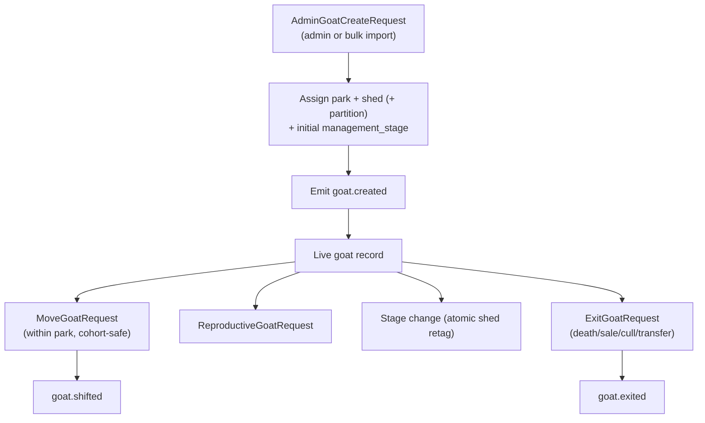

# Identity & Passport

**Module paths:** `backend/internal/identity/`, `backend/internal/passport/`, `backend/internal/genetics/`
**Generated:** 2026-09-13

---

## What this module is doing

If Goat OS is a system of record, the identity module is the record. Everything else in the platform — a vaccination due date, a weight, a feed quantity, a movement — is ultimately *about a goat*, and this module is the one place that knows which goat, what it is, and where it lives. Before Goat OS, that knowledge was smeared across spreadsheets and tag stickers that disagreed with each other; the identity spine's job is to be the single, versioned, audit-trailed answer to "which animal is this, and what is true about it right now."

The subtlety is that farm data arrives dirty. The same physical animal may carry two RFID tags, an old paper tag, and a national ID; imports collide; a scan resolves to nothing. So identity is not a passive CRUD table — it is a reconciliation engine. It resolves any of an animal's identifiers to one canonical goat, follows merge-redirects when two records turn out to be the same animal, and refuses writes that would corrupt the herd's structure (an animal cannot teleport between parks; a partitioned shed demands a pen).

The **passport** module sits on top as a read-only storyteller: it does not own any tables, it simply assembles a goat's complete vaccination story by joining history, open obligations, and the last accepted dose into one clean view for a detail screen. **Genetics** is a reserved placeholder — the directory exists but carries no implementation yet.

---

## Core capabilities

**Canonical goat records with optimistic concurrency.** Every goat is a `GoatPassport` (`backend/internal/identity/domain/types.go:119`) carrying its display id, species, breed, sex, age band, lifecycle status, reproductive status, management stage, health status, and current location. Every read returns a row version and every write checks it, so two concurrent edits surface an `ErrWriteConflict` instead of silently overwriting each other.

**Multi-identifier resolution and merge-following.** A goat can carry several `GoatIdentifier` rows (`domain/types.go:105`) — primary and secondary RFID, temporary tags, national ids. `GetGoatPassport` in `app/service.go` resolves by id or display id and follows merge-redirects up to sixteen hops, detecting cycles, so a lookup on any of an animal's identities lands on the one live record.

**Guarded lifecycle transitions.** The module exposes distinct, intention-revealing operations rather than a generic "update": `MoveGoatRequest` (`domain/types.go:270`) relocates within a park; `ExitGoatRequest` (`:284`) records a terminal death/sale/cull/transfer with optional death-cause metadata; `ReproductiveGoatRequest` (`:319`) changes reproductive status; and `IdentityGoatRequest` (`:333`) corrects a DOB or entry date. Each carries its own validation, so the code reads like the farm's actual verbs.

**Structural safety rules.** The repository's error vocabulary (`ports/repository.go`) is the clearest statement of what the module refuses: `ErrCrossParkMove` (animals never change parks — leaving a park is a terminal exit), `ErrPartitionRequired` / `ErrPartitionNotInShed` (a subdivided shed demands a real pen; you cannot type one that does not exist), and `ErrDestinationTagRequired` / `ErrShedProfileStageRequired` (a shed is homogeneous — one management stage per shed).

---

## Key components

The identity module keeps its business rules in `domain/`, orchestration in `app/`, the interface contract in `ports/`, and Postgres in `adapters/`. The table below is the shortlist worth opening first.

| Component / type | File path | One-line responsibility |
|------------------|-----------|-------------------------|
| `GoatPassport` | `backend/internal/identity/domain/types.go:119` | The complete goat record with identifiers and location |
| `GoatIdentifier` | `backend/internal/identity/domain/types.go:105` | One tag/id row resolving to a goat |
| `LocationPath` | `backend/internal/identity/domain/types.go:34` | Farm → park → shed → partition hierarchy with display |
| `AdminGoatCreateRequest` | `backend/internal/identity/domain/types.go:205` | Single/bulk create with origin, DOB, sex, breed, placement |
| `Service.GetGoatPassport` | `backend/internal/identity/app/service.go` | Resolve by id/display id, follow merge-redirect |
| `Repository` errors | `backend/internal/identity/ports/repository.go:12` | The structural invariants the module refuses to violate |
| `Passport` | `backend/internal/passport/app/service.go:95` | Aggregated read-only vaccination story |

---

## Internal data flow

The most instructive flow is the goat lifecycle: an animal enters once, then transitions through guarded operations, each emitting a domain event that ripples outward. The diagram shows creation through the transitions to a terminal exit.

The steps that carry real business weight are placement and exit. Placement is where the homogeneous-shed and partition-catalog rules bite: a create into a partitioned shed *must* name an existing partition, and the animal adopts the shed's cohort stage. Exit is terminal and one-directional — death-cause metadata is recorded only on death, never on a sale or transfer — and `goat.exited` is what tells the obligation engine to cancel that animal's open work.

---

## Key interfaces and extension points

The module's outward contract is its `Repository` port (`ports/repository.go`), which the Postgres adapter fulfills. Its error set is effectively the extension boundary: any new placement or movement rule enters as a new sentinel error plus a domain check, keeping the HTTP and SQL layers ignorant of the rule itself. The injected `businessNow` clock (`app/service.go`) is a deliberate seam so that apply-time stamping uses the business clock rather than wall-clock, which matters for the Asia/Kolkata business-day semantics the rest of the platform depends on.

---

## Interaction with other modules

Identity is a *producer* at the top of the event spine — most of the farm reacts to it. It rarely calls other modules; instead it emits and lets the kernel fan out.

| Module | Direction | Interface | Notes |
|--------|-----------|-----------|-------|
| obligation / vaccination | emits to | `goat.created`, `goat.exited` | Creation triggers SM-1 generation; exit cancels open work |
| counts | emits to | `goat.shifted`, `goat.stage_changed` | Movement updates the herd projection |
| passport | consumed by | `VaccinationReader`, `ObligationReader` | Passport joins identity with vaccination story |
| locations | reads from | shed/partition catalog | Validates placement against real pens |

---

## Cross-module collaboration scenarios

**In the vaccination lifecycle**, identity is the trigger. When `AdminGoatCreateRequest` lands a new kid, the emitted `goat.created` event is what the obligation engine consumes to generate that animal's first-course schedule — the whole preventive-care chain begins at an identity write. Conversely, when `ExitGoatRequest` records a death, `goat.exited` is what cancels the animal's open obligations so a dead animal never appears on an operator's due list.

**In the counts/feed chain**, a `MoveGoatRequest` completion emits `goat.shifted` and `goat.stage_changed`, which the counts projection consumes to update how many mouths sit in each pen — and that projected count is exactly what the feed direction sheet multiplies by the ration grid. A move in identity therefore silently re-prices tomorrow's feed.

---

## Performance considerations

Identity reads are single-goat lookups keyed on `goat_id` or on a normalized identifier value, so they are indexed point reads rather than scans. The merge-redirect follow is bounded at sixteen hops with cycle detection, so a corrupt merge chain fails fast instead of looping. Bulk import reconciles by identifier matching in set-based passes rather than per-row round trips, keeping large imports off the N+1 path that the platform's scale guards forbid.

## Implementation highlights

The most quietly important design choice is that identity exposes *verbs*, not a patch endpoint. Because move, exit, reproductive change, and stage change are separate operations with separate validation, the domain layer can enforce that (for example) a movement never stamps a clinical state — that decision belongs to the health flow, not to a placement action. The homogeneous-shed invariant, enforced here rather than downstream, is what lets every other module treat "a shed" as "one cohort," which simplifies feed, vaccination, and counts enormously.
