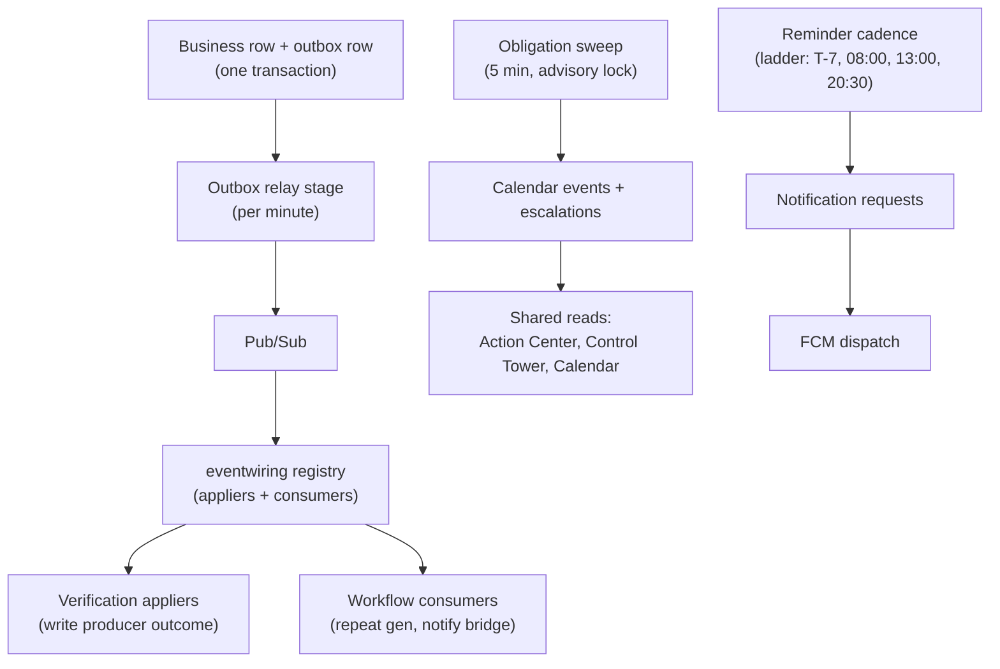

# Operational Kernel

**Module paths:** `backend/internal/kernelstages/`, `backend/internal/tasks/`, `backend/internal/calendar/`, `backend/internal/workboard/`, `backend/internal/leadershiptasks/`, `backend/internal/processintegrity/`, `backend/internal/obligation/` (kernel role), `backend/internal/outbox/`, `backend/internal/eventwiring/`, `backend/cmd/kernel-worker/`
**Generated:** 2026-09-13

---

## What this module is doing

The operational kernel is the engine room. Every other module produces business facts — a dose was given, a weight was recorded, a movement was approved — but something has to turn those facts into *owned, clocked, escalating, provable work*, and then reconcile the results into the screens leadership watches. That something is the kernel. It is the reason a park head's Action Center, an operator's task list, and a director's escalation all read the same truth instead of three modules' private guesses.

The kernel's contract, stated in `context/architecture/operational-kernel.md` and locked in `AGENTS.md`, is a single golden chain: *business event → canonical transaction + audit/outbox → real owner + pinned clock → bounded task hierarchy → acknowledgement-gated contact waterfall → proof → separate verification/sign-off task → close/reopen rollup → shared reads*. No module may create a private scheduler, owner fallback, overdue calculation, reminder ladder, or verification queue of its own — they all plug into this chain. That non-deviation lock is what keeps the farm behaving as one interlinked machine.

Physically, the kernel is one binary. `backend/cmd/kernel-worker/main.go` consolidates roughly seventeen formerly separate scheduled Cloud Run Jobs into a single worker with independent stage cadences — a deliberate simplification for the 5k–50k envelope. Around it, `calendar` is the single read model for past/due/escalated work, `tasks` runs the birth/death workflow instances, `outbox`/`eventwiring` are the event spine, and `processintegrity`/`workboard`/`leadershiptasks` shape the shared command reads.

---

## Core capabilities

**One worker, many cadences.** The kernel worker runs the obligation sweep every 5 minutes (180s budget), the outbox relay and notification dispatch each per minute, an operational lane every 5 minutes (reminder cadence, inventory reconcile, feed lifecycle, weighing kernel, pen visits), generation hourly, and housekeeping hourly. Each stage has its own budget so a slow outbox drain cannot starve notifications.

**Single-writer obligation sweep.** `backend/internal/kernelstages/obligation_sweeper.go` holds a per-tenant advisory lock (RV-03) so it is the sole writer of a tenant's batches. It runs a preflight for shot-cap ties, sweeps each vaccine version in priority order with a snapshot bound, aligns combo drives, and finalizes batches + SOP tasks + stock reservations in one pass. The due-before cutoff defaults to the *end* of the current IST business day (PEND-6), so a late-day sweep still picks up same-day work.

**A climbing reminder ladder.** `kernelstages/reminder_cadence.go` fires at T-7, day-start (08:00), afternoon (13:00), and due-today (20:30). Operational rungs resolve recipients by module duty; the 20:30 leadership checkpoint resolves through the stored notification audience. A keyset cursor advances strictly forward and *claims* fires that produce at least one notification, deferring unclaimed fires rather than re-sending.

**Calendar as the single read model.** `backend/internal/calendar` owns `calendar_events` and `calendar_escalations` as the canonical past/due/escalated read; the sweeper writes escalations there rather than dual-writing, and dashboards/phones read calendar, never raw obligations.

**One consumer registry.** `backend/internal/eventwiring/appliers.go` registers every verification applier and workflow consumer once, and the same registry is used by the in-process API bus, the outbox relay, and the Pub/Sub consumer — specifically to prevent the recorded bug where a handler was wired on one bus but not another.

---

## Key components

| Component | File path | Responsibility |
|-----------|-----------|----------------|
| kernel worker main | `backend/cmd/kernel-worker/main.go` | Supervisor + stage cadences |
| obligation sweep stage | `backend/internal/kernelstages/obligation_sweeper.go` | Single-writer batching under advisory lock |
| reminder cadence stage | `backend/internal/kernelstages/reminder_cadence.go` | Climbing escalation ladder, keyset cursor |
| outbox relay stage | `backend/internal/kernelstages/outbox_relay.go` | Drains outbox → Pub/Sub |
| consumer registry | `backend/internal/eventwiring/appliers.go` | One registration for three buses |
| calendar read model | `backend/internal/calendar/app/service.go` | Missed-work + escalation single read |
| tasks workflow | `backend/internal/tasks/app/service.go` | Birth/death workflow instances + actions |

---

## Internal data flow

The diagram traces one event through the kernel, from the outbox to the shared reads and pushes. The relay and the registry in the middle are what make cross-module coordination retry-safe.

The load-bearing detail is that escalations are *written by the calendar module*, not dual-written by each producer, so there is one source for "what is late" — and the reminder ladder claims fires idempotently so a deadline crossing pushes exactly once.

---

## Key interfaces and extension points

The kernel's extension model is the event spine plus the consumer registry. A new module participates by producing a domain event (registered in `context/architecture/domain-event-registry.json`) and, if it needs coordination, registering a consumer in `eventwiring`. The rule enforced by `make domain-event-architecture-guard` is that both ends must exist: a producer with no consumer is a silent drop, and a consumer with no producer is dead code. The task-kernel non-deviation lock means a new feature does *not* extend the kernel by inventing its own scheduler — it reuses the chain.

---

## Interaction with other modules

| Module | Direction | Interface | Notes |
|--------|-----------|-----------|-------|
| obligation / vaccination | drives | obligation sweep stage | Batching runs here under the advisory lock |
| verification | routes to | appliers registry | Verdicts apply back to producers |
| notification | produces to | reminder cadence + dispatch | Ladder → FCM |
| all producers | consumes from | outbox relay | Every mutation's outbox row |
| calendar | writes | escalations | Single source for late work |

---

## Cross-module collaboration scenarios

**In the vaccination drive lifecycle**, the obligation sweep is where generated obligations become operator drives: holding a per-tenant advisory lock, it orders vaccines by priority, resolves shot-cap ties in a preflight, aligns combo vaccines so higher-priority ones claim slots first, and finalizes drives + SOP tasks + stock reservations against each batch's planned date — all in one atomic pass, so two sweeps can never double-book a shot cap.

**In the escalation flow**, when an obligation crosses its deadline, the sweeper marks it missed and the calendar module writes the escalation; the reminder cadence then resolves the 20:30 leadership audience through the stored notification-audience override and queues one digest per park per date. The push names which pens are outstanding, not just a count — meaningful notification copy is a maintainer lock.

---

## Performance considerations

Every kernel sweep is bounded and chunked: keyset cursors with `FOR UPDATE SKIP LOCKED` claims, snapshot-bounded candidate membership, and per-stage timeouts. The single-writer advisory lock trades cross-tenant parallelism (fine) for within-tenant serialization (necessary for correct priority ordering). Consolidating seventeen jobs into one worker removes seventeen cold-start and scheduling overheads at the current scale, and the 1–5M topology that would re-split them is kept as a documented future certification, not a present cost.

## Implementation highlights

The kernel's best idea is the "one registry, three buses" pattern in `eventwiring`. By forcing the in-process bus, the outbox relay, and the Pub/Sub consumer to share a single registration of appliers and consumers, the design makes it structurally impossible to wire a handler on the development bus but forget it on the production bus — the exact drift that once left feed and shifting verdicts silently stranded. Combined with the non-deviation lock that forbids private schedulers, it is what lets dozens of modules share one honest task chain.
