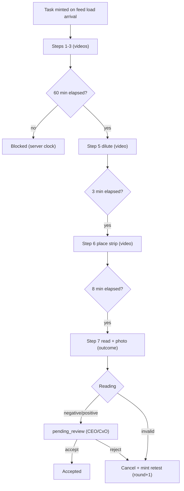

# Procurement, Sales & Toxin

**Module paths:** `backend/internal/procurement/`, `backend/internal/sales/`, `backend/internal/inventory/`, `backend/internal/toxin/`
**Generated:** 2026-09-13

---

## What this module is doing

This cluster is the commercial edge of the farm — where animals and feed come *in* and where animals go *out*. `procurement` tracks inbound loads of purchased goats through a multi-stage gauntlet of health checks and pre-dispatch reviews before they join the herd, and it computes each load's true landed cost. `sales` runs the outbound side: the vendor register and buyer/farmer leads, plus the read-only closed-sale and farm-valuation boards. `inventory` tracks feed and vaccine stock with reconciliation. And `toxin` runs a rigorous seven-step aflatoxin strip test on every incoming feed load, with hard server-clock wait gates and CEO/CxO approval.

The cluster's most distinctive piece is toxin, because it shows the platform doing something unusual: a **fully guided, time-gated procedure** where the phone renders backend-owned steps verbatim and the server enforces the physics. The test involves real chemistry with real waiting — grind, mix, wait an hour for the extract to settle, dilute, wait three minutes, place the strip, wait eight minutes, then read it — and the backend hard-blocks each wait on its own clock so an operator cannot rush a reading. It is also a recorded, scoped exception to verifier-verdict-exclusivity: toxin review is CEO/CxO-only (`toxin.verdict`), deliberately *not* a verification category, so the verifier never sees toxin work and the verdict-exclusivity lock stays intact.

The procurement landed-cost decision is the other highlight: a load's purchase value is animals *plus* transport *plus* booking, labour, transit, and transition feed — never the ex-farm animal price alone.

---

## Core capabilities

**Procurement load lifecycle.** A `Load` moves through source warmup → source health pending → pre-dispatch pending → dispatch ready → in transit → arrival review → accepted intake, with each `LoadGoat` carrying its own per-stage state. `app/service.go` exposes `CreateLoad`, `AddGoat`, `RecordSourceHealth`, `PreDispatchDecision`, `DispatchLoad`, `ArrivalReview`, and `AcceptIntake`, plus HF vaccination-evidence import and review so trusted claims can inform intake.

**Landed cost.** `procurement/domain.loadPurchaseValue` sums six cost kinds (animals, transport, and four rolled into "other"); `procurement_load_cost_lines` (migration 000235) is the source and the three displayed columns are a roll-up maintained in the same transaction, so a breakdown can never disagree with the figure beside it. An unclassified cost rolls into "other" rather than being dropped. The fattening clock starts on *arrival*, not purchase; a separate age clock past 90 days on a load still holding animals raises a daily alert to the CxO alone.

**Seven-step toxin test.** `toxin/domain/task.go` models a `Task` (in_progress → pending_review → accepted | cancelled) with steps: five video steps, one settling wait, and a final photo + reading (negative/positive/invalid). The three waits are hard-blocked on the server clock (60 min → step 5, 3 min → step 6, 8 min → step 7). Each step's proof is immutable and one-per-step. An invalid strip or a CEO reject cancels the round and mints a fresh retest in the same transaction (`round_no + 1`, one live round per load).

**Vendor register, two sides.** `sales` reads one vendor register as two complementary halves — the procurement supply desk's types and the sales buyer types — from the same table via opposite `register_side` filters, and the closed-sale/farm-value/loads boards are read-only (write lives on `/sales/config`).

---

## Key components

| Component / type | File path | Responsibility |
|------------------|-----------|----------------|
| `Load` / `LoadGoat` | `backend/internal/procurement/domain/types.go` | Inbound load + per-goat state machine |
| `loadPurchaseValue` | `backend/internal/procurement/domain` | Landed cost (six kinds) |
| `Task` (7-step) | `backend/internal/toxin/domain/task.go` | Aflatoxin test with hard wait gates |
| `CompleteStep` / `SubmitReading` | `backend/internal/toxin/app/service.go` | Step gate validation + reading |
| lead / vendor register | `backend/internal/sales/domain/types.go` | Buyer/FPO leads + two-sided register |

---

## Internal data flow

The toxin test is the most illustrative flow, because the server clock — not the client — controls progression.

The wait gates are the design's core: because the server stamps and checks each elapsed interval, the phone can render "waiting N min" but cannot fabricate a completed reading, which is what makes the test result trustworthy.

---

## Key interfaces and extension points

Each module exposes a repository port and an HTTP handler. Toxin's authority split is the notable extension detail: `toxin.execute` is granted per person (via the per-person grants list) while `toxin.verdict` is CEO/CxO-only, and both halves are enforced — the step routes refuse leadership, and `can_execute` on the composed task renders every unfinished step locked for a watcher so no camera is offered for a write the server would refuse. Procurement's cost model extends by cost kind, with unknown kinds rolling into "other" rather than requiring a schema change per new cost type.

---

## Interaction with other modules

| Module | Direction | Interface | Notes |
|--------|-----------|-----------|-------|
| identity | produces to | accepted intake → herd | Loads become live goats |
| feed direction | gates | toxin flags a load | Aflatoxin result attends to feed acceptance |
| inventory | reads/writes | stock reconciliation | Feed/vaccine lots |
| notification | produces to | load age alert (CxO), sale feed-reduce (feed director) | Directed pushes |
| vaccination | consumes | HF vaccination evidence | Trusted history informs schedule |

---

## Cross-module collaboration scenarios

**In the sale → feed-reduction notice**, when animals are tagged to a sale (the moment they leave the register), a `goat.sale_allocated` event notifies the Feed Director — and only the Feed Director — naming each pen, how many animals left, and the feed day the reduction lands on; a second reminder that feed day asks whether feed reduced, carrying no values (`docs/decisions/sale-feed-reduce-notification.md`).

**In the load-age escalation**, procurement's finished load-wise read model feeds a daily notifier that alerts the CxO about any load past 90 days still holding animals; the notifier consumes the same read model the chart shows, so push and chart can never disagree about which loads are overdue.

---

## Performance considerations

Procurement and sales reads are keyset-paginated list views. The landed-cost roll-up is maintained in the same transaction as its cost lines, avoiding a recompute-on-read. Toxin's wait-gate checks are simple server-clock comparisons on stamped step completions, so gating is O(1) per step with no polling. The load-age alert derives from the finished read model rather than scanning loads live.

## Implementation highlights

Toxin is the cluster's showpiece: a chemistry procedure encoded as a backend-owned, server-clock-gated state machine that the phone can only render, never rush. Its deliberate placement *outside* the generic verification queue — CEO/CxO approval instead — is a careful piece of boundary design: it gives leadership direct authority over a food-safety gate while preserving the rule that a verifier alone casts verification verdicts, so neither authority erodes the other.
