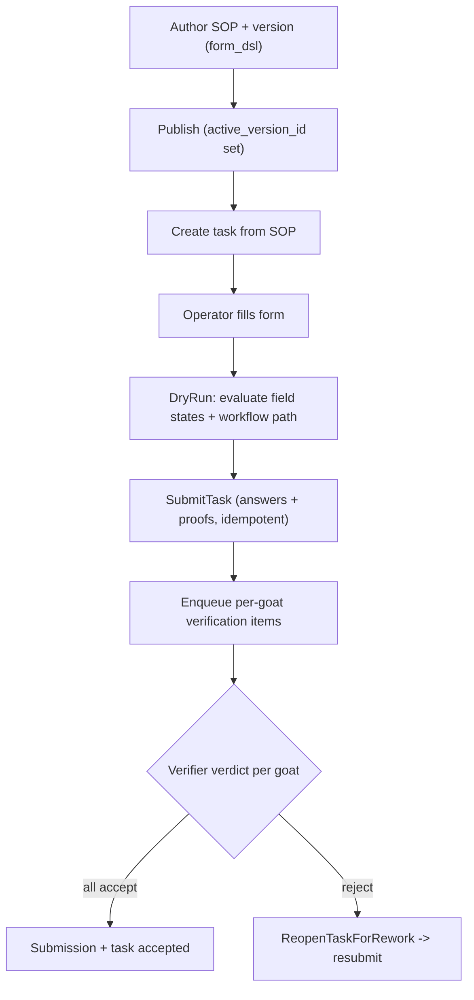

# SOP & Forms Engine

**Module paths:** `backend/internal/sop/`, `backend/internal/forms/`, `backend/internal/submissions/`, `backend/internal/sopbridge/`
**Generated:** 2026-09-13

---

## What this module is doing

The SOP and forms engine is the generic machinery for turning a standard operating procedure into a fillable, provable task. Many farm workflows share the same shape — show the operator a form, let them scan animals and capture proof, evaluate visibility and required-field rules as they go, submit, and route the result to a verifier — and rather than reimplement that per feature, Goat OS factors it into one form DSL engine and one SOP task/submission lifecycle. `sop` owns the versioned SOP library and the task/submission records; `forms` is the DSL evaluator that decides which fields show, which are required, and when submission is blocked; `submissions` handles the submitted answers; and `sopbridge` composes SOP into the verification queue.

The design principle mirrors the rest of the platform: **the backend authors the form, the client renders it**. A form is a DSL document (field types, visibility and required rules, proof policies) authored in an SOP version; the phone evaluates and renders it but does not invent fields or labels. And like health and protocol, SOP versions are immutable — a new version replaces an old one rather than editing in place — so a task always runs against the exact form it was created under.

A structural note worth carrying: the top-level SOP library route was retired in favor of per-module SOP surfaces (`/vaccination/sops`, `/counts/sops`, `/feed/sops`, `/milk/sops`, `/weighing/sops`), all rendering the same library contract scoped by code prefix. These are *library* documents; the executing task engine (`sop_tasks`) stays vaccination-drive-only.

---

## Core capabilities

**Versioned SOP library.** A `SOPDefinition` carries a code, name, and active version; a `SOPVersion` carries the `form_dsl`, `proof_policy`, client compatibility, and a validation report. `app/service.go` exposes `CreateSOP`, `CreateSOPVersion` (returning validation errors/warnings), `ListSOPs` (embedding latest versions to avoid an N+1), publish, and retire.

**Form DSL evaluation.** `forms` evaluates rules — `visible_if`, `required_if`, `enabled_if`, `proof_required_if`, `block_submission_if`, and `repeat_for_each_goat` — over field types including `goat_scan`, `animal_id_scan`, `photo_proof`, `video_proof`, `shed_picker`, and the usual text/number/date/select primitives. `DryRunSubmission` validates a set of answers and proofs against the DSL, returning field states, the workflow path, and the final state without committing.

**Task and submission lifecycle.** A `TaskSummary` moves through open → submitted → rework_requested → accepted/failed, carrying a `presentation` block (eyebrow, title) that the app renders — raw scope ids remain transport facts, never labels. `SubmitTask` records answers and proof refs idempotently on an idempotency key, calls the submission hook, and enqueues per-goat verification items; `AcceptSubmissionItemVerification` rolls per-goat verdicts back up to submission and task acceptance; `ReopenTaskForRework` reopens on rejection and allows resubmission.

**Per-goat verification rollup.** The `repeat_for_each_goat` rule creates one verification item per animal in the roster, and acceptance projects those per-goat verdicts back into a single submission/task acceptance.

---

## Key components

| Component / type | File path | Responsibility |
|------------------|-----------|----------------|
| `SOPDefinition` / `SOPVersion` | `backend/internal/sop/domain/types.go:29` | Versioned SOP + form DSL + proof policy |
| `TaskSummary` | `backend/internal/sop/domain/types.go` | Task lifecycle + presentation block |
| `DryRunSubmission` | `backend/internal/sop/app/service.go` | Validate answers/proofs against DSL |
| `SubmitTask` | `backend/internal/sop/app/service.go` | Idempotent submit + verification enqueue |
| form DSL evaluator | `backend/internal/forms/adapters/evaluator.go` | Field visibility/required/proof rules |

---

## Internal data flow

The `repeat_for_each_goat` fan-out at the enqueue step is what lets a single shed task produce one review item per animal, and the rollup at acceptance is what collapses those back into one task outcome — the grain follows the evidence, which is the same principle weighing and verification use.

---

## Key interfaces and extension points

The DSL itself is the primary extension point: new form behavior is authored data (a new rule or field type recognized by the evaluator), not new code per feature. The `SubmissionHook` port lets a producer plug submission into its own follow-up (the verification enqueue), and the `TaskReviewFanout` port handles per-goat rollup — both optional, so a simple SOP can submit without either. Because SOP versions are immutable, extending a form means publishing a new version, and in-flight tasks keep running against the version they were created under.

---

## Interaction with other modules

| Module | Direction | Interface | Notes |
|--------|-----------|-----------|-------|
| verification | produces to | per-goat items (via sopbridge) | One item per animal in roster |
| vaccination | uses | `sop_tasks` execution | Drive execution runs on SOP tasks |
| permissions | gated by | `sop.read` / `sop.write` | Author vs. execute |
| proof / media | reads | proof refs + retention | Proof policy applied on acceptance |

---

## Cross-module collaboration scenarios

**In vaccination drive execution**, the SOP task engine is the substrate: a drive's shed task is a `sop_task`, the operator's per-goat scans and proofs become `sop_submission_items`, and the write path filters those items to goats whose current shed matches the shed subject before inserting completions — the goat-shed scope guard that stops a broad scan capture from writing sibling sheds.

**In the per-module SOP libraries**, `/vaccination/sops`, `/counts/sops`, `/feed/sops`, `/milk/sops`, and `/weighing/sops` all render the same `sop-library` contract over `/admin/sops`, scoped by code prefix, so each module surfaces its own SOP documents without a separate library engine — a deliberate reuse of one contract across five surfaces.

---

## Performance considerations

`ListSOPs` embeds latest versions in the list read to avoid an N+1 per SOP. Form evaluation is a pure function over the DSL and the answers, so dry-runs are cheap and require no persistence. Submission is idempotent on the idempotency key, so a retried submit collapses onto one set of verification items rather than duplicating the fan-out. Presentation copy is precomputed on the task so the client never derives labels from raw ids.

## Implementation highlights

The engine's strength is that it factors a recurring shape — form + scan + proof + submit + verify + rework — into one reusable, backend-authored mechanism, so features get provable task execution without reinventing it. The `repeat_for_each_goat` fan-out and its acceptance rollup are the clever core: they let one shed task carry per-animal evidence and per-animal verdicts while still presenting as a single unit of work, keeping the grain of review honestly matched to the grain of the evidence.
