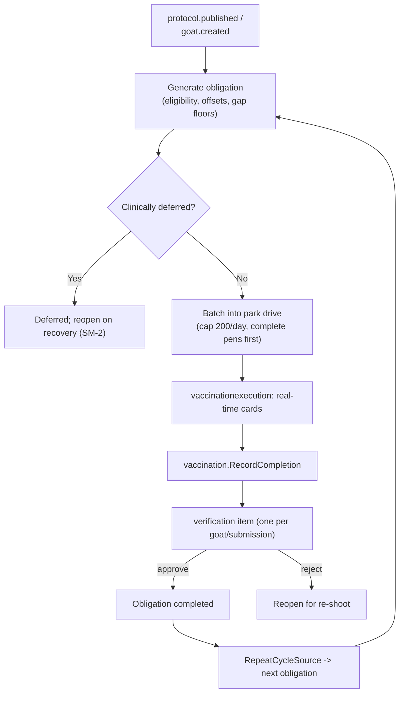

# Vaccination & Preventive Care

**Module paths:** `backend/internal/vaccination/`, `backend/internal/obligation/`, `backend/internal/protocol/`, `backend/internal/vaccinationexecution/`, `backend/internal/pccare/`, `backend/internal/penvisits/`
**Generated:** 2026-09-13

---

## What this module is doing

This cluster is the reason Goat OS exists in its current form — the README calls the active build the "Vaccination Process Integrity Slice," and its whole question is: *is preventive care actually intact for every pen, and if not, who owns the next action?* Answering that honestly is harder than it sounds, because preventive care is not a checklist you tick off. It is a living schedule: a kid born today owes a first course, then a booster twenty-one days later, then a revaccination every six months; a sick animal's dose must slide until it recovers; two vaccines given on the same day must be medically compatible; and an operator can only vaccinate about two hundred animals in a day. Get any of that wrong and either an animal is unprotected or the farm is chasing phantom work.

The cluster solves this by separating "what the rules are" from "what is due" from "what happened." The **protocol** module owns the authored rulebook and its versions. The **obligation** module is the due-date and work-state engine that turns rules into dated work and batches that work into operator drives. The **vaccination** module records the actual dose given and drives it through verification. **vaccinationexecution** is the real-time read layer that leadership and operators watch. And around the vaccine core, **pccare** runs the hands-on preventive tasks (deworming, trimming, tick removal) while **penvisits** adds a next-day verification video as the closing step of any pen's care work.

The design principle that ties them together is *generation, not manual scheduling*. No one types a drive into a form. Publish a rule, and every downstream date, batch, booster, and repeat is a computed consequence.

---

## Core capabilities

**A versioned, published rulebook.** Protocol's `Version` (`backend/internal/protocol/domain/types.go:47`) stores a `rule_dsl` and proof policy; publishing materializes indexed `RuleDimension` rows (`:138`) and a `PublishedCapacity` block (`:63`) so generation and planning never re-parse the DSL at herd scale. Rules select by cohort through `AnimalStage` (`:209`, kid vs adult age bands), and publishing is atomic with a capacity parity check that rolls back on mismatch.

**Clinical-defer safety that cannot be authored away.** `MandatoryClinicalDeferStates` (`backend/internal/protocol/domain/clinical_defer.go:20`) fixes `[sick, under_treatment, recovering, quarantine, icu]` as non-negotiable. An authored `defer_states` list may only *add* to that set; both the publish validator and the generator resolve the effective set through `EffectiveClinicalDeferStates` (`:131`) so they can never diverge. A wrong medical action is treated as P0, however cleanly it compiles.

**A full obligation state machine.** `NewObligation` (`backend/internal/obligation/domain/types.go:23`) carries deterministic identity — one obligation per (goat, rule, sequence) per open window — and every repeat descends from a `RepeatCycleSource` (`:70`) keyed on (vaccine, administered_at, sequence), so a booster can always name the dose it followed even if ids change.

**Safe drive batching.** `NewBatch` (`domain/types.go:182`) and `DriveAssignment` (`:202`) group work park-first, animal-first, respecting `DriveOperatorCapacity` (`:217`) — the 200/operator/day cap. If the operator-assignment config exists but resolves to zero operators, batching fails closed (`ErrOperatorAssignmentConfigPresentButEmpty`) rather than inventing a fallback.

**Idempotent dose recording and verification.** `NewCompletion` (`backend/internal/vaccination/domain/types.go:19`) records an administered dose keyed on an idempotency key; acceptance is the verification gate; and one SOP submission produces exactly one verification item grouping all of a goat's vaccines.

---

## Key components

| Component / type | File path | Responsibility |
|------------------|-----------|----------------|
| `Version` / `RuleDimension` | `backend/internal/protocol/domain/types.go:47`, `:138` | Versioned rulebook + compiled indexed rules |
| `MandatoryClinicalDeferStates` | `backend/internal/protocol/domain/clinical_defer.go:20` | Non-negotiable clinical safety block |
| `NewObligation` / `RepeatCycleSource` | `backend/internal/obligation/domain/types.go:23`, `:70` | Due-work identity + repeat lineage |
| `NewBatch` / `DriveAssignment` | `backend/internal/obligation/domain/types.go:182`, `:202` | Park-first, animal-first drive batching |
| `NewCompletion` | `backend/internal/vaccination/domain/types.go:19` | Idempotent dose record |
| `ExecutionRow` / `ShedCardSummary` | `backend/internal/vaccinationexecution/domain/types.go:84`, `:200` | Real-time per-shed execution status |
| PC Care capture modes | `backend/internal/pccare/domain/domain.go:149` | scan_record / roster_pick / task_proof |
| `Task` (pen visit) | `backend/internal/penvisits/domain/visit.go:143` | Kernel-raised next-day pen video |

---

## Internal data flow

The lifecycle is a loop that begins at a rule publish (or a goat's creation) and closes when an accepted dose mints its own successor. The diagram traces one dose from generation to the next repeat.

The two decision points carry the medical weight. The defer branch is where the mandatory clinical states hold a dose without cancelling it. The batch step is where the operator-day cap and complete-pens-first packing keep drives physically achievable.

---

## Key interfaces and extension points

Protocol's plug-in seam is the `rule_dsl` itself: new dose schedules are authored data, not code, so a new vaccine course ships as a published version. The obligation engine's extension point is its repository port, which exposes generation (`ListEligibleGoatsForGeneration`), sweeping (`UnbatchedDue`), and capacity resolution as separate concerns. Vaccination's `ports.go` exposes recording and acceptance as distinct methods (`RecordCompletion`, `AcceptCompletionAtomic`) so the verification gate can be composed independently. PC Care's extension surface is its capture-mode vocabulary (`domain/domain.go:149`) — adding a new preventive task type is a matter of declaring its mode and proof slots.

---

## Interaction with other modules

| Module | Direction | Interface | Notes |
|--------|-----------|-----------|-------|
| identity | consumes | `goat.created`, `goat.exited`, `goat.shifted` | Triggers generation, cancellation, rescope |
| verification | produces to | verification items | One per goat per submission; verifier approves |
| kernel | driven by | obligation sweep stage | Batching runs under the per-tenant advisory lock |
| counts | consumes | `goat.stage_changed` | Re-evaluates eligibility on stage change |
| penvisits | produces | pen visit task | Raised on shed proof submit for care categories |
| notification | produces to | reminder cadence, 20:30 checkpoint | Field nudges + leadership escalation |

---

## Cross-module collaboration scenarios

**In the daily execution loop**, `vaccinationexecution` composes `ShedCardSummary` (`domain/types.go:200`) from *all* execution rows matching a card's identity — never a paginated subset — so a park head's "3 of 4 sheds done" and an operator's phone agree. Drive progress is field-work-done (completed + submitted), reaching 100% before the verifier finishes, with the outstanding review carried by a `verification_pending` chip rather than by holding the ring below 100% (a recorded maintainer lock).

**In the care-chain closure**, when a PC Care deworming task or a vaccination shed proof is submitted in a pen, `penvisits` raises the next-day visit as the *last step* of that work (2026-09-12 decision). The parent task's kernel clock stays open until the visit's video is verified; approval of the visit closes the parent through `pccare.Repository.PenVisitVerified`.

---

## Performance considerations

The cluster is engineered for the 5k–50k envelope with a clear rule: impact preview and eligibility never live-scan the herd. `vaccination.SumEligibilityRollup` reads a cached `vaccination_eligibility_rollups` read model, and the generation path uses set-based `ListEligibleGoatsForGeneration` rather than per-goat queries. The obligation sweep is snapshot-bounded and holds a per-tenant advisory lock so it is the single writer, letting it order vaccines by priority and resolve shot-cap ties deterministically before any write.

## Implementation highlights

The most elegant piece is repeat lineage. Because every completed dose records a `RepeatCycleSource` keyed on (vaccine, administered_at, sequence), the system can generate the next booster deterministically and de-duplicate it across concurrent writers — the source ref, not a mutable obligation id, is the identity. That single design choice is what makes "generation, not scheduling" trustworthy over years of a herd's life: the schedule regenerates itself correctly no matter how many times a sweeper runs.
