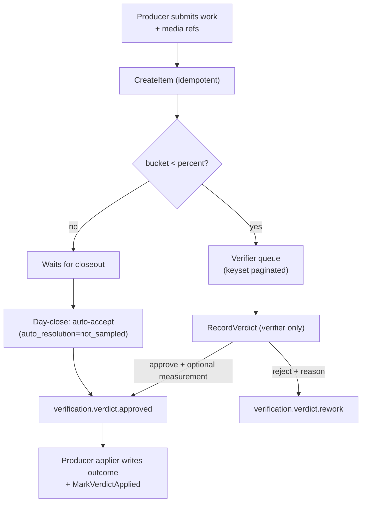

# Verification & Proof

**Module paths:** `backend/internal/verification/`, `backend/internal/verificationcatalog/`, `backend/internal/proof/`, `backend/internal/media/`
**Generated:** 2026-09-13

---

## What this module is doing

Verification answers "was the work actually done, and done right?" On a farm run through a phone, the only honest answer is video: an operator records a live-camera clip of the dose being given, the pen being fed, the animal being weighed. Verification is the single, cross-module place where those clips are reviewed and where a dedicated verifier casts an approve/reject verdict that flows back to the module that produced the work. Proof and media are the plumbing beneath it — the durable, GCS-backed record of the clips themselves.

The module's defining property is that it is *generic and independent*. Producers — vaccination, shifting, feed packing, feed distribution, weighing, health, pen visits — all enqueue items into one queue through the same `CreateItem` call, and verdicts apply back to each producer's own record through registered appliers. This is what lets one verifier review evidence across the whole farm from one screen, and it is why verdict authority is such a carefully guarded thing: the party being checked must never be able to sign their own check.

The second defining property is *sampling*. Watching every video does not scale, so the CEO sets a percentage per category; drawn items reach the verifier and the rest auto-accept at day close. Crucially, a video nobody watched is never treated as evidence of *wrong* work — an unsampled item is always an approval, never a rejection.

---

## Core capabilities

**Generic enqueue with plug-in categories.** `verification/app/service.go`'s `RegisterCategory` lets each producer register its category at bootstrap; `CreateItem` (idempotent per key) rejects an unregistered category. An `Item` (`domain/types.go:122`) carries its source reference (module, ref type, ref id), media refs, context rows (what was expected), and measurement fields.

**A derived verdict state machine.** `VerdictState()` (`domain/types.go:183`) resolves to `awaiting_review`, `applying` (verdict written, producer applier not yet acked), or `settled`. The `ApplierAckExpected` flag lets a producer declare whether it wired an ack callback, so an item does not sit falsely in "applying" for a producer that settles immediately.

**Verifier-only verdicts.** `RecordVerdict` requires a reason on reject; the permission `verification.verdict` is granted to the verifier alone — never CEO, directors, or park heads (a 2026-08-03 lock). Leadership keeps `verification.review` (see the queue and recorded verdicts) and `verification.act` (close/rework the source task) but cannot sign the second check.

**Monotonic randomized sampling.** `domain/sampling.go` computes a stable `SamplingBucket` via md5(item_id) % 100 (`:50`), draws when `bucket < percent` (`InSample`, `:69`), defaults categories to 100% (`:23`), and locks measurement-carrying categories (feed packing, wastage) at 100% (`SamplingWaivable`, `:86`). Raising the percentage only *adds* videos and never retracts one already in a verifier's hands.

**Auto-accept at closeout.** The `kernelstages/verification_sampling.go` stage approves every unsampled item once the business day closes, stamping `auto_resolution = not_sampled` with no `verified_by` — a policy decision, not human work — and emitting the ordinary approved event so every producer's applier runs identically.

**Measurement rides the approve.** For categories that require a number (feed packing quantities, wastage weight, weighing correction), the verifier types the value and presses Approve once — there is no separate save button (a 2026-08-20 lock that fixed a version-fence race).

---

## Key components

| Component / type | File path | Responsibility |
|------------------|-----------|----------------|
| `Item` / `Verdict` | `backend/internal/verification/domain/types.go:122`, `:235` | Queue item + verdict with optional measurement |
| `VerdictState()` | `backend/internal/verification/domain/types.go:183` | awaiting_review / applying / settled |
| `SamplingBucket` / `InSample` | `backend/internal/verification/domain/sampling.go:50`, `:69` | Stable, monotonic draw |
| `RegisterCategory` / `CreateItem` | `backend/internal/verification/app/service.go` | Plug-in enqueue |
| sampling closeout | `backend/internal/kernelstages/verification_sampling.go` | Auto-accept unsampled items |
| category registry | `backend/internal/verificationcatalog` | The known categories both API and worker share |
| proof artifact | `backend/internal/proof`, `backend/internal/media` | GCS-backed durable clips |

---

## Internal data flow

The branch that carries the design's integrity is the sampling gate feeding *both* the verifier queue and the closeout auto-accept into the *same* approved event. Because a human approve and an auto-accept emit the identical event, every producer's applier is one implementation — there is no second apply path to drift.

---

## Key interfaces and extension points

The extension seam is `RegisterCategory` plus the applier registry in `eventwiring`. A new verifiable workflow registers its category (in `verificationcatalog`, read by both the API registry and the worker closeout so a hand-copied subset cannot silently skip categories) and registers an applier that writes the verdict back to its own table. Producers never make verification read their table; instead the applier forwards to the producer's own service, so range checks, idempotency, and audit live in one place per producer.

---

## Interaction with other modules

| Module | Direction | Interface | Notes |
|--------|-----------|-----------|-------|
| all producers | consumes | `CreateItem` | One queue for the whole farm |
| all producers | applies to | verdict appliers (eventwiring) | Approve/reject writes producer outcome |
| kernel | driven by | closeout stage | Auto-accepts unsampled items at day close |
| notification | produces to | verification event consumer | Verdict → leadership push |
| proof / media | reads | media refs | GCS clips loaded only on explicit action |

---

## Cross-module collaboration scenarios

**In the feed-packing measurement flow**, packing enqueues an item with per-feed-item measurement fields; the verifier types packed weights and they ride the approve through a `MeasurementApplier` registered per category, which forwards to feed direction's own service. Because feed packing is measurement-carrying, its sampling is locked at 100% — the verifier is the data source there, not a spot check, so waiving would record no quantity at all.

**In the media-egress discipline**, remote proof clips are never loaded, probed, or poster-extracted just because a list is composed; bytes move only on an explicit play/open/share, tap-triggered and bounded, and every `ProofMediaPreview` caller keys on a stable proof/slot/attachment identity rather than a temporary signed URL (`AGENTS.md` Android proof media rule). This keeps a billing spike from a card that merely rendered.

---

## Performance considerations

The queue is keyset-paginated and resolves media in one batched call rather than per row. The sampling draw is a generated column plus a strictly-less-than comparison, so it is deterministic and index-friendly and needs no per-request randomness. Auto-accept runs at closeout over closed business days only, so a video waived the moment it arrived cannot be recruited back by a same-day percentage raise. Counts of "what a person still owes" use only drawn items, and counts of "what a person did" exclude auto-resolved items, so the settled items never read as verdicts nobody cast.

## Implementation highlights

The subtlest and most important design choice is that a human verdict and a sampling auto-accept converge on one event and therefore one applier. This eliminates the entire class of bugs where "the automatic path" and "the manual path" apply outcomes differently. Paired with verifier-only verdict authority and the measurement-rides-the-approve rule, it makes the verification layer both scalable (most videos auto-accept) and trustworthy (the ones that are reviewed are reviewed by an independent party who cannot approve their own work).
