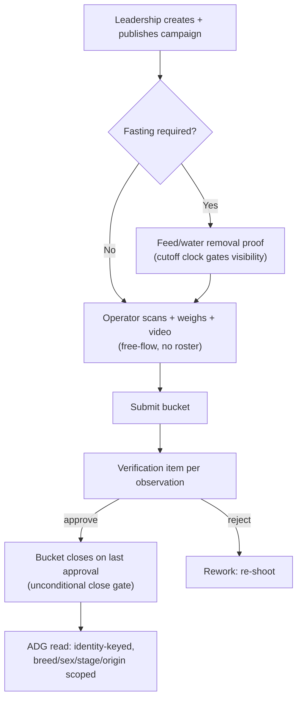

# Weighing & Growth

**Module paths:** `backend/internal/weighing/`, `backend/internal/growthdirector/`, `backend/internal/growth/`
**Generated:** 2026-09-13

---

## What this module is doing

Weighing answers one question — "how fast is the herd growing?" — and it answers it by doing almost nothing clever on the write path, on purpose. The maintainer's standing rule, repeated across the codebase, is that weighing is *scan-and-submit and nothing else*: an operator scans an RFID, types a weight, records a video, and submits. There is no roster, no expected-animal count, no denominator, no herd lookup, and exactly one business rule — you cannot scan the same animal twice in one bucket before submitting. The scanned string simply *is* the identity; the system does not know, and must not try to know, what animal that tag belongs to while capturing.

This restraint is not laziness; it is a hard-won boundary. A 2026-08-04 defect shipped a `LEFT JOIN goat_identifiers` on a growth read model, coupling weighing to the herd register, and the whole module's isolation rule exists to make that class of bug impossible again. "Free-flow" means the system cannot know what is in a shed and must not pretend to — a tag that resolves to nothing is *counted*, never rejected.

Yet from that deliberately dumb capture stream, weighing produces genuinely sophisticated growth analytics — average daily gain (ADG) by breed, sex, and management stage — by carving out a small number of file-scoped, guard-allowlisted reporting exceptions. **growthdirector** is the separate read-only reporting surface that aggregates those dimensions (breed/sex/stage) that weighing on its own cannot see. **growth** is a reserved placeholder folded into weighing's domain.

---

## Core capabilities

**Scan-and-submit capture, two grains.** A `Campaign` (`backend/internal/weighing/domain/types.go`) is one weighing task for a park and date; a `CampaignShed` is the operator's bucket; an `Observation` records either an individual animal weight or a whole-shed lump-sum. For lump-sum, the head count is *snapshotted server-side* from the herd register at submit and frozen forever (a 2026-08-24 decision), because operators kept typing wrong counts.

**A time-driven work kernel.** `domain/kernel.go` models each bucket as a `WorkItem` with a `WorkState` (scheduled → delayed → completed → closed) driven by a bounded daily sweep emitting `day_start`, `rolled_forward`, and `delayed` cadence events. The read grain `weighing_work_item` is what Calendar and Control Tower consume.

**A fasting precondition.** `domain/fasting.go` models the feed-and-water-removal proof owed the evening before a weigh, gated by three business-day clocks (create cutoff, visibility, deadline) with the cutoff read from config (`feedwaterremoval` `CutoffReader`), never hard-coded.

**Verifier weight correction.** `domain/weight_correction.go` lets the verifier fix a recorded number — video-backed, decoupled from the verdict, on both individual and lump-sum grains — while the head count stays immutable.

**One honest growth number.** `domain/growth.go`'s `GrowthADGHeadline` is the animal-weighted mean over every kid weighed twice (each once, at the median of its own pairs) *plus* every whole-shed pen weighed twice, each contributing once per animal. The leadership headline and the by-breed/sex/stage charts compute the identical statistic, pinned by a test so the two can never disagree.

---

## Key components

| Component / type | File path | Responsibility |
|------------------|-----------|----------------|
| `Campaign` / `Observation` | `backend/internal/weighing/domain/types.go` | Weighing task + individual/lump-sum weight |
| `WorkItem` / kernel sweep | `backend/internal/weighing/domain/kernel.go` | Time-driven bucket lifecycle |
| `FastingTask` | `backend/internal/weighing/domain/fasting.go` | Feed/water removal precondition + clocks |
| `GrowthADGHeadline` | `backend/internal/weighing/domain/growth.go` | The one animal-weighted ADG statistic |
| weight demographics read | `backend/internal/weighing/adapters/postgres/weight_demographics.go` | Reporting exception #1 (breed/sex/stage) |
| lump-sum census | `backend/internal/weighing/adapters/postgres/lump_sum_census.go` | Reporting exception #2 (frozen head count) |
| sex / origin / identity scope | `.../adapters/postgres/{sex_scope,origin_scope,identity_scope}.go` | Reporting exceptions #3–5 |

---

## The five recorded reporting exceptions

Weighing's isolation is absolute except for five files, each a recorded maintainer decision and each allowlisted by name in `check-weighing-free-flow-guard.mjs`. They matter enough to name here because they are the only places weighing may resolve a scanned string to an animal, and only for *reporting*, never on the write path.

The exceptions exist because the three reporting facts leadership wants — breed, sex, management stage — live only on the animal, and because operators kept typing wrong counts, and because an animal can carry two RFIDs. Each file answers exactly one question once and hands the other reads an *opaque* list, so the rest of weighing still names no herd table.

1. `weight_demographics.go` — average weight by breed, sex, and stage (read-only).
2. `lump_sum_census.go` — the frozen whole-shed head count snapshotted at submit.
3. `sex_scope.go` — the page-wide Sex filter, resolving which weighs belong to a sex.
4. `origin_scope.go` — the Farm-born vs Purchased filter, resolved per animal via `procurement_load_goats`.
5. `identity_scope.go` — same-animal keying: reads only `goat_identifiers` so an animal weighed on its primary tag one week and its secondary the next is counted once, not as two animals.

---

## Internal data flow

The load-bearing step is the close gate: a bucket cannot close while verification is pending, and there is no force/override/skip variant — the only two verbs are *close* and *reopen*. The ADG read at the end is where the reporting exceptions apply, always identity-keyed so a double-tagged animal is not double-counted.

---

## Key interfaces and extension points

Weighing's ports are `Repository`, `VerificationEnqueuer`, `WeighingProcessStateReader`, `FastingStore`, and the injected `CutoffReader` from feedwaterremoval. The `CutoffReader` seam is deliberate: the fasting cutoff is farm config, so it enters as a port, and if it is unwired or unset the fasting path fails closed rather than guessing. Extending weighing's reporting is deliberately *not* an open extension point — widening the five-file exception set is a maintainer decision guarded by name, never a developer convenience.

---

## Interaction with other modules

| Module | Direction | Interface | Notes |
|--------|-----------|-----------|-------|
| verification | produces to | one item per observation | Verifier approves; may correct weight |
| counts | emits to | `weighing.shed_submission.completed` | Raises pen-reconciliation cards on tag mismatch |
| feedwaterremoval | reads from | `CutoffReader` | Fasting visibility/deadline clocks |
| kernel | driven by | weighing kernel sweep | Daily state machine, roll-forward |
| growthdirector | consumed by | weighing observations + herd | Breed/sex/stage ADG dashboards |

---

## Cross-module collaboration scenarios

**In the pen-reconciliation flow**, when a shed submission completes, weighing emits `weighing.shed_submission.completed`, which `counts` consumes to raise one reconciliation card per scanned tag whose registered pen does not match where it was weighed. Weighing does not know it is doing this — it simply reports what it scanned; counts owns the "wrong pen" business logic. This is the isolation rule working exactly as designed: weighing publishes a fact, another module interprets it.

**In growth reporting**, `growthdirector` reads weighing observations joined (through the allowlisted reporting exceptions) to breed, sex, and stage, computing the identical animal-weighted ADG the leadership headline uses, so a page filtered to Male shows the same number in the headline and in the chart — a parity pinned by `TestGrowthHeadlineEqualsTheGainChartForTheSameSex`.

---

## Performance considerations

Campaign lists and observation reads are keyset-paginated (~25/page default), and operator-summary oversight cards are capped and computed as whole-filter aggregates, never page-local. The reporting reads are the only ones that touch herd tables, and they do so through the five file-scoped exceptions, each answering its question once and passing an opaque list downstream so no other weighing file joins a goat table.

## Implementation highlights

The most instructive design decision is what weighing refuses to do. By keeping the write path free of any identity or roster lookup, the module guarantees that an operator can always weigh whatever animal is physically in front of them, even if the register is wrong — and the register-vs-reality gap surfaces later as an honest reconciliation card rather than a blocked scan. The five reporting exceptions show the disciplined counterpart: when reporting genuinely needs identity, it is admitted through named, guarded, single-purpose files that hand opaque results to everything else, so the isolation the write path depends on is never quietly eroded.
