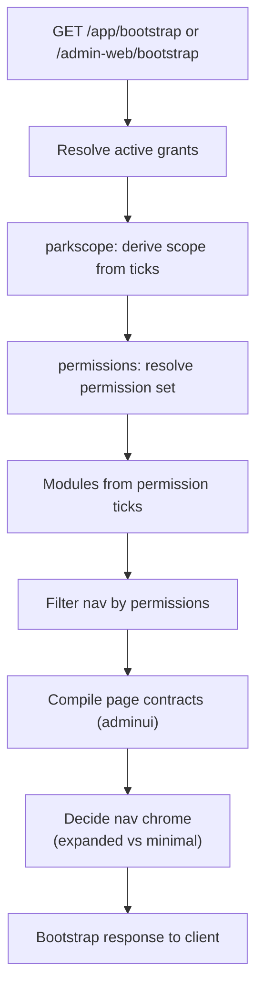

# Workforce, Permissions & Scope

**Module paths:** `backend/internal/workforce/`, `backend/internal/permissions/`, `backend/internal/parkscope/`, `backend/internal/locations/`, `backend/internal/adminui/`
**Generated:** 2026-09-13

---

## What this module is doing

This cluster answers "who is this person, what may they do, and where?" — and then composes the answer into the navigation and page contracts both clients render. It is the identity-and-authority plane for humans, the counterpart to the goat identity spine. `workforce` is the HRMS: operators, their roles, their devices, their capability windows. `permissions` is the RBAC matrix that decides what each role may do. `parkscope` is the single source for *which park* a person works in. `locations` is the org catalog of parks, sheds, and pens. And `adminui` is the compiler that turns all of that into the backend-owned page contracts the admin console renders.

The cluster embodies two of the platform's strongest locks. First, **the backend owns the UI** — nav chrome, module lists, page contracts, and disabled-reasons are computed here from a person's resolved permissions, not decided in the client. Second, **one source for park scope** — a person's park ticks on the People screen are the *only* authored answer to where they work, and their `user_scope_grants` rows plus their home park are *derived* from those ticks in one transaction. Two records once drifted and a Channapatna operator claimed Coimbatore work; parkscope exists so that cannot recur.

---

## Core capabilities

**Operator lifecycle and the bootstrap contract.** `workforce/app/service.go` manages operators, grants, capabilities, and devices, but its centerpiece is `Bootstrap` (`:491`), which assembles a person's entire startup contract: resolved grants, phone modules (from per-person permission ticks, not department grants — a 2026-08-27 decision), permission-filtered navigation, module badge counts, feature flags, nav chrome (expanded drawer for 2+ modules, minimal bottom bar for one), and even the farm's feed-and-water-removal cutoff time.

**Page-grain access.** `permissions` carries a `ModulePages` catalog and resolves a person's admin-web sidebar as exactly the pages ticked for them on the People screen (`PageAccessForAssignments`, migration 000220). An empty page list means *every* page of the module — so a screen shipped tomorrow reaches whoever already holds the module — and the catalog is asserted against the real navigation so a leaf can never ship un-withholdable.

**One-source park scope.** `parkscope` derives grant rows from People-screen ticks via `WritePersonScope`/`SyncGrantScope`/`ReconcileUser` in the same transaction: tenant mode writes one row per role, parks mode one row per role per ticked park, and stale rows are revoked. Tenant-only roles (CEO, verifier, directors) are refused parks mode; a park-only person is refused tenant mode (the operator-scope invariant).

**Capability-gated page contracts.** `adminui/app/compiler.go` compiles page contracts off named permission constants, so role differences come only from permission-gated endpoints and capability-driven controls — never a role-string conditional inside a component (a 2026-08-12 STG incident lock). The verifier lens composes a separate workspace from the verification category registry.

---

## Key components

| Component | File path | Responsibility |
|-----------|-----------|----------------|
| `Bootstrap` | `backend/internal/workforce/app/service.go:491` | Assembles the full startup contract |
| `OperatorProfile` / `GrantSummary` | `backend/internal/workforce/domain/types.go` | Person identity + role/scope grants |
| `ModulePages` / `PageAccessForAssignments` | `backend/internal/permissions` | Page-grain sidebar resolution |
| `SyncGrantScope` | `backend/internal/parkscope` | One-source derivation of scope grants |
| page contract compiler | `backend/internal/adminui/app/compiler.go` | Capability-gated page contracts |
| verifier lens | `backend/internal/adminui/app/verifier_lens.go` | Separate verifier workspace |

---

## Internal data flow

The characteristic flow is bootstrap: a device asks who it is, and the cluster composes the whole contract from grants, ticks, and permissions.

The step that prevents the most bugs is "modules from permission ticks": keying phone modules on the person's explicit `operator` grant rather than on a role or a raw permission avoids silently handing a module to every future holder of a job — a mistake that was caught precisely because a pre-existing role-matrix test went red.

---

## Key interfaces and extension points

The cluster's extension seams are the permission catalog and the page catalog. A new permission is a named constant in `permissions.go`; a new page is a `ModulePages` row asserted against the real nav (`TestEveryNavLeafIsATickablePage`). The compiler reads these, so a new capability-gated control is authored once and rendered by both clients. The `parkscope` package is the *only* writer of scope grants (`TestGrantScopeHasOneWriter`), so adding a scope rule means changing the derivation, never inserting a grant row directly.

---

## Interaction with other modules

| Module | Direction | Interface | Notes |
|--------|-----------|-----------|-------|
| all HTTP handlers | consumed by | permission gates | Every route is independently permission-checked |
| admin-web / android | produces to | bootstrap + page contracts | Clients render these verbatim |
| vaccination | reads | workforce positions | Drive operator pool = active workforce, home park |
| notification | reads | designated positions | Audience resolution by job title |
| locations | reads from | park/shed/pen catalog | Scope validation, operational location display |

---

## Cross-module collaboration scenarios

**In the founder-visibility invariant**, the five platform-owner leadership accounts must be granted `ceo_internal`, tenant scope, and every visible module in local/staging/production seed paths, and a seed is incomplete until the grant is *materialized* as an active `user_scope_grants` row plus an active `workforce_members` profile — not merely pending — because the mobile `/app/bootstrap` hard-requires a profile row and returns `operator_profile_missing` without one.

**In vaccination operator assignment**, the drive operator pool reads `workforce_positions` with a non-director tier rather than the RBAC role, so a tenant `operator` grant layered on a director (via the per-person grants list) does *not* add that person to the vaccination operator pool — authority and operational assignment are separated deliberately.

---

## Performance considerations

Bootstrap resolves grants, capabilities, and page access in batched reads rather than per-module round trips, and module badge counts come from an injected badge source. Page-access resolution reads the stored ticks (`person_page_access`) rather than recomputing a lens per request, and fails *open* on absence or error — the sidebar is a convenience, and every route behind it is independently permission-gated, so the 403 is the real lockout.

## Implementation highlights

The cluster's best idea is that authority is *authored once and derived everywhere*. Park scope is derived from People-screen ticks by a single writer; the sidebar is derived from page ticks with "empty means all"; and the whole UI contract is compiled from named permissions rather than hand-written per role. This eliminates the drift that plagues access systems — where the editor advertises access the sidebar hides, or a role conditional leaks a filter to the wrong person — by making the authored tick the one source and everything visible a computed consequence of it.
