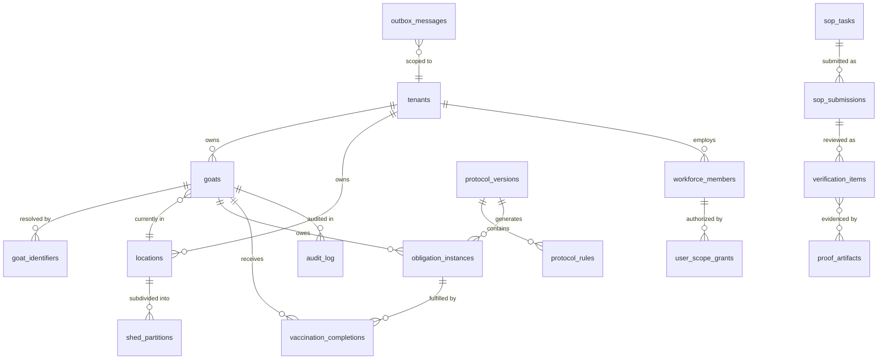

# Database Overview

Goat OS is a database-centric system in the most literal sense: PostgreSQL is not a cache or a convenience under the application — it is where the farm's truth lives, and the transactional guarantees it provides are load-bearing for the whole architecture. Nearly every design decision elsewhere in the platform ("a state change and the read model it owns commit together," "the outbox row is written in the same transaction as the business row," "the obligation sweep holds a per-tenant advisory lock") is ultimately a statement about how the code uses this database. There is no ORM; every query is hand-written SQL, and every hot query is plan-checked so a sequential scan on a large table is caught before it ships.

The schema is large and evolves by strict forward migration. There are **273 migration files** under `backend/migrations/postgres/` (from `000001_goatos_clean_slate_baseline.sql` through `000298_pen_visit_is_the_last_step.sql`), defining roughly **267 tables** and **53 views**. A migration is never edited once applied — staging records migration checksums and refuses to start if an earlier file changed — so the numbered forward-only sequence is itself part of the safety model.

## Statistics summary

The counts below give a sense of the schema's size and where its weight sits. The table distribution mirrors the module map almost exactly, which is the point: each module owns its own tables, and the database's shape *is* the domain's shape.

| Object type | Count |
|-------------|-------|
| Migration files | 273 |
| Tables | ~267 |
| Views (incl. `ceo_ai.*` reporting) | 53 |
| Schemas | `public`, `ceo_ai` (read-only reporting), `analytics` |

The largest table families, by name prefix, track the largest modules:

| Family | Tables (approx.) | Owning domain |
|--------|------------------|---------------|
| `feed_*` | 26 | Feed direction, config, purchases |
| `vaccination_*` | 15 | Vaccination completions, capacity, anchors, rollups |
| `workforce_*` | 14 | HRMS roster, devices, clock, leave |
| `weighing_*` | 13 | Campaigns, observations, fasting |
| `sop_*` | 9 | SOP library, tasks, submissions |
| `procurement_*` | 9 | Loads, cost lines, vendors |
| `person_*` | 9 | Per-person access + park scope |
| `goat_*` / `identity_*` | 18 | Identity spine, identifiers, events |
| `health_*` | 9 | Cases, protocols, sessions |
| `counts_*` / `shifting_*` | 12 | Herd projection, movements |

## The identity and operational spine

Before the ER diagram, it helps to name the handful of tables that everything else hangs off. `tenants` is the top of every scope. `goats` is the animal record; `goat_identifiers` resolves any tag to a goat; `locations` is the park/shed catalog and `shed_partitions` the pen catalog. `workforce_members` and `user_scope_grants` are the person and their authority. `protocol_versions` and `protocol_rules` are the authored vaccination rulebook, from which `obligation_instances` (due work) and then `vaccination_completions` (done work) descend. `sop_tasks` and `sop_submissions` carry field execution; `verification_items` carry the proof review; `proof_artifacts` are the media; and `outbox_messages` plus `audit_log` are the cross-cutting event and audit spine.

## Entity relationship diagram (core spine)

The diagram shows the central relationships every other table connects to. It is deliberately the *spine*, not all 267 tables — the goal is to make the shape of the domain legible, from a tenant down through a goat's identity, its authored rules, its due work, and the proof that closes that work.

The one relationship worth reading twice is `protocol_versions → obligation_instances → vaccination_completions`: it is the "generation, not scheduling" chain made concrete. An authored version generates due obligations; each accepted completion fulfills one and mints the next. The schedule is a computed consequence of the rules, stored as rows.

## Core tables

### goats

The animal record — the row every other fact points at. It carries identity, classification, lifecycle, and current location, and a `row_version` for optimistic concurrency (`backend/migrations/postgres/000001_goatos_clean_slate_baseline.sql`).

| Column (selected) | Type | Notes |
|-------------------|------|-------|
| `goat_id` | uuid | PK |
| `tenant_id` | uuid | Scope |
| `display_id` | text | Human `G-…` id |
| `species` / `breed` / `sex` | text | Classification |
| `age_band` / `management_stage` | text | Cohort tags (one stage per shed) |
| `lifecycle_status` / `reproductive_status` / `health_status` | text | State |
| `current_location_id` | uuid | FK → `locations` |

### goat_identifiers

Resolves any tag or id to one goat; an animal may carry more than one active RFID, which is exactly why weighing's same-animal keying reads this table.

| Column (selected) | Type | Notes |
|-------------------|------|-------|
| `identifier_id` | uuid | PK |
| `goat_id` | uuid | FK → `goats` |
| `identifier_type` / `identifier_value` | text | e.g. `animal_identifier_1`, RFID |
| `normalized_value` | text | Matching key |
| `status` | text | `active` / `disputed` / `duplicate` / `invalid` |

### obligation_instances

The due-work engine's row. Deterministic identity per (goat, rule, sequence) per open window, with a full work-state lifecycle.

| Column (selected) | Type | Notes |
|-------------------|------|-------|
| `obligation_id` | uuid | PK |
| `protocol_version_id` / `rule_id` | uuid | Source rule |
| `target_id` | uuid | The goat |
| `batch_id` | uuid | Drive batch |
| `due_at` / `window_start` / `window_end` | timestamptz | Business-day-derived |
| `status` | text | scheduled/due/…/completed |
| `idempotency_key` | text | Dedup |

### verification_items

The cross-module proof-review row, carrying the source reference and media refs.

| Column (selected) | Type | Notes |
|-------------------|------|-------|
| `item_id` | uuid | PK |
| `vertical` / `module` / `category` | text | Which producer / queue |
| `source_ref_type` / `source_ref_id` | text/uuid | The producer's record |
| `media_refs` | jsonb | Proof clip references |
| `status` | text | pending/approved/rejected/withdrawn |
| `park_id` / `shed_id` | uuid | Verifier shed filter |

### outbox_messages

The transactional event spine — written in the same transaction as the business row it announces, then relayed to Pub/Sub.

| Column (selected) | Type | Notes |
|-------------------|------|-------|
| `outbox_id` / `event_id` | uuid | Identity |
| `event_type` / `schema_version` | text | Contract |
| `aggregate_type` / `aggregate_id` | text/uuid | What changed |
| `topic` / `payload` / `headers` | text/jsonb | Delivery |
| `idempotency_key` / `status` | text | Dedup + relay state |

## Read models and reporting views

Beyond the canonical tables, the schema carries derived read models (materialized on write, e.g. `vaccination_eligibility_rollups`, counts projection tables) and a dedicated `ceo_ai.*` reporting schema of about twenty views — `ceo_ai.vaccination_obligations_base`, `ceo_ai.feed_adherence`, `ceo_ai.procurement_pipeline`, `ceo_ai.mortality_base`, and peers. These reporting views are consumed only by the leadership assistant and Cube; a core operational read path is forbidden by guard from joining them, because that coupling once took Control Tower down when the schema was absent. For the current 5k–50k scale envelope, most operator screens read canonical indexed SQL directly rather than a projection table, with the projection topology reserved as a future scale-out step.

## Integrity, migration, and scale discipline

Three disciplines govern how this database is changed and used. First, **forward-only migrations** — never amend an applied file; ship the next numbered migration, because staging verifies checksums and a change to an applied file blocks startup. Second, **migration/seed coupling** — a migration that touches identity, HRMS, protocol, obligation, or a read-model table must update its matching seed in the same change (`make seed-migration-guard`), so source rows never seed correctly while the app reads an empty projection. Third, **query-plan proof** — hot and large-table queries carry plan validation (`make validate-sqlc-plans`, `validate-hot-index-migrations`) so an index-less predicate is caught at build time; the envelope requires proof up to roughly 500k obligation rows now, with 1–5M as the future certification bar. Together these keep a 267-table, 273-migration schema evolvable without the drift and lock-storms that usually accompany a database this size.
