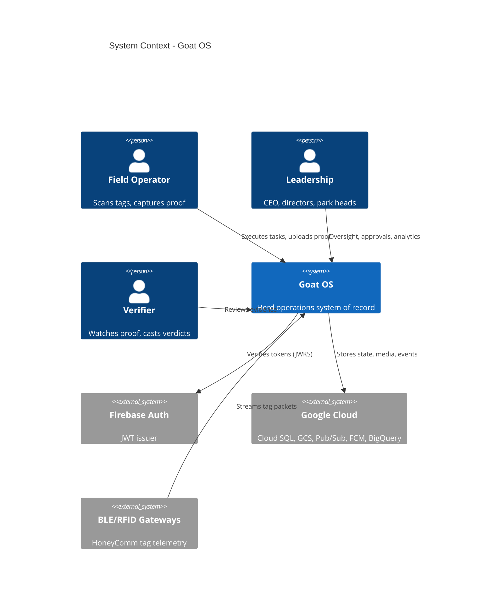
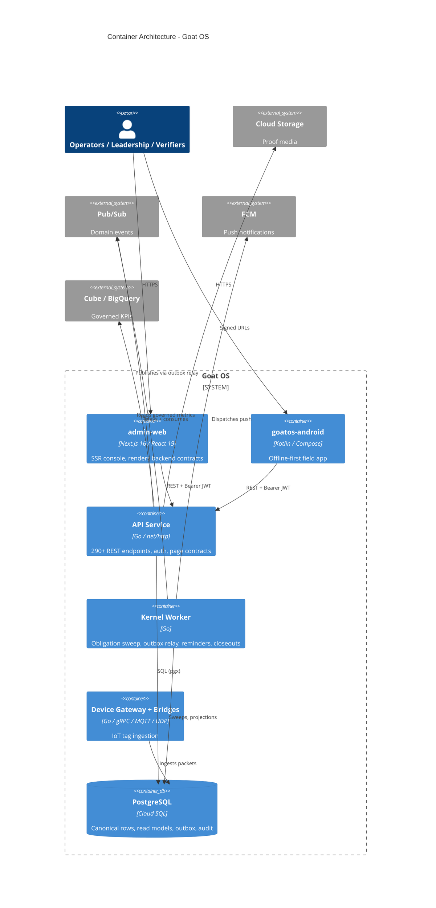
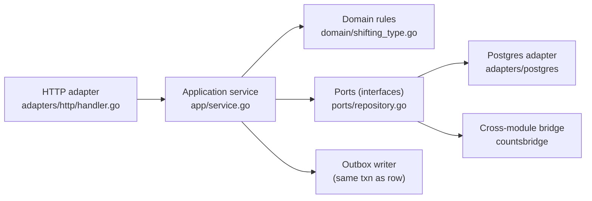
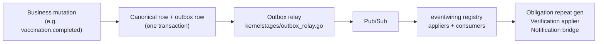
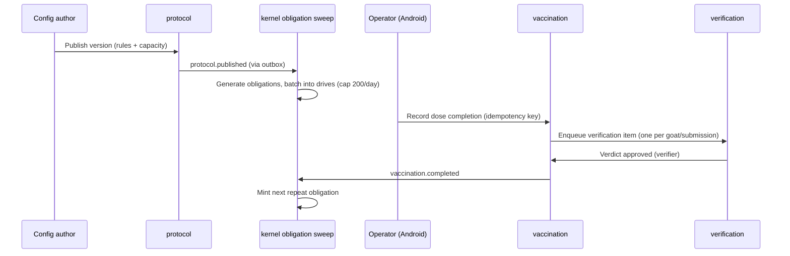
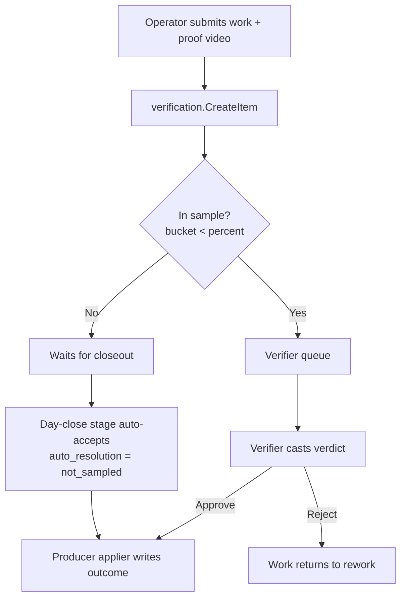

# System Architecture: Goat OS

**Version:** 1.0
**Classification:** Internal architecture document
**Generated:** 2026-09-13

---

## 1. Architecture overview

Goat OS is, at heart, one backend that models a farm as a stream of business events flowing through a shared task/ticketing kernel, plus two thin clients that render whatever contract the backend hands them. Everything below is a consequence of that sentence. If you understand why the backend owns the contract and why every module plugs into the same kernel chain, the ~50 Go packages, the 267 database tables, and the two frontends stop looking like a sprawl and start looking like variations on one theme.

### 1.1 Design philosophy

Four principles do most of the load-bearing work in this codebase. Each one exists because its absence caused a real, recorded incident.

**1. Hexagonal isolation per module (ports & adapters).** Every business module — `identity`, `vaccination`, `counts`, `feed`, and so on — is laid out identically: a `domain/` package of pure business rules that knows nothing about HTTP or SQL, an `app/` package of application services that orchestrate use-cases, a `ports/` package of interfaces (the "shape of the outside world" the module needs), and an `adapters/` package with the concrete Postgres, HTTP, and cross-module implementations. Think of `domain/` as the recipe and `adapters/` as the kitchen: you can swap ovens without rewriting the recipe. This is why the domain rules are unit-testable without a database, and why a new delivery channel (say, a gRPC device gateway) is an added adapter, not a rewrite.

**2. The backend owns the contract; clients are renderers.** This is the single most important rule in the system, stated in `AGENTS.md` as the "golden frontend rule." Navigation, page titles, table columns, filter options, chips, empty-state copy, and disabled-reasons all come from `/app/bootstrap` (mobile) and `/admin-web/bootstrap` (web). The clients own layout, CSS, and local open/closed state — nothing more. The payoff is that the same business fact renders identically everywhere, and product changes ship without an app release. The cost — which the team accepts deliberately — is that adding a screen means authoring a page contract in Go, not just writing JSX.

**3. Compute-on-write, never compute-on-read.** Derived state is materialized when data changes and served by an indexed lookup. A "god CTE" that rebuilds a dashboard from raw event tables per request is banned in `backend/internal/**` and enforced by `make scale-guard`. The one recorded exception is the 5k–50k envelope, where a handful of Calendar/vaccination screens read canonical indexed SQL directly with an explicit `// scale-guard:ignore` annotation — a deliberate, documented trade, not a loophole.

**4. Honesty over convenience.** A cross-surface number disagreement is a maintainer question, not a client patch. Proof-upload success is not business success — the green state waits for the actual business write. Weighing may not learn what animal a tag belongs to on the write path. These aren't style preferences; each is a lock with a machine guard, because each was violated once and cost real trust in the numbers.

### 1.2 Core architectural patterns

The system is not a single pattern but a composition of a few, each applied where it fits. The table names the pattern, how it shows up in the code, and the problem it solves — because a pattern without its motivating problem is just ceremony.

| Pattern | How it is implemented | What problem it solves |
|---------|----------------------|------------------------|
| Hexagonal / ports-and-adapters | `domain` / `app` / `ports` / `adapters` in every module (e.g. `backend/internal/counts/`) | Keeps business rules pure and testable; makes vendors and delivery channels swappable |
| Event-driven with transactional outbox | Business row + `outbox_messages` written in one txn; relay publishes to Pub/Sub; one consumer registry (`backend/internal/eventwiring/appliers.go`) | Cross-module coordination that survives retries and never silently drops an event |
| Operational task kernel | The golden chain, run by one worker (`backend/cmd/kernel-worker`) | Every module gets owner/clock/escalation/proof/verification/rollup for free, consistently |
| CQRS-flavored read models | Producers write canonical rows; read screens query indexed projections or canonical SQL | Separates the write model's correctness from the read model's shape and speed |
| Contract-driven UI | `/app/bootstrap`, `/admin-web/bootstrap`, per-page `AdminWebPageContract` | One source of truth for every visible label; identical numbers across surfaces |
| Idempotent writes | Idempotency key + request fingerprint persisted with side effects | Safe retries from a flaky phone network; exact replay returns the original result |

### 1.3 Technology stack in brief

The backend is Go 1.25 built as static binaries (one API service, one consolidated kernel worker, plus focused command-line tools under `backend/cmd/`). Persistence is PostgreSQL through the `pgx/v5` driver with hand-written SQL and sqlc plan validation — no ORM, because every hot query is plan-checked against a large-row target. Cross-module events ride a transactional outbox into Google Pub/Sub and Cloud Tasks. Proof media lives in Google Cloud Storage and is only ever moved by explicit user action. Analytics flow to BigQuery and are governed through Cube. Authentication is Firebase-issued JWT verified via JWKS. The admin console is Next.js 16 / React 19 with server-side rendering; the field app is native Kotlin + Jetpack Compose across 22 Gradle modules. Observability is OpenTelemetry throughout the backend and Grafana Faro / Firebase Crashlytics on the clients.

---

## 2. System context (C4 Level 1)

The system boundary is deliberately narrow: humans and IoT gateways on the outside, one backend on the inside, and Google Cloud services underneath. Every arrow into a datastore originates at the backend.

---

## 3. Container view (C4 Level 2)

Zooming in one level, Goat OS is a small number of deployable containers. The critical split is between the **API service** (synchronous, request/response, latency-budgeted) and the **kernel worker** (asynchronous, time-driven, the beating heart of the task chain). They share the same database and the same domain code but run on different clocks.

### 3.1 Domain module responsibilities

The backend's `internal/` tree is organized by business capability, grouped here using domain-driven design into core domains (which directly create business value), supporting domains (which give the core its technical backbone), and generic domains (shared infrastructure). Reading the grouping tells you where value concentrates and where to look first.

The table below is the map most worth keeping open while reading the code. Each row's key abstraction is the type or service you would grep for first.

| Module | Path | Responsibility | Key abstraction |
|--------|------|----------------|-----------------|
| identity | `backend/internal/identity` | Goat passport lifecycle: create, move, exit, stage, reproductive | `GoatPassport`, `Repository` |
| passport | `backend/internal/passport` | Read-only vaccination story aggregator | `Passport`, `DueItem` |
| vaccination | `backend/internal/vaccination` | Dose completions, acceptance, anchors, impact preview | `NewCompletion`, `EligibleGoat` |
| obligation | `backend/internal/obligation` | Due-date & work-state engine, drive batching, capacity | `NewObligation`, `NewBatch` |
| protocol | `backend/internal/protocol` | Versioned vaccination rulebook + capacity + clinical defers | `Version`, `RuleDimension` |
| vaccinationexecution | `backend/internal/vaccinationexecution` | Real-time execution cards, command board, live tracker | `ExecutionRow`, `ShedCardSummary` |
| pccare / penvisits | `backend/internal/pccare`, `penvisits` | Deworming/trimming tasks; next-day pen visit verification | `Task`, capture modes |
| weighing / growthdirector | `backend/internal/weighing`, `growthdirector` | Scan-and-submit weighing; ADG analytics | `Campaign`, `GrowthADGHeadline` |
| feed* | `backend/internal/feeddirection`, `feedconfig`, `feed`, `feedwaterremoval` | Ration grid → per-session quantities; packing/transport/distribution gates | `DirectionRow`, `ItemQuantity` |
| counts / countsbridge | `backend/internal/counts`, `countsbridge` | Herd projection, births/deaths/shifting approvals, pen reconciliation | `ShiftingEvent`, `ProjectionSnapshot` |
| health | `backend/internal/health` | Versioned treatment protocols + clinical cases + sessions | `Protocol`, `WorkItem` |
| procurement / sales / inventory / toxin | `backend/internal/procurement`, `sales`, `inventory`, `toxin` | Inbound loads + landed cost; vendor register + sales; aflatoxin testing | `Load`, `Task` (7-step) |
| verification / verificationcatalog / proof / media | `backend/internal/verification`, ... | Cross-module verdict queue, sampling, proof media | `Item`, `Verdict`, `ProofArtifact` |
| kernelstages / tasks / calendar / notification* | `backend/internal/kernelstages`, ... | The operational kernel: sweeps, reminders, escalations, calendar read model | kernel stages, `Request` |
| workforce / permissions / parkscope / locations / adminui | `backend/internal/workforce`, ... | HRMS roster, RBAC, park scope, org locations, page contracts | `OperatorProfile`, `GrantSummary` |
| herdsignals / devices | `backend/internal/herdsignals`, `devices` | BLE/RFID telemetry ingestion + gateways | `Packet`, `Gateway` |
| ceoai / analytics_export / appconfig | `backend/internal/ceoai`, ... | Read-only leadership assistant + analytics egress + tenant config | `Answer`, Cube route |
| sop / forms / submissions | `backend/internal/sop`, `forms`, `submissions` | SOP library + form DSL engine + submissions | `SOPVersion`, form DSL |

---

## 4. Component view (C4 Level 3)

### 4.1 The anatomy of a module

Because every module shares the same internal shape, understanding one teaches you all of them. The diagram uses `counts` as the exemplar: a request enters through an HTTP adapter, the application service orchestrates the use-case using domain rules, and persistence + cross-module coordination happen only through ports fulfilled by adapters. Nothing in `domain/` imports anything from `adapters/`.

The rule that makes this safe is that dependencies point inward: adapters depend on ports, ports are defined by the module that needs them, and the domain depends on nothing. A boundary guard (`tools/agent-hooks/check-boundaries.sh`) even forbids hand-rolling a logger with `slog.New` outside the platform observability package, keeping the edges clean.

### 4.2 The event spine

The second cross-cutting component is the domain-event spine. When a module mutates state, it writes an `outbox_messages` row inside the same transaction. The kernel worker's outbox relay drains those rows and publishes to Pub/Sub; a single consumer registry (`backend/internal/eventwiring/appliers.go`) wires every applier and workflow consumer once, and that same registry is used by the in-process API bus, the outbox relay, and the Pub/Sub consumer. This "one registry, three buses" design exists specifically to prevent the recorded incident where feed and shifting verdicts were wired on one bus but not another and silently stranded.

---

## 5. Key flows

### 5.1 A vaccination dose, end to end

This sequence shows the golden chain concretely. A protocol publish generates obligations; the kernel sweeps them into drives; the operator records a dose; a verifier accepts it; and acceptance mints the next repeat obligation, closing the loop.

### 5.2 Proof and verification with sampling

The verification flow adds a scaling twist: the CEO sets a sampling percentage per category. Drawn items reach the verifier; undrawn items auto-accept at day close, so the work never stalls waiting on a human who was never going to watch that video.

---

## 6. Technical implementation

### 6.1 Concurrency and the single-writer kernel

The kernel worker (`backend/cmd/kernel-worker/main.go`) consolidates roughly seventeen formerly separate scheduled jobs into one binary with independent cadences: obligation sweep every 5 minutes (180s budget), outbox relay and notification dispatch each per minute, an operational lane every 5 minutes (reminders, inventory reconcile, feed lifecycle, weighing kernel, pen visits), generation hourly, and housekeeping hourly. The obligation sweep holds a **per-tenant advisory lock** so it is the single writer for a tenant's batches — this is what lets it order vaccines by priority and resolve shot-cap ties deterministically without two sweeps racing. Reminder cadence advances a keyset cursor and *claims* fires that produce at least one notification, deferring unclaimed fires to the next tick rather than re-sending.

### 6.2 Idempotency and atomic read-model sync

Every mutating path accepts or derives a stable idempotency key, persists that key with a request fingerprint in the same transaction as the side effects, and returns the original result on exact replay. A closely related rule: a state transition and any read model it *owns* commit together. The canonical example is protocol publish, which upserts and parity-checks `vaccination_capacity_config` inside the publish transaction and rolls the whole publish back on a mismatch (`PublishVersionWithCapacity`). A best-effort post-commit sync is allowed only as a replay fallback, never as the first-commit path.

### 6.3 Performance strategy

Hot operator and SSR reads carry a hard budget of p90 ≤ 300ms and p95/p99 ≤ 500ms, checked by `tools/perf/api-latency-policy.mjs`. The strategy to meet it is never "raise the limit" — it is to fix the serving shape: a narrow endpoint for the screen's grain and window, an indexed keyset query, or an accepted read model. Pagination is keyset/cursor everywhere; OFFSET on a growable offset is banned; and mobile lists fetch about twenty rows per page. Burst caches are permitted only for read-only analytics summaries, keyed by tenant, authorized parks, window, and filter shape.

---

## Appendix: Architecture decision records (inferred)

**ADR 1 — Backend owns the UI contract.**
*Decision:* Navigation, labels, page contracts, and disabled-reasons are composed by the backend; clients render them. *Rejected alternative:* client-owned copy and per-role frontend conditionals. *Why:* an STG incident (2026-08-12) showed role-string conditionals leaking oversight filters to the wrong role; capability-gated contracts fixed it. *Consequence:* new screens require a Go page contract, but numbers stay consistent across surfaces and product changes ship without an app release.

**ADR 2 — One consolidated kernel worker for the 5k–50k envelope.**
*Decision:* Collapse ~17 scheduled Cloud Run Jobs into one modular worker; serve screens from canonical indexed SQL instead of projection tables. *Rejected alternative:* keep per-job topology and projection tables. *Why:* at the current scale the projection maintenance cost and job sprawl outweigh their benefit (`docs/decisions/operational-kernel-5k-50k-scale-envelope.md`). *Consequence:* simpler operations now; the 1–5M topology is a documented future certification, not a present requirement.

**ADR 3 — Weighing is isolated from the herd on the write path.**
*Decision:* Weighing reads no other module's schema on write; five reporting reads are file-scoped exceptions. *Rejected alternative:* resolve the scanned tag to a goat during capture. *Why:* a 2026-08-04 defect shipped a `LEFT JOIN goat_identifiers` on an ADG read; free-flow capture must never be gated on identity. *Consequence:* weighing cannot reject an unknown tag (correct — it counts it), and cross-dimension reporting lives behind a guard-allowlisted set of files.

**ADR 4 — Verifier-only verdict authority.**
*Decision:* `verification.verdict` is granted to the verifier alone; leadership keeps read + act but cannot sign. *Rejected alternative:* let CEO/CxO also cast verdicts for visibility. *Why:* an independent check the checked party can approve is not independent; the visibility invariant is satisfied by the read. *Consequence:* toxin testing needed its own CEO/CxO approval gate (deliberately not a verification category) to keep this line intact.
